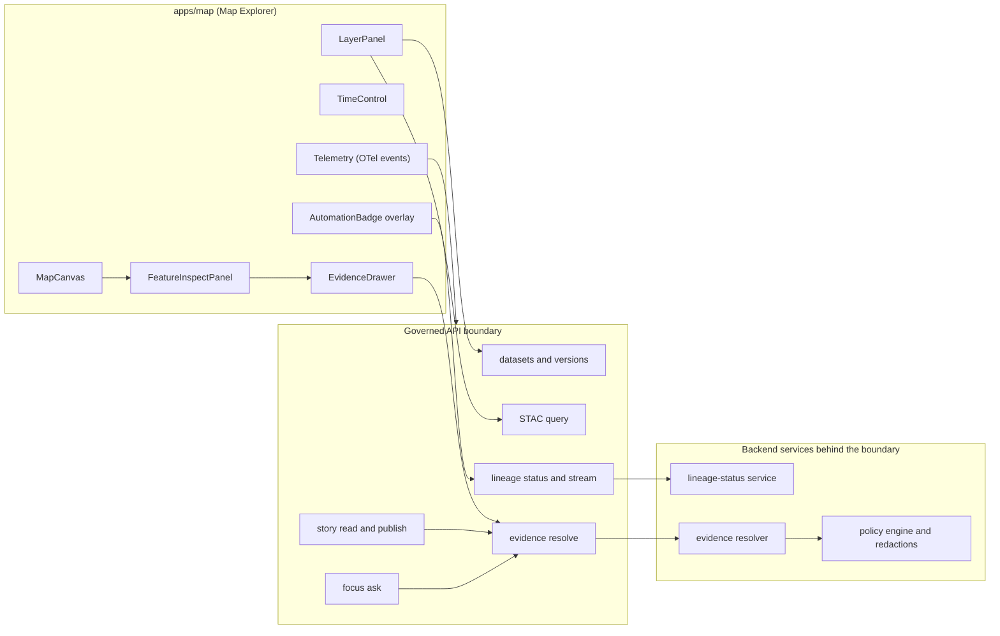

<!-- [KFM_META_BLOCK_V2]
doc_id: kfm://doc/e2a02112-380b-429a-ab6e-39a0e3ab5965
title: apps/map — Map Explorer (MapLibre)
type: standard
version: v1
status: draft
owners: TBD
created: 2026-02-23
updated: 2026-02-23
policy_label: public
related:
  - ../../docs/ARCHITECTURE.md # TODO: verify path
  - ../../docs/GOVERNANCE.md   # TODO: verify path
  - ../../docs/API_CONTRACTS.md # TODO: verify path
tags: [kfm, map, maplibre, ui, provenance, governance, trust-membrane]
notes:
  - This README documents the intended responsibilities, contracts, and governance invariants for the Map Explorer app.
  - Repo commands/paths are intentionally written as "check package.json / workspace scripts" because the monorepo toolchain is not confirmed here.
[/KFM_META_BLOCK_V2] -->

# Map Explorer (apps/map)
**KFM’s primary 2D map client — a MapLibre-powered, governed UI that renders datasets *with visible trust surfaces* (policy, versioning, provenance, and automation status).**


---

## Quick navigation
- [Purpose](#purpose)
- [What belongs here](#what-belongs-here)
- [Architecture](#architecture)
- [Trust surfaces and governance invariants](#trust-surfaces-and-governance-invariants)
- [API contracts this app expects](#api-contracts-this-app-expects)
- [Automation status badges](#automation-status-badges)
- [Development](#development)
- [Testing and CI](#testing-and-ci)
- [Telemetry](#telemetry)
- [Accessibility](#accessibility)
- [Directory guide](#directory-guide)
- [Definition of Done](#definition-of-done)

---

## Purpose
Map Explorer is the default “Map Explorer” experience in KFM: explore layers, filter by time, inspect features, and open **Evidence/Provenance** details for any layer or story claim.

This app is a **governed client**:
- it renders what the governed API returns,
- it does **not** embed privileged credentials,
- and it makes governance visible (policy notices, evidence, version labels) instead of hiding it.

### Why this exists
KFM treats maps as *evidence experiences*, not just visualization. Map state (camera, layers, time window, filters) is stored with Story Nodes so a story can replay the same view and so Focus Mode can answer in the context of the current view state.

[Back to top](#quick-navigation)

---

## What belongs here

### ✅ Acceptable inputs
- UI code for the Map Explorer experience (MapLibre view, panels, drawers, overlays).
- Contracts consumed by the map UI (typed clients, schema-validated fixtures).
- Adapter logic that binds shared UI packages (e.g., automation badges) into MapLibre.
- E2E fixtures that validate reproducible views (camera paths, snapshots, deterministic layer setups).

### 🚫 Exclusions
- **No direct database / object-store access.** All data access goes through governed APIs.
- **No client-side provenance verification.** Signature verification and policy decisions happen server-side.
- **No “secret” credentials in the browser.** Use standard auth flows + server mediation.
- **No bypass paths** (dev-only hacks that skip policy filtering or evidence resolution).

[Back to top](#quick-navigation)

---

## Architecture

### High-level dataflow (trust membrane)


### Core UI components (expected)
The Map Explorer experience typically includes:
- **MapCanvas** (MapLibre GL surface)
- **LayerPanel** (toggle, opacity, legend, policy badge, data version)
- **TimeControl** (time range selection; optionally includes histogram)
- **SearchBar** (places, datasets, story nodes)
- **FeatureInspectPanel** (attributes + citations entry points)
- **EvidenceDrawer** (shared component used across Map, Stories, Focus Mode)

> [!NOTE]
> Names above reflect the *intended* buildable component set. Match them to your repo’s actual components when implementing.

[Back to top](#quick-navigation)

---

## Trust surfaces and governance invariants

### Trust surfaces (required)
These are user-visible governance contracts. Treat them as “must have,” not polish:
- **Automation status badges** on layers or features (healthy/degraded/failing).
- **Evidence/Provenance drawer** accessible from layers and story claims.
- **Data version label** per layer, linking to DatasetVersion catalogs.
- **Policy notices** at time of interaction (example: geometry generalized due to policy).
- **“What changed?”** comparisons between DatasetVersion diffs (counts, checksums, QA metrics).

### Evidence drawer minimum contract
At minimum, the evidence drawer should show:
- Evidence bundle ID and digest
- DatasetVersion ID and dataset name
- License and rights holder (with attribution text)
- Freshness (last run timestamp) and validation status
- Provenance chain (run receipt link)
- Artifact links **only if policy allows**
- Redactions applied (obligations)

**Publishing must fail closed** if citations/evidence refs can’t be resolved. The UI should call an evidence resolver as part of story publish checks.

### Abstention and restriction UX
Abstention is a feature. The UI must:
- explain “why” in policy-safe terms,
- suggest safe alternatives (broader time range, public datasets),
- provide an `audit_ref` for steward review,
- and **never** reveal restricted existence via “ghost metadata” unless policy allows.

[Back to top](#quick-navigation)

---

## API contracts this app expects
> [!IMPORTANT]
> Endpoint paths may be versioned (e.g., `/api/v1/...`) depending on your API gateway. Keep the *shape* stable and validate responses.

| Capability | Typical endpoints | Notes |
|---|---|---|
| Dataset discovery | `GET /api/v1/datasets` | Returns datasets + versions; policy filtered server-side |
| STAC search | `GET /api/v1/stac/collections`, `GET /api/v1/stac/items` | Query by bbox/time/collection; assets filtered before return |
| Evidence resolution | `POST /api/v1/evidence/resolve` | Resolve evidence refs to bundles; return digest + obligations |
| Story read/publish | `GET/POST /api/v1/story`, `GET/PUT /api/v1/story/{id}` | Publish requires resolvable citations + review state |
| Focus Mode | `POST /api/v1/focus/ask` | Must return citations or abstain + `audit_ref` |
| Lineage / freshness | `GET /api/v1/lineage/status?since=<ts>`, `GET /api/v1/lineage/stream` | Drives automation badges (poll + stream) |

[Back to top](#quick-navigation)

---

## Automation status badges
### UX contract
- Render small health badges on map features (and/or layers) that update near-real time.
- Clicking a badge opens a drawer with run metadata and **verified** provenance links (attestation/SBOM/manifest/logs) via a server proxy.
- Join key: `featureId` in status events maps to the feature `id` (or configured property) in map features.

### Update model
1. Prefer streaming updates (SSE or WebSocket).
2. Fallback to polling (example cadence: every 15s) when streaming is unavailable.
3. Degrade gracefully:
   - if an attestation is missing, still show status,
   - but disable provenance links with a clear explanation.

### Endpoints (gateway may add `/api/v1` prefix)
- Streaming: `GET /api/lineage/stream` (SSE or WebSocket)
- Polling: `GET /api/lineage/status?since=<ts>`

### Event contract (shape)
Use a small, stable JSON schema (validated in CI). The following TypeScript type is an *illustrative* contract shape:

```ts
export type AutomationBadge = {
  featureId: string;
  status: "healthy" | "degraded" | "failing" | "running" | "unknown";
  last_run_ts: string; // RFC3339
  lineage: {
    run_id: string;
    backend: "openlineage" | "prov";
    links: {
      attestation?: string;
      sbom?: string;
      manifest?: string;
      logs?: string;
    };
  };
  extras?: Record<string, unknown>; // e.g., SLO, error rates
};
```

### Security invariant
The browser must **never** fetch or verify untrusted attestations directly. The server must verify attestations (e.g., Cosign/Sigstore) before exposing links.

### Performance target
Badges should render and update within **< 250ms** after event receipt (target), and work in both 2D (MapLibre) and 3D (Cesium) demo apps (shared package + adapters).

[Back to top](#quick-navigation)

---

## Development

### Prereqs (repo-dependent)
This package is expected to live in a monorepo with a root-level toolchain (Node.js + package manager). Because the repo’s toolchain is not confirmed here, use the following approach:

1. From repo root, install dependencies with the repo’s chosen package manager.
2. Find app scripts in `apps/map/package.json` (or workspace equivalent).
3. Run the map dev server via that script.

> [!TIP]
> If your workspace uses package filtering (monorepo), search for “map” scripts at the root (e.g., `dev:map`, `start:map`, or workspace filters).

### Configuration (conceptual)
This app usually needs:
- **API base URL** (governed API gateway)
- **Auth context** (if applicable; never embed privileged secrets)
- **Tile/layer sources** (STAC assets, PMTiles endpoints, or vector tile endpoints)
- **Telemetry exporter settings** (if client-side OTel is enabled)

Document the *actual* environment variable names used by your framework here once confirmed.

[Back to top](#quick-navigation)

---

## Testing and CI

### Recommended test layers
- **Unit tests**
  - Map adapter tests (mock MapLibre APIs)
  - Badge datasource transform tests
  - JSON schema validation on event fixtures (AJV)

- **E2E tests**
  - Playwright camera-path snapshots to verify overlay placement across zoom/tilt
  - Feature click → EvidenceDrawer opens and shows license + version
  - Keyboard navigation coverage for layer list and drawer

> [!NOTE]
> Keep UI tests deterministic: fixed time windows, pinned dataset versions, and stable camera paths.

[Back to top](#quick-navigation)

---

## Telemetry
Emit OpenTelemetry-compatible events/metrics that let us prove the UI meets governance and performance requirements:
- `badge-rendered`
- `status-changed`
- stream latency (time from server event to UI render)
- overlay render time

[Back to top](#quick-navigation)

---

## Accessibility
Minimum accessibility requirements for the Map Explorer experience:
- Keyboard navigable layer controls and EvidenceDrawer; visible focus states
- Text labels for policy badges and status indicators (no color-only meaning)
- ARIA labels for map controls
- Safe markdown rendering for narratives (CSP + sanitization to prevent XSS)
- Exports include citations and `audit_ref` in a readable format

[Back to top](#quick-navigation)

---

## Directory guide
> [!NOTE]
> This directory tree is a **proposed** layout aligned to the buildable UI component set. Adjust to match your repo.

```text
apps/map/
├─ README.md                                  # App overview + run/dev notes + routes + governance constraints
│
├─ src/
│  └─ ui/
│     ├─ components/                          # Map UI components (no network; use shared services layer if applicable)
│     │  ├─ MapCanvas/                        # MapLibre wrapper + lifecycle (mount, style load, resize, cleanup)
│     │  ├─ LayerPanel/                       # Layers/legends + policy badges + version labels
│     │  ├─ TimeControl/                      # Time slider/histogram + temporal filters/playback
│     │  ├─ FeatureInspectPanel/              # Feature attributes + “open evidence” entry points
│     │  └─ EvidenceDrawer/                   # Evidence/provenance drawer (shared UX patterns)
│     │
│     ├─ overlays/                            # Map overlays (MapLibre adapters for feature/UI overlays)
│     │  └─ automationBadges/                 # AutomationBadge overlay adapter (status, signals, callouts)
│     │
│     └─ telemetry/                           # Telemetry emitters (bounded, non-sensitive)
│        └─ otel/                             # OTel event emitters + helpers (badge-rendered, status-changed)
│
├─ e2e/
│  └─ playwright/                             # Camera-path tests + overlay snapshots (scoped, deterministic)
│
└─ public/                                    # Static assets (NO restricted data; small; licensed)
```

[Back to top](#quick-navigation)

---

## Definition of Done
Use this checklist when shipping or refactoring Map Explorer trust surfaces:

- [ ] Automation badges render and update within < 250ms after event receipt (target)
- [ ] Works in MapLibre and shared logic can also power Cesium integration (adapter-based)
- [ ] Schema validation enforced in CI for AutomationBadge (and other UI contracts)
- [ ] Provenance links are verified server-side before being exposed to the UI
- [ ] EvidenceDrawer shows required minimum fields (bundle digest, license, freshness, redactions)
- [ ] Story publishing fails closed if citations cannot be resolved
- [ ] Keyboard navigation and ARIA coverage for core controls and drawers
- [ ] No direct DB/object-store access from the browser; no privileged secrets in client
- [ ] Telemetry emitted for `badge-rendered` and `status-changed` (latency + render time)

[Back to top](#quick-navigation)
