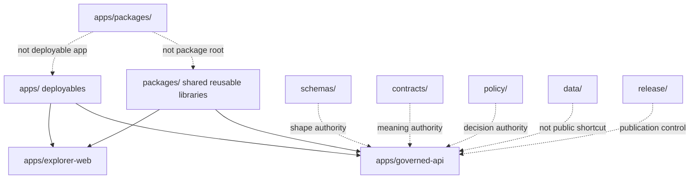

<!-- [KFM_META_BLOCK_V2]
doc_id: kfm://app/apps-packages/readme
title: apps/packages README
type: app-readme
version: v0.1
status: draft
owners: OWNER_TBD — Apps steward · Package steward · Architecture steward · Docs steward
created: 2026-06-16
updated: 2026-06-16
policy_label: public
related:
  - ../README.md
  - ../../packages/README.md
  - ../../docs/doctrine/directory-rules.md
  - ../../docs/architecture/contract-schema-policy-split.md
  - ../../apps/governed-api/README.md
  - ../../apps/explorer-web/README.md
  - ../../packages/api/README.md
  - ../../packages/domains/README.md
  - ../../packages/ui/README.md
  - ../../packages/temporal/README.md
  - ../../data/README.md
  - ../../release/README.md
tags: [kfm, apps, packages, compatibility, drift-guard, shared-libraries, deployables, trust-membrane]
notes:
  - "Replaces an empty README with a bounded drift-guard contract for the unusual apps/packages path."
  - "Shared reusable implementation packages belong under top-level packages/, not under apps/."
  - "This folder must not become a parallel package root, deployable app, schema root, contract root, policy root, lifecycle root, release root, proof root, runtime root, or public UI authority."
  - "Current contents beyond this README, migration intent, imports, build scripts, tests, and deletion/retention decision remain NEEDS VERIFICATION."
[/KFM_META_BLOCK_V2] -->

<a id="top"></a>

<div align="center">

# `apps/packages/`

**Drift-guard README for an unusual path under `apps/`. This folder is not the KFM shared-package root. Shared reusable implementation packages belong at top-level `packages/`; deployable applications belong under `apps/`.**


[Purpose](#1-purpose) · [Repo fit](#2-repo-fit) · [Boundary](#3-authority-boundary) · [Inputs](#5-inputs) · [Exclusions](#6-exclusions) · [Inspection](#11-inspection-path) · [Definition of done](#14-definition-of-done)

</div>

---

> [!IMPORTANT]
> **Status:** draft / `NEEDS VERIFICATION`  
> **Owners:** `OWNER_TBD` — Apps steward · Package steward · Architecture steward · Docs steward  
> **Path:** `apps/packages/README.md`  
> **Responsibility root:** `apps/` — deployable application surfaces  
> **Truth posture:** CONFIRMED README path / CONFIRMED `apps/` deployable-root doctrine / CONFIRMED top-level `packages/` shared-library root / PROPOSED drift-guard contract / UNKNOWN current contents beyond this README, migration intent, imports, tests, and retention decision

> [!CAUTION]
> Do not place reusable package code here by default. `apps/packages/` must not become a shadow `packages/` root, a convenience library bucket, or a way for an app to bypass the governed API, policy, schema, contract, data, release, runtime, or evidence boundaries.

---

## 1. Purpose

`apps/packages/` is treated as an app-root anomaly or compatibility/drift-guard location until current repository evidence proves a narrower accepted purpose.

This README exists to prevent accidental misuse:

- top-level `apps/` is for deployable applications;
- top-level `packages/` is for shared reusable implementation packages;
- `apps/packages/` should not receive new shared libraries, domain helpers, UI components, runtime adapters, schemas, contracts, policy bundles, release artifacts, lifecycle data, or proof material;
- any existing or future content under this path should be inventoried, classified, and either removed, migrated, or justified by an ADR or migration note.

This README does not prove that `apps/packages/` contains implementation files, imports, package metadata, tests, fixtures, build scripts, or runtime behavior.

[Back to top](#top)

---

## 2. Repo fit

| Concern | Owning root | Expected relationship |
|---|---|---|
| Deployable applications | `apps/` | Services, UIs, consoles, CLIs, workers, and app-scoped tests/docs |
| Shared reusable packages | `packages/` | Libraries used by apps, pipelines, tools, tests, and governed UI surfaces |
| This path | `apps/packages/` | Drift guard / compatibility marker until inventory and migration decision are verified |
| Public trust path | `apps/governed-api/` | Sole normal public trust membrane |
| Public UI | `apps/explorer-web/` | Consumer of governed responses, not package root |
| Schemas | `schemas/contracts/v1/` | Machine shape authority |
| Contracts | `contracts/` | Object meaning authority |
| Policy | `policy/` | Admissibility and exposure decisions |
| Lifecycle artifacts | `data/` | Source lifecycle, receipts, proofs, registry, catalog, triplets, and published outputs |
| Release authority | `release/` | Publication, correction, rollback decisions |
| Runtime adapters | `runtime/` | Adapter lane behind governed API |

## 3. Authority boundary

This folder does not own deployable app authority, package authority, schema authority, contract authority, policy authority, lifecycle storage, release authority, proof storage, runtime adapter implementation, UI rendering, source acquisition, pipeline logic, or generated artifacts.

```text
apps/             = deployable application boundaries
packages/         = shared reusable implementation packages
apps/packages/    = drift guard / compatibility marker, not authority
apps/governed-api/ = public trust membrane
schemas/          = machine shape
contracts/        = object meaning
policy/           = policy rules and decisions
data/             = lifecycle artifacts and proof/receipt state
release/          = publication, correction, rollback authority
runtime/          = adapters behind governed API
```

## 4. Default posture

Treat `apps/packages/` as `NEEDS VERIFICATION` and deny new authority by default.

A change should not add or rely on this path unless it answers all of these questions:

- Is this a deployable app? If yes, it should be under `apps/<app-name>/`, not `apps/packages/`.
- Is this shared reusable library code? If yes, it should be under `packages/`.
- Is this app-scoped code? If yes, it should be under the owning app's source tree.
- Is this schema, contract, policy, data, release, runtime, pipeline, connector, tool, or docs content? If yes, it belongs in the matching responsibility root.
- Is there an ADR or migration note proving why `apps/packages/` must exist?
- Is there a rollback or deletion plan if this is drift?

## 5. Inputs

| Input family | Examples | Required posture |
|---|---|---|
| Inventory evidence | file list, imports, package metadata, tests, build scripts | Required before claiming purpose |
| Migration evidence | ADR, migration note, deprecation note, compatibility shim rationale | Required before retaining path |
| App-scoped dependency | code consumed only by one deployable | Move or justify under owning app source tree |
| Shared dependency | code consumed by multiple apps/tools/pipelines | Move or justify under top-level `packages/` |
| Tests or fixtures | app-scoped checks, temporary migration tests | Must not contain sensitive or deployment-only values |
| Documentation | README, migration note, inventory report | Must not imply implementation maturity without proof |

## 6. Exclusions

| Does not belong in `apps/packages/` | Correct home |
|---|---|
| Shared reusable implementation packages | `packages/` |
| Deployable apps, services, UIs, consoles, CLIs, workers | `apps/<app-name>/` |
| App-local implementation source | owning app `src/` tree |
| App-scoped tests | owning app `tests/` tree |
| Schemas and machine-readable shapes | `schemas/contracts/v1/` |
| Contract meaning | `contracts/` |
| Policy bundles and exposure decisions | `policy/` |
| Lifecycle data, receipts, proofs, registry, catalog, triplets, published outputs | `data/` |
| Release decisions, correction notices, rollback cards | `release/` |
| Runtime/model adapters | `runtime/`, behind governed API |
| Source acquisition and ingest adapters | `connectors/`, `pipelines/`, `pipeline_specs/` |
| Repo-wide validators and generators | `tools/` |
| Public UI rendering | `apps/explorer-web/` |
| Public trust path | `apps/governed-api/` |

## 7. Classification map

| Classification | Meaning | Default action | Status |
|---|---|---|---|
| `empty-drift-guard` | Only this README or marker files exist | Keep as warning only, or remove after ADR/migration review | PROPOSED |
| `misplaced-shared-package` | Shared reusable code appears here | Migrate to top-level `packages/` | PROPOSED |
| `misplaced-app-source` | App-local code appears here | Move under owning app source tree | PROPOSED |
| `temporary-compatibility-shim` | Import path retained temporarily for migration | Require ADR/migration note, tests, expiry, rollback plan | PROPOSED |
| `unknown` | Purpose cannot be proven | Quarantine by documentation; do not expand | PROPOSED |

## 8. Diagram



## 9. Compatibility posture

If `apps/packages/` is retained for compatibility, it should be treated as a temporary shim, not a source of truth.

A compatibility use must document:

- why a temporary path is needed;
- what imports or build paths rely on it;
- whether any public route or UI code depends on it;
- what tests prove the shim does not bypass governed interfaces;
- the target owning root;
- removal criteria and rollback plan;
- owner and review date.

## 10. Obligations

| Obligation | Example effect |
|---|---|
| `no_shadow_package_root` | Top-level `packages/` remains the shared-library root |
| `no_deployable_identity` | `apps/packages/` is not an app, service, UI, worker, or CLI |
| `no_public_trust_path` | Public trust traffic still transits `apps/governed-api/` |
| `no_lifecycle_shortcut` | No public client or app reads lifecycle/canonical stores through this path |
| `no_policy_shadow` | Policy stays under `policy/` |
| `no_schema_contract_shadow` | Schemas and contracts stay under their roots |
| `no_release_shadow` | Release decisions stay under `release/` |
| `inventory_required` | Any non-README content requires classification and owner |
| `migration_required` | Misplaced code should be moved to its owning root |
| `rollback_required` | Temporary compatibility requires a removal path |

## 11. Inspection path

Current contents beyond this README, imports, package metadata, tests, fixtures, build scripts, and migration intent remain `NEEDS VERIFICATION`.

```bash
find apps/packages -maxdepth 6 -type f | sort
find apps packages tests .github workflows scripts tools -maxdepth 6 -type f 2>/dev/null | grep -Ei 'apps/packages|from apps\.packages|apps_packages|packages/|package.json|pyproject|setup.cfg|pytest|import' | sort
```

## 12. Validation expectations

Useful validation for this path should cover:

- no shared package code lives under `apps/packages/` unless an ADR explicitly allows a temporary shim;
- no deployable app is rooted under `apps/packages/`;
- no public route or UI consumes `apps/packages/` as an authority source;
- no schemas, contracts, policies, release records, lifecycle artifacts, proofs, or runtime adapters are stored here;
- no build/test/import path requires this location without a documented migration plan;
- any retained compatibility shim has an owner, expiry, tests, and rollback/removal path.

## 13. Safe change pattern

For changes under `apps/packages/`:

1. Inventory current files and imports.
2. Classify the content as drift, shim, app-local source, shared package, docs-only, or unknown.
3. Move shared reusable code to `packages/` unless an accepted ADR says otherwise.
4. Move app-local code to the owning app source tree.
5. Add or update an ADR/migration note when retaining a compatibility shim.
6. Add tests proving the path does not bypass governed API, policy, data, release, runtime, or evidence boundaries.
7. Remove this folder once no compatibility reason remains, unless a documented ADR preserves it.

## 14. Definition of done

- [ ] Owners are confirmed and `OWNER_TBD` is replaced.
- [ ] File inventory beyond this README is documented.
- [ ] The path is classified as drift, shim, app-local, shared-package, docs-only, or unknown.
- [ ] Any misplaced shared package code is migrated to `packages/`.
- [ ] Any misplaced app code is migrated to the owning app source tree.
- [ ] Any retained compatibility use has an ADR or migration note.
- [ ] Imports/build scripts/tests are verified.
- [ ] Public trust path bypass checks are present if code exists here.
- [ ] Rollback/removal plan is documented.

## 15. Open verification items

| Item | Why it matters |
|---|---|
| Confirm contents beyond this README | Required before classifying the path |
| Confirm imports or build references | Required before migration/removal |
| Confirm whether this is intended compatibility drift | Required before retaining it |
| Confirm no shared package authority | Prevents shadow `packages/` root |
| Confirm no deployable app role | Prevents shadow `apps/` role |
| Confirm no trust-membrane bypass | Protects public clients and governed API boundary |
| Confirm tests or lack thereof | Required before claiming safe migration |
| Confirm ADR/migration note | Required before long-term retention |

<details>
<summary>Appendix A — no-loss preservation note</summary>

The previous README was empty. This replacement adds a bounded drift-guard contract without claiming implementation files, package metadata, imports, tests, build scripts, compatibility requirements, migration intent, or retention decisions are verified.

</details>

## Status summary

`apps/packages/` should not be used as a shared package root. Use top-level `packages/` for reusable libraries and `apps/<app-name>/` for deployable applications and app-local source. Until inventory and an ADR or migration note prove otherwise, this folder is a `NEEDS VERIFICATION` drift-guard location.

<p align="right"><a href="#top">Back to top</a></p>
