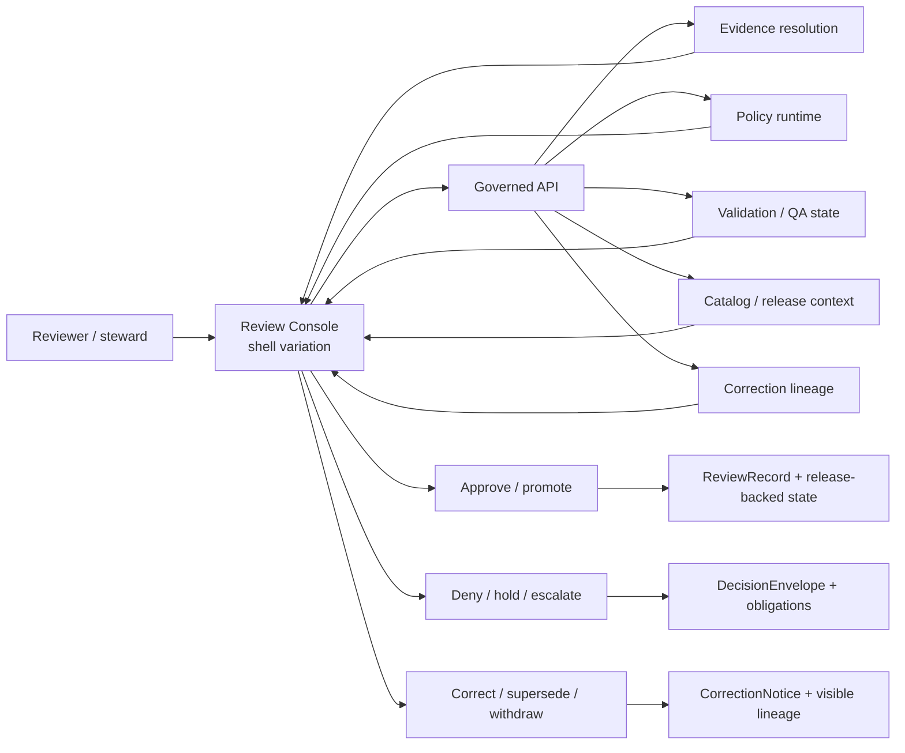

# Review Console

Governed reviewer and steward surface for promotion approval, policy assignment, QA inspection, and correction workflow.


**Quick jump:** [Scope](#scope) · [Repo fit](#repo-fit) · [Inputs](#accepted-inputs) · [Exclusions](#exclusions) · [Directory tree](#directory-tree) · [Quickstart](#quickstart) · [Usage](#usage) · [Diagram](#diagram) · [Reference tables](#reference-tables) · [Task list](#task-list) · [FAQ](#faq) · [Appendix](#appendix)

| Field | Value |
|---|---|
| Status | `experimental` |
| Owners | `NEEDS VERIFICATION` |
| Path | `apps/review-console/README.md` |
| Repo fit | Directory README for the review-bearing app boundary inside `apps/` |
| Upstream | [`../README.md`](../README.md) · [`../../README.md`](../../README.md) · [`../../.github/README.md`](../../.github/README.md) |
| Downstream | `NEEDS VERIFICATION` — active child routes, panels, tests, and fixtures in this directory were not confirmed during this revision |
| Primary role | Keep approval, denial, hold, QA, and correction work inside the same trust-visible shell family as the rest of KFM |
| Working posture | **CONFIRMED doctrine** · **INFERRED local fit** · **PROPOSED realization** · **UNKNOWN mounted implementation depth** |

> [!IMPORTANT]
> This README is intentionally **verification-bounded**. It documents what this directory is for, what must remain true if it grows, and what should be verified before claiming live implementation details. It should not be used to imply that routes, panels, workflows, or tests already exist here unless the active branch confirms them.

> [!NOTE]
> The strongest current doctrinal rule for this surface is simple: **review must remain a shell variation, not a hidden alternate truth system**. This directory should stay downstream of governed APIs, release-backed evidence, policy decisions, and correction lineage.

## Scope

This directory exists to hold the **review-bearing KFM surface**: the operator-facing place where reviewers and stewards inspect evidence, assess QA state, assign or confirm policy, approve or deny promotion, and drive visible correction or rollback flows.

It is not here to become a separate admin island with looser truth rules. The review console should inherit the same core KFM commitments that govern the public shell:

- map-first, time-aware operation
- evidence drill-through at point of use
- explicit release context
- policy-visible decisions
- negative outcomes as first-class states
- correction lineage that remains inspectable after publication

In practice, that makes this directory a **boundary README first** and an implementation surface second.

[Back to top](#review-console)

## Repo fit

**Repo fit:** `apps/review-console/README.md` sits below the app-level boundary README and should stay aligned with the repo-wide governance posture in the root and `.github` docs.

### What belongs here

This directory is the right home for review-bearing UI concerns such as:

- promotion approval and denial flows
- policy assignment and review-state presentation
- QA inspection against candidate or promoted artifacts
- evidence drill-through during review
- correction, supersession, withdrawal, and rollback visibility
- steward-safe comparison of release context, support state, and obligations

### Why this is an app surface

KFM doctrine repeatedly separates:

- **truth-bearing backend artifacts** such as contracts, policy bundles, release manifests, review records, and evidence bundles
- **shell-owned state** such as selected subject, compare state, drawer openness, active panel, and operator navigation context

This directory should own the second category, not the first.

### Nearby docs that should stay in sync

- [`../README.md`](../README.md) — app boundary and runtime grouping
- [`../../README.md`](../../README.md) — repo posture, trust model, and current evidence boundary
- [`../../.github/README.md`](../../.github/README.md) — contributor/review workflow posture

[Back to top](#review-console)

## Accepted inputs

The review console should accept **review-shaped inputs**, not raw canonical mutation power.

| Input family | What it looks like here | Status |
|---|---|---|
| Review queue items | candidate releases, held items, approval-needed work, correction-needed work | **PROPOSED local realization** |
| Policy decisions | deny / hold / generalize / restrict / approve outcomes with reasons and obligations | **CONFIRMED doctrinal need** |
| QA and validation signals | structural, temporal, spatial, CRS, rights, or catalog findings | **CONFIRMED doctrinal need** |
| Evidence drill-through payloads | Evidence Drawer, citation targets, lineage pointers, proof-pack references | **CONFIRMED doctrinal need** |
| Release context | release ID, dataset version, review state, promotion readiness, correction status | **CONFIRMED doctrinal need** |
| Shell state | selected subject, compare mode, active panel, actor role, time scope | **INFERRED local fit** |
| Restricted review actions | review-action and release-action family behaviors | **PROPOSED local route realization** |

### Good examples of content for this directory

- review panels and routes
- shell-state adapters for review mode
- review-specific tests and fixtures
- accessibility checks for approval/correction flows
- visual states for hold, deny, partial, stale, superseded, and withdrawn conditions
- local README/docs explaining how review behavior stays governed

[Back to top](#review-console)

## Exclusions

This directory should **not** become the quiet place where canonical law hides.

| Does **not** belong here | Why | Put it in / keep it with |
|---|---|---|
| Canonical schemas and vocabularies | review screens consume them; they do not define them | `contracts/` and related schema surfaces |
| Policy source of truth | the review console presents and applies policy outcomes; it should not become the policy registry | `policy/` |
| Raw or unpublished source storage | this surface must not become a direct path to canonical or unpublished stores | governed backend/data zones |
| Evidence resolution law | UI should call it, not re-implement it | package/service boundary for evidence resolution |
| Promotion manifests / release proof generation logic | review can trigger or inspect, but not silently own artifact law | release/build/promotion packages or services |
| Detached chatbot behavior | review-focused synthesis must remain bounded, cited, and subordinate to evidence | governed Focus/runtime surfaces |
| Public discovery UI | this surface is steward/reviewer-facing, not the default public exploration mode | explorer/public shell surfaces |
| Hidden write paths to truth stores | breaks the trust membrane | governed API only |

> [!WARNING]
> If this directory starts owning domain rules, policy grammar, or release proof composition directly, it has crossed the boundary from **review surface** into **hidden authority layer**.

[Back to top](#review-console)

## Directory tree

### Current local signal

The strongest safe statement for this revision is that this directory is still a **scaffold boundary**.

```text
apps/
└─ review-console/
   └─ README.md
```

### Why the tree is kept minimal here

The active branch should decide the real child layout. This README should not pretend those files already exist.

<details>
<summary>PROPOSED future subtree once the active branch grows beyond the scaffold</summary>

```text
apps/
└─ review-console/
   ├─ README.md
   ├─ routes/
   │  ├─ approvals/
   │  ├─ policy/
   │  ├─ qa/
   │  ├─ corrections/
   │  └─ audits/
   ├─ panels/
   │  ├─ evidence-drawer/
   │  ├─ release-summary/
   │  ├─ diff-inspection/
   │  └─ obligations/
   ├─ state/
   │  ├─ shell/
   │  └─ review-session/
   ├─ lib/
   │  ├─ contracts/
   │  └─ api-clients/
   ├─ tests/
   │  ├─ accessibility/
   │  ├─ review-flows/
   │  ├─ evidence-drillthrough/
   │  └─ corrections/
   └─ fixtures/
      ├─ approval/
      ├─ denial/
      ├─ hold/
      └─ correction/
```

All items above are **PROPOSED**, not confirmed current contents.
</details>

[Back to top](#review-console)

## Quickstart

This section is intentionally **read-only and verification-first**. Do not treat it as proof that a runnable review console already exists.

### 1) Confirm current branch and current tree

```bash
git rev-parse --show-toplevel
git rev-parse --short HEAD
find apps/review-console -maxdepth 4 -print | sort
```

### 2) Confirm which KFM review terms already appear in code and docs

```bash
grep -RInE 'ReviewRecord|DecisionEnvelope|ReleaseManifest|CorrectionNotice|Evidence Drawer|review-action|release-action|approve|deny|hold|rollback|supersed' \
  apps packages contracts policy docs tests 2>/dev/null
```

### 3) Confirm whether this directory has real tests, fixtures, or routes yet

```bash
find apps/review-console -maxdepth 5 \
  \( -name '*.test.*' -o -name '*.spec.*' -o -name '*.stories.*' -o -name '*fixture*' -o -name 'fixtures' -o -name 'routes' \) \
  -print | sort
```

### 4) Confirm whether review behavior is wired only through governed surfaces

```bash
grep -RInE '/review|/policy|/audit|/promotions|EvidenceBundle|audit_ref|policy_label' \
  apps packages contracts docs tests 2>/dev/null
```

### 5) Update this README only after the inspection

Use the results above to replace placeholders such as:

- `NEEDS VERIFICATION`
- `PROPOSED local realization`
- candidate subtree examples
- owner placeholders
- missing downstream references

> [!TIP]
> Prefer one small follow-up commit that updates the tree, owners, and exact route names after inspection over a broad speculative rewrite.

[Back to top](#review-console)

## Usage

### Operating law

The review console should be used as a **governed inspection-and-decision surface**.

A healthy review pass looks like this:

1. open the candidate subject, release, or correction case
2. keep place, time scope, and release context visible
3. open supporting evidence without leaving the shell family
4. inspect QA and policy-bearing facts before acting
5. approve, deny, hold, generalize, restrict, or escalate with explicit rationale
6. preserve review state, correction lineage, and audit linkage after the action

### What good use looks like

- a reviewer can move from map/dossier context into review work without losing trust cues
- every consequential claim has a route back to evidence
- approval is never just a button; it is an action with visible support, obligations, and lineage
- denial is not hidden or collapsed into a generic error state
- correction and supersession remain legible after publication

### What bad use looks like

- approving from an isolated table with no evidence access
- policy assignment without visible rights/sensitivity context
- correction screens that silently overwrite what happened before
- review-only UI that fetches directly from canonical stores
- an operator surface that can drift away from the shell grammar used elsewhere

[Back to top](#review-console)

## Diagram



### Reading rule for the diagram

The review console is **not** the place where truth originates. It is the place where already-governed evidence, policy, validation, and release context are made inspectable enough for human review actions.

[Back to top](#review-console)

## Reference tables

### Primary review duties

| Duty | What must be visible | Why it matters |
|---|---|---|
| Promotion approval | release context, candidate scope, evidence access, QA state, policy posture | prevents “ship because the build passed” failures |
| Policy assignment / confirmation | rights, sensitivity, obligations, role, visibility class | keeps review actions explainable and auditable |
| QA inspection | validation findings, geometry/time/CRS issues, reproducibility clues | prevents late-stage truth drift |
| Correction workflow | supersession chain, withdrawal notes, retained support links | makes trust survive change |
| Denial / hold | reason, obligation, effective state, next action | fail-closed behavior must stay legible |
| Evidence drill-through | dataset version, lineage, citations, proof pointers | keeps claims inspectable at point of use |

### Trust cues that must not disappear in review mode

| Trust cue | Must remain visible in review mode? | Notes |
|---|---:|---|
| Active release context | Yes | no detached “review truth” |
| Time basis / freshness | Yes | compare and correction depend on it |
| Evidence Drawer access | Yes | mandatory drill-through path |
| Policy label / visibility class | Yes | approval without policy context is weak review |
| Correction / supersession state | Yes | review must not hide history |
| Actor role / permission posture | Yes | review authority must be explicit |
| Negative outcome states | Yes | deny / hold / restricted must not flatten into generic success/failure |

### Status ledger for this README

| Topic | Status |
|---|---|
| Review console is a necessary KFM surface concept | **CONFIRMED doctrine** |
| Review console should cover promotion approval, policy assignment, QA inspection, and correction workflow | **CONFIRMED doctrine** |
| Review must remain a shell variation, not an alternate truth system | **CONFIRMED doctrine** |
| This exact directory currently acts as a scaffold boundary | **CONFIRMED current signal** |
| Exact child files, routes, panels, tests, fixtures, and owners | **UNKNOWN / NEEDS VERIFICATION** |
| Proposed future subtree and local file names in this README | **PROPOSED** |

[Back to top](#review-console)

## Task list

### Merge-time review gates for this README

- [ ] Replace `NEEDS VERIFICATION` owners with confirmed maintainers.
- [ ] Re-inspect the active branch and update the directory tree.
- [ ] Replace proposed child paths with confirmed local files, or delete them.
- [ ] Link exact review routes or entrypoints if they now exist.
- [ ] Confirm whether review uses the shared shell state or a separate local store.
- [ ] Confirm whether approval, denial, hold, and correction payloads are documented elsewhere.
- [ ] Add exact test paths once accessibility, evidence-drill-through, and correction tests exist.
- [ ] Remove any statement that has become stale after implementation lands.

### Definition of done for the surface itself

- [ ] Every consequential review screen can open evidence without leaving the governed shell family.
- [ ] Approval, denial, hold, and correction each produce visible, inspectable outcomes.
- [ ] Review actions do not bypass governed APIs.
- [ ] Release context, time basis, and trust cues survive route changes.
- [ ] Accessibility checks cover keyboard navigation, reduced motion, and drawer reachability.
- [ ] Correction and rollback states are visibly distinguishable from normal approval flows.

[Back to top](#review-console)

## FAQ

### Is this a separate admin application?

No. It should behave as a **shell variation** with stricter permissions and additional review actions, not as a second product with different truth rules.

### Can review screens talk directly to canonical stores?

No. This surface should read and act **through governed APIs only**.

### Does this README prove the review console already has routes and tests?

No. This README defines boundary and intent. Exact local implementation still needs inspection.

### Should this surface own policy definitions?

No. It may present, confirm, and apply policy-shaped decisions, but policy grammar and policy source of truth belong elsewhere.

### What is the most important trust object on this surface?

The **Evidence Drawer** or equivalent drill-through path. Review without inspectable support is not strong KFM review.

[Back to top](#review-console)

## Appendix

<details>
<summary>Current evidence boundary and maintenance notes</summary>

### What is safe to claim here

- this directory exists
- its current README started as a scaffold
- the apps boundary README expects a child README here to explain reviewer/steward overlays and approval/correction work
- KFM doctrine treats review as part of the same governed shell family
- exact implementation depth remains branch-dependent and must be re-verified

### What should be checked before the next rewrite

- confirmed owners
- confirmed local subtree
- exact route families in use
- whether review state is persisted, URL-shaped, or session-local
- exact contract names for review payloads
- exact test inventory
- exact accessibility evidence
- exact correction and rollback drill evidence

### Maintenance rule

When this directory gains real code, update this README in the same change set that adds:
1. child tree changes
2. route names
3. test paths
4. owner confirmations
5. any new downstream doc links

That keeps the README from getting ahead of mounted proof.

</details>

[Back to top](#review-console)

---

[apps-root]: ../README.md
[repo-root]: ../../README.md
[github-gatehouse]: ../../.github/README.md
