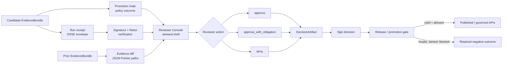

<!-- [KFM_META_BLOCK_V2]
doc_id: kfm.review_console.readme
title: Reviewer Console (Promotion & Decision Artifacts)
type: component-readme
version: v1
status: draft
owners: @bartytime4life
created: 2026-04-24
updated: 2026-04-27
policy_label: evidence-first
related: [../../data/receipts/README.md, ../../tools/validators/promotion_gate/README.md, ../../tools/attest/README.md, ../../tests/e2e/runtime_proof/README.md]
tags: [review, governance, evidence, dsse, cosign, rekor, opa, promotion-gate]
notes: [Formatting pass completed. Source status remains PROPOSED/docs-first. Target path, schema home, CLI names, verifier tooling, and runtime enforcement remain NEEDS VERIFICATION until verified in the mounted repository.]
[/KFM_META_BLOCK_V2] -->

<a id="top"></a>

# Reviewer Console (Promotion & Decision Artifacts)

<p align="center">
  <strong>Kansas Frontier Matrix steward shell for promotion evidence, verifier results, policy outcomes, and signed review decisions.</strong><br>
  Evidence-first · fail-closed · reviewable · release-gated
</p>

<p align="center">
  
  
  
  
  
  
</p>

<p align="center">
  <a href="#scope">Scope</a> ·
  <a href="#repo-fit">Repo fit</a> ·
  <a href="#accepted-inputs">Accepted inputs</a> ·
  <a href="#exclusions">Exclusions</a> ·
  <a href="#operating-flow">Operating flow</a> ·
  <a href="#ui-contract">UI contract</a> ·
  <a href="#decision-actions">Decision actions</a> ·
  <a href="#decisionartifact-schema">Schema</a> ·
  <a href="#verifier-tooling">Tooling</a> ·
  <a href="#definition-of-done">Done</a>
</p>

> [!IMPORTANT]
> The Reviewer Console is a **shell variation**, not a second truth regime. It may help a steward decide, but it must not replace the Promotion Gate, EvidenceBundle, receipts, signatures, policy checks, or governed publication path.

## Impact block

| Field | Value |
| --- | --- |
| **Status** | `draft` / `experimental` |
| **Owners** | `@bartytime4life` |
| **Target path** | `apps/review-console/README.md` · **PROPOSED / NEEDS VERIFICATION** |
| **Evidence mode** | `CORPUS_ONLY` until a mounted repository confirms paths, schemas, workflows, tests, and runtime behavior |
| **Truth posture** | Evidence-first · cite-or-abstain · fail-closed |
| **Runtime role** | Steward review surface inside the governed shell |
| **Publication role** | Emits signed review decisions; does **not** publish directly |
| **Primary risk** | Treating review UI affordances as release authority |

| What this document does | What it does not do |
| --- | --- |
| Defines the proposed reviewer-console role and trust boundary. | Does not prove the console exists in the repository. |
| Identifies accepted evidence, policy, receipt, and decision inputs. | Does not authorize public release. |
| Describes fail-closed behavior for promotion review. | Does not replace Promotion Gate, EvidenceBundle, or release validation. |
| Provides a draft DecisionArtifact schema sketch. | Does not confirm schema home, `$id`, CLI names, or signing implementation. |

---

## Scope

The Reviewer Console enables governed promotion review by showing a steward:

- **what changed** between a prior EvidenceBundle and a candidate EvidenceBundle;
- **why policy allowed, denied, blocked, or flagged** the candidate;
- **whether the run receipt is verifiable** through DSSE/cosign/Rekor or a repository-approved equivalent;
- **which provenance records changed** for touched fields only; and
- **which signed DecisionArtifact** was emitted by the review action.

The console exists to make the promotion decision inspectable. It does **not** move files into publication by itself.

> [!NOTE]
> Core principle: the decision is part of the evidence chain. A visible approval button is not authoritative until a signed decision artifact is emitted and accepted by downstream validation.

<p align="right"><a href="#top">Back to top ↑</a></p>

---

## Repo fit

| Boundary | Placement |
| --- | --- |
| **Component path** | `apps/review-console/` · **PROPOSED** |
| **README path** | `apps/review-console/README.md` · **PROPOSED** |
| **Schema path** | `data/registry/schemas/decision_artifact.v1.json` · **PROPOSED / NEEDS VERIFICATION** |
| **Upstream** | Promotion Gate, pipelines/watchers, receipt generation, attestation tooling |
| **Downstream** | Release/promotion gate, governed runtime APIs, Evidence Drawer, release/correction records |
| **Peer surfaces** | Evidence Drawer, Focus Mode, review queues, compare surfaces, export previews |

### Related links

> [!WARNING]
> These links preserve the source draft’s placement model. Verify the actual repository tree before treating them as implemented.

- [`../../data/receipts/README.md`](../../data/receipts/README.md) — receipt family and candidate evidence inputs (**NEEDS VERIFICATION**)
- [`../../tools/validators/promotion_gate/README.md`](../../tools/validators/promotion_gate/README.md) — Promotion Gate output contract (**NEEDS VERIFICATION**)
- [`../../tools/attest/README.md`](../../tools/attest/README.md) — DSSE/cosign/Rekor or equivalent attestation tooling (**NEEDS VERIFICATION**)
- [`../../tests/e2e/runtime_proof/README.md`](../../tests/e2e/runtime_proof/README.md) — runtime proof checks (**NEEDS VERIFICATION**)

<p align="right"><a href="#top">Back to top ↑</a></p>

---

## Accepted inputs

Only governed review inputs belong in this console.

| Input | Expected role | Minimum review use |
| --- | --- | --- |
| `EvidenceBundle.json` | Candidate evidence bundle | Compare candidate against a prior release or prior candidate. |
| Promotion Gate output | Policy result | Show `allow`, violations, policy version, engine, and affected JSON paths. |
| `receipt.dsse` | Signed run receipt envelope | Verify the candidate’s run receipt or attestation envelope. |
| `rekor.json` | Transparency-log proof | Show Rekor UUID, log index, and inclusion proof when required by policy. |
| Prior EvidenceBundle | Baseline evidence | Render changed fields only, using JSON Pointer paths. |
| PROV lineage payload | Field-level provenance | Explain `Entity → Activity → Agent` only for touched fields. |
| DecisionArtifact | Signed review result | Preserve the steward decision and verification context. |

---

## Exclusions

The Reviewer Console must not become a shortcut around the trust membrane.

| Do not put here | Where it belongs instead |
| --- | --- |
| RAW, WORK, or QUARANTINE records | Lifecycle storage and ingest/quarantine tools. |
| Direct canonical-store readers for public UI paths | Governed APIs and released artifacts. |
| Unreviewed model output or AI summaries | Governed AI runtime envelope after EvidenceBundle resolution and policy checks. |
| Source credentials, private keys, or signing secrets | Secret manager / platform identity controls. |
| Ad hoc reviewer notes without signature or actor identity | Signed DecisionArtifact / ReviewRecord family. |
| Map tiles, summaries, or graph projections as sovereign truth | Rebuildable derived layers with EvidenceRef → EvidenceBundle support. |
| Publication side effects | Promotion/release pipeline after decision validation. |

> [!CAUTION]
> Any path that lets the console approve publication without valid evidence, policy, receipt verification, reviewer identity, and signature must be treated as a trust-boundary failure.

<p align="right"><a href="#top">Back to top ↑</a></p>

---

## Operating flow



The negative path is intentional. Denied, blocked, held, or discarded decisions remain visible as governance evidence rather than disappearing from the record.

### State model

| State | Meaning | Release effect |
| --- | --- | --- |
| `unreviewed` | Candidate has not been steward-reviewed. | No release effect. |
| `approved` | Steward approved and downstream validators may continue. | Requires signed DecisionArtifact and valid gates. |
| `approved_with_obligation` | Steward approval is conditional on machine-readable obligations. | Hold until obligations are satisfied and recorded. |
| `denied` | Steward denied candidate. | No publication. Negative outcome remains queryable. |
| `blocked` | Verification, policy, identity, rights, or sensitivity gate failed. | No publication until corrected. |
| `discarded` | Unsigned or invalid decision artifact. | No release effect. |

<p align="right"><a href="#top">Back to top ↑</a></p>

---

## UI contract

### Header strip

The header should be compact, persistent, and visible while a reviewer scrolls.

| Field | Display rule |
| --- | --- |
| Candidate ID | Always visible. |
| `spec_hash → prior_spec_hash` | Show both values; mark missing prior hash as first-promotion / no-prior-state. |
| Source | Show `repo@ref` or the repository-approved source reference. |
| Timestamps | Show generated, recorded, and reviewed times separately when available. |
| Gate runner | Example: `promotion_gate@v1`; exact runner ID **NEEDS VERIFICATION**. |
| Review state | `unreviewed`, `approved`, `approved_with_obligation`, `denied`, or `blocked`. |

### Evidence diff

Render only changed fields by JSON Pointer path.

| Region | Requirement |
| --- | --- |
| Left side | Prior value, prior provenance, prior release state. |
| Right side | Candidate value, candidate provenance, candidate review state. |
| Inline badges | Source, extractor, timestamp, evidence state, sensitivity state. |
| Empty diff | Must not imply approval; show `NO_CHANGE_DETECTED` and still require verification. |

### Policy outcome

Show the Promotion Gate result as a first-class object.

| Element | Required content |
| --- | --- |
| Result | `ALLOW` or `DENY`; additional `BLOCK` display may be derived by console fail-closed checks. |
| Violations | Rule ID, message, JSON path, severity if provided. |
| Policy identity | Policy version, engine, bundle/hash if available. |
| Replay affordance | Link or command to replay the policy decision. |

### Receipt and signature status

| Check | Display |
| --- | --- |
| DSSE envelope | `verified`, `missing`, `invalid`, or `not_required_by_policy` |
| cosign / equivalent | Verification summary and key identity. |
| Rekor | UUID, log index, inclusion proof, or reason omitted. |
| Transcript | Collapsible verifier transcript; never hide a failure behind a green summary. |

### Provenance view

Show field-level lineage only for touched fields.

```text
Entity → Activity → Agent
```

This view should answer: **What changed, who or what produced it, when was it recorded, and what evidence supports it?**

<p align="right"><a href="#top">Back to top ↑</a></p>

---

## Decision actions

All actions produce a **signed DecisionArtifact**. A UI action is not authoritative until the artifact is emitted, signed, and accepted by downstream validation.

| Action | Meaning | Required posture |
| --- | --- | --- |
| **Approve** | Candidate may proceed to publication gates. | Allowed only when policy and verification are valid. |
| **Approve with obligation** | Candidate may proceed only after machine-readable obligations are satisfied. | Obligations must be visible and enforceable downstream. |
| **Deny** | Candidate does not proceed. | Rationale required; negative outcome remains visible. |

### Obligation example

```json
{
  "type": "redact",
  "params": {
    "fields": ["owner_email", "utm"]
  }
}
```

> [!IMPORTANT]
> Obligations must be machine-readable and enforceable downstream. Free-text “remember to fix this” notes are not a safe substitute.

---

## DecisionArtifact schema

**Proposed path:** `data/registry/schemas/decision_artifact.v1.json` (**PROPOSED / NEEDS VERIFICATION**)

A DecisionArtifact records the reviewer decision and the evidence/policy/receipt verification context that made the decision reviewable. It is adjacent to promotion; it is not the EvidenceBundle, not the run receipt, and not the release manifest.

| Field family | Purpose |
| --- | --- |
| Identity | `decision_id`, `candidate_id`, `spec_hash`, `prior_spec_hash` |
| Decision | `approve`, `approve_with_obligation`, or `deny` |
| Actor | Reviewer identity and signing key identity |
| Policy summary | Promotion Gate result, violations, policy version, engine |
| Receipt verification | DSSE/cosign/Rekor status or approved equivalent |
| Obligations | Machine-readable follow-up requirements |
| Signature | Signature over the decision artifact |

<details>
<summary>Draft JSON Schema sketch</summary>

> [!NOTE]
> This schema is illustrative. Confirm schema home, `$id`, required fields, and existing ReviewRecord / DecisionEnvelope / PromotionDecision objects before committing machine files.

```json
{
  "$schema": "https://json-schema.org/draft/2020-12/schema",
  "$id": "https://kfm.example/schemas/decision_artifact.v1.json",
  "title": "DecisionArtifact v1",
  "type": "object",
  "additionalProperties": false,
  "required": [
    "decision_id",
    "candidate_id",
    "spec_hash",
    "decision",
    "actor",
    "timestamp",
    "policy_summary",
    "receipt_verification",
    "signature"
  ],
  "properties": {
    "decision_id": { "type": "string", "minLength": 1 },
    "candidate_id": { "type": "string", "minLength": 1 },
    "spec_hash": { "type": "string", "minLength": 1 },
    "prior_spec_hash": { "type": ["string", "null"] },
    "decision": {
      "type": "string",
      "enum": ["approve", "approve_with_obligation", "deny"]
    },
    "rationale": { "type": "string" },
    "obligations": {
      "type": "array",
      "items": {
        "type": "object",
        "additionalProperties": false,
        "required": ["type", "params"],
        "properties": {
          "type": { "type": "string", "minLength": 1 },
          "params": { "type": "object" }
        }
      }
    },
    "policy_summary": {
      "type": "object",
      "additionalProperties": false,
      "required": ["allow", "violations", "policy_version", "engine"],
      "properties": {
        "allow": { "type": "boolean" },
        "violations": {
          "type": "array",
          "items": {
            "type": "object",
            "additionalProperties": false,
            "required": ["id", "message", "path"],
            "properties": {
              "id": { "type": "string", "minLength": 1 },
              "message": { "type": "string", "minLength": 1 },
              "path": { "type": "string", "minLength": 1 }
            }
          }
        },
        "policy_version": { "type": "string", "minLength": 1 },
        "engine": { "type": "string", "minLength": 1 }
      }
    },
    "receipt_verification": {
      "type": "object",
      "additionalProperties": false,
      "required": ["dsse_verified", "rekor_verified", "verifier"],
      "properties": {
        "dsse_verified": { "type": "boolean" },
        "rekor_verified": { "type": "boolean" },
        "dsse_envelope_ref": { "type": "string" },
        "rekor_index": { "type": ["integer", "null"] },
        "rekor_uuid": { "type": ["string", "null"] },
        "verifier": { "type": "string", "minLength": 1 },
        "transcript_ref": { "type": "string" }
      }
    },
    "actor": {
      "type": "object",
      "additionalProperties": false,
      "required": ["id", "display", "keyid"],
      "properties": {
        "id": { "type": "string", "minLength": 1 },
        "display": { "type": "string", "minLength": 1 },
        "keyid": { "type": "string", "minLength": 1 }
      }
    },
    "timestamp": {
      "type": "string",
      "format": "date-time"
    },
    "signature": {
      "type": "object",
      "additionalProperties": false,
      "required": ["algorithm", "keyid", "signature"],
      "properties": {
        "algorithm": { "type": "string", "minLength": 1 },
        "keyid": { "type": "string", "minLength": 1 },
        "signature": { "type": "string", "minLength": 1 }
      }
    }
  },
  "allOf": [
    {
      "if": {
        "properties": { "decision": { "const": "deny" } },
        "required": ["decision"]
      },
      "then": {
        "required": ["rationale"],
        "properties": { "rationale": { "type": "string", "minLength": 1 } }
      }
    },
    {
      "if": {
        "properties": { "decision": { "const": "approve_with_obligation" } },
        "required": ["decision"]
      },
      "then": {
        "required": ["obligations"],
        "properties": { "obligations": { "type": "array", "minItems": 1 } }
      }
    }
  ]
}
```

</details>

### Validator notes

- `deny` should require a non-empty `rationale`.
- `approve_with_obligation` should require at least one obligation.
- `approve` should fail when `policy_summary.allow=false` or required receipt verification fails.
- Exact JSON Schema home and `$id` remain **NEEDS VERIFICATION**.

<p align="right"><a href="#top">Back to top ↑</a></p>

---

## Verifier tooling

These examples preserve the intended CLI shape from the source draft. Treat them as **PROPOSED** until the `kfm` CLI and argument names are verified in the repository.

### Recompute `spec_hash`

```bash
# Illustrative only — NEEDS VERIFICATION against mounted repo conventions.
CANDIDATE_ID="TODO-candidate-id"
BUNDLE_PATH="data/receipts/${CANDIDATE_ID}/EvidenceBundle.json"

kfm verify spec-hash "$CANDIDATE_ID" \
  --bundle "$BUNDLE_PATH"
```

### Verify signature and Rekor proof

```bash
# Illustrative only — NEEDS VERIFICATION against mounted repo conventions.
CANDIDATE_ID="TODO-candidate-id"
ENVELOPE_PATH="data/receipts/${CANDIDATE_ID}/receipt.dsse"

kfm verify signature "$CANDIDATE_ID" \
  --envelope "$ENVELOPE_PATH"
```

### Replay policy decision

```bash
# Illustrative only — NEEDS VERIFICATION against mounted repo conventions.
CANDIDATE_ID="TODO-candidate-id"
BUNDLE_PATH="data/receipts/${CANDIDATE_ID}/EvidenceBundle.json"

kfm verify policy \
  --bundle "$BUNDLE_PATH" \
  --policy "policy/promotion_contract/" \
  --expect allow
```

### Review actions

```bash
# Illustrative only — NEEDS VERIFICATION against mounted repo conventions.
CANDIDATE_ID="TODO-candidate-id"

kfm review inspect "$CANDIDATE_ID" --evidence-diff

kfm review approve "$CANDIDATE_ID" \
  --rationale "Meets Promotion Contract A" \
  --sign

kfm review approve "$CANDIDATE_ID" \
  --rationale "Redact sensitive fields before release" \
  --obligation 'redact:fields=["owner_email","utm"]' \
  --sign

kfm review deny "$CANDIDATE_ID" \
  --rationale "PII policy violation" \
  --sign
```

---

## Fail-closed rules

| Condition | Console outcome | Publication consequence |
| --- | --- | --- |
| Missing EvidenceBundle | `BLOCK` | No decision artifact may approve publication. |
| `spec_hash` mismatch | `BLOCK` | Candidate must be regenerated or corrected. |
| DSSE envelope missing | `BLOCK` | Candidate remains unpublished. |
| Signature/cosign verification fails | `BLOCK` | Candidate remains unpublished. |
| Rekor proof missing or invalid when required | `BLOCK` | Candidate remains unpublished. |
| Promotion Gate `allow=false` | `DENY` | No approval path without policy correction or new candidate. |
| Unsigned DecisionArtifact | `DISCARD` | Decision has no release effect. |
| Actor key not trusted | `BLOCK` | Reviewer identity/key must be resolved. |
| Unresolved obligation | `HOLD` | Candidate cannot publish until obligation is satisfied and recorded. |
| Sensitivity or rights unresolved | `DENY` or `HOLD` | Public release must remain blocked until policy permits. |

<p align="right"><a href="#top">Back to top ↑</a></p>

---

## Directory layout

Proposed source-draft layout:

```text
apps/
  review-console/
    README.md

data/
  receipts/
    <candidate_id>/
      EvidenceBundle.json
      receipt.dsse
      rekor.json
      DecisionArtifact.json

  registry/
    schemas/
      decision_artifact.v1.json
```

Directory notes:

- `apps/review-console/` is the proposed shell/component home from the source draft.
- `data/receipts/<candidate_id>/` preserves the source draft’s receipt-centered layout.
- Schema home is **PROPOSED**; verify against the repository’s actual schema/contract convention before creating machine files.

---

## Implementation checklist

### Build gates

- [ ] Confirm target path and neighboring README/doc conventions.
- [ ] Confirm whether schema home is `data/registry/schemas/`, `schemas/contracts/v1/`, `contracts/objects/`, or another repo-standard location.
- [ ] Confirm Promotion Gate output shape and policy engine naming.
- [ ] Confirm DSSE/cosign/Rekor tooling, transcript storage, and required verification fields.
- [ ] Confirm whether a `ReviewRecord`, `DecisionEnvelope`, or `PromotionDecision` object already exists and should be reused.

### Component work

- [ ] Evidence diff generator using JSON Pointer paths.
- [ ] DSSE verification integration.
- [ ] Rekor inclusion validation.
- [ ] OPA / policy adapter normalization.
- [ ] Decision signing flow.
- [ ] CLI scaffold for `kfm review` commands.
- [ ] Evidence Drawer parity for policy, provenance, sensitivity, and receipt state.
- [ ] PROV lineage renderer for touched fields only.

---

## Definition of done

- [ ] Invalid or missing receipt produces `BLOCK`.
- [ ] Policy `allow=false` cannot be overridden by UI approval.
- [ ] Unsigned decisions are discarded by downstream validation.
- [ ] Denials and blocked decisions remain queryable as negative governance outcomes.
- [ ] Public publication path consumes only signed, validated, policy-allowed decisions.
- [ ] README links and relative paths are verified from `apps/review-console/`.
- [ ] Schema home and `$id` are verified before machine files are committed.
- [ ] Any replaced object names are mapped to existing repository conventions or recorded in an ADR.

---

## Rollback and correction notes

| Scenario | Response |
| --- | --- |
| Console path is wrong | Move README/component to verified repo home and update relative links. |
| Schema home conflicts with repo convention | Keep schema semantics, move to verified schema home, and record migration note / ADR. |
| Existing review object already exists | Map DecisionArtifact fields into the existing object family or mark this sketch superseded. |
| CLI names differ | Update examples only after verified; keep illustrative commands labeled until then. |
| Decision validation fails after UI approval | Retain negative outcome, block release, and require corrected candidate or corrected decision artifact. |

---

## FAQ

### Is the Reviewer Console allowed to publish directly?

No. It emits a signed DecisionArtifact. Publication remains a governed transition after validation, policy, and release checks.

### Can an approver override the Promotion Gate?

No. If policy denies or a verifier blocks, the console must fail closed. The appropriate path is correction, new evidence, or a new candidate.

### Is a DecisionArtifact the same as an EvidenceBundle?

No. The EvidenceBundle carries reviewable evidence. The DecisionArtifact records the review decision and its verification context.

### Can this surface show negative outcomes?

Yes. Denials, blocks, holds, and discarded unsigned decisions are governance evidence and should remain inspectable.

---

## Final principle

> No unsigned decision, unverifiable receipt, unresolved obligation, or policy violation reaches publication.

<p align="right"><a href="#top">Back to top ↑</a></p>
