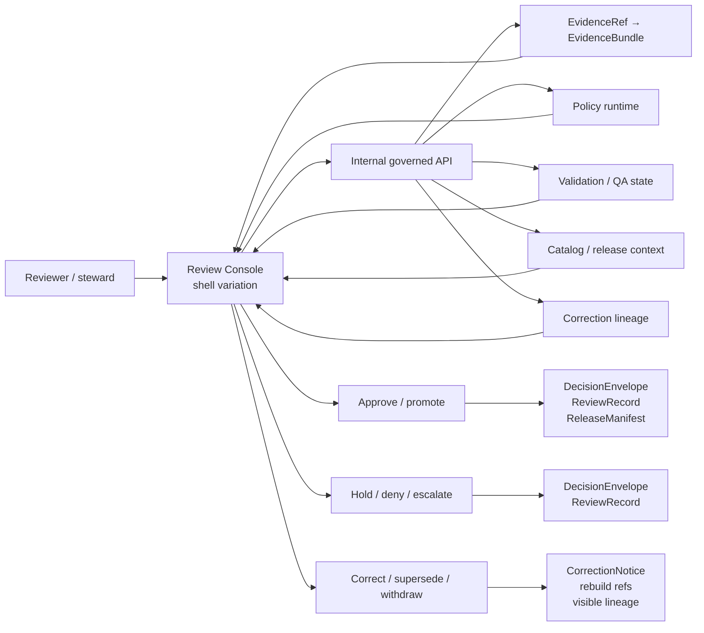

<!-- [KFM_META_BLOCK_V2]
doc_id: kfm://doc/NEEDS_VERIFICATION
title: Review Console
type: standard
version: v1
status: draft
owners: @bartytime4life
created: NEEDS_VERIFICATION
updated: 2026-04-12
policy_label: NEEDS_VERIFICATION
related: [../../README.md, ../README.md, ../../.github/README.md]
tags: [kfm, apps, review-console, stewardship, review]
notes: [Owner confirmed from current public CODEOWNERS broad app ownership; current public app-family inventory reconciled with ../README.md; doc_id, created date, and policy_label still need direct registry or repo-history verification.]
[/KFM_META_BLOCK_V2] -->

# Review Console

Governed reviewer and steward surface for promotion approval, policy assignment, QA inspection, and correction workflow.


**Quick jump:** [Scope](#scope) · [Repo fit](#repo-fit) · [Accepted inputs](#accepted-inputs) · [Exclusions](#exclusions) · [Directory tree](#directory-tree) · [Quickstart](#quickstart) · [Usage](#usage) · [Diagram](#diagram) · [Reference tables](#reference-tables) · [Task list](#task-list) · [FAQ](#faq) · [Appendix](#appendix)

| Field | Value |
|---|---|
| Status | `experimental` |
| Owners | `@bartytime4life` |
| Path | `apps/review-console/README.md` |
| Repo fit | Directory README for the review-bearing app boundary inside `apps/` |
| Upstream | [apps-root][] · [repo-root][] · [github-gatehouse][] |
| Downstream | Checked-in public-main baseline remains docs-first; exact branch-local routes, panels, fixtures, and tests stay `UNKNOWN` until re-verified |
| Primary role | Keep approval, denial, hold, QA, and correction work inside the same trust-visible shell family as the rest of KFM |
| Working posture | **CONFIRMED doctrine** · **CONFIRMED current public-main path evidence** · **PROPOSED future local realization** · **UNKNOWN active-branch implementation depth** |

> [!IMPORTANT]
> This README is **public-main-grounded for checked-in path claims** and **branch-grounded for merge-time truth**. If the working branch adds code beneath this directory, update the tree, downstream links, and test references in the same PR.

> [!NOTE]
> In KFM doctrine, review is a **shell variation**, not a second product and not a hidden authority layer. Approval, denial, hold, rollback, and correction work remain downstream of governed APIs, review artifacts, release state, and evidence drill-through.

> [!NOTE]
> The broader `apps/` boundary now lists `api/` and `ui/` alongside the older sibling set already named here. Keep this file synchronized with `../README.md` rather than freezing an outdated public-main inventory.

## Scope

This directory exists to hold the **review-bearing KFM surface**: the operator-facing place where reviewers and stewards inspect evidence, assess QA state, assign or confirm policy, approve or deny promotion, and drive visible correction or rollback flows.

It is not here to become a separate admin island with looser truth rules. The review console should inherit the same core KFM commitments that govern the public shell:

- map-first, time-aware operation
- evidence drill-through at point of use
- explicit release context
- policy-visible decisions
- negative outcomes as first-class states
- correction lineage that remains inspectable after publication

In practice, that makes this directory a **boundary README first** and an implementation surface second.

[Back to top](#review-console)

## Repo fit

**Repo fit:** `apps/review-console/README.md` sits below the app-level boundary README and should stay aligned with the repo-wide governance posture in the root and `.github` docs.

### What belongs here

This directory is the right home for review-bearing UI concerns such as:

- promotion approval and denial flows
- hold, escalate, and re-review flows
- policy assignment and review-state presentation
- QA inspection against candidate or promoted artifacts
- evidence drill-through during review
- correction, supersession, withdrawal, and rollback visibility
- steward-safe comparison of release context, support state, and obligations

### Why this is an app surface

KFM doctrine repeatedly separates truth-bearing backend artifacts from shell-owned state. This directory should own the second category, not the first.

Truth-bearing artifacts stay elsewhere: contracts, policy bundles, release manifests, review records, evidence bundles, catalog closures, and correction notices.

Shell-owned state belongs here: selected subject, compare state, drawer openness, active panel, actor mode, time scope, and operator navigation context.

### Current public sibling context

| Sibling surface | Current public state | Why it matters here |
|---|---|---|
| `../api/` | present in current public-main `apps/` family | keep this README aligned with the broader checked-in app inventory instead of freezing an older sibling list |
| `../cli/` | present | confirms `apps/` is not only browser UI; operator-adjacent surfaces exist beside review |
| `../explorer-web/` | present | public exploration stays distinct from review-bearing stewardship work |
| `../governed-api/` | present | review must remain downstream of governed interfaces rather than embedding hidden authority |
| `./` | checked-in public-main baseline is docs-first | the visible review lane is not yet proven as a shipped route tree |
| `../ui/` | present in current public-main `apps/` family | current public UI inventory is broader than this directory alone; review still belongs to the same governed shell family |
| `../workers/` | present | execution and async work stay adjacent to, not collapsed into, review UI concerns |

### Nearby docs that should stay in sync

- [apps-root][] — app boundary and runtime grouping
- [repo-root][] — repo posture, trust model, and current evidence boundary
- [github-gatehouse][] — contributor and review workflow posture

[Back to top](#review-console)

## Accepted inputs

The review console should accept **review-shaped inputs**, not raw canonical mutation power.

| Input family | What it looks like here | Status |
|---|---|---|
| Review queue items | candidate releases, held items, approval-needed work, correction-needed work | **PROPOSED local realization** |
| Policy decisions | approve / deny / hold / generalize / restrict outcomes with reasons and obligations | **CONFIRMED doctrinal need** |
| QA and validation signals | structural, temporal, spatial, CRS, rights, accessibility, or catalog findings | **CONFIRMED doctrinal need** |
| Evidence drill-through payloads | Evidence Drawer targets, EvidenceBundle refs, lineage pointers, proof-pack references | **CONFIRMED doctrinal need** |
| Release context | release ID, dataset version, review state, promotion readiness, correction status | **CONFIRMED doctrinal need** |
| Shell state | selected subject, compare mode, active panel, actor role, time scope | **INFERRED local fit** |
| Restricted review actions | action payloads that emit review and decision artifacts rather than hidden mutations | **CONFIRMED doctrinal need** |

### Good examples of content for this directory

- review panels and routes
- shell-state adapters for review mode
- review-specific tests and fixtures
- accessibility checks for approval and correction flows
- visual states for hold, deny, partial, stale, superseded, withdrawn, and generalized conditions
- local docs explaining how review behavior stays governed

[Back to top](#review-console)

## Exclusions

This directory should **not** become the quiet place where canonical law hides.

| Does **not** belong here | Why | Put it in / keep it with |
|---|---|---|
| Canonical schemas and vocabularies | review screens consume them; they do not define them | `contracts/` and related schema surfaces |
| Policy source of truth | the review console presents and applies policy outcomes; it should not become the policy registry | `policy/` |
| Raw or unpublished source storage | this surface must not become a direct path to canonical or unpublished stores | governed backend and data zones |
| Evidence resolution law | UI should call it, not re-implement it | package or service boundary for evidence resolution |
| Promotion manifests / release proof generation logic | review can inspect or trigger, but it must not silently own artifact law | release/build/promotion packages or services |
| Detached chatbot behavior | review-focused synthesis must remain bounded, cited, and subordinate to evidence | governed Focus/runtime surfaces |
| Public discovery UI | this surface is steward/reviewer-facing, not the default public exploration mode | explorer/public shell surfaces |
| Hidden write paths to truth stores | breaks the trust membrane | governed API only |

> [!WARNING]
> If this directory starts owning domain rules, policy grammar, or release proof composition directly, it has crossed from **review surface** into **hidden authority layer**.

[Back to top](#review-console)

## Directory tree

### Current public-main `apps/` snapshot

```text
apps/
├─ README.md
├─ api/
├─ cli/
├─ explorer-web/
├─ governed-api/
├─ review-console/
│  └─ README.md
├─ ui/
└─ workers/
```

### Current checked-in `review-console/` subtree baseline

```text
apps/
└─ review-console/
   └─ README.md
```

The broader app-family snapshot above is reconciled with `apps/README.md`. The local subtree baseline below stays intentionally narrow. Re-check the active branch before presenting either view as merge-time truth.

### Why the tree is still kept minimal here

This README should not pretend that routes, panels, tests, or fixtures already exist unless the active branch confirms them.

<details>
<summary><strong>PROPOSED</strong> future subtree once the active branch grows beyond the scaffold</summary>

```text
apps/
└─ review-console/
   ├─ README.md
   ├─ routes/
   │  ├─ approvals/
   │  ├─ policy/
   │  ├─ qa/
   │  ├─ corrections/
   │  └─ audits/
   ├─ panels/
   │  ├─ evidence-drawer/
   │  ├─ release-summary/
   │  ├─ diff-inspection/
   │  ├─ obligations/
   │  └─ correction-lineage/
   ├─ state/
   │  ├─ shell/
   │  └─ review-session/
   ├─ lib/
   │  ├─ contracts/
   │  └─ api-clients/
   ├─ tests/
   │  ├─ accessibility/
   │  ├─ review-flows/
   │  ├─ evidence-drillthrough/
   │  └─ corrections/
   └─ fixtures/
      ├─ approval/
      ├─ denial/
      ├─ hold/
      └─ correction/
```

All items above are **PROPOSED**, not confirmed current contents.
</details>

[Back to top](#review-console)

## Quickstart

This section is intentionally **read-only and verification-first**. Do not treat it as proof that a runnable review console already exists.

### 1) Confirm current branch, current tree, and local drift

```bash
git rev-parse --show-toplevel
git rev-parse --short HEAD
find apps/review-console -maxdepth 5 -print | sort
git diff -- apps/review-console
```

### 2) Confirm the boundary docs still line up

```bash
sed -n '1,260p' README.md
sed -n '1,260p' apps/README.md
sed -n '1,260p' .github/README.md
```

### 3) Confirm which KFM review terms already appear in code and docs

```bash
grep -RInE 'ReviewRecord|DecisionEnvelope|ReleaseManifest|ReleaseProofPack|CorrectionNotice|EvidenceBundle|review-action|release-action|approve|deny|hold|rollback|supersed|withdraw' \
  apps packages contracts policy docs tests 2>/dev/null
```

### 4) Confirm whether this directory has real routes, tests, or fixtures yet

```bash
find apps/review-console -maxdepth 5 \
  \( -name 'app' -o -name 'pages' -o -name '*.tsx' -o -name '*.ts' -o -name '*.test.*' -o -name '*.spec.*' -o -name 'fixtures' \) \
  -print | sort
```

### 5) Confirm whether review behavior is wired only through governed surfaces

```bash
grep -RInE 'EvidenceRef|EvidenceBundle|audit_ref|policy_label|ReviewRecord|DecisionEnvelope|RuntimeResponseEnvelope' \
  apps packages contracts docs tests 2>/dev/null
```

### 6) Update this README only after the inspection

Use the results above to replace placeholders such as:

- `NEEDS VERIFICATION`
- `PROPOSED local realization`
- candidate subtree examples
- missing downstream references
- provisional route and test assumptions

> [!TIP]
> Prefer one small follow-up commit that updates owners, child tree, exact route names, and test paths after inspection over a broad speculative rewrite.

[Back to top](#review-console)

## Usage

### Operating law

The review console should be used as a **governed inspection-and-decision surface**.

A healthy review pass looks like this:

1. open the candidate subject, release, or correction case
2. keep geography, time scope, and release context visible
3. open supporting evidence without leaving the shell family
4. inspect QA and policy-bearing facts before acting
5. approve, deny, hold, generalize, restrict, or escalate with explicit rationale
6. preserve review state, correction lineage, and audit linkage after the action

### What good use looks like

- a reviewer can move from map or dossier context into review work without losing trust cues
- every consequential claim has a route back to evidence
- approval is never just a button; it is an action with visible support, obligations, and lineage
- denial is not hidden or collapsed into a generic error state
- correction and supersession remain legible after publication

### What bad use looks like

- approving from an isolated table with no evidence access
- policy assignment without visible rights or sensitivity context
- correction screens that silently overwrite what happened before
- review-only UI that fetches directly from canonical stores
- an operator surface that can drift away from the shell grammar used elsewhere

[Back to top](#review-console)

## Diagram



### Reading rule for the diagram

The review console is **not** the place where truth originates. It is the place where already-governed evidence, policy, validation, and release context become inspectable enough for human review actions.

[Back to top](#review-console)

## Reference tables

### Shared shell regions that review should inherit

| Region | Shared responsibility in review mode | Status |
|---|---|---|
| Top command bar | global search, mode switching, scope badges, saved views, role context, alerts | **CONFIRMED shell doctrine** |
| Left rail | layers, domains, filters, compare controls, story chapter lists, review queue visibility for authorized roles | **CONFIRMED shell doctrine** |
| Map canvas | primary geography surface, selection anchor, story playback surface, direct evidence launch point | **CONFIRMED shell doctrine** |
| Bottom timeline rail | valid-time framing, playback, compare anchors, as-of inspection, visible chronology | **CONFIRMED shell doctrine** |

### Decision lanes and minimum visible outputs

| Review lane | Minimum visible outputs | Why it matters |
|---|---|---|
| Approve / promote | `DecisionEnvelope`, `ReviewRecord`, `ReleaseManifest` / `ReleaseProofPack` | a public-safe release should not leave review as a hidden click |
| Hold / deny / escalate | `DecisionEnvelope`, `ReviewRecord`, reason and obligation codes | negative outcomes are first-class review behavior, not embarrassing edge cases |
| Correct / supersede / withdraw | `CorrectionNotice`, rebuild references, visible lineage | correction must remain inspectable after publication |

### Review-bearing artifact families

| Artifact family | Why this surface cares | Status |
|---|---|---|
| `DecisionEnvelope` | machine-readable policy result for action, lane, result, reason codes, obligation codes, and audit linkage | **CONFIRMED doctrinal dependency** |
| `ReviewRecord` | captures approval, denial, escalation, or note with reviewer role, time, and refs | **CONFIRMED doctrinal dependency** |
| `ReleaseManifest` / `ReleaseProofPack` | packages the public-safe release and its proof posture for approval-ready work | **CONFIRMED doctrinal dependency** |
| `EvidenceBundle` | provides drill-through support for a claim, feature, export preview, or review decision | **CONFIRMED doctrinal dependency** |
| `CorrectionNotice` | preserves visible lineage under supersession, withdrawal, replacement, or narrowing | **CONFIRMED doctrinal dependency** |

### Trust cues that must not disappear in review mode

| Trust cue | Must remain visible in review mode? | Notes |
|---|---|---|
| Active release context | Yes | no detached “review truth” |
| Time basis / freshness | Yes | compare and correction depend on it |
| Evidence Drawer access | Yes | mandatory drill-through path |
| Policy label / visibility class | Yes | approval without policy context is weak review |
| Correction / supersession state | Yes | review must not hide history |
| Actor role / permission posture | Yes | review authority must be explicit |
| Negative outcome states | Yes | deny / hold / restricted must not flatten into generic success/failure |

### Status ledger for this README

| Topic | Status |
|---|---|
| Review / stewardship is a necessary KFM surface concept | **CONFIRMED doctrine** |
| Review remains a shell variation, not an alternate truth system | **CONFIRMED doctrine** |
| Review is an internal governed route family, not a public route family | **CONFIRMED doctrine** |
| Review actions must emit review and decision artifacts | **CONFIRMED doctrine** |
| This exact directory path is checked in on current public `main` | **CONFIRMED current repo evidence** |
| Current public-main `apps/` inventory includes `api/`, `cli/`, `explorer-web/`, `governed-api/`, `review-console/`, `ui/`, and `workers/` | **CONFIRMED current repo evidence** |
| Current checked-in `review-console/` subtree baseline is still docs-first | **CONFIRMED current repo evidence** |
| Exact child files, routes, panels, tests, fixtures, and branch-local depth | **UNKNOWN / NEEDS VERIFICATION** |
| Proposed future subtree and local file names in this README | **PROPOSED** |

[Back to top](#review-console)

## Task list

### Merge-time review gates for this README

- [ ] Re-inspect the active branch and reconcile it against the current public-main snapshot above.
- [ ] Replace proposed child paths with confirmed local files, or delete them.
- [ ] Link exact review routes or entrypoints if they now exist.
- [ ] Confirm whether review uses shared shell state or a separate local store.
- [ ] Confirm whether approval, denial, hold, and correction payloads are documented elsewhere.
- [ ] Add exact test paths once accessibility, evidence-drill-through, and correction tests exist.
- [ ] Reconfirm owner mapping if `/.github/CODEOWNERS` changes.
- [ ] Reconfirm this file if the public `apps/` family changes again.
- [ ] Remove any statement that has become stale after implementation lands.

### Definition of done for the surface itself

- [ ] Every consequential review screen can open evidence without leaving the governed shell family.
- [ ] Approval, denial, hold, and correction each produce visible, inspectable outcomes.
- [ ] Review actions do not bypass governed APIs.
- [ ] Release context, time basis, and trust cues survive route changes.
- [ ] Accessibility checks cover keyboard navigation, reduced motion, and drawer reachability.
- [ ] Correction and rollback states are visibly distinguishable from normal approval flows.

[Back to top](#review-console)

## FAQ

### Is this a separate admin application?

No. It should behave as a **shell variation** with stricter permissions and additional review actions, not as a second product with different truth rules.

### Can review screens talk directly to canonical stores?

No. This surface should read and act **through governed APIs only**.

### Does this README prove the review console already has routes and tests?

No. The checked-in public-main baseline is still docs-first. Exact active-branch implementation depth still needs inspection before merge.

### Should this surface own policy definitions?

No. It may present, confirm, and apply policy-shaped decisions, but policy grammar and policy source of truth belong elsewhere.

### What is the most important trust object on this surface?

The **Evidence Drawer** or equivalent drill-through path. Review without inspectable support is not strong KFM review.

[Back to top](#review-console)

## Appendix

<details>
<summary><strong>Current evidence boundary and maintenance notes</strong></summary>

### What is safe to claim here

- `apps/review-console/README.md` is a checked-in path on current public `main`
- the broader current public-main `apps/` inventory includes `api/`, `cli/`, `explorer-web/`, `governed-api/`, `review-console/`, `ui/`, and `workers/`
- the checked-in `review-console/` baseline is still docs-first
- KFM doctrine treats review / stewardship as part of the same governed shell family
- review is an internal governed route family, not a public one
- active-branch implementation depth remains branch-dependent and must be re-verified

### What should be checked before the next rewrite

- confirmed active-branch subtree
- exact route families in use
- whether review state is persisted, URL-shaped, or session-local
- exact contract names for review payloads
- exact test inventory
- exact accessibility evidence
- exact correction and rollback drill evidence

### Maintenance rule

When this directory gains real code, update this README in the same change set that adds:

1. child tree changes
2. route names
3. test paths
4. confirmed owner shifts
5. any new downstream doc links

That keeps the README from getting ahead of mounted proof.
</details>

[Back to top](#review-console)

---

[apps-root]: ../README.md
[repo-root]: ../../README.md
[github-gatehouse]: ../../.github/README.md
