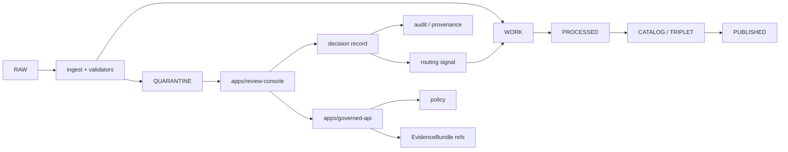

<!-- [KFM_META_BLOCK_V2]
doc_id: kfm://app/review-console/readme
title: Review Console App README
type: app-readme
version: v0.1
status: draft
owners: OWNER_TBD — Apps steward · Review steward · Policy steward · Evidence steward · Release steward · Audit steward · Docs steward
created: 2026-06-16
updated: 2026-06-16
policy_label: public
related:
  - ../README.md
  - ../governed-api/README.md
  - ../explorer-web/README.md
  - ../admin/README.md
  - ../cli/README.md
  - ../workers/README.md
  - ../../docs/architecture/ui/REVIEW_CONSOLE.md
  - ../../docs/governance/REVIEW_DUTIES.md
  - ../../policy/access/README.md
  - ../../policy/decision/README.md
  - ../../schemas/contracts/v1/review/
  - ../../schemas/contracts/v1/evidence/
  - ../../contracts/
  - ../../data/README.md
  - ../../release/README.md
  - ../../packages/evidence-resolver/README.md
  - ../../packages/policy-runtime/README.md
tags: [kfm, apps, review-console, steward-review, quarantine, promotion, correction, sensitivity, evidencebundle, audit, provenance]
notes:
  - "Replaces the short review-console stub with a governed app boundary contract."
  - "This README documents the intended role of apps/review-console/ without claiming routes, UI files, decision recorder, schemas, tests, fixtures, deployments, logs, dashboards, or pass state beyond current-session evidence."
  - "Review Console is role-gated and audited. Mutating review decisions require explicit policy, provenance, tests, and separation-of-duty posture."
[/KFM_META_BLOCK_V2] -->

<a id="top"></a>

<div align="center">

# Review Console App

`apps/review-console/`

**Role-gated steward review surface for KFM quarantine/work adjudication: review queue visibility, item inspection, validator and evidence context, sensitivity and rights review, decision capture, correction support, promotion routing signals, audit/provenance references, and fail-closed review workflows.**


[Purpose](#1-purpose) · [Repo fit](#2-repo-fit) · [Boundary](#3-authority-boundary) · [Inputs](#5-inputs) · [Exclusions](#6-exclusions) · [Surface map](#7-review-console-surface-map) · [Definition of done](#14-definition-of-done)

</div>

---

> [!IMPORTANT]
> **Status:** draft / `NEEDS VERIFICATION`  
> **Owners:** `OWNER_TBD` — Apps steward · Review steward · Policy steward · Evidence steward · Release steward · Audit steward · Docs steward  
> **Path:** `apps/review-console/README.md`  
> **Responsibility root:** `apps/` — deployable application surfaces  
> **Truth posture:** CONFIRMED README path / CONFIRMED apps-root role for review-console / CONFIRMED Review Console architecture doctrine / PROPOSED app contract / UNKNOWN app source, routes, decision recorder, schemas, tests, fixtures, deployment, logs, dashboards, and CI pass state

> [!CAUTION]
> Review Console is not a public path and not a general data editor. It must not read or expose RAW/WORK/QUARANTINE internals directly to normal public clients, mutate published artifacts, bypass governed API/policy gates, or turn reviewer convenience into publication authority.

---

## 1. Purpose

`apps/review-console/` is the proposed role-gated deployable surface for human-in-the-loop KFM review.

It may eventually contain app source, routes, adapters, tests, fixtures, and operator documentation for:

- review queue browsing for routed `WORK/QUARANTINE` items;
- item-detail inspection with source, validator, evidence, policy, and provenance context;
- reviewer role and clearance-aware access;
- sensitivity, rights, source-role, and release-readiness inspection;
- decision capture for approve, reject, defer, annotate, or route outcomes where policy allows;
- correction and rollback-context review support;
- promotion routing signals back into governed pipeline flows;
- durable audit and provenance references;
- safe read-only slices for public/semi-public UI handoff where allowed.

This README does not prove any UI, route, decision recorder, queue API, schema, fixture, test, deployment, log, dashboard, or CI pass state exists.

[Back to top](#top)

---

## 2. Repo fit

| Concern | Owning root | Expected relationship |
|---|---|---|
| Review Console app | `apps/review-console/` | Role-gated deployable review/steward surface |
| Apps root | `apps/` | Deployable application boundary |
| Governed API | `apps/governed-api/` | Trust membrane and normal API path, including elevated audited roles |
| Explorer Web read-only review slice | `apps/explorer-web/src/features/review_console_readonly/` | Read-only visibility; no review mutation |
| Admin app | `apps/admin/` | Restricted administration; not normal review/public path |
| Workers | `apps/workers/` | Emit receipts/candidates; do not publish |
| Review architecture | `docs/architecture/ui/REVIEW_CONSOLE.md` | Proposed architecture and human-in-loop review concepts |
| Policy gates | `policy/` | Access, sensitivity, rights, review, release, and decision policy |
| Evidence support | `packages/evidence-resolver/`, `data/proofs/` | EvidenceBundle support and proof context |
| Lifecycle artifacts | `data/` | Lifecycle state, receipts, proofs, registries, catalog, triplets, published outputs |
| Release authority | `release/` | Publication, correction, rollback, release manifest authority |
| Schemas/contracts | `schemas/contracts/v1/`, `contracts/` | Machine shape and object meaning |

## 3. Authority boundary

Review Console may present and record governed review decisions where explicitly implemented and policy-authorized. It does not own source ingestion, lifecycle storage, schema authority, contract authority, policy authorship, EvidenceBundle truth, release approval by itself, publication, rollback approval by itself, canonical data, public UI rendering, renderer authority, or model/runtime authority.

```text
apps/review-console/        = role-gated review deployable
apps/governed-api/          = trust membrane and elevated audited API path
apps/explorer-web/          = public/semi-public map-first UI consumer
policy/                     = admissibility and decision policy
data/                       = lifecycle artifacts, receipts, proofs, registries
release/                    = publication, correction, rollback authority
schemas/contracts/v1/       = machine shape
contracts/                  = object meaning
packages/                   = reusable helper libraries
```

## 4. Default posture

Review Console should fail closed. A review workflow should not present or submit a mutating decision when any of these are unresolved:

- reviewer identity, role, separation-of-duty, and clearance;
- item lifecycle state and queue eligibility;
- source role, provenance, rights, license, and use terms;
- EvidenceRef and EvidenceBundle support;
- validator report and policy decision state;
- sensitivity, privacy, cultural, ecological, infrastructure, living-person, or DNA/data constraints;
- release, correction, rollback, stale-state, and review-lineage context;
- decision vocabulary, reason codes, and required reviewer rationale;
- audit/provenance write target and rollback path;
- safe error behavior and no raw/internal detail leakage.

## 5. Inputs

| Input family | Examples | Required posture |
|---|---|---|
| Queue state | item id, source summary, validator category, policy label, age, priority | Governed projection only |
| Item detail | normalized preview fields, validator summary, related refs | Redacted, role-gated projection |
| Evidence state | EvidenceRef list, EvidenceBundle refs, source refs, limitations | Resolver-backed and citation-aware |
| Policy state | reviewer role, sensitivity, rights, deny/restrict/hold reason, release precheck | Policy runtime derived |
| Review action | approve, reject, defer, annotate, route, request more evidence | Finite, audited, policy-gated |
| Release/correction context | release manifest ref, correction notice ref, rollback target | Required when review touches publication state |
| Audit/provenance context | reviewer id, decision id, event id, timestamp, reason code | Durable and non-repudiable |
| UI state | loading, ready, denied, restricted, abstained, stale, malformed, error | Explicit finite states |

## 6. Exclusions

| Does not belong here | Correct home |
|---|---|
| Source ingestion and fetchers | `connectors/`, `pipelines/`, `pipeline_specs/` |
| Pipeline transformations | `pipelines/`, `apps/workers/` where appropriate |
| Lifecycle data and canonical stores | `data/` |
| Release manifests, correction notices, rollback cards | `release/` |
| Schemas and contracts | `schemas/contracts/v1/`, `contracts/` |
| Policy rules and sensitivity policy | `policy/` |
| Shared UI or helper libraries | `packages/` |
| Public/semi-public review visibility | `apps/explorer-web/src/features/review_console_readonly/` through governed API |
| General admin shortcuts | `apps/admin/` only when justified and audited |
| Published artifact mutation | Release/correction workflows, not direct console edits |
| Free-form payload editing | Out of scope unless a future ADR changes provenance model |
| Direct model/runtime calls | `runtime/` behind governed API only |
| Secrets or deployment-only values | Deployment environment/config channels |

## 7. Review Console surface map

Exact implementation files remain `NEEDS VERIFICATION`.

| Candidate surface | Purpose | Required safeguard | Status |
|---|---|---|---|
| `queue` | Review queue list, filters, sort, priority | Role-gated governed projection | PROPOSED |
| `item-detail` | Full item context and validator summary | Redacted, lifecycle-aware display | PROPOSED |
| `evidence-pane` | EvidenceBundle/EvidenceRef context | No raw bundle copy to browser unless authorized projection | PROPOSED |
| `spatial-pane` | Map context for items with geometry | No restricted geometry exposure | PROPOSED |
| `decision-pane` | Mutating review decision capture | Sole write affordance; policy and audit required | PROPOSED |
| `history` | Item/reviewer audit and provenance history | Read-only immutable projection | PROPOSED |
| `correction-review` | Correction/rollback context review | Release authority remains separate | PROPOSED |
| `sensitivity-review` | Rights/sensitivity review support | Fail closed for unresolved sensitive status | PROPOSED |
| `safe-errors` | Denied/restricted/abstained/error states | No internal detail leakage | PROPOSED |

> [!WARNING]
> Candidate surface names are not implementation proof. Do not claim a surface is live until files, routes, tests, fixtures, schemas, policy gates, audit/provenance handoffs, and deployment evidence confirm it.

## 8. Diagram



## 9. Review decision contract

Every mutating review decision should be finite, policy-gated, evidence-aware, and auditable.

| Decision family | Meaning | Required posture |
|---|---|---|
| `APPROVE_ROUTE` | Reviewer allows a candidate to route forward | Evidence, policy, review, and audit support required |
| `REJECT_ARCHIVE` | Reviewer rejects and archives/holds item from promotion | Reason code and provenance required |
| `DEFER_HOLD` | Reviewer holds item for more evidence or later review | Hold reason and next-step owner required |
| `ANNOTATE_ONLY` | Reviewer adds non-routing note, if allowed | Must not mutate source payload or publish |
| `ESCALATE` | Reviewer sends item to higher-sensitivity/steward lane | Role and policy handoff required |

## 10. Review Console obligations

| Obligation | Example effect |
|---|---|
| `role_gated_access` | Reviewer identity and clearance are checked before queue/detail/decision views |
| `single_decision_write_path` | Mutating decisions use a governed decision recorder, not ad hoc UI writes |
| `no_payload_editing` | Underlying item payload remains immutable from the console |
| `evidence_required` | Review decisions carry EvidenceRef/EvidenceBundle support where material |
| `policy_required` | Sensitivity, rights, review, and release policy gates run before decisions |
| `auditability_required` | Reviewer, timestamp, reason, decision id, and provenance refs are durable |
| `release_separation` | Review decision is not the same as publication/release approval |
| `safe_error_only` | Errors reveal no protected data, internal paths, or raw validator internals |
| `read_only_slice_separated` | Explorer Web read-only review feature cannot mutate lifecycle state |
| `rollback_path_visible` | Decisions affecting release/promotion have correction/rollback context |

## 11. Inspection path

App source, routes, decision recorder, schemas, tests, fixtures, policy integration, audit/provenance writes, deployment state, logs, dashboards, and emitted artifacts remain `NEEDS VERIFICATION`.

```bash
find apps/review-console -maxdepth 6 -type f | sort
find apps/review-console apps/governed-api apps/explorer-web docs/architecture/ui policy schemas contracts data release packages tests fixtures -maxdepth 6 -type f 2>/dev/null | grep -Ei 'review.?console|ReviewRecord|ReviewDecision|EvidenceRef|EvidenceBundle|PolicyDecision|ReleaseManifest|CorrectionNotice|RollbackCard|quarantine|promot|defer|reject|approve|audit|prov|rbac|sensitivity|test|fixture' | sort
```

## 12. Validation expectations

Useful validation for this app should cover:

- queue/detail access denied for unauthorized roles;
- read-only views cannot submit decisions or mutate lifecycle state;
- only the decision pane or decision recorder can create decision records;
- reviewer decisions do not edit original payloads;
- decisions preserve reviewer identity, reason code, timestamps, EvidenceRef/EvidenceBundle refs, policy refs, audit/provenance refs, and routing signal refs;
- published artifacts cannot be edited directly from Review Console;
- sensitive, rights-limited, living-person, DNA, cultural, ecology, infrastructure, or exact-location cases fail closed when clearance or transform support is missing;
- safe errors reveal no raw payload, internal store path, protected detail, or validator internals.

## 13. Safe change pattern

For Review Console changes:

1. Add or update queue/detail/decision surface inventory.
2. Link DTOs to schemas/contracts before changing request or decision shapes.
3. Add fixtures for authorized view, unauthorized denial, missing evidence, policy denial, stale item, invalid decision, approve, reject, defer, annotate, escalate, safe error, and audit write cases.
4. Add policy and separation-of-duty tests before exposing mutating decisions.
5. Preserve EvidenceRef/EvidenceBundle refs, PolicyDecision refs, release/correction/rollback refs, audit/provenance refs, reason codes, and limitations through every decision.
6. Update this README, governed API docs, Explorer Web read-only review docs, policy docs, schemas/contracts, and tests when behavior materially changes.

## 14. Definition of done

- [ ] Owners are confirmed and `OWNER_TBD` is replaced.
- [ ] App source and route inventory are documented.
- [ ] Queue/detail/decision DTOs and schemas are verified.
- [ ] Authorization, policy runtime, evidence resolver, release lookup, decision recorder, audit/provenance writer, and rollback hooks are documented and tested.
- [ ] Read-only surfaces cannot mutate state.
- [ ] Decision recorder writes are finite, auditable, and policy-gated.
- [ ] No-payload-editing tests are present and passing.
- [ ] Sensitive-domain and role-denial tests are present and passing.
- [ ] Safe-error tests are present and passing.
- [ ] Deployment, logs, dashboards, and runbooks are documented with current evidence.

## 15. Open verification items

| Item | Why it matters |
|---|---|
| Confirm app source files beyond README | Prevents overclaiming implementation maturity |
| Confirm route/API integration | Required before queue/detail/decision behavior claims |
| Confirm decision recorder location | Required before mutating review claims |
| Confirm schemas and DTOs | Required before contract claims |
| Confirm authorization and separation-of-duty logic | Required before role-gated claims |
| Confirm EvidenceBundle and policy integration | Required before review support claims |
| Confirm audit/provenance writes | Required before durable decision claims |
| Confirm release/correction/rollback integration | Required before promotion/correction claims |
| Confirm tests and fixtures | Required before runtime maturity claims |
| Confirm deployment, logs, dashboards, and runbooks | Required before operational claims |

<details>
<summary>Appendix A — no-loss preservation note</summary>

The previous README was a short stub: "Steward review, promotion, correction, sensitivity review. Read-only first slice." This replacement preserves that intent while separating app-level role-gated review from the Explorer Web read-only review slice and keeping mutating review decisions bounded behind policy, provenance, audit, and verification requirements.

</details>

## Status summary

`apps/review-console/` should contain the role-gated review deployable only after source inventory, route integration, queue/detail/decision schemas, authorization, policy runtime integration, evidence resolver integration, decision recorder, audit/provenance writes, release/correction/rollback support, tests, and operational evidence are verified.

It must preserve the KFM trust membrane and review boundary: Review Console may support human adjudication, but it must not become a public path, raw data editor, publication authority, release authority by itself, schema/contract/policy root, lifecycle store, proof store, public UI renderer, or unreviewed shortcut around governed API and audit controls.

<p align="right"><a href="#top">Back to top</a></p>
