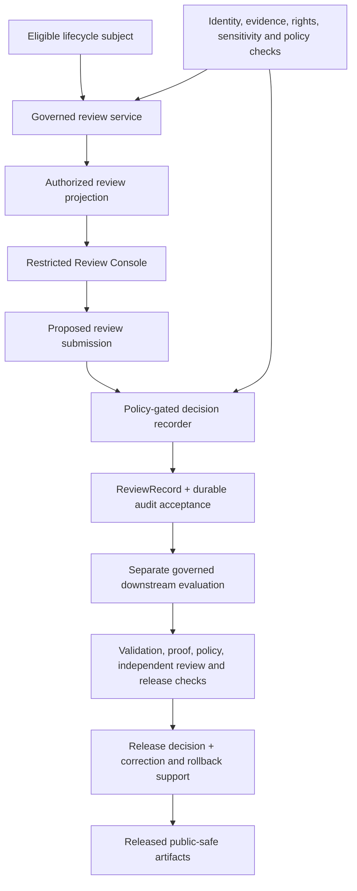

<!-- [KFM_META_BLOCK_V2]
doc_id: kfm://app/review-console/readme
title: Review Console App README
type: app-readme
version: v0.2
status: draft; repository-grounded; documentation-scaffold; non-publisher
owners: OWNER_TBD — Apps steward · Review steward · Policy steward · Evidence steward · Release steward · Audit steward · Docs steward
created: 2026-06-16
updated: 2026-09-05
policy_label: public
current_path: apps/review-console/README.md
owning_root: apps/
responsibility: Orient contributors to the restricted review application boundary, verified scaffold, separate fixture-validation support, and safe implementation sequence.
truth_posture: cite-or-abstain; repository presence is not operational readiness
evidence_snapshot:
  repository: bartytime4life/Kansas-Frontier-Matrix
  base_commit: cbd6d82bad962a58ab62cfb776ee31696b575107
  app_tree: 33e26773850d908973f78c0bf179d30e5aa57eed
  prior_readme_blob: 02512b6b8d16a8f1dfcd4c564f8b6d68b61b49e3
  package_blob: 9c83b3dee793e2428a33c4aae072e668f1c2a4f8
  source_tree: a04f0ea489839e3b8fd8742c22f3e08b7c661bf8
  directory_rules_blob: fd49a0b83e55cef52c1124281f093e263526898d
related:
  - ../README.md
  - ./package.json
  - ./src/README.md
  - ./src/features/README.md
  - ../governed-api/README.md
  - ../explorer-web/src/features/review_console_readonly/README.md
  - ../../docs/architecture/ui/REVIEW_CONSOLE.md
  - ../../docs/doctrine/directory-rules.md
  - ../../docs/adr/ADR-0029-adopt-directory-governance-standard-v2.md
  - ../../contracts/governance/ReviewRecord.md
  - ../../schemas/contracts/v1/governance/review_record.schema.json
  - ../../tools/validators/validate_review_record.py
  - ../../CONTRIBUTING.md
tags: [kfm, apps, review-console, steward-review, evidence, policy, sensitivity, audit, correction, rollback]
notes:
  - "Same-path documentation update; document identity and existing section anchors are retained."
  - "Eleven tracked app files were inspected: ten READMEs and one placeholder package manifest. No executable app source, app-local tests, or app-local fixtures are present in this subtree."
  - "Role gating, review submission, audit persistence, and deployment are requirements, not implemented app capabilities."
  - "ReviewRecord fixture validation is separate from a Review Console runtime and creates no review, promotion, release, or publication authority."
[/KFM_META_BLOCK_V2] -->

<a id="top"></a>

# Review Console App

`apps/review-console/` is the reserved application home for **restricted steward review**, not a running review service. Its intended job is to inspect governed review projections and, after a separately validated write path exists, submit accountable review records. It is neither a general data editor nor a publication console.

> [!IMPORTANT]
> **Current maturity: documentation scaffold.** At the [inspected commit](https://github.com/bartytime4life/Kansas-Frontier-Matrix/commit/cbd6d82bad962a58ab62cfb776ee31696b575107), this subtree contains ten READMEs and a private `review-console@0.0.0` manifest. There are no app entrypoints, routes, package scripts, dependencies, app-local tests, or app-local fixtures. Authentication, authorization, decision recording, audit persistence, and deployment are not established. “Role-gated” describes a required boundary, not a functioning control.

**Navigation:** [Purpose](#1-purpose) · [Repo fit](#2-repo-fit) · [Authority](#3-authority-boundary) · [Inputs](#5-inputs) · [Exclusions](#6-exclusions) · [Feature map](#7-review-console-surface-map) · [Decisions](#9-review-decision-contract) · [Inspection](#11-inspection-path) · [Validation](#12-validation-expectations) · [Completion gates](#14-definition-of-done)

## 1. Purpose

The proposed console supports human review across the lifecycle: eligible WORK or QUARANTINE candidates, evidence and validation gaps, rights and sensitivity questions, promotion readiness, and correction or rollback context. It does not own every KFM review duty, and review is not limited to one physical quarantine folder.

The [Review Console architecture](../../docs/architecture/ui/REVIEW_CONSOLE.md) explains the broader design. This README owns app-level orientation and the current file inventory; it does not create a second architecture, contract, policy, or release authority.

| Inspected surface | Truth / maturity | What the evidence establishes |
|---|---|---|
| This app and its seven feature lanes | CONFIRMED / DRAFT | Documentation and a placeholder manifest exist; executable app behavior is absent in this subtree. |
| [Package manifest](package.json) | CONFIRMED / DRAFT | `name: review-console`, `private: true`, `version: 0.0.0`; no `scripts`, `dependencies`, or `devDependencies`. |
| [Explorer read-only review entry](../explorer-web/src/features/review_console_readonly/index.tsx) | CONFIRMED / DRAFT | It exports `placeholder = true`; it is not an integrated review viewer or a decision API. |
| [ReviewRecord validator](../../tools/validators/validate_review_record.py) | CONFIRMED / IMPLEMENTED, fixture-only | Separate executable checks for synthetic release-promotion review projections exist; execution results must be recorded separately. |
| Integrated identity, queue, API, evidence, policy, audit, and release handoffs | UNKNOWN / NOT INSPECTED as a running system | Documentation and validator source do not establish an operational review service. |

These observations are pinned to the commit above. Reinspect before implementation; source presence, test execution, review approval, deployment, and publication are separate facts.

## 2. Repo fit

**Directory Rules basis:** accepted [ADR-0029](../../docs/adr/ADR-0029-adopt-directory-governance-standard-v2.md) adopts [Directory Rules](../../docs/doctrine/directory-rules.md). Section 10.1 assigns deployable composition to `apps/`; sections 9.3 and 11 separate meaning, shape, admissibility, lifecycle/accountability records, and release decisions. This same-path update changes no root or authority boundary.

| Responsibility | Owning surface | Relationship to this app |
|---|---|---|
| Deployable composition | [Apps root](../README.md), this app, [source guide](src/README.md) | App-local shell and review workflow composition, when implemented |
| Governed interface | [Governed API](../governed-api/README.md) | Role-appropriate projections and a separately admitted review-write interface; no live queue or submission route is claimed here |
| Public/semi-public visibility | [Explorer read-only review](../explorer-web/src/features/review_console_readonly/README.md) | Separate consumer; no import or exposure of mutating review behavior |
| Object meaning and machine shape | [ReviewRecord contract](../../contracts/governance/ReviewRecord.md), [governance schema](../../schemas/contracts/v1/governance/review_record.schema.json) | Existing draft/proposed definitions, not a newly accepted submission contract |
| Access, rights, sensitivity, and action rules | [Policy root](../../policy/) | The app consumes decisions; it does not author or override policy |
| Lifecycle state, receipts, and proofs | [Data root](../../data/) | Records stay outside the browser and app source tree |
| Promotion, release, correction, and rollback decisions | [Release root](../../release/) | Independent governed transitions, not side effects of a review button |
| Shared implementation and exposure | [Packages](../../packages/), [infrastructure](../../infra/) | Reuse and deployment remain separate from app-local composition |

## 3. Authority boundary

Preserve the KFM lifecycle:

```text
RAW -> WORK / QUARANTINE -> PROCESSED -> CATALOG / TRIPLET -> PUBLISHED
```

Promotion is a governed transition, never a file move, completed job, accepted review, or UI toggle. Public clients use governed APIs or released public-safe artifacts, never internal or unreleased stores. A restricted console must also use authorized projections rather than treating a reviewer role as permission to browse storage directly.

A `ReviewRecord` is distinct from an `EvidenceRef`, `EvidenceBundle`, `PolicyDecision`, `PromotionDecision`, release manifest, correction notice, rollback record, receipt, proof, or audit reference. Review may support a decision; it cannot manufacture evidence or authorize its own release.

Maps, tiles, spatial previews, charts, summaries, and AI are carriers, not truth. A future spatial pane must preserve allowed precision and evidence references. A generated rationale cannot replace a reviewer, evidence, policy, approval, or release state.

## 4. Default posture

**Required for future implementation, not currently enforced by this scaffold:** read-only first; deny by default; least privilege; safe errors; no payload editing; one audited review-submission boundary.

Do not enable a mutation while reviewer identity, assignment, clearance, separation of duties, subject version, evidence support, policy outcome, rights, sensitivity, or durable audit acceptance is unresolved. A failed submission must not look accepted; a successful review submission must not look published.

Where rights, sovereignty, cultural context, living-person or DNA data, rare species, archaeology, infrastructure, private land, or exact locations are unclear, retain quarantine, denial, redaction, generalization, or staged access as required by the owning policy. Record transformation reasons upstream. Hiding protected fields after delivering them to the browser is not redaction.

## 5. Inputs

The following are **proposed input families**, not implemented DTOs or route contracts.

| Input | Required boundary |
|---|---|
| Queue and subject projection | Authorized, minimized fields; stable subject identity and version; no disclosure through counts, filters, or deep links |
| Evidence and validation context | Resolvable EvidenceRef/EvidenceBundle support, source role, validator findings, uncertainty, and explicit gaps |
| Reviewer and policy context | Server-established identity, assignment, scope, clearance, obligations, and policy version; no client-authored authority |
| Time and state | Keep observation/valid time, review time, authority validity, evaluation time, staleness, supersession, and release state distinct |
| Release/correction/rollback context | Relevant references and blocked transitions; review cannot change the underlying release decision |
| Review submission | Versioned, finite vocabulary; rationale, subject binding, replay/concurrency handling, and durable acceptance semantics |

Loading, empty, ready, restricted, denied, abstained, stale, malformed, and error views must remain distinguishable. A fixture validator's `PASS` is not a UI authorization or publication state.

## 6. Exclusions

Do not place canonical data, source captures, policy rules, schemas, semantic contracts, release records, proof objects, or credentials inside this app. Source acquisition belongs in `connectors/`; transformations in `pipelines/`; shared logic in `packages/`; authoritative records in their existing data or release lanes.

The console must not directly edit published artifacts, expose a public administration shortcut, call a model runtime directly, turn AI output into evidence, or reuse the Explorer's public read-only lane as a mutation channel. Deployment and network exposure require their own reviewed configuration and authority; no public launch is implied by this README.

## 7. Review Console surface map

The complete app inventory is **11 tracked files: this README, `package.json`, `src/README.md`, `src/features/README.md`, and the seven feature READMEs below**. Each feature directory contains only its README at the inspected snapshot. The directory names are real; the described behavior is proposed.

| Existing feature guide | Intended responsibility | Required limit |
|---|---|---|
| [Queue](src/features/queue/README.md) | Eligible subject browsing, filters, assignment, and age | Governed projection; no count or metadata leakage |
| [Record view](src/features/record_view/README.md) | Subject detail, evidence, validation, and spatial context | Read-only; no underlying payload edits |
| [Sensitivity review](src/features/sensitivity_review/README.md) | Rights, consent, sovereignty, and precision review | Fail closed; cannot clear itself for public exposure |
| [Promotion](src/features/promotion/README.md) | Readiness context and recommendation | No lifecycle promotion or release execution |
| [Correction](src/features/correction/README.md) | Correction and supersession context | No silent overwrite of prior evidence or release records |
| [Rollback](src/features/rollback/README.md) | Target, reason, and impact inspection | No rollback execution or approval by itself |
| [Audit log](src/features/audit_log/README.md) | History and durable acceptance references | Read-only projection, not the audit store |

The [feature index](src/features/README.md) and source guide are navigation, not runtime proof. Evidence panes, spatial panes, safe-error views, and a decision pane remain design concepts; this update creates no additional feature directory, component, route, or decision recorder.

## 8. Diagram

**Proposed integration, not an implemented wiring diagram.** Every arrow into a restricted client is an authorized projection. The browser has no direct storage path.


```mermaid
flowchart TD
    subject["Eligible lifecycle subject"] --> service["Governed review service"]
    checks["Identity, evidence, rights, sensitivity and policy checks"] --> service
    service --> projection["Authorized review projection"]
    projection --> console["Restricted Review Console"]
    console --> request["Proposed review submission"]
    request --> recorder["Policy-gated decision recorder"]
    checks --> recorder
    recorder --> review["ReviewRecord + durable audit acceptance"]
    review --> process["Separate governed downstream evaluation"]
    process --> gate["Validation, proof, policy, independent review and release checks"]
    gate --> decision["Release decision + correction and rollback support"]
    decision --> published["Released public-safe artifacts"]
```

Review acceptance and downstream processing can fail separately. Expose the actual result, keep non-release outcomes visible, and preserve retry/reconciliation records; do not treat the last arrow as automatic after review.

## 9. Review decision contract

The [semantic ReviewRecord contract](../../contracts/governance/ReviewRecord.md) is draft. The [governance ReviewRecord schema](../../schemas/contracts/v1/governance/review_record.schema.json) declares `x-kfm.status: PROPOSED`; it requires `review_id`, `subject_ref`, `reviewer_role`, `decision`, `reasons`, `obligations`, and `reviewed_at`, and rejects undeclared fields.

**The inspected schema's decision vocabulary is `approve`, `reject`, `request_changes`.** This is a description of existing proposed schema bytes, not adoption of a production submission API. The schema alone does not authenticate a reviewer, bind authority, require evidence closure, persist an audit event, or grant release permission.

The separate [fixture validator](../../tools/validators/validate_review_record.py) validates a richer synthetic promotion packet. Its `release.promotion_gate` profile checks identity separation, assignment scope and validity, subject/spec/artifact binding, expiry, supersession, and obligations. It requires `approve` for that gate; open obligations yield `ABSTAIN`. Other failures can yield `DENY` or `ERROR`. These are profile-specific validation outcomes, not a universal review state machine.

The v0.1 labels `APPROVE_ROUTE`, `REJECT_ARCHIVE`, `DEFER_HOLD`, `ANNOTATE_ONLY`, and `ESCALATE` are retained here as **proposal lineage only**. They are not valid decision values in that schema and are not implemented actions. Do not silently map them to `approve`, add fields to the closed schema, or treat annotation/escalation as permission to mutate a payload. Reconcile meaning, shape, policy, and downstream effects in their owning artifacts before admitting a write path.

## 10. Review Console obligations

| Obligation for future implementation | Acceptance evidence needed |
|---|---|
| Role- and subject-scoped access | Denial tests for unauthenticated, expired, wrong-scope, and insufficient-clearance requests |
| Read-only default and single write boundary | No direct lifecycle/evidence/release writes; one admitted recorder interface |
| No self-authorization | Independent authority checks; author/reviewer separation where required |
| Evidence-aware decisions | Evidence references, policy references, subject/version binding, and visible unresolved support |
| Durable, replay-safe acceptance | Duplicate submission, stale version, partial failure, audit outage, and safe retry tests |
| Release separation | Accepted review cannot issue a release decision or mark an artifact PUBLISHED |
| Safe presentation | No sensitive fields, raw paths, credentials, unsafe markup, or protected geometry leakage |
| Accessible review | Keyboard completion, focus handling, non-color states, and an alternative to map-only inspection |

These obligations are requirements, not a claim that this app currently satisfies them.

## 11. Inspection path

There is **no supported console start, build, or app-test command yet**: the app manifest has no scripts. Do not invent `pnpm --filter review-console dev`, a port, a URL, or an environment-variable contract. Workspace membership would not make this scaffold launchable.

From a repository checkout, inspect the exact historical baseline:

```bash
git ls-tree -r --name-only cbd6d82bad962a58ab62cfb776ee31696b575107 -- apps/review-console
git show cbd6d82bad962a58ab62cfb776ee31696b575107:apps/review-console/package.json
```

Then re-pin current main and compare before building. Read the [contributor guide](../../CONTRIBUTING.md), the app/source guides, and the actual package/workflow files. Preserve the workspace's existing dependency build-script policy; this documentation update neither installs dependencies nor changes that policy.

## 12. Validation expectations

### Existing, separate fixture check

The validator source implements the following command, to be run from a complete repository checkout:

```bash
KFM_NO_NETWORK=1 PYTHONHASHSEED=0 PYTHONDONTWRITEBYTECODE=1 \
  PYTHONUNBUFFERED=1 TZ=UTC \
  python tools/validators/validate_review_record.py --fixtures
```

It checks repository-owned synthetic promotion-review fixtures, including expected negative outcomes, without creating authoritative review or release records. It is **not an app test, live-identity check, or production approval**. See the architecture's [test surface](../../docs/architecture/ui/REVIEW_CONSOLE.md#12-test-surface) for the broader fixture and future integration matrix. Command existence does not mean it passed in this README update.

### Documentation and implementation checks

For this README, check the inventory, manifest claims, links, preserved anchors, tables, code fences, final newline, and whitespace. Validate the required generated-work receipt against the [existing receipt schema](../../schemas/contracts/v1/receipts/generated_receipt.schema.json) and recompute the README hash. Report exactly which checks ran; no hosted pass state is asserted here.

For a future runtime, add positive and negative tests for authorization, evidence gaps, policy denial, stale/superseded subjects, unknown dispositions, no-payload-editing, audit outage, retries, concurrent decisions, release separation, sensitive geometry, safe errors, and accessibility. A synthetic test success must remain distinguishable from live service or release readiness.

## 13. Safe change pattern

1. Re-pin current main, target bytes, relevant authority, and overlapping PRs/branches. Preserve the existing app identity and section anchors; avoid unrelated Explorer, API, topology, or policy changes.
2. Build the smallest dependency-closed **synthetic read-only** queue/detail slice first. Admit package scripts and dependencies explicitly, with tests and a safe unconfigured state; do not enable live acquisition or public access.
3. Keep a write-capable slice separate until its semantic/schema profile, actor authority, policy evaluation, subject binding, replay/concurrency behavior, durable audit acceptance, and failure recovery are defined and tested. UI-disabled buttons alone are not authorization.
4. Update behavior-linked app/API/contract/schema/policy/test documentation only where the implementation actually changes it. Keep generated receipts as process memory and human review pending; authoring does not grant merge, release, deployment, promotion, or publication authority.

**Rollback for this documentation change:** restore prior README blob `02512b6b8d16a8f1dfcd4c564f8b6d68b61b49e3` in a reviewed, non-force follow-up and rerun the same checks. Preserve the authoring receipt as history and record any correction rather than rewriting evidence. No data or runtime migration is required.

## 14. Definition of done

The README refresh is complete when its current-state claims, navigation, distinctions, and authoring receipt are verified. **An operational console has separate, still-open completion gates:**

- [ ] Named application and review stewards are confirmed; review routing is not mistaken for independent approval.
- [ ] An app entrypoint, framework, package scripts, configuration, and route inventory are implemented and tested.
- [ ] Queue/detail projections and any submission contract are versioned and reconciled with their owning schemas and policy.
- [ ] Identity, authority, evidence, sensitivity, policy, and audit integrations are tested, including outages and denials.
- [ ] Read-only surfaces cannot mutate records; source payloads and published artifacts remain immutable to the console.
- [ ] Any admitted recorder rejects stale, replayed, unbound, unauthorized, or insufficiently supported submissions.
- [ ] Browser, accessibility, no-leak, recovery, and release-separation tests have exact execution evidence.
- [ ] Deployment, operating ownership, retention, monitoring, correction, and rollback have separately approved evidence.

## 15. Open verification items

| Gap | First blocked transition |
|---|---|
| No executable app or package scripts in the inspected subtree | App startup/build/test claims |
| Production disposition vocabulary and submission profile unresolved | Mutating review submission |
| Actor/assignment authority, clearance, and independent stewardship unproved | Access to restricted subjects or consequential review |
| Governed queue/detail/evidence/policy integration not demonstrated | Live reviewer data access |
| Decision recorder, audit persistence, atomicity, retry, and concurrency unproved | Durable acceptance of a review |
| Operational review ledger, deployment, and recovery not verified | Operational readiness or external exposure |
| Release/correction/rollback handoff not demonstrated | Any downstream promotion or publication claim |

<details>
<summary>Appendix A — no-loss preservation note</summary>

The original stub said: “Steward review, promotion, correction, sensitivity review. Read-only first slice.” The v0.1 expansion established the app boundary. This v0.2 refresh preserves that intent, document identity, H1, and existing section anchors while replacing June-era generic unknowns with a pinned scaffold inventory, correcting the conceptual trust flow, and separating proposal vocabulary from the existing ReviewRecord schema and fixture profile. Child guides remain separate documents with their own evidence dates.

</details>

## Status summary

**CONFIRMED scaffold; PROPOSED operational console; no release or publication effect.** The app has an established responsibility home and useful feature documentation. Separate synthetic review validation exists, but neither that validator nor this README supplies a runnable console, authenticated reviewer, decision recorder, durable review ledger, or publication authority.

[Back to top](#top)
