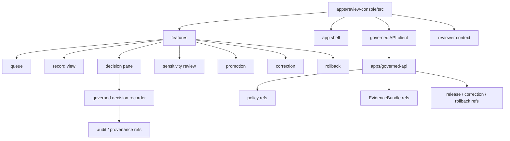

<!-- [KFM_META_BLOCK_V2]
doc_id: kfm://app/review-console/src/readme
title: Review Console Source README
type: app-readme
version: v0.1
status: draft
owners: OWNER_TBD — Review steward · UI steward · API steward · Policy steward · Evidence steward · Release steward · Audit steward · Docs steward
created: 2026-06-16
updated: 2026-06-16
policy_label: public
related:
  - ../README.md
  - ./features/README.md
  - ../../README.md
  - ../../governed-api/README.md
  - ../../explorer-web/src/features/review_console_readonly/README.md
  - ../../../docs/architecture/ui/REVIEW_CONSOLE.md
  - ../../../docs/governance/REVIEW_DUTIES.md
  - ../../../policy/access/README.md
  - ../../../policy/decision/README.md
  - ../../../schemas/contracts/v1/review/
  - ../../../schemas/contracts/v1/evidence/
  - ../../../contracts/
  - ../../../data/README.md
  - ../../../release/README.md
  - ../../../packages/ui/README.md
  - ../../../packages/evidence-resolver/README.md
  - ../../../packages/policy-runtime/README.md
tags: [kfm, apps, review-console, src, feature-source, role-gated-review, steward-console, audit, provenance, finite-states]
notes:
  - "Replaces an empty Review Console source README with a bounded app-local source-tree contract."
  - "This path may hold Review Console implementation source, but it must not become review doctrine, policy authority, schema authority, contract authority, lifecycle storage, release authority, proof storage, shared package root, public UI authority, or runtime adapter authority."
  - "Source files, routes, decision recorder integration, schemas, tests, fixtures, policy enforcement, deployment state, logs, dashboards, and CI pass state remain NEEDS VERIFICATION."
[/KFM_META_BLOCK_V2] -->

<a id="top"></a>

<div align="center">

# Review Console Source

`apps/review-console/src/`

**App-local implementation source boundary for the role-gated Review Console deployable: feature composition, review queue/detail workflows, decision handoff, policy-aware UI state, governed API calls, audit/provenance refs, and safe failure states.**


[Purpose](#1-purpose) · [Repo fit](#2-repo-fit) · [Boundary](#3-authority-boundary) · [Inputs](#5-inputs) · [Exclusions](#6-exclusions) · [Source map](#7-source-family-map) · [Definition of done](#14-definition-of-done)

</div>

---

> [!IMPORTANT]
> **Status:** draft / `NEEDS VERIFICATION`  
> **Owners:** `OWNER_TBD` — Review steward · UI steward · API steward · Policy steward · Evidence steward · Release steward · Audit steward · Docs steward  
> **Path:** `apps/review-console/src/README.md`  
> **Responsibility root:** `apps/` — deployable application surfaces  
> **Truth posture:** CONFIRMED README path / CONFIRMED Review Console app boundary / CONFIRMED feature-source parent / PROPOSED source-tree contract / UNKNOWN source files, routes, feature inventory, decision recorder integration, schemas, tests, fixtures, runtime behavior, deployment state, and CI pass state

> [!CAUTION]
> This source tree is not a public path, lifecycle store, schema/contract/policy root, release authority, proof store, or shared package root. It must compose governed Review Console behavior through policy-aware, auditable, role-gated interfaces and must not turn convenience UI into publication or mutation authority.

---

## 1. Purpose

`apps/review-console/src/` is the proposed source boundary for the Review Console deployable.

It may eventually contain app-local implementation source for:

- shell and layout composition;
- feature registration and routing;
- queue, record view, evidence, spatial, decision, history, correction, promotion, rollback, sensitivity review, and safe-state features;
- governed API client calls for elevated audited review routes;
- policy-aware view models and finite UI states;
- decision-recorder handoff adapters;
- audit/provenance reference display;
- fixture-backed app-local tests where appropriate;
- safe error rendering and no-internal-detail behavior.

This README does not prove any source file, route, component, hook, view model, API client, decision recorder, schema, fixture, test, deployment, log, dashboard, or CI pass state exists.

[Back to top](#top)

---

## 2. Repo fit

| Concern | Owning root | Expected relationship |
|---|---|---|
| Review Console source | `apps/review-console/src/` | App-local implementation source, if implemented |
| Review Console app | `apps/review-console/` | Role-gated review/steward deployable |
| Review Console features | `apps/review-console/src/features/` | App-local feature modules |
| Governed API | `apps/governed-api/` | Trust membrane and elevated audited API path |
| Explorer Web read-only review | `apps/explorer-web/src/features/review_console_readonly/` | Separate public/semi-public read-only visibility |
| Review architecture | `docs/architecture/ui/REVIEW_CONSOLE.md` | Proposed review-console concepts and surfaces |
| Policy gates | `policy/` | Access, sensitivity, rights, review, release, and decision policy |
| Evidence support | `packages/evidence-resolver/`, `data/proofs/` | EvidenceBundle support and proof context |
| Shared UI primitives | `packages/ui/` | Reusable UI pieces after extraction and review |
| Lifecycle artifacts | `data/` | Lifecycle state, receipts, proofs, registries, catalog, triplets, published outputs |
| Release authority | `release/` | Publication, correction, rollback, release manifest authority |
| Schemas/contracts | `schemas/contracts/v1/`, `contracts/` | Machine shape and object meaning |

## 3. Authority boundary

This source tree may implement the Review Console app. It does not own review doctrine, access policy, sensitivity policy, schemas, contracts, lifecycle storage, EvidenceBundle truth, proof/receipt storage, release decisions, correction or rollback authority, source ingestion, pipeline transforms, public UI rendering, shared libraries, runtime/model adapters, deployment configuration, logs, or dashboards.

```text
apps/review-console/src/          = app-local Review Console implementation source
apps/review-console/src/features/ = app-local feature modules
apps/review-console/              = role-gated review deployable
apps/governed-api/                = trust membrane and elevated audited API path
apps/explorer-web/                = public/semi-public map-first UI consumer
policy/                           = admissibility and decision policy
schemas/contracts/v1/             = machine shape
contracts/                        = object meaning
data/                             = lifecycle artifacts, receipts, proofs, registries
release/                          = publication, correction, rollback authority
packages/                         = reusable helper libraries and shared UI primitives
runtime/                          = adapters behind governed API
```

## 4. Default posture

Review Console source should fail closed. Source modules should not display, enable, or submit review content when any of these are unresolved:

- reviewer identity, role, separation-of-duty, and clearance;
- governed API envelope and response validation;
- item lifecycle state and queue eligibility;
- source role, provenance, rights, license, and use terms;
- EvidenceRef and EvidenceBundle support;
- validator report and policy decision state;
- sensitivity, rights, consent, redaction, release, correction, rollback, stale-state, and review-lineage context;
- decision vocabulary, reason codes, and required reviewer rationale;
- audit/provenance write target and rollback path;
- safe error behavior and no raw/internal detail leakage.

## 5. Inputs

| Input family | Examples | Required posture |
|---|---|---|
| Governed API responses | queue projection, item detail, evidence refs, policy refs, release refs | Validated envelope only |
| Reviewer context | identity, role, clearance, assignment lane, separation-of-duty state | Policy-runtime derived |
| Feature state | queue, record view, evidence, decision, correction, promotion, rollback, sensitivity, audit | Explicit finite states |
| Review action | approve, reject, defer, annotate, route, request evidence, escalate | Finite, audited, policy-gated |
| Evidence state | EvidenceRef list, EvidenceBundle refs, source refs, limitations | Resolver-backed and citation-aware |
| Release/correction context | release manifest ref, correction notice ref, rollback target | Required when review touches publication state |
| Audit/provenance context | reviewer id, decision id, event id, timestamp, reason code | Durable and non-repudiable |
| UI state | loading, ready, denied, restricted, abstained, stale, malformed, error | Explicit finite states |

## 6. Exclusions

| Does not belong here | Correct home |
|---|---|
| Review Console app-level contract | `apps/review-console/README.md` |
| Public/semi-public read-only review visibility | `apps/explorer-web/src/features/review_console_readonly/` |
| Shared UI primitives and reusable helpers | `packages/` after extraction and review |
| Access, sensitivity, rights, and release policy rules | `policy/` |
| Schemas and contracts | `schemas/contracts/v1/`, `contracts/` |
| Lifecycle data and canonical stores | `data/` |
| Receipts, proofs, registry, catalog, triplets, published outputs | `data/` |
| Release manifests, correction notices, rollback cards | `release/` |
| Source ingestion and fetchers | `connectors/`, `pipelines/`, `pipeline_specs/` |
| Pipeline transformations and watcher behavior | `pipelines/`, `apps/workers/` where appropriate |
| Published artifact mutation | Release/correction workflows, not source-local edits |
| Free-form payload editing | Out of scope unless future ADR changes provenance model |
| Direct model/runtime calls | `runtime/` behind governed API only |
| Deployment-only values | Deployment environment/config channels |

## 7. Source family map

Exact implementation files remain `NEEDS VERIFICATION`.

| Candidate source family | Purpose | Required safeguard | Status |
|---|---|---|---|
| `features/` | Role-gated Review Console feature modules | App-local source only | CONFIRMED README / implementation UNKNOWN |
| `app_shell` | Layout, navigation, app boot, finite global states | No policy or release authority | PROPOSED |
| `api_client` | Governed API client wrapper | Envelope validation and safe errors | PROPOSED |
| `auth_context` | Reviewer identity/role/clearance context | Policy-derived and fail-closed | PROPOSED |
| `decision_handoff` | Adapter to governed decision recorder | Single mutating handoff path | PROPOSED |
| `view_models` | Bounded UI state shaping | No source-of-truth role | PROPOSED |
| `test_fixtures` | App-local fixture support | No real sensitive payloads | PROPOSED |
| `safe_states` | Denied/restricted/abstained/stale/error render helpers | No internal detail leakage | PROPOSED |

> [!WARNING]
> Candidate source-family names are not implementation proof. Do not claim a source module is live until files, routes, schemas, fixtures, tests, policy gates, and governed API envelopes confirm it.

## 8. Diagram



## 9. Source obligations

| Obligation | Example effect |
|---|---|
| `role_gated_access` | Reviewer role and clearance gate app and feature access |
| `governed_api_only` | Source code consumes governed API projections, not lifecycle stores |
| `read_only_by_default` | Non-decision features cannot mutate lifecycle state |
| `single_decision_path` | Mutating review decisions pass through governed decision handoff |
| `no_payload_editing` | Source code cannot edit original item payloads |
| `policy_required` | Sensitivity, rights, review, and release policy gates control display and action |
| `evidence_required` | Decision-supporting views carry EvidenceRef/EvidenceBundle references where material |
| `auditability_required` | Decision handoff preserves reviewer, timestamp, reason, and provenance refs |
| `release_separation` | Review recommendations are not publication/release approval by themselves |
| `safe_error_only` | Errors reveal no protected data, internal paths, raw payloads, or validator internals |

## 10. Child README contract

Each child source directory should state:

- source purpose and owner;
- accepted governed input shape;
- denied inputs and correct homes;
- read/write posture;
- policy/access dependency;
- EvidenceBundle dependency where material;
- audit/provenance dependency;
- release/correction/rollback dependency where material;
- tests and fixtures required;
- safe-disable or rollback path;
- open verification items.

## 11. Inspection path

Source files, routes, schemas, tests, fixtures, policy integration, governed API envelopes, decision-recorder handoff, audit/provenance writes, deployment state, logs, dashboards, and emitted artifacts remain `NEEDS VERIFICATION`.

```bash
find apps/review-console/src -maxdepth 7 -type f | sort
find apps/review-console apps/governed-api docs/architecture/ui policy schemas contracts data release packages tests fixtures -maxdepth 7 -type f 2>/dev/null | grep -Ei 'review.?console|ReviewDecision|ReviewRecord|EvidenceRef|EvidenceBundle|PolicyDecision|ReleaseManifest|CorrectionNotice|RollbackCard|queue|record|decision|audit|provenance|sensitivity|promotion|correction|rollback|rbac|test|fixture' | sort
```

## 12. Validation expectations

Useful validation for this source tree should cover:

- unauthorized users cannot access app shell, queue, record views, or decision affordances;
- source code consumes governed API envelopes and fails closed on invalid envelopes;
- non-decision features cannot submit decisions or mutate lifecycle state;
- only the decision handoff can create mutating review actions;
- source modules do not edit original payloads, release records, lifecycle records, schemas, contracts, or policy rules;
- feature handoffs use bounded ids and governed routes;
- sensitivity, rights, evidence, release, correction, rollback, and audit context are preserved through views and decisions;
- safe states reveal no raw payload, internal store path, protected detail, or validator internals.

## 13. Safe change pattern

For Review Console source changes:

1. Add or update source and feature inventory.
2. Link DTOs to schemas/contracts before changing request, response, or decision shapes.
3. Add fixtures for authorized view, unauthorized denial, missing evidence, policy denial, stale item, invalid decision, approve, reject, defer, annotate, escalate, safe error, and audit handoff cases.
4. Add role-gate, read-only, decision-path, no-payload-editing, governed-api-envelope, and safe-state tests before exposing mutating decisions.
5. Preserve EvidenceRef/EvidenceBundle refs, PolicyDecision refs, release/correction/rollback refs, audit/provenance refs, reason codes, limitations, and stale-state context through every view or decision handoff.
6. Update this README, feature READMEs, Review Console app README, governed API docs, policy docs, schemas/contracts, and tests when behavior materially changes.

## 14. Definition of done

- [ ] Owners are confirmed and `OWNER_TBD` is replaced.
- [ ] Source and feature inventory are documented.
- [ ] Queue/detail/decision/review DTOs and schemas are verified.
- [ ] Authorization, policy runtime, evidence resolver, governed API envelope handling, decision recorder, audit/provenance writer, and release/correction/rollback hooks are documented and tested.
- [ ] Read-only source paths cannot mutate state.
- [ ] Decision handoff is finite, auditable, and policy-gated.
- [ ] No-payload-editing tests are present and passing.
- [ ] Sensitive-domain and role-denial tests are present and passing.
- [ ] Safe-state tests are present and passing.
- [ ] Deployment, logs, dashboards, and runbooks are documented with current evidence.

## 15. Open verification items

| Item | Why it matters |
|---|---|
| Confirm source files beyond README | Prevents overclaiming implementation maturity |
| Confirm route/API integration | Required before runtime behavior claims |
| Confirm decision recorder location | Required before mutating review claims |
| Confirm schemas and DTOs | Required before contract claims |
| Confirm authorization and separation-of-duty logic | Required before role-gated claims |
| Confirm EvidenceBundle and policy integration | Required before review support claims |
| Confirm audit/provenance writes | Required before durable decision claims |
| Confirm release/correction/rollback integration | Required before promotion/correction/rollback claims |
| Confirm tests and fixtures | Required before runtime maturity claims |
| Confirm deployment, logs, dashboards, and runbooks | Required before operational claims |

<details>
<summary>Appendix A — no-loss preservation note</summary>

The previous README was empty. This replacement adds a bounded Review Console source-tree contract without claiming source files, routes, decision recorder integration, schemas, tests, fixtures, policy enforcement, deployment, logs, dashboards, or CI pass state are implemented.

</details>

## Status summary

`apps/review-console/src/` should contain Review Console implementation source only after source inventory, feature inventory, route integration, schemas, authorization, policy runtime integration, evidence resolver integration, decision recorder handoff, audit/provenance writes, release/correction/rollback support, tests, and operational evidence are verified.

It must preserve the source-tree boundary: source code may implement role-gated human review, but it must not become a public review surface, lifecycle store, schema/contract/policy root, release authority, proof store, shared package root, free-form payload editor, or unreviewed shortcut around governed API and audit controls.

<p align="right"><a href="#top">Back to top</a></p>
