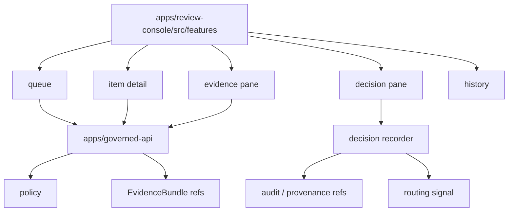

<!-- [KFM_META_BLOCK_V2]
doc_id: kfm://app/review-console/src/features/readme
title: Review Console Source Features README
type: app-readme
version: v0.1
status: draft
owners: OWNER_TBD — Review steward · UI steward · Policy steward · Evidence steward · Release steward · Audit steward · Docs steward
created: 2026-06-16
updated: 2026-06-16
policy_label: public
related:
  - ../../README.md
  - ../../../README.md
  - ../../../governed-api/README.md
  - ../../../explorer-web/src/features/review_console_readonly/README.md
  - ../../../../docs/architecture/ui/REVIEW_CONSOLE.md
  - ../../../../docs/governance/REVIEW_DUTIES.md
  - ../../../../policy/access/README.md
  - ../../../../policy/decision/README.md
  - ../../../../schemas/contracts/v1/review/
  - ../../../../schemas/contracts/v1/evidence/
  - ../../../../contracts/
  - ../../../../data/README.md
  - ../../../../release/README.md
  - ../../../../packages/ui/README.md
  - ../../../../packages/evidence-resolver/README.md
  - ../../../../packages/policy-runtime/README.md
tags: [kfm, apps, review-console, src, features, review-workflow, queue, item-detail, decision-pane, audit, provenance]
notes:
  - "Replaces an empty review-console source feature README with a bounded feature-tree contract."
  - "This path may hold app-local Review Console feature modules, but it must not become review doctrine, policy authority, schema authority, contract authority, lifecycle storage, release authority, proof storage, shared UI package root, or public review surface."
  - "Feature files, route wiring, decision recorder integration, schemas, tests, fixtures, policy enforcement, deployment state, logs, dashboards, and CI pass state remain NEEDS VERIFICATION."
[/KFM_META_BLOCK_V2] -->

<a id="top"></a>

<div align="center">

# Review Console Source Features

`apps/review-console/src/features/`

**App-local feature-source boundary for the role-gated Review Console: queue, item detail, evidence pane, spatial context, decision pane, history, sensitivity review, correction review, safe states, and audit/provenance views.**


[Purpose](#1-purpose) · [Repo fit](#2-repo-fit) · [Boundary](#3-authority-boundary) · [Inputs](#5-inputs) · [Exclusions](#6-exclusions) · [Feature map](#7-feature-family-map) · [Definition of done](#14-definition-of-done)

</div>

---

> [!IMPORTANT]
> **Status:** draft / `NEEDS VERIFICATION`  
> **Owners:** `OWNER_TBD` — Review steward · UI steward · Policy steward · Evidence steward · Release steward · Audit steward · Docs steward  
> **Path:** `apps/review-console/src/features/README.md`  
> **Responsibility root:** `apps/` — deployable application surfaces  
> **Truth posture:** CONFIRMED README path / CONFIRMED Review Console app boundary / CONFIRMED Review Console architecture doctrine / PROPOSED feature-source contract / UNKNOWN feature files, routes, decision recorder integration, schemas, tests, fixtures, runtime behavior, deployment state, and CI pass state

> [!CAUTION]
> Feature modules in this tree are for role-gated Review Console behavior only. They must not become public Explorer Web review features, direct lifecycle-store readers, release authorities, schema/contract/policy roots, or unreviewed decision writers.

---

## 1. Purpose

`apps/review-console/src/features/` is the proposed feature-source parent for Review Console UI and workflow modules.

It may eventually hold app-local feature modules for:

- review queue browsing and filtering;
- item-detail inspection;
- validator summary and evidence context;
- spatial context for review items;
- sensitivity, rights, source-role, and release-readiness review;
- decision capture and decision-recorder handoff;
- correction, rollback, and stale-state review context;
- item and reviewer history;
- safe denied, restricted, abstained, malformed, stale, and error states;
- audit/provenance reference views.

This README does not prove that any feature module, route, hook, view model, decision recorder integration, schema, fixture, test, deployment, log, dashboard, or CI pass state exists.

[Back to top](#top)

---

## 2. Repo fit

| Concern | Owning root | Expected relationship |
|---|---|---|
| Review Console feature source | `apps/review-console/src/features/` | App-local feature modules, if implemented |
| Review Console app | `apps/review-console/` | Role-gated deployable review/steward surface |
| Governed API | `apps/governed-api/` | Trust membrane and elevated audited API path |
| Explorer Web read-only review | `apps/explorer-web/src/features/review_console_readonly/` | Read-only public/semi-public visibility; no lifecycle mutation |
| Review architecture | `docs/architecture/ui/REVIEW_CONSOLE.md` | Proposed review-console concepts and surfaces |
| Policy gates | `policy/` | Access, sensitivity, rights, review, release, and decision policy |
| Evidence support | `packages/evidence-resolver/`, `data/proofs/` | EvidenceBundle support and proof context |
| Shared UI primitives | `packages/ui/` | Reusable UI pieces after extraction and review |
| Lifecycle artifacts | `data/` | Lifecycle state, receipts, proofs, registries, catalog, triplets, published outputs |
| Release authority | `release/` | Publication, correction, rollback, release manifest authority |
| Schemas/contracts | `schemas/contracts/v1/`, `contracts/` | Machine shape and object meaning |

## 3. Authority boundary

This folder may hold feature implementation source for the Review Console app. It does not own review doctrine, decision policy, reviewer authorization, EvidenceBundle truth, lifecycle storage, release decisions, schemas, contracts, shared UI primitives, public UI behavior, source ingestion, audit/provenance storage, or runtime/model behavior.

```text
apps/review-console/src/features/ = app-local Review Console feature source
apps/review-console/              = role-gated review deployable
apps/governed-api/                = trust membrane and elevated audited API path
apps/explorer-web/                = public/semi-public map-first UI consumer
policy/                           = admissibility and decision policy
schemas/contracts/v1/             = machine shape
contracts/                        = object meaning
data/                             = lifecycle artifacts, receipts, proofs, registries
release/                          = publication, correction, rollback authority
packages/ui/                      = shared UI primitives after extraction
```

## 4. Default posture

Review Console feature modules should fail closed. A feature should not display, enable, or submit review content when any of these are unresolved:

- reviewer identity, role, separation-of-duty, and clearance;
- item lifecycle state and queue eligibility;
- governed API envelope and response validation;
- source role, provenance, rights, license, and use terms;
- EvidenceRef and EvidenceBundle support;
- validator report and policy decision state;
- sensitivity, privacy, cultural, ecological, infrastructure, living-person, or DNA/data constraints;
- release, correction, rollback, stale-state, and review-lineage context;
- decision vocabulary, reason codes, and required reviewer rationale;
- audit/provenance write target and rollback path;
- safe error behavior and no raw/internal detail leakage.

## 5. Inputs

| Input family | Examples | Required posture |
|---|---|---|
| Queue state | item id, validator category, source summary, policy label, age, priority | Governed projection only |
| Item detail | normalized preview fields, validator summary, related refs | Redacted, role-gated projection |
| Evidence state | EvidenceRef list, EvidenceBundle refs, source refs, limitations | Resolver-backed and citation-aware |
| Policy state | reviewer role, clearance, sensitivity, rights, deny/restrict/hold reason | Policy runtime derived |
| Decision state | decision type, reason code, reviewer rationale, next owner | Finite, audited, policy-gated |
| Release/correction context | release manifest ref, correction notice ref, rollback target | Required when review touches publication state |
| Audit/provenance state | reviewer id, decision id, event id, timestamp, reason code | Durable and non-repudiable |
| UI state | loading, ready, denied, restricted, abstained, stale, malformed, error | Explicit finite states |

## 6. Exclusions

| Does not belong here | Correct home |
|---|---|
| Review Console app-level contract | `apps/review-console/README.md` |
| Public/semi-public read-only review visibility | `apps/explorer-web/src/features/review_console_readonly/` |
| Shared UI primitives | `packages/ui/` after extraction and review |
| Review policy rules and access decisions | `policy/` |
| Schemas and contracts | `schemas/contracts/v1/`, `contracts/` |
| Lifecycle data and canonical stores | `data/` |
| Release manifests, correction notices, rollback cards | `release/` |
| Source ingestion and fetchers | `connectors/`, `pipelines/`, `pipeline_specs/` |
| Pipeline transformations and watcher behavior | `pipelines/`, `apps/workers/` where appropriate |
| Published artifact mutation | Release/correction workflows, not feature-local edits |
| Free-form payload editing | Out of scope unless future ADR changes provenance model |
| Direct model/runtime calls | `runtime/` behind governed API only |
| Secrets or deployment-only values | Deployment environment/config channels |

## 7. Feature family map

Exact implementation files remain `NEEDS VERIFICATION`.

| Candidate feature family | Purpose | Required safeguard | Status |
|---|---|---|---|
| `queue` | Review queue list, filters, sorting, priority | Role-gated governed projection | PROPOSED |
| `item_detail` | Item context and validator summary | Redacted, lifecycle-aware display | PROPOSED |
| `evidence_pane` | EvidenceBundle/EvidenceRef context | No raw bundle copy unless authorized projection | PROPOSED |
| `spatial_pane` | Map context for items with geometry | No restricted geometry exposure | PROPOSED |
| `decision_pane` | Mutating decision capture and recorder handoff | Sole write affordance; policy and audit required | PROPOSED |
| `history` | Item/reviewer audit and provenance history | Read-only immutable projection | PROPOSED |
| `correction_review` | Correction and rollback context review | Release authority remains separate | PROPOSED |
| `sensitivity_review` | Rights/sensitivity review support | Fail closed for unresolved sensitive status | PROPOSED |
| `safe_states` | Denied/restricted/abstained/malformed/error states | No internal detail leakage | PROPOSED |
| `access_guard` | Role and separation-of-duty affordance guard | Enforced by tests | PROPOSED |

> [!WARNING]
> Candidate feature-family names are not implementation proof. Do not claim a feature is live until files, routes, tests, fixtures, schemas, policy gates, audit/provenance handoffs, and deployment evidence confirm it.

## 8. Diagram



## 9. Feature obligations

| Obligation | Example effect |
|---|---|
| `role_gated_access` | Feature state is unavailable until reviewer role and clearance are known |
| `read_only_by_default` | Queue/detail/evidence/history views cannot mutate lifecycle state |
| `single_decision_affordance` | Only the decision pane can hand off mutating decisions |
| `no_payload_editing` | Feature modules cannot edit original item payloads |
| `evidence_required` | Decision-support views carry EvidenceRef/EvidenceBundle references where material |
| `policy_required` | Sensitivity, rights, review, and release policy gates control display and action |
| `auditability_required` | Decision handoff preserves reviewer, timestamp, reason, and provenance refs |
| `release_separation` | Review decision is not publication approval by itself |
| `safe_error_only` | Errors reveal no protected data, internal paths, or raw validator internals |
| `public_slice_separated` | Explorer Web read-only review feature remains separate from this mutating app surface |

## 10. Per-feature contract

Each child feature README or module note should state:

- feature purpose and owner;
- read/write posture;
- accepted governed inputs;
- denied inputs and correct homes;
- policy/access dependency;
- EvidenceBundle and audit/provenance dependency;
- tests and fixtures required;
- rollback or safe-disable path;
- open verification items.

## 11. Inspection path

Feature files, routes, decision-recorder integration, schemas, tests, fixtures, policy integration, audit/provenance writes, deployment state, logs, dashboards, and emitted artifacts remain `NEEDS VERIFICATION`.

```bash
find apps/review-console/src/features -maxdepth 6 -type f | sort
find apps/review-console apps/governed-api apps/explorer-web docs/architecture/ui policy schemas contracts data release packages tests fixtures -maxdepth 6 -type f 2>/dev/null | grep -Ei 'review.?console|ReviewRecord|ReviewDecision|EvidenceRef|EvidenceBundle|PolicyDecision|ReleaseManifest|CorrectionNotice|RollbackCard|quarantine|promot|defer|reject|approve|audit|prov|rbac|sensitivity|queue|detail|decision|history|test|fixture' | sort
```

## 12. Validation expectations

Useful validation for this feature tree should cover:

- queue/detail/evidence/history access denied for unauthorized roles;
- read-only feature families cannot submit decisions or mutate lifecycle state;
- only decision-pane flow can hand off decision records;
- reviewer decisions do not edit original payloads;
- decision handoffs preserve reviewer identity, reason code, timestamps, EvidenceRef/EvidenceBundle refs, policy refs, audit/provenance refs, and routing signal refs;
- published artifacts cannot be edited directly from features;
- sensitive, rights-limited, living-person, DNA, cultural, ecology, infrastructure, or exact-location cases fail closed when clearance or transform support is missing;
- safe states reveal no raw payload, internal store path, protected detail, or validator internals.

## 13. Safe change pattern

For Review Console feature changes:

1. Add or update feature inventory and feature-family contract.
2. Link feature DTOs to schemas/contracts before changing request or decision shapes.
3. Add fixtures for authorized view, unauthorized denial, missing evidence, policy denial, stale item, invalid decision, approve, reject, defer, annotate, escalate, safe error, and audit handoff cases.
4. Add policy, no-payload-editing, read-only-guard, decision-pane, and separation-of-duty tests before exposing mutating decisions.
5. Preserve EvidenceRef/EvidenceBundle refs, PolicyDecision refs, release/correction/rollback refs, audit/provenance refs, reason codes, and limitations through every view or decision handoff.
6. Update this README, `apps/review-console/README.md`, governed API docs, Explorer Web read-only review docs, policy docs, schemas/contracts, and tests when behavior materially changes.

## 14. Definition of done

- [ ] Owners are confirmed and `OWNER_TBD` is replaced.
- [ ] Feature inventory and ownership are documented.
- [ ] Queue/detail/decision DTOs and schemas are verified.
- [ ] Authorization, policy runtime, evidence resolver, release lookup, decision recorder, audit/provenance writer, and rollback hooks are documented and tested.
- [ ] Read-only feature families cannot mutate state.
- [ ] Decision-pane handoff is finite, auditable, and policy-gated.
- [ ] No-payload-editing tests are present and passing.
- [ ] Sensitive-domain and role-denial tests are present and passing.
- [ ] Safe-state tests are present and passing.
- [ ] Deployment, logs, dashboards, and runbooks are documented with current evidence.

## 15. Open verification items

| Item | Why it matters |
|---|---|
| Confirm feature files beyond README | Prevents overclaiming implementation maturity |
| Confirm parent `apps/review-console/src/README.md` should be created | Required for complete source-tree contract |
| Confirm route/API integration | Required before queue/detail/decision behavior claims |
| Confirm decision recorder location | Required before mutating review claims |
| Confirm schemas and DTOs | Required before contract claims |
| Confirm authorization and separation-of-duty logic | Required before role-gated claims |
| Confirm EvidenceBundle and policy integration | Required before review support claims |
| Confirm audit/provenance writes | Required before durable decision claims |
| Confirm release/correction/rollback integration | Required before promotion/correction claims |
| Confirm tests and fixtures | Required before runtime maturity claims |

<details>
<summary>Appendix A — no-loss preservation note</summary>

The previous README was empty. This replacement adds a bounded Review Console feature-source contract without claiming feature files, routes, decision recorder integration, schemas, tests, fixtures, policy enforcement, deployment, logs, dashboards, or CI pass state are implemented.

</details>

## Status summary

`apps/review-console/src/features/` should contain Review Console feature modules only after feature inventory, route integration, queue/detail/decision schemas, authorization, policy runtime integration, evidence resolver integration, decision recorder handoff, audit/provenance writes, release/correction/rollback support, tests, and operational evidence are verified.

It must preserve the Review Console boundary: feature modules may support role-gated human review, but they must not become public review surfaces, lifecycle stores, schema/contract/policy roots, release authority, proof stores, free-form payload editors, or unreviewed shortcuts around governed API and audit controls.

<p align="right"><a href="#top">Back to top</a></p>
