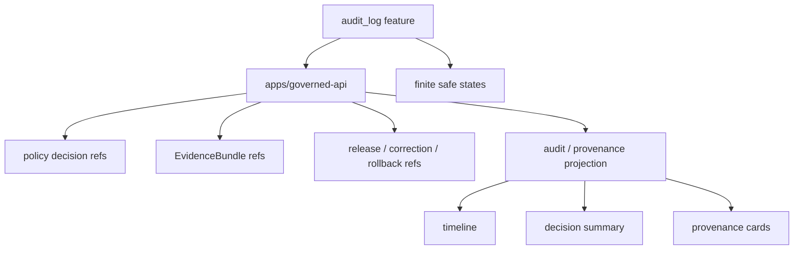

<!-- [KFM_META_BLOCK_V2]
doc_id: kfm://app/review-console/src/features/audit-log/readme
title: Review Console Audit Log Feature README
type: app-readme
version: v0.1
status: draft
owners: OWNER_TBD — Review steward · Audit steward · Policy steward · Evidence steward · Release steward · UI steward · Docs steward
created: 2026-06-16
updated: 2026-06-16
policy_label: public
related:
  - ../README.md
  - ../../../README.md
  - ../../../../governed-api/README.md
  - ../../../../explorer-web/src/features/review_console_readonly/README.md
  - ../../../../../docs/architecture/ui/REVIEW_CONSOLE.md
  - ../../../../../docs/governance/REVIEW_DUTIES.md
  - ../../../../../policy/access/README.md
  - ../../../../../policy/decision/README.md
  - ../../../../../schemas/contracts/v1/review/
  - ../../../../../schemas/contracts/v1/evidence/
  - ../../../../../contracts/
  - ../../../../../data/README.md
  - ../../../../../release/README.md
  - ../../../../../packages/evidence-resolver/README.md
  - ../../../../../packages/policy-runtime/README.md
tags: [kfm, apps, review-console, feature, audit-log, provenance, review-history, evidencebundle, policydecision, finite-states]
notes:
  - "Replaces the greenfield audit_log feature stub with a bounded feature contract."
  - "This feature may render audit/provenance history for Review Console items, but it must not write audit records, rewrite provenance, mutate lifecycle state, or become the system audit store."
  - "Feature files, route wiring, schemas, tests, fixtures, governed API envelopes, audit/provenance handoffs, deployment state, logs, dashboards, and CI pass state remain NEEDS VERIFICATION."
[/KFM_META_BLOCK_V2] -->

<a id="top"></a>

<div align="center">

# Review Console Audit Log Feature

`apps/review-console/src/features/audit_log/`

**App-local Review Console feature boundary for audit and provenance visibility: reviewer decision history, routing signals, policy decision references, EvidenceRef/EvidenceBundle links, correction/rollback context, safe immutable timelines, and finite unavailable/denied/error states.**


[Purpose](#1-purpose) · [Repo fit](#2-repo-fit) · [Boundary](#3-authority-boundary) · [Inputs](#5-inputs) · [Exclusions](#6-exclusions) · [Feature map](#7-audit-log-feature-map) · [Definition of done](#14-definition-of-done)

</div>

---

> [!IMPORTANT]
> **Status:** draft / `NEEDS VERIFICATION`  
> **Owners:** `OWNER_TBD` — Review steward · Audit steward · Policy steward · Evidence steward · Release steward · UI steward · Docs steward  
> **Path:** `apps/review-console/src/features/audit_log/README.md`  
> **Responsibility root:** `apps/` — deployable application surfaces  
> **Truth posture:** CONFIRMED README path / CONFIRMED Review Console feature-source boundary / CONFIRMED Review Console audit/provenance doctrine / PROPOSED audit-log feature contract / UNKNOWN feature files, route wiring, schemas, tests, fixtures, runtime behavior, deployment state, and CI pass state

> [!CAUTION]
> This feature is for audit/provenance display and decision-history inspection. It must not create, rewrite, delete, redact, or normalize audit records locally; those writes belong to governed decision/audit/provenance authority paths with policy and evidence controls.

---

## 1. Purpose

`apps/review-console/src/features/audit_log/` is the proposed app-local feature home for Review Console audit-log and provenance-history views.

It may eventually contain modules for:

- item-level review history timelines;
- reviewer decision summaries;
- routing-signal history;
- policy decision and role-gate history display;
- EvidenceRef and EvidenceBundle reference linking;
- correction, supersession, rollback, and stale-state context;
- provenance activity summaries;
- immutable decision metadata cards;
- safe denied, restricted, unavailable, malformed, stale, and error states;
- export or copy affordances for approved audit references only.

This README does not prove that any audit-log feature file, route, adapter, schema, fixture, test, governed API envelope, provenance handoff, deployment, log, dashboard, or CI pass state exists.

[Back to top](#top)

---

## 2. Repo fit

| Concern | Owning root | Expected relationship |
|---|---|---|
| Audit Log feature source | `apps/review-console/src/features/audit_log/` | App-local audit/provenance display feature, if implemented |
| Review Console feature tree | `apps/review-console/src/features/` | Parent feature-source boundary |
| Review Console app | `apps/review-console/` | Role-gated review/steward deployable |
| Governed API | `apps/governed-api/` | Trust membrane and elevated audited API path |
| Explorer Web read-only review | `apps/explorer-web/src/features/review_console_readonly/` | Separate read-only public/semi-public review visibility |
| Review architecture | `docs/architecture/ui/REVIEW_CONSOLE.md` | Review surfaces, decision pane, and provenance concepts |
| Policy gates | `policy/` | Access, sensitivity, rights, review, release, and decision policy |
| Evidence support | `packages/evidence-resolver/`, `data/proofs/` | EvidenceBundle support and proof context |
| Lifecycle artifacts | `data/` | Receipts, proofs, registry, catalog, triplets, published outputs |
| Release authority | `release/` | Publication, correction, rollback, release manifest authority |
| Schemas/contracts | `schemas/contracts/v1/`, `contracts/` | Machine shape and object meaning |

## 3. Authority boundary

This feature may render governed audit and provenance projections. It does not own audit-log storage, PROV writes, decision recording, lifecycle state, EvidenceBundle truth, policy decisions, release decisions, schemas, contracts, reviewer identity, source ingestion, public UI behavior, or runtime/model behavior.

```text
apps/review-console/src/features/audit_log/ = app-local audit-log display feature
apps/review-console/src/features/           = feature source boundary
apps/review-console/                        = role-gated review deployable
apps/governed-api/                          = trust membrane and elevated audited API path
policy/                                     = access and decision policy
data/                                       = lifecycle artifacts, receipts, proofs, registries
release/                                    = publication, correction, rollback authority
schemas/contracts/v1/                       = machine shape
contracts/                                  = object meaning
```

## 4. Default posture

Audit Log feature modules should fail closed. The feature should not render claim-bearing or decision-bearing audit history when any of these are unresolved:

- reviewer identity, role, clearance, and item access;
- governed API envelope and response validation;
- audit event schema and decision-history schema;
- item lifecycle state and review lineage;
- EvidenceRef and EvidenceBundle reference support;
- policy decision and sensitivity posture;
- release, correction, rollback, stale-state, or supersession context where material;
- provenance source and timestamp integrity;
- redaction/generalization state for displayed fields;
- safe error behavior and no raw/internal detail leakage.

## 5. Inputs

| Input family | Examples | Required posture |
|---|---|---|
| Audit event summary | event id, actor ref, action family, timestamp, decision id | Governed projection only |
| Review decision summary | approve, reject, defer, annotate, escalate, route | Finite vocabulary and reason code |
| Evidence refs | EvidenceRef list, EvidenceBundle refs, citation/support links | Resolver-backed references |
| Policy refs | PolicyDecision ref, sensitivity label, role check, restriction reason | Policy-runtime derived |
| Release refs | ReleaseManifest, CorrectionNotice, RollbackCard, stale-state refs | Required when material |
| Provenance refs | activity id, entity id, agent id, derivation summary | Immutable projection |
| UI state | loading, ready, denied, restricted, empty, stale, malformed, error | Explicit finite states |

## 6. Exclusions

| Does not belong here | Correct home |
|---|---|
| Audit/provenance writes | Governed decision/audit/provenance authority path |
| Review decision recording | Review Console decision pane / governed decision recorder |
| Review Console app-level contract | `apps/review-console/README.md` |
| Shared audit UI primitives | `packages/ui/` after extraction and review |
| Policy rules and access decisions | `policy/` |
| Schemas and contracts | `schemas/contracts/v1/`, `contracts/` |
| Lifecycle data and canonical stores | `data/` |
| Release manifests, correction notices, rollback cards | `release/` |
| Source ingestion and fetchers | `connectors/`, `pipelines/`, `pipeline_specs/` |
| Public read-only review visibility | `apps/explorer-web/src/features/review_console_readonly/` |
| Free-form audit editing or local redaction rewrites | Out of scope |
| Direct model/runtime calls | `runtime/` behind governed API only |
| Deployment-only values | Deployment environment/config channels |

## 7. Audit Log feature map

Exact implementation files remain `NEEDS VERIFICATION`.

| Candidate feature module | Purpose | Required safeguard | Status |
|---|---|---|---|
| `timeline` | Chronological event view | Immutable governed projection | PROPOSED |
| `decision_summary` | Decision family, reason code, reviewer ref | Role-gated and evidence-aware | PROPOSED |
| `policy_events` | Policy decision and access-state timeline | No hidden clearance leak | PROPOSED |
| `evidence_links` | EvidenceRef/EvidenceBundle support links | No raw bundle copy | PROPOSED |
| `release_context` | Release/correction/rollback/stale context | Release authority remains separate | PROPOSED |
| `provenance_cards` | PROV-style activity/entity/agent summaries | Reference-only display | PROPOSED |
| `filters` | Event family, actor, status, date, policy label filters | No unsupported filtering claim | PROPOSED |
| `safe_states` | Denied/restricted/empty/stale/malformed/error states | No internal detail leakage | PROPOSED |
| `copy_refs` | Copy allowed event/ref ids | Copy refs only, never raw payloads | PROPOSED |

> [!WARNING]
> Candidate module names are not implementation proof. Do not claim an audit-log module is live until files, routes, schemas, fixtures, tests, policy gates, and provenance handoffs confirm it.

## 8. Diagram



## 9. Feature obligations

| Obligation | Example effect |
|---|---|
| `read_only_audit_display` | Feature displays governed audit projections only |
| `no_local_audit_writes` | Audit/provenance writes happen outside this feature |
| `role_gated_access` | Reviewer role and clearance gate every audit view |
| `immutability_visible` | Events render as immutable history, not editable rows |
| `evidence_refs_required` | Decision-supporting events link to EvidenceRef/EvidenceBundle refs where material |
| `policy_refs_required` | Policy decision refs and labels are shown where material |
| `release_context_required` | Release/correction/rollback context appears where relevant |
| `safe_error_only` | Errors reveal no protected data, raw payloads, internal paths, or raw validator internals |
| `public_slice_separated` | Explorer Web read-only feature remains separate from Review Console app features |

## 10. Per-module contract

Each audit-log child module should state:

- purpose and owner;
- accepted governed input shape;
- denied inputs and correct homes;
- policy/access dependency;
- EvidenceBundle and audit/provenance dependency;
- read-only posture;
- tests and fixtures required;
- safe-disable or rollback path;
- open verification items.

## 11. Inspection path

Feature files, route wiring, schemas, tests, fixtures, policy integration, audit/provenance handoffs, deployment state, logs, dashboards, and emitted artifacts remain `NEEDS VERIFICATION`.

```bash
find apps/review-console/src/features/audit_log -maxdepth 6 -type f | sort
find apps/review-console apps/governed-api docs/architecture/ui policy schemas contracts data release packages tests fixtures -maxdepth 6 -type f 2>/dev/null | grep -Ei 'audit|provenance|prov|ReviewDecision|ReviewRecord|EvidenceRef|EvidenceBundle|PolicyDecision|ReleaseManifest|CorrectionNotice|RollbackCard|timeline|history|decision|review|test|fixture' | sort
```

## 12. Validation expectations

Useful validation for this feature should cover:

- unauthorized users cannot view audit history;
- read-only audit views cannot submit decisions or mutate lifecycle state;
- audit events render immutable event ids, actor refs, decision refs, timestamps, reason codes, and provenance refs where available;
- missing evidence or provenance support renders `ABSTAIN`, unavailable, stale, or restricted states rather than a claim;
- release/correction/rollback context appears where relevant and does not become release approval;
- copied refs are bounded ids, not raw payloads;
- safe states reveal no protected data, internal store path, or raw validator internals.

## 13. Safe change pattern

For Audit Log feature changes:

1. Add or update audit-log feature inventory and module contract.
2. Link audit event and review-history DTOs to schemas/contracts before changing shapes.
3. Add fixtures for authorized view, unauthorized denial, missing event, missing evidence, stale lineage, restricted event, malformed event, release context, correction context, rollback context, and safe error cases.
4. Add read-only, no-local-write, role-gate, and safe-state tests before exposing event history.
5. Preserve EvidenceRef/EvidenceBundle refs, PolicyDecision refs, release/correction/rollback refs, audit/provenance refs, reason codes, timestamps, and limitations through every view.
6. Update this README, parent feature README, Review Console app README, governed API docs, policy docs, schemas/contracts, and tests when behavior materially changes.

## 14. Definition of done

- [ ] Owners are confirmed and `OWNER_TBD` is replaced.
- [ ] Audit-log module inventory and ownership are documented.
- [ ] Audit/review-history DTOs and schemas are verified.
- [ ] Authorization, policy runtime, evidence resolver, release lookup, audit/provenance source, and safe-state behavior are documented and tested.
- [ ] Read-only audit views cannot mutate state.
- [ ] Missing-evidence and missing-provenance states are tested.
- [ ] Sensitive-domain and role-denial tests are present and passing.
- [ ] Safe-state tests are present and passing.
- [ ] Deployment, logs, dashboards, and runbooks are documented with current evidence.

## 15. Open verification items

| Item | Why it matters |
|---|---|
| Confirm feature files beyond README | Prevents overclaiming implementation maturity |
| Confirm audit event DTOs and schemas | Required before event-shape claims |
| Confirm route/API integration | Required before runtime behavior claims |
| Confirm authorization and separation-of-duty logic | Required before role-gated claims |
| Confirm EvidenceBundle and policy integration | Required before audit support claims |
| Confirm audit/provenance source and write boundary | Required before immutable-history claims |
| Confirm release/correction/rollback integration | Required before publication-lineage claims |
| Confirm tests and fixtures | Required before runtime maturity claims |
| Confirm deployment, logs, dashboards, and runbooks | Required before operational claims |

<details>
<summary>Appendix A — no-loss preservation note</summary>

The previous README was a greenfield stub. This replacement adds a bounded audit-log feature contract without claiming feature files, routes, schemas, tests, fixtures, policy enforcement, audit/provenance integration, deployment, logs, dashboards, or CI pass state are implemented.

</details>

## Status summary

`apps/review-console/src/features/audit_log/` should contain Review Console audit-log display modules only after feature inventory, route integration, audit/review-history schemas, authorization, policy runtime integration, evidence resolver integration, release/correction/rollback context, audit/provenance source boundary, tests, and operational evidence are verified.

It must preserve the audit boundary: this feature may display governed immutable audit/provenance projections, but it must not write audit records, edit decisions, mutate lifecycle state, replace EvidenceBundle truth, become release authority, expose raw protected material, or substitute for current passing evidence.

<p align="right"><a href="#top">Back to top</a></p>
