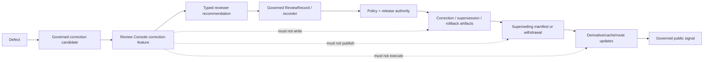

<!-- [KFM_META_BLOCK_V2]
doc_id: kfm://app/review-console/src/features/correction/readme
title: Review Console Correction — Governed Review-Support and Release-Handoff Boundary
type: app-readme; directory-readme; feature-boundary; correction-review-support
version: v0.2
status: draft; repository-grounded; readme-only-direct-lane; thin-schema; placement-drift; executable-feature-not-established
owners: OWNER_TBD — Review steward · Correction reviewer · Release steward · Governance steward · Security steward · Policy steward · Evidence steward · API steward · UI steward · Validation steward · Docs steward
created: 2026-06-16
updated: 2026-07-19
policy_label: "public-governance; restricted-review; correction-review-support; role-gated; evidence-aware; release-subordinate; append-only; no-local-release-writes; no-publication-authority; no-truth-authority"
current_path: apps/review-console/src/features/correction/README.md
owning_root: apps/
responsibility: document the app-local correction-review feature boundary for inspecting correction candidates, evidence, release lineage, rollback targets, supersession, derivative impact, and safe decision handoff without creating or mutating CorrectionNotice, SupersessionNotice, RollbackCard, ReleaseManifest, published artifacts, lifecycle state, policy decisions, evidence, or canonical audit history
truth_posture: CONFIRMED target README and prior v0.1 feature contract, Review Console parent boundaries, private version 0.0.0 package manifest with no scripts or dependencies, bounded direct-lane search surfacing only this README, CorrectionNotice and SupersessionNotice semantic contracts, id-only permissive correction schemas, RollbackCard contract and id-only permissive schema, release-root correction responsibilities and singular/plural lane drift, proposed dashboard and publication architecture, current ReviewRecord and PolicyDecision vocabulary boundaries, and absent checked correction validator/policy README paths / PROPOSED governed correction read model, explicit state axes, deterministic identity and time semantics, evidence-policy-review-release closure, derivative coverage, emergency visibility, field minimization, staged handoff, negative fixtures, validation, safe-disable behavior, and implementation sequence / CONFLICTED contracts/correction versus contracts/release placement, architecture review-family schema path versus current correction-family schema path, rich semantics versus thin schemas, correction action vocabulary versus ReviewRecord and PolicyDecision vocabularies, and release/correction versus release/corrections versus release/correction_notices / UNKNOWN recursive feature inventory, canonical correction persistence and write path, governed API route/DTO, consumers, active correction policy, branch protection, deployment, telemetry, retention enforcement, correction lead-time calculation, derivative graph completeness, and full-suite pass state / NEEDS VERIFICATION owners, placement ADR, hardened schemas, fixtures, validators, policy, review separation, API, feature source, tests, receipts/proofs, release handoff, public notice behavior, accessibility, observability, retention, correction-of-corrections, and rollback automation
evidence_snapshot:
  repository: bartytime4life/Kansas-Frontier-Matrix
  visibility: public
  base_ref: main
  base_commit: 73aae8bff1e5f8e1d41889283bba85fcb70429f4
  prior_blob: 8a0d41ff9ac97b99a0750586dd06778e7515fca3
  inventory_method: GitHub connector exact reads plus bounded code, branch, and open-PR searches
  bounded_direct_lane_result: correction lane search surfaced this README only; recursive enumeration remains NEEDS VERIFICATION
related:
  - ../README.md
  - ../../README.md
  - ../../../README.md
  - ../audit_log/README.md
  - ../rollback/README.md
  - ../promotion/README.md
  - ../../../../governed-api/README.md
  - ../../../../../docs/architecture/ui/REVIEW_CONSOLE.md
  - ../../../../../docs/architecture/publication/CORRECTION.md
  - ../../../../../docs/dashboards/governance/RELEASE_CORRECTION_ROLLBACK.md
  - ../../../../../docs/governance/REVIEW_DUTIES.md
  - ../../../../../docs/doctrine/directory-rules.md
  - ../../../../../contracts/correction/README.md
  - ../../../../../contracts/correction/correction_notice.md
  - ../../../../../contracts/correction/supersession_notice.md
  - ../../../../../contracts/release/rollback_card.md
  - ../../../../../contracts/governance/ReviewRecord.md
  - ../../../../../contracts/policy/policy_decision.md
  - ../../../../../schemas/contracts/v1/correction/correction_notice.schema.json
  - ../../../../../schemas/contracts/v1/correction/supersession_notice.schema.json
  - ../../../../../schemas/contracts/v1/release/rollback_card.schema.json
  - ../../../../../schemas/contracts/v1/governance/review_record.schema.json
  - ../../../../../policy/decision/README.md
  - ../../../../../release/README.md
tags: [kfm, apps, review-console, correction, correction-notice, supersession, rollback, release-lineage, derivative-invalidation, review, evidence, policy, audit, fail-closed]
notes:
  - "v0.2 narrows the lane to governed correction-review support and explicit release handoff."
  - "No feature source, route, API DTO, recorder, policy evaluator, release writer, dashboard, deployment, or runtime behavior is established."
  - "CorrectionNotice, SupersessionNotice, and RollbackCard schemas are thin permissive placeholders and cannot establish governance readiness."
  - "This update changes documentation and its generated-work receipt only."
[/KFM_META_BLOCK_V2] -->

<a id="top"></a>

# Review Console Correction

`apps/review-console/src/features/correction/`

> Role-gated, app-local review support for inspecting correction candidates and handing a bounded reviewer recommendation to governed correction and release machinery. This feature does **not** issue corrections, rewrite releases, move aliases, invalidate derivatives, publish notices, execute rollback, or change lifecycle state.


**Quick links:** [Purpose](#purpose) · [Evidence](#status-and-evidence) · [Authority](#authority-and-directory-rules-basis) · [Workflow](#correction-workflow-and-feature-position) · [Shapes](#current-machine-shape-boundaries) · [Drift](#contract-schema-placement-and-vocabulary-drift) · [Read model](#governed-correction-read-model) · [Closure](#evidence-policy-review-and-release-closure) · [Lineage](#supersession-and-derivative-invalidation) · [Security](#access-sensitivity-and-field-minimization) · [States](#decision-release-and-ui-state-axes) · [Threats](#threat-model-and-negative-paths) · [Validation](#validation-test-and-fixture-matrix) · [Implementation](#smallest-sound-implementation-sequence) · [Done](#definition-of-done) · [Open](#open-verification-register) · [Rollback](#rollback-correction-and-document-supersession)

> [!IMPORTANT]
> **Observed maturity:** the bounded feature-lane search surfaced this README only. The Review Console package is private, version `0.0.0`, and defines no scripts or dependencies. No correction component, route, hook, API client, decision recorder, policy evaluator, release writer, feature-local fixture, dedicated test, or deployed surface was established.

> [!CAUTION]
> A reviewer recommendation is not a `CorrectionNotice`, `SupersessionNotice`, `RollbackCard`, `ReleaseManifest`, `PolicyDecision`, `ReviewRecord`, proof of correction, or publication approval. Missing evidence, policy, reviewer authority, affected-release identity, rollback target, lineage, derivative impact, or release handoff must fail closed.

---

<a id="purpose"></a>

## Purpose

The feature is intended to help authorized reviewers inspect a trust-significant repair after a defect, dispute, source update, rights change, sensitivity change, stale-evidence finding, policy failure, validation defect, rendering defect, or other post-release concern.

A mature feature may help answer:

1. What released claim, artifact, layer, catalog record, answer, or public surface is affected?
2. What defect class and severity are asserted?
3. Which evidence supports the defect and proposed repair?
4. Is the current public posture safe, stale, restricted, withdrawn, superseded, or under review?
5. Does a safe rollback target exist?
6. Which successor release or corrected artifact is proposed?
7. Which derivatives, caches, indexes, tiles, graph projections, API payloads, or AI answers may be affected?
8. Which policy, rights, consent, sensitivity, review, and separation-of-duty gates apply?
9. Which correction, supersession, rollback, review, policy, receipt, proof, and release artifacts are present or missing?
10. What bounded recommendation may the reviewer make without becoming release authority?

The feature may render governed summaries, resolve authorized references, expose closure gaps, show derivative coverage, show emergency-disablement posture, and hand a typed recommendation to an accepted recorder.

It must not create canonical correction artifacts in the browser, edit published bytes, repoint aliases, alter `PUBLISHED`, execute rollback, claim invalidation occurred, infer reviewer authority from UI access, or publish correction prose.

[Back to top](#top)

---

<a id="status-and-evidence"></a>

## Status and evidence

| Surface | Status | Safe conclusion |
|---|---:|---|
| Target README | **CONFIRMED** | Existing substantive v0.1 updated in place. |
| Other direct-lane files | **NOT SURFACED IN BOUNDED SEARCH** | Bounded absence is not recursive proof. |
| Review Console package | **CONFIRMED PLACEHOLDER** | Private, `0.0.0`, no scripts/dependencies. |
| Parent Review Console READMEs | **CONFIRMED DOCUMENTATION** | Describe proposed review behavior, not implementation. |
| Correction dashboard | **CONFIRMED SPEC / NON-ENFORCING** | Reports five governance indicators; green is not approval. |
| Publication correction architecture | **CONFIRMED FILE / MIXED STATUS** | Silent mutation is forbidden; implementation paths include drift. |
| CorrectionNotice contract | **CONFIRMED DRAFT SEMANTICS** | Rich meaning under `contracts/correction/`. |
| CorrectionNotice schema | **CONFIRMED PROPOSED THIN PLACEHOLDER** | Requires only `id`; permits arbitrary additional properties. |
| SupersessionNotice contract/schema | **CONFIRMED DRAFT / THIN** | Rich old/new lineage semantics are not machine-enforced. |
| RollbackCard contract/schema | **CONFIRMED DRAFT / THIN** | Rich target/invalidation semantics are not machine-enforced. |
| ReviewRecord | **CONFIRMED FAMILY WITH DRIFT** | Current schema vocabulary is narrower than adjacent UI concepts. |
| PolicyDecision | **CONFIRMED FOUR-OUTCOME SURFACE** | `ANSWER | ABSTAIN | DENY | ERROR`; not correction actions. |
| Release root | **CONFIRMED** | Owns release decisions, corrections, notices, supersession, withdrawal, reversibility. |
| Release correction lanes | **CONFIRMED NAMING DRIFT** | Singular, plural, and notice lanes coexist. |
| Correction validator | **CHECKED ABSENT** | Declared exact path not found. |
| Correction policy README | **CHECKED ABSENT** | Exact `policy/correction/README.md` not found; policy remains unproved. |
| Governed API correction route/DTO | **UNKNOWN** | No accepted route, DTO, or consumer established. |
| Feature-specific tests/workflow | **NOT SURFACED** | No executable feature proof established. |

This README must not claim a live UI, active policy, running validator, emitted notice, alias movement, derivative invalidation, verified rollback, published public notice, production deployment, or repository-wide passing CI.

[Back to top](#top)

---

<a id="authority-and-directory-rules-basis"></a>

## Authority and Directory Rules basis

`apps/review-console/src/features/correction/` is an app-local presentation and handoff lane under `apps/`.

| Concern | Owner | Feature posture |
|---|---|---|
| Correction meaning | `contracts/correction/` or accepted contract home | Consume; do not redefine. |
| Machine shape | `schemas/contracts/v1/correction/` | Validate; do not author locally. |
| Review records | governance contracts/schemas | Reference; do not collapse into feature state. |
| Policy | `policy/` | Consume decisions; never infer/create policy. |
| Evidence | evidence contracts/resolvers, `data/proofs/` | Resolve authorized refs; never create closure. |
| Release and correction decisions | `release/` and release contracts | Display/hand off; never approve or mutate. |
| Rollback | release/rollback authority | Display/review only. |
| Published artifacts | `data/published/` after release | Never mutate directly. |
| Lifecycle state | `data/` plus governed transitions | Never move or rewrite. |
| Audit history | accepted audit/provenance store | Reference only. |
| Public correction display | governed API and released artifacts | Review Console is not the public route. |

The update creates no new root, path move, parallel contract/schema/policy/release/proof/receipt/audit home, or public interface.

[Back to top](#top)

---

<a id="correction-workflow-and-feature-position"></a>

## Correction workflow and feature position

```text
detect defect or changed condition
  -> identify affected release / claim / artifact
  -> classify defect and immediate safety posture
  -> resolve evidence and source lineage
  -> apply policy, rights, sensitivity, and consent gates
  -> obtain review with required separation of duties
  -> prepare CorrectionNotice / SupersessionNotice / RollbackCard
  -> issue superseding ReleaseManifest or withdrawal/rollback
  -> update aliases through release machinery
  -> invalidate or mark affected derivatives
  -> publish public-safe correction signal
  -> retain prior state and audit history
```

The feature sits at inspection/review support:



The feature may show identity, defect context, evidence, policy, review, release, rollback, supersession, derivative scope, and missing closure. It must not generate canonical release artifacts, issue status, move aliases, write invalidation lists, mark rehearsal complete, sign releases, or turn submission success into correction completion.

[Back to top](#top)

---

<a id="current-machine-shape-boundaries"></a>

## Current machine-shape boundaries

### CorrectionNotice

Current schema fields:

| Field | Required | Shape |
|---|---:|---|
| `id` | yes | string |
| `spec_hash` | no | string |
| `version` | no | string |

The schema permits additional properties and labels itself `PROPOSED`. It declares a contract, fixture root, validator, and policy home; the checked validator and policy README are absent.

> [!WARNING]
> An object containing only `{"id":"..."}` may be schema-valid while lacking affected release, defect class, evidence, reviewer, public summary, rollback target, supersession, derivative impact, release manifest, and policy context.

### SupersessionNotice

The current paired schema is also `id`-only and permissive. The feature must render missing prior/successor linkage as incomplete or unknown, never as complete supersession.

### RollbackCard

The current paired schema requires only `id`, optionally accepts `spec_hash` and `version`, and permits additional properties. It does not enforce affected release, rollback target, target digest, reason, evidence, review, correction link, invalidation/restoration plan, rehearsal, or execution.

### ReviewRecord and PolicyDecision

Current ReviewRecord schema uses:

```text
decision = approve | reject | request_changes
reviewer_role = steward | reviewer | auditor
```

Canonical PolicyDecision outcomes remain:

```text
ANSWER | ABSTAIN | DENY | ERROR
```

Richer correction actions require an accepted normalization, companion envelope, or versioned migration.

[Back to top](#top)

---

<a id="contract-schema-placement-and-vocabulary-drift"></a>

## Contract, schema, placement, and vocabulary drift

| Drift | Risk | Required response |
|---|---|---|
| Rich CorrectionNotice semantics vs `id`-only schema | Schema-valid objects may appear ready. | Separate shape validity from governance readiness. |
| Rich SupersessionNotice semantics vs thin schema | Missing forward links may appear complete. | Require closure or hardened schema. |
| Rich RollbackCard semantics vs thin schema | A rollback id may be mistaken for a plan. | Never infer readiness from schema validity. |
| `contracts/correction/` vs `contracts/release/` | Parallel semantic authority. | Resolve by ADR/migration; do not duplicate definitions. |
| Architecture uses review-family correction schema path | Broken links/split authority. | Reconcile docs to verified correction schema home. |
| `release/correction/`, `release/corrections/`, `release/correction_notices/` | Wrong read/write lane. | Pin accepted routes before implementation. |
| Feature actions vs ReviewRecord enum | Silent semantic loss. | Define versioned mapping and preserve original action/reason. |
| Correction states vs PolicyDecision outcomes | State-axis collapse. | Keep policy, review, correction, release, UI axes separate. |
| Dashboard indicator vs enforcement | Green panel may be read as approval. | Label reporting non-authoritative and link records. |

Never silently map `route_correction -> approve`, `defer -> request_changes`, `request_evidence -> request_changes`, `withdraw -> deny`, `stale -> abstain`, `dashboard_green -> approved`, or `schema_valid -> correction_ready`.

[Back to top](#top)

---

<a id="governed-correction-read-model"></a>

## Governed correction read model

A future feature should consume a separately governed read model or versioned envelope, not invent browser-local authority fields.

| Family | Examples | Requirement |
|---|---|---|
| Envelope identity | id, schema version, generated time, source service | Traceable and non-authoritative. |
| Candidate identity | candidate id, subject ref, affected release | Must resolve. |
| Defect context | class, severity, detected time, detector role/ref | Safe and authorized. |
| Immediate posture | review pending, public hold requested, disablement required | Status/recommendation only. |
| Affected objects | claims, assets, layers, APIs, catalogs, AI receipts | Paginated with completeness metadata. |
| Evidence closure | EvidenceRefs/Bundles, validation refs, unresolved handles | Resolver-backed. |
| Policy closure | PolicyDecision, rights/sensitivity/consent, obligations | Fail closed if unresolved. |
| Review closure | ReviewRecord, assignment, independence | Identity minimized; role explicit. |
| Release closure | current manifest, successor candidate, release/alias state | No local mutation. |
| Correction artifacts | correction/supersession/withdrawal refs | Distinguish draft, candidate, accepted, released. |
| Rollback closure | card ref, target release, digest, rehearsal | Unknown remains unknown. |
| Lineage | predecessor, successor, supersedes, superseded_by | Forward/backward links. |
| Derivative impact | affected, unaffected, unknown, partial | Coverage source required. |
| Public signal | corrected, superseded, withdrawn, stale, redacted, pending | Public-safe and source-labeled. |
| Audit | handoff id, refs, timestamps, receipts | Canonical audit external. |
| Authorization | audience, suppression, copy/export permissions | Server-enforced. |

Blank fields must distinguish withheld, generalized, unresolved, unknown, not applicable, malformed, and unavailable.

The client may construct only a minimal typed handoff request to the accepted recorder/API; it must not construct canonical correction/release artifacts.

[Back to top](#top)

---

<a id="evidence-policy-review-and-release-closure"></a>

## Evidence, policy, review, and release closure

| Closure | Required support | Missing behavior |
|---|---|---|
| Subject identity | affected claim/release/artifact refs | Malformed/unavailable; no recommendation. |
| Defect support | EvidenceBundle, source update, validation/incident record | ABSTAIN/hold; no invented certainty. |
| Source authority | SourceDescriptor/role/revision lineage | Mark unresolved. |
| Rights/consent | license, consent, sovereignty, reuse | Deny/hold public path. |
| Sensitivity | label and redaction/generalization obligations | Restrict fields; emergency posture if leak. |
| Policy | fresh PolicyDecision and obligations | Disable action. |
| Review | ReviewRecord/assignment/independence | Pending/blocked; no self-approval. |
| Release | current manifest and affected release | No release-facing recommendation. |
| Rollback | card/target/digest/rehearsal | Show missing/unknown. |
| Supersession | old/new refs/effective transition | Show lineage gap. |
| Derivative impact | lineage graph or enumerated set | Partial/unknown, never complete. |
| Audit | handoff/audit refs | Show unknown persistence, not success. |

EvidenceRefs must resolve through authorized services. Source prose, model output, dashboard text, and UI inference cannot replace evidence closure. Material corrections may require a reviewer distinct from the original author, defect detector, correction proposer, rollback proposer, or public-summary author.

[Back to top](#top)

---

<a id="supersession-and-derivative-invalidation"></a>

## Supersession and derivative invalidation

A safe supersession display shows prior object, successor, reason, effective time, evidence/review/policy support, release status, rollback target, public signal, and forward/backward links. The prior record remains inspectable where policy allows.

Do not infer successor from version ordering, mark a candidate as released, hide the prior object, or treat a changelog as a ReleaseManifest.

Potential derivatives include layers, PMTiles/COGs/GeoParquet, API payloads/caches, catalogs, graph/triplet projections, search/vector indexes, screenshots/story nodes, dashboards, reports, AI receipts/answers, and exports.

Coverage states should be explicit:

```text
CONFIRMED_COMPLETE
CONFIRMED_PARTIAL
UNKNOWN
NOT_APPLICABLE
WITHHELD
UNAVAILABLE
```

These are display coverage states, not policy or release outcomes. Percentages require denominator, lineage source, calculation time, unknown/withheld counts, and partial flag.

Invalidation is not deletion. It may mean repointing, marking stale, withdrawing a route, purging cache, rebuilding, or retaining old bytes for audit while removing ordinary public aliases.

[Back to top](#top)

---

<a id="access-sensitivity-and-field-minimization"></a>

## Access, sensitivity, and field minimization

Authorization is server-side. Inputs may include authenticated actor, reviewer role, assignment, subject access, rights/consent authority, sensitivity clearance, separation-of-duty posture, obligations, copy/export permission, and emergency role.

Default projections exclude raw source payloads, full EvidenceBundles, protected coordinates, living-person details, DNA/genomics, confidential notes, privileged material, credentials, raw validator internals, hidden policy data, unpublished security details, and unnecessary reviewer attributes.

The feature must distinguish:

| State | Meaning |
|---|---|
| `withheld_by_policy` | Field exists but actor may not view it. |
| `generalized` | Precision/detail intentionally reduced. |
| `not_collected` | Not in governed input. |
| `unresolved` | Dependency could not resolve. |
| `unknown` | Value cannot be established. |
| `not_applicable` | Does not apply. |
| `malformed` | Shape/semantic validation failed. |

A public correction summary is a released field/artifact, not a reviewer draft. Previewed text must be labeled `DRAFT / NOT RELEASED / REVIEWER-ONLY`.

[Back to top](#top)

---

<a id="decision-release-and-ui-state-axes"></a>

## Decision, release, and UI state axes

Keep these axes separate:

### Policy

```text
ANSWER | ABSTAIN | DENY | ERROR
```

### ReviewRecord

```text
approve | reject | request_changes
```

### Proposed correction actions

```text
ROUTE_FOR_CORRECTION
REQUEST_MORE_EVIDENCE
REQUEST_CHANGES
DEFER_REVIEW
REJECT_CANDIDATE
ESCALATE
RECOMMEND_WITHDRAWAL
RECOMMEND_EMERGENCY_DISABLEMENT
NO_ACTION
```

### Release

```text
DRAFT
READY_FOR_REVIEW
HELD
READY_FOR_MANIFEST
APPROVED
RELEASED
CORRECTED
SUPERSEDED
WITHDRAWN
NO_ACTION
```

### UI presentation

```text
LOADING
READY
EMPTY
DENIED
RESTRICTED
ABSTAINED
STALE
PARTIAL
MALFORMED
UNAVAILABLE
ERROR
SUBMITTING
SUBMITTED
SUBMISSION_REJECTED
SUBMISSION_UNKNOWN
```

UI state is not authority. `policy=ANSWER`, `ui=READY`, and `correction=DRAFT` means the panel may be viewable; it does not mean the correction is approved.

[Back to top](#top)

---

<a id="identity-time-freshness-and-ordering"></a>

## Identity, time, freshness, and ordering

Use stable ids; never array position, display title, or mutable “latest” pointers as identity.

Distinguish detected, reported, reviewed, decided, effective, published, observed, and source times. Thin schemas do not enforce these fields; use a governed envelope or versioned migration.

Display dependency freshness, stale thresholds, and last refresh. Revalidate authorization, policy, evidence, release state, and candidate version on action. Prefer causal lineage over timestamp-only sorting; use UTC normalization and stable-id tie-breakers, preserve source timestamps, and mark missing/invalid time.

[Back to top](#top)

---

<a id="threat-model-and-negative-paths"></a>

## Threat model and negative paths

| Threat | Required behavior |
|---|---|
| Unauthorized enumeration | Server-side deny; safe indistinguishable response where required. |
| Sensitive reason leakage | Redact/generalize/withhold. |
| Thin-schema false readiness | Separate shape validity from governance closure. |
| Client authority spoofing | Ignore untrusted approval fields. |
| Dashboard-as-decision | Require underlying release records. |
| Stale policy/review | Revalidate on action; fail closed. |
| TOCTOU | Bind handoff to version/digest. |
| Partial lineage shown complete | Require coverage metadata. |
| Alias/path injection | Allowlisted ref schemes and server resolution. |
| XSS/HTML injection | Escape; render text by default. |
| CSV/formula injection | Export disabled by default; sanitize accepted formats. |
| Copy leakage | Copy visible bounded refs only. |
| Silent correction | Preserve prior record and links. |
| Emergency-action abuse | Narrow scope, audit, expiry, follow-up review. |
| Correction-of-correction hidden | New id and explicit linkage. |
| Dependency failure | `UNAVAILABLE`/`ERROR`; no inferred approval. |
| Unknown enum | Fail closed. |

Required negative fixtures include unauthorized role, missing subject/release/evidence/policy/review/rollback, id-only schema-valid but incomplete notices, malformed/wrong-family schemas, stale policy, self-review, digest mismatch, missing supersession links, unknown/partial derivatives, sensitive reason leak, stale cache/submission, duplicate/unknown handoff, unsupported actions, dashboard-as-approval, silent mutation, and safe-disable recovery.

[Back to top](#top)

---

<a id="validation-test-and-fixture-matrix"></a>

## Validation, test, and fixture matrix

| Layer | Proves | Does not prove |
|---|---|---|
| Markdown | Structure/links/metadata | Feature behavior. |
| Schema | Accepted shape | Governance readiness. |
| Semantic validator | Relationships/invariants | Runtime auth unless integrated. |
| Policy tests | Admissibility under explicit input | Release approval. |
| API tests | Route/envelope/auth | Browser accessibility or release correctness. |
| Unit tests | Rendering/local state | Server enforcement. |
| Integration tests | API-to-feature/handoff | Production health. |
| Security tests | Enumeration/injection/leakage/stale auth | Full threat closure. |
| Release tests | Notice/manifest/rollback/invalidation behavior | Human review quality. |
| E2E | Representative governed flow | Universal correctness. |

Current evidence establishes no feature source/tests/API route, an absent declared correction validator, unproved correction policy, thin schemas, present release/correction documentation, and a dashboard specification only.

A mature feature must prove governed API-only access, authorization, field suppression, thin-object non-readiness, state separation, closure-based enablement, stale rejection, idempotent/explicit-unknown handoff, bounded copy/export, partial lineage labeling, visible prior history, no local release authority, safe errors, accessibility, and safe disablement.

[Back to top](#top)

---

<a id="smallest-sound-implementation-sequence"></a>

## Smallest sound implementation sequence

### Phase 0 — authority and vocabulary

1. Confirm owners.
2. Resolve CorrectionNotice contract placement.
3. Reconcile schema paths.
4. Resolve release correction lane naming.
5. Define correction actions and ReviewRecord mapping.
6. Keep PolicyDecision separate.
7. Define read-model owner/schema.
8. Decide whether correction-candidate or AuditEvent contracts are needed.

### Phase 1 — contracts and schemas

1. Harden CorrectionNotice, SupersessionNotice, and RollbackCard.
2. Add read-model contract/schema if approved.
3. Define evidence, policy, review, release, time, identity, pagination, and authorization.
4. Define reason/obligation registries.
5. Add valid/invalid fixtures.
6. Implement validators.

### Phase 2 — policy and release handoff

1. Implement correction access/action policy.
2. Implement separation-of-duty checks.
3. Implement accepted release/correction write path.
4. Bind handoff to version/digest.
5. Define idempotency/unknown-result behavior.
6. Emit audit/review records.
7. Define emergency disablement and review.
8. Define correction-of-correction.

### Phase 3 — read-only feature

1. Add governed API read route and typed client.
2. Render identity/defect/closure/release/rollback/supersession context.
3. Render derivative coverage with partial/unknown states.
4. Add authorization-aware suppression.
5. Add bounded copy refs.
6. Add accessibility and safe errors.

### Phase 4 — recommendation handoff

1. Enable typed recommendation only after closure/policy pass.
2. Revalidate auth/version on submit.
3. Require rationale/reason.
4. Show submitted/rejected/duplicate/stale/unknown result.
5. Never mark correction complete from handoff success.
6. Link resulting record/ref when available.

### Phase 5 — integration and operations

1. Add correction/release, invalidation, emergency, stale-policy, and security tests.
2. Add privacy-safe telemetry.
3. Add cache/logout cleanup.
4. Add non-authoritative dashboards linked to records.
5. Add safe-disable/rollback.
6. Reconcile docs after implementation.

[Back to top](#top)

---

<a id="definition-of-done"></a>

## Definition of done

- [ ] Owners and reviewers are named.
- [ ] Contract placement and release lane convention are resolved.
- [ ] Public traffic remains behind governed interfaces.
- [ ] CorrectionNotice, SupersessionNotice, RollbackCard, and any read model are hardened.
- [ ] Action mapping and unknown-enum behavior are accepted.
- [ ] Evidence, rights, consent, sensitivity, policy, review, release, rollback, supersession, derivative, and audit closure are testable.
- [ ] Feature source, governed API route/DTO, server-side RBAC, and single handoff path exist.
- [ ] No direct lifecycle/release-store access exists in the client.
- [ ] Handoff is version-bound/idempotent and stale state fails closed.
- [ ] Sensitive fields, XSS, enumeration, export, copy, timing, and cache threats are tested.
- [ ] Emergency actions are narrow, audited, and reviewed.
- [ ] Unit, contract, integration, policy, security, accessibility, and E2E tests pass.
- [ ] CI/required-check status is verified.
- [ ] Dashboard remains informational.
- [ ] Safe-disable and correction-of-correction are tested.
- [ ] Documentation matches implementation.

[Back to top](#top)

---

<a id="open-verification-register"></a>

## Open verification register

| ID | Item | Status |
|---|---|---:|
| CORR-FEAT-01 | Recursive feature inventory | NEEDS VERIFICATION |
| CORR-FEAT-02 | Named owners/reviewers | NEEDS VERIFICATION |
| CORR-FEAT-03 | Canonical CorrectionNotice contract home | CONFLICTED |
| CORR-FEAT-04 | Architecture schema path | CONFLICTED |
| CORR-FEAT-05 | Release correction lane convention | CONFLICTED |
| CORR-FEAT-06 | Hardened CorrectionNotice schema | NEEDS VERIFICATION |
| CORR-FEAT-07 | Hardened SupersessionNotice schema | NEEDS VERIFICATION |
| CORR-FEAT-08 | Hardened RollbackCard schema | NEEDS VERIFICATION |
| CORR-FEAT-09 | Correction read-model contract | UNKNOWN |
| CORR-FEAT-10 | Correction validator | CHECKED ABSENT |
| CORR-FEAT-11 | Correction policy | UNKNOWN |
| CORR-FEAT-12 | Reviewer action mapping | CONFLICTED |
| CORR-FEAT-13 | Governed API route/DTO | UNKNOWN |
| CORR-FEAT-14 | Release write handoff | UNKNOWN |
| CORR-FEAT-15 | Canonical correction persistence | UNKNOWN |
| CORR-FEAT-16 | Reviewer identity/independence carrier | NEEDS VERIFICATION |
| CORR-FEAT-17 | Evidence/source closure | NEEDS VERIFICATION |
| CORR-FEAT-18 | Rights/consent/sensitivity | NEEDS VERIFICATION |
| CORR-FEAT-19 | Derivative lineage completeness | UNKNOWN |
| CORR-FEAT-20 | Emergency disablement policy | UNKNOWN |
| CORR-FEAT-21 | Correction lead-time definition | UNKNOWN |
| CORR-FEAT-22 | Public notice release | UNKNOWN |
| CORR-FEAT-23 | Feature implementation/tests | NOT ESTABLISHED |
| CORR-FEAT-24 | Accessibility evidence | NEEDS VERIFICATION |
| CORR-FEAT-25 | Telemetry/retention | UNKNOWN |
| CORR-FEAT-26 | Branch protection/required checks | UNKNOWN |
| CORR-FEAT-27 | Repository-wide CI state | UNKNOWN |
| CORR-FEAT-28 | Correction-of-correction model | NEEDS VERIFICATION |
| CORR-FEAT-29 | Safe-disable automation | NEEDS VERIFICATION |

[Back to top](#top)

---

<a id="evidence-ledger"></a>

## Evidence ledger

| Evidence | Status | Supports | Limits |
|---|---:|---|---|
| Prior correction feature README | CONFIRMED | Existing v0.1 scope. | No implementation proof. |
| Parent Review Console docs/package | CONFIRMED DOCUMENTATION/PLACEHOLDER | App/feature boundaries and package maturity. | No recursive source proof. |
| Correction contract family | CONFIRMED | Meaning and placement conflict. | Not executable. |
| CorrectionNotice contract/schema | CONFIRMED DRAFT/PLACEHOLDER | Meaning plus id-only schema. | Governance incomplete. |
| SupersessionNotice contract/schema | CONFIRMED DRAFT/PLACEHOLDER | Append-only old/new lineage. | Linkage not enforced. |
| RollbackCard contract/schema | CONFIRMED DRAFT/PLACEHOLDER | Target/invalidation meaning. | No execution proof. |
| Release README | CONFIRMED | Release authority/states/lane drift. | Prose is not approval. |
| Correction architecture | CONFIRMED FILE/MIXED STATUS | Doctrine/defect classes/workflow. | Stale paths/proposed implementation. |
| Governance dashboard | CONFIRMED SPEC | Indicators/non-enforcement. | No running dashboard. |
| Sibling rollback and audit-log READMEs | CONFIRMED DOCUMENTATION | Adjacent authority separation. | No runtime proof. |
| Checked validator and policy README | NOT FOUND | Exact declared/expected paths absent. | Other files could exist elsewhere. |
| Branch/PR searches | BOUNDED CONFIRMED | No matching overlap before write. | Not universal semantic search. |

[Back to top](#top)

---

<a id="rollback-correction-and-document-supersession"></a>

## Rollback, correction, and document supersession

### Documentation rollback

Before merge, close the draft PR or delete/reset the branch.

After merge:

1. revert the generated-receipt commit;
2. revert the README commit;
3. restore prior blob `8a0d41ff9ac97b99a0750586dd06778e7515fca3`;
4. preserve review/provenance history rather than silently rewriting it.

### Feature safe-disable

A future feature must be disableable without deleting correction/release records, changing aliases, losing reviewer recommendations, suppressing public notices, mutating audit history, or weakening incident controls.

Safe-disable removes route/navigation exposure, clears authorized client cache, rejects new handoffs explicitly, preserves in-flight ids for reconciliation, directs reviewers to the fallback process, and records reason/restoration criteria.

### Correction of a correction

A wrong correction notice, review record, rollback card, or public summary is corrected by a new governed object and linkage. Do not mutate the prior record.

### No-loss preservation

The prior v0.1 was substantive. This revision preserves its correction-review support, no-local-release-write rule, evidence/policy/release/rollback context, derivative/supersession visibility, role-gated access, safe states, and external handoff, while adding current evidence, thin-schema limits, drift, state-axis separation, security, negative paths, staged implementation, and reversibility.

---

## Status summary

This lane is currently a **documentation-only correction-review boundary in inspected evidence**.

The safe target is a role-gated, evidence-aware, release-subordinate feature that consumes governed projections, shows missing closure honestly, preserves state separation, supports typed reviewer handoff, never creates correction/release authority locally, keeps prior history visible, fails closed on uncertainty, and remains reversible.

<p align="right"><a href="#top">Back to top</a></p>
