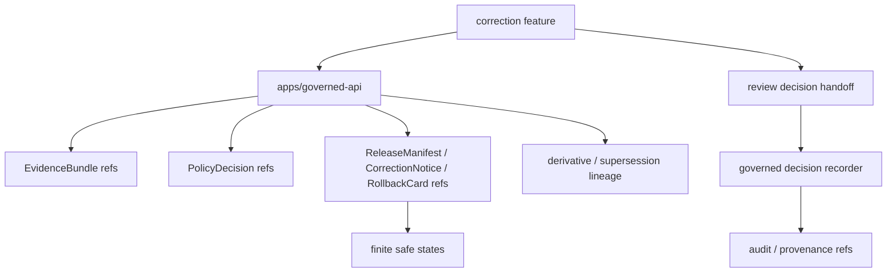

<!-- [KFM_META_BLOCK_V2]
doc_id: kfm://app/review-console/src/features/correction/readme
title: Review Console Correction Feature README
type: app-readme
version: v0.1
status: draft
owners: OWNER_TBD — Review steward · Correction reviewer · Release steward · Policy steward · Evidence steward · Audit steward · Docs steward
created: 2026-06-16
updated: 2026-06-16
policy_label: public
related:
  - ../README.md
  - ../../../README.md
  - ../../../../governed-api/README.md
  - ../../../../../docs/architecture/ui/REVIEW_CONSOLE.md
  - ../../../../../docs/dashboards/governance/RELEASE_CORRECTION_ROLLBACK.md
  - ../../../../../policy/access/README.md
  - ../../../../../policy/decision/README.md
  - ../../../../../schemas/contracts/v1/review/
  - ../../../../../schemas/contracts/v1/evidence/
  - ../../../../../contracts/
  - ../../../../../data/README.md
  - ../../../../../release/README.md
  - ../../../../../packages/evidence-resolver/README.md
  - ../../../../../packages/policy-runtime/README.md
tags: [kfm, apps, review-console, feature, correction, correction-notice, rollback, supersession, release-lineage, audit, provenance]
notes:
  - "Replaces the greenfield correction feature stub with a bounded feature contract."
  - "This feature may support correction review and rollback-context inspection, but it must not issue release authority by itself, rewrite published artifacts, create CorrectionNotice records locally, or bypass release/correction governance."
  - "Feature files, route wiring, schemas, tests, fixtures, governed API envelopes, release/correction/rollback handoffs, deployment state, logs, dashboards, and CI pass state remain NEEDS VERIFICATION."
[/KFM_META_BLOCK_V2] -->

<a id="top"></a>

<div align="center">

# Review Console Correction Feature

`apps/review-console/src/features/correction/`

**App-local Review Console feature boundary for correction review support: defect context, CorrectionNotice readiness, derivative invalidation review, rollback target visibility, supersession lineage, release/correction dashboard handoff, audit/provenance references, and finite denied/restricted/stale/error states.**


[Purpose](#1-purpose) · [Repo fit](#2-repo-fit) · [Boundary](#3-authority-boundary) · [Inputs](#5-inputs) · [Exclusions](#6-exclusions) · [Feature map](#7-correction-feature-map) · [Definition of done](#14-definition-of-done)

</div>

---

> [!IMPORTANT]
> **Status:** draft / `NEEDS VERIFICATION`  
> **Owners:** `OWNER_TBD` — Review steward · Correction reviewer · Release steward · Policy steward · Evidence steward · Audit steward · Docs steward  
> **Path:** `apps/review-console/src/features/correction/README.md`  
> **Responsibility root:** `apps/` — deployable application surfaces  
> **Truth posture:** CONFIRMED README path / CONFIRMED Review Console feature-source boundary / CONFIRMED release-correction-rollback dashboard specification / PROPOSED correction feature contract / UNKNOWN feature files, route wiring, schemas, tests, fixtures, runtime behavior, deployment state, and CI pass state

> [!CAUTION]
> This feature is for correction review support and release-lineage visibility. It must not rewrite published artifacts, issue a release decision by itself, create or mutate CorrectionNotice/RollbackCard/ReleaseManifest records locally, or turn a dashboard warning into a release action.

---

## 1. Purpose

`apps/review-console/src/features/correction/` is the proposed app-local feature home for correction review support inside Review Console.

It may eventually contain modules for:

- defect or correction candidate summaries;
- CorrectionNotice readiness checks;
- rollback target visibility;
- derivative invalidation review;
- supersession lineage and forward-link inspection;
- correction lead-time and dashboard handoff panels;
- release/correction/rollback reference cards;
- evidence and policy support views;
- reviewer decision handoff for correction escalation or approval to route;
- finite denied, restricted, unavailable, stale, malformed, and error states.

This README does not prove that any correction feature file, route, adapter, schema, fixture, test, governed API envelope, correction handoff, deployment, log, dashboard, or CI pass state exists.

[Back to top](#top)

---

## 2. Repo fit

| Concern | Owning root | Expected relationship |
|---|---|---|
| Correction feature source | `apps/review-console/src/features/correction/` | App-local correction review feature, if implemented |
| Review Console feature tree | `apps/review-console/src/features/` | Parent feature-source boundary |
| Review Console app | `apps/review-console/` | Role-gated review/steward deployable |
| Governed API | `apps/governed-api/` | Trust membrane and elevated audited API path |
| Release/correction dashboard spec | `docs/dashboards/governance/RELEASE_CORRECTION_ROLLBACK.md` | Governance indicators and dashboard posture, not enforcement |
| Policy gates | `policy/` | Access, sensitivity, rights, review, release, and decision policy |
| Evidence support | `packages/evidence-resolver/`, `data/proofs/` | EvidenceBundle support and proof context |
| Lifecycle artifacts | `data/` | Receipts, proofs, registry, catalog, triplets, published outputs |
| Release authority | `release/` | Release decisions, CorrectionNotice, RollbackCard, supersession, rollback authority |
| Schemas/contracts | `schemas/contracts/v1/`, `contracts/` | Machine shape and object meaning |

## 3. Authority boundary

This feature may display governed correction and rollback context. It does not own release decisions, CorrectionNotice creation, RollbackCard creation, ReleaseManifest mutation, published artifact edits, derivative invalidation writes, lifecycle storage, EvidenceBundle truth, policy decisions, schemas, contracts, audit/provenance storage, source ingestion, public UI behavior, or runtime/model behavior.

```text
apps/review-console/src/features/correction/ = app-local correction review feature
apps/review-console/src/features/            = feature source boundary
apps/review-console/                         = role-gated review deployable
apps/governed-api/                           = trust membrane and elevated audited API path
release/                                     = release, correction, rollback authority
data/                                        = lifecycle artifacts, receipts, proofs, registries
policy/                                      = access and decision policy
schemas/contracts/v1/                        = machine shape
contracts/                                   = object meaning
```

## 4. Default posture

Correction feature modules should fail closed. The feature should not render or submit correction-review decisions when any of these are unresolved:

- reviewer identity, role, clearance, and separation-of-duty posture;
- governed API envelope and response validation;
- correction candidate or defect report schema;
- EvidenceRef and EvidenceBundle support for the defect or correction claim;
- policy decision and sensitivity posture;
- ReleaseManifest, CorrectionNotice, RollbackCard, supersession, or rollback target refs where material;
- derivative invalidation scope and lineage support;
- stale-state and publication-state context;
- audit/provenance write target and decision handoff path;
- safe error behavior and no raw/internal detail leakage.

## 5. Inputs

| Input family | Examples | Required posture |
|---|---|---|
| Correction candidate | defect id, affected artifact ref, summary, severity, status | Governed projection only |
| Evidence refs | EvidenceRef list, EvidenceBundle refs, citation/support links | Resolver-backed references |
| Release refs | ReleaseManifest, CorrectionNotice, RollbackCard, supersession refs | Required when material |
| Lineage refs | derivative ids, downstream artifact refs, invalidation coverage | Bounded and release-aware |
| Policy refs | PolicyDecision ref, sensitivity label, role check, restriction reason | Policy-runtime derived |
| Review decision state | escalate, defer, request evidence, route correction, reject correction | Finite, audited, policy-gated |
| Audit/provenance refs | decision id, event id, timestamp, reviewer ref, reason code | Durable and non-repudiable |
| UI state | loading, ready, denied, restricted, empty, stale, malformed, error | Explicit finite states |

## 6. Exclusions

| Does not belong here | Correct home |
|---|---|
| Release decisions, CorrectionNotice, RollbackCard, ReleaseManifest mutation | `release/` and governed release/correction authority |
| Published artifact edits | Release/correction workflows, not feature-local edits |
| Derivative invalidation writes | Governed correction/release authority |
| Review decision recording | Review Console decision pane / governed decision recorder |
| Review Console app-level contract | `apps/review-console/README.md` |
| Shared correction UI primitives | `packages/ui/` after extraction and review |
| Policy rules and access decisions | `policy/` |
| Schemas and contracts | `schemas/contracts/v1/`, `contracts/` |
| Lifecycle data and canonical stores | `data/` |
| Source ingestion and fetchers | `connectors/`, `pipelines/`, `pipeline_specs/` |
| Public read-only review visibility | `apps/explorer-web/src/features/review_console_readonly/` |
| Free-form published-record editing | Out of scope |
| Direct model/runtime calls | `runtime/` behind governed API only |
| Deployment-only values | Deployment environment/config channels |

## 7. Correction feature map

Exact implementation files remain `NEEDS VERIFICATION`.

| Candidate feature module | Purpose | Required safeguard | Status |
|---|---|---|---|
| `candidate_summary` | Defect/correction candidate summary | Governed projection only | PROPOSED |
| `affected_release` | Affected release/artifact context | Release refs required | PROPOSED |
| `rollback_target` | Rollback target visibility | Not rollback approval by itself | PROPOSED |
| `derivative_invalidation` | Downstream derivative invalidation review | Lineage and scope required | PROPOSED |
| `supersession_lineage` | Supersession and forward-link inspection | No lineage gap claim without evidence | PROPOSED |
| `evidence_links` | EvidenceRef/EvidenceBundle support links | No raw bundle copy | PROPOSED |
| `policy_panel` | Policy decision and access-state view | No hidden clearance leak | PROPOSED |
| `decision_handoff` | Route correction decision to recorder/workflow | Policy and audit required | PROPOSED |
| `safe_states` | Denied/restricted/empty/stale/malformed/error states | No internal detail leakage | PROPOSED |

> [!WARNING]
> Candidate module names are not implementation proof. Do not claim a correction module is live until files, routes, schemas, fixtures, tests, policy gates, release/correction handoffs, and provenance support confirm it.

## 8. Diagram



## 9. Feature obligations

| Obligation | Example effect |
|---|---|
| `review_support_only` | Feature supports correction review; it does not issue release decisions by itself |
| `no_local_release_writes` | CorrectionNotice/RollbackCard/ReleaseManifest writes happen outside this feature |
| `role_gated_access` | Reviewer role and clearance gate every correction view |
| `evidence_required` | Defect and correction claims link to EvidenceRef/EvidenceBundle refs where material |
| `release_refs_required` | Release, correction, rollback, and supersession refs are preserved where material |
| `lineage_required` | Derivative invalidation and supersession claims require lineage support |
| `auditability_required` | Decision handoff preserves reviewer, timestamp, reason, and provenance refs |
| `release_separation` | Review recommendation is not publication/correction approval by itself |
| `safe_error_only` | Errors reveal no protected data, raw payloads, internal paths, or raw validator internals |

## 10. Per-module contract

Each correction child module should state:

- purpose and owner;
- accepted governed input shape;
- denied inputs and correct homes;
- policy/access dependency;
- EvidenceBundle dependency;
- release/correction/rollback dependency;
- audit/provenance dependency;
- read/write posture;
- tests and fixtures required;
- safe-disable or rollback path;
- open verification items.

## 11. Inspection path

Feature files, route wiring, schemas, tests, fixtures, policy integration, release/correction/rollback handoffs, audit/provenance handoffs, deployment state, logs, dashboards, and emitted artifacts remain `NEEDS VERIFICATION`.

```bash
find apps/review-console/src/features/correction -maxdepth 6 -type f | sort
find apps/review-console apps/governed-api docs/dashboards/governance policy schemas contracts data release packages tests fixtures -maxdepth 6 -type f 2>/dev/null | grep -Ei 'correction|CorrectionNotice|rollback|RollbackCard|ReleaseManifest|supersession|derivative|ReviewDecision|ReviewRecord|EvidenceRef|EvidenceBundle|PolicyDecision|audit|provenance|prov|test|fixture' | sort
```

## 12. Validation expectations

Useful validation for this feature should cover:

- unauthorized users cannot view correction candidates;
- correction review views cannot mutate release records locally;
- CorrectionNotice/RollbackCard/ReleaseManifest writes are outside this feature;
- correction claims preserve EvidenceRef/EvidenceBundle refs, policy refs, release refs, lineage refs, and audit/provenance refs;
- derivative invalidation and supersession views do not claim coverage without lineage support;
- missing evidence, release refs, rollback target, or lineage support renders unavailable, stale, abstained, or restricted states rather than a claim;
- correction recommendation does not become release/correction approval by itself;
- safe states reveal no raw payload, internal store path, protected detail, or validator internals.

## 13. Safe change pattern

For Correction feature changes:

1. Add or update correction feature inventory and module contract.
2. Link correction candidate, release, lineage, and review DTOs to schemas/contracts before changing shapes.
3. Add fixtures for authorized view, unauthorized denial, missing evidence, missing release ref, missing rollback target, derivative gap, supersession gap, stale correction, malformed correction, safe error, and decision handoff cases.
4. Add no-local-release-write, role-gate, lineage-support, evidence-support, policy, and safe-state tests before exposing correction review.
5. Preserve EvidenceRef/EvidenceBundle refs, PolicyDecision refs, release/correction/rollback refs, lineage refs, audit/provenance refs, reason codes, timestamps, and limitations through every view.
6. Update this README, parent feature README, Review Console app README, governed API docs, release docs, policy docs, schemas/contracts, and tests when behavior materially changes.

## 14. Definition of done

- [ ] Owners are confirmed and `OWNER_TBD` is replaced.
- [ ] Correction module inventory and ownership are documented.
- [ ] Correction/release/lineage DTOs and schemas are verified.
- [ ] Authorization, policy runtime, evidence resolver, release lookup, correction handoff, audit/provenance source, and safe-state behavior are documented and tested.
- [ ] Correction views cannot mutate release records locally.
- [ ] Missing-evidence, missing-rollback, derivative-gap, and supersession-gap states are tested.
- [ ] Sensitive-domain and role-denial tests are present and passing.
- [ ] Safe-state tests are present and passing.
- [ ] Deployment, logs, dashboards, and runbooks are documented with current evidence.

## 15. Open verification items

| Item | Why it matters |
|---|---|
| Confirm feature files beyond README | Prevents overclaiming implementation maturity |
| Confirm correction/release DTOs and schemas | Required before shape claims |
| Confirm route/API integration | Required before runtime behavior claims |
| Confirm authorization and separation-of-duty logic | Required before role-gated claims |
| Confirm EvidenceBundle and policy integration | Required before correction support claims |
| Confirm ReleaseManifest/CorrectionNotice/RollbackCard integration | Required before release-lineage claims |
| Confirm derivative invalidation and supersession lineage support | Required before downstream impact claims |
| Confirm audit/provenance source and write boundary | Required before durable decision claims |
| Confirm tests and fixtures | Required before runtime maturity claims |
| Confirm deployment, logs, dashboards, and runbooks | Required before operational claims |

<details>
<summary>Appendix A — no-loss preservation note</summary>

The previous README was a greenfield stub. This replacement adds a bounded correction feature contract without claiming feature files, routes, schemas, tests, fixtures, policy enforcement, release/correction/rollback integration, deployment, logs, dashboards, or CI pass state are implemented.

</details>

## Status summary

`apps/review-console/src/features/correction/` should contain Review Console correction review modules only after feature inventory, route integration, correction/release/lineage schemas, authorization, policy runtime integration, evidence resolver integration, release/correction/rollback support, audit/provenance source boundary, tests, and operational evidence are verified.

It must preserve the correction boundary: this feature may support correction review and release-lineage visibility, but it must not write release records locally, mutate published artifacts, replace release authority, claim derivative invalidation without lineage support, expose raw protected material, or substitute for current passing evidence.

<p align="right"><a href="#top">Back to top</a></p>
