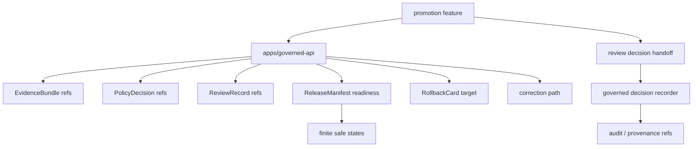

<!-- [KFM_META_BLOCK_V2]
doc_id: kfm://app/review-console/src/features/promotion/readme
title: Review Console Promotion Feature README
type: app-readme
version: v0.1
status: draft
owners: OWNER_TBD — Review steward · Promotion steward · Release steward · Policy steward · Evidence steward · Audit steward · Docs steward
created: 2026-06-16
updated: 2026-06-16
policy_label: public
related:
  - ../README.md
  - ../../../README.md
  - ../../../../governed-api/README.md
  - ../../../../../docs/architecture/ui/REVIEW_CONSOLE.md
  - ../../../../../docs/runbooks/fauna/PROMOTION_RUNBOOK.md
  - ../../../../../policy/access/README.md
  - ../../../../../policy/decision/README.md
  - ../../../../../schemas/contracts/v1/review/
  - ../../../../../schemas/contracts/v1/evidence/
  - ../../../../../contracts/
  - ../../../../../data/README.md
  - ../../../../../release/README.md
  - ../../../../../packages/evidence-resolver/README.md
  - ../../../../../packages/policy-runtime/README.md
tags: [kfm, apps, review-console, feature, promotion, release-gate, review-record, releasemanifest, rollback-card, evidencebundle, policydecision]
notes:
  - "Replaces the greenfield promotion feature stub with a bounded feature contract."
  - "This feature may support promotion review and release-gate readiness inspection, but it must not issue publication authority by itself, move files, mutate lifecycle state locally, or bypass release/policy/evidence governance."
  - "Feature files, route wiring, schemas, tests, fixtures, governed API envelopes, release/promotion handoffs, deployment state, logs, dashboards, and CI pass state remain NEEDS VERIFICATION."
[/KFM_META_BLOCK_V2] -->

<a id="top"></a>

<div align="center">

# Review Console Promotion Feature

`apps/review-console/src/features/promotion/`

**App-local Review Console feature boundary for promotion review support: release-gate readiness, required-artifact checklist, ReviewRecord context, EvidenceBundle closure, PolicyDecision state, ReleaseManifest readiness, rollback target visibility, correction path readiness, audit/provenance references, and finite denied/restricted/stale/error states.**


[Purpose](#1-purpose) · [Repo fit](#2-repo-fit) · [Boundary](#3-authority-boundary) · [Inputs](#5-inputs) · [Exclusions](#6-exclusions) · [Feature map](#7-promotion-feature-map) · [Definition of done](#14-definition-of-done)

</div>

---

> [!IMPORTANT]
> **Status:** draft / `NEEDS VERIFICATION`  
> **Owners:** `OWNER_TBD` — Review steward · Promotion steward · Release steward · Policy steward · Evidence steward · Audit steward · Docs steward  
> **Path:** `apps/review-console/src/features/promotion/README.md`  
> **Responsibility root:** `apps/` — deployable application surfaces  
> **Truth posture:** CONFIRMED README path / CONFIRMED Review Console feature-source boundary / CONFIRMED promotion runbook doctrine / PROPOSED promotion feature contract / UNKNOWN feature files, route wiring, schemas, tests, fixtures, runtime behavior, deployment state, and CI pass state

> [!CAUTION]
> This feature is for promotion review support and release-gate readiness visibility. It must not publish artifacts, issue a ReleaseManifest by itself, move lifecycle files, override policy/evidence gates, or turn a review recommendation into publication authority.

---

## 1. Purpose

`apps/review-console/src/features/promotion/` is the proposed app-local feature home for promotion review support inside Review Console.

It may eventually contain modules for:

- promotion candidate summaries;
- release-gate readiness checklists;
- required artifact and receipt status panels;
- EvidenceRef-to-EvidenceBundle closure views;
- validation report and source-role status views;
- PolicyDecision, sensitivity, rights, and review-state panels;
- ReviewRecord readiness and separation-of-duty prompts;
- ReleaseManifest readiness and rollback target visibility;
- correction path readiness and stale-state context;
- reviewer decision handoff for approve-route, defer-hold, reject, or escalate outcomes;
- finite denied, restricted, unavailable, stale, malformed, and error states.

This README does not prove that any promotion feature file, route, adapter, schema, fixture, test, governed API envelope, release handoff, deployment, log, dashboard, or CI pass state exists.

[Back to top](#top)

---

## 2. Repo fit

| Concern | Owning root | Expected relationship |
|---|---|---|
| Promotion feature source | `apps/review-console/src/features/promotion/` | App-local promotion review feature, if implemented |
| Review Console feature tree | `apps/review-console/src/features/` | Parent feature-source boundary |
| Review Console app | `apps/review-console/` | Role-gated review/steward deployable |
| Governed API | `apps/governed-api/` | Trust membrane and elevated audited API path |
| Promotion runbooks | `docs/runbooks/` | Domain or release-gate procedure docs; implementation-specific status must be verified |
| Policy gates | `policy/` | Access, sensitivity, rights, review, release, and decision policy |
| Evidence support | `packages/evidence-resolver/`, `data/proofs/` | EvidenceBundle support and proof context |
| Lifecycle artifacts | `data/` | Receipts, proofs, registry, catalog, triplets, published outputs |
| Release authority | `release/` | Release decisions, ReleaseManifest, RollbackCard, correction path authority |
| Schemas/contracts | `schemas/contracts/v1/`, `contracts/` | Machine shape and object meaning |

## 3. Authority boundary

This feature may display governed promotion readiness and reviewer decision support. It does not own release decisions, ReleaseManifest creation, RollbackCard creation, publication, lifecycle state transition, file movement, policy decisions, EvidenceBundle truth, schemas, contracts, audit/provenance storage, source ingestion, public UI behavior, or runtime/model behavior.

```text
apps/review-console/src/features/promotion/ = app-local promotion review feature
apps/review-console/src/features/           = feature source boundary
apps/review-console/                        = role-gated review deployable
apps/governed-api/                          = trust membrane and elevated audited API path
release/                                    = release, correction, rollback authority
data/                                       = lifecycle artifacts, receipts, proofs, registries
policy/                                     = access and decision policy
schemas/contracts/v1/                       = machine shape
contracts/                                  = object meaning
```

## 4. Default posture

Promotion feature modules should fail closed. The feature should not render or submit promotion-review decisions when any of these are unresolved:

- reviewer identity, role, clearance, and separation-of-duty posture;
- governed API envelope and response validation;
- promotion candidate schema and lifecycle state;
- SourceDescriptor, TransformReceipt, ValidationReport, PolicyDecision, ReviewRecord, and required transform receipts where material;
- EvidenceRef and EvidenceBundle support for claim-bearing promotion readiness;
- source role, provenance, rights, license, and use terms;
- sensitivity and public-safe derivative posture;
- ReleaseManifest readiness, rollback target, correction path, supersession, or stale-state refs where material;
- audit/provenance write target and decision handoff path;
- safe error behavior and no raw/internal detail leakage.

## 5. Inputs

| Input family | Examples | Required posture |
|---|---|---|
| Promotion candidate | candidate id, lifecycle state, object family, release intent, materiality | Governed projection only |
| Required artifacts | SourceDescriptor, TransformReceipt, ValidationReport, PolicyDecision, ReviewRecord, ReleaseManifest readiness | Verified or marked missing |
| Evidence refs | EvidenceRef list, EvidenceBundle refs, citation/support links | Resolver-backed references |
| Policy refs | PolicyDecision ref, sensitivity label, role check, restriction reason | Policy-runtime derived |
| Release refs | ReleaseManifest readiness, RollbackCard target, correction path, stale-state refs | Required when material |
| Review decision state | approve-route, defer-hold, reject, escalate, request evidence | Finite, audited, policy-gated |
| Audit/provenance refs | decision id, event id, timestamp, reviewer ref, reason code | Durable and non-repudiable |
| UI state | loading, ready, denied, restricted, empty, stale, malformed, error | Explicit finite states |

## 6. Exclusions

| Does not belong here | Correct home |
|---|---|
| ReleaseManifest creation or publication approval | `release/` and governed release authority |
| File movement between lifecycle stages | Governed pipeline/release workflow, not feature-local edits |
| Published artifact edits | Release/correction workflows |
| Review decision recording | Review Console decision pane / governed decision recorder |
| Review Console app-level contract | `apps/review-console/README.md` |
| Shared promotion UI primitives | `packages/ui` after extraction and review |
| Policy rules and access decisions | `policy/` |
| Schemas and contracts | `schemas/contracts/v1/`, `contracts/` |
| Lifecycle data and canonical stores | `data/` |
| Source ingestion and transformations | `connectors/`, `pipelines/`, `pipeline_specs/` |
| Public read-only review visibility | `apps/explorer-web/src/features/review_console_readonly/` |
| Free-form candidate or published-record editing | Out of scope |
| Direct model/runtime calls | `runtime/` behind governed API only |
| Deployment-only values | Deployment environment/config channels |

## 7. Promotion feature map

Exact implementation files remain `NEEDS VERIFICATION`.

| Candidate feature module | Purpose | Required safeguard | Status |
|---|---|---|---|
| `candidate_summary` | Promotion candidate summary | Governed projection only | PROPOSED |
| `readiness_checklist` | Required artifact checklist | Missing artifact blocks promotion recommendation | PROPOSED |
| `evidence_closure` | EvidenceRef/EvidenceBundle support view | No unresolved EvidenceRef claim | PROPOSED |
| `policy_panel` | PolicyDecision and sensitivity posture | No hidden clearance leak | PROPOSED |
| `review_record` | ReviewRecord and separation-of-duty state | Reviewer/role support required | PROPOSED |
| `release_readiness` | ReleaseManifest readiness and target release context | Not release approval by itself | PROPOSED |
| `rollback_target` | RollbackCard target visibility | Rollback target required where material | PROPOSED |
| `correction_path` | Correction path and stale-state context | Correction path required where material | PROPOSED |
| `decision_handoff` | Route promotion decision to recorder/workflow | Policy and audit required | PROPOSED |
| `safe_states` | Denied/restricted/empty/stale/malformed/error states | No internal detail leakage | PROPOSED |

> [!WARNING]
> Candidate module names are not implementation proof. Do not claim a promotion module is live until files, routes, schemas, fixtures, tests, policy gates, release handoffs, and provenance support confirm it.

## 8. Diagram



## 9. Feature obligations

| Obligation | Example effect |
|---|---|
| `review_support_only` | Feature supports promotion review; it does not issue publication decisions by itself |
| `no_local_release_writes` | ReleaseManifest/RollbackCard writes happen outside this feature |
| `no_file_move` | Promotion is a governed state transition, not local file movement |
| `role_gated_access` | Reviewer role and clearance gate every promotion view |
| `evidence_required` | Promotion-readiness claims link to EvidenceRef/EvidenceBundle refs where material |
| `policy_refs_required` | PolicyDecision refs and labels are shown where material |
| `review_record_required` | ReviewRecord state appears where required by materiality or sensitivity |
| `rollback_required` | Rollback target is visible before material promotion recommendations |
| `correction_path_required` | Correction path is visible before material promotion recommendations |
| `safe_error_only` | Errors reveal no protected data, raw payloads, internal paths, or validator internals |

## 10. Per-module contract

Each promotion child module should state:

- purpose and owner;
- accepted governed input shape;
- denied inputs and correct homes;
- policy/access dependency;
- EvidenceBundle dependency;
- review/release/rollback/correction dependency;
- audit/provenance dependency;
- read/write posture;
- tests and fixtures required;
- safe-disable or rollback path;
- open verification items.

## 11. Inspection path

Feature files, route wiring, schemas, tests, fixtures, policy integration, release/promotion handoffs, audit/provenance handoffs, deployment state, logs, dashboards, and emitted artifacts remain `NEEDS VERIFICATION`.

```bash
find apps/review-console/src/features/promotion -maxdepth 6 -type f | sort
find apps/review-console apps/governed-api docs/runbooks policy schemas contracts data release packages tests fixtures -maxdepth 6 -type f 2>/dev/null | grep -Ei 'promotion|promote|ReleaseManifest|RollbackCard|CorrectionNotice|ReviewRecord|ReviewDecision|EvidenceRef|EvidenceBundle|PolicyDecision|ValidationReport|TransformReceipt|SourceDescriptor|audit|provenance|prov|test|fixture' | sort
```

## 12. Validation expectations

Useful validation for this feature should cover:

- unauthorized users cannot view promotion candidates;
- promotion review views cannot mutate lifecycle state or release records locally;
- promotion recommendations require EvidenceBundle support, PolicyDecision support, ReviewRecord support where material, release readiness, rollback target, and correction path;
- missing evidence, policy, review, validation, rollback, correction, release, or source-role support renders unavailable, stale, abstained, or restricted states rather than a claim;
- promotion recommendation does not become publication approval by itself;
- no feature-local file move or direct published artifact mutation occurs;
- safe states reveal no raw payload, internal store path, protected detail, or validator internals.

## 13. Safe change pattern

For Promotion feature changes:

1. Add or update promotion feature inventory and module contract.
2. Link promotion candidate, review, release, and readiness DTOs to schemas/contracts before changing shapes.
3. Add fixtures for authorized view, unauthorized denial, missing evidence, missing policy, missing review record, missing validation, missing rollback target, missing correction path, stale candidate, malformed candidate, safe error, and decision handoff cases.
4. Add no-local-release-write, no-file-move, role-gate, evidence-support, policy-support, rollback-support, correction-support, and safe-state tests before exposing promotion review.
5. Preserve EvidenceRef/EvidenceBundle refs, PolicyDecision refs, ReviewRecord refs, ReleaseManifest refs, RollbackCard refs, CorrectionNotice refs, audit/provenance refs, reason codes, timestamps, and limitations through every view.
6. Update this README, parent feature README, Review Console app README, governed API docs, release docs, policy docs, schemas/contracts, and tests when behavior materially changes.

## 14. Definition of done

- [ ] Owners are confirmed and `OWNER_TBD` is replaced.
- [ ] Promotion module inventory and ownership are documented.
- [ ] Promotion/review/release/readiness DTOs and schemas are verified.
- [ ] Authorization, policy runtime, evidence resolver, validation status, review record, release lookup, promotion handoff, audit/provenance source, and safe-state behavior are documented and tested.
- [ ] Promotion views cannot mutate lifecycle state or release records locally.
- [ ] Missing-evidence, missing-policy, missing-review, missing-rollback, and missing-correction states are tested.
- [ ] Sensitive-domain and role-denial tests are present and passing.
- [ ] Safe-state tests are present and passing.
- [ ] Deployment, logs, dashboards, and runbooks are documented with current evidence.

## 15. Open verification items

| Item | Why it matters |
|---|---|
| Confirm feature files beyond README | Prevents overclaiming implementation maturity |
| Confirm promotion/review/release DTOs and schemas | Required before shape claims |
| Confirm route/API integration | Required before runtime behavior claims |
| Confirm authorization and separation-of-duty logic | Required before role-gated claims |
| Confirm EvidenceBundle and policy integration | Required before promotion support claims |
| Confirm ReviewRecord, ReleaseManifest, RollbackCard, and correction-path integration | Required before release-readiness claims |
| Confirm validation/report and source-role integration | Required before promotion readiness claims |
| Confirm audit/provenance source and write boundary | Required before durable decision claims |
| Confirm tests and fixtures | Required before runtime maturity claims |
| Confirm deployment, logs, dashboards, and runbooks | Required before operational claims |

<details>
<summary>Appendix A — no-loss preservation note</summary>

The previous README was a greenfield stub. This replacement adds a bounded promotion feature contract without claiming feature files, routes, schemas, tests, fixtures, policy enforcement, release/promotion integration, deployment, logs, dashboards, or CI pass state are implemented.

</details>

## Status summary

`apps/review-console/src/features/promotion/` should contain Review Console promotion review modules only after feature inventory, route integration, promotion/review/release schemas, authorization, policy runtime integration, evidence resolver integration, validation status, ReviewRecord support, ReleaseManifest/RollbackCard/correction-path support, audit/provenance source boundary, tests, and operational evidence are verified.

It must preserve the promotion boundary: this feature may support release-gate review and promotion readiness visibility, but it must not publish artifacts, move lifecycle files, replace release authority, claim readiness without required artifacts, expose raw protected material, or substitute for current passing evidence.

<p align="right"><a href="#top">Back to top</a></p>
