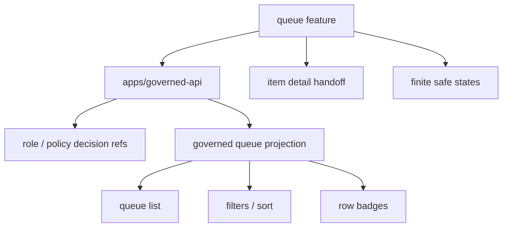

<!-- [KFM_META_BLOCK_V2]
doc_id: kfm://app/review-console/src/features/queue/readme
title: Review Console Queue Feature README
type: app-readme
version: v0.1
status: draft
owners: OWNER_TBD — Review steward · UI steward · Policy steward · Evidence steward · Audit steward · Docs steward
created: 2026-06-16
updated: 2026-06-16
policy_label: public
related:
  - ../README.md
  - ../../../README.md
  - ../../../../governed-api/README.md
  - ../../../../explorer-web/src/features/review_console_readonly/README.md
  - ../../../../../docs/architecture/ui/REVIEW_CONSOLE.md
  - ../../../../../docs/governance/REVIEW_DUTIES.md
  - ../../../../../policy/access/README.md
  - ../../../../../policy/decision/README.md
  - ../../../../../schemas/contracts/v1/review/
  - ../../../../../schemas/contracts/v1/evidence/
  - ../../../../../contracts/
  - ../../../../../data/README.md
  - ../../../../../release/README.md
  - ../../../../../packages/evidence-resolver/README.md
  - ../../../../../packages/policy-runtime/README.md
tags: [kfm, apps, review-console, feature, queue, quarantine, work, review-queue, policy-gated, evidencebundle, finite-states]
notes:
  - "Replaces the greenfield queue feature stub with a bounded feature contract."
  - "This feature may render a role-gated review queue projection, but it must not read lifecycle stores directly, mutate queue items locally, bypass governed API/policy gates, or become a public review surface."
  - "Feature files, route wiring, schemas, tests, fixtures, governed API envelopes, queue APIs, deployment state, logs, dashboards, and CI pass state remain NEEDS VERIFICATION."
[/KFM_META_BLOCK_V2] -->

<a id="top"></a>

<div align="center">

# Review Console Queue Feature

`apps/review-console/src/features/queue/`

**App-local Review Console feature boundary for role-gated queue visibility: WORK/QUARANTINE review candidates, validator categories, policy labels, age and priority sorting, assignment context, finite empty/denied/restricted/stale/error states, and safe handoff into item-detail review.**


[Purpose](#1-purpose) · [Repo fit](#2-repo-fit) · [Boundary](#3-authority-boundary) · [Inputs](#5-inputs) · [Exclusions](#6-exclusions) · [Feature map](#7-queue-feature-map) · [Definition of done](#14-definition-of-done)

</div>

---

> [!IMPORTANT]
> **Status:** draft / `NEEDS VERIFICATION`  
> **Owners:** `OWNER_TBD` — Review steward · UI steward · Policy steward · Evidence steward · Audit steward · Docs steward  
> **Path:** `apps/review-console/src/features/queue/README.md`  
> **Responsibility root:** `apps/` — deployable application surfaces  
> **Truth posture:** CONFIRMED README path / CONFIRMED Review Console feature-source boundary / CONFIRMED Review Console queue-surface doctrine / PROPOSED queue feature contract / UNKNOWN feature files, route wiring, schemas, tests, fixtures, runtime behavior, deployment state, and CI pass state

> [!CAUTION]
> The Queue feature is a role-gated review index, not a lifecycle store. It must not expose raw WORK/QUARANTINE internals, mutate candidates locally, publish items, bypass governed API envelopes, or leak restricted queue metadata through filters, counts, badges, logs, errors, or cached client state.

---

## 1. Purpose

`apps/review-console/src/features/queue/` is the proposed app-local feature home for the Review Console queue surface.

It may eventually contain modules for:

- reviewer queue list rendering;
- queue filters, sorting, grouping, and pagination;
- item priority and age indicators;
- validator category and reason-code summaries;
- policy label and sensitivity posture display;
- assignment and steward-lane affordances;
- empty, denied, restricted, stale, malformed, loading, and error states;
- safe handoff to item detail, evidence pane, spatial pane, decision pane, or escalation flows.

This README does not prove that any queue feature file, route, adapter, schema, fixture, test, governed API envelope, queue API, deployment, log, dashboard, or CI pass state exists.

[Back to top](#top)

---

## 2. Repo fit

| Concern | Owning root | Expected relationship |
|---|---|---|
| Queue feature source | `apps/review-console/src/features/queue/` | App-local queue display feature, if implemented |
| Review Console feature tree | `apps/review-console/src/features/` | Parent feature-source boundary |
| Review Console app | `apps/review-console/` | Role-gated review/steward deployable |
| Governed API | `apps/governed-api/` | Trust membrane and elevated audited API path |
| Explorer Web read-only review | `apps/explorer-web/src/features/review_console_readonly/` | Separate read-only public/semi-public visibility; no lifecycle mutation |
| Review architecture | `docs/architecture/ui/REVIEW_CONSOLE.md` | Review surfaces, queue purpose, and decision boundaries |
| Policy gates | `policy/` | Access, sensitivity, rights, review, release, and decision policy |
| Evidence support | `packages/evidence-resolver/`, `data/proofs/` | EvidenceBundle support and proof context |
| Lifecycle artifacts | `data/` | Lifecycle state, receipts, proofs, registries, catalog, triplets, published outputs |
| Release authority | `release/` | Publication, correction, rollback, release manifest authority |
| Schemas/contracts | `schemas/contracts/v1/`, `contracts/` | Machine shape and object meaning |

## 3. Authority boundary

This feature may render governed queue projections for authorized reviewers. It does not own queue storage, lifecycle state, source records, EvidenceBundle truth, policy decisions, review decision recording, release decisions, schemas, contracts, source ingestion, public UI behavior, audit/provenance storage, or runtime/model behavior.

```text
apps/review-console/src/features/queue/ = app-local queue feature source
apps/review-console/src/features/       = feature source boundary
apps/review-console/                    = role-gated review deployable
apps/governed-api/                      = trust membrane and elevated audited API path
policy/                                 = access and decision policy
data/                                   = lifecycle artifacts, receipts, proofs, registries
release/                                = publication, correction, rollback authority
schemas/contracts/v1/                   = machine shape
contracts/                              = object meaning
```

## 4. Default posture

Queue feature modules should fail closed. The feature should not render review queue rows, counts, filters, or item summaries when any of these are unresolved:

- reviewer identity, role, clearance, and queue entitlement;
- governed API envelope and response validation;
- queue item schema and lifecycle state;
- item source role, provenance, rights, and policy label;
- validator category, reason code, and confidence posture;
- EvidenceRef and EvidenceBundle support where item summaries are claim-bearing;
- sensitivity and restricted-metadata rules for visible fields, filters, counts, and badges;
- release, correction, rollback, stale-state, or review-lineage context where material;
- safe error behavior and no raw/internal detail leakage.

## 5. Inputs

| Input family | Examples | Required posture |
|---|---|---|
| Queue row | item id, title/summary, status, validator class, age, priority | Governed projection only |
| Review context | reviewer role, assignment lane, steward group, separation-of-duty state | Policy-runtime derived |
| Policy refs | policy label, sensitivity summary, restriction reason, allowed actions | No hidden clearance leak |
| Evidence refs | EvidenceRef list, EvidenceBundle refs, support availability | Resolver-backed references where material |
| Lifecycle refs | WORK/QUARANTINE marker, candidate status, stale-state flag | Public-safe role-gated projection only |
| Filter state | source, validator, policy label, age, priority, assignment | Must not leak restricted counts |
| Handoff state | selected item id, target pane, route intent | Finite and auditable |
| UI state | loading, ready, empty, denied, restricted, stale, malformed, error | Explicit finite states |

## 6. Exclusions

| Does not belong here | Correct home |
|---|---|
| Queue/lifecycle storage | `data/` and governed pipeline stores |
| Review decision recording | Review Console decision pane / governed decision recorder |
| Review Console app-level contract | `apps/review-console/README.md` |
| Shared queue UI primitives | `packages/ui/` after extraction and review |
| Policy rules and access decisions | `policy/` |
| Schemas and contracts | `schemas/contracts/v1/`, `contracts/` |
| Source data and canonical records | `data/` |
| Release manifests, correction notices, rollback cards | `release/` |
| Source ingestion and transformations | `connectors/`, `pipelines/`, `pipeline_specs/` |
| Public read-only review visibility | `apps/explorer-web/src/features/review_console_readonly/` |
| Free-form payload editing | Out of scope |
| Direct model/runtime calls | `runtime/` behind governed API only |
| Deployment-only values | Deployment environment/config channels |

## 7. Queue feature map

Exact implementation files remain `NEEDS VERIFICATION`.

| Candidate feature module | Purpose | Required safeguard | Status |
|---|---|---|---|
| `queue_list` | Review queue rows and pagination | Role-gated governed projection | PROPOSED |
| `filters` | Source, validator, age, policy, assignment filters | No restricted count leakage | PROPOSED |
| `sort_priority` | Priority, age, and severity ordering | Deterministic and explainable | PROPOSED |
| `row_badges` | Policy, stale, validation, evidence, assignment badges | Redacted and role-aware | PROPOSED |
| `assignment` | Reviewer/steward lane assignment display | No hidden role leakage | PROPOSED |
| `empty_state` | Empty queue or no-filter-match display | No inference about hidden items | PROPOSED |
| `handoff` | Open item detail/evidence/decision flow | Auditable selection ref | PROPOSED |
| `safe_states` | Denied/restricted/stale/malformed/error states | No internal detail leakage | PROPOSED |

> [!WARNING]
> Candidate module names are not implementation proof. Do not claim a queue module is live until files, routes, schemas, fixtures, tests, policy gates, and governed API envelopes confirm it.

## 8. Diagram



## 9. Feature obligations

| Obligation | Example effect |
|---|---|
| `role_gated_access` | Reviewer role and clearance gate every queue request |
| `governed_projection_only` | Queue rows come from governed API projections, not lifecycle stores |
| `read_only_queue` | Queue view does not mutate lifecycle or review decisions locally |
| `no_hidden_count_leak` | Filters, counts, and empty states do not reveal restricted item existence |
| `evidence_refs_required` | Claim-bearing row summaries link to EvidenceRef/EvidenceBundle refs where material |
| `policy_refs_required` | Policy labels and allowed actions are derived from policy decisions |
| `safe_handoff_required` | Opening an item uses bounded item ids and governed routes |
| `safe_error_only` | Errors reveal no protected data, raw payloads, internal paths, or validator internals |
| `public_slice_separated` | Explorer Web read-only feature remains separate from Review Console app features |

## 10. Per-module contract

Each queue child module should state:

- purpose and owner;
- accepted governed input shape;
- denied inputs and correct homes;
- policy/access dependency;
- EvidenceBundle dependency where material;
- read-only posture;
- count/filter leakage rules;
- tests and fixtures required;
- safe-disable or rollback path;
- open verification items.

## 11. Inspection path

Feature files, route wiring, schemas, tests, fixtures, policy integration, governed API queue envelopes, deployment state, logs, dashboards, and emitted artifacts remain `NEEDS VERIFICATION`.

```bash
find apps/review-console/src/features/queue -maxdepth 6 -type f | sort
find apps/review-console apps/governed-api docs/architecture/ui policy schemas contracts data release packages tests fixtures -maxdepth 6 -type f 2>/dev/null | grep -Ei 'queue|quarantine|work|ReviewDecision|ReviewRecord|EvidenceRef|EvidenceBundle|PolicyDecision|validator|reason|priority|assignment|rbac|test|fixture' | sort
```

## 12. Validation expectations

Useful validation for this feature should cover:

- unauthorized users cannot view queue rows, row counts, or filter counts;
- queue rows are governed projections and cannot expose raw lifecycle/canonical fields;
- queue view cannot submit decisions, mutate lifecycle state, or move candidates;
- filters and empty states do not disclose hidden restricted items;
- row badges preserve policy labels, stale state, evidence availability, validator category, and reason-code limitations without leaking restricted detail;
- item handoff uses governed bounded ids and does not create public direct reads;
- safe states reveal no raw payload, internal store path, protected detail, or validator internals.

## 13. Safe change pattern

For Queue feature changes:

1. Add or update queue feature inventory and module contract.
2. Link queue row, filter, pagination, and handoff DTOs to schemas/contracts before changing shapes.
3. Add fixtures for authorized view, unauthorized denial, empty queue, restricted hidden items, filter no-match, stale item, malformed row, missing policy, missing evidence, and safe error cases.
4. Add no-hidden-count-leak, read-only, role-gate, row-redaction, handoff, and safe-state tests before exposing queue views.
5. Preserve EvidenceRef/EvidenceBundle refs, PolicyDecision refs, review-lineage refs, stale-state refs, reason codes, timestamps, and limitations through every row.
6. Update this README, parent feature README, Review Console app README, governed API docs, policy docs, schemas/contracts, and tests when behavior materially changes.

## 14. Definition of done

- [ ] Owners are confirmed and `OWNER_TBD` is replaced.
- [ ] Queue module inventory and ownership are documented.
- [ ] Queue row/filter/pagination/handoff DTOs and schemas are verified.
- [ ] Authorization, policy runtime, evidence resolver, queue projection route, and safe-state behavior are documented and tested.
- [ ] Queue view cannot mutate lifecycle state or review decisions locally.
- [ ] Hidden-count and restricted-item leakage tests are present and passing.
- [ ] Missing-evidence, stale-item, and malformed-row states are tested.
- [ ] Sensitive-domain and role-denial tests are present and passing.
- [ ] Safe-state tests are present and passing.
- [ ] Deployment, logs, dashboards, and runbooks are documented with current evidence.

## 15. Open verification items

| Item | Why it matters |
|---|---|
| Confirm feature files beyond README | Prevents overclaiming implementation maturity |
| Confirm queue row/filter DTOs and schemas | Required before shape claims |
| Confirm route/API integration | Required before runtime behavior claims |
| Confirm authorization and separation-of-duty logic | Required before role-gated claims |
| Confirm policy-derived visibility rules | Required before hidden-count and action claims |
| Confirm EvidenceBundle integration | Required before evidence-support claims |
| Confirm queue handoff to item detail and decision pane | Required before workflow claims |
| Confirm no lifecycle direct reads | Required before trust-membrane claims |
| Confirm tests and fixtures | Required before runtime maturity claims |
| Confirm deployment, logs, dashboards, and runbooks | Required before operational claims |

<details>
<summary>Appendix A — no-loss preservation note</summary>

The previous README was a greenfield stub. This replacement adds a bounded queue feature contract without claiming feature files, routes, schemas, tests, fixtures, policy enforcement, governed API queue integration, deployment, logs, dashboards, or CI pass state are implemented.

</details>

## Status summary

`apps/review-console/src/features/queue/` should contain Review Console queue display modules only after feature inventory, route integration, queue schemas, authorization, policy runtime integration, evidence resolver integration, governed queue projection support, no-hidden-count-leak checks, tests, and operational evidence are verified.

It must preserve the queue boundary: this feature may show role-gated review candidates, but it must not read lifecycle stores directly, mutate queue items, publish artifacts, expose restricted counts or metadata, replace policy decisions, or substitute for current passing evidence.

<p align="right"><a href="#top">Back to top</a></p>
