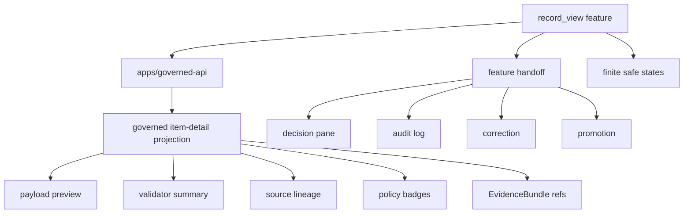

<!-- [KFM_META_BLOCK_V2]
doc_id: kfm://app/review-console/src/features/record-view/readme
title: Review Console Record View Feature README
type: app-readme
version: v0.1
status: draft
owners: OWNER_TBD — Review steward · UI steward · Policy steward · Evidence steward · Audit steward · Docs steward
created: 2026-06-16
updated: 2026-06-16
policy_label: public
related:
  - ../README.md
  - ../../../README.md
  - ../../../../governed-api/README.md
  - ../../../../explorer-web/src/features/review_console_readonly/README.md
  - ../../../../../docs/architecture/ui/REVIEW_CONSOLE.md
  - ../../../../../docs/governance/REVIEW_DUTIES.md
  - ../../../../../policy/access/README.md
  - ../../../../../policy/decision/README.md
  - ../../../../../schemas/contracts/v1/review/
  - ../../../../../schemas/contracts/v1/evidence/
  - ../../../../../contracts/
  - ../../../../../data/README.md
  - ../../../../../release/README.md
  - ../../../../../packages/evidence-resolver/README.md
  - ../../../../../packages/policy-runtime/README.md
tags: [kfm, apps, review-console, feature, record-view, item-detail, payload-preview, validator-report, evidencebundle, policydecision, finite-states]
notes:
  - "Replaces the greenfield record_view feature stub with a bounded feature contract."
  - "This feature may render role-gated item-detail projections, but it must not edit source payloads, read lifecycle stores directly, write review decisions, bypass governed API/policy gates, or become a public record viewer."
  - "Feature files, route wiring, schemas, tests, fixtures, governed API envelopes, item-detail APIs, deployment state, logs, dashboards, and CI pass state remain NEEDS VERIFICATION."
[/KFM_META_BLOCK_V2] -->

<a id="top"></a>

<div align="center">

# Review Console Record View Feature

`apps/review-console/src/features/record_view/`

**App-local Review Console feature boundary for role-gated item-detail inspection: payload preview, source lineage, validator report, policy posture, EvidenceRef/EvidenceBundle links, related records, finite denied/restricted/stale/error states, and safe handoff to evidence, spatial, history, correction, promotion, and decision flows.**


[Purpose](#1-purpose) · [Repo fit](#2-repo-fit) · [Boundary](#3-authority-boundary) · [Inputs](#5-inputs) · [Exclusions](#6-exclusions) · [Feature map](#7-record-view-feature-map) · [Definition of done](#14-definition-of-done)

</div>

---

> [!IMPORTANT]
> **Status:** draft / `NEEDS VERIFICATION`  
> **Owners:** `OWNER_TBD` — Review steward · UI steward · Policy steward · Evidence steward · Audit steward · Docs steward  
> **Path:** `apps/review-console/src/features/record_view/README.md`  
> **Responsibility root:** `apps/` — deployable application surfaces  
> **Truth posture:** CONFIRMED README path / CONFIRMED Review Console feature-source boundary / CONFIRMED Item Detail surface doctrine / PROPOSED record-view feature contract / UNKNOWN feature files, route wiring, schemas, tests, fixtures, runtime behavior, deployment state, and CI pass state

> [!CAUTION]
> Record View is a role-gated inspection surface, not a payload editor. It must not mutate source records, change lifecycle state, write review decisions, publish artifacts, expose raw WORK/QUARANTINE internals, or leak restricted detail through previews, related-record panels, logs, errors, or cached client state.

---

## 1. Purpose

`apps/review-console/src/features/record_view/` is the proposed app-local feature home for the Review Console item-detail / record-view surface.

It may eventually contain modules for:

- governed item-detail rendering;
- redacted payload preview;
- source lineage and provenance summaries;
- validator report and reason-code summaries;
- policy label, rights, sensitivity, and release-readiness display;
- EvidenceRef and EvidenceBundle reference links;
- related record and derivative context;
- safe handoff to evidence pane, spatial pane, audit log, correction review, promotion review, and decision pane;
- finite denied, restricted, unavailable, stale, malformed, loading, and error states.

This README does not prove that any record-view feature file, route, adapter, schema, fixture, test, governed API envelope, item-detail API, deployment, log, dashboard, or CI pass state exists.

[Back to top](#top)

---

## 2. Repo fit

| Concern | Owning root | Expected relationship |
|---|---|---|
| Record View feature source | `apps/review-console/src/features/record_view/` | App-local item-detail display feature, if implemented |
| Review Console feature tree | `apps/review-console/src/features/` | Parent feature-source boundary |
| Review Console app | `apps/review-console/` | Role-gated review/steward deployable |
| Governed API | `apps/governed-api/` | Trust membrane and elevated audited API path |
| Explorer Web read-only review | `apps/explorer-web/src/features/review_console_readonly/` | Separate public/semi-public read-only visibility; no lifecycle mutation |
| Review architecture | `docs/architecture/ui/REVIEW_CONSOLE.md` | Item Detail, Evidence Pane, Spatial Pane, Decision Pane, History concepts |
| Policy gates | `policy/` | Access, sensitivity, rights, review, release, and decision policy |
| Evidence support | `packages/evidence-resolver/`, `data/proofs/` | EvidenceBundle support and proof context |
| Lifecycle artifacts | `data/` | Lifecycle state, receipts, proofs, registries, catalog, triplets, published outputs |
| Release authority | `release/` | Publication, correction, rollback, release manifest authority |
| Schemas/contracts | `schemas/contracts/v1/`, `contracts/` | Machine shape and object meaning |

## 3. Authority boundary

This feature may render governed item-detail projections for authorized reviewers. It does not own source records, canonical payloads, lifecycle state, review decision recording, EvidenceBundle truth, policy decisions, release decisions, schemas, contracts, source ingestion, public UI behavior, audit/provenance storage, or runtime/model behavior.

```text
apps/review-console/src/features/record_view/ = app-local record-view feature source
apps/review-console/src/features/             = feature source boundary
apps/review-console/                          = role-gated review deployable
apps/governed-api/                            = trust membrane and elevated audited API path
policy/                                       = access and decision policy
data/                                         = lifecycle artifacts, receipts, proofs, registries
release/                                      = publication, correction, rollback authority
schemas/contracts/v1/                         = machine shape
contracts/                                    = object meaning
```

## 4. Default posture

Record View feature modules should fail closed. The feature should not render item detail, preview fields, related records, or action affordances when any of these are unresolved:

- reviewer identity, role, clearance, and item entitlement;
- governed API envelope and response validation;
- item-detail schema and lifecycle state;
- source role, provenance, rights, license, and policy label;
- validator report, reason codes, and confidence posture;
- EvidenceRef and EvidenceBundle support where displayed fields are claim-bearing;
- sensitivity and restricted-field rules for payload preview, related-record panels, and badges;
- release, correction, rollback, stale-state, review-lineage, or derivative context where material;
- safe handoff rules for decision, promotion, correction, spatial, evidence, and history features;
- safe error behavior and no raw/internal detail leakage.

## 5. Inputs

| Input family | Examples | Required posture |
|---|---|---|
| Item detail | item id, title, object family, lifecycle state, preview fields | Governed projection only |
| Payload preview | normalized public/reviewer-safe fields, redaction labels, omitted-field reasons | No raw lifecycle payload |
| Validator report | validator status, reason code, warnings, blocked fields, quality flags | Summarized and role-gated |
| Source lineage | source refs, source role, transform refs, validation refs | Reference-based display |
| Policy refs | policy label, sensitivity summary, restriction reason, allowed actions | Policy-runtime derived |
| Evidence refs | EvidenceRef list, EvidenceBundle refs, support availability | Resolver-backed references where material |
| Related context | related records, derivative refs, release/correction/rollback refs | Bounded and role-gated |
| Handoff state | target feature, selected item id, route intent | Finite and auditable |
| UI state | loading, ready, empty, denied, restricted, stale, malformed, error | Explicit finite states |

## 6. Exclusions

| Does not belong here | Correct home |
|---|---|
| Raw source payload editing | Out of scope; source/pipeline governance owns payload changes |
| Review decision recording | Review Console decision pane / governed decision recorder |
| Queue/lifecycle storage | `data/` and governed pipeline stores |
| Review Console app-level contract | `apps/review-console/README.md` |
| Shared record-view UI primitives | `packages/ui/` after extraction and review |
| Policy rules and access decisions | `policy/` |
| Schemas and contracts | `schemas/contracts/v1/`, `contracts/` |
| Source data and canonical records | `data/` |
| Release manifests, correction notices, rollback cards | `release/` |
| Source ingestion and transformations | `connectors/`, `pipelines/`, `pipeline_specs/` |
| Public read-only review visibility | `apps/explorer-web/src/features/review_console_readonly/` |
| Published artifact mutation | Release/correction workflows |
| Direct model/runtime calls | `runtime/` behind governed API only |
| Deployment-only values | Deployment environment/config channels |

## 7. Record View feature map

Exact implementation files remain `NEEDS VERIFICATION`.

| Candidate feature module | Purpose | Required safeguard | Status |
|---|---|---|---|
| `detail_shell` | Item-detail layout and finite states | Role-gated governed projection | PROPOSED |
| `payload_preview` | Reviewer-safe payload preview | Redaction and omitted-field reasons | PROPOSED |
| `validator_summary` | Validation report summary and reason codes | No raw validator internals | PROPOSED |
| `source_lineage` | Source and transform lineage refs | Reference-only display | PROPOSED |
| `policy_badges` | Policy, sensitivity, rights, allowed-action badges | Policy-derived display | PROPOSED |
| `evidence_links` | EvidenceRef/EvidenceBundle support links | No raw bundle copy | PROPOSED |
| `related_records` | Related/derivative/release context | No unauthorized joins | PROPOSED |
| `handoff` | Open evidence/spatial/history/decision/correction/promotion flows | Auditable bounded id | PROPOSED |
| `safe_states` | Denied/restricted/stale/malformed/error states | No internal detail leakage | PROPOSED |

> [!WARNING]
> Candidate module names are not implementation proof. Do not claim a record-view module is live until files, routes, schemas, fixtures, tests, policy gates, and governed API envelopes confirm it.

## 8. Diagram



## 9. Feature obligations

| Obligation | Example effect |
|---|---|
| `role_gated_access` | Reviewer role and clearance gate every item-detail request |
| `governed_projection_only` | Item detail comes from governed API projections, not lifecycle stores |
| `read_only_record_view` | Record View cannot mutate source payloads, lifecycle state, or review decisions |
| `redacted_preview_required` | Preview fields honor policy, sensitivity, rights, and omitted-field reasons |
| `evidence_refs_required` | Claim-bearing fields link to EvidenceRef/EvidenceBundle refs where material |
| `policy_refs_required` | Policy labels and allowed actions are derived from policy decisions |
| `safe_handoff_required` | Handoffs use bounded ids and governed feature routes |
| `safe_error_only` | Errors reveal no protected data, raw payloads, internal paths, or validator internals |
| `public_slice_separated` | Explorer Web read-only feature remains separate from Review Console app features |

## 10. Per-module contract

Each record-view child module should state:

- purpose and owner;
- accepted governed input shape;
- denied inputs and correct homes;
- policy/access dependency;
- EvidenceBundle dependency where material;
- read-only posture;
- redaction and omitted-field rules;
- tests and fixtures required;
- safe-disable or rollback path;
- open verification items.

## 11. Inspection path

Feature files, route wiring, schemas, tests, fixtures, policy integration, governed API item-detail envelopes, deployment state, logs, dashboards, and emitted artifacts remain `NEEDS VERIFICATION`.

```bash
find apps/review-console/src/features/record_view -maxdepth 6 -type f | sort
find apps/review-console apps/governed-api docs/architecture/ui policy schemas contracts data release packages tests fixtures -maxdepth 6 -type f 2>/dev/null | grep -Ei 'record.?view|item.?detail|payload|validator|lineage|ReviewDecision|ReviewRecord|EvidenceRef|EvidenceBundle|PolicyDecision|ReleaseManifest|CorrectionNotice|RollbackCard|redaction|omitted|rbac|test|fixture' | sort
```

## 12. Validation expectations

Useful validation for this feature should cover:

- unauthorized users cannot view item detail or payload preview;
- item detail is a governed projection and cannot expose raw lifecycle/canonical fields;
- Record View cannot submit decisions, mutate lifecycle state, edit payloads, or move candidates;
- payload preview omits or masks restricted fields with visible omitted-field reasons;
- validator summaries do not expose raw validator internals or internal paths;
- related-record panels do not perform unauthorized joins or reveal hidden items;
- handoff to evidence, spatial, audit, decision, correction, and promotion features uses bounded ids and governed routes;
- safe states reveal no raw payload, internal store path, protected detail, or validator internals.

## 13. Safe change pattern

For Record View feature changes:

1. Add or update record-view feature inventory and module contract.
2. Link item-detail, payload-preview, validator-summary, lineage, and handoff DTOs to schemas/contracts before changing shapes.
3. Add fixtures for authorized view, unauthorized denial, restricted preview, omitted fields, missing evidence, missing validator report, stale item, malformed detail, hidden related record, and safe error cases.
4. Add read-only, no-payload-edit, role-gate, redacted-preview, related-record, handoff, and safe-state tests before exposing item detail.
5. Preserve EvidenceRef/EvidenceBundle refs, PolicyDecision refs, review-lineage refs, release/correction/rollback refs, stale-state refs, reason codes, timestamps, and limitations through every view.
6. Update this README, parent feature README, Review Console app README, governed API docs, policy docs, schemas/contracts, and tests when behavior materially changes.

## 14. Definition of done

- [ ] Owners are confirmed and `OWNER_TBD` is replaced.
- [ ] Record-view module inventory and ownership are documented.
- [ ] Item-detail/payload-preview/lineage/handoff DTOs and schemas are verified.
- [ ] Authorization, policy runtime, evidence resolver, item-detail projection route, and safe-state behavior are documented and tested.
- [ ] Record View cannot mutate source payloads, lifecycle state, or review decisions locally.
- [ ] Redacted-preview and omitted-field tests are present and passing.
- [ ] Related-record leakage tests are present and passing.
- [ ] Missing-evidence, stale-item, and malformed-detail states are tested.
- [ ] Sensitive-domain and role-denial tests are present and passing.
- [ ] Safe-state tests are present and passing.
- [ ] Deployment, logs, dashboards, and runbooks are documented with current evidence.

## 15. Open verification items

| Item | Why it matters |
|---|---|
| Confirm feature files beyond README | Prevents overclaiming implementation maturity |
| Confirm item-detail DTOs and schemas | Required before shape claims |
| Confirm route/API integration | Required before runtime behavior claims |
| Confirm authorization and separation-of-duty logic | Required before role-gated claims |
| Confirm policy-derived field visibility rules | Required before preview claims |
| Confirm EvidenceBundle integration | Required before evidence-support claims |
| Confirm related-record joins and limitations | Required before derivative/context claims |
| Confirm handoff to evidence/spatial/audit/decision/correction/promotion flows | Required before workflow claims |
| Confirm tests and fixtures | Required before runtime maturity claims |
| Confirm deployment, logs, dashboards, and runbooks | Required before operational claims |

<details>
<summary>Appendix A — no-loss preservation note</summary>

The previous README was a greenfield stub. This replacement adds a bounded record-view feature contract without claiming feature files, routes, schemas, tests, fixtures, policy enforcement, governed API item-detail integration, deployment, logs, dashboards, or CI pass state are implemented.

</details>

## Status summary

`apps/review-console/src/features/record_view/` should contain Review Console item-detail display modules only after feature inventory, route integration, item-detail schemas, authorization, policy runtime integration, evidence resolver integration, governed item-detail projection support, redacted-preview behavior, related-record leakage checks, tests, and operational evidence are verified.

It must preserve the record-view boundary: this feature may show role-gated item details, but it must not read lifecycle stores directly, edit source payloads, mutate candidates, publish artifacts, expose restricted fields or hidden related records, replace policy decisions, or substitute for current passing evidence.

<p align="right"><a href="#top">Back to top</a></p>
