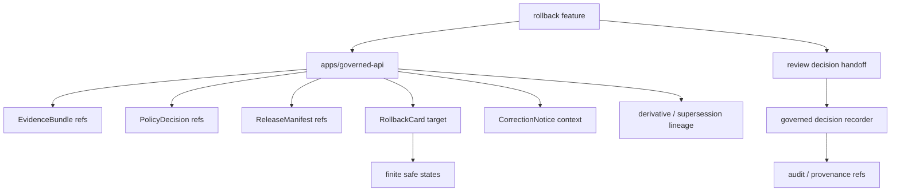

<!-- [KFM_META_BLOCK_V2]
doc_id: kfm://app/review-console/src/features/rollback/readme
title: Review Console Rollback Feature README
type: app-readme
version: v0.1
status: draft
owners: OWNER_TBD — Review steward · Rollback steward · Release steward · Policy steward · Evidence steward · Audit steward · Docs steward
created: 2026-06-16
updated: 2026-06-16
policy_label: public
related:
  - ../README.md
  - ../../../README.md
  - ../../../../governed-api/README.md
  - ../../../../../docs/architecture/ui/REVIEW_CONSOLE.md
  - ../../../../../docs/dashboards/governance/RELEASE_CORRECTION_ROLLBACK.md
  - ../../../../../policy/access/README.md
  - ../../../../../policy/decision/README.md
  - ../../../../../schemas/contracts/v1/review/
  - ../../../../../schemas/contracts/v1/evidence/
  - ../../../../../contracts/
  - ../../../../../data/README.md
  - ../../../../../release/README.md
  - ../../../../../packages/evidence-resolver/README.md
  - ../../../../../packages/policy-runtime/README.md
tags: [kfm, apps, review-console, feature, rollback, rollback-card, release-manifest, correction-notice, release-lineage, audit, provenance]
notes:
  - "Replaces the greenfield rollback feature stub with a bounded feature contract."
  - "This feature may support rollback review and rollback-target inspection, but it must not execute rollbacks, mutate published artifacts, create RollbackCard records locally, or bypass release/correction governance."
  - "Feature files, route wiring, schemas, tests, fixtures, governed API envelopes, release/rollback handoffs, deployment state, logs, dashboards, and CI pass state remain NEEDS VERIFICATION."
[/KFM_META_BLOCK_V2] -->

<a id="top"></a>

<div align="center">

# Review Console Rollback Feature

`apps/review-console/src/features/rollback/`

**App-local Review Console feature boundary for rollback review support: rollback-target visibility, RollbackCard readiness, ReleaseManifest lineage, correction context, rehearsal posture, downstream impact visibility, audit/provenance references, and finite denied/restricted/stale/error states.**


[Purpose](#1-purpose) · [Repo fit](#2-repo-fit) · [Boundary](#3-authority-boundary) · [Inputs](#5-inputs) · [Exclusions](#6-exclusions) · [Feature map](#7-rollback-feature-map) · [Definition of done](#14-definition-of-done)

</div>

---

> [!IMPORTANT]
> **Status:** draft / `NEEDS VERIFICATION`  
> **Owners:** `OWNER_TBD` — Review steward · Rollback steward · Release steward · Policy steward · Evidence steward · Audit steward · Docs steward  
> **Path:** `apps/review-console/src/features/rollback/README.md`  
> **Responsibility root:** `apps/` — deployable application surfaces  
> **Truth posture:** CONFIRMED README path / CONFIRMED Review Console feature-source boundary / CONFIRMED release-correction-rollback dashboard specification / PROPOSED rollback feature contract / UNKNOWN feature files, route wiring, schemas, tests, fixtures, runtime behavior, deployment state, and CI pass state

> [!CAUTION]
> This feature is for rollback review support and rollback-target visibility. It must not execute rollbacks, mutate release records locally, rewrite published artifacts, create RollbackCard records locally, or treat a dashboard indicator as rollback approval.

---

## 1. Purpose

`apps/review-console/src/features/rollback/` is the proposed app-local feature home for rollback review support inside Review Console.

It may eventually contain modules for:

- rollback candidate summaries;
- rollback-target visibility and validity checks;
- RollbackCard readiness and rehearsal posture;
- ReleaseManifest lineage and prior-release context;
- CorrectionNotice and defect context;
- derivative invalidation and downstream impact summaries;
- stale-state and supersession context;
- evidence and policy support views;
- reviewer decision handoff for rollback escalation, defer, reject, or route outcomes;
- finite denied, restricted, unavailable, stale, malformed, and error states.

This README does not prove that any rollback feature file, route, adapter, schema, fixture, test, governed API envelope, rollback handoff, deployment, log, dashboard, or CI pass state exists.

[Back to top](#top)

---

## 2. Repo fit

| Concern | Owning root | Expected relationship |
|---|---|---|
| Rollback feature source | `apps/review-console/src/features/rollback/` | App-local rollback review feature, if implemented |
| Review Console feature tree | `apps/review-console/src/features/` | Parent feature-source boundary |
| Review Console app | `apps/review-console/` | Role-gated review/steward deployable |
| Governed API | `apps/governed-api/` | Trust membrane and elevated audited API path |
| Release/correction/rollback dashboard spec | `docs/dashboards/governance/RELEASE_CORRECTION_ROLLBACK.md` | Governance indicators and dashboard posture, not enforcement |
| Policy gates | `policy/` | Access, sensitivity, rights, review, release, and decision policy |
| Evidence support | `packages/evidence-resolver/`, `data/proofs/` | EvidenceBundle support and proof context |
| Lifecycle artifacts | `data/` | Receipts, proofs, registry, catalog, triplets, published outputs |
| Release authority | `release/` | Release decisions, ReleaseManifest, RollbackCard, CorrectionNotice, supersession, rollback authority |
| Schemas/contracts | `schemas/contracts/v1/`, `contracts/` | Machine shape and object meaning |

## 3. Authority boundary

This feature may display governed rollback context and reviewer decision support. It does not own rollback execution, RollbackCard creation, ReleaseManifest mutation, CorrectionNotice mutation, published artifact edits, lifecycle state transition, file movement, EvidenceBundle truth, policy decisions, schemas, contracts, audit/provenance storage, source ingestion, public UI behavior, or runtime/model behavior.

```text
apps/review-console/src/features/rollback/ = app-local rollback review feature
apps/review-console/src/features/          = feature source boundary
apps/review-console/                       = role-gated review deployable
apps/governed-api/                         = trust membrane and elevated audited API path
release/                                   = release, correction, rollback authority
data/                                      = lifecycle artifacts, receipts, proofs, registries
policy/                                    = access and decision policy
schemas/contracts/v1/                      = machine shape
contracts/                                 = object meaning
```

## 4. Default posture

Rollback feature modules should fail closed. The feature should not render or submit rollback-review decisions when any of these are unresolved:

- reviewer identity, role, clearance, and separation-of-duty posture;
- governed API envelope and response validation;
- rollback candidate or rollback request schema;
- ReleaseManifest, RollbackCard, CorrectionNotice, supersession, and prior-release refs where material;
- rollback target validity and rehearsal posture;
- EvidenceRef and EvidenceBundle support for the defect or rollback claim;
- policy decision and sensitivity posture;
- derivative invalidation, downstream impact, and lineage support;
- stale-state and publication-state context;
- audit/provenance write target and decision handoff path;
- safe error behavior and no raw/internal detail leakage.

## 5. Inputs

| Input family | Examples | Required posture |
|---|---|---|
| Rollback candidate | rollback id, affected release ref, defect summary, severity, status | Governed projection only |
| Release refs | ReleaseManifest, RollbackCard, CorrectionNotice, supersession refs | Required when material |
| Rollback target refs | target release id, digest, validation status, rehearsal status | Verified or marked missing |
| Evidence refs | EvidenceRef list, EvidenceBundle refs, citation/support links | Resolver-backed references |
| Lineage refs | derivative ids, downstream artifact refs, invalidation coverage | Bounded and release-aware |
| Policy refs | PolicyDecision ref, sensitivity label, role check, restriction reason | Policy-runtime derived |
| Review decision state | escalate, defer, request evidence, route rollback, reject rollback | Finite, audited, policy-gated |
| Audit/provenance refs | decision id, event id, timestamp, reviewer ref, reason code | Durable and non-repudiable |
| UI state | loading, ready, denied, restricted, empty, stale, malformed, error | Explicit finite states |

## 6. Exclusions

| Does not belong here | Correct home |
|---|---|
| Rollback execution or publication rollback approval | `release/` and governed release/rollback authority |
| RollbackCard, ReleaseManifest, or CorrectionNotice mutation | `release/` and governed release/correction authority |
| Published artifact edits | Release/correction/rollback workflows, not feature-local edits |
| File movement between lifecycle stages | Governed pipeline/release workflow, not feature-local edits |
| Review decision recording | Review Console decision pane / governed decision recorder |
| Review Console app-level contract | `apps/review-console/README.md` |
| Shared rollback UI primitives | `packages/ui/` after extraction and review |
| Policy rules and access decisions | `policy/` |
| Schemas and contracts | `schemas/contracts/v1/`, `contracts/` |
| Lifecycle data and canonical stores | `data/` |
| Source ingestion and transformations | `connectors/`, `pipelines/`, `pipeline_specs/` |
| Public read-only review visibility | `apps/explorer-web/src/features/review_console_readonly/` |
| Free-form published-record editing | Out of scope |
| Direct model/runtime calls | `runtime/` behind governed API only |
| Deployment-only values | Deployment environment/config channels |

## 7. Rollback feature map

Exact implementation files remain `NEEDS VERIFICATION`.

| Candidate feature module | Purpose | Required safeguard | Status |
|---|---|---|---|
| `candidate_summary` | Defect/rollback candidate summary | Governed projection only | PROPOSED |
| `affected_release` | Affected release/artifact context | Release refs required | PROPOSED |
| `target_release` | Rollback target identity and digest | Valid target required | PROPOSED |
| `rehearsal_status` | Rollback rehearsal posture | No readiness claim without evidence | PROPOSED |
| `derivative_impact` | Downstream derivative invalidation review | Lineage and scope required | PROPOSED |
| `supersession_lineage` | Supersession and forward-link inspection | No lineage gap claim without support | PROPOSED |
| `evidence_links` | EvidenceRef/EvidenceBundle support links | No raw bundle copy | PROPOSED |
| `policy_panel` | Policy decision and access-state view | No hidden clearance leak | PROPOSED |
| `decision_handoff` | Route rollback decision to recorder/workflow | Policy and audit required | PROPOSED |
| `safe_states` | Denied/restricted/empty/stale/malformed/error states | No internal detail leakage | PROPOSED |

> [!WARNING]
> Candidate module names are not implementation proof. Do not claim a rollback module is live until files, routes, schemas, fixtures, tests, policy gates, release/rollback handoffs, and provenance support confirm it.

## 8. Diagram



## 9. Feature obligations

| Obligation | Example effect |
|---|---|
| `review_support_only` | Feature supports rollback review; it does not execute rollback by itself |
| `no_local_release_writes` | RollbackCard/ReleaseManifest/CorrectionNotice writes happen outside this feature |
| `no_file_move` | Rollback is a governed release action, not local file movement |
| `role_gated_access` | Reviewer role and clearance gate every rollback view |
| `rollback_target_required` | Target release and digest are visible before material rollback recommendation |
| `rehearsal_status_required` | Rehearsal posture is visible where material |
| `evidence_required` | Rollback claims link to EvidenceRef/EvidenceBundle refs where material |
| `lineage_required` | Derivative invalidation and supersession claims require lineage support |
| `auditability_required` | Decision handoff preserves reviewer, timestamp, reason, and provenance refs |
| `safe_error_only` | Errors reveal no protected data, raw payloads, internal paths, or raw validator internals |

## 10. Per-module contract

Each rollback child module should state:

- purpose and owner;
- accepted governed input shape;
- denied inputs and correct homes;
- policy/access dependency;
- EvidenceBundle dependency;
- ReleaseManifest/RollbackCard/CorrectionNotice dependency;
- lineage and rehearsal dependency;
- audit/provenance dependency;
- read/write posture;
- tests and fixtures required;
- safe-disable or rollback path;
- open verification items.

## 11. Inspection path

Feature files, route wiring, schemas, tests, fixtures, policy integration, release/rollback handoffs, audit/provenance handoffs, deployment state, logs, dashboards, and emitted artifacts remain `NEEDS VERIFICATION`.

```bash
find apps/review-console/src/features/rollback -maxdepth 6 -type f | sort
find apps/review-console apps/governed-api docs/dashboards/governance policy schemas contracts data release packages tests fixtures -maxdepth 6 -type f 2>/dev/null | grep -Ei 'rollback|RollbackCard|ReleaseManifest|CorrectionNotice|supersession|derivative|ReviewDecision|ReviewRecord|EvidenceRef|EvidenceBundle|PolicyDecision|audit|provenance|prov|rehearsal|test|fixture' | sort
```

## 12. Validation expectations

Useful validation for this feature should cover:

- unauthorized users cannot view rollback candidates;
- rollback review views cannot mutate release records or lifecycle state locally;
- RollbackCard/ReleaseManifest/CorrectionNotice writes are outside this feature;
- rollback target identity, digest, validity, and rehearsal posture are shown or explicitly unavailable;
- rollback claims preserve EvidenceRef/EvidenceBundle refs, policy refs, release refs, lineage refs, and audit/provenance refs;
- derivative invalidation and supersession views do not claim coverage without lineage support;
- missing evidence, release refs, rollback target, rehearsal support, or lineage support renders unavailable, stale, abstained, or restricted states rather than a claim;
- rollback recommendation does not become rollback execution or release approval by itself;
- safe states reveal no raw payload, internal store path, protected detail, or validator internals.

## 13. Safe change pattern

For Rollback feature changes:

1. Add or update rollback feature inventory and module contract.
2. Link rollback candidate, release, lineage, rehearsal, and review DTOs to schemas/contracts before changing shapes.
3. Add fixtures for authorized view, unauthorized denial, missing evidence, missing release ref, missing rollback target, unrehearsed rollback, derivative gap, supersession gap, stale rollback, malformed rollback, safe error, and decision handoff cases.
4. Add no-local-release-write, no-file-move, role-gate, rollback-target, rehearsal-status, lineage-support, evidence-support, policy, and safe-state tests before exposing rollback review.
5. Preserve EvidenceRef/EvidenceBundle refs, PolicyDecision refs, release/correction/rollback refs, lineage refs, rehearsal refs, audit/provenance refs, reason codes, timestamps, and limitations through every view.
6. Update this README, parent feature README, Review Console app README, governed API docs, release docs, policy docs, schemas/contracts, and tests when behavior materially changes.

## 14. Definition of done

- [ ] Owners are confirmed and `OWNER_TBD` is replaced.
- [ ] Rollback module inventory and ownership are documented.
- [ ] Rollback/release/lineage/rehearsal DTOs and schemas are verified.
- [ ] Authorization, policy runtime, evidence resolver, release lookup, rollback handoff, audit/provenance source, and safe-state behavior are documented and tested.
- [ ] Rollback views cannot mutate release records or lifecycle state locally.
- [ ] Missing-evidence, missing-rollback-target, unrehearsed-rollback, derivative-gap, and supersession-gap states are tested.
- [ ] Sensitive-domain and role-denial tests are present and passing.
- [ ] Safe-state tests are present and passing.
- [ ] Deployment, logs, dashboards, and runbooks are documented with current evidence.

## 15. Open verification items

| Item | Why it matters |
|---|---|
| Confirm feature files beyond README | Prevents overclaiming implementation maturity |
| Confirm rollback/release DTOs and schemas | Required before shape claims |
| Confirm route/API integration | Required before runtime behavior claims |
| Confirm authorization and separation-of-duty logic | Required before role-gated claims |
| Confirm EvidenceBundle and policy integration | Required before rollback support claims |
| Confirm ReleaseManifest/RollbackCard/CorrectionNotice integration | Required before release-lineage claims |
| Confirm rollback target validity and rehearsal support | Required before rollback-readiness claims |
| Confirm derivative invalidation and supersession lineage support | Required before downstream impact claims |
| Confirm audit/provenance source and write boundary | Required before durable decision claims |
| Confirm tests and fixtures | Required before runtime maturity claims |

<details>
<summary>Appendix A — no-loss preservation note</summary>

The previous README was a greenfield stub. This replacement adds a bounded rollback feature contract without claiming feature files, routes, schemas, tests, fixtures, policy enforcement, release/rollback integration, deployment, logs, dashboards, or CI pass state are implemented.

</details>

## Status summary

`apps/review-console/src/features/rollback/` should contain Review Console rollback review modules only after feature inventory, route integration, rollback/release/lineage schemas, authorization, policy runtime integration, evidence resolver integration, ReleaseManifest/RollbackCard/CorrectionNotice support, rollback target and rehearsal support, audit/provenance source boundary, tests, and operational evidence are verified.

It must preserve the rollback boundary: this feature may support rollback review and rollback-target visibility, but it must not execute rollbacks, write release records locally, mutate published artifacts, replace release authority, claim rollback readiness without target/rehearsal support, expose raw protected material, or substitute for current passing evidence.

<p align="right"><a href="#top">Back to top</a></p>
