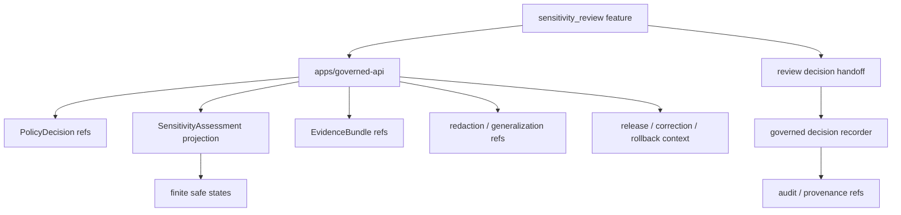

<!-- [KFM_META_BLOCK_V2]
doc_id: kfm://app/review-console/src/features/sensitivity-review/readme
title: Review Console Sensitivity Review Feature README
type: app-readme
version: v0.1
status: draft
owners: OWNER_TBD — Review steward · Sensitivity steward · Policy steward · Evidence steward · Audit steward · Docs steward
created: 2026-06-16
updated: 2026-06-16
policy_label: public
related:
  - ../README.md
  - ../../../README.md
  - ../../../../governed-api/README.md
  - ../../../../explorer-web/src/features/review_console_readonly/README.md
  - ../../../../../docs/architecture/ui/REVIEW_CONSOLE.md
  - ../../../../../docs/doctrine/sensitivity.md
  - ../../../../../docs/governance/REVIEW_DUTIES.md
  - ../../../../../policy/access/README.md
  - ../../../../../policy/decision/README.md
  - ../../../../../policy/redaction/README.md
  - ../../../../../schemas/contracts/v1/review/
  - ../../../../../schemas/contracts/v1/evidence/
  - ../../../../../schemas/contracts/v1/sensitivity_assessment.schema.json
  - ../../../../../contracts/
  - ../../../../../data/README.md
  - ../../../../../release/README.md
  - ../../../../../packages/evidence-resolver/README.md
  - ../../../../../packages/policy-runtime/README.md
tags: [kfm, apps, review-console, feature, sensitivity-review, sensitivity-assessment, redaction, geoprivacy, consent, rights, finite-states]
notes:
  - "Replaces the greenfield sensitivity_review feature stub with a bounded feature contract."
  - "This feature may support role-gated sensitivity review and redaction/generalization readiness inspection, but it must not author sensitivity doctrine, mutate source records locally, write policy rules, bypass deterministic transforms, or become a public sensitivity surface."
  - "Feature files, route wiring, schemas, tests, fixtures, governed API envelopes, sensitivity-assessment handoffs, deployment state, logs, dashboards, and CI pass state remain NEEDS VERIFICATION."
[/KFM_META_BLOCK_V2] -->

<a id="top"></a>

<div align="center">

# Review Console Sensitivity Review Feature

`apps/review-console/src/features/sensitivity_review/`

**App-local Review Console feature boundary for role-gated sensitivity review support: sensitivity rank inspection, rights and consent posture, redaction/generalization readiness, geoprivacy transform visibility, policy decision context, EvidenceRef/EvidenceBundle support, audit/provenance references, and finite denied/restricted/stale/error states.**


[Purpose](#1-purpose) · [Repo fit](#2-repo-fit) · [Boundary](#3-authority-boundary) · [Inputs](#5-inputs) · [Exclusions](#6-exclusions) · [Feature map](#7-sensitivity-review-feature-map) · [Definition of done](#14-definition-of-done)

</div>

---

> [!IMPORTANT]
> **Status:** draft / `NEEDS VERIFICATION`  
> **Owners:** `OWNER_TBD` — Review steward · Sensitivity steward · Policy steward · Evidence steward · Audit steward · Docs steward  
> **Path:** `apps/review-console/src/features/sensitivity_review/README.md`  
> **Responsibility root:** `apps/` — deployable application surfaces  
> **Truth posture:** CONFIRMED README path / CONFIRMED Review Console feature-source boundary / CONFIRMED sensitivity doctrine / PROPOSED sensitivity-review feature contract / UNKNOWN feature files, route wiring, schemas, tests, fixtures, runtime behavior, deployment state, and CI pass state

> [!CAUTION]
> Sensitivity Review is a role-gated review-support surface, not a policy authoring tool or release shortcut. It must not improvise redaction at the UI edge, edit source records, expose exact sensitive detail, mutate sensitivity assessments locally, or treat unresolved sensitivity/rights/consent as safe.

---

## 1. Purpose

`apps/review-console/src/features/sensitivity_review/` is the proposed app-local feature home for sensitivity review support inside Review Console.

It may eventually contain modules for:

- sensitivity rank and rationale inspection;
- rights, consent, embargo, revocation, and use-term posture display;
- redaction profile and generalization transform readiness views;
- geoprivacy, precision, temporal, and attribute exposure review;
- per-domain sensitivity default and exception visibility;
- EvidenceRef and EvidenceBundle support links;
- policy decision, restriction, and hold reason context;
- reviewer decision handoff for sensitivity escalation, defer, reject, or route outcomes;
- finite denied, restricted, unavailable, stale, malformed, and error states.

This README does not prove that any sensitivity-review feature file, route, adapter, schema, fixture, test, governed API envelope, sensitivity assessment handoff, deployment, log, dashboard, or CI pass state exists.

[Back to top](#top)

---

## 2. Repo fit

| Concern | Owning root | Expected relationship |
|---|---|---|
| Sensitivity Review feature source | `apps/review-console/src/features/sensitivity_review/` | App-local sensitivity review feature, if implemented |
| Review Console feature tree | `apps/review-console/src/features/` | Parent feature-source boundary |
| Review Console app | `apps/review-console/` | Role-gated review/steward deployable |
| Governed API | `apps/governed-api/` | Trust membrane and elevated audited API path |
| Explorer Web read-only review | `apps/explorer-web/src/features/review_console_readonly/` | Separate public/semi-public read-only visibility; no lifecycle mutation |
| Sensitivity doctrine | `docs/doctrine/sensitivity.md` | Canonical doctrine for sensitivity rubric, transforms, consent, and fail-closed posture |
| Policy gates | `policy/` | Access, sensitivity, rights, review, release, and decision policy |
| Evidence support | `packages/evidence-resolver/`, `data/proofs/` | EvidenceBundle support and proof context |
| Lifecycle artifacts | `data/` | Lifecycle state, receipts, proofs, registries, catalog, triplets, published outputs |
| Release authority | `release/` | Publication, correction, rollback, release manifest authority |
| Schemas/contracts | `schemas/contracts/v1/`, `contracts/` | Machine shape and object meaning |

## 3. Authority boundary

This feature may display governed sensitivity and redaction-readiness projections for authorized reviewers. It does not own sensitivity doctrine, policy rules, source records, canonical payloads, lifecycle state, sensitivity-assessment storage, redaction receipt storage, EvidenceBundle truth, review decision recording, release decisions, schemas, contracts, source ingestion, public UI behavior, audit/provenance storage, or runtime/model behavior.

```text
apps/review-console/src/features/sensitivity_review/ = app-local sensitivity review feature
apps/review-console/src/features/                    = feature source boundary
apps/review-console/                                 = role-gated review deployable
apps/governed-api/                                   = trust membrane and elevated audited API path
docs/doctrine/sensitivity.md                         = sensitivity doctrine
policy/                                              = access, sensitivity, and decision policy
data/                                                = lifecycle artifacts, receipts, proofs, registries
release/                                             = publication, correction, rollback authority
schemas/contracts/v1/                                = machine shape
contracts/                                           = object meaning
```

## 4. Default posture

Sensitivity Review feature modules should fail closed. The feature should not render sensitivity detail, transform readiness, or decision affordances when any of these are unresolved:

- reviewer identity, role, clearance, and separation-of-duty posture;
- governed API envelope and response validation;
- item-detail schema and lifecycle state;
- sensitivity rank, rationale, deciding role, and re-evaluation triggers;
- rights, consent, embargo, revocation, and source-use posture;
- redaction profile, generalization transform, k-anonymity, or aggregate protection requirement where material;
- EvidenceRef and EvidenceBundle support for sensitivity claims;
- policy decision, restriction, hold, release tier, and review-lineage context;
- release, correction, rollback, stale-state, or downstream invalidation context where material;
- safe handoff rules for record view, evidence, promotion, correction, rollback, audit, and decision features;
- safe error behavior and no raw/internal detail leakage.

## 5. Inputs

| Input family | Examples | Required posture |
|---|---|---|
| Sensitivity state | sensitivity rank, access class, release tier, rationale, deciding role | Governed projection only |
| Rights and consent | source rights, consent token state, revocation state, embargo state | Policy-runtime derived |
| Transform readiness | redaction profile, generalization transform, k-anonymity or aggregate constraint, receipt refs | Deterministic and receipt-aware |
| Item context | item id, object family, lifecycle state, domain lane, candidate/confirmed state | Role-gated projection |
| Evidence refs | EvidenceRef list, EvidenceBundle refs, support availability | Resolver-backed references where material |
| Policy refs | PolicyDecision ref, restriction reason, allowed actions, hold state | Policy-runtime derived |
| Release context | ReleaseManifest, CorrectionNotice, RollbackCard, stale-state refs | Required when material |
| Review decision state | escalate, defer, request evidence, route sensitivity review, reject | Finite, audited, policy-gated |
| UI state | loading, ready, denied, restricted, empty, stale, malformed, error | Explicit finite states |

## 6. Exclusions

| Does not belong here | Correct home |
|---|---|
| Sensitivity doctrine and rubric changes | `docs/doctrine/sensitivity.md` and ADR/doctrine review |
| Policy rules, redaction profiles, and access decisions | `policy/` |
| SensitivityAssessment schema or contract authorship | `schemas/contracts/v1/`, `contracts/` |
| Source payload editing | Out of scope; source/pipeline governance owns payload changes |
| Review decision recording | Review Console decision pane / governed decision recorder |
| Lifecycle data and canonical stores | `data/` |
| Redaction receipts, lifecycle receipts, proofs, registry, catalog, triplets, published outputs | `data/` |
| Release manifests, correction notices, rollback cards | `release/` |
| Source ingestion and transformations | `connectors/`, `pipelines/`, `pipeline_specs/` |
| Public read-only review visibility | `apps/explorer-web/src/features/review_console_readonly/` |
| Direct model/runtime calls | `runtime/` behind governed API only |
| Deployment-only values | Deployment environment/config channels |

## 7. Sensitivity Review feature map

Exact implementation files remain `NEEDS VERIFICATION`.

| Candidate feature module | Purpose | Required safeguard | Status |
|---|---|---|---|
| `rank_panel` | Sensitivity rank/access/release-tier display | Doctrine-aligned and policy-derived | PROPOSED |
| `rationale` | Rationale, deciding role, and re-evaluation triggers | Reference-only display | PROPOSED |
| `rights_consent` | Rights, consent, revocation, and embargo posture | Fail closed when unresolved | PROPOSED |
| `transform_readiness` | Redaction/generalization/aggregate protection status | Deterministic transform refs required | PROPOSED |
| `evidence_links` | EvidenceRef/EvidenceBundle support links | No raw bundle copy | PROPOSED |
| `policy_panel` | PolicyDecision and restriction-state view | No hidden clearance leak | PROPOSED |
| `decision_handoff` | Route sensitivity review decision to recorder/workflow | Policy and audit required | PROPOSED |
| `safe_states` | Denied/restricted/empty/stale/malformed/error states | No internal detail leakage | PROPOSED |
| `related_impacts` | Downstream release/correction/rollback impact hints | No unsupported impact claim | PROPOSED |

> [!WARNING]
> Candidate module names are not implementation proof. Do not claim a sensitivity-review module is live until files, routes, schemas, fixtures, tests, policy gates, transform refs, and provenance support confirm it.

## 8. Diagram



## 9. Feature obligations

| Obligation | Example effect |
|---|---|
| `review_support_only` | Feature supports sensitivity review; it does not author policy or doctrine |
| `no_edge_redaction` | Redaction/generalization is named, deterministic, and policy-driven, not improvised in UI |
| `role_gated_access` | Reviewer role and clearance gate every sensitivity view |
| `fail_closed_unresolved` | Unresolved sensitivity, rights, consent, revocation, or transform posture blocks action |
| `evidence_required` | Sensitivity claims link to EvidenceRef/EvidenceBundle refs where material |
| `policy_refs_required` | PolicyDecision refs and labels are shown where material |
| `transform_refs_required` | Redaction/generalization/aggregate-protection refs are visible where material |
| `auditability_required` | Decision handoff preserves reviewer, timestamp, reason, and provenance refs |
| `safe_error_only` | Errors reveal no protected data, raw payloads, internal paths, or validator internals |

## 10. Per-module contract

Each sensitivity-review child module should state:

- purpose and owner;
- accepted governed input shape;
- denied inputs and correct homes;
- policy/access dependency;
- EvidenceBundle dependency;
- sensitivity assessment and transform dependency;
- rights/consent/revocation dependency where material;
- audit/provenance dependency;
- read/write posture;
- tests and fixtures required;
- safe-disable or rollback path;
- open verification items.

## 11. Inspection path

Feature files, route wiring, schemas, tests, fixtures, policy integration, sensitivity-assessment handoffs, transform refs, audit/provenance handoffs, deployment state, logs, dashboards, and emitted artifacts remain `NEEDS VERIFICATION`.

```bash
find apps/review-console/src/features/sensitivity_review -maxdepth 6 -type f | sort
find apps/review-console apps/governed-api docs/doctrine policy schemas contracts data release packages tests fixtures -maxdepth 6 -type f 2>/dev/null | grep -Ei 'sensitivity|SensitivityAssessment|redaction|RedactionReceipt|generalization|consent|revocation|embargo|PolicyDecision|ReviewDecision|ReviewRecord|EvidenceRef|EvidenceBundle|ReleaseManifest|CorrectionNotice|RollbackCard|audit|provenance|prov|test|fixture' | sort
```

## 12. Validation expectations

Useful validation for this feature should cover:

- unauthorized users cannot view sensitivity details;
- unresolved sensitivity, rights, consent, embargo, revocation, policy, evidence, or transform posture fails closed;
- sensitivity review views cannot author policy, rewrite doctrine, mutate source payloads, or change lifecycle state locally;
- redaction/generalization readiness is shown as named transform refs and receipt status, not UI-improvised output;
- exact sensitive detail and hidden clearance details are not leaked through labels, badges, previews, counts, logs, errors, or cached state;
- sensitivity claims preserve EvidenceRef/EvidenceBundle refs, PolicyDecision refs, transform refs, release/correction/rollback refs, and audit/provenance refs;
- safe states reveal no raw payload, internal store path, protected detail, or validator internals.

## 13. Safe change pattern

For Sensitivity Review feature changes:

1. Add or update sensitivity-review feature inventory and module contract.
2. Link sensitivity-assessment, transform-readiness, rights/consent, and review DTOs to schemas/contracts before changing shapes.
3. Add fixtures for authorized view, unauthorized denial, missing sensitivity rank, missing evidence, unresolved rights, revoked consent, active embargo, missing transform, restricted detail, stale assessment, malformed assessment, safe error, and decision handoff cases.
4. Add no-edge-redaction, no-policy-authoring, role-gate, fail-closed-unresolved, evidence-support, transform-support, and safe-state tests before exposing sensitivity review.
5. Preserve EvidenceRef/EvidenceBundle refs, PolicyDecision refs, transform refs, review refs, release/correction/rollback refs, audit/provenance refs, reason codes, timestamps, and limitations through every view.
6. Update this README, parent feature README, Review Console app README, governed API docs, sensitivity doctrine links, policy docs, schemas/contracts, and tests when behavior materially changes.

## 14. Definition of done

- [ ] Owners are confirmed and `OWNER_TBD` is replaced.
- [ ] Sensitivity-review module inventory and ownership are documented.
- [ ] Sensitivity-assessment/transform/right-consent/review DTOs and schemas are verified.
- [ ] Authorization, policy runtime, evidence resolver, transform refs, sensitivity assessment source, audit/provenance source, and safe-state behavior are documented and tested.
- [ ] Sensitivity views cannot mutate source payloads, policy rules, doctrine, lifecycle state, or release records locally.
- [ ] Missing-sensitivity, unresolved-rights, revoked-consent, active-embargo, and missing-transform states are tested.
- [ ] Sensitive-domain and role-denial tests are present and passing.
- [ ] Safe-state tests are present and passing.
- [ ] Deployment, logs, dashboards, and runbooks are documented with current evidence.

## 15. Open verification items

| Item | Why it matters |
|---|---|
| Confirm feature files beyond README | Prevents overclaiming implementation maturity |
| Confirm sensitivity/review DTOs and schemas | Required before shape claims |
| Confirm route/API integration | Required before runtime behavior claims |
| Confirm authorization and separation-of-duty logic | Required before role-gated claims |
| Confirm policy-derived sensitivity and rights rules | Required before sensitivity claims |
| Confirm EvidenceBundle integration | Required before evidence-support claims |
| Confirm redaction/generalization transform and receipt integration | Required before transform-readiness claims |
| Confirm consent, revocation, and embargo handling | Required before rights/consent claims |
| Confirm audit/provenance source and write boundary | Required before durable decision claims |
| Confirm tests and fixtures | Required before runtime maturity claims |

<details>
<summary>Appendix A — no-loss preservation note</summary>

The previous README was a greenfield stub. This replacement adds a bounded sensitivity-review feature contract without claiming feature files, routes, schemas, tests, fixtures, policy enforcement, sensitivity-assessment integration, transform receipt support, deployment, logs, dashboards, or CI pass state are implemented.

</details>

## Status summary

`apps/review-console/src/features/sensitivity_review/` should contain Review Console sensitivity review modules only after feature inventory, route integration, sensitivity/review schemas, authorization, policy runtime integration, evidence resolver integration, sensitivity assessment source, transform receipt support, rights/consent/revocation handling, audit/provenance source boundary, tests, and operational evidence are verified.

It must preserve the sensitivity boundary: this feature may support sensitivity review and transform-readiness visibility, but it must not author doctrine or policy, improvise redaction at the UI edge, mutate source records, expose exact sensitive detail, replace release authority, or substitute for current passing evidence.

<p align="right"><a href="#top">Back to top</a></p>
