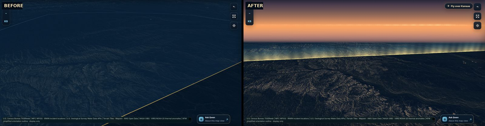
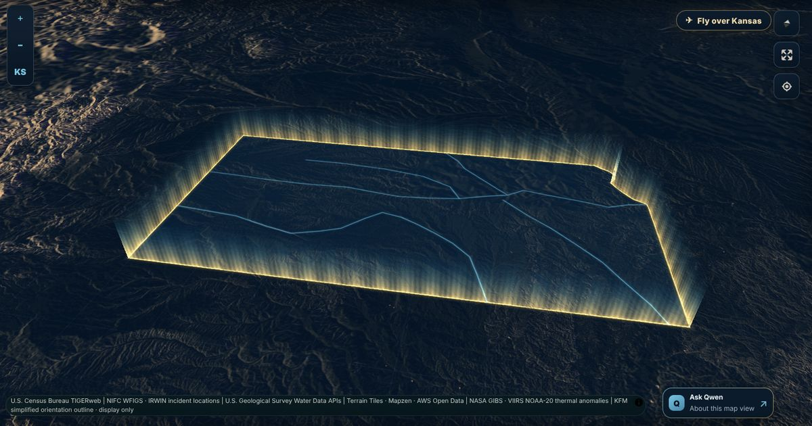
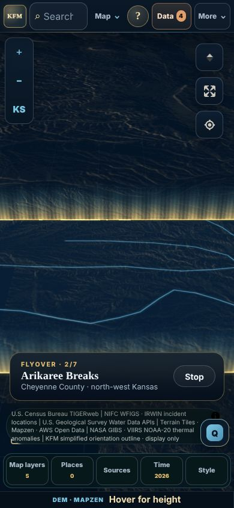
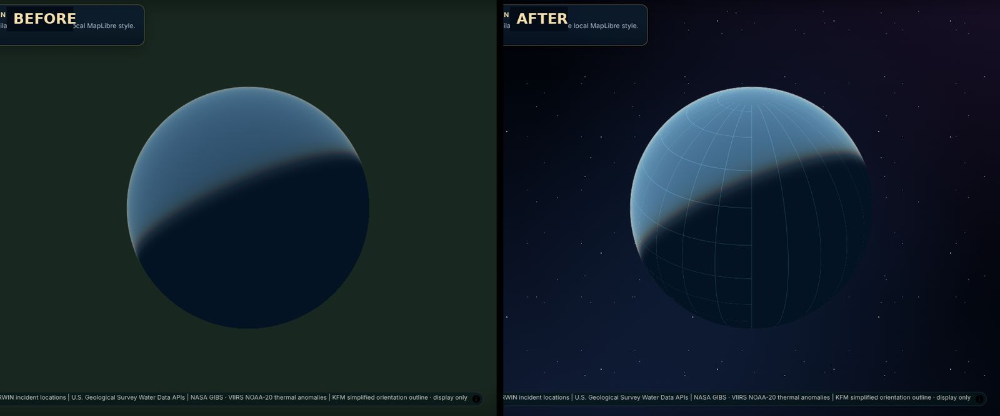
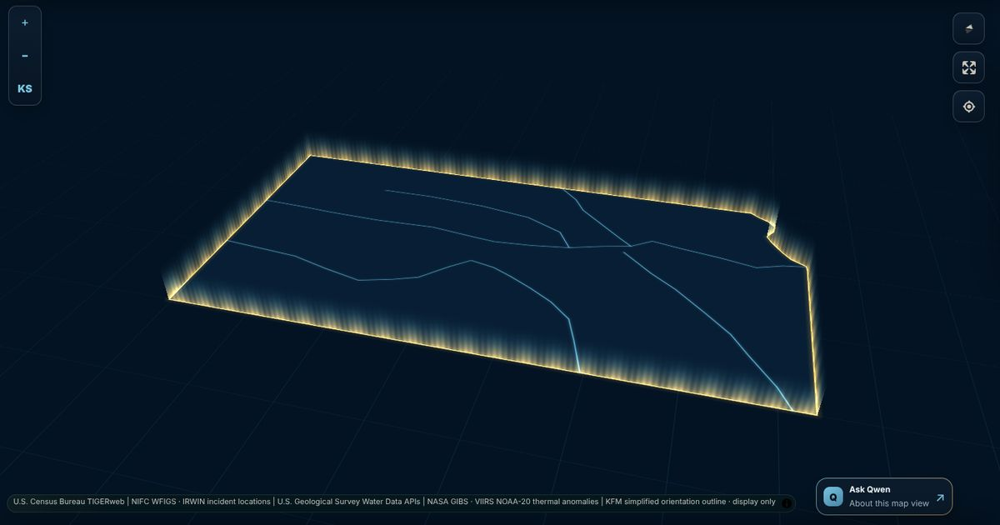
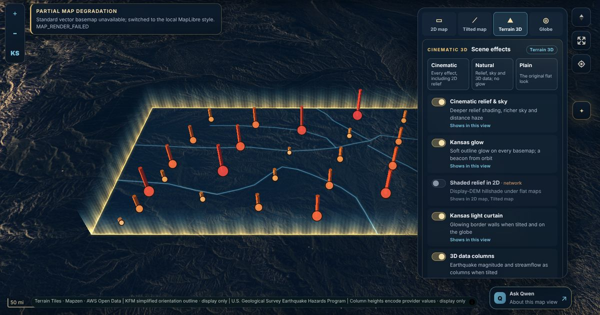
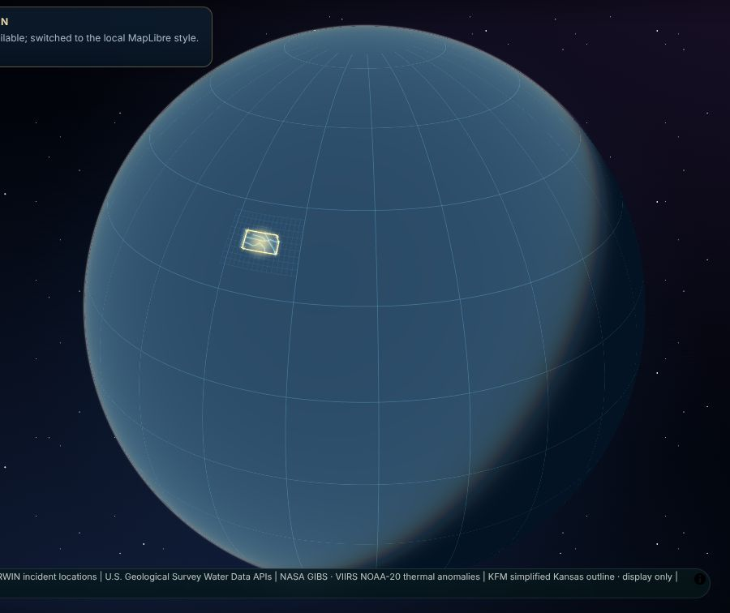
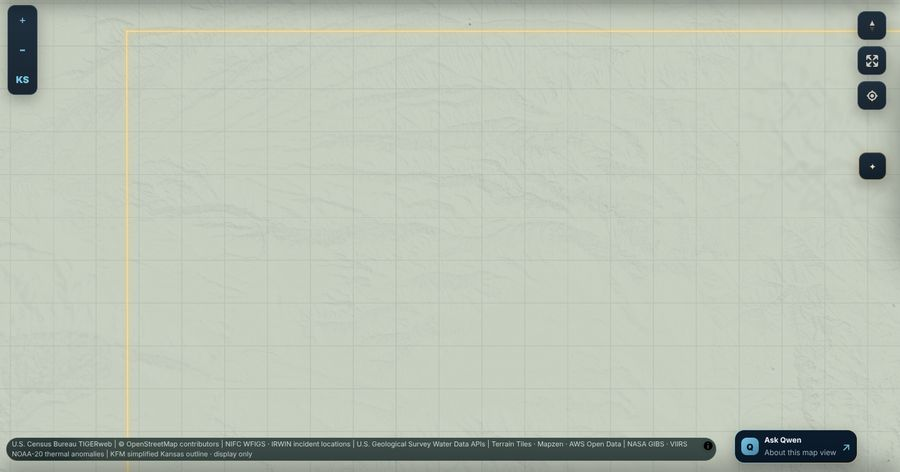
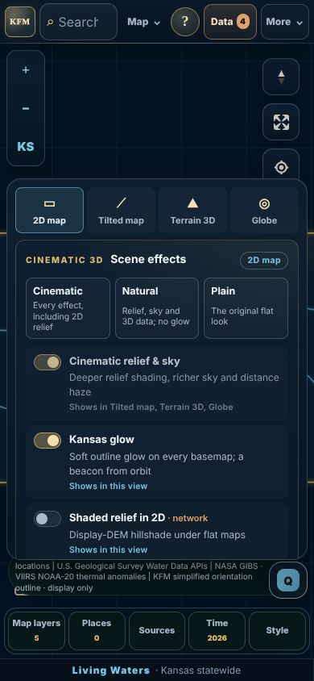
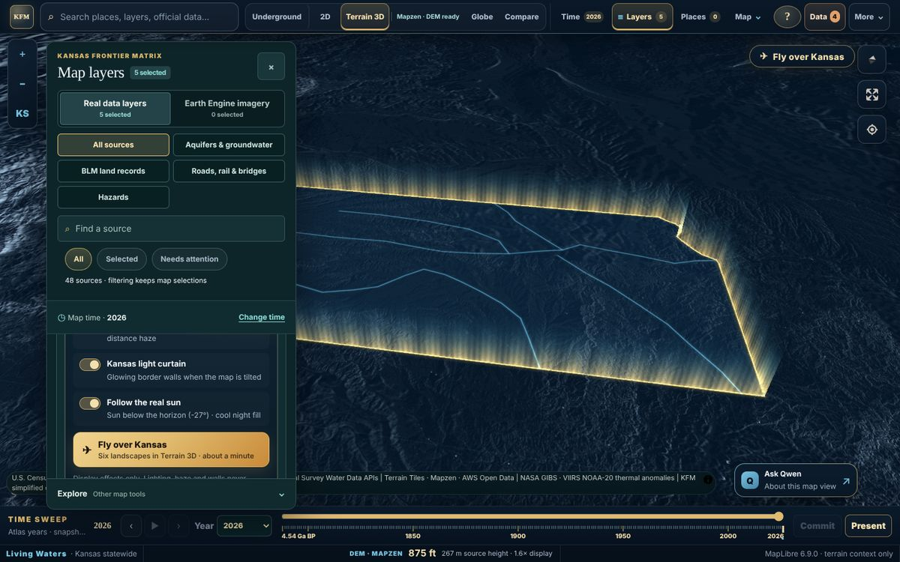

# Cinematic MapLibre scene effects — 2026-10-09

This repository change gives the Explorer's 3D views a finished, cinematic look using MapLibre GL JS 6.9 features the Site already ships: tuned relief shading, sky and distance haze, a custom WebGL layer, globe atmosphere and camera animation. Every effect is **presentation only** — no source, layer, evidence state, reported elevation, time, report or API changes — and each can be switched off. It is **repository source only**: it has not been saved or deployed as a Site version, and the existing `MIRROR_REVIEW_REQUIRED` hold is unchanged.

  

Same Red Hills area in Terrain 3D (Midnight basemap, dusk). The before view is limited to the old 60° tilt; Terrain 3D now allows 72°, which brings the sky into view.

## What changed

| Effect | What you see | How it works | Files |
|---|---|---|---|
| Relief lighting | Slopes and drainage networks read clearly from statewide to local zoom, with a warm key highlight and deep indigo shadow | Retuned the existing DEM hillshade (standard method, full exaggeration, per-light-preset palettes). The palette was picked by rendering the same DEM side by side: MapLibre's `multidirectional` method averages its lights and washed Kansas relief out, so it is not used. | `app/scene-effects.ts`, `app/terrain-relief-style.ts` |
| Sky and haze | Indigo→amber dusk, teal night horizon, blue day sky, and ground fog that adds depth | Richer `sky` presets (zenith, horizon, fog and blend values); the clear-day fog is softened so it does not grey dark basemaps | `app/scene-effects.ts`, `app/map-runtime.ts` |
| Wider tilt in Terrain 3D | Horizon and sky come into view | `maxPitch` is 72° in Terrain 3D (60° elsewhere, unchanged) | `app/page.tsx` |
| Kansas light curtain | A glowing wall of light along the state border in tilted views: bright gold foot, rays, fading to teal | A MapLibre **custom WebGL2 layer** with additive blending. The bundled outline is densified to ~2.5 km steps; wall feet follow the rendered terrain, and hills in front of the wall hide it through the depth test. Hidden in globe view, below 12° tilt, and in Battery saver. A slow shimmer repaints at ~15 fps only while the curtain is on screen, ambient motion is on, reduced motion is off and the tab is visible. | `app/aurora-curtain-layer.ts`, `app/scene-effects.ts` |
| Follow the real sun | Light direction and sky follow the sun over the map center; after sunset a cool fill light lights the scene from the opposite side, labelled as night fill | Uses the Site's existing NREL SPA solar position (`solarPositionAt`), refreshed each minute | `app/scene-effects.ts` |
| Fly over Kansas | A tour of six landscapes (Arikaree Breaks, Smoky Hill chalk country, Red Hills, Flint Hills, Kansas River valley) in Terrain 3D with a caption | `flyTo` then a slow bearing drift per stop. Dragging, scrolling, pressing a key, choosing another map mode or **Stop** hands the camera back at once. Not offered with reduced motion. Camera moves are not added to camera history. Stop centers are approximate viewpoints, not surveyed locations. | `app/scene-effects.ts`, `app/page.tsx` |
| Globe in space | A starfield and blue glow behind the globe instead of a flat olive fill; a faint 15° world graticule so the offline globe reads as a sphere | CSS backdrop behind the transparent globe canvas; globe `atmosphere-blend` eases out as the camera nears Kansas | `app/scene-effects.css`, `app/kansas-orientation.ts` |
| Selection emphasis | A soft glow under a selected line or area, a halo under a selected point, and a short two-ring ping | Three system layers on the existing selection source; the ping stops by itself so the map returns to idle, and is skipped with reduced motion or ambient motion off | `app/map-runtime.ts`, `app/map-layer-composition.ts` |
| Offline basemap glow | Soft glow under the Kansas outline and rivers in the Midnight/Prairie styles | Blurred under-strokes on the bundled orientation geometry | `app/kansas-orientation.ts` |
| Lens vignette | Gentle edge darkening in Terrain 3D only | CSS overlay, no pointer events; 2D evidence views are untouched | `app/scene-effects.css` |

  
  

  
  

## Round 2 — effects in every view and a Scene panel

The first round focused on Terrain 3D. This round carries the look into every MapLibre view and adds 3D treatment to the layers where it means something.

  

Earthquake features in these rendered checks are a synthetic test payload served only by the test harness, because the sandbox cannot reach USGS. The Site code path is the same one live data uses.

| Addition | Views | What it does | Files |
|---|---|---|---|
| **Scene panel** (✦ on the map, under the map controls) | All | View switcher (2D map · Tilted map · Terrain 3D · Globe); look presets **Cinematic**, **Natural** and **Plain**; every effect switch with a "Shows in this view" hint; flyover. The same controls stay in Layers → Terrain & 3D appearance and in the Scene Lab. On phones it opens as a bottom sheet. | `app/scene-effects-controls.tsx`, `app/scene-effects.css`, `app/page.tsx` |
| **Tilted map** | 2D | One click tilts the flat evidence map to 56° without terrain, so the curtain, columns and buildings read in 3D while the map stays the 2D evidence path | `app/page.tsx` |
| **Light curtain on the globe** | Globe | The custom WebGL layer gains a globe shader path built on MapLibre's own projection prelude (`projectTileWithElevation`), so the wall stands on the sphere and is clipped by the planet's limb. It is taller from orbit. | `app/aurora-curtain-layer.ts` |
| **Kansas glow and beacon** | All | Soft outline glow over every basemap (the offline styles keep their own), and a point of light marking Kansas from orbit that fades as you zoom in | `app/scene-overlays.ts` |
| **Shaded relief in 2D** | 2D, tilted | Optional display-DEM hillshade under flat maps, lit by the scene light. **Off by default** because it requests Mapzen DEM tiles. The Source connections ledger reports the DEM carrier as active while it is on, and switching it off removes the source so requests stop. | `app/scene-overlays.ts`, `app/page.tsx` |
| **3D data columns** | Tilted, Terrain 3D, globe | USGS earthquake magnitude and USGS streamflow (the existing `visualMagnitude`, log₁₀ of discharge) drawn as columns when the map is tilted. Each column uses the same colour as its point, sits under it, and follows that layer's visibility, time hold and data updates. Missing values and zero flow draw no column. | `app/scene-overlays.ts`, `app/map-performance.ts`, `app/page.tsx` |
| **Lit 3D buildings** | Tilted, Terrain 3D | The OpenFreeMap building layer is coloured by its own `render_height`, matched to day, dusk or night light. Heights are never changed; switching off restores the style's own paint exactly. | `app/scene-overlays.ts` |
| **Globe atmosphere** | Globe | Less washed out, so the surface and Kansas glow stay legible | `app/scene-effects.ts` |

  
  
  

The 2D relief frame uses a flat placeholder in place of OpenStreetMap tiles, which the sandbox cannot reach, to show relief and glow on a non-offline raster basemap.

**Defaults:** existing preferences keep their choices and gain the new effects at their defaults: glow, columns and buildings on; 2D relief off. Defaults add no new network requests. **Plain** switches every effect off and restores the original flat look.

**Underground is deliberately unchanged.** Its three.js cutaway uses material and aquifer colours as a legend; haze, tone mapping or coloured light would change what those colours say.

## Controls

- **Layers → Tune this view → Terrain & 3D appearance → Scene effects**, and the Scene Lab: *Cinematic relief & sky*, *Kansas light curtain*, *Follow the real sun*, *Fly over Kansas*.
- A **Fly over Kansas** button appears on the map whenever Terrain 3D is on (top-centre on phones).
- Defaults: cinematic relief and curtain on, sun-following off. Choices are a device-local preference (`kfm-scene-effects-v1`); blocked storage just keeps the defaults. Shared URLs and saved workspaces are unchanged.
- Battery saver pauses the curtain; reduced motion holds the shimmer still, skips the ping and disables the flyover.

 

## Boundaries

- The curtain stands on the bundled simplified outline. It is not a legal boundary, is not queryable, and does not appear in reports or exports.
- Lighting and haze change colour only. Hover elevations, profiles and locked report readings still divide out the display exaggeration and read the DEM unchanged.
- Following the sun changes the scene light only. It does not change the atlas time, the daylight layer or any provider's observation time.

## Validation

| Check | Result |
|---|---|
| Production build | PASS |
| TypeScript (`tsc --noEmit`) | PASS |
| Node test suite (`npm test`) | Round 2: 745 tests, 743 pass, 0 fail, 2 skipped (Qwen installer tests intentionally refuse root execution). Round 1: 737 / 735 / 0 / 2. |
| New `tests/scene-overlays.test.mjs` (round 2) | 6/6 pass: column values (missing/zero draw nothing), footprints and cap, columns follow point-layer visibility/tilt/Battery saver and remove their source when off, 2D relief placement and DEM removal, Kansas glow vs. offline styles, building paint restore with heights untouched |
| `tests/cinematic-scene-effects.test.mjs` | 14/14 pass (round 2 updates: new settings keys and migration, curtain on the globe, look presets, globe shader path). Round 1: preference parsing, sun-light mapping, manual vs. sun light, relief paint switching and change-only writes, curtain visibility rules, curtain failure isolation, densified ring, selection ping, flyover bounds, layer registration, stylesheet order |
| Updated harness stubs | `tests/area-underlay.test.mjs` runs the real `activateMapRepresentation` body in a sandbox and now also stubs `stopFlyover` (a mode change cancels a running flyover). `tests/snapshot-map-state.test.mjs` stubs the new `./scene-effects` import. No assertions were removed or relaxed. |
| ESLint on changed files | 0 errors; new files 0 warnings; `page.tsx` keeps its 25 existing warnings, none on changed lines |
| `tools/validators/maplibre/assess_acquisition_inventory.py` | Same result and finding counts as the base commit (pre-existing `FAIL`); no new renderer acquisition. New modules take MapLibre types only through `app/maplibre-seam.ts`. |
| Rendered checks (headless Chromium, SwiftShader WebGL, live Mapzen DEM) | Round 2: Scene panel on desktop and phone; panel view switcher 2D → Tilted → Globe → Terrain 3D; columns in tilted 2D and Terrain 3D; curtain on the globe; 2D relief and glow on a raster basemap; no page errors. Round 1: desktop 1440 × 900 and phone 390 × 844: 2D, tilted 2D, Terrain 3D at statewide and local zoom, globe, controls panel, sun-following toggle, flyover start/advance/stop by click. No page errors. Terrain views reach the runtime *ready* state and go idle when the shimmer is off. |

A curtain that cannot be created (for example a shader that fails to compile) is removed quietly; it never marks the map style or runtime as failed. Snapshot maps follow the same scene-effect preference.

During development, the curtain's first version re-sampled terrain under the whole border on every source update, which kept a high-zoom Terrain 3D view from settling. It now samples only near the view, and only when the camera settles or the terrain DEM loads. The rendered check above confirms the fix.

## Not covered

- Selection glow and ping were not seen rendered: the sandbox could not reach the provider feeds that supply selectable features, and the bundled local registry is empty. Their logic and layer wiring are unit-tested.
- The standard OpenFreeMap and imagery basemaps were unreachable from the sandbox, so effects were viewed over the offline Midnight style and a placeholder raster only. **Lit 3D buildings** therefore were not seen rendered; their paint and restore logic are unit-tested.
- Streamflow columns were not seen rendered (no streamflow feed in the sandbox); earthquake columns were, from a synthetic test payload.
- Real GPU performance on phones and low-end laptops, touch gestures during a flyover, screen readers and physical hardware.
- Saving, deploying or mirroring this source to the Site project.

## Rollback

Choose **Plain** in the Scene panel (or switch effects off) to restore the previous relief palette, sky, border, 2D map and building paint. To remove the change entirely, revert the commit. No stored data, database schema, API, URL or saved-workspace format is affected; the only new storage is the device-local `kfm-scene-effects-v1` preference, which is ignored once the code is reverted.
