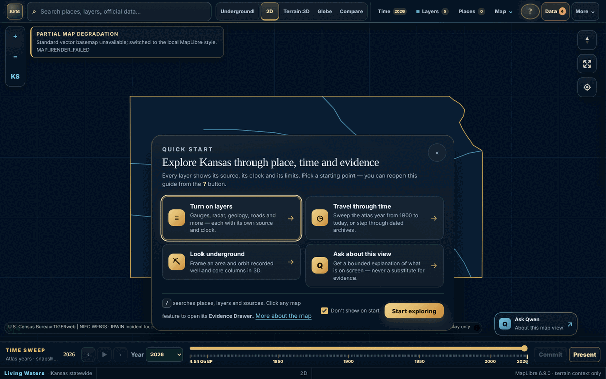
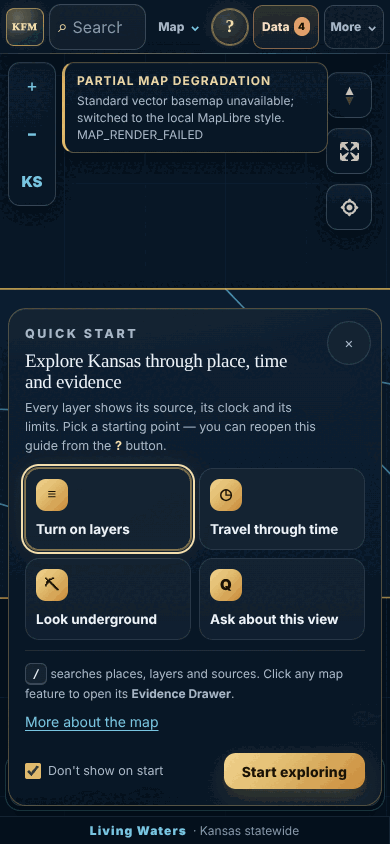

# Explorer interface refresh — 2026-10-08

This repository change refines the Explorer's look and first-use experience without removing a feature, changing a data path or altering an API. It is **repository source only**: it has not been saved or deployed as a Site version, so the hosted owner-private Explorer still runs its last deployed source until this change is reconciled and published through Sites. The existing mirror-review hold (`MIRROR_REVIEW_REQUIRED`) is unchanged.

  
  

Local run at `127.0.0.1:4173` in a sandbox without provider network access. That is why the standard basemap fell back to the local style and live layers show no features; the fallback now draws the orientation outline instead of an empty colour.

## What changed

| Area | Change | Files |
|---|---|---|
| Theme | “Frontier Night” presentation layer: navy surfaces, gold and water accents, glass panels, consistent 8/12/18 px radii, focus rings, 160 ms ease-out transitions. Re-tunes the existing tokens (`--bg`, `--panel`, `--gold`, `--water`…) and adds `--kfm-*` tokens. Loaded last; geometry tokens stay in `globals.css`. | `app/explorer-theme.css`, `app/layout.tsx` |
| First use | Quick-start guide on first visit with four routes into existing controls — layers, time, Underground, Qwen — plus `/` search and Evidence Drawer hints. A **?** button reopens it; “More about the map” opens the existing map guide, which previously had no way to open. Dismissal is a device-local flag; blocked storage only means the guide shows again. | `app/explorer-guide.tsx`, `app/page.tsx` |
| Offline map | The local *Midnight navy* and *Prairie dusk* basemaps (also the automatic fallback when the standard basemap is unreachable) draw a simplified Kansas outline, five major rivers and a 1° graticule from bundled geometry. Display only: no evidence, measurement or legal boundary. | `app/kansas-orientation.ts`, `app/map-runtime.ts` |
| Map controls | One zoom set: the left rail keeps zoom in/out and **KS** (fit Kansas); MapLibre keeps compass, fullscreen and location. The duplicate MapLibre zoom buttons and the rail's “N” button (same action as the compass) are removed. | `app/page.tsx` |
| Notices | A basemap fallback reads as information (gold accent) rather than an alarm. Its position, size and pointer behaviour are unchanged; in Underground it moves to the right so the panel title stays readable. | `app/explorer-theme.css` |
| Layout fixes | Removed a fixed “SMOKY HILLS · KANOPOLIS / ELLSWORTH” label that appeared over every map view. The closed mobile time sheet no longer peeks 20 px over the status bar. The attribution strip no longer runs under the Qwen launcher on wide screens. The mobile status bar no longer overlaps text. | `app/globals.css`, `app/explorer-theme.css` |
| Catalog filters | “All / Selected / Needs attention” filters match the dark panel; paper-style dossier cards are unchanged. | `app/research.module.css` |

## Front end and back end together

| Check | Result |
|---|---|
| Production build | PASS |
| TypeScript (`tsc --noEmit`) | PASS |
| Node test suite | 714 tests: 712 pass, 0 fail, 2 skipped (Qwen installer tests intentionally refuse root execution); includes the 5 new tests |
| New `tests/explorer-interface-refresh.test.mjs` | 5/5 pass |
| ESLint on changed files | 0 errors; the same 25 warnings as the unchanged base files |
| `../smoke-local.sh` | PASS — 57 checks across 47 routes; 9 provider-only routes listed |
| Front-end → back-end route map | Every one of the 51 `/api/…` paths requested by browser code resolves to an `app/api/**/route.ts` handler |
| Rendered checks (headless Chromium, SwiftShader WebGL) | Desktop 1440 × 900, tablet 1024 × 768, phone 390 × 844: guide, layers panel, Underground, time sheet, Qwen panel and More menu render without page errors |

On first load the only failing requests were expected in the sandbox: provider routes returned 502 (no outbound network), the owner-only Earth Engine catalog returned 401 when signed out, and the optional local Qwen companion on `127.0.0.1:8770` was not running.

## Not covered

- Hosted behaviour, real provider data, and device/touch/screen-reader acceptance on physical hardware.
- `npm run test:browser-geometry` (requires a CDP browser session pointed at the Explorer) was not run.
- Saving, deploying or mirroring this source to the Site project.

## Rollback

Remove `import "./explorer-theme.css"` from `app/layout.tsx` to restore the previous look. Revert the commit to restore the earlier map controls, empty local basemaps and the absence of the quick start. No stored data, database schema, API or saved-workspace format is affected.
