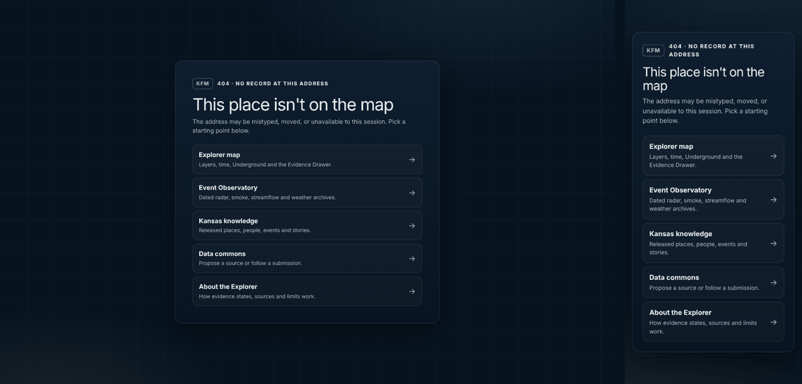

# Explorer site audit — 2026-10-09

This pass covers the Explorer's design, performance, usability, functionality and database. It follows the [interface refresh](explorer-interface-refresh.md) and fixes what the audit found, without removing a feature, changing an API response shape or touching stored rows. Like the refresh, it is **repository source only**: it has not been saved or deployed as a Site version, and the existing mirror-review hold (`MIRROR_REVIEW_REQUIRED`) is unchanged.

  

## What was audited and how

The hosted Explorer could not be reached from the audit environment: its network policy refuses the host, and the hosted Site is owner-only. The audit therefore ran the latest GitHub `main` (which already includes the refresh) through `../serve-local.sh` on `127.0.0.1:4173`.

| Lens | Method |
|---|---|
| Accessibility and usability | axe-core 4.10 on 13 routes. On the map it also ran with the quick start, Layers, Qwen, time sheet, More menu and representation menu open, at 1440 × 900 and 390 × 844. A 40-stop keyboard Tab trace checked the order and focus rings. |
| Performance | Chromium DevTools Protocol: navigation timing, paint timing, transfer by type, the largest scripts, and cache and compression headers |
| Database | Every SQL statement in the D1-backed servers and routes, checked against the migrations with `EXPLAIN QUERY PLAN` (SQLite 3.45). The new indexes and the row-value predicate were confirmed on the local D1. |
| Functionality | Full Node suite, local route smoke, the 404 path and owner-only routes when signed out |

## Findings and changes

| # | Area | Finding | Change | Files |
|---|---|---|---|---|
| 1 | Database | The steward review queue ran `ORDER BY created_at DESC, id DESC` with no matching index. That meant a full table **scan plus a temporary sort** on every page. Per-owner pages also sorted ties outside the index. | Two additive indexes: `(created_at, id)` and `(owner_key, created_at, id)`. Both list queries and the 24-hour quota count now read straight from an index, with no sort step. No row changes. | `drizzle/0004_submission_list_order.sql`, `drizzle/meta/_journal.json` |
| 2 | Database | The page cursor used `created_at < ? OR (created_at = ? AND id < ?)`. SQLite cannot turn that into an index range, so later pages re-walk earlier rows. | The same condition is now written as a row value, `(created_at, id) < (?, ?)`, which SQLite seeks directly. Results and the cursor format are unchanged. | `app/api/data-submissions/route.ts` |
| 3 | Functionality | Unknown paths and owner-only tools for signed-out visitors returned a bare text `Not Found`, with no language, title, heading or way back. | A branded 404 that still returns status 404. It links to five existing routes and does not say why a path is withheld. It honours reduced motion. | `app/not-found.tsx`, `app/explorer-theme.css` |
| 4 | Accessibility | `aria-label` on the role-less brand `div` (Explorer and About) — *serious*. | Removed; the visible name already reads “Kansas Frontier Matrix”. | `app/page.tsx`, `app/about/page.tsx` |
| 5 | Accessibility | The Qwen conversation scrolls, but keyboard users could not reach it — *serious*. The Qwen dialog sat on an `aside`, a role that element doesn't allow. | The conversation is a focusable, labelled `log`, and the dialog is now a `section`. | `app/page.tsx` |
| 6 | Accessibility | The time sheet's live “Committed frame” readout put `role="status"` on a `header`. | Moved to a `div` with the same styling. | `app/page.tsx`, `app/globals.css` |
| 7 | Accessibility | In-text links on Acquisition, Data commons, Library & downloads, Steward desk and Temporal sources were distinguishable only by colour, at 1.2–1.9 : 1 against the surrounding text — *serious*. A global `a { text-decoration: inherit }` reset removed their underline. | Links inside running text (`p`, `li`, `dd`, `td`) are underlined again. Navigation, brand and button-style links are unchanged. | the three `workspace.module.css` files, `app/globals.css` |
| 8 | Accessibility | Library & downloads summary: `<small>` notes sat directly in `<dl>` groups — *serious*. | The notes are now `<dd>` elements with the same look; the phone layout is preserved. | `app/downloads/workspace.tsx`, `app/downloads/workspace.module.css` |
| 9 | Accessibility | Temporal sources had no `main` landmark (45 content regions outside landmarks). | The page root is now `main`. | `app/observatory/sources/page.tsx` |
| 10 | Usability | MapLibre's compass, fullscreen, locate and attribution buttons kept the library's blue focus glow, which didn't match the rest of the Explorer. | A gold inset focus ring matching the other controls. | `app/explorer-theme.css` |
| 11 | Security hygiene | Page responses had no `X-Content-Type-Options`, `Referrer-Policy` or `Permissions-Policy`. API routes already set `nosniff`. | Baseline headers for page and route responses. Route-set values still win, and `geolocation=(self)` keeps the locate control working. No framing rule is set, because the hosting platform may preview the Site in a frame. | `next.config.ts` |

After the fixes, axe reports **0 violations** on the map (desktop, phone, and with Qwen open), About, Acquisition, Data commons, Steward desk, Kansas knowledge, Event Observatory, Temporal sources, Earth Engine and the new 404. Library & downloads has one *moderate* item left (see below).

## Looked at, deliberately left

| Item | Why it stays |
|---|---|
| Initial JavaScript is about 735 KB gzipped: MapLibre 281 KB and the map page 272 KB. Load finishes in about 0.5 s locally (DOMContentLoaded 405 ms, load 484 ms, first paint 1.0 s, 4,207 DOM nodes). | three.js (737 KB) and the HDF5 reader (5.7 MB) already load only when Underground needs them. Hashed assets are already gzip-compressed and cached as `immutable`. The remaining weight is the 738 KB single-file map page; splitting it is a larger refactor than this pass and should be its own reviewed change. |
| The page asks the local PC companion on `127.0.0.1:8770` once, then every 30 s at most. | This is the owner-requested basemap cache, on by default and switchable in its controls. A refused connection only means the companion isn't running. |
| `aside` nested in a landmark on Library & downloads (*moderate*) | A test fixes that element contract (`tests/public-map-browser.test.mjs`). |
| No `h1` while the time sheet replaces the left panel (*moderate*) | The panel's title is the page's `h1`. Adding a second, permanent one is a broader heading change. |

## Validation

| Check | Result |
|---|---|
| Production build | PASS |
| TypeScript (`tsc --noEmit`) | PASS |
| Node test suite | 725 tests: 723 pass, 0 fail, 2 skipped (the Qwen installer tests refuse to run as root) |
| New `tests/explorer-site-audit.test.mjs` | 5/5 pass. It applies every migration to an in-memory SQLite database, pages 75 rows with tied timestamps through the route's predicate, and checks for no gaps, no repeats and no sort step. |
| ESLint on changed files | 0 errors; the same 25 warnings as the unchanged base file |
| `../smoke-local.sh` | PASS — 57 checks across 47 routes; 9 provider-only routes listed |
| Local D1 (Miniflare) | `serve-local.sh` applied 0004; both indexes are present and the row-value predicate runs |

## Deploying the indexes

The indexes are optional: without them the route returns the same pages, only slower as the table grows. `0004` contains only `CREATE INDEX IF NOT EXISTS`, so `serve-local.sh` applies it automatically like 0001–0003. Applying it to the hosted D1 is the owner's decision at deployment time. It writes no rows and can be undone with `DROP INDEX idx_submissions_created_id; DROP INDEX idx_submissions_owner_created_id;`.

## Rollback

Revert the commit. Delete `app/not-found.tsx` to restore the plain-text 404 by itself, or remove `headers()` from `next.config.ts` to drop only the baseline headers. No stored data, API response or saved-workspace format is affected.
