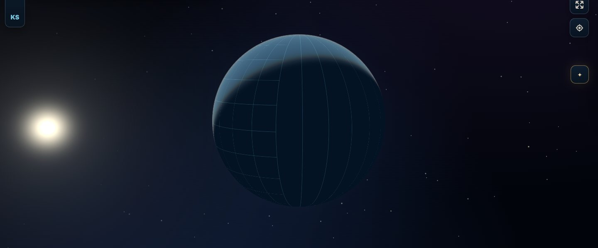
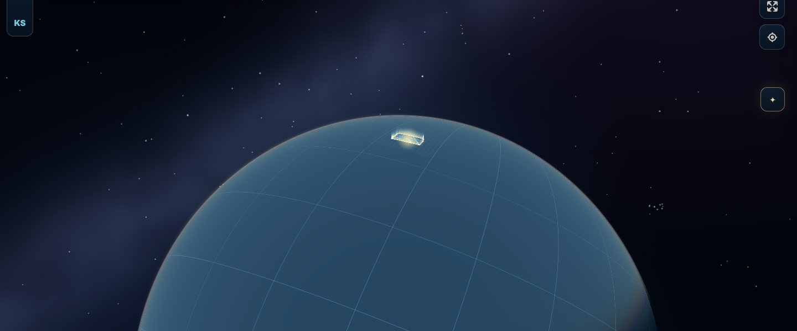
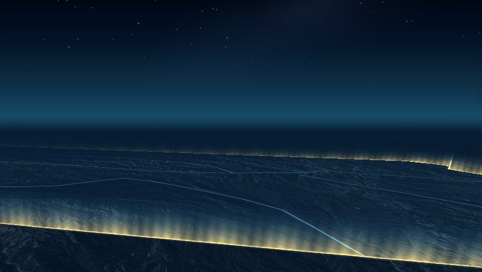

# Real night sky — 2026-10-09

A scene effect that draws the real sky beneath the map: the 2,851 brightest
stars (magnitude 5.5 and brighter) at their true positions for the current
time, a Milky Way glow along the galactic plane, and the Sun seen from orbit.
It is **presentation only**: nothing is queryable, reported, exported or stored,
and no map source, layer, evidence state, time or report value changes. Switch
it off with **Real night sky** in the Scene panel, or choose the **Plain** look.

<p align="center">
  
</p>

<sub>Orbital sunrise, computed for the moment of the render: the camera sits
12° from the anti-solar point, so the Sun appears just past the planet's limb.
The globe's lit crescent comes from the Site's own daylight shading and agrees
with the Sun's direction.</sub>

## What you see

| View | Sky |
|---|---|
| **Globe** | Stars and the Milky Way surround the planet, fixed to the celestial sphere and turning with the Earth, so the stars behind Kansas are the ones overhead there right now. The planet hides everything behind it. The Sun appears as a white disc with a corona and glare, and nearby stars dim in its glare. Stars do not twinkle: there is no air in space. The sky fades out as the globe flattens into the Mercator map at high zoom. |
| **Tilted map / Terrain 3D** | Under a night or dusk sky (the Light setting, or **Follow the real sun** after sunset), stars appear above the true horizon at their real altitude and azimuth over the map centre. Low stars redden, dim and twinkle more, as starlight crosses more air near the horizon. In clear daylight there are no stars. |
| **2D map** | None: a flat map has no sky. |

MapLibre paints its sky gradient where the ground plane ends, which is below
the true horizon. Real stars are never placed there. At the default 36° field
of view and Terrain 3D's 72° maximum tilt, the top of the frame is level with
the true horizon, so stars show only when a wider field of view brings real sky
into the frame (for example 60°, as in the image below).

<p align="center">
  
  
</p>

## How it works

One MapLibre custom WebGL2 layer (`scene-night-sky`) is placed beneath every
other layer, so the planet, terrain and tiles cover it wherever they draw. It
has two passes with additive blending:

1. **Sky pass** — one full-screen triangle. Each pixel's view ray is recovered
   from the inverse of MapLibre's projection matrix, turned into equatorial and
   then galactic coordinates, and shaded with the Milky Way and Sun. On the
   globe, a ray that meets the unit sphere is discarded.
2. **Star pass** — catalog stars as point sprites. Each star direction is
   projected as a point at infinity (`w = 0`) through the same matrix. Size and
   brightness follow magnitude; colour follows the B−V index (Ballesteros
   temperature, blackbody fit, desaturated toward white). The brightest stars
   get faint diffraction spikes.

| Quantity | Method |
|---|---|
| Sidereal time | IAU 1982 Greenwich mean sidereal time |
| Earth orientation | Equatorial → Earth-fixed rotation by sidereal time; MapLibre's globe axes (`sin λ cos φ, sin φ, cos λ cos φ`) |
| Local sky (flat maps) | Earth-fixed → east/north/up at the map centre; Mercator world pixels (y south) and metres for height |
| Sun | Astronomical Almanac low-precision formula (about 0.01°) |
| Galactic frame | Hipparcos equatorial → galactic rotation |

Precession since J2000 (about 0.36°), nutation, aberration and refraction are
ignored. The Milky Way glow, rift and star clouds are an **illustrative model**
along the true galactic plane, not survey imagery. The Sun's disc is drawn
larger than its real 0.27° radius so it reads at globe scale.

The catalog (`app/night-sky-catalog.json`, about 70 KB) loads as a separate
chunk the first time the sky is shown, so it adds nothing to first page load.
`scripts/build-night-sky-catalog.mjs` rebuilds it from the pinned source file
and refuses any input whose SHA-256 differs.

## Behaviour and performance

- **On by default** in the Cinematic and Natural looks, off in Plain. It makes
  no network request beyond the bundled catalog chunk.
- **Battery saver** hides the sky. A GPU, shader or context failure removes
  the layer quietly; it never marks the map or runtime as failed.
- Star **twinkle** repaints at about 15 fps only while the sky is visible on a
  tilted map, ambient motion is on, reduced motion is off and the tab is
  visible. Otherwise the stars hold still and the map goes idle.
- On flat maps the renderer skips any frame whose horizon is out of view,
  reading the live pitch and field of view.

## Data provenance and licence

Star positions, magnitudes and colour indices come from **XHIP: An Extended
Hipparcos Compilation** (Anderson & Francis 2012, VizieR V/137D), as packaged
in `data/stars.6.json` of the npm package `d3-celestial@0.7.35`
(SHA-256 `0297b8fa3adfbce1dc26566f61c4abcc1df4f29c6a28729ca06b56d1c6d25602`).
Only stars of magnitude 5.5 and brighter are kept; coordinates are rounded to
0.001° and magnitudes and B−V to 0.01. That file is redistributed under the
following licence:

```text
Copyright (c) 2015, Olaf Frohn
All rights reserved.

Redistribution and use in source and binary forms, with or without
modification, are permitted provided that the following conditions are met:

1. Redistributions of source code must retain the above copyright notice, this
   list of conditions and the following disclaimer.

2. Redistributions in binary form must reproduce the above copyright notice,
   this list of conditions and the following disclaimer in the documentation
   and/or other materials provided with the distribution.

3. Neither the name of the copyright holder nor the names of its contributors
   may be used to endorse or promote products derived from this software
   without specific prior written permission.

THIS SOFTWARE IS PROVIDED BY THE COPYRIGHT HOLDERS AND CONTRIBUTORS "AS IS"
AND ANY EXPRESS OR IMPLIED WARRANTIES, INCLUDING, BUT NOT LIMITED TO, THE
IMPLIED WARRANTIES OF MERCHANTABILITY AND FITNESS FOR A PARTICULAR PURPOSE ARE
DISCLAIMED. IN NO EVENT SHALL THE COPYRIGHT HOLDER OR CONTRIBUTORS BE LIABLE
FOR ANY DIRECT, INDIRECT, INCIDENTAL, SPECIAL, EXEMPLARY, OR CONSEQUENTIAL
DAMAGES (INCLUDING, BUT NOT LIMITED TO, PROCUREMENT OF SUBSTITUTE GOODS OR
SERVICES; LOSS OF USE, DATA, OR PROFITS; OR BUSINESS INTERRUPTION) HOWEVER
CAUSED AND ON ANY THEORY OF LIABILITY, WHETHER IN CONTRACT, STRICT LIABILITY,
OR TORT (INCLUDING NEGLIGENCE OR OTHERWISE) ARISING IN ANY WAY OUT OF THE USE
OF THIS SOFTWARE, EVEN IF ADVISED OF THE POSSIBILITY OF SUCH DAMAGE.
```

The catalog is a display asset. It is not a KFM source, is not admitted
evidence, and is not part of any release or report.

## Validation

| Check | Result |
|---|---|
| `tests/night-sky.test.mjs` | 14/14 pass. Sidereal time at J2000.0 and after one sidereal day; galactic pole at b = 90° and centre at l = 0°; Polaris at Kansas's latitude every 3 h; a meridian transit due south at the expected altitude; the Sun's declination at the June 2026 solstice and March 2026 equinox; each place's zenith landing where MapLibre draws that place on the globe; view-ray round trips; matrix inverse and camera position; star colour and size; visibility rules; catalog provenance, ordering and Sirius; star packing; layer shape. |
| `tests/scene-overlays.test.mjs` | 8/8 pass, adding: the sky sits beneath the basemap, shows from orbit by day, hides under a clear tilted sky, below the minimum pitch and in Battery saver, loads the catalog once and repaints when it arrives, is removed when off, and a failure to add it leaves the map untouched. |
| `tests/cinematic-scene-effects.test.mjs` | 15/15 pass with the new `stars` setting in defaults and migration. |
| Rendered checks (headless Chromium, SwiftShader WebGL, local Site) | Globe from orbit, tilted globe, orbital sunrise, Terrain 3D at night (36° and 60° fields of view) and at dusk. Stars render, none show through the planet, the Sun agrees with the daylight shading, and there are no page errors. |

## Not covered

- Real GPU performance on phones and low-end laptops (the sky pass is one
  full-screen fragment shader with three noise octaves).
- The standard basemaps were unreachable from the sandbox, so the sky was seen
  over the offline Midnight style only.
- Thin black horizontal lines across the dusk sky in Terrain 3D appear in the
  sandbox with the night sky switched **off** as well; they are not caused by
  this effect and were not investigated here.
