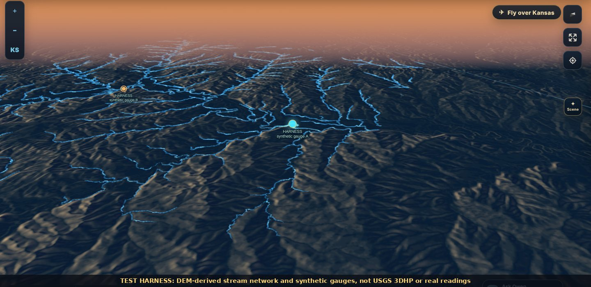
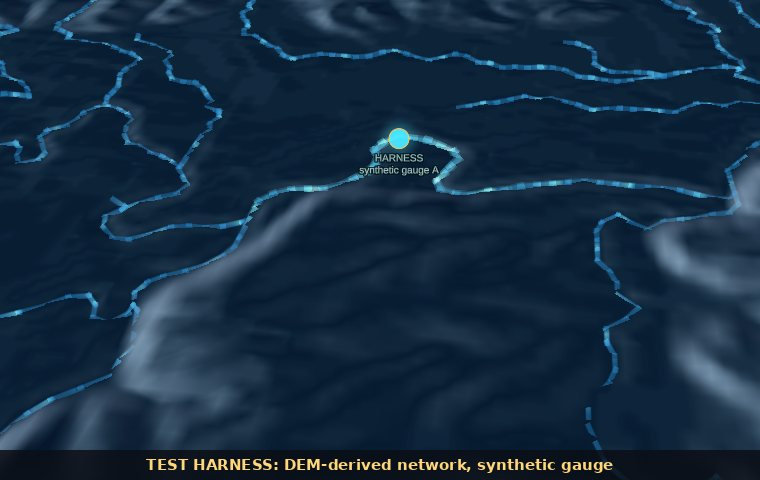
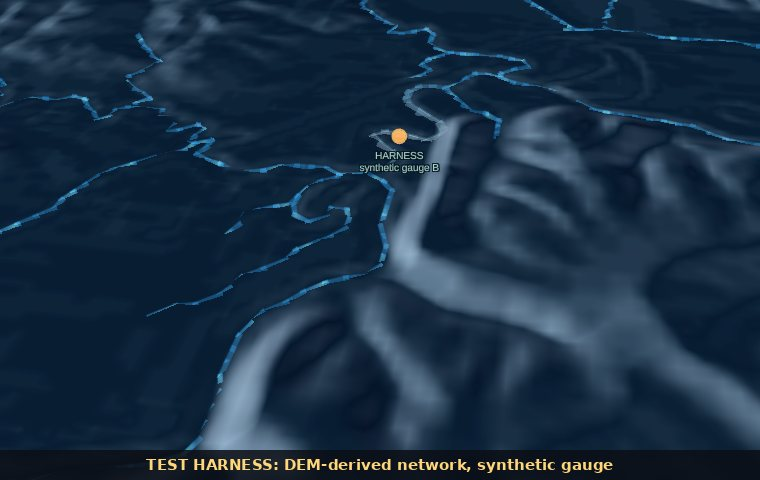

# Flowing water — 2026-10-10

A scene effect that animates rivers and streams in the direction the provider
says they flow, draped on the terrain in Terrain 3D and drawn flat on 2D,
tilted and globe maps. Where a USGS stream gauge has a current reading, the
reach it sits on is lit by that reading. It is **presentation only**: nothing
is queryable, reported, exported or stored, and no evidence state, time or
report value changes. Turn it on with **Flowing water** in the Scene panel, or
choose the **Cinematic** or **Natural** look; it draws at zoom 10 and closer.

  

**Test harness, not provider data.** The sandbox that built this change
cannot reach USGS 3DHP or the USGS Water Data API, so these renders use a
stream network derived from the Mapzen terrain DEM (D8 flow on a filled grid)
in place of 3DHP, and two synthetic gauges labelled HARNESS in place of USGS
readings. The renderer, shaders and data rules are the shipped code; only the
inputs differ. See [Validation](#validation).

## What moves, and why

| Rule | What the Site does |
|---|---|
| **Direction only where the provider gives it** | Flowlines come from USGS 3D Hydrography Program (3DHP) layer 50. Only reaches with the provider's explicit downstream flag (`flowdirection = 1`, flow follows digitized order) are fetched, and only streams and connectors (`featuretype` 1, 4, 5, 6). The Site never infers direction from elevation, names or shape. Reaches without the flag are not drawn. |
| **One display speed** | Every reach moves at the same on-screen rate (34 CSS px/s). Motion is a direction cue, not water velocity, and is never scaled by discharge. |
| **Measurements stay on the gauged reach** | A USGS streamflow gauge within 250 m of a mapped reach styles that reach only, fading out over 2.5 km either side of the gauge. Discharge is never painted onto ungauged reaches, upstream or downstream. |
| **What a reading changes** | A measured value widens the gauged stretch, adds a soft halo, brightens the streaks with the reading's relative magnitude and tints them by trend (rising: bright cyan; steady: sky blue; falling: deeper blue). A **measured zero** stills the water: the stretch turns slate grey with fixed bank highlights and no streaks. **Missing or stale** readings change nothing. |
| **Time follows the atlas** | Gauge styling reads the same streamflow frame as the gauge points, so it follows the time slider and playback. When the gauge layer is hidden, readings add nothing. |

  
  

Left: a measured, rising reading lights its own stretch. Right: a measured
zero stills its stretch (slate grey) while ungauged reaches keep their
direction-only motion. Both gauges and the network are test harness inputs.

## Sources

| Source | Used for | Notes |
|---|---|---|
| [USGS 3DHP](https://www.usgs.gov/3d-hydrography-program), `usgs_3dhp_all/MapServer/50` | Reach geometry and downstream flag | Fetched through the new `GET /api/hydrology/flowlines?cell=west,south` route, one fixed 0.25° Kansas grid cell at a time, at most 400 reaches per cell, simplified to about 20 m (vertex order, and so direction, is kept). Private cache 1 hour. |
| USGS Water Data API, continuous discharge (00060) | Gauge readings | Reuses the Site's existing `usgs-streamflow` official-context frame (value, relative magnitude, trend, reading state). No new request. |
| Mapzen terrain DEM (existing) | Draping | Reach vertices sample the loaded terrain so rivers sit in their valleys; hills in front hide them. |

NOAA NWPS forecasts and National Water Model streamflow are not used for
motion: they are forecasts or modelled values, and the governance rules keep
modelled discharge off ungauged reaches.

## How it works

- **Route.** `app/api/hydrology/flowlines/route.ts` accepts exactly one
  `cell` parameter on the 0.25° grid inside Kansas (anything else is a 400),
  queries 3DHP with `flowdirection=1 AND featuretype IN (1,4,5,6)`, bounds the
  response at 6 MB, rounds coordinates to 1e-5° and returns
  `kfm-3dhp-flowlines-v1` with `evidenceRole: EXTERNAL_CONTEXT_ONLY`, a
  `truncated` flag and the limitation text. Provider failure is a 503.
- **Cells.** At zoom 10+, the view requests up to 9 cells nearest the map
  centre (within ±0.4° longitude and ±0.3° latitude). Results are kept in a
  per-map cache of 36 cells; a failed cell waits 60 s before retrying. Cell
  completions and gauge updates share one geometry update on the next display
  frame. A ready cell can appear while the others are still loading. Cancelled
  responses cannot replace a newer request for the same cell. Switching off
  cancels queued geometry work; removing the map also aborts requests and
  detaches the synchronizer's listeners.
- **Geometry.** `app/water-flow-motion.ts` turns reaches into segments
  carrying distance along the reach (so streaks run continuously across
  vertices), gauge intensity, a moving/still flag, a trend tint and a random
  phase per reach.
- **Rendering.** `app/water-flow-layer.ts` is one MapLibre custom WebGL2
  layer (`scene-water-flow`) with depth testing against the terrain. Each
  segment is an instanced, screen-space ribbon shaded as a lit tube: bright
  crown, streaks with a bright head leading downstream, a finer ripple layer
  and a moving glint. Terrain heights are sampled up to 1,500 vertices per
  frame, nearest the camera first, and refreshed when the camera settles or
  the DEM loads; ribbons sit 4 m (× exaggeration) above the surface. Palettes
  follow the scene light: deep blue with white streaks by day, luminous cyan
  at dusk and night. The globe uses MapLibre's globe projection prelude.
- **Placement.** The layer sits above the basemap and below labels and data
  overlays, so gauges, labels and selections stay on top.
- **Animation.** Ambient motion runs at about 30 fps only while flowing water
  is visible and the runtime is ready. Battery saver hides the layer; reduced
  motion holds the water still (direction stays readable from the streak
  heads).
- **Status.** The Scene panel switch shows a live reading, for example
  "120 reaches with a USGS flow direction · 1 lit by a gauge reading", or
  "Zoom to 10 or closer", "No mapped flow direction in view" and
  "unavailable" when the provider cannot be reached.

## Boundaries and limits

- Motion shows mapped channel direction. It is not water velocity, wet
  channel extent, depth or flood level. A dry channel with a direction flag
  still animates unless a gauge on it reads zero.
- Ribbon width does not vary by stream size: the 3DHP fields this route reads
  carry no stream order or drainage area.
- Each cell returns at most 400 reaches, ordered by `hydrosequence`
  descending as in the existing `api/hydrology/direction` route. A truncated
  cell is reported as "some areas incomplete" in the reading.
- Canals, pipelines, lakes and reaches without a downstream flag are not
  drawn.
- A gauge more than 250 m from any mapped reach styles nothing.

## Validation

| Check | Result |
|---|---|
| Production build | PASS |
| TypeScript (`tsc --noEmit`) | PASS |
| Node test suite (`npm test`) | 939 tests: 937 pass, 0 fail, 2 skipped (existing Qwen installer tests that refuse root) |
| New `tests/water-flow-motion.test.mjs` | 9/9 pass: cell parsing and grid, cells for a view, strict payload parsing, gauge cues (missing, stale, zero, measured, trend), gauge snapping and falloff, geometry (continuous distance, dedupe, cue only on the gauged reach) |
| New `tests/water-flow-sync.test.mjs` | 4/4 pass: off makes no requests, zoom gate, placement below labels, gauge lighting, cache reuse, hidden gauge layer, failure state and retry wait, abort on switch-off, add failure isolated |
| Updated `tests/cinematic-scene-effects.test.mjs`, `tests/scene-studio.test.mjs` | New `waterFlow` key, looks, and the 33 ms motion tick |
| ESLint | 0 errors; new files 0 warnings |
| `smoke-local.sh` | New route listed; missing and off-grid cells return 400 |
| `make repository-topology` | PASS, 0 new drift |
| Rendered checks (headless Chromium, SwiftShader WebGL, live Mapzen DEM, harness inputs) | Terrain 3D at dusk and night: rivers drape in valleys and hide behind ridges; motion confirmed by frame differencing (about 78 % of river pixels change between frames 700 ms apart); measured gauge lights its stretch; zero gauge stills its stretch; no page or shader errors. |

**Harness disclosure.** The rendered checks used Playwright request
interception to serve, in place of the two providers the sandbox cannot reach:

- a 401-reach network derived from the Mapzen terrarium z12 DEM around the
  Cottonwood River (epsilon priority-flood fill, D8 flow, downstream vertex
  order); its main stem drains east, as the real river does;
- two synthetic gauges named "HARNESS synthetic gauge A/B" (a rising
  measured value and a measured zero).

Neither input ships with the Site. The flowline route itself was exercised
only through its 400 paths; its 3DHP response handling is covered by unit
tests over fixtures.

## Not covered

- Live USGS 3DHP and USGS gauge data were not seen rendered (blocked by the
  sandbox network policy).
- The standard light basemaps were unreachable, so renders use the offline
  Midnight style; the clear-sky palette was not seen rendered.
- Real GPU performance on phones and laptops.
- Saving, deploying or mirroring this source to the Site project.

### Frame-batching follow-up — 2026-10-10

The initial validation table above describes the original implementation, not
the subsequent Site delivery. A follow-up starts from Site v214 source
`11f1c546d56dcaec08454f99130350ce536328a2` and repository
`033f8466c28e7de32fcac95c441fa9f8cbeade2d`.

A deterministic synthetic Kansas view at zoom 11, centred at −97.2°, 38.1°,
delivers nine cells (1,800 reaches, 27,000 final segments) and gauge callbacks
before one display frame. Previously this rebuilt geometry nine times and
submitted 135,000 cumulative segments. It now builds once and submits 27,000:
80% less repeated geometry work. The test compares the entire final geometry,
including coordinates, downstream distance, gauge cues and terrain vertex
slots, against the unchanged geometry builder.

Five alternating Node trials on the same PC measured median completion work
of 62.97 ms before and 31.96 ms after. This is a synthetic scheduler/geometry
measurement, **not browser FPS, GPU time, provider latency or a general map-load
benchmark**. Timing is reported, not used as a flaky test threshold. The stable
acceptance checks are one update and byte-identical geometry.

The regressions also cover first-cell progressive display, truncated coverage,
failed cells, delayed responses after off/on, and removal with queued work.
The old code fails the burst, stale-success and teardown cases. Source requests,
cache limits, geometry simplification, gauge scope and motion speed are unchanged.
No new data is acquired or approved by these deterministic tests.

Executed follow-up checks: 26 focused tests and the full 990-test Site suite
passed with no failures or skips; TypeScript, the production build and focused
ESLint also passed. A separate browser smoke on the isolated local candidate
rendered Kansas hydrography around 38.48° N, 98.4° W. Its panel reported 2,311
directed reaches, one gauge cue and incomplete coverage, with no observed
console errors. Browser-control calls were sometimes slow during startup;
this is not a sustained responsiveness, mobile-device or hosted-browser pass.
Publication and repository review are recorded separately in delivery receipts.

## Rollback

Switch **Flowing water** off, or choose **Plain**. It is off by default, so
existing preferences are unchanged. To remove it entirely, revert the commit;
no stored data, schema, URL or saved-workspace format is affected.
