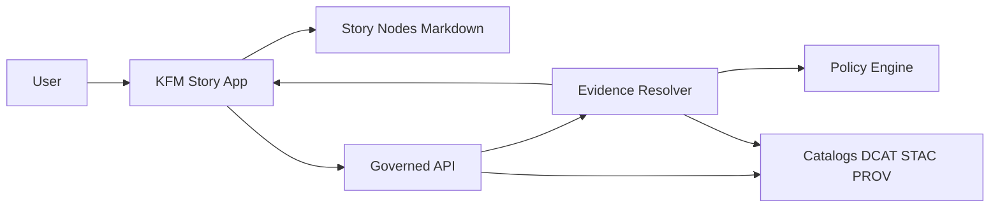

<!-- [KFM_META_BLOCK_V2]
doc_id: kfm://doc/bb2c8065-aaf5-4d69-abe7-527fcf5aabb4
title: apps/story — README
type: standard
version: v1
status: draft
owners: TBD
created: 2026-02-23
updated: 2026-02-23
policy_label: restricted
related:
  - ../../docs/MASTER_GUIDE_v13.md
  - ../../docs/reports/story_nodes/
  - ../../docs/templates/TEMPLATE__STORY_NODE_V3.md
  - ../../schemas/storynodes/
  - ../../docs/governance/ROOT_GOVERNANCE.md
tags: [kfm, story, ui]
notes:
  - This README is a scaffold; replace TODOs once repo conventions (tooling, scripts, CI) are confirmed.
  - Default-deny posture: treat policy label as restricted until reviewed.
[/KFM_META_BLOCK_V2] -->

# KFM Story App
Governed **Story Mode** UI for Kansas Frontier Matrix: render Story Nodes, replay map state, and make **evidence + provenance + policy** visible.

 <!-- TODO: replace with release channel -->

 <!-- TODO: confirm intended label -->
 <!-- TODO: wire to workflow badge -->


---

## Quick links
- [Purpose](#purpose)
- [Where this fits in the repo](#where-this-fits-in-the-repo)
- [Architecture](#architecture)
- [Story Nodes](#story-nodes)
- [Governance and safety](#governance-and-safety)
- [Local development](#local-development)
- [Testing and CI gates](#testing-and-ci-gates)
- [Directory tree](#directory-tree)
- [Troubleshooting](#troubleshooting)

---

## Purpose
This app provides the **Stories (Story Mode)** surface of KFM:

- Lists and opens **Story Nodes** (governed narrative artifacts).
- Renders Story markdown with **citation hooks** (every factual claim should be inspectable via evidence resolution).
- Replays **saved map state** so a story reopens the same reproducible view (camera, layers, time window, filters).
- Presents a shared **Evidence Drawer** so users can inspect *dataset version, license, policy, validation, provenance* for any claim.

> NOTE  
> KFM “trust surfaces” are not optional polish. This app should make governance visible, not hidden.

[Back to top](#kfm-story-app)

---

## Where this fits in the repo
This directory is intended to be a **UI-layer** application focused on Story Mode.

KFM’s documented canonical homes include:
- `docs/reports/story_nodes/` — governed narrative content (draft vs published)
- `schemas/storynodes/` — story node schemas
- `src/server/` — governed API boundary (contracts + redaction)
- `web/` — (existing) frontend app surface(s)

If your repo still uses a single `web/` app, treat `apps/story` as:
- a future extraction target **or**
- a workspace package consumed by the main frontend.

> TODO (repo-specific): Decide whether `apps/story` is the source of Story Mode, or whether Story Mode remains inside `web/`.

### Acceptable inputs
What belongs in `apps/story/`:
- UI code for Story Mode (routes/pages, components, styles).
- Story node rendering logic (markdown renderer + citation hooks).
- Evidence Drawer client + UI (consuming the governed evidence resolver).
- Tests (unit/integration) for story rendering, policy-safe error handling, and citation enforcement.
- Developer tooling for Story Mode (linting, typechecks, preview tooling).

### Exclusions
What must **not** go in `apps/story/`:
- **Story content** itself (belongs in `docs/reports/story_nodes/`).
- **Datasets** or raw/processed artifacts (belongs under `data/` zones).
- Secrets, API keys, or privileged credentials (frontend must not embed privileged creds).
- Large binary artifacts (tiles, parquet, scans) unless explicitly allowed and policy-reviewed.

[Back to top](#kfm-story-app)

---

## Architecture

### Trust-membrane overview
- The Story app is a **governed client**: it renders what the API returns.
- Evidence resolution is central: citations and feature evidence resolve via the **Evidence Resolver**.
- Policy is enforced server-side; the UI displays policy notices and obligations.



### Core components (expected)
- `StoryNodeList` — browse stories
- `StoryNodeReader` — render story markdown with citation hooks
- `EvidenceDrawer` — inspect resolved evidence bundles (shared across Map/Story/Focus)
- `PolicyNotice` — user-facing explanation when content is withheld or generalized

> WARNING  
> Do **not** fetch data directly from object storage or databases from the frontend. All access should go through governed APIs.

[Back to top](#kfm-story-app)

---

## Story Nodes

### Where Story Nodes live
Story Nodes are treated as publishable governed artifacts and stored under:

- `../../docs/reports/story_nodes/draft/`
- `../../docs/reports/story_nodes/published/<story_slug>/`
  - `story.md`
  - `assets/`

### Content standards (publishable Story Node)
A publishable Story Node should:
- declare scope (time window, geography)
- separate observation claims from interpretive claims
- include citations for every factual claim (EvidenceRefs)
- include uncertainty notes where sources conflict or are incomplete
- include licensing + attribution for embedded media
- include policy label and review state

### Review workflow (publish gate)
Expected workflow:
1. **Draft** → citations must resolve in-editor
2. **Review** → steward/editor checks claims, citations, sensitivity
3. **Governance review** → triggered for Indigenous histories, restricted sites, sensitive locations
4. **Publish** → immutable story version; edits create a new version

Publishing should be blocked if:
- citations do not resolve
- rights are unclear for included media
- sensitive locations are included without policy approval

> TIP  
> Implement “publish checks” as automated validations: the UI can call the evidence resolver during publish-time verification so broken citations cannot ship.

[Back to top](#kfm-story-app)

---

## Evidence and citations

### Evidence resolver contract (what the UI assumes)
Story Mode should treat citations as **EvidenceRefs** and resolve them via the governed evidence resolver, which:
- accepts an EvidenceRef (scheme-based) or structured reference
- applies policy and returns allow/deny + obligations
- returns an EvidenceBundle that can render as a human-friendly card

> TODO (repo-specific): Link the OpenAPI contract and the UI adapter module once confirmed.

### Policy-safe errors
When evidence cannot be resolved (or is unauthorized), the UI must:
- show a clear “withheld” notice
- avoid leaking restricted dataset existence via error behavior/timing
- avoid showing partial sensitive metadata

[Back to top](#kfm-story-app)

---

## Governance and safety

### Non-negotiable invariants
- **No privileged credentials** in the frontend bundle.
- **No direct DB/storage access** from the frontend.
- Policy and redaction are enforced at the governed API boundary.
- Story publishing fails closed when evidence/rights/policy requirements aren’t met.

### Sensitive locations
- Never publish precise locations for culturally sensitive sites.
- Prefer generalized representations with explicit policy notices.
- When permissions are unclear: fail closed and trigger governance review.

[Back to top](#kfm-story-app)

---

## Local development

> NOTE  
> Commands below are **templates**. Update them to match `apps/story/package.json` (scripts, package manager, workspace tooling).

### Prereqs
- Node.js: **TBD**
- Package manager: **npm / pnpm / yarn** (pick the repo standard)

### Run dev server
```bash
cd apps/story

# Choose ONE based on repo conventions:
npm install
npm run dev

# or
pnpm install
pnpm dev

# or
yarn
yarn dev
```

### Configuration
| Variable | Purpose | Example | Status |
|---|---|---|---|
| `KFM_API_BASE_URL` | Base URL for governed API | `http://localhost:3000` | TODO confirm |
| `KFM_EVIDENCE_RESOLVER_PATH` | Evidence resolver route | `/api/v1/evidence/resolve` | TODO confirm |
| `KFM_FOCUS_MODE_PATH` | Focus Mode Q&A route | `/api/v1/focus/ask` | TODO confirm |

[Back to top](#kfm-story-app)

---

## Testing and CI gates

### Minimum local checks (expected)
- `lint` (JS/TS lint)
- `typecheck` (TS)
- `test` (unit)
- `test:integration` (Story Node render + citation resolution mocks)

### Fail-closed gates (must hold)
- **Citation resolution gate:** publishing/build should fail if citations do not resolve.
- **Policy-safe error gate:** restricted evidence returns must not leak sensitive metadata.
- **XSS safety gate:** markdown is sanitized and rendered under CSP constraints.

> TODO (repo-specific): Link the CI workflow file(s) once known (e.g., `../../.github/workflows/...`).

[Back to top](#kfm-story-app)

---

## Directory tree

> NOTE  
> This is an *expected* layout. Replace with the real tree once `apps/story` exists in the repo.

```text
apps/story/
├── README.md
├── package.json                 # scripts + deps (TBD)
├── src/
│   ├── app/                      # routes/pages (TBD)
│   ├── components/               # StoryNodeList, StoryNodeReader, EvidenceDrawer
│   ├── lib/                      # api clients, evidence resolver adapter, markdown utils
│   ├── styles/                   # css/tailwind/etc (TBD)
│   └── index.tsx                 # entrypoint (TBD)
├── public/                       # static assets (TBD)
└── tests/                        # unit/integration tests (TBD)
```

To update this section:
```bash
# from repo root
tree apps/story -L 3
```

[Back to top](#kfm-story-app)

---

## Troubleshooting

### “Citations don’t resolve”
- Check the EvidenceRef syntax.
- Confirm the evidence resolver endpoint is reachable.
- Confirm your story is referencing a published dataset version / artifact digest (not floating URLs).

### “Story markdown renders strangely”
- Ensure markdown is sanitized and supports the required extensions (tables, footnotes, callouts if used).
- Verify that citation hooks are wired (click citation → resolve evidence → show drawer).

### “Policy notice appears unexpectedly”
- The resolver may be applying obligations (generalization, attribute stripping).
- Confirm the Story Node policy label + review state.

[Back to top](#kfm-story-app)

---

<details>
<summary>Appendix: Story publishing checklist (copy/paste)</summary>

- [ ] Story Node declares scope (time window + geography)
- [ ] Observation vs interpretation is clearly separated
- [ ] Every factual claim has an EvidenceRef
- [ ] All EvidenceRefs resolve via evidence resolver
- [ ] Media rights + attribution present and clear
- [ ] No sensitive locations without approval; generalized representations used where required
- [ ] Policy label + review state set
- [ ] Export output includes citations + audit reference (if supported)

</details>
