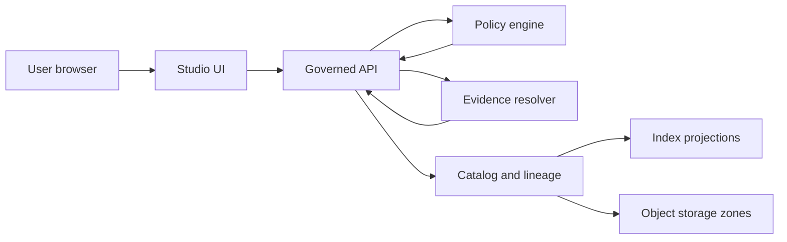
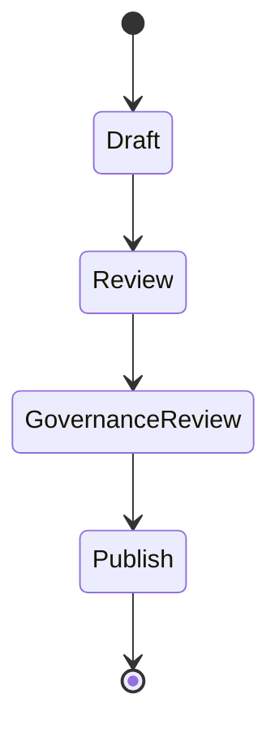

<!-- [KFM_META_BLOCK_V2]
doc_id: kfm://doc/64c734d6-9aaa-4065-9a27-37734bcacbef
title: apps/studio/README.md
type: standard
version: v1
status: draft
owners: TODO
created: 2026-02-23
updated: 2026-02-23
policy_label: restricted
related:
  - TODO
tags: [kfm, studio, ui, governance]
notes:
  - Directory documentation standard for the Studio app.
  - Default-deny: treat this app as restricted until repo governance says otherwise.
[/KFM_META_BLOCK_V2] -->

# KFM Studio
> Governed authoring and steward workspace for Story Nodes, evidence review, and promotion workflows.


**Status:** Draft  
**Owners:** TODO  
**Policy label:** restricted

> [!WARNING]
> Studio is a governed client. It must never connect directly to databases, object storage, or other infrastructure.
> All reads and writes MUST go through the governed API and policy boundary.

---

## Quick navigation
- [Overview](#overview)
- [What belongs in this directory](#what-belongs-in-this-directory)
- [Architecture](#architecture)
- [Evidence and citations](#evidence-and-citations)
- [Story Node lifecycle](#story-node-lifecycle)
- [Trust surfaces](#trust-surfaces)
- [Local development](#local-development)
- [Testing and CI gates](#testing-and-ci-gates)
- [Security and privacy](#security-and-privacy)
- [Directory layout](#directory-layout)
- [Definition of done](#definition-of-done)
- [Glossary](#glossary)

---

## Overview
Studio is the UI used to **draft, review, and publish Story Nodes** with hard enforcement of **resolvable citations**. It also hosts steward workflows such as review queues, QA inspection, and tightly-controlled policy label edits.

Key behaviors that Studio must uphold:
- **Citations resolve in-editor** before a Story Node can move forward.
- **Publishing is blocked** when citations do not resolve, rights are unclear, or sensitive locations are present without policy approval.
- **Evidence drawer is always available** from claims and map interactions so reviewers can inspect provenance, rights, and redactions.

([Back to top](#kfm-studio))

---

## What belongs in this directory
This directory is for **the Studio application only**.

### Acceptable inputs
- Studio UI routes, screens, and components for:
  - Story Node drafting and review queues
  - Evidence inspection and audit views
  - Steward tools such as promotion and QA review surfaces
- Governed API client code and typed contracts used by Studio
- Accessibility-first UI utilities (keyboard navigation, ARIA, focus management)
- UI-level enforcement hooks for citation resolution and publish gating
- Studio tests:
  - Unit tests for components
  - Contract tests for governed API clients
  - E2E tests for draft → review → publish flows

### Exclusions
- Raw/processed datasets or exported copies of restricted data
- Secrets, privileged credentials, or direct infrastructure connection strings
- Policy engine rule authoring (belongs at the central policy boundary in the repo)
- Server-side domain logic and persistence layers (Studio stays client-side and contract-driven)

([Back to top](#kfm-studio))

---

## Architecture
Studio is one of the governed UI surfaces. It talks to the **governed API**, which applies **policy**, resolves **EvidenceRefs** to **EvidenceBundles**, and exposes versioned Story Nodes.



### Contract-first boundary
Studio treats the governed API as the enforcement boundary:
- all responses must be policy-filtered server-side
- errors must be policy-safe
- evidence resolution must return allow-or-deny with obligations

([Back to top](#kfm-studio))

---

## Evidence and citations
KFM trust depends on **citations that resolve to stable, inspectable evidence** rather than “free-floating” links.

### EvidenceRefs
EvidenceRefs are designed to be:
- parseable without network calls
- resolvable through a dedicated evidence resolver service
- stable across rehosting and infrastructure changes

Recommended minimal scheme set:
- `dcat://...`
- `stac://...`
- `prov://...`
- `doc://...`
- `graph://...`

Example document EvidenceRef:
```text
doc://sha256:abcd...#page=12&span=1832:1935
```

### EvidenceBundles
An EvidenceBundle is what Studio shows in the evidence drawer. At minimum it should expose:
- bundle identity and digest
- dataset version identity
- policy decision and obligations
- provenance/run receipt linkage
- rights metadata
- artifact links only when policy allows

### Citation linting and verification
Studio should enforce citation checks in two places:
1. **In-editor checks** during authoring and pre-publish validation.
2. **CI hard gates** that prevent merging Story Nodes when citations fail to resolve.

([Back to top](#kfm-studio))

---

## Story Node lifecycle
Studio supports the publish gate workflow:



Workflow intent:
- **Draft:** contributor authors Story Node; citations must resolve in-editor.
- **Review:** steward and historian/editor validate claims, citations, and sensitivity.
- **Governance review:** triggered for Indigenous histories, restricted sites, or sensitive locations.
- **Publish:** Story Node becomes an immutable version; edits create a new version.

Publishing is blocked when:
- citations do not resolve
- rights are unclear for included media
- sensitive locations appear without policy approval

([Back to top](#kfm-studio))

---

## Trust surfaces
Trust surfaces are not optional polish; they are the user-visible governance contract.

### Required trust surfaces
| Trust surface | Where | Why it exists |
|---|---|---|
| Automation status badges | Layers and features | Make freshness and pipeline health visible |
| Evidence drawer | Every claim and map interaction | Make provenance and rights inspectable |
| Data version label | Every layer | Tie UI to DatasetVersion catalogs |
| Policy notices | At time of interaction | Explain generalization, redactions, denials |
| What changed panel | Dataset diffs | Show counts, checksums, QA metric changes |

### Evidence drawer minimum fields
The evidence drawer should show:
- Evidence bundle ID and digest
- DatasetVersion ID and dataset name
- License and rights holder with attribution text
- Freshness and validation status
- Provenance chain and run receipt link
- Artifact links only if policy allows
- Redactions applied as obligations

### Accessibility minimums
Studio must meet minimum accessibility requirements:
- keyboard navigable controls and evidence drawer with visible focus
- text labels for policy badges and status indicators
- ARIA labels for map controls
- safe markdown rendering for narrative content
- exports include citations and audit references

([Back to top](#kfm-studio))

---

## Local development
> [!NOTE]
> Repo-specific commands are intentionally left as TODO until the monorepo toolchain is confirmed.

### Prerequisites
- TODO: node/runtime version
- TODO: package manager and workspace tooling
- TODO: local auth strategy for restricted steward surfaces

### Common dev pattern
```bash
# from repo root
cd apps/studio

# TODO: choose the repo's package manager
# pnpm install
# npm ci
# yarn install

# TODO: start Studio
# pnpm dev
# npm run dev
```

### Environment variables
Define environment variables in the repo-standard way. Typical needs:
- `KFM_API_BASE_URL` — governed API base URL
- `KFM_AUTH_MODE` — local/dev auth mode
- `KFM_POLICY_LABEL` — default policy label for local sessions

([Back to top](#kfm-studio))

---

## Testing and CI gates
Studio changes should fail closed.

### Must-pass checks
- [ ] Lint and format
- [ ] Typecheck
- [ ] Unit tests for editor, drawer, and queues
- [ ] Accessibility checks for primary flows
- [ ] Governed API contract tests for:
  - evidence resolve behavior
  - policy-safe error responses
- [ ] Citation lint and verification for Story Nodes
- [ ] No direct infrastructure access from client code

### Citation and catalog validation expectations
At the system level, CI should validate:
- schema validation for DCAT, STAC, and PROV profiles
- cross-link integrity checks
- evidence resolver contract tests for public and restricted behaviors
- deterministic identity and stable hashes for versioned artifacts

([Back to top](#kfm-studio))

---

## Security and privacy
Studio must follow default-deny patterns in UI.

### Abstention and restriction UX
When evidence is restricted:
- explain denial in policy-safe terms
- suggest safe alternatives when possible
- provide an audit reference so stewards can review
- never leak restricted existence or “ghost metadata” unless policy allows

### Sensitive locations
For culturally sensitive or vulnerable sites:
- do not display precise geometry unless policy explicitly allows
- prefer generalized public derivatives by default
- route any uncertainty to governance review

([Back to top](#kfm-studio))

---

## Directory layout
> [!NOTE]
> This layout is a suggested baseline. Replace with an actual `tree` output once the directory exists.

```text
apps/studio/
  README.md
  src/                 # Studio app source (routes, screens, components)
  src/components/      # Evidence drawer, policy badges, map controls
  src/features/        # Story editor, review queues, promotion tools
  src/api/             # Governed API client and DTOs
  src/accessibility/   # a11y helpers and shared patterns
  src/tests/           # unit/contract test helpers
  e2e/                 # end-to-end tests for publishing workflows
```

([Back to top](#kfm-studio))

---

## Definition of done
A Studio feature is “done” when:
- [ ] It is reachable through a clear route and has basic docs
- [ ] It does not bypass the governed API
- [ ] It displays policy notices and evidence drawer access where appropriate
- [ ] It blocks publish when citations fail or rights/sensitivity gates fail
- [ ] It is keyboard-accessible and screen-reader friendly
- [ ] It has unit tests and at least one E2E coverage path for critical flows
- [ ] It produces or preserves audit references for reviewer replay

([Back to top](#kfm-studio))

---

## Glossary
<details>
<summary>Expand glossary</summary>

- **EvidenceRef**: A canonical reference that can be resolved to evidence without relying on fragile URLs.
- **EvidenceBundle**: The resolved, policy-filtered evidence package shown in the evidence drawer.
- **DatasetVersion**: A versioned dataset artifact set tied to catalogs, provenance, QA, and policy.
- **Story Node**: A governed narrative artifact that binds map state, claims, and citations.
- **Audit reference**: A stable identifier that lets reviewers replay how a claim/answer was produced.

</details>

([Back to top](#kfm-studio))
