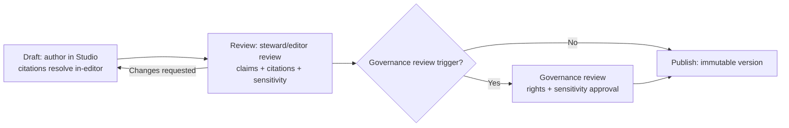
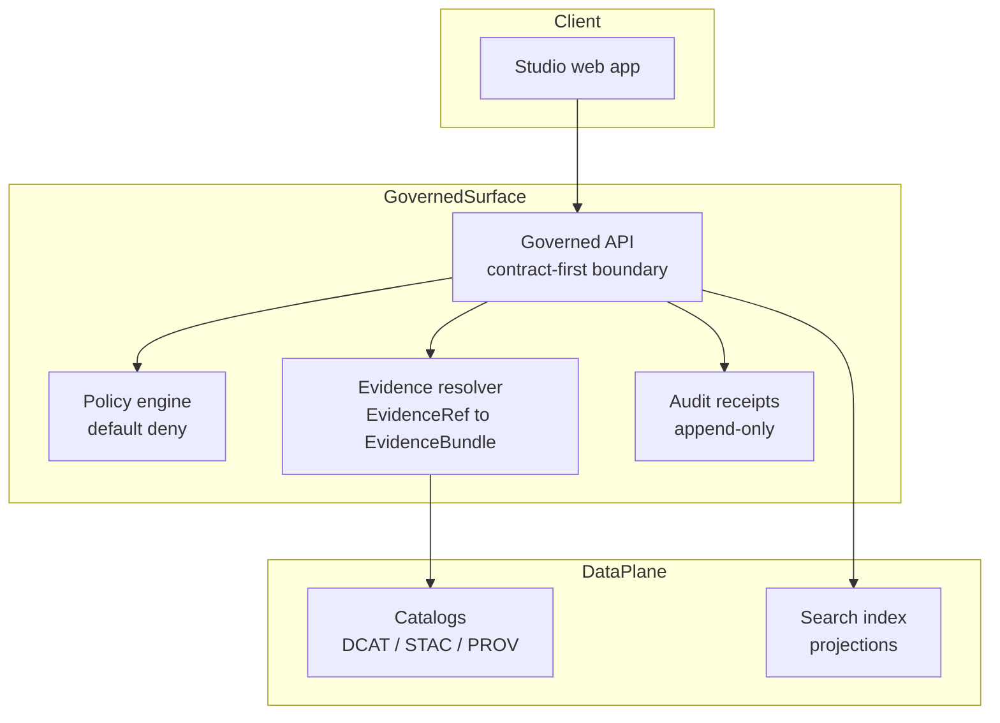

<!-- [KFM_META_BLOCK_V2]
doc_id: kfm://doc/8c0e1e3e-9d1f-4df5-9a78-2a4f2a3f2a87
title: KFM Studio
type: standard
version: v1
status: draft
owners: TBD
created: 2026-02-22
updated: 2026-02-23
policy_label: restricted
related:
  - apps/studio/
  - docs/story-nodes/
tags:
  - kfm
  - studio
  - governance
  - story-nodes
notes:
  - Scaffold doc for the governed authoring + review UI.
  - Aligned to KFM MetaBlock v2 + Story Node v3 templates in the vNext governance guide.
  - Keep TBD items fail-closed until repo reality is confirmed.
[/KFM_META_BLOCK_V2] -->

# KFM Studio

Governed authoring and review UI for **Story Nodes v3** — narrative artifacts that bind **map state** to **citations**, and can only be published when **citations resolve** through the governed Evidence Resolver.

**Status:** 🚧 Scaffold · Wiring in progress  
**Owners:** _TBD_ — add a `CODEOWNERS` entry for `apps/studio/`  
**Scope:** Story authoring + review workflow (draft → validate → review → publish)

**Badges (text-only):** `status=scaffold` · `governance=fail-closed` · `citations=must-resolve` · `accessibility=required`

**Jump to:**  
[Overview](#overview) •
[Directory boundaries](#directory-boundaries) •
[Non-negotiables](#non-negotiables) •
[Workflows](#workflows) •
[Story Node v3 contracts](#story-node-v3-contracts) •
[Trust surfaces and evidence drawer](#trust-surfaces-and-evidence-drawer) •
[Architecture](#architecture) •
[Local development](#local-development) •
[Testing and CI gates](#testing-and-ci-gates) •
[Governance and safety](#governance-and-safety) •
[Contributing](#contributing) •
[Troubleshooting](#troubleshooting) •
[Glossary](#glossary)

---

## Overview

KFM Studio is where contributors create and revise **Story Nodes** — governed publications that must remain evidence-led and policy-safe.

Studio exists to make **governance by construction** practical in daily authoring:

- Write stories as **structured, reviewable artifacts**
- Attach **EvidenceRefs** to every claim
- Resolve citations in-editor via the governed Evidence Resolver
- Move content through a **review workflow** with explicit governance triggers
- **Fail closed** at publish time if citations, rights, or policy checks cannot be satisfied

> **Note**  
> If you are looking for map browsing, layer toggles, or feature inspection, that is **Map Explorer**. Studio is for authoring and reviewing Story content.

---

## Directory boundaries

This README is intended to document the `apps/studio/` directory.

### Where it fits in the repo

Expected path (verify against repo reality):

```text
repo-root/
└─ apps/
   └─ studio/
      ├─ README.md
      ├─ src/
      ├─ public/
      ├─ tests/            # unit/e2e (if present)
      ├─ .env.example      # recommended
      └─ ...
```

### Acceptable inputs

Artifacts that belong in `apps/studio/`:

- Studio UI code (pages/routes, components, state, styling)
- Story Node authoring and review UX (draft, review queue, publish flow)
- Client-side Story Node v3 validators (schema + link checks) and fixtures for tests
- Policy-aware UI primitives: evidence drawer panels, denial/abstention UX, redaction/generalization UI
- Test suites that cover: keyboard navigation, publish gating, policy denial scenarios

### Exclusions

Artifacts that must **not** live in `apps/studio/`:

- Any direct database access logic or object-store reads (trust membrane violation)
- Pipeline code, dataset promotion mechanics, or catalog production (belongs server-side / pipeline modules)
- Raw/processed datasets or sensitive source material (use governed stores and references)
- Secrets or long-lived credentials (only `.env.example` with placeholders belongs here)

[Back to top](#kfm-studio)

---

## Non-negotiables

These are system invariants Studio must enforce, or make impossible to bypass:

1. **Publish is gated:** a Story Node cannot be published unless all citations resolve through the governed Evidence Resolver.
2. **Trust membrane:** Studio is a client. It must never talk directly to databases or storage. All reads and writes go through governed interfaces (API + policy boundary).
3. **Policy-aware rendering:** if the user lacks access (or content is restricted), Studio must show safe alternatives (deny/redact/generalize/abstain UX) rather than best-effort leakage.
4. **Auditability:** edits, review decisions, and publish actions must be attributable and reconstructable (who, what, when, why).

> **Warning**  
> Any “helpful fallback” that reveals restricted details (or “ghost metadata” about restricted artifacts) is a security + governance defect.

[Back to top](#kfm-studio)

---

## Workflows

The vNext governance guide proposes a four-step workflow with governance review triggers.

### Draft → review → publish



### Publish is blocked when

Publishing should be blocked if **any** of the following are true:

- citations do not resolve
- rights are unclear for included media
- sensitive locations are included without policy approval

[Back to top](#kfm-studio)

---

## Story Node v3 contracts

Story Nodes bind narrative to map state and citations using two on-disk artifacts:

- a **markdown file** (human-readable narrative + inline citations)
- a **sidecar JSON** file (machine metadata: map state, citations, policy, review)

### MetaBlock v2

Story Nodes (and this README) use **KFM MetaBlock v2** for structured metadata. Keep these invariants:

- `doc_id` is stable (do not regenerate on edits)
- `updated` changes on meaningful edits
- `policy_label` influences who can see the artifact if served through governed APIs

### Story Node markdown shape

A Story Node markdown file is expected to include:

- MetaBlock v2 with `doc_id` in the `kfm://story/<uuid>@<version>` form
- sections for `Summary`, `Claims`, `Narrative`, and `Evidence`
- inline citation markers that point to resolvable EvidenceRefs (e.g., `dcat://…`, `stac://…`, `prov://…`, `doc://…`)

### Story Node sidecar shape

The Story Node sidecar JSON is expected to capture:

- Story identity + versioning (`story_id`, `version_id`, `kfm_story_node_version`)
- governance state (`status`, `policy_label`, `review_state`)
- reproducible `map_state` (bbox/zoom/layers/time window)
- a `citations[]` array of EvidenceRefs (protocol-prefixed refs + kind)

### Publishing gate

Publishing must fail closed unless **all citations resolve** via the Evidence Resolver endpoint:

- `POST /api/v1/evidence/resolve`

[Back to top](#kfm-studio)

---

## Trust surfaces and evidence drawer

Trust surfaces are user-visible governance contracts — not optional polish. They should be present in Studio flows where evidence is attached, reviewed, or validated.

### Required trust surfaces

Recommended trust surfaces include:

- provenance / evidence drawer accessible from every story claim
- data version labels and policy badges
- explicit policy notices at the point of interaction (e.g., “geometry generalized due to policy”)
- “what changed?” diffs for story versions (where supported)

### Evidence drawer minimum contents

When Studio renders an EvidenceBundle, the evidence drawer should show at minimum:

- evidence bundle ID + digest
- dataset version ID + dataset name
- license + rights holder (including required attribution text)
- freshness (last run timestamp) and validation status
- provenance chain (run receipt link)
- artifact links **only** if policy allows
- redactions/generalizations applied (obligations)

### Abstention and restriction UX

Abstention is a feature. When evidence is not available, Studio should:

- show “why” in policy-safe terms (no restricted leakage)
- suggest safe alternatives (broader time range, public datasets)
- surface an `audit_ref` (so stewards can review)

[Back to top](#kfm-studio)

---

## Architecture

### Boundary diagram



### Governed API surfaces Studio should expect

The vNext guide calls out a buildable v1 endpoint set; Studio most directly depends on:

- `POST /api/v1/evidence/resolve` (citations → EvidenceBundles)
- `GET/PUT /api/v1/story/{id}` (draft CRUD + versioning)
- publish action that enforces `review_state` + resolvable citations

### What Studio must never do

- Direct object-store reads of restricted content
- Direct DB queries
- Helpful fallbacks that display restricted details when resolver or policy says deny
- Publishing that bypasses validation and citation resolution gates

[Back to top](#kfm-studio)

---

## Local development

> Tooling, scripts, and package manager are not assumed here. Update this section once `apps/studio/package.json` and lockfile choice are confirmed.

### Prerequisites

- Node.js runtime (version pinned by repo conventions — **TBD**)
- Repo-standard package manager (**TBD**: npm, pnpm, or yarn)
- A running **Governed API** (or mocked API mode for local development)

### Typical workflow checklist

1. Install dependencies (repo root)
2. Configure Studio to point at the governed API gateway
3. Start the dev server
4. Run validation and tests before opening a PR

### Environment configuration

Prefer an `apps/studio/.env.example` checked into the repo (if missing, add one). Common values Studio tends to need:

- `KFM_API_BASE_URL` — base URL for the governed API gateway
- `KFM_AUTH_*` — OIDC issuer and client settings (if auth is in place)
- `KFM_PUBLIC_BASE_URL` — used for preview links (if applicable)

[Back to top](#kfm-studio)

---

## Testing and CI gates

Studio changes should expect merge-blocking gates aligned with KFM governance.

### Minimum merge gates

PROPOSED minimum merge gates include:

- lint + typecheck (frontend + backend)
- schema validation for any changed catalog artifacts
- Story Node template validation
- policy tests must pass
- spec_hash tests must pass
- link checker must pass (no broken citations)
- security scanning (dependency vulnerabilities) and optional SBOM generation
- accessibility smoke checks for UI changes (at least keyboard navigation for the evidence drawer)

### What to test in Studio

- Draft save/restore, including MetaBlock v2 fields
- Story Node v3 validation: schema + link checks + citation resolution checks
- Evidence linking UX: add/remove citations and resolve to EvidenceBundles
- Publish is blocked when citations fail to resolve, with actionable errors
- Restricted content handling: deny/generalize/abstain flows are correct
- Keyboard navigation for authoring form and evidence drawer (a11y gate)

[Back to top](#kfm-studio)

---

## Governance and safety

### Sensitive locations and restricted material

Studio must assume some locations and datasets are sensitive. UI patterns should:

- avoid displaying exact coordinates for restricted or sensitive items
- prefer generalized geometry, aggregation, or withheld summaries
- require explicit governance review for exceptions

### Threat-model prompts

Use these prompts when reviewing Studio changes:

- Does the frontend ever fetch data directly from object storage or databases? (expected: **no**)
- Can a public user infer restricted dataset existence via error behavior? (expected: **no**)
- Are all downloads/exports checked against policy labels and rights? (expected: **yes**)

[Back to top](#kfm-studio)

---

## Contributing

- Keep changes PR-sized and reversible.
- Prefer additive glue artifacts such as schemas, validators, contract tests, UI components over intrusive rewrites.
- Do not introduce new publish paths without updating policy gates and tests.

### Definition of Done

- [ ] UI respects policy boundaries (no bypass paths)
- [ ] Story Nodes validate locally and in CI
- [ ] Citation resolution gate is enforced for publish
- [ ] Evidence drawer is policy-safe and keyboard accessible
- [ ] Tests cover at least one deny/generalize scenario
- [ ] New metadata fields are documented and schema-backed

[Back to top](#kfm-studio)

---

## Troubleshooting

### Publish is blocked because citations will not resolve

- Confirm the EvidenceRefs are valid and reachable
- Confirm the Evidence Resolver (`POST /api/v1/evidence/resolve`) is reachable
- Confirm your access level and policy label permit resolution

### I can view the story but cannot see sources

- Likely a policy denial or resolver error
- Studio should show a denial reason code and a next step (policy-safe)

### Accessibility gate failed

- Verify keyboard navigation for the authoring form and evidence drawer
- Ensure focus order is logical; check ARIA labeling on controls
- Confirm that policy badges and status indicators have text equivalents (no color-only meaning)

[Back to top](#kfm-studio)

---

## Glossary

- **Story Node v3:** Governed narrative artifact: markdown narrative + sidecar JSON (map state, citations, policy, review).
- **EvidenceRef:** Protocol-prefixed pointer to authoritative sources (DCAT/STAC/PROV/docs).
- **EvidenceBundle:** Resolver output that packages evidence plus provenance, license, and policy obligations (includes a digest).
- **policy_label:** Classification used to decide what can be shown and to whom.
- **Fail closed:** If validation, policy, or evidence checks fail, nothing publishes.
