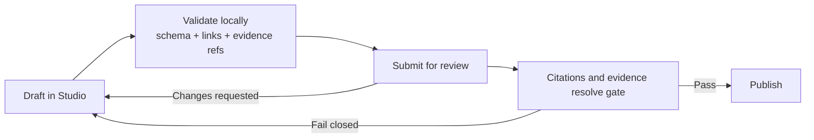
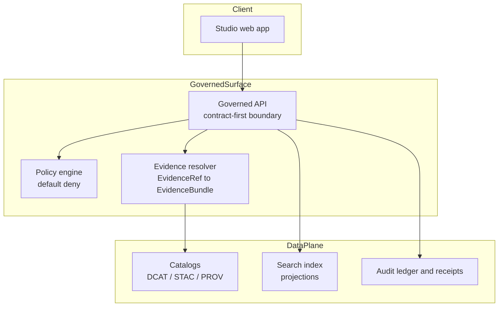

<!-- [KFM_META_BLOCK_V2]
doc_id: kfm://doc/8c0e1e3e-9d1f-4df5-9a78-2a4f2a3f2a87
title: KFM Studio
type: standard
version: v1
status: draft
owners: TBD
created: 2026-02-22
updated: 2026-02-22
policy_label: restricted
related:
  - apps/studio/
  - docs/story-nodes/
tags:
  - kfm
  - studio
  - governance
  - story-nodes
notes:
  - Scaffold doc for the governed authoring + review UI.
  - Keep TBD items fail-closed until repo reality is confirmed.
[/KFM_META_BLOCK_V2] -->

# KFM Studio

Governed authoring and review UI for **Story Nodes v3** — evidence-first narratives that can only be published when **citations resolve**.

**Status:** 🚧 Scaffold · Wiring in progress  
**Owners:** _TBD_ — add a `CODEOWNERS` entry for `apps/studio/`  
**Scope:** Story authoring and review workflow (draft → validate → review → publish)


**Jump to:**  
[Overview](#overview) •
[Non-negotiables](#non-negotiables) •
[Workflows](#workflows) •
[Story Node contracts](#story-node-contracts) •
[Architecture](#architecture) •
[Local development](#local-development) •
[Testing and CI gates](#testing-and-ci-gates) •
[Governance and safety](#governance-and-safety) •
[Contributing](#contributing) •
[Troubleshooting](#troubleshooting) •
[Glossary](#glossary)

---

## Overview

KFM Studio is where contributors create and revise **Story Nodes** — narrative artifacts intended to be published under KFM governance rules.

Studio exists to make **governance by construction** practical in daily authoring:

- Write stories as **structured, reviewable artifacts**
- Attach **evidence** to every claim
- Run the same **validation gates** locally that CI will enforce
- Move content through a **review workflow**
- **Fail closed** at publish time if citations or evidence cannot be resolved

> **Note**  
> If you are looking for map browsing, layer toggles, or feature inspection, that is **Map Explorer**. Studio is for making and reviewing Story content.

### Repo location

Expected app path:

```text
repo-root/
└─ apps/
   └─ studio/
      ├─ README.md                # this file (recommended)
      ├─ package.json             # tooling + scripts (TBD until confirmed)
      ├─ src/
      ├─ public/
      └─ ...
```

---

## Non-negotiables

These are system invariants Studio must enforce, or make impossible to bypass:

1. **Publish is gated:** a Story Node cannot be published unless its citations and evidence resolve.
2. **Trust membrane:** Studio is a client. It must never talk directly to databases or storage. All reads and writes go through governed interfaces (API + policy boundary).
3. **Policy-aware rendering:** if the user lacks access (or the content is restricted), Studio must show safe alternatives (redaction, generalization, abstention UX) rather than best-effort leakage.
4. **Auditability:** editing, review decisions, and publish actions must be attributable and reconstructable (who, what, when, why).

> **Warning**  
> Any “helpful fallback” that reveals restricted details is a security and governance defect.

[Back to top](#kfm-studio)

---

## Workflows

### Draft to publish workflow



### Roles and expectations

> This table is a default starting point. Adjust once the repo has a formal roles or RACI document.

| Role | Draft | Request review | Approve | Publish |
|---|---:|---:|---:|---:|
| Contributor | ✅ | ✅ | ❌ | ❌ |
| Steward or Reviewer | ✅ (edits) | ✅ | ✅ | ✅ or ❌ (policy-dependent) |
| Operator | ❌ | ❌ | ❌ | ✅ (release and promotion mechanics) |
| Council | ❌ | ❌ | ✅ (high-sensitivity decisions) | ✅ (exception pathways) |

[Back to top](#kfm-studio)

---

## Story Node contracts

Studio should treat Story Nodes as **schema-backed** content with required metadata and explicit evidence references.

### KFM MetaBlock v2

At minimum, Studio should be able to create, edit, and validate these metadata fields (exact on-disk format is repo-defined):

- `story_id`
- `title`, `summary`
- `authors`
- `created_at`, `updated_at`
- `time_coverage`, `geography_coverage`
- `dataset_refs`, `evidence_refs`
- `policy_label`
- `review_status`
- `revision_history`

### Evidence model expectations

Studio UX should make it hard to hand-wave evidence:

- Every claim (or claim group) links to at least one **EvidenceRef**
- Studio offers resolve now and shows the resolved **EvidenceBundle** (when accessible)
- Broken links or missing evidence are **blocking errors** for publish

#### Minimum contract surfaces

Studio should rely on contract-first, governed services, including:

- **Story service:** CRUD drafts, revisions, review status, and publish action
- **Evidence resolver:** `EvidenceRef → EvidenceBundle` (policy-aware)
- **Policy service:** decision + reason codes (deny, redact, generalize, allow)
- **Audit service:** append-only receipts for authoring, review, publish

> If a service is unavailable, Studio must degrade safely: show actionable errors and block publish.

[Back to top](#kfm-studio)

---

## Architecture

### Boundary diagram



### What Studio must never do

- Direct S3 or object-store reads of restricted content
- Direct DB queries (Neo4j, Postgres, and similar)
- Helpful fallbacks that display restricted details when resolver or policy says deny
- Publishing that bypasses validation and citation resolution gates

[Back to top](#kfm-studio)

---

## Local development

> Tooling, scripts, and package manager are not assumed here. Update this section once `apps/studio/package.json` and lockfile choice are confirmed.

### Prerequisites

- Node.js runtime (version pinned by repo conventions — **TBD**)
- Repo-standard package manager (**TBD**: npm, pnpm, or yarn)
- A running **Governed API** (or a mocked API mode for local development)

### Typical workflow checklist

1. Install dependencies (repo root)
2. Configure Studio to point at the Governed API
3. Start the dev server
4. Run validation and tests before opening a PR

### Environment configuration

Prefer an `apps/studio/.env.example` checked into the repo (if missing, add one). Common values Studio tends to need:

- `KFM_API_BASE_URL` — base URL for the governed API gateway
- `KFM_AUTH_*` — OIDC issuer and client settings (if auth is in place)
- `KFM_PUBLIC_BASE_URL` — used for preview links (if applicable)

[Back to top](#kfm-studio)

---

## Testing and CI gates

Studio changes should expect merge-blocking gates aligned with KFM governance:

- ✅ lint and typecheck
- ✅ Story Node template and schema validation
- ✅ policy tests where Studio touches policy-aware UI
- ✅ link checking (no broken citations or evidence refs)
- ✅ security scanning (dependencies)
- ✅ accessibility smoke checks (keyboard navigation + core flows)

### What to test

- Draft save and restore, including MetaBlock fields
- Evidence linking UX: add, remove, resolve EvidenceRefs
- Publish blocked when citations do not resolve, with clear and actionable UX
- Restricted content handling: deny, generalize, abstain flows are correct
- Review transitions: draft → in review → approved → published are auditable

[Back to top](#kfm-studio)

---

## Governance and safety

### Sensitive locations and restricted material

Studio must assume some locations and datasets are sensitive. UI patterns should:

- Avoid displaying exact coordinates for restricted or sensitive items
- Prefer generalized geometry, aggregation, or withheld summaries
- Require explicit governance review for exceptions

### Trust surfaces

Studio should make trust legible:

- Show why I can or cannot show this for restricted items
- Show license and provenance pointers where available
- Surface validation failures as actionable items, not hidden logs

[Back to top](#kfm-studio)

---

## Contributing

- Keep changes PR-sized and reversible.
- Prefer additive glue artifacts such as schemas, validators, contract tests, UI components over intrusive rewrites.
- Do not introduce new publish paths without updating policy gates and tests.

### Definition of Done

- [ ] UI respects policy boundaries (no bypass paths)
- [ ] Story Nodes validate locally and in CI
- [ ] Citation resolution gate is enforced for publish
- [ ] Accessibility smoke checks pass for authoring and review flows
- [ ] Tests cover at least one deny or generalize restricted scenario
- [ ] Any new metadata fields are documented and schema-backed

[Back to top](#kfm-studio)

---

## Troubleshooting

### Publish is blocked because citations will not resolve

- Confirm the EvidenceRefs are valid and reachable
- Confirm the Governed API evidence resolver is running and reachable
- Confirm your access level and policy label permits resolution

### I can view the story but cannot see sources

- Likely a policy denial or resolver error
- Studio should show a denial reason code and a next step

### Accessibility gate failed

- Verify keyboard navigation for the authoring form and evidence panels
- Ensure focus order is logical; check ARIA labeling on controls

[Back to top](#kfm-studio)

---

## Glossary

- **Story Node v3:** Governed narrative artifact with metadata, claims, and evidence references.
- **EvidenceRef:** Pointer to an authoritative source such as a dataset version, document, or archive item.
- **EvidenceBundle:** Resolver output that packages evidence plus provenance, license, and policy context.
- **policy_label:** Classification used to decide what can be shown and to whom.
- **Fail closed:** If validation, policy, or evidence checks fail, nothing publishes.
