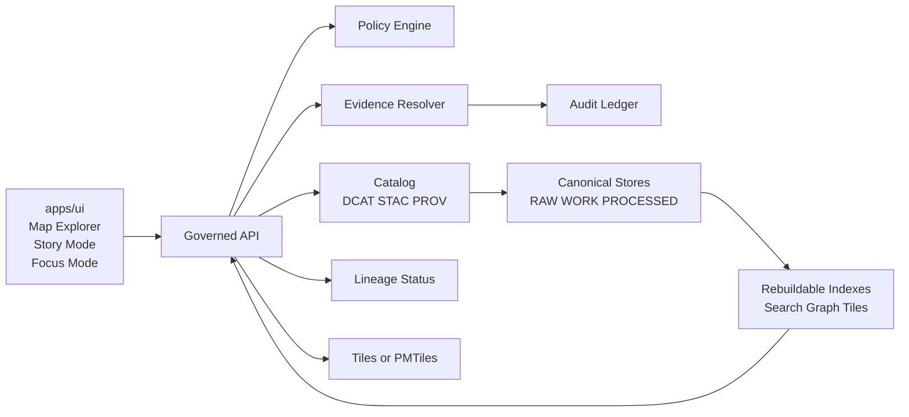

<a id="top"></a>

# apps/ui — Kansas Frontier Matrix UI
**Purpose:** Map Explorer + Story Mode + Focus Mode UI surfaces for KFM — **map-first**, **time-aware**, and **governed**.

**Status:** DRAFT (vNext) • **Owners:** TBD (UI) / TBD (Gov steward) • **Audience:** engineers + governance stewards


---

## Jump to
- [Overview](#overview)
- [Non-negotiables](#non-negotiables)
- [UI surfaces](#ui-surfaces)
- [Map state as a reproducible artifact](#map-state-as-a-reproducible-artifact)
- [Architecture and trust membrane](#architecture-and-trust-membrane)
- [Core UI components](#core-ui-components)
- [Trust surfaces](#trust-surfaces)
- [Evidence Drawer contract](#evidence-drawer-contract)
- [Focus Mode UX contract](#focus-mode-ux-contract)
- [Restriction and abstention UX](#restriction-and-abstention-ux)
- [API contract expectations](#api-contract-expectations)
- [Tile strategy](#tile-strategy)
- [Accessibility](#accessibility)
- [Security](#security)
- [Local development](#local-development)
- [Testing](#testing)
- [Definition of Done](#definition-of-done)
- [Appendix: Proposed directory layout](#appendix-proposed-directory-layout)
- [References](#references)

---

## Overview
`apps/ui` is the **governed** frontend client for the Kansas Frontier Matrix (KFM). It provides:

- **Map Explorer** (primary surface): explore layers in space + time; inspect features with citations.
- **Story Mode:** author, review, and read narrative Story Nodes with resolvable EvidenceRefs.
- **Focus Mode:** evidence-led Q&A that **must cite or abstain**, with policy-safe explanations and `audit_ref`.
- **Catalog:** dataset discovery and version transparency (DCAT/STAC/PROV-backed).
- **Admin/Steward (restricted):** governance tooling for promotion/review flows.

This UI is not “just a map viewer.” It is the **user-visible governance contract**.

[Back to top](#top)

---

## Non-negotiables
These are invariants. If you’re about to violate one, stop and redesign.

### Governed client posture
- The UI **MUST** render what the governed API returns.
- The UI **MUST NOT** embed privileged credentials.
- The UI **MUST NOT** connect directly to databases/object stores/search/tiles storage outside the governed API boundary.

### Evidence-first UX
- **Evidence Drawer** (or provenance/evidence surface) **MUST** be reachable from:
  - every layer,
  - every feature inspect panel,
  - every story claim,
  - every Focus Mode answer.

### Time-aware by default
- A time window is a **first-class control**, not an optional filter.
- Queries must always be interpretable with an explicit time context.

### Cite-or-abstain is enforced
- Stories and Focus Mode output must not publish/commit without resolvable citations.
- If evidence cannot be resolved (policy, missing, broken link), the UI must **fail closed** and provide policy-safe remediation.

[Back to top](#top)

---

## UI surfaces
| Surface | Primary job | MUST include |
|---|---|---|
| Map Explorer | Explore map + time | layer controls, time control, feature inspect, evidence drawer |
| Stories (Story Mode) | Reproducible narratives | story reader (safe markdown), citation hooks, evidence drawer, review state (if authoring) |
| Focus Mode | Evidence-led Q&A | inline citations, abstention UX, policy notice, export with `audit_ref` |
| Catalog | Dataset discovery | dataset/version visibility, policy labels (public-safe), license/attribution surfaces |
| Admin/Steward | Governed operations | promotion queue, QA report viewer, policy label editing (controlled), story review queue |

[Back to top](#top)

---

## Map state as a reproducible artifact
Map state is treated as a reproducible artifact that can be stored in Story Nodes and used as context hints for Focus Mode.

**Map state includes:**
- camera position (bbox/zoom)
- active layers + style parameters
- time window
- filters

**Recommended (illustrative) `view_state` shape:**
```json
{
  "camera": { "bbox": [-101.0, 36.8, -94.6, 40.0], "zoom": 6.5 },
  "layers": [
    { "layer_id": "kfm://layer/roads", "opacity": 0.7, "style": { "variant": "default" } }
  ],
  "time": { "start": "1934-01-01", "end": "1936-12-31" },
  "filters": { "county": ["Finney", "Ford"] }
}
```

**Rules**
- Story playback should reproduce the same view.
- Focus Mode requests may include `view_state` so answers can stay scoped to “what the user is looking at,” while still enforcing policy.

[Back to top](#top)

---

## Architecture and trust membrane



**Interpretation**
- The UI is a surface on top of the governed API.
- All policy decisions, evidence resolution, redaction obligations, and `audit_ref` issuance happen at/behind the API boundary.
- The UI’s job is to make governance **visible and inspectable**, not implicit.

[Back to top](#top)

---

## Core UI components
These are the baseline building blocks implied by the KFM blueprint.

### Map Explorer
- **MapCanvas** (MapLibre GL)
- **LayerPanel** (toggle, opacity, legend, policy badge, data version label)
- **TimeControl** (range selection + histogram where possible)
- **SearchBar** (places, datasets, story nodes)
- **FeatureInspectPanel** (attributes + citations/EvidenceRefs)
- **EvidenceDrawer** (shared component)

### Story Mode
- **StoryNodeList**
- **StoryNodeReader** (safe markdown rendering + citation hooks)
- **EvidenceDrawer** (same component)
- **RelatedEntitiesPanel** (optional)

### Focus Mode
- **ChatPanel**
- **EvidenceSnippets** (inline citations)
- **PolicyNotice** (why some info is withheld)
- **ExportAnswer** (downloadable report including citations + `audit_ref`)

### Admin/Steward (restricted)
- **PromotionQueue** (dataset versions pending approval)
- **QAReportViewer**
- **PolicyLabelEditor** (limited/controlled)
- **StoryReviewQueue**

[Back to top](#top)

---

## Trust surfaces
Trust surfaces are not optional polish. They are required UX contract elements.

Minimum trust surfaces:
- **Automation status badges** (healthy/degraded/failing) on layers or features
- **Evidence Drawer / provenance drawer** accessible from every layer + story claim
- **Dataset version label** per layer linking to DatasetVersion catalogs
- **Policy notices** explicit at the time of interaction (e.g., “geometry generalized due to policy”)
- **“What changed?” diff viewer** comparing DatasetVersion diffs (counts, checksums, QA metrics)

[Back to top](#top)

---

## Evidence Drawer contract
The Evidence Drawer must show, at minimum:
- Evidence bundle ID + digest
- DatasetVersion ID + dataset name
- License and rights holder (with attribution text)
- Freshness (last run timestamp) and validation status
- Provenance chain (run receipt link)
- Artifact links (only if policy allows)
- Redactions applied (obligations)

### Resolution behavior
- Use the evidence resolver endpoint to resolve EvidenceRefs → EvidenceBundles.
- **Fail closed** if evidence can’t be resolved or is unauthorized.
- Publishing stories **must be blocked** if any citation fails to resolve (UI enforces by calling the evidence resolver during publish preflight).

### UX requirements
- Present errors in a policy-safe manner.
- Prefer “here is what you can do next” over silent failure.
- Never provide UI hints that reveal restricted existence.

[Back to top](#top)

---

## Focus Mode UX contract
Focus Mode is a governed interface that behaves like a research assistant:
- **Must cite or abstain**
- Must show citations inline (EvidenceSnippets)
- Must provide a policy notice when information is withheld
- Must provide `audit_ref` on governed actions (ask/export/publish)

Export outputs must include citations and `audit_ref` in a readable format.

[Back to top](#top)

---

## Restriction and abstention UX
Abstention is a feature, not an error. The UI must make abstention understandable **without leaking restricted info**.

Rules:
- Show “why” in policy-safe terms (e.g., “restricted evidence not available to your role”).
- Suggest safe alternatives (e.g., broaden time range; use public datasets).
- Provide `audit_ref` so stewards can review.
- Never show “ghost metadata” that reveals restricted existence unless policy allows.

Also:
- Align 403/404 behavior with policy guidance (avoid existence leaks).
- Keep error messages stable and policy-safe.

[Back to top](#top)

---

## API contract expectations
This UI assumes a governed API with a minimal v1 endpoint set similar to:

| Endpoint | Purpose | UI usage |
|---|---|---|
| `GET /api/v1/datasets` | list datasets + versions | Catalog, layer picker |
| `GET /api/v1/stac/collections` / `items` | bbox/time queries | map/time-driven discovery |
| `POST /api/v1/evidence/resolve` | EvidenceRef → EvidenceBundle | evidence drawer, citation lint |
| `GET/POST /api/v1/story` | story nodes + versioning | Story Mode |
| `POST /api/v1/focus/ask` | Focus Mode Q&A | Focus Mode |
| `GET /api/v1/lineage/status` (or stream) | pipeline health/freshness | status badges |
| Tiles: `GET /api/v1/tiles/...` or `GET /assets/pmtiles/...` | map rendering | MapCanvas |

Response requirements (contract-level):
- `dataset_version_id` (when applicable)
- artifact digests (when applicable)
- public-safe policy label
- `audit_ref` for governed operations (focus, publish, etc.)

Error model should be stable:
- `error_code`
- policy-safe `message`
- `audit_ref`
- optional remediation hints

[Back to top](#top)

---

## Tile strategy
**Decision needed:** dynamic vector tiles vs PMTiles bundles.

Constraints:
- Tiles must not bypass policy enforcement.
- Cache behavior must not leak restricted existence (e.g., cache keys must vary appropriately by policy/auth).
- If PMTiles are used, policy gating must ensure only policy-safe bundles are served (or only public layers use static bundles).

[Back to top](#top)

---

## Accessibility
Minimum accessibility requirements:
- Keyboard navigable layer controls and evidence drawer; visible focus states.
- Text labels for policy badges and status indicators (no color-only meaning).
- ARIA labels for map controls.
- Safe markdown rendering (CSP + sanitization to prevent XSS).
- Export outputs include citations and `audit_ref` in a readable format.

[Back to top](#top)

---

## Security
Security posture for the UI:
- No privileged secrets in client builds.
- Treat all markdown/narrative content as untrusted input: sanitize + CSP.
- Keep all policy decisions server-side; UI only displays the outcome and obligations.
- Do not introduce side channels:
  - error differences that reveal restricted existence
  - differing empty states that reveal “something is there but hidden”
  - timing/UI behavior differences tied to restricted data

[Back to top](#top)

---

## Local development
> NOTE: Tooling commands below are placeholders. Replace with repo-standard package manager and scripts.

### Preflight checklist
- You can reach the governed API base URL in your environment.
- You have a role/principal with appropriate permissions for the surfaces you are developing.

### Environment variables (illustrative)
- `KFM_API_BASE_URL` — base URL for governed API
- `KFM_AUTH_MODE` — e.g., cookie/session/OIDC (repo-defined)
- `KFM_DEFAULT_TIME_RANGE` — UI default time window
- `KFM_ENABLE_ADMIN` — feature flag for steward surfaces (restricted)

### Example commands (replace with actual)
```bash
# Install deps
npm install

# Dev server
npm run dev

# Build
npm run build

# Test
npm test
```

[Back to top](#top)

---

## Testing
Testing is part of the governance contract.

Recommended test layers:
- **Unit tests:** components, reducers/state, formatting, parsers.
- **Contract tests:** API response shapes (policy label, `audit_ref`, digests).
- **E2E tests:** Map Explorer → Evidence Drawer; Story publish preflight; Focus Mode cite-or-abstain flows.
- **Accessibility checks:** keyboard nav, focus order, ARIA labels, color-only indicators.

Hard gate candidates:
- Story publish fails if any EvidenceRef is unresolvable.
- Focus Mode fails build/test if uncited claims are emitted in “allow” responses.

[Back to top](#top)

---

## Definition of Done
A UI change is “done” only if:

- [ ] Adds/updates UI without bypassing governed API
- [ ] Does not introduce privileged creds into the client
- [ ] Adds evidence/provenance surfaces wherever new claims/data appear
- [ ] Shows dataset version + policy label (public-safe) for new layer surfaces
- [ ] Handles abstention/restriction with policy-safe messaging + `audit_ref`
- [ ] Does not leak restricted existence via error/empty-state differences
- [ ] Meets accessibility minimums (keyboard, focus, ARIA, non-color semantics)
- [ ] Includes tests proportional to risk (unit/contract/e2e as needed)

[Back to top](#top)

---

## Appendix: Proposed directory layout
> This is a **proposed** layout to keep layers clean and retrieval-friendly. Update to match the real tree.

<details>
<summary>Show proposed tree</summary>

```text
apps/ui/
  README.md
  package.json                 # scripts + dependencies (repo-defined)
  public/                      # static assets
  src/
    app/                       # app shell + route wiring
    routes/                    # surface routes (Map/Stories/Catalog/Focus/Admin)
    features/
      map-explorer/            # Map Explorer feature module
      story-mode/              # Story Mode feature module
      focus-mode/              # Focus Mode feature module
      catalog/                 # Dataset discovery UI
      admin-steward/           # Restricted tools (guarded)
    components/
      EvidenceDrawer/          # shared trust surface
      PolicyBadge/
      DataVersionBadge/
      StatusBadge/
      TimeControl/
      FeatureInspectPanel/
    lib/
      api/                     # typed API clients + error model
      evidence/                # EvidenceRef resolution + caching
      policy/                  # policy-safe formatting helpers
      time/                    # time window utilities
    styles/
  tests/
    e2e/
    contract/
```

</details>

[Back to top](#top)

---

## References
- KFM Definitive Design & Governance Guide (vNext): UI surfaces, trust surfaces, evidence drawer behavior, accessibility minimums.
- KFM work packages/risk register: do not implement UI without policy engine + evidence resolver.

(Keep this list short and link it to in-repo docs once paths are finalized.)
