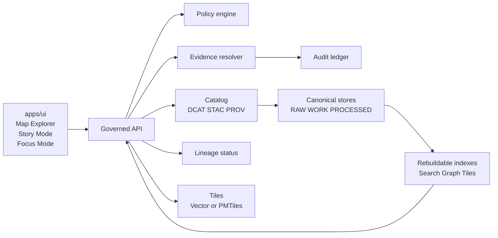
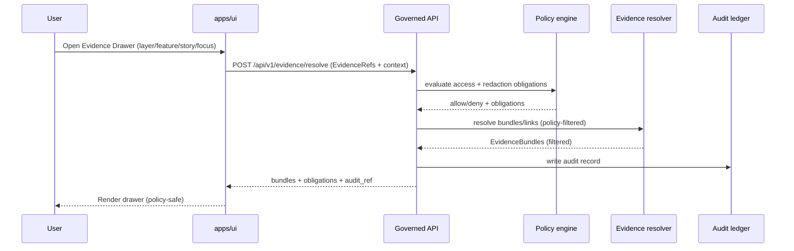

<!-- [KFM_META_BLOCK_V2]
doc_id: kfm://doc/6e2b37b6-31e0-4c9a-a0b7-6f52f20c0f5e
title: apps/ui — Kansas Frontier Matrix UI
type: standard
version: v2
status: draft
owners: TBD (UI), TBD (Gov steward)
created: 2026-02-22
updated: 2026-02-23
policy_label: restricted
related:
  - apps/ui/
  - kfm://doc/<definitive-design-governance-guide-vnext>
  - kfm://doc/<governed-api-contract-v1>              # TODO: replace with real doc_id/path
  - kfm://doc/<policy-engine-contract-v1>             # TODO: replace with real doc_id/path
tags:
  - kfm
  - ui
  - map-first
  - time-aware
  - governed
  - evidence-first
  - cite-or-abstain
notes:
  - v2 upgrade: added Directory Contract, Observability/Audit, Performance & cache safety guidance, and an Open Decisions matrix. Semantics preserved; placeholders remain TODO where repo truth is unknown.
[/KFM_META_BLOCK_V2] -->

<a id="top"></a>

# apps/ui — Kansas Frontier Matrix UI
**Purpose:** Governed client surfaces for KFM — **Map Explorer**, **Story Mode**, and **Focus Mode** — built **map-first**, **time-aware**, and **evidence-first**.

**Status:** `DRAFT` (vNext) • **Owners:** `TBD (UI)` / `TBD (Gov steward)` • **Audience:** engineers + governance stewards


---

## Navigation
- **Foundations**
  - [Overview](#overview)
  - [Directory contract](#directory-contract)
  - [Non-negotiables](#non-negotiables)
  - [UI surfaces](#ui-surfaces)
- **Core contracts**
  - [Architecture and trust membrane](#architecture-and-trust-membrane)
  - [Map state as a reproducible artifact](#map-state-as-a-reproducible-artifact)
  - [Trust surfaces](#trust-surfaces)
  - [Evidence Drawer contract](#evidence-drawer-contract)
  - [Focus Mode UX contract](#focus-mode-ux-contract)
  - [Restriction and abstention UX](#restriction-and-abstention-ux)
  - [API contract expectations](#api-contract-expectations)
  - [Tile strategy](#tile-strategy)
- **Build and operate**
  - [Accessibility](#accessibility)
  - [Security](#security)
  - [Observability and audit](#observability-and-audit)
  - [Performance and reliability](#performance-and-reliability)
  - [Local development](#local-development)
  - [Testing](#testing)
  - [Definition of Done](#definition-of-done)
- **Appendix**
  - [Appendix: Proposed directory layout](#appendix-proposed-directory-layout)
  - [Appendix: Open decisions and minimum verification steps](#appendix-open-decisions-and-minimum-verification-steps)
  - [References](#references)

---

## Overview
`apps/ui` is the **governed frontend client** for the Kansas Frontier Matrix (KFM). It provides:

- **Map Explorer** (primary surface): explore layers in space + time; inspect features with citations.
- **Story Mode:** author, review, and read narrative Story Nodes with resolvable EvidenceRefs.
- **Focus Mode:** evidence-led Q&A that **must cite or abstain**, with policy-safe explanations and `audit_ref`.
- **Catalog:** dataset discovery and version transparency (DCAT/STAC/PROV-backed).
- **Admin and Steward** (restricted): governance tooling for promotion/review flows.

This UI is not “just a map viewer.” It is the **user-visible governance contract**.

> [!NOTE]
> **Normative language:** This document uses **MUST / SHOULD / MAY** as normative requirements. When unsure, default to **fail closed** and request governance review.

[Back to top](#top)

---

## Directory contract
This section is the **directory-level contract** for `apps/ui/` (what belongs here, what does not, and what invariants must hold).

### Where this fits in the repo
- `apps/ui/` is the **client application boundary**: routing + presentation + client-side state + *policy-safe* UX.
- All data access **MUST** cross the governed API boundary (and inherit its policy outcomes).
- Shared UI logic **MAY** live in shared packages if the repo has them (not confirmed in repo).

### Acceptable inputs
- UI source: routes, feature modules, components, styles, assets.
- Typed API clients and schema validators that implement the governed API contract.
- Test suites (unit/contract/e2e/a11y) for the UI surfaces and their governance behaviors.
- Documentation specific to UI operation, governance UX, and client-level security posture.

### Exclusions
- **No** server-side policy logic, evidence resolution, or access control rules (belongs behind the API).
- **No** direct database/object store/search index connections or credentials.
- **No** dataset transformation/pipeline code (belongs in pipeline packages/services).
- **No** “shadow policy” implemented in UI to make the experience nicer.

> [!WARNING]
> If you add a new outbound network origin in the UI (a new host), you must treat it as a **trust membrane change** and route it through a governed adapter (or reject it).

[Back to top](#top)

---

## Non-negotiables
These are invariants. If you’re about to violate one, stop and redesign.

### Governed client posture
- The UI **MUST** render and respect what the governed API returns (including redactions and obligations).
- The UI **MUST NOT** embed privileged credentials.
- The UI **MUST NOT** connect directly to databases/object stores/search/tiles storage outside the governed API boundary.

### Evidence-first UX
- An **Evidence Drawer** (or provenance/evidence surface) **MUST** be reachable from:
  - every layer,
  - every feature inspect panel,
  - every story claim,
  - every Focus Mode answer.

### Time-aware by default
- A time window is a **first-class control**, not an optional filter.
- Queries **MUST** always be interpretable with an explicit time context.

### Cite-or-abstain is enforced
- Stories and Focus Mode output **MUST NOT** publish/commit without resolvable citations.
- If evidence cannot be resolved (policy, missing, broken link), the UI **MUST** fail closed and provide policy-safe remediation.

[Back to top](#top)

---

## UI surfaces

| Surface | Primary job | MUST include |
|---|---|---|
| Map Explorer | Explore map + time | layer controls, time control, feature inspect, evidence drawer |
| Stories | Reproducible narratives | story reader (safe markdown), citation hooks, evidence drawer, review state when authoring |
| Focus Mode | Evidence-led Q&A | inline citations, abstention UX, policy notice, export with `audit_ref` |
| Catalog | Dataset discovery | dataset/version visibility, policy labels (public-safe), license/attribution surfaces |
| Admin and Steward | Governed operations | promotion queue, QA report viewer, policy label editing, story review queue |

> [!TIP]
> Prefer routes aligned to these surfaces (`/map`, `/stories`, `/focus`, `/catalog`, `/admin`) but **do not** bake routes into contracts. The API contract is the stable boundary.

[Back to top](#top)

---

## Architecture and trust membrane
The UI is a surface on top of the governed API. Policy, evidence resolution, and audit issuance happen at/behind the API boundary.



### Interpretation
- The UI’s job is to make governance **visible and inspectable**, not implicit.
- The trust membrane means:
  - The UI never bypasses the API to access storage.
  - The UI never decides policy; it only displays policy outcomes and obligations.
  - The UI never “fills in” restricted details to improve UX.

### Evidence resolution sequence (policy-safe)


[Back to top](#top)

---

## Map state as a reproducible artifact
Map state is treated as a reproducible artifact that can be stored in Story Nodes and used as context hints for Focus Mode.

### Map state includes
- camera position (`bbox`/`zoom`)
- active layers + style parameters
- time window
- filters

### Illustrative `view_state` shape (versioned)
```json
{
  "view_state_version": "v1",
  "camera": { "bbox": [-101.0, 36.8, -94.6, 40.0], "zoom": 6.5 },
  "layers": [
    { "layer_id": "kfm://layer/roads", "opacity": 0.7, "style": { "variant": "default" } }
  ],
  "time": { "start": "1934-01-01", "end": "1936-12-31" },
  "filters": { "county": ["Finney", "Ford"] }
}
```

### Rules
- Story playback **SHOULD** reproduce the same view (best-effort; fail closed if layer is unavailable).
- Focus Mode requests **MAY** include `view_state` so answers stay scoped to what the user is looking at, while still enforcing policy.
- `view_state` **SHOULD** be serialized deterministically for hashing/diffing (stable key order, normalized numeric precision).
- If a `view_state` is stored in Story Nodes, the story authoring UI **SHOULD** persist both:
  - the raw `view_state`, and
  - a content digest (e.g., `view_state_sha256`) produced by the governed API (preferred) or by a deterministic client routine (fallback).

> [!NOTE]
> Hashing on the server is preferred because the API can canonicalize and audit the artifact without leaking restricted existence through client-side heuristics.

[Back to top](#top)

---

## Core UI components
Baseline building blocks implied by the KFM blueprint.

### Map Explorer
- **MapCanvas** (MapLibre GL)
- **LayerPanel** (toggle, opacity, legend, policy badge, data version label)
- **TimeControl** (range selection + histogram where possible)
- **SearchBar** (places, datasets, story nodes)
- **FeatureInspectPanel** (attributes + citations/EvidenceRefs)
- **EvidenceDrawer** (shared component)

### Story Mode
- **StoryNodeList**
- **StoryNodeReader** (safe markdown rendering + citation hooks)
- **EvidenceDrawer** (same component)
- **RelatedEntitiesPanel** (optional)

### Focus Mode
- **ChatPanel**
- **EvidenceSnippets** (inline citations)
- **PolicyNotice** (why some info is withheld)
- **ExportAnswer** (downloadable report including citations + `audit_ref`)

### Admin and Steward
- **PromotionQueue** (dataset versions pending approval)
- **QAReportViewer**
- **PolicyLabelEditor** (limited/controlled)
- **StoryReviewQueue**

[Back to top](#top)

---

## Trust surfaces
Trust surfaces are not optional polish. They are required UX contract elements.

Minimum trust surfaces:
- **Automation status badges** (healthy/degraded/failing) on layers or features
- **Evidence Drawer** accessible from every layer + story claim
- **Dataset version label** per layer linking to DatasetVersion catalog entries
- **Policy notices** explicit at the time of interaction (e.g., “geometry generalized due to policy”)
- **What changed** diff viewer comparing DatasetVersion diffs (counts, checksums, QA metrics)

> [!WARNING]
> Do not show “helpful” metadata that could leak restricted existence. Trust surfaces must be policy-safe by design.

[Back to top](#top)

---

## Evidence Drawer contract
The Evidence Drawer **MUST** show, at minimum:
- Evidence bundle ID + digest
- DatasetVersion ID + dataset name
- License and rights holder (with attribution text)
- Freshness (last run timestamp) and validation status
- Provenance chain (run receipt link)
- Artifact links (only if policy allows)
- Redactions applied (obligations)
- `audit_ref` for this resolution action (so stewards can reproduce/trace)

### Resolution behavior
- Use the evidence resolver endpoint to resolve **EvidenceRefs → EvidenceBundles**.
- **Fail closed** if evidence can’t be resolved or is unauthorized.
- Publishing stories **MUST** be blocked if any citation fails to resolve (UI enforces via publish preflight calling the evidence resolver).

### UX requirements
- Present errors in a policy-safe manner.
- Prefer “here is what you can do next” over silent failure.
- Never provide UI hints that reveal restricted existence.
- Provide copyable citation snippets (stable identifier + digest) when policy allows.

[Back to top](#top)

---

## Focus Mode UX contract
Focus Mode is a governed interface that behaves like a research assistant:
- **Must cite or abstain**
- Must show citations inline (EvidenceSnippets)
- Must provide a policy notice when information is withheld
- Must provide `audit_ref` on governed actions (ask/export/publish)

Export outputs **MUST** include citations and `audit_ref` in a readable format.

[Back to top](#top)

---

## Restriction and abstention UX
Abstention is a feature, not an error. The UI must make abstention understandable **without leaking restricted info**.

### Rules
- Show “why” in policy-safe terms (e.g., “restricted evidence not available to your role”).
- Suggest safe alternatives (e.g., broaden time range; use public datasets).
- Provide `audit_ref` so stewards can review.
- Never show “ghost metadata” that reveals restricted existence unless policy allows.

### Error posture
- Align 403/404 behavior with policy guidance (avoid existence leaks).
- Keep error messages stable and policy-safe.
- Avoid timing or UI behavior differences tied to restricted data.
- Prefer response-shape stability over “friendly” UI branching that depends on restricted conditions.

[Back to top](#top)

---

## API contract expectations
This UI assumes a governed API with a minimal v1 endpoint set similar to:

| Endpoint | Purpose | UI usage |
|---|---|---|
| `GET /api/v1/datasets` | list datasets + versions | Catalog, layer picker |
| `GET /api/v1/stac/collections` and `items` | bbox/time queries | map and time-driven discovery |
| `POST /api/v1/evidence/resolve` | EvidenceRef → EvidenceBundle | evidence drawer, citation lint |
| `GET /api/v1/story` and `POST /api/v1/story` | story nodes + versioning | Story Mode |
| `POST /api/v1/focus/ask` | Focus Mode Q&A | Focus Mode |
| `GET /api/v1/lineage/status` | pipeline health/freshness | status badges |
| Tiles: `GET /api/v1/tiles/...` or `GET /assets/pmtiles/...` | map rendering | MapCanvas |

### Response requirements
- `dataset_version_id` (when applicable)
- artifact digests (when applicable)
- public-safe policy label
- `audit_ref` for governed operations (focus, publish, resolve, etc.)
- stable error model (see below)

### Error model
Error responses **SHOULD** be stable and include:
- `error_code`
- policy-safe `message`
- `audit_ref`
- optional remediation hints

> [!NOTE]
> If the API uses request correlation IDs (e.g., `request_id` header), the UI **SHOULD** propagate them into error reports and bug tickets.

[Back to top](#top)

---

## Tile strategy
**Decision needed:** dynamic vector tiles vs PMTiles bundles.

### Constraints
- Tiles **MUST NOT** bypass policy enforcement.
- Cache behavior **MUST NOT** leak restricted existence (cache keys must vary appropriately by policy/auth).
- If PMTiles are used, policy gating **MUST** ensure only policy-safe bundles are served (or only public layers use static bundles).

### Decision matrix (starter)
| Option | Upside | Risk | Governance guardrail |
|---|---|---|---|
| Dynamic vector tiles (API served) | per-request policy enforcement | higher server load; caching complexity | vary cache by auth/policy; normalize errors |
| PMTiles bundles | cheap distribution; fast rendering | harder per-user policy gating | only publish policy-safe bundles; keep restricted layers dynamic |

> [!TIP]
> Capture the outcome as an ADR in-repo once the serving model and caching strategy are chosen.

[Back to top](#top)

---

## Accessibility
Minimum accessibility requirements:
- Keyboard navigable layer controls and evidence drawer; visible focus states.
- Text labels for policy badges and status indicators (no color-only meaning).
- ARIA labels for map controls.
- Safe markdown rendering (CSP + sanitization to prevent XSS).
- Export outputs include citations and `audit_ref` in a readable format.

[Back to top](#top)

---

## Security
Security posture for the UI:
- No privileged secrets in client builds.
- Treat all markdown/narrative content as untrusted input: sanitize + CSP.
- Keep all policy decisions server-side; UI only displays outcomes and obligations.
- Do not introduce side channels:
  - error differences that reveal restricted existence
  - differing empty states that reveal “something is there but hidden”
  - timing/UI behavior differences tied to restricted data

### Client-side supply chain posture (baseline)
- Lock dependencies with a lockfile (repo-defined tooling).
- Pin and review any markdown/HTML rendering libraries (XSS risk).
- Prefer a strict Content Security Policy; avoid `unsafe-inline` where feasible.

[Back to top](#top)

---

## Observability and audit
Observability is part of governance: if a steward can’t trace what happened, we can’t defend or reproduce it.

### Required surfaces
- Every governed operation **MUST** surface the `audit_ref` (or equivalent) returned by the API:
  - Focus Mode ask/export
  - Story publish/review transitions
  - Evidence resolution (drawer opens and citation lint)
- Error UIs **SHOULD** include a copyable correlation identifier (`audit_ref`, and/or `request_id`) in a policy-safe way.

### UI telemetry (policy-safe)
- UI telemetry **MAY** capture interaction events (for quality) **only** if:
  - it is privacy-reviewed and policy-safe, and
  - it does not encode restricted existence (e.g., “user clicked restricted layer X”).

**Recommended event shape (illustrative):**
- `event_name` (e.g., `evidence_drawer_opened`)
- `surface` (`map|stories|focus|catalog|admin`)
- `timestamp`
- `audit_ref` (when available)
- `dataset_version_id` (only if policy allows exposure)
- `result` (`success|abstain|denied|error`)
- `error_code` (policy-safe)

> [!WARNING]
> Avoid recording free-form query text, feature attributes, geometries, or raw EvidenceRefs in client analytics. Prefer server-side audit records.

[Back to top](#top)

---

## Performance and reliability
Performance work must not compromise governance or leak restricted existence.

### Map performance basics
- Prefer incremental rendering updates (avoid re-rendering the whole map on minor UI state changes).
- Debounce expensive bbox/time queries; show loading states that do not reveal restricted existence.
- Virtualize long lists (layers, features, story lists) and keep keyboard accessibility intact.

### Cache safety
- The UI **MUST NOT** persist restricted responses into long-lived storage (e.g., LocalStorage) unless explicitly approved.
- If adding a Service Worker, treat it as a governance-impacting change:
  - cache keys must vary by auth/policy where relevant,
  - cached error responses must not reveal existence.

### Bundle safety
- Large UI bundles degrade time-to-first-trust (time until Evidence Drawer is reachable).
- **SHOULD:** set a bundle-size budget and gate in CI (repo-defined thresholds).

[Back to top](#top)

---

## Local development

> [!NOTE]
> Tooling commands below are placeholders. Replace with repo-standard package manager and scripts.

### Preflight checklist
- You can reach the governed API base URL in your environment.
- You have a role/principal with appropriate permissions for the surfaces you are developing.

### Environment variables
Illustrative only — align names with the repo once confirmed.

- `KFM_API_BASE_URL` — base URL for governed API
- `KFM_AUTH_MODE` — cookie/session/OIDC (repo-defined)
- `KFM_DEFAULT_TIME_RANGE` — UI default time window
- `KFM_ENABLE_ADMIN` — feature flag for steward surfaces (restricted)

### Example commands
```bash
# Install deps
npm install

# Dev server
npm run dev

# Build
npm run build

# Test
npm test
```

[Back to top](#top)

---

## Testing
Testing is part of the governance contract.

Recommended test layers:
- **Unit tests:** components, reducers/state, formatting, parsers.
- **Contract tests:** API response shapes (policy label, `audit_ref`, digests).
- **E2E tests:** Map Explorer → Evidence Drawer; Story publish preflight; Focus Mode cite-or-abstain flows.
- **Accessibility checks:** keyboard nav, focus order, ARIA labels, non-color semantics.

Hard gate candidates:
- Story publish fails if any EvidenceRef is unresolvable.
- Focus Mode UX rejects “allow” answers that have no citations and no explicit abstention structure.
- Side-channel regression test: consistent empty/error states for denied vs not-found where policy requires.

[Back to top](#top)

---

## Definition of Done
A UI change is “done” only if:

- [ ] Adds or updates UI without bypassing governed API
- [ ] Does not introduce privileged creds into the client
- [ ] Adds evidence/provenance surfaces wherever new claims/data appear
- [ ] Shows dataset version + public-safe policy label for new layer surfaces
- [ ] Handles abstention/restriction with policy-safe messaging + `audit_ref`
- [ ] Does not leak restricted existence via error or empty-state differences
- [ ] Meets accessibility minimums (keyboard, focus, ARIA, non-color semantics)
- [ ] Adds/updates observability hooks for governed actions (surface `audit_ref`)
- [ ] Includes tests proportional to risk (unit/contract/e2e as needed)

[Back to top](#top)

---

## Appendix: Proposed directory layout
This is a **proposed** layout to keep layers clean and retrieval-friendly. Update to match the real tree.

<details>
<summary>Show proposed tree</summary>

```text
apps/ui/
  README.md
  package.json                 # scripts + dependencies (repo-defined)
  public/                      # static assets
  src/
    app/                       # app shell + route wiring
    routes/                    # surface routes (Map/Stories/Catalog/Focus/Admin)
    features/
      map-explorer/            # Map Explorer feature module
      story-mode/              # Story Mode feature module
      focus-mode/              # Focus Mode feature module
      catalog/                 # Dataset discovery UI
      admin-steward/           # Restricted tools (guarded)
    components/
      EvidenceDrawer/          # shared trust surface
      PolicyBadge/
      DataVersionBadge/
      StatusBadge/
      TimeControl/
      FeatureInspectPanel/
    lib/
      api/                     # typed API clients + error model
      evidence/                # EvidenceRef resolution + caching
      policy/                  # policy-safe formatting helpers
      time/                    # time window utilities
      telemetry/               # policy-safe UI events (if allowed)
    styles/
  tests/
    e2e/
    contract/
```

</details>

[Back to top](#top)

---

## Appendix: Open decisions and minimum verification steps
This document intentionally includes placeholders. These are the **minimum verification steps** to convert unknowns into repo-truth.

| Unknown | Why it matters | Minimum verification step |
|---|---|---|
| UI framework (React/Vite/Next/etc.) | determines routing, SSR, CSP, build and testing | inspect `apps/ui/package.json` + build scripts |
| Auth model (cookie/OIDC/token) | impacts cache keys, error posture, login UX | inspect API auth docs + existing middleware |
| Tile serving model | impacts policy enforcement & caching safety | locate tile endpoints + caching layer config |
| Story Node schema/version | impacts story rendering + publish preflight | open Story Node contract doc / OpenAPI |
| Evidence resolver response shape | defines Evidence Drawer UI contract | inspect OpenAPI + sample responses |
| CI gates (lint/typecheck/e2e/a11y) | enforces trust membrane invariants | inspect CI workflow files and `package.json` scripts |

> [!TIP]
> Treat any change that touches auth, caching, error posture, or evidence resolution as a “governance-impacting change” and require steward review.

[Back to top](#top)

---

## References
- KFM Definitive Design and Governance Guide (vNext): UI surfaces, trust surfaces, evidence drawer behavior, accessibility minimums. *(link TBD)*
- KFM work packages and risk register: do not implement UI without policy engine + evidence resolver. *(link TBD)*

(Keep this list short and link to in-repo docs once paths are finalized.)
