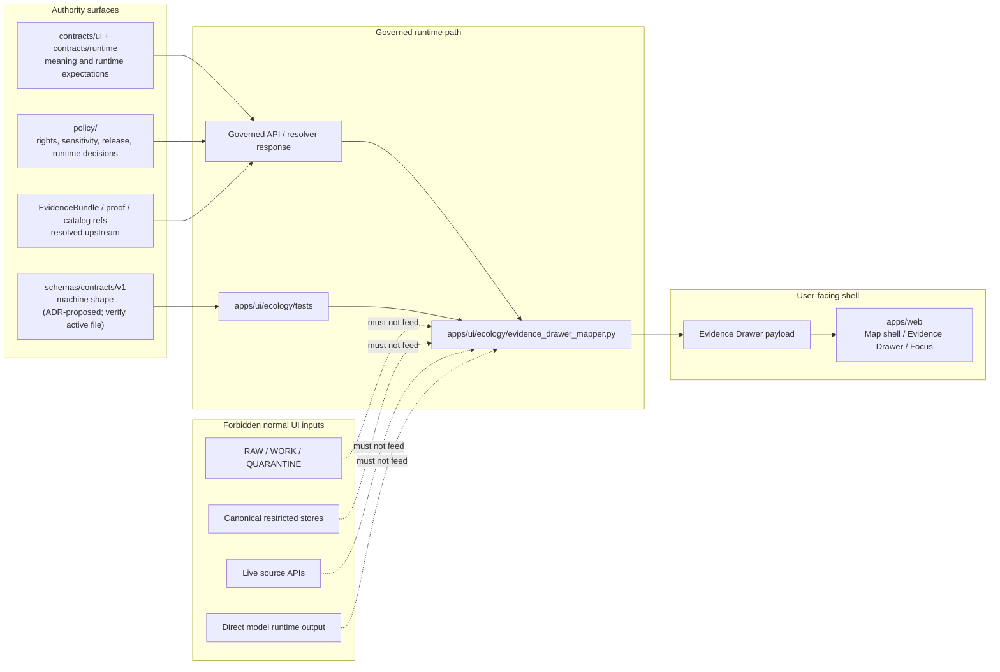

<!-- [KFM_META_BLOCK_V2]
doc_id: kfm://doc/NEEDS_VERIFICATION__apps_ui_readme_uuid
title: apps/ui — UI-Facing Code and Tests
type: standard
version: v1
status: draft
owners: @bartytime4life (fallback from CODEOWNERS; app-specific owner NEEDS VERIFICATION)
created: NEEDS_VERIFICATION__YYYY-MM-DD
updated: 2026-05-07
policy_label: NEEDS_VERIFICATION__public_or_restricted
related: [README.md, apps/README.md, apps/ui/ecology/README.md, apps/ui/ecology/tests/README.md, apps/web/README.md, contracts/ui/ecology_evidence_drawer_payload.md, tools/validators/ecology/run_ecology_ui_checks.sh, NEEDS_VERIFICATION__schemas/contracts/v1/runtime/ecology_evidence_drawer.schema.json]
tags: [kfm, apps, ui, ecology, evidence-drawer, governed-api, maplibre, trust-visible]
notes: [Revised from current GitHub connector evidence for apps/ui and adjacent app surfaces., doc_id created date policy_label and app-specific owner remain placeholders pending maintainer verification., Schema path referenced by ecology UI contract tests needs active-checkout verification before enforcement is claimed.]
[/KFM_META_BLOCK_V2] -->

<a id="top"></a>

# apps/ui — UI-Facing Code and Tests

UI-facing mapper and test surfaces that keep KFM browser behavior downstream of governed evidence, policy, release state, and cite-or-abstain rules.

> [!NOTE]
> **Status:** `active directory / draft README`  
> **Owners:** `@bartytime4life` fallback; app-specific owner **NEEDS VERIFICATION**  
> **Path:** `apps/ui/README.md`  
>        
> **Quick jumps:** [Scope](#scope) · [Repo fit](#repo-fit) · [Accepted inputs](#accepted-inputs) · [Exclusions](#exclusions) · [Current path map](#current-path-map) · [Directory tree](#directory-tree) · [Quickstart](#quickstart) · [Operating model](#operating-model) · [Usage](#usage) · [Quality gates](#quality-gates) · [FAQ](#faq) · [Appendix](#appendix)

> [!IMPORTANT]
> `apps/ui/` is a UI-facing implementation boundary. It may map and test governed payloads, but it must not become a canonical evidence store, policy authority, schema authority, release authority, source connector, public model client, or alternate path around the governed lifecycle.

---

## Scope

`apps/ui/` contains UI-facing code and tests that adapt governed KFM runtime outputs into user-facing inspection surfaces.

Current connector evidence confirms an ecology UI slice under `apps/ui/ecology/`, including a Python Evidence Drawer mapper and tests for citable, abstaining, malformed, missing-section, and non-cite responses. This README therefore treats `apps/ui/` as the parent orientation surface for app-local UI mappers and UI boundary tests.

The job of this directory is narrow:

- consume governed API/runtime payloads;
- map them into drawer-safe or UI-safe structures;
- test that evidence, policy, uncertainty, failure, and citation states remain visible;
- keep UI-local behavior aligned with contracts, schemas, policy, and release posture.

The job of this directory is **not** to decide ecological truth, source authority, release state, sensitive-location treatment, or model behavior.

### Truth posture

| Claim | Label | Basis |
| --- | --- | --- |
| `apps/ui/README.md` exists on `main` and previously described UI-facing code and tests. | **CONFIRMED** | Current GitHub connector fetch. |
| `apps/ui/ecology/` contains mapper logic and tests for the ecology Evidence Drawer boundary. | **CONFIRMED** | Current GitHub connector fetch and search results. |
| `apps/ui/ecology/tests/` includes mapper and contract-schema tests. | **CONFIRMED** | Current GitHub connector fetch. |
| `apps/ui/` is a root-level app-local UI authority for the whole product. | **NOT CLAIMED** | Broader UI shell code is also present under `apps/web/`. |
| The schema referenced by `apps/ui/ecology/tests/test_evidence_drawer_contract_schema.py` is present and CI-enforced. | **NEEDS VERIFICATION** | Direct active-checkout or workflow evidence is still required. |

[Back to top](#top)

---

## Repo fit

`apps/ui/` sits inside the deployable/application boundary and next to the governed web shell. It is a narrower mapper/test surface, not the whole browser product.

| Relationship | Link from `apps/ui/README.md` | Status | Role |
| --- | --- | ---: | --- |
| Repo root | [`../../README.md`](../../README.md) | **CONFIRMED** | Repo-wide KFM purpose, trust law, responsibility-root posture, publication guardrails. |
| Apps parent | [`../README.md`](../README.md) | **CONFIRMED** | Deployable and app-local surface boundary for APIs, web shell, UI mappers, review console, CLI, workers. |
| Governed web shell | [`../web/README.md`](../web/README.md) | **CONFIRMED** | Browser shell for map-first interaction, MapLibre, Evidence Drawer, Focus Mode, export, and trust cues. |
| Ecology UI child | [`./ecology/README.md`](./ecology/README.md) | **CONFIRMED** | Ecology-facing UI mapper and trust-surface guidance. |
| Ecology UI tests | [`./ecology/tests/README.md`](./ecology/tests/README.md) | **CONFIRMED** | Path-local orientation for ecology UI tests. |
| Ecology drawer contract | [`../../contracts/ui/ecology_evidence_drawer_payload.md`](../../contracts/ui/ecology_evidence_drawer_payload.md) | **CONFIRMED** | UI-facing contract for rendering ecology EvidenceBundles in the Evidence Drawer. |
| Runtime contract family | [`../../contracts/runtime/`](../../contracts/runtime/) | **CONFIRMED parent by repo search / specific files surfaced** | EvidenceBundle, Focus Mode, and runtime contract guidance. |
| Machine schema home | [`../../schemas/contracts/v1/`](../../schemas/contracts/v1/) | **PROPOSED / NEEDS VERIFICATION** | ADR-0001 proposes this as canonical machine-contract schema home after acceptance. |
| Policy | [`../../policy/`](../../policy/) | **CONFIRMED parent by repo evidence** | Rights, sensitivity, release, runtime, review, and deny/abstain rules. |
| Ecology validators | [`../../tools/validators/ecology/`](../../tools/validators/ecology/) | **CONFIRMED by repo search and fetched runner** | Ecology bundle and UI payload validation helpers. |

### Upstream / downstream rule

```text
contracts + schemas + policy + released evidence
  -> governed API/runtime response
  -> apps/ui mapper
  -> apps/web / Evidence Drawer / Focus rendering
```

`apps/ui/` should only work with governed or fixture-safe payloads. It should not read lifecycle stores, source APIs, proof internals, canonical stores, or direct model output as its normal path.

[Back to top](#top)

---

## Accepted inputs

Put material here when the primary responsibility is UI-facing adaptation or verification.

| Accepted input | Belongs here when… | Required posture |
| --- | --- | --- |
| UI mappers | They translate a governed response into a drawer, panel, or renderer payload. | Preserve `cite`, `abstain`, failure, proof, catalog, uncertainty, and action states without strengthening them. |
| UI-local tests | They prove mapper or rendering behavior. | Use synthetic, governed, or release-safe fixtures. |
| Evidence Drawer mapper tests | They verify citable and abstaining evidence states. | Assert visible failure and disabled actions where support is unavailable. |
| Contract-alignment tests | They check payload shape against a schema or fallback requirements. | Mark schema enforcement **NEEDS VERIFICATION** if the schema file or runner is not proven. |
| Public-safe UI fixtures | They exercise UI states without live source calls or sensitive details. | No exact restricted locations, private data, secrets, or unpublished evidence. |
| Boundary notes | They explain app-local mapper behavior. | Link upward to contracts, schemas, policy, and app/web docs instead of redefining authority. |
| Accessibility expectations | They keep trust states usable. | Evidence, abstain, deny, error, hidden, unavailable, and restricted states must not be color-only. |

A file belongs here only when the main question is:

> “How should KFM UI code map, display, or test a governed payload without weakening evidence, policy, release, or citation rules?”

[Back to top](#top)

---

## Exclusions

| Do not put this here | Better home | Why |
| --- | --- | --- |
| RAW, WORK, QUARANTINE, or unpublished candidate data | `data/raw/`, `data/work/`, `data/quarantine/` | UI mappers must not bypass lifecycle gates. |
| Canonical evidence stores or proof-pack internals | `data/proofs/`, `data/receipts/`, catalog/release homes | UI may display references; it must not own proof memory. |
| Source connectors or live source harvesters | `connectors/`, `pipelines/`, `pipeline_specs/`, `packages/` | Source admission requires rights, source-role, cadence, receipts, and policy checks. |
| Semantic contract authority | `contracts/` | UI code consumes contract meaning; it does not define it. |
| Machine schema authority | `schemas/contracts/v1/` or the accepted schema home | UI tests may validate against schemas; schemas must not live only here. |
| Policy-as-code or release decisions | `policy/`, `release/` | UI displays policy/release outcomes; it does not decide them. |
| Direct model clients | governed API/model-adapter surface | Focus Mode and AI behavior must remain evidence-subordinate. |
| MapLibre style-only authority | `apps/web/`, layer/style registries, or map shell docs | Rendering is not evidence closure. |
| Sensitive exact locations or steward-only details in public fixtures | restricted fixtures or policy/sensitivity test homes | Public UI fixtures must be safe by default. |
| Screenshots as sole proof | test assertions and governed fixtures | Visual evidence is useful but cannot replace payload assertions. |

> [!WARNING]
> A UI payload can be valid and still not be publishable. Publication depends on evidence, policy, review, release, correction, and rollback gates outside this directory.

[Back to top](#top)

---

## Current path map

This map is evidence-bounded to files fetched or surfaced during this review. It is not a full repository inventory.

| Path | Evidence | Role | Status |
| --- | --- | --- | --- |
| `apps/ui/README.md` | Fetched from `main` before this revision. | Parent UI overview. | **CONFIRMED path** |
| `apps/ui/ecology/README.md` | Fetched from `main`. | Ecology UI boundary guidance. | **CONFIRMED path** |
| `apps/ui/ecology/evidence_drawer_mapper.py` | Fetched from `main`. | Maps governed ecology EvidenceBundle-style responses to drawer payloads; malformed and non-cite paths map to abstain. | **CONFIRMED code file** |
| `apps/ui/ecology/tests/README.md` | Fetched from `main`. | Ecology UI test orientation. | **CONFIRMED path** |
| `apps/ui/ecology/tests/test_evidence_drawer_mapper.py` | Fetched from `main`. | Tests cite, abstain, malformed, missing evidence, and non-cite mapper behavior. | **CONFIRMED test file** |
| `apps/ui/ecology/tests/test_evidence_drawer_contract_schema.py` | Fetched from `main`. | Tests drawer payloads against `schemas/contracts/v1/runtime/ecology_evidence_drawer.schema.json` when `jsonschema` is available; includes fallback required-field checks. | **CONFIRMED test file / schema presence NEEDS VERIFICATION** |
| `contracts/ui/ecology_evidence_drawer_payload.md` | Fetched from `main`. | UI-facing payload contract for ecology Evidence Drawer rendering. | **CONFIRMED contract doc** |
| `tools/validators/ecology/run_ecology_ui_checks.sh` | Fetched from `main`. | Validates UI payload fixtures under `tests/fixtures/ecology/ui` through the ecology bundle validator. | **CONFIRMED script** |
| `apps/web/README.md` | Fetched from `main`. | Governed web shell orientation. | **CONFIRMED sibling app doc** |
| `apps/web/package.json` | Fetched from `main`. | `@kfm/web` package metadata, npm scripts, MapLibre/PMTiles/Vite/Vitest dependencies. | **CONFIRMED sibling package manifest** |

### Naming and authority note

`apps/ui/` is not the same as the compatibility root `ui/`. Directory Rules treat root `ui/` as a compatibility/transitional root unless current repo convention says otherwise. By contrast, `apps/ui/` is under the application responsibility root and is acceptable as an app-local UI surface.

[Back to top](#top)

---

## Directory tree

Evidence-bounded current shape:

```text
apps/ui/
├── README.md
└── ecology/
    ├── README.md
    ├── evidence_drawer_mapper.py
    └── tests/
        ├── README.md
        ├── test_evidence_drawer_contract_schema.py
        └── test_evidence_drawer_mapper.py
```

Adjacent app and trust surfaces referenced by this README:

```text
apps/
├── README.md
├── web/
│   ├── README.md
│   └── package.json
└── api/
    └── README.md

contracts/
├── ui/
│   └── ecology_evidence_drawer_payload.md
└── runtime/
    ├── ecology_evidencebundle.md
    ├── ecology_evidencebundle_resolver.md
    └── ecology_focus_mode.md

tools/
└── validators/
    └── ecology/
        └── run_ecology_ui_checks.sh
```

Refresh this map before any placement-sensitive change:

```bash
find apps/ui -maxdepth 4 -type f | sort
find contracts/ui contracts/runtime tools/validators/ecology -maxdepth 2 -type f | sort
```

[Back to top](#top)

---

## Quickstart

Run from the repository root. These commands are listed for verification; do not report them as passing unless they run on the active checkout.

```bash
git status --short
git branch --show-current || true

find apps/ui -maxdepth 4 -type f | sort
python3 -m pytest -q apps/ui/ecology/tests
```

Optional ecology UI fixture validation, when fixture directories exist:

```bash
bash tools/validators/ecology/run_ecology_ui_checks.sh
```

Sibling web shell checks, only when a change touches `apps/web/` or browser-shell behavior:

```bash
cd apps/web
npm install
npm run check
npm run test
npm run build
```

> [!CAUTION]
> `apps/ui/` currently has Python mapper/test evidence. Do not infer browser framework, route implementation, CI pass state, or schema enforcement from this README alone.

[Back to top](#top)

---

## Operating model


```mermaid
flowchart LR
  subgraph Authority["Authority surfaces"]
    Contracts["contracts/ui + contracts/runtime<br/>meaning and runtime expectations"]
    Schemas["schemas/contracts/v1<br/>machine shape<br/>(ADR-proposed; verify active file)"]
    Policy["policy/<br/>rights, sensitivity, release, runtime decisions"]
    Evidence["EvidenceBundle / proof / catalog refs<br/>resolved upstream"]
  end

  subgraph Runtime["Governed runtime path"]
    API["Governed API / resolver response"]
    Mapper["apps/ui/ecology/evidence_drawer_mapper.py"]
    Tests["apps/ui/ecology/tests"]
  end

  subgraph Display["User-facing shell"]
    Web["apps/web<br/>Map shell / Evidence Drawer / Focus"]
    Drawer["Evidence Drawer payload"]
  end

  subgraph Forbidden["Forbidden normal UI inputs"]
    Raw["RAW / WORK / QUARANTINE"]
    Canonical["Canonical restricted stores"]
    SourceAPI["Live source APIs"]
    Model["Direct model runtime output"]
  end

  Contracts --> API
  Schemas --> Tests
  Policy --> API
  Evidence --> API
  API --> Mapper
  Mapper --> Drawer
  Drawer --> Web
  Tests --> Mapper

  Raw -. must not feed .-> Mapper
  Canonical -. must not feed .-> Mapper
  SourceAPI -. must not feed .-> Mapper
  Model -. must not feed .-> Mapper
```

### UI boundary rules

| Rule | Required behavior |
| --- | --- |
| Governed input only | Mappers consume governed API/runtime payloads or explicit fixtures. |
| Abstention stays visible | Malformed, missing, unsupported, non-cite, or unresolved responses must render as abstain/failure states, not weak answers. |
| UI actions are gated | Citation/catalog/provenance actions must be disabled when the support is not citable. |
| Browser shell stays downstream | `apps/web` renders the result; it does not become evidence authority. |
| Schema enforcement is bounded | Tests may reference schema paths, but schema presence and CI enforcement must be verified before claiming enforcement. |
| Fixtures stay safe | UI fixtures must not include restricted exact locations, secrets, private data, or unpublished source payloads. |

[Back to top](#top)

---

## Usage

### Add or change a UI mapper

1. Start with a governed response or release-safe fixture.
2. Preserve the runtime decision instead of replacing it with UI-friendly optimism.
3. Map citable responses to evidence sections and enabled actions only when support exists.
4. Map malformed, unresolved, missing, or non-cite responses to an explicit abstain/failure drawer state.
5. Add tests for both the positive path and the relevant negative paths.
6. Update the child README and this parent README if the directory role, command, or fixture family changes.

### Add a mapper test

A useful test should prove at least one trust obligation:

| Test obligation | Example assertion |
| --- | --- |
| Citable response remains citable | `decision == "cite"` and `copy_citation == True`. |
| Abstain response remains abstain | `decision == "abstain"` and citation actions are disabled. |
| Malformed response fails closed | `failure.reason == "invalid_response_shape"`. |
| Non-cite decision does not become answer-like | `review_required` or other non-cite decisions map to abstain/failure. |
| Missing sections do not crash or invent data | Receipts/catalog/uncertainty render empty values rather than fabricated references. |
| Contract shape is checked | Required fields are present; cite requires `proof_pack`; abstain requires `failure`. |

### Add UI fixture validation

Use `tools/validators/ecology/run_ecology_ui_checks.sh` when the change concerns UI payload fixture validation under `tests/fixtures/ecology/ui`.

That runner is not a replacement for mapper tests. It validates fixture payloads through the ecology validator, while `apps/ui/ecology/tests` verifies mapper behavior and contract alignment.

### Add browser-shell behavior

When the change affects actual browser rendering, coordinate with `apps/web/`:

- use the governed client or released fixture path;
- preserve Evidence Drawer reachability;
- render `ANSWER`, `ABSTAIN`, `DENY`, and `ERROR` distinctly where applicable;
- keep MapLibre rendering downstream of `LayerManifest` and evidence routes;
- update `apps/web/README.md` or child docs if shell behavior changes.

[Back to top](#top)

---

## Quality gates

### Definition of done for `apps/ui/`

- [ ] The change starts from governed, synthetic, or release-safe payloads.
- [ ] No mapper or test fetches live source APIs.
- [ ] No mapper or test reads RAW, WORK, QUARANTINE, unpublished candidates, canonical restricted stores, or direct model output.
- [ ] Citable and abstaining states remain visibly distinct.
- [ ] Negative paths fail closed.
- [ ] UI action flags do not enable citation/catalog/provenance actions when support is unavailable.
- [ ] Evidence sections preserve receipts, catalog refs, uncertainty, proof refs, and failure reasons without strengthening their meaning.
- [ ] Contract/schema references are branch-real or clearly marked **NEEDS VERIFICATION**.
- [ ] Public-safe fixtures do not contain restricted exact locations, secrets, private data, or unreviewed source material.
- [ ] Tests are updated with mapper changes.
- [ ] Parent/child READMEs are updated when path roles, commands, or boundaries change.
- [ ] Related web-shell changes also update `apps/web/` docs or tests when user-visible behavior changes.

### Recommended checks

```bash
python3 -m pytest -q apps/ui/ecology/tests
bash tools/validators/ecology/run_ecology_ui_checks.sh
```

If browser code changes too:

```bash
cd apps/web
npm run check
npm run test
npm run build
```

> [!NOTE]
> Passing mapper tests proves mapper behavior. It does not prove publication readiness, source authority, policy approval, release status, branch protection, or deployed runtime behavior.

[Back to top](#top)

---

## FAQ

### Is `apps/ui/` the main web app?

No. Current repo evidence shows `apps/web/` as the governed browser shell with an npm/Vite/MapLibre/PMTiles package manifest. `apps/ui/` is a narrower UI-facing mapper and test surface.

### Can `apps/ui/` decide whether a claim is citable?

No. It can preserve and render a governed runtime decision. The decision itself belongs upstream to evidence resolution, policy, validation, review, and release flow.

### Why does a non-cite decision map to abstain?

Because KFM should fail closed when a response is not explicitly citable. UI code should not convert review-required, malformed, missing, or unresolved support into a soft answer.

### Can UI tests use real ecological or sensitive-location data?

Only if it is release-safe and rights-reviewed. Ordinary UI tests should prefer synthetic fixtures or explicitly governed fixtures. Exact restricted locations should not appear in public UI fixtures.

### Does a schema reference in a test mean schema enforcement is complete?

No. Schema path, file existence, `jsonschema` availability, CI wiring, and workflow results must be verified before enforcement maturity is claimed.

### Can the Evidence Drawer read proof packs directly?

No. The Evidence Drawer consumes governed payloads or prepared fixtures. Proof packs, receipts, catalog objects, and canonical stores are upstream trust objects.

[Back to top](#top)

---

## Appendix

<details>
<summary>Open verification backlog</summary>

| Item | Why it matters |
| --- | --- |
| Stable `doc_id` | Required before publication-grade metadata. |
| Created date | Existing file creation date was not verified in this session. |
| Policy label | Public/restricted posture must be deliberate. |
| App-specific owner | CODEOWNERS fallback is confirmed, but a UI/app-specific owner is not. |
| Full `apps/ui/` inventory | Search/fetch evidence is not a complete mounted checkout listing. |
| Schema path referenced by contract test | `schemas/contracts/v1/runtime/ecology_evidence_drawer.schema.json` needs active-checkout verification. |
| CI enforcement | Test commands are documented, but successful workflow run status was not verified. |
| Fixture directory for ecology UI validation | `tools/validators/ecology/run_ecology_ui_checks.sh` expects `tests/fixtures/ecology/ui`; verify before relying on the runner. |
| Browser integration path | `apps/web` is confirmed, but any specific UI component wiring must be checked in code before documentation claims. |
| API naming reconciliation | Adjacent docs mention `apps/api`, `apps/governed_api`, and `apps/governed-api`; do not normalize without ADR or migration note. |

</details>

<details>
<summary>Reviewer checklist</summary>

- Does the change keep UI code downstream of governed API/runtime outputs?
- Does it preserve `cite` versus `abstain` without smoothing uncertainty?
- Does it disable citation actions when evidence is unresolved?
- Does it avoid direct access to RAW, WORK, QUARANTINE, canonical stores, live source APIs, and model runtimes?
- Are schema and contract references current and verified?
- Are public fixtures safe?
- Are child README files still aligned with this parent README?
- Are tests present for both successful and fail-closed paths?

</details>

<details>
<summary>Status labels used in this README</summary>

| Label | Meaning |
| --- | --- |
| **CONFIRMED** | Verified from current repository connector evidence, current-session inspection, or governing KFM documentation. |
| **INFERRED** | Conservative interpretation from confirmed evidence and KFM doctrine. |
| **PROPOSED** | Recommended behavior or placement not proven as active implementation. |
| **UNKNOWN** | Not verified strongly enough in this session. |
| **NEEDS VERIFICATION** | Concrete evidence must be checked before treating the item as repo fact. |
| **CONFLICTED** | Multiple placement or naming signals exist and need explicit resolution. |

</details>

[Back to top](#top)
