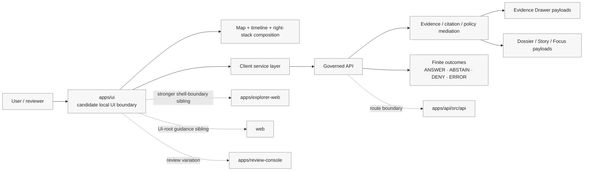

<!-- [KFM_META_BLOCK_V2]
doc_id: kfm://doc/<NEEDS_UUID>
title: KFM UI Path Boundary
type: standard
version: v1
status: review
owners: @bartytime4life
created: <NEEDS_VERIFICATION_DATE>
updated: <NEEDS_VERIFICATION_DATE>
policy_label: public
related: [../README.md, ../explorer-web/README.md, ../review-console/README.md, ../governed-api/README.md, ../api/README.md, ../api/src/api/README.md, ../api/tests/README.md, ../../README.md, ../../web/README.md, ../../contracts/README.md, ../../policy/README.md, ../../tests/README.md, ../../.github/CODEOWNERS, ../../.github/PULL_REQUEST_TEMPLATE.md]
tags: [kfm, apps, ui]
notes: [Current public main now lists `apps/ui/` in `apps/README.md` and carries a strengthened `web/README.md`; runtime ownership between `apps/ui/`, `apps/explorer-web/`, and `web/` still needs branch-level reconciliation before this path is treated as a settled runtime root.]
[/KFM_META_BLOCK_V2] -->

# KFM UI Path Boundary

Docs-first boundary README for `apps/ui/` while runtime ownership between the placeholder UI path, the explorer shell, and the UI-root `web/` lane is reconciled.

> **Status:** `experimental`  
> **Owners:** `@bartytime4life`  
> **Path:** `apps/ui/README.md`  
> **Repo fit:** directory README for the current `apps/ui/` path inside `apps/`; today it is still a routing and truth-boundary document before it is a runtime inventory.
>
> 
> 
> 
> 
> 
>
> **Quick jumps:** [Scope](#scope) · [Repo fit](#repo-fit) · [Accepted inputs](#accepted-inputs) · [Exclusions](#exclusions) · [Directory tree](#directory-tree) · [Quickstart](#quickstart) · [Usage](#usage) · [Diagram](#diagram) · [Tables](#tables) · [Task list](#task-list) · [FAQ](#faq) · [Appendix](#appendix)

> [!IMPORTANT]
> Current public `main` proves `apps/ui/` exists and is still **`README.md`-only**. It also now proves three nearby facts that this file must reflect honestly: `apps/README.md` lists `ui/` as a placeholder child path, `apps/explorer-web/README.md` is the stronger shell-boundary sibling, and `web/README.md` is now a stronger UI-root guidance surface. Treat framework choice, manifests, source files, tests, fixtures, and final runtime ownership between `apps/ui/`, `apps/explorer-web/`, and `web/` as **NEEDS VERIFICATION** until the checked-out branch proves them.

> [!CAUTION]
> This file should not become a second, conflicting shell manual. Where branch reality still routes concrete shell behavior through `apps/explorer-web/` or `web/`, this README should stay narrow, honest, and explicit about that boundary.

## Scope

`apps/ui/` is a repo-visible UI path with a currently minimal public-main footprint. This README therefore does two jobs:

1. record the **CONFIRMED** current boundary of the path as it exists today
2. state what would belong here **if** a working branch turns `apps/ui/` into a real runtime surface

KFM’s broader UI law still applies here:

- the shell is map-first and time-aware
- the interface is part of the evidence chain, not decorative chrome
- browser-facing surfaces should consume governed APIs rather than canonical/internal stores
- Focus behavior remains bounded and evidence-linked
- review is a shell variation, not a detached admin universe
- 2D is the default operating surface; 3D is conditional and must inherit the same trust objects

In practice, this means `apps/ui/` should own composition and rendering behavior only when that ownership is directly proven by the branch. It should never silently absorb truth authority, policy authority, or release authority.

[Back to top](#kfm-ui-path-boundary)

## Repo fit

### Current public snapshot

| Item | Current reading |
|---|---|
| `apps/ui/` path | **CONFIRMED** repo-visible path |
| Current inventory under `apps/ui/` | **CONFIRMED** `README.md` only |
| Parent `apps/` tree | **CONFIRMED** includes `ui/` as a directory |
| Parent app-family summary | **CONFIRMED** now lists `ui/` as a placeholder child path in `apps/README.md` |
| Strongest nearby shell-boundary README | **CONFIRMED** `../explorer-web/README.md` |
| Review-shell sibling | **CONFIRMED** `../review-console/README.md` |
| Governed API sibling | **CONFIRMED** `../governed-api/README.md` |
| Nearby app-local API lane roots | **CONFIRMED** `../api/README.md`, `../api/src/api/README.md`, and `../api/tests/README.md` |
| Parallel `web/` lane | **CONFIRMED** repo-visible and now doctrine-heavy, but still not a proven singular runtime root |
| Local manifests, routes, runtime code, tests, fixtures under `apps/ui/` | **UNKNOWN** |

### Working interpretation

Until branch-local evidence proves otherwise, the safest repo-native reading is:

- `apps/ui/` is presently a **routing / reconciliation boundary** and a path-local placeholder
- `../explorer-web/README.md` is the stronger current sibling for concrete shell-boundary guidance
- `../../web/README.md` is now a stronger UI-root guidance surface, but not yet proof that `web/` is the sole runtime root
- `../review-console/README.md` remains the reviewer/steward shell variant
- `../governed-api/README.md`, `../api/README.md`, and `../api/src/api/README.md` remain the right place for API and route-boundary claims

### Upstream and downstream links

| Relationship | Path | Why it matters |
|---|---|---|
| Parent app subtree | [`../README.md`](../README.md) | runtime-facing app boundary and sibling map |
| Root repo posture | [`../../README.md`](../../README.md) | repo-wide identity, truth posture, and lane structure |
| Closest current shell sibling | [`../explorer-web/README.md`](../explorer-web/README.md) | strongest current public shell-boundary README |
| Review-shell sibling | [`../review-console/README.md`](../review-console/README.md) | review, moderation, and steward-facing shell variation |
| Governed API boundary | [`../governed-api/README.md`](../governed-api/README.md) | client-facing API trust membrane |
| App-local API lane root | [`../api/README.md`](../api/README.md) | app-root routing for the `apps/api/` subtree |
| Deeper API surface | [`../api/src/api/README.md`](../api/src/api/README.md) | route and surface-contract context |
| App-local API tests | [`../api/tests/README.md`](../api/tests/README.md) | nearby verification surface inside `apps/api/` |
| Shared contracts | [`../../contracts/README.md`](../../contracts/README.md) | contract families and schema-facing expectations |
| Shared policy lane | [`../../policy/README.md`](../../policy/README.md) | policy bundles, decision logic, and gates |
| Shared verification lane | [`../../tests/README.md`](../../tests/README.md) | verification surface and test organization |
| Parallel UI-root guidance lane | [`../../web/README.md`](../../web/README.md) | browser-boundary and UI-root guidance surface |
| Ownership marker | [`../../.github/CODEOWNERS`](../../.github/CODEOWNERS) | current public ownership signal |
| Review expectations | [`../../.github/PULL_REQUEST_TEMPLATE.md`](../../.github/PULL_REQUEST_TEMPLATE.md) | evidence, docs, risk, and verification expectations |

[Back to top](#kfm-ui-path-boundary)

## Accepted inputs

This file accepts material that is specifically about the `apps/ui/` path and its verified relationship to the rest of the repo.

| Accept here | Notes |
|---|---|
| app-local UI boundary notes | what this path owns, and what it explicitly does not own |
| shell-composition notes tied to this path | only when the branch actually places that shell code here |
| trust-visible rendering rules | freshness, policy, evidence, review, and negative-state cues |
| client service-layer notes | governed API mediation, request envelopes, response handling |
| path-local contract adapters | view-state payloads, Focus response handling, Evidence Drawer payload usage |
| verified directory inventory | actual subtree files, entrypoints, tests, fixtures, configs |
| branch-local quickstart commands | only after toolchain and runtime files are directly present |
| README reconciliation notes | when ownership between `apps/ui/`, `apps/explorer-web/`, and `web/` changes |

## Exclusions

Keep the path narrow. The following do **not** belong here by default.

| Do not place here | Put it here instead |
|---|---|
| canonical truth mutation rules | [`../../README.md`](../../README.md) and doctrinal architecture docs |
| policy bundle authoring or OPA rule design | [`../../policy/README.md`](../../policy/README.md) |
| shared contract family definitions | [`../../contracts/README.md`](../../contracts/README.md) |
| route-by-route API claims | [`../api/src/api/README.md`](../api/src/api/README.md) |
| source onboarding, ingestion, promotion, receipts | ingest / catalog / runbook lanes, not this UI boundary |
| detached assistant UX that bypasses evidence | do not add; Focus remains governed and bounded |
| duplicate shell doctrine already owned by sibling surface docs | route to [`../explorer-web/README.md`](../explorer-web/README.md) or [`../../web/README.md`](../../web/README.md) unless ownership moves |
| speculative framework or startup instructions | wait until the branch proves manifests and entrypoints |
| direct browser calls to canonical/internal stores or model runtimes | always route through governed API boundaries |
| stale carry-forward claims that `../../web/README.md` is still placeholder-only | remove them; public docs now treat it as a stronger UI-root guidance surface |

## Directory tree

### Current public-main snapshot

```text
apps/
├── README.md
├── api/
│   ├── README.md
│   ├── src/
│   │   ├── README.md
│   │   └── api/
│   │       └── README.md
│   └── tests/
│       └── README.md
├── cli/
│   └── README.md
├── explorer-web/
│   └── README.md
├── governed-api/
│   └── README.md
├── review-console/
│   └── README.md
├── ui/
│   └── README.md
└── workers/
    └── README.md
```

### Proposed local subtree if this path becomes real

The shape below is **PROPOSED / NEEDS VERIFICATION**. It is a guardrail, not a claim about current repo state.

```text
apps/ui/
├── README.md
├── package.json                  # NEEDS VERIFICATION
├── src/                          # PROPOSED
│   ├── app/
│   ├── components/
│   ├── services/
│   ├── contracts/
│   └── __tests__/
├── public/                       # PROPOSED
└── fixtures/                     # PROPOSED
```

> [!NOTE]
> If a working branch adds runtime files here, update this README in the same PR so the tree, quickstart, and usage sections stay truthful.

[Back to top](#kfm-ui-path-boundary)

## Quickstart

### 1. Inspect the live path before editing claims

```bash
git rev-parse --short HEAD 2>/dev/null || true
find apps -maxdepth 3 -type f -name "README.md" | sort
find apps/ui -maxdepth 3 -print 2>/dev/null || true
```

### 2. Reconcile nearby shell and API vocabulary

```bash
grep -RInE 'Evidence Drawer|Focus Mode|MapLibre|RuntimeResponseEnvelope|CorrectionNotice|audit_ref|ViewState|Citation' \
  apps web docs contracts policy tests 2>/dev/null | sed -n '1,240p'
```

### 3. Upgrade this README only after branch-local proof appears

Use the following sequence:

1. confirm real files exist under `apps/ui/`
2. inspect manifests, runtime entrypoints, and test roots
3. replace placeholder tree with exact inventory
4. add only the commands that are directly runnable from that branch
5. reconcile sibling links in the same PR if path ownership changes

### 4. Keep review evidence close to the doc change

When changing this file, include:

- what became **CONFIRMED**
- what remains **UNKNOWN**
- which sibling doc or lane was affected
- whether any prior link now needs supersession or correction

## Usage

### Boundary-first operating rule

Use `apps/ui/README.md` in one of three modes:

1. **Routing mode**  
   When `apps/ui/` is still README-only, keep this file as a narrow routing and reconciliation boundary.

2. **Runtime mode**  
   When a branch proves real UI code exists here, expand this file into a local runtime README with verified startup, structure, and test guidance.

3. **Handoff mode**  
   If this path is intentionally superseded by another surface, keep a short handoff note here and route readers to the winning path rather than leaving drift behind.

### Runtime rules if this path becomes active

If `apps/ui/` becomes a real runtime surface, preserve these constraints:

- browser traffic reads through governed APIs
- Evidence Drawer payloads stay inspectable
- Focus outcomes remain finite and visible: `ANSWER`, `ABSTAIN`, `DENY`, `ERROR`
- freshness, policy, review, and correction cues render in place
- 3D remains conditional and inherits the same trust objects as 2D
- no hidden direct write path to canonical or unpublished stores

### Do not let this path silently own more than it proves

The path may eventually own rendering, composition, interaction continuity, and client-side service orchestration. It should not quietly absorb:

- evidence resolution authority
- policy decision authority
- release or correction authority
- source onboarding or ingestion logic
- direct model-runtime control paths

### Neighboring doc rule

Where browser-boundary rules are already stronger in `../../web/README.md`, link there instead of cloning them here. Where shell choreography and runtime-surface framing are already stronger in `../explorer-web/README.md`, link there instead of re-explaining them here.

## Diagram


```mermaid
flowchart LR
    U[User / reviewer] --> UI[apps/ui<br/>candidate local UI boundary]
    UI --> SHELL[Map + timeline + right-stack composition]
    UI --> SVC[Client service layer]
    SVC --> GAPI[Governed API]
    GAPI --> EV[Evidence / citation / policy mediation]
    GAPI --> OUT[Finite outcomes<br/>ANSWER · ABSTAIN · DENY · ERROR]
    EV --> ED[Evidence Drawer payloads]
    EV --> DS[Dossier / Story / Focus payloads]

    UI -. stronger shell-boundary sibling .-> EX[apps/explorer-web]
    UI -. UI-root guidance sibling .-> WEB[web]
    UI -. review variation .-> RC[apps/review-console]
    GAPI -. route boundary .-> API[apps/api/src/api]

    classDef soft fill:#f7f7f7,stroke:#888,color:#222;
    class UI,SHELL,SVC,GAPI,EV,OUT,ED,DS,EX,WEB,RC,API,U soft;
```

### Reading the diagram

- `apps/ui/` is modeled here as a **candidate boundary**, not a proven current runtime root.
- The service layer is explicit because client code should not bypass the governed API.
- Evidence Drawer, Dossier, Story, and Focus payloads sit on the same trust substrate.
- `web/README.md` now reads as a stronger UI-root guidance surface, while `apps/explorer-web/README.md` remains the stronger shell-boundary sibling.
- Review is a sibling shell variation, not a separate epistemic system.

[Back to top](#kfm-ui-path-boundary)

## Tables

### Ownership and routing matrix

| Concern | Owning path now | Reading rule |
|---|---|---|
| repo-wide identity and trust posture | [`../../README.md`](../../README.md) | start here for system-level meaning |
| app-subtree runtime map | [`../README.md`](../README.md) | use as parent boundary |
| strongest current public shell-boundary doc | [`../explorer-web/README.md`](../explorer-web/README.md) | use for shell-boundary and choreography claims unless branch-local proof moves ownership |
| review / stewardship shell | [`../review-console/README.md`](../review-console/README.md) | review is shell variation |
| governed client API edge | [`../governed-api/README.md`](../governed-api/README.md) | browser-to-runtime trust membrane |
| deeper route/API boundary | [`../api/src/api/README.md`](../api/src/api/README.md) | route and contract context |
| UI-root browser guidance surface | [`../../web/README.md`](../../web/README.md) | use for browser-boundary rules, but do not treat as exclusive runtime authority until reconciliation |
| this path itself | [`./README.md`](./README.md) | current local routing, placeholder, and reconciliation boundary |

### Trust-visible cue set for any future active UI under this path

| Cue family | Minimum expectation |
|---|---|
| time | visible time scope, chronology anchor, or as-of context |
| freshness | stale / partial / source-dependent cues render in place |
| evidence | consequential claims stay one hop from inspectable evidence |
| policy | rights, sensitivity, generalization, or review state remain visible |
| negative outcomes | deny / abstain / unavailable states are explicit, not silent |
| correction | visible correction or replacement path when outward meaning changes |
| accessibility | trust cues are not color-only and remain testable |

### Truth posture used in this file

| Label | How it is used here |
|---|---|
| **CONFIRMED** | directly supported by the current visible repo or adjacent docs |
| **INFERRED** | small structural completion strongly implied by nearby evidence |
| **PROPOSED** | recommended local shape if this path becomes active |
| **UNKNOWN** | not verified strongly enough from current public evidence |
| **NEEDS VERIFICATION** | review flag before merge-time upgrade to settled fact |

## Task list

- [ ] Confirm whether `apps/ui/` is intended to stay placeholder-only, become a runtime root, or remain a routing handoff to `apps/explorer-web/` or `web/`.
- [ ] Keep `apps/README.md`, `apps/ui/README.md`, `apps/explorer-web/README.md`, and `web/README.md` synchronized when ownership changes.
- [ ] Decide whether `web/README.md` is guidance-only, the winning UI-root, or a doc that should eventually hand off to `apps/explorer-web/`.
- [ ] If code exists on the working branch, replace the proposed subtree with the exact verified file inventory.
- [ ] Add verified quickstart commands only after manifests and entrypoints are directly visible.
- [ ] Keep client service-layer notes explicit if this path starts calling governed APIs.
- [ ] Add local verification surfaces when real code appears: accessibility checks, trust-cue rendering checks, negative-state checks, and Evidence Drawer drill-through.
- [ ] Update sibling READMEs in the same PR if path ownership changes.

### Definition of done

This README is in a good state when:

- it does not overclaim current repo reality
- a maintainer can tell exactly what `apps/ui/` does today
- a contributor knows where to route UI work if this path is still thin
- any future branch that makes this path real has a clear checklist for upgrading the README
- neighboring docs tell one consistent UI-boundary story

## FAQ

### Is `apps/ui/` the active explorer shell?

**UNKNOWN** on current public main. The stronger current shell-boundary README is [`../explorer-web/README.md`](../explorer-web/README.md), while `apps/ui/` is currently README-only.

### How should `../../web/README.md` be treated now?

As a stronger **UI-root guidance surface**, not as a placeholder. It now carries substantial browser-boundary doctrine. What it still does **not** prove on its own is that `web/` is the singular runtime root for the active branch.

### Can this path talk directly to stores, indexes, or model runtimes?

No. If `apps/ui/` becomes active, it should still read through governed API boundaries and inherit the same evidence, policy, and review constraints as the rest of the shell.

### Should 3D behavior be documented here?

Only if this path actually owns the relevant runtime code. Even then, 3D remains conditional, inherits the same trust objects, and should not be documented as a separate truth system.

## Appendix

<details>
<summary><strong>Current reconciliation backlog</strong></summary>

### Tension register

| Tension | Why it matters |
|---|---|
| `apps/ui/` exists as a README-only child while `apps/explorer-web/` and `web/` are both stronger doctrinal docs | three UI-boundary docs can drift if ownership is not named explicitly |
| `apps/README.md` now lists `ui/` as a placeholder child path | one earlier ambiguity is closed, but synchronization pressure is higher |
| `web/README.md` is now substantial while active runtime-root authority still needs verification | stronger guidance no longer equals settled ownership |
| `apps/explorer-web/README.md` is concrete while `apps/ui/` remains thin | suggests the stronger live shell story currently lives elsewhere |

### Safe next move

The smallest safe next move is not a speculative runtime rewrite. It is a reconciliation pass:

1. verify the working branch tree
2. name one authoritative UI-root / shell-boundary story
3. downgrade all others to routing docs or upgrade them with real inventory
4. keep sibling links synchronized in the same PR

</details>

<details>
<summary><strong>What to add first if this path becomes real</strong></summary>

1. exact file tree  
2. verified toolchain and startup commands  
3. service-layer and API-boundary notes  
4. local test / fixture inventory  
5. trust-visible rendering rules tied to actual components  
6. path-local contract adapter examples  
7. screenshots or diagrams only after structure is stable  

</details>

[Back to top](#kfm-ui-path-boundary)
