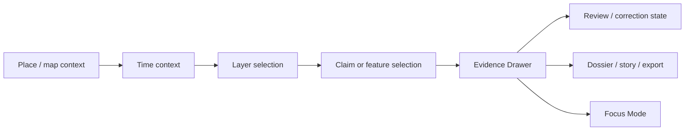
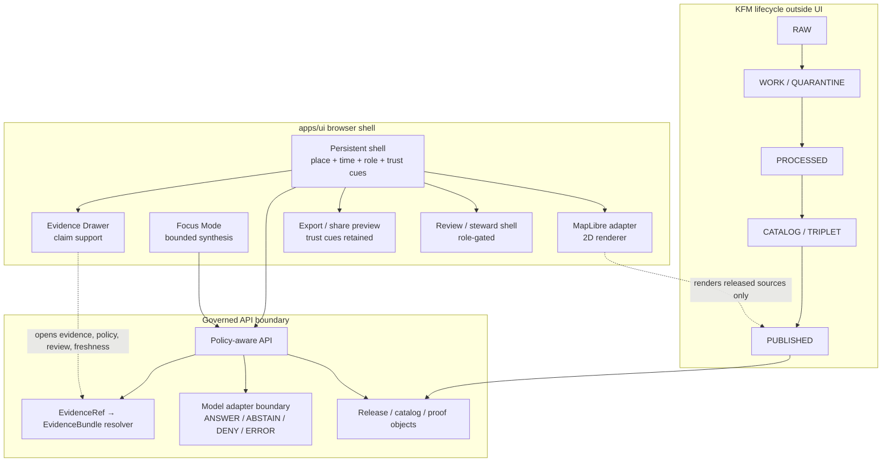

<!-- [KFM_META_BLOCK_V2]
doc_id: TODO: kfm://doc/<uuid> — NEEDS VERIFICATION
title: apps/ui — KFM Governed Map Shell
type: standard
version: v1
status: draft
owners: TODO: UI / platform owners — NEEDS VERIFICATION
created: TODO: verify existing file history or set on first committed version
updated: 2026-04-25
policy_label: TODO: public|restricted — NEEDS VERIFICATION
related: [TODO: verify repo-relative architecture docs, API contracts, schema registry, policy docs, and adjacent READMEs]
tags: [kfm, ui, maplibre, evidence-drawer, focus-mode]
notes: [Draft generated from attached KFM doctrine; target repository was not mounted during authoring; verify package manager, owners, paths, adjacent docs, and local conventions before merge.]
[/KFM_META_BLOCK_V2] -->

# apps/ui — KFM Governed Map Shell

The UI app is the map-first, time-aware, evidence-visible front door for KFM, constrained to governed APIs and released artifacts.

> [!IMPORTANT]
> **Status:** experimental  
> **Owners:** TODO: UI / platform owners — **NEEDS VERIFICATION**  
> **Path:** `apps/ui/`  
> **Merge posture:** draft README until the real repo tree, package manager, tests, and adjacent docs are inspected.


**Quick jumps:** [Scope](#scope) · [Repo fit](#repo-fit) · [Inputs](#inputs) · [Exclusions](#exclusions) · [Directory tree](#directory-tree) · [Architecture](#architecture) · [State ownership](#state-ownership) · [Quickstart](#quickstart) · [Definition of done](#definition-of-done) · [FAQ](#faq)

---

## Read first

This README is intentionally governance-bound.

**CONFIRMED:** KFM doctrine treats the interface as part of the evidence chain, trust model, and governed publication path.

**NEEDS VERIFICATION:** the authoring session did not expose the mounted KFM repository. The existing `apps/ui` implementation, package manager, component names, route tree, tests, CI workflows, local README conventions, and owner metadata remain **UNKNOWN** until inspected in the real checkout.

**Practical consequence:** this file should orient maintainers without pretending that implementation details are confirmed. Replace TODOs only after inspecting the real repo.

---

## Scope

`apps/ui/` is the expected home for the KFM browser-facing governed shell.

It should contain, or link to, the UI implementation that lets public users, expert users, classroom users, stewards, and operators move through one coordinated evidence flow:


```mermaid
flowchart LR
  Place[Place / map context] --> Time[Time context]
  Time --> Layer[Layer selection]
  Layer --> Claim[Claim or feature selection]
  Claim --> Drawer[Evidence Drawer]
  Drawer --> Review[Review / correction state]
  Drawer --> Story[Dossier / story / export]
  Drawer --> Focus[Focus Mode]
```

The shell must keep geography, time, release context, evidence state, policy posture, review state, and correction status visible at the point of use.

This directory is not just visual chrome. It is where KFM’s governed interaction rules become inspectable UI behavior.

[Back to top](#appsui--kfm-governed-map-shell)

---

## Repo fit

| Fit item | Status | Expected role |
| --- | --- | --- |
| Path | **CONFIRMED from task** | `apps/ui/README.md` documents the UI app directory requested for this project. |
| Upstream data boundary | **CONFIRMED doctrine / NEEDS VERIFICATION implementation** | UI consumes governed API responses, released layer artifacts, resolver outputs, and trust payloads. |
| Downstream users | **CONFIRMED doctrine / NEEDS VERIFICATION implementation** | Public, expert, classroom, steward, operator, review, compare, story, export, and Focus surfaces. |
| Adjacent docs | **UNKNOWN** | TODO: link verified architecture, API, policy, schema, and design docs after repo inspection. |
| Adjacent contracts | **PROPOSED / NEEDS VERIFICATION** | Expected contract families include `LayerManifest`, `EvidenceDrawerPayload`, `FocusModePayload`, `RuntimeResponseEnvelope`, `EvidenceBundle`, and release metadata. |
| Adjacent services | **UNKNOWN** | TODO: link the governed API app/package after route and package names are verified. |
| Build/test system | **UNKNOWN** | TODO: add repo-native install, dev, lint, test, and typecheck commands after package manager inspection. |

> [!WARNING]
> Do not add links to guessed paths. Add repo-relative links only after confirming they exist from `apps/ui/`.

---

## Inputs

The UI accepts only inputs that can preserve KFM’s trust membrane.

| Accepted input | Belongs here when… | Notes |
| --- | --- | --- |
| Released layer metadata | It carries source, layer, time, freshness, policy, review, and evidence routing context. | Style JSON alone is not enough. |
| MapLibre runtime configuration | It is renderer configuration, not canonical truth. | Renderer state must stay subordinate to shell and evidence state. |
| Evidence Drawer payloads | They resolve a claim, feature, layer, Focus answer, story node, or export into inspectable support. | Payload shape is **NEEDS VERIFICATION** until schema home is confirmed. |
| EvidenceRef / EvidenceBundle resolver output | It was retrieved through a governed API and is public-safe for the active role. | Loose pasted citations are not sufficient for consequential claims. |
| Focus Mode envelopes | They use finite outcomes: `ANSWER`, `ABSTAIN`, `DENY`, or `ERROR`. | Focus is evidence-bounded, not a free-form chatbot. |
| Dossier, story, compare, and export payloads | They preserve trust cues, release state, policy posture, and correction lineage. | Export must not strip governance context. |
| Browser/session view state | It represents camera, filters, selected tab, layout, or non-authoritative UI preference. | View state is not authoritative evidence. |

---

## Exclusions

The following do **not** belong in `apps/ui/`.

| Excluded item | Where it belongs instead | Reason |
| --- | --- | --- |
| `RAW`, `WORK`, or `QUARANTINE` data | Governed data lifecycle storage and processing lanes. | Public UI must not read unpublished or unresolved material. |
| Canonical/internal stores | Backend governed services and canonical data packages. | Browser clients are not canonical truth clients. |
| Source harvesters, watchers, and live connectors | Pipeline, ingestion, source registry, or domain-lane packages. | UI should not activate or normalize sources. |
| Policy decisions as client-only logic | Backend policy gates and release/promotion paths. | Client-side policy can display decisions, not create authoritative release state. |
| Secrets, tokens, credentials, private endpoints | Secret manager / deployment configuration. | Never place secrets in UI source, payload fixtures, receipts, logs, or screenshots. |
| Direct model-runtime calls | Governed API model adapter boundary. | No direct browser calls to Ollama, OpenAI-compatible endpoints, or local model APIs. |
| Uncited generated text | Governed Focus / synthesis response envelope after citation validation. | Model text is interpretive, not root truth. |
| Exact sensitive locations without release approval | Redaction/generalization pipeline and steward-reviewed release path. | Sensitive geometry fails closed. |
| 3D spectacle-first surfaces | Conditional story/scene lane after 2D trust parity is met. | KFM is 2D-first; 3D must carry evidence burden. |

[Back to top](#appsui--kfm-governed-map-shell)

---

## Directory tree

**NEEDS VERIFICATION:** the real `apps/ui/` tree was not available during this README pass.

Use the following as a review scaffold, not as a claim that these files already exist.

```text
apps/ui/
├── README.md                         # This orientation file.
├── package.json                      # NEEDS VERIFICATION.
├── src/                              # NEEDS VERIFICATION.
│   ├── shell/                        # PROPOSED: persistent KFM shell.
│   ├── map/                          # PROPOSED: MapLibre adapter boundary.
│   ├── layers/                       # PROPOSED: layer registry bindings.
│   ├── evidence-drawer/              # PROPOSED: Evidence Drawer surface.
│   ├── focus/                        # PROPOSED: governed Focus Mode surface.
│   ├── review/                       # PROPOSED: steward/review shell variation.
│   ├── export/                       # PROPOSED: export/share preview surface.
│   └── trust-state/                  # PROPOSED: chips, banners, finite outcomes.
├── tests/                            # NEEDS VERIFICATION.
└── docs/                             # NEEDS VERIFICATION.
```

If local convention differs, update this section rather than forcing the repo to match this scaffold.

---

## Architecture

The UI should behave like a governed operating field, not a disconnected map widget.


```mermaid
flowchart TB
  subgraph Browser["apps/ui browser shell"]
    Shell["Persistent shell<br/>place + time + role + trust cues"]
    Map["MapLibre adapter<br/>2D renderer"]
    Drawer["Evidence Drawer<br/>claim support"]
    Focus["Focus Mode<br/>bounded synthesis"]
    Export["Export / share preview<br/>trust cues retained"]
    Review["Review / steward shell<br/>role-gated"]
  end

  subgraph GovernedAPI["Governed API boundary"]
    API["Policy-aware API"]
    Resolver["EvidenceRef → EvidenceBundle resolver"]
    Runtime["Model adapter boundary<br/>ANSWER / ABSTAIN / DENY / ERROR"]
    Release["Release / catalog / proof objects"]
  end

  subgraph DataLifecycle["KFM lifecycle outside UI"]
    Raw["RAW"]
    Work["WORK / QUARANTINE"]
    Processed["PROCESSED"]
    Catalog["CATALOG / TRIPLET"]
    Published["PUBLISHED"]
  end

  Raw --> Work --> Processed --> Catalog --> Published --> Release
  Shell --> API
  API --> Resolver
  API --> Release
  Focus --> API
  API --> Runtime
  Shell --> Drawer
  Shell --> Map
  Shell --> Export
  Shell --> Review
  Map -.renders released sources only.-> Published
  Drawer -.opens evidence, policy, review, freshness.-> Resolver
```

### Boundary rules

| Boundary | Rule |
| --- | --- |
| Shell → MapLibre | The shell owns KFM meaning; MapLibre draws frames and exposes interaction hooks. |
| Shell → governed API | Consequential claims, Focus results, evidence, release status, and policy state come from governed interfaces. |
| UI → canonical data | No direct access. UI uses released artifacts and governed APIs. |
| Focus → model runtime | No direct browser model calls. Runtime is a provider-neutral adapter behind the governed API. |
| Export/share → public | Outward artifacts retain trust cues, release state, policy context, and correction status. |

[Back to top](#appsui--kfm-governed-map-shell)

---

## Operating rules

### 1. Map-first does not mean map-only

The map is the spatial operating field. It is not the evidence system by itself.

Every consequential map interaction must be able to move toward support, uncertainty, policy posture, review state, and correction lineage.

### 2. Time is coequal with place

Time filters, freshness cues, release age, temporal support, and comparison state must be visible where meaning changes.

### 3. Trust cues travel with claims

Use compact, persistent cues for:

| Cue family | What it signals |
| --- | --- |
| Scope | Active place, time, layer, role, or audience lane. |
| Freshness | Recency, staleness, release age, or time-basis caveat. |
| Evidence state | Direct, partial, disputed, missing, source-dependent, or unavailable support. |
| Rights / sensitivity | Public-safe, restricted, generalized, redacted, internal, or review-required. |
| Review state | Draft, quarantined, reviewed, promoted, stale, superseded, withdrawn. |
| Knowledge character | Observed, documentary, derived, modeled, generalized, source-dependent. |
| AI participation | Model-assisted language is present and subordinate to evidence. |

### 4. Negative states are first-class

The UI must render refusal and uncertainty clearly.

| Outcome | UI meaning |
| --- | --- |
| `ANSWER` | A bounded answer is supported by cited evidence in the active scope. |
| `ABSTAIN` | KFM has insufficient admissible evidence for the requested claim. |
| `DENY` | Policy, sensitivity, role, rights, or release state blocks the request. |
| `ERROR` | A recoverable or reportable system failure occurred. |

### 5. 2D is the default operating surface

Controlled 3D may be introduced only when it answers a burden-bearing question and preserves the same evidence, policy, review, rollback, and drawer parity as 2D.

---

## State ownership

| State family | Owner | UI may do | UI must not do |
| --- | --- | --- | --- |
| Camera, viewport, selected tab, panel layout | Browser shell | Store as view/session state or deep-link state. | Treat it as canonical record state. |
| MapLibre frame/runtime state | Map adapter | Render released sources and handle interaction events. | Own policy, evidence, or release truth. |
| Layer business meaning | Governed layer metadata | Display labels, trust chips, time semantics, and evidence routes. | Hide semantics inside style expressions only. |
| Evidence support | Evidence resolver / governed API | Render Evidence Drawer payloads and drill-through actions. | Invent support locally. |
| Focus results | Governed API / model adapter | Display finite outcomes, citations, scope echo, and audit refs. | Call model endpoints directly or show uncited generated claims. |
| Review and correction state | Review/promotion system | Surface role-safe status, queues, diffs, obligations, and routes. | Create hidden admin truth systems with different evidence law. |
| Published artifacts | Release/catalog/proof system | Render released layers, stories, exports, and proof references. | Publish by client-side file move or unchecked export. |

---

## Surface responsibilities

| Surface | Must do | Must never do |
| --- | --- | --- |
| Explore map | Maintain place, time, layer, role, and trust context while users navigate. | Let visual smoothness imply authority. |
| Layer panel | Show source role, knowledge character, freshness, policy, review, and evidence route. | Treat a MapLibre layer ID as proof of publication readiness. |
| Evidence Drawer | Resolve claims and selected features into evidence, scope, rights, sensitivity, provenance, review, and audit context. | Behave like an optional tooltip or developer-only appendix. |
| Focus Mode | Provide evidence-bounded synthesis with explicit finite outcomes. | Operate as a sovereign free-form chatbot. |
| Dossier / story | Preserve geographic anchor, time scope, evidence, and release context across narrative movement. | Convert derived narrative into canonical truth. |
| Review / steward | Expose queues, diffs, obligations, correction controls, and role-gated actions. | Become a hidden truth system with different rules. |
| Compare | Preserve asymmetry between compared states, including time, support, and release context. | Flatten distinct states into a single simplified summary. |
| Export / share | Preview outward artifacts with trust cues, policy context, release state, and provenance intact. | Strip correction, redaction, or generalization context. |
| Controlled 3D | Carry the same Evidence Drawer, policy, and rollback model as 2D. | Turn KFM into a spectacle-first 3D shell. |

[Back to top](#appsui--kfm-governed-map-shell)

---

## Quickstart

**NEEDS VERIFICATION:** package manager, framework, scripts, and local app commands are unknown.

Run these from the repository root after mounting the real checkout.

```bash
# Confirm the target path exists.
find apps/ui -maxdepth 2 -type f | sort

# Identify package-manager and framework signals without assuming them.
find . -maxdepth 3 \
  \( -name package.json \
  -o -name pnpm-lock.yaml \
  -o -name yarn.lock \
  -o -name package-lock.json \
  -o -name vite.config.* \
  -o -name next.config.* \
  -o -name tsconfig.json \
  -o -name vitest.config.* \
  -o -name playwright.config.* \) \
  -print | sort

# Inspect declared scripts before running them.
test -f apps/ui/package.json && cat apps/ui/package.json
```

After inspection, update this section with the repo-native commands:

```bash
# TODO: replace after verification.
# <package-manager> install
# <package-manager> --filter <ui-package> dev
# <package-manager> --filter <ui-package> test
# <package-manager> --filter <ui-package> lint
# <package-manager> --filter <ui-package> typecheck
```

> [!CAUTION]
> Do not add destructive cleanup, database, publish, deploy, or source-fetch commands to this README unless they are gated, documented, and clearly marked.

---

## Usage

### Adding a UI feature

1. Start with the trust payload or contract, not the component.
2. Identify the active place, time, role, release, and policy scope.
3. Confirm the surface uses governed API data or released artifacts only.
4. Add visible negative states: `ABSTAIN`, `DENY`, and `ERROR`, not just happy-path `ANSWER`.
5. Add Evidence Drawer routing for consequential claims.
6. Add tests for support, unsupported, policy-denied, stale, and loading states.
7. Update this README or adjacent docs if the feature changes the shell boundary.

### Adding a MapLibre layer

1. Confirm the layer is backed by released source metadata or a reviewed fixture.
2. Keep style/source/rendering separate from evidence and policy semantics.
3. Bind the rendered feature to a stable evidence route where claims are made.
4. Show source role, knowledge character, time basis, freshness, review state, and sensitivity posture in UI metadata.
5. Verify no restricted geometry is rendered beyond the approved precision.

### Adding Focus behavior

1. Use a governed API envelope.
2. Echo scope before the answer.
3. Require citations or return `ABSTAIN`.
4. Return `DENY` when policy, role, rights, or sensitivity blocks a request.
5. Record audit references where the backend contract requires them.
6. Re-highlight cited map evidence only through released, public-safe geometry.

---

## Definition of done

A UI change is not ready until the relevant checks pass.

- [ ] The change uses governed APIs or released artifacts only.
- [ ] No direct reads of `RAW`, `WORK`, `QUARANTINE`, canonical stores, or unpublished candidates.
- [ ] No direct browser calls to model-runtime endpoints.
- [ ] Trust cues remain visible where meaning changes.
- [ ] Evidence Drawer routing exists for consequential claims.
- [ ] Focus or AI-assisted content uses finite outcomes and citation validation.
- [ ] Rights, sensitivity, review, freshness, and correction state are not hidden.
- [ ] MapLibre style/source IDs are not treated as evidence or policy truth.
- [ ] Restricted or sensitive geometry fails closed.
- [ ] Tests cover at least one happy path, one unsupported evidence path, one policy denial, and one error state.
- [ ] README, contract notes, or adjacent docs are updated when behavior changes.
- [ ] Any TODO placeholders in this README touched by the change are resolved or explicitly retained with a reason.

---

## Pre-merge verification checklist

Run this checklist when converting this draft into a verified repo document.

| Check | Status |
| --- | --- |
| Confirm `apps/ui/README.md` exists or is being created intentionally. | `TODO` |
| Confirm local README conventions and metadata format. | `TODO` |
| Confirm owners and status. | `TODO` |
| Confirm policy label. | `TODO` |
| Confirm package manager and UI framework. | `TODO` |
| Confirm scripts for dev, build, lint, test, typecheck, and e2e. | `TODO` |
| Confirm governed API path and contract docs. | `TODO` |
| Confirm schema home for drawer, layer, Focus, runtime, and release payloads. | `TODO` |
| Confirm MapLibre adapter/package path. | `TODO` |
| Confirm tests and CI workflows for UI trust states. | `TODO` |
| Confirm adjacent docs and add valid repo-relative links. | `TODO` |
| Confirm no screenshots, examples, or fixtures expose sensitive locations or secrets. | `TODO` |

---

## FAQ

### Can the UI assemble truth from tiles, styles, and popups?

No. Tiles, styles, and popups can support presentation. Consequential claims must resolve through governed payloads and evidence routes.

### Can MapLibre feature state store evidence or policy decisions?

No. Feature state may support interaction and rendering. Evidence, policy, release, and review truth must come from governed contracts.

### Can Focus answer from general model knowledge?

No. Focus is evidence-bounded. It should answer only from admissible scoped evidence, otherwise it must `ABSTAIN`, `DENY`, or return `ERROR`.

### Can the UI show restricted data to stewards?

Only through role-gated governed surfaces that preserve auditability, policy posture, and sensitivity controls. Public surfaces must remain safe.

### Can this README use guessed links to likely docs?

No. Add links only after verifying the real repo paths from `apps/ui/`.

---

<details>
<summary>Appendix A — working terms</summary>

| Term | Working meaning |
| --- | --- |
| EvidenceRef | A reference that should resolve to inspectable evidence, not a loose pasted citation. |
| EvidenceBundle | The inspectable support package for a claim, feature, layer, Focus result, story, or export. |
| Evidence Drawer | Mandatory trust surface that explains what backs a claim and how it may be used. |
| Focus Mode | Evidence-bounded synthesis surface with finite outcomes. |
| LayerManifest | Proposed layer metadata contract binding visual layer behavior to source, time, policy, review, freshness, and evidence route. |
| RuntimeResponseEnvelope | Proposed finite response envelope for governed AI/model-assisted outputs. |
| Trust membrane | Boundary preventing public/UI surfaces from bypassing evidence, policy, review, and release state. |
| Renderer boundary | Separation between MapLibre rendering mechanics and KFM truth, evidence, policy, and release semantics. |
| Published artifact | A released, governed output suitable for public or role-safe consumption. |
| Derived surface | Rebuildable view such as tile, search index, graph projection, summary, story, or scene; not sovereign truth. |

</details>

<details>
<summary>Appendix B — README maintenance notes</summary>

Keep this README short enough to remain useful as a directory landing page. Move detailed API schemas, UI component inventories, design tokens, accessibility matrices, and test harness documentation into adjacent verified docs once their paths are known.

Recommended later links after verification:

| Future link | Purpose |
| --- | --- |
| `TODO: docs/architecture/...` | Shell architecture and doctrine. |
| `TODO: schemas/contracts/v1/...` | Drawer, layer, Focus, runtime, release, and evidence contracts. |
| `TODO: contracts/api/...` | Governed API surface. |
| `TODO: policy/...` | Rights, sensitivity, publication, and no-bypass policies. |
| `TODO: tests/...` | UI trust-state fixtures and regression tests. |
| `TODO: docs/adr/...` | Schema-home, UI framework, and renderer-boundary decisions. |

</details>

[Back to top](#appsui--kfm-governed-map-shell)
