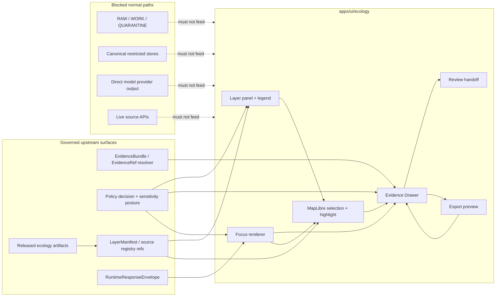

<!-- [KFM_META_BLOCK_V2]
doc_id: kfm://doc/NEEDS_VERIFICATION__apps_ui_ecology_readme_uuid
title: Ecology UI
type: standard
version: v1
status: draft
owners: NEEDS_VERIFICATION__ecology_ui_owner
created: NEEDS_VERIFICATION__YYYY-MM-DD
updated: NEEDS_VERIFICATION__YYYY-MM-DD
policy_label: NEEDS_VERIFICATION__public_or_restricted
related: [apps/ui/ecology/README.md, NEEDS_VERIFICATION__apps_ui_parent, NEEDS_VERIFICATION__governed_api_ecology_contracts, NEEDS_VERIFICATION__schemas_contracts_v1_ui]
tags: [kfm, ui, ecology, maplibre, evidence-drawer, focus-mode, geoprivacy]
notes: [Drafted from attached KFM doctrine and ecology-adjacent blueprints; mounted repo path not verified in this authoring session., Replace NEEDS_VERIFICATION placeholders with branch evidence before publication.]
[/KFM_META_BLOCK_V2] -->

<a id="top"></a>

# Ecology UI

Map-first ecology surfaces for habitat, fauna, flora, and ecological context that must stay downstream of governed evidence, policy, and release state.

> [!NOTE]
> **Status:** `experimental`  
> **Owners:** `NEEDS_VERIFICATION__ecology_ui_owner`  
> **Path:** `apps/ui/ecology/`  
>        
> **Quick jump:** [Scope](#scope) · [Repo fit](#repo-fit) · [Accepted inputs](#accepted-inputs) · [Exclusions](#exclusions) · [Directory tree](#directory-tree) · [Quickstart](#quickstart) · [Usage](#usage) · [Diagram](#diagram) · [Operating tables](#operating-tables) · [Definition of done](#task-list--definition-of-done) · [FAQ](#faq) · [Appendix](#appendix)

---

## Scope

`apps/ui/ecology/` is the proposed UI home for ecology-facing interaction surfaces: habitat context, fauna occurrence/status context, flora/vegetation context, public-safe ecological summaries, layer panels, Evidence Drawer entry points, and bounded Focus Mode renderers.

This directory should make ecology evidence **readable, inspectable, and policy-visible**. It must not become the source of ecological truth.

### Current evidence posture

| Claim | Label | Reading |
|---|---|---|
| KFM UI doctrine requires a map-first, time-aware, trust-visible shell | CONFIRMED | Use the persistent shell model and keep Evidence Drawer / Focus state visible. |
| Ecology lanes carry sensitivity and public-precision risk | CONFIRMED | Treat exact sensitive species or steward-controlled locations as restricted unless a public-safe transform is proven. |
| This exact path exists in the mounted repo | UNKNOWN | The target path is requested, but this authoring session did not expose a mounted KFM checkout. |
| Child directories listed below exist | PROPOSED | Verify branch topology before adding links, imports, tests, or route assumptions. |

> [!IMPORTANT]
> Ecology UI is a **consumer** of governed outputs. It should never read `RAW`, `WORK`, `QUARANTINE`, canonical occurrence stores, source APIs, direct model output, or proof internals as its normal path.

[Back to top](#top)

---

## Repo fit

| Surface | Path / link target | Role | Status |
|---|---|---|---|
| This directory | `apps/ui/ecology/` | Ecology-facing UI leaf for layer inspection, drawer mapping, Focus rendering, and public-safe examples. | PROPOSED path; target requested. |
| Parent UI surface | [`../README.md`](../README.md) | UI shell / app-local parent. Should own shared shell rules if present. | NEEDS VERIFICATION. |
| App family index | [`../../README.md`](../../README.md) | Higher app-level orientation. | NEEDS VERIFICATION. |
| Governed API | `NEEDS_VERIFICATION__apps/governed-api/...` | Supplies release-safe ecology payloads and EvidenceBundle references. | UNKNOWN exact path. |
| Contracts / schemas | `NEEDS_VERIFICATION__schemas/contracts/v1/...` | Owns machine-readable payload shape. | UNKNOWN exact schema home. |
| Policy | `NEEDS_VERIFICATION__policy/...` | Owns allow / deny / abstain rules, sensitivity handling, and obligations. | UNKNOWN exact policy home. |
| Tests | `NEEDS_VERIFICATION__tests/...` | Owns UI, runtime-proof, geoprivacy, and negative-state checks. | UNKNOWN exact test home. |

### Upstream / downstream rule

This directory may link upward to shell and app orientation docs after branch verification. Downstream child README files should be linked only after their directories exist, because ecology UI must not create a second documentation dialect or orphaned authority surface.

[Back to top](#top)

---

## Accepted inputs

Use this directory for UI-facing ecology materials that are already downstream of governed evidence flow:

- released ecology layer metadata, layer manifests, or drawer-ready payload notes;
- public-safe MapLibre layer configuration notes that reference released source IDs;
- Evidence Drawer mapping notes for habitat, fauna, flora, or ecology summary claims;
- Focus Mode rendering notes for `ANSWER`, `ABSTAIN`, `DENY`, and `ERROR`;
- public-safe examples, screenshots, or demo fixtures that are clearly marked illustrative;
- accessibility and interaction guidance for ecology layer panels, chips, legends, popups, comparison, and export preview;
- review / steward handoff notes that preserve the same evidence law and do not create a hidden truth system.

A file belongs here only when the main question is:

> “How should a user inspect, compare, ask about, or export ecology information without losing evidence, time, policy, review, or sensitivity context?”

[Back to top](#top)

---

## Exclusions

| Do not put this here | Better home | Why |
|---|---|---|
| Source connectors for GBIF, eBird, iNaturalist, USFWS, NatureServe, LANDFIRE, NLCD, or steward feeds | `NEEDS_VERIFICATION__pipelines/`, `packages/`, or source registry homes | Source admission is upstream governance, not UI behavior. |
| Canonical habitat, fauna, flora, taxon, occurrence, or sensitivity schemas | `NEEDS_VERIFICATION__schemas/contracts/v1/...` or repo-confirmed schema home | Machine contract authority must not live in an app README. |
| Rego / policy-as-code files | `NEEDS_VERIFICATION__policy/...` | UI may render policy decisions; it must not author them. |
| Precise restricted occurrence coordinates or before-redaction geometry | Restricted data / proof homes only | Public UI must never leak exact sensitive locations. |
| Release bundles, receipts, proof packs, signatures, or catalog closure objects | `NEEDS_VERIFICATION__data/proofs`, `data/receipts`, `release`, or catalog homes | UI displays proof references; it does not own proof memory. |
| Direct model prompts, raw model responses, or provider-specific chat UI | Governed AI runtime / Focus contract homes | Focus is bounded synthesis, not assistant sovereignty. |
| Styling-only MapLibre JSON without trust metadata | Style registry / layer registry | Style expressions cannot carry source role, review state, sensitivity, and evidence route alone. |

[Back to top](#top)

---

## Directory tree

PROPOSED shape only. Replace this tree with observed branch evidence before publication if the repo already has a different convention.

```text
apps/ui/ecology/
├── README.md
├── layers/
│   └── README.md                 # Layer panels, legends, trust chips, source/layer mappings
├── evidence/
│   └── README.md                 # Evidence Drawer mappings and drawer payload notes
├── focus/
│   └── README.md                 # Focus Mode renderer notes for finite runtime outcomes
├── review/
│   └── README.md                 # Steward/review handoff notes, if this app owns them
├── examples/
│   └── README.md                 # Public-safe illustrative demos only
└── __tests__/
    └── README.md                 # UI-local tests, if repo convention supports app-local tests
```

### File-home pressure

| Child surface | Use when | Do not use when |
|---|---|---|
| `layers/` | The change concerns MapLibre layer selection, legends, trust chips, or layer panel UX. | The change defines source admission, schema authority, or canonical data. |
| `evidence/` | The change maps a released ecology claim to Evidence Drawer fields. | The change changes EvidenceBundle shape. |
| `focus/` | The change renders bounded Focus outcomes from governed envelopes. | The change calls model providers or creates answer authority. |
| `review/` | The change opens a steward/review path without changing truth law. | The change creates a separate administrative truth regime. |
| `examples/` | The change is illustrative, public-safe, and clearly non-authoritative. | The example can be mistaken for policy, contract, or proof truth. |

[Back to top](#top)

---

## Quickstart

The exact package manager, UI framework, and test command are UNKNOWN from current-session evidence. Start with discovery, then use repo-native commands.

```bash
# Run from the real KFM checkout.
pwd
git status --short
git branch --show-current

# Verify the requested path and adjacent UI docs before editing.
test -d apps/ui/ecology && find apps/ui/ecology -maxdepth 3 -type f | sort || true
test -f apps/ui/README.md && sed -n '1,120p' apps/ui/README.md || true

# Discover UI package/tooling conventions without assuming pnpm/npm/vitest.
find apps packages -maxdepth 4 \
  \( -name package.json -o -name pnpm-lock.yaml -o -name yarn.lock -o -name package-lock.json -o -name vitest.config.* -o -name playwright.config.* \) \
  -print 2>/dev/null | sort
```

> [!CAUTION]
> Do not add package commands, import paths, route names, or test targets here until they are verified from the branch.

[Back to top](#top)

---

## Usage

### Adding a new ecology layer panel

1. Confirm the layer is released or explicitly fixture-only.
2. Confirm the layer metadata includes source role, knowledge character, freshness, review state, policy posture, and evidence route.
3. Render trust chips beside the layer name, not hidden in a secondary settings panel.
4. Wire map selection to Evidence Drawer resolution, not to a raw feature dump.
5. Add `ABSTAIN`, `DENY`, and `ERROR` rendering paths if the layer can participate in Focus or review flows.
6. Test that restricted geometry is generalized, withheld, or stubbed before it reaches UI snapshots.

### Adding a new Evidence Drawer mapping

The drawer summary should make the user’s trust question answerable at a glance:

| Drawer field family | Ecology-specific expectation |
|---|---|
| Claim / title | Plain-language ecology statement, not a layer ID alone. |
| Support | Source role, knowledge character, evidence state, and support summary. |
| Identity | EvidenceBundle / EvidenceRef, supported object ID, release or dataset version. |
| Scope | Place or geometry served, time basis, and opened-from surface. |
| Rights / sensitivity | Public-safe, restricted, generalized, redacted, or review-required posture. |
| Transform | Generalization, redaction, aggregation, model, or habitat join note. |
| Audit | Audit ref, receipt / trace ref, and authorized correction or review route. |

### Adding Focus behavior

Focus must inherit scope from the shell unless the user explicitly changes scope through a governed control. It must render finite outcomes visibly:

- `ANSWER` when released support is sufficient and policy-safe;
- `ABSTAIN` when support is missing, weak, stale, ambiguous, or unresolved;
- `DENY` when rights, sensitivity, role, or policy blocks outward detail;
- `ERROR` when validation or runtime handling fails.

Focus should not answer from unpublished evidence, direct source fetches, private coordinates, or uncited generated text.

[Back to top](#top)

---

## Diagram



[Back to top](#top)

---

## Operating tables

### Ecology UI responsibility matrix

| Surface | Must do | Must never do |
|---|---|---|
| Layer panel | Show source role, knowledge character, freshness, policy, review, and available evidence route. | Present a visual layer as canonical truth. |
| Map popup | Show public-safe summary and an Evidence Drawer entry point. | Dump raw properties or restricted fields. |
| Evidence Drawer | Explain what backs the claim, what was transformed, and what remains restricted. | Behave like a decorative tooltip or developer-only appendix. |
| Focus renderer | Show finite outcomes, citations, scope echo, audit ref, and visible obligations. | Operate as a free-form chatbot or answer outside governed scope. |
| Review handoff | Open role-gated inspection without changing evidence law. | Create a hidden administrative truth path. |
| Export preview | Preserve trust cues, sensitivity posture, and correction lineage. | Strip policy, review, freshness, or generalization context. |

### Domain pressure matrix

| Ecology area | UI pressure | Public-safe posture |
|---|---|---|
| Habitat | Habitat/context surfaces may be modeled, derived, or covariate-based. | Label modeled/derived character and keep source/version visible. |
| Fauna | Occurrences can expose protected species, nests, dens, roosts, migration corridors, or steward records. | Generalize, aggregate, redact, or deny exact geometry unless release proof permits. |
| Flora | Rare plant and sensitive site context can carry similar location risk. | Treat exact sensitive locations as restricted by default; show safe stubs when needed. |
| Cross-domain ecology | Habitat joins, occurrence support, status lists, protected areas, and model surfaces can be useful together. | Do not collapse observed, statutory, modeled, and derived support into one undifferentiated answer. |

### Runtime outcome rendering

| Outcome | UI treatment | Required visible context |
|---|---|---|
| `ANSWER` | Show answer content with trust chips and drawer entry point. | Evidence refs, source role, scope, policy, freshness, audit ref. |
| `ABSTAIN` | State insufficiency plainly without pretending precision. | Reason code, missing support category, scope controls, audit ref. |
| `DENY` | State policy-safe denial category without leaking restricted detail. | Deny reason, obligations, allowed next action, audit ref. |
| `ERROR` | State validation/runtime failure without losing shell context. | Error category, retry/refine path, audit ref when available. |

[Back to top](#top)

---

## Task list — definition of done

Before this README or child ecology UI work is treated as ready:

- [ ] Branch inspection confirms whether `apps/ui/ecology/` exists and whether parent README links are valid.
- [ ] `doc_id`, `owners`, `created`, `updated`, `policy_label`, and `related` metadata placeholders are replaced with verified values.
- [ ] The directory tree is updated from actual repo inventory or explicitly marked as proposed.
- [ ] UI code, examples, and docs consume governed API payloads only.
- [ ] No UI path fetches source APIs, canonical stores, `RAW`, `WORK`, or `QUARANTINE`.
- [ ] Evidence Drawer mappings show evidence, scope, policy, freshness, review, transform, and audit linkage.
- [ ] Focus rendering covers `ANSWER`, `ABSTAIN`, `DENY`, and `ERROR` with visually distinct states.
- [ ] Sensitive exact geometry is absent from public payloads, screenshots, stories, examples, and exports.
- [ ] Public-safe stubs are used when full preview would leak restricted detail.
- [ ] Examples are clearly labeled illustrative and cannot be mistaken for contracts, policy, or proof.
- [ ] UI tests or review checks cover no-raw-fetch, drawer availability, negative outcomes, and geoprivacy behavior.
- [ ] Any material behavior change updates this README or a linked child README.

[Back to top](#top)

---

## FAQ

### Can this directory call GBIF, eBird, iNaturalist, NatureServe, USFWS, or other source APIs?

No. Source APIs belong upstream in source admission, connector, registry, and lifecycle surfaces. This directory should consume released, governed outputs.

### Can ecology UI show exact species occurrence locations?

Only when policy, rights, source role, sensitivity, review, and release state prove that the exact location is public-safe. The default for sensitive exact locations is generalize, redact, withhold, or route to review.

### Is a MapLibre layer enough evidence?

No. A renderer can display a feature without proving that the feature is publishable. Layer metadata and EvidenceBundle resolution must remain available for consequential claims.

### Can examples live here?

Yes, if they are public-safe, clearly illustrative, and linked back to stronger owner surfaces. Examples must not become policy, contract, proof, or runtime authority.

### Can Focus summarize ecology data?

Yes, only as bounded synthesis over admissible released evidence. It must preserve scope, citations, policy, freshness, visible negative outcomes, and audit linkage.

[Back to top](#top)

---

## Appendix

<details>
<summary>Glossary</summary>

| Term | Meaning in this directory |
|---|---|
| Evidence Drawer | Mandatory trust surface for claim support, scope, rights/sensitivity, freshness, review, transform, provenance, and audit linkage. |
| EvidenceBundle | Evidence object that outranks generated text and supports reconstructable claims. |
| Focus Mode | Governed synthesis surface that inherits shell scope and emits finite outcomes. |
| LayerManifest | Released layer metadata surface that describes what a layer means and how it resolves to evidence. |
| Source role | The reason a source is allowed to support a claim, such as observed occurrence, statutory status, habitat context, or model-derived support. |
| Knowledge character | Whether a statement is observed, documentary, statutory, derived, modeled, generalized, or source-dependent. |
| Geoprivacy | Policy and transform discipline that prevents unsafe disclosure of sensitive exact locations. |
| Public-safe stub | A visible placeholder that explains restricted content exists without leaking restricted details. |

</details>

<details>
<summary>Open verification backlog</summary>

| Item | Needed evidence |
|---|---|
| Exact owner | CODEOWNERS, team roster, adjacent README ownership, or maintainer confirmation. |
| Exact parent path | Mounted repo inventory for `apps/ui/`, `apps/explorer-web/`, or equivalent shell path. |
| Schema home | ADR or repo inventory confirming `schemas/`, `contracts/`, or another canonical machine-contract home. |
| Governed API path | Route tree or OpenAPI contract proving ecology-facing runtime payload homes. |
| UI framework | Package files and source tree evidence. |
| Test command | CI workflow, package script, or test config evidence. |
| Policy label | Documented public/restricted classification for this README. |
| Child directory links | Actual directory creation or branch inventory. |

</details>

<details>
<summary>Reviewer checklist</summary>

Use this checklist during PR review:

- Does every consequential UI claim stay one hop from Evidence Drawer?
- Are place and time still visible when the user moves from map to drawer to Focus?
- Are rights, sensitivity, review state, freshness, and correction state visible where meaning changes?
- Are derived habitat joins and modeled surfaces labeled as derived/modelled rather than observed?
- Are exact sensitive species or rare-plant locations absent from public UI payloads?
- Are examples obviously non-authoritative?
- Are unknowns labeled rather than smoothed into confident prose?

</details>

[Back to top](#top)
