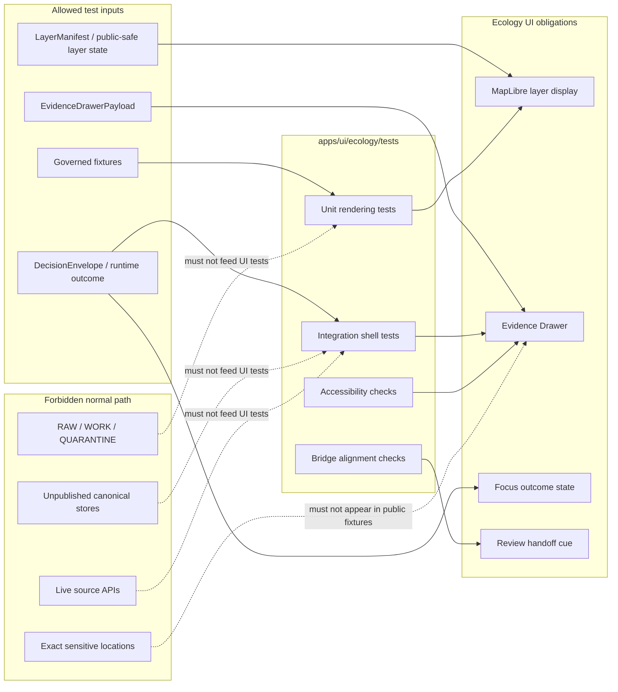

<!-- [KFM_META_BLOCK_V2]
doc_id: kfm://doc/NEEDS-VERIFICATION
title: Ecology UI Tests
type: standard
version: v1
status: draft
owners: NEEDS-VERIFICATION
created: NEEDS-VERIFICATION
updated: 2026-04-25
policy_label: NEEDS-VERIFICATION
related: [../README.md, ../../README.md, ../../../README.md, ../../../../README.md, ../../../../tests/README.md, ../../../../schemas/README.md, ../../../../contracts/README.md, ../../../../policy/README.md]
tags: [kfm, ui, ecology, tests, evidence-drawer, maplibre, focus-mode, trust-visible]
notes: [Target path supplied by request; mounted repo tree was not available in the current workspace; owners, original created date, policy label, runner, exact component paths, and adjacent README links need branch verification before publication.]
[/KFM_META_BLOCK_V2] -->

<a id="top"></a>

# Ecology UI Tests

Guard the ecology-facing UI against evidence drift, unsafe precision, hidden policy state, and shell behavior that bypasses KFM’s governed map-first trust path.

> [!NOTE]
> **Status:** `experimental` · **Doc status:** `draft`  
> **Owners:** `NEEDS-VERIFICATION`  
> **Path:** `apps/ui/ecology/tests/README.md`  
>        
> **Quick jump:** [Scope](#scope) · [Repo fit](#repo-fit) · [Inputs](#accepted-inputs) · [Exclusions](#exclusions) · [Directory tree](#directory-tree) · [Quickstart](#quickstart) · [Usage](#usage) · [Test families](#test-families) · [Outcome matrix](#outcome-matrix) · [Diagram](#diagram) · [Definition of done](#definition-of-done) · [FAQ](#faq) · [Appendix](#appendix)

> [!IMPORTANT]
> This directory is a **UI verification surface**. It does not define ecological truth, source authority, schema authority, policy authority, release proof, or production route behavior.

---

## Scope

This README orients tests for the ecology-facing UI surface under `apps/ui/ecology/`.

In KFM terms, “ecology UI” is treated here as the outward shell area where habitat, fauna, flora, and ecology-adjacent claims may appear as map layers, feature summaries, Evidence Drawer payloads, Focus results, review handoffs, and public-safe trust cues.

| Label | Scope claim |
|---|---|
| **CONFIRMED doctrine** | KFM UI surfaces must preserve evidence visibility, policy posture, review state, time context, and negative outcomes where meaning changes. |
| **INFERRED path role** | `apps/ui/ecology/tests/` is the path-local test home for ecology UI rendering and interaction checks. |
| **PROPOSED test posture** | Tests here should use release-safe fixtures and governed payloads, not live ecology source calls or canonical-store access. |
| **UNKNOWN** | Exact active-branch test runner, component paths, fixture inventory, CI wiring, and CODEOWNERS coverage. |

The practical goal is simple: a maintainer should be able to tell whether the ecology UI still renders KFM trust state correctly before accepting a change.

[Back to top](#top)

---

## Repo fit

| Role | Path | Relationship |
|---|---|---|
| This README | `apps/ui/ecology/tests/README.md` | Path-local orientation for ecology UI tests. |
| Parent ecology UI surface | [`../README.md`](../README.md) | **NEEDS VERIFICATION:** expected parent surface for ecology UI behavior and component boundaries. |
| UI app surface | [`../../README.md`](../../README.md) | **NEEDS VERIFICATION:** expected app-level UI README. |
| Apps surface | [`../../../README.md`](../../../README.md) | **NEEDS VERIFICATION:** expected app-family README. |
| Repo root | [`../../../../README.md`](../../../../README.md) | Expected upstream project orientation. |
| Shared test doctrine | [`../../../../tests/README.md`](../../../../tests/README.md) | Expected shared test standards and CI gate guidance. |
| Contracts and schemas | [`../../../../contracts/README.md`](../../../../contracts/README.md), [`../../../../schemas/README.md`](../../../../schemas/README.md) | Expected homes for machine-readable contract/schema authority. |
| Policy | [`../../../../policy/README.md`](../../../../policy/README.md) | Expected home for deny/default, sensitivity, rights, and publication rules. |

> [!CAUTION]
> The relative links above are intentional repo-facing links, but they still need active-branch verification because this draft was produced without a mounted repository tree.

---

## Accepted inputs

Put only UI-test material here.

| Accepted input | Why it belongs here |
|---|---|
| Ecology UI test specs | Verifies rendering, interaction, accessibility, trust cues, and shell behavior. |
| Release-safe fixture payloads | Lets tests exercise ecology UI states without live source calls or sensitive exact locations. |
| `EvidenceDrawerPayload`-style fixtures | Proves evidence visibility at the point of use. |
| `DecisionEnvelope` / runtime outcome fixtures | Keeps `ANSWER`, `ABSTAIN`, `DENY`, and `ERROR` states visible instead of smoothing them away. |
| `LayerManifest` / map-layer state fixtures | Tests that MapLibre-facing UI consumes governed layer descriptors rather than raw stores. |
| Accessibility assertions | Confirms trust cues remain keyboard-accessible and are not color-only. |
| Bridge tests to runtime-proof fixtures | Keeps UI payloads aligned with governed runtime outputs, without making UI tests the runtime authority. |

---

## Exclusions

| Do not put here | Where it belongs instead |
|---|---|
| Live source harvesting from GBIF, eBird, iNaturalist, NatureServe, USFWS, LANDFIRE, or similar sources | Source registry, connectors, or pipeline areas after source-role, rights, and policy verification. |
| Raw, work, quarantine, canonical, or unpublished ecological records | Data lifecycle homes governed by the KFM lifecycle, never UI tests. |
| Exact sensitive species locations or steward-controlled details | Restricted fixtures or policy/sensitivity test homes; public UI tests should use generalized or synthetic data. |
| Schema definitions | `schemas/` or `contracts/`, depending on the repo’s verified schema-home decision. |
| Policy rules | `policy/` and policy tests. |
| Runtime decision logic | Governed API or runtime packages. UI tests may assert outcomes, not author them. |
| Release manifests, proof packs, receipts, or catalog closure objects | Release, catalog, proof, or receipt homes. |
| Screenshot-only “proof” of trust behavior | UI screenshots can support review, but they cannot replace payload assertions and governed test fixtures. |

[Back to top](#top)

---

## Directory tree

Expected local layout, pending branch verification:

```text
apps/ui/ecology/tests/
├── README.md
├── accessibility/                 # PROPOSED: keyboard, ARIA, contrast, non-color-only trust cues
├── bridge/                        # PROPOSED: UI payload alignment with governed runtime/review fixtures
├── fixtures/                      # PROPOSED: release-safe ecology UI payloads
│   ├── drawer/
│   ├── focus/
│   ├── layers/
│   └── review-handoff/
├── integration/                   # PROPOSED: shell + map + drawer interaction tests
├── unit/                          # PROPOSED: pure rendering and mapping tests
└── visual/                        # PROPOSED: optional snapshots; never sole evidence
```

> [!NOTE]
> Keep this tree small. A test directory that grows into a source registry, policy pack, or runtime harness is crossing the trust membrane.

---

## Quickstart

Before running or adding tests, verify the active branch rather than assuming this draft matches the repo.

```bash
# Run from the repository root.
pwd
git status --short
git branch --show-current || true
find apps/ui/ecology/tests -maxdepth 3 -type f | sort
```

Then identify the repo-native runner from checked-in package and workflow evidence.

```bash
# NEEDS VERIFICATION — replace with the repo-native command.
<repo-ui-test-command> apps/ui/ecology/tests
```

A valid local run should prove three things:

1. The test runner is branch-real.
2. Fixtures are public-safe or explicitly restricted.
3. UI assertions preserve evidence, policy, review, freshness, and precision cues.

[Back to top](#top)

---

## Usage

### Add a UI test

1. Start from a governed fixture, not a live source call.
2. State the UI obligation in the test name.
3. Assert the trust cue, not just the visible text.
4. Assert the negative path when the same surface can abstain, deny, or error.
5. Keep raw/canonical/source-fetch assumptions out of the UI test.

Illustrative only:

```ts
// PSEUDOCODE — adapt to the verified repo test framework.
it("renders generalized public-safe occurrence support without exposing exact coordinates", async () => {
  renderEcologyDrawer(fixture("drawer/answer_generalized_public_safe_occurrence.json"));

  expect(screen.getByText(/public-safe/i)).toBeVisible();
  expect(screen.getByText(/generalized/i)).toBeVisible();
  expect(screen.getByText(/source role/i)).toBeVisible();
  expect(screen.queryByText(/exact coordinates/i)).not.toBeInTheDocument();
});
```

### Review an existing test

Ask these questions before accepting a change:

| Review question | Pass condition |
|---|---|
| Does the test begin from governed or synthetic fixtures? | No live source fetch and no raw/canonical store reads. |
| Does it preserve place and time context? | Scope, date/as-of, or release context remains visible where relevant. |
| Does it make evidence inspectable? | Evidence Drawer or equivalent payload is asserted. |
| Does it keep policy state visible? | Sensitivity, rights, precision, review, or denial state is not hidden. |
| Does it cover at least one negative state when meaningful? | `ABSTAIN`, `DENY`, or `ERROR` has a visible, bounded UI behavior. |

---

## Test families

| Family | What it verifies | Typical fixture |
|---|---|---|
| `drawer-rendering` | Ecology Evidence Drawer sections show source role, evidence refs, precision served, sensitivity/rights posture, review state, and correction cues. | `fixtures/drawer/*.json` |
| `map-layer-state` | MapLibre-facing ecology layers consume governed layer descriptors and public-safe geometry only. | `fixtures/layers/*.json` |
| `focus-outcomes` | Focus-like ecology answers render finite outcomes and do not become free-form answer authority. | `fixtures/focus/*.json` |
| `review-handoff` | Explorer-to-review or drawer-to-review payloads stay aligned without exposing steward-only detail. | `fixtures/review-handoff/*.json` |
| `accessibility` | Trust cues are keyboard reachable, screen-reader meaningful, and not color-only. | `fixtures/drawer/*.json` |
| `bridge` | UI fixtures remain aligned with runtime-proof or contract fixtures where the repo provides them. | Shared fixture refs |
| `no-raw-path` | UI code does not fetch from raw, work, quarantine, canonical, or unpublished paths. | Mocked network calls |

---

## Outcome matrix

| Outcome | UI must show | UI must never do |
|---|---|---|
| `ANSWER` | Evidence support, source role, scope, time/release context, and public-safe precision. | Present generalized support as exact truth. |
| `ABSTAIN` | The scope or evidence gap that prevents a supported answer. | Fill the gap with plausible language or hidden assumptions. |
| `DENY` | A safe denial explanation, reason/obligation cues, and any allowed public-safe stub. | Silently hide restricted objects or leak the denied detail. |
| `ERROR` | User-safe error state, audit/debug reference if allowed, and retry/report path. | Show raw stack traces, source secrets, or internal storage paths. |

---

## Diagram



[Back to top](#top)

---

## Definition of done

A change under `apps/ui/ecology/tests/` is ready for review only when the applicable gates pass:

- [ ] Uses synthetic, governed, or explicitly release-safe fixtures.
- [ ] Does not fetch live ecology sources.
- [ ] Does not read raw, work, quarantine, canonical, or unpublished stores.
- [ ] Asserts Evidence Drawer or equivalent evidence-payload visibility for consequential claims.
- [ ] Preserves visible precision, sensitivity, rights, source-role, review, and freshness cues where relevant.
- [ ] Covers negative states when the tested surface can abstain, deny, or error.
- [ ] Keeps review surfaces as inspection/handoff surfaces, not a second truth system.
- [ ] Uses branch-verified test runner commands.
- [ ] Keeps screenshot or visual tests subordinate to payload/DOM assertions.
- [ ] Updates this README if directory structure, fixture families, runner commands, or ownership changes.

---

## FAQ

### Is this directory the source of ecological truth?

No. This directory verifies UI behavior. Ecological claims remain subordinate to governed evidence, source roles, policy, review state, release state, and correction lineage.

### Can tests use real observations?

Only when they are release-safe, rights-reviewed, policy-allowed, and not sensitive. Prefer synthetic fixtures for ordinary UI tests.

### Can a UI test assert a species occurrence?

A UI test may assert that a governed payload is rendered correctly. It must not independently decide that an occurrence is true.

### What happens if the repo uses a different test runner?

Update [Quickstart](#quickstart), preserve the test posture, and avoid copying in generic runner commands that are not branch-real.

### What happens if the active branch uses `apps/explorer-web/` instead of `apps/ui/`?

Do not duplicate the test lane. Add an ADR or path note, migrate links carefully, and preserve the stronger owner surface.

---

## Appendix

<details>
<summary>Fixture naming guide — PROPOSED</summary>

Use names that describe the trust state, not just the component.

```text
answer_generalized_public_safe_occurrence.json
abstain_missing_provenance.json
deny_sensitive_exact_location.json
deny_restricted_license.json
error_malformed_drawer_payload.json
layer_public_safe_habitat_context.json
focus_abstain_unreleased_support.json
review_handoff_candidate_choice_public_safe.json
```

Recommended fixture rule:

| Field | Expectation |
|---|---|
| `outcome` | One of `ANSWER`, `ABSTAIN`, `DENY`, `ERROR` when runtime-shaped. |
| `scope` | Place/time/release context visible when relevant. |
| `evidence` | Evidence refs or explicit unavailable support state. |
| `policy` | Rights/sensitivity/precision obligations visible where relevant. |
| `review` | Review or release state visible when meaningful. |
| `precision_served` | Exact, generalized, withheld, or equivalent branch-approved vocabulary. |

</details>

<details>
<summary>Anti-patterns this directory should catch</summary>

- A map popup that states a claim without an evidence path.
- A drawer that hides generalized precision.
- A Focus-style answer that renders as if generated text is root truth.
- A denied sensitive ecology record that disappears with no safe stub or explanation.
- A review handoff that exposes steward-only alternates on the public surface.
- A visual snapshot test that passes while payload evidence, policy, or review state is missing.
- A test that quietly fetches live ecology source APIs.
- A fixture containing exact protected species coordinates.

</details>

[Back to top](#top)
