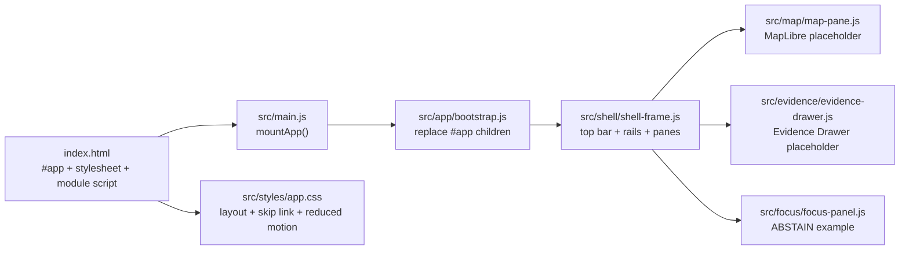
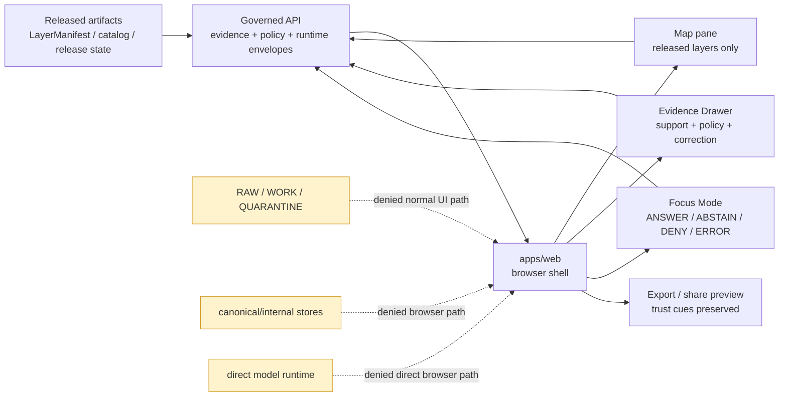

<!-- [KFM_META_BLOCK_V2]
doc_id: kfm://doc/TODO-VERIFY-apps-web-readme-uuid
title: apps/web — Governed Web Shell
type: standard
version: v1
status: draft
owners: @bartytime4life (fallback; app-specific owners NEEDS VERIFICATION)
created: 2026-04-22
updated: 2026-05-07
policy_label: NEEDS-VERIFICATION(public|restricted)
related: [../../README.md, ../README.md, ./package.json, ./src/README.md, ../../docs/architecture/map-shell.md, ../../docs/adr/ADR-0001-schema-home.md, ../../docs/adr/ADR-0003-maplibre-renderer-boundary.md, ../../.github/CODEOWNERS, ../../.github/workflows/baseline.yml]
tags: [kfm, apps-web, ui, vite, maplibre, pmtiles, evidence-drawer, focus-mode, governed-api, public-safe]
notes: [Revised from current GitHub connector evidence on main; local repository checkout was not mounted in this workspace; doc_id policy_label and app-specific owners remain review placeholders; workflow file presence is confirmed but successful run status is not claimed.]
[/KFM_META_BLOCK_V2] -->

<a id="top"></a>

# apps/web — Governed Web Shell

Map-first browser application for rendering released KFM artifacts while keeping evidence, policy, time, review, correction, and bounded Focus Mode state visible.

## Impact block


| Field | Value |
| --- | --- |
| **Status** | `active app surface / draft README` |
| **Owners** | `@bartytime4life` fallback from CODEOWNERS; app-specific ownership **NEEDS VERIFICATION** |
| **Path** | `apps/web/README.md` |
| **Package** | `@kfm/web` |
| **Current stack** | npm 10, Vite, Vitest, MapLibre GL JS, PMTiles |
| **Boundary role** | Browser shell for released map layers, evidence inspection, and bounded Focus Mode UI |
| **Quick jumps** | [Scope](#scope) · [Repo fit](#repo-fit) · [Inputs](#inputs) · [Exclusions](#exclusions) · [Current implementation signals](#current-implementation-signals) · [Directory tree](#directory-tree) · [Quickstart](#quickstart) · [Architecture](#architecture) · [Runtime boundaries](#runtime-boundaries) · [Security posture](#security-posture) · [Quality gates](#quality-gates) · [FAQ](#faq) · [Appendix](#appendix) |

> [!IMPORTANT]
> `apps/web` is a **downstream trust-visible shell**. It may render governed artifacts and user interaction state. It must not become the source of truth, policy authority, schema authority, publication authority, proof store, or direct model client.

---

## Scope

`apps/web` is the browser-facing KFM application surface. Its job is to help users navigate place, time, released layers, selected features, Evidence Drawer support, and Focus Mode outcomes without weakening the KFM trust membrane.

This app may contain:

- Vite browser entrypoints and static build support;
- the shell frame, map column, left rail, right inspection stack, and accessible navigation affordances;
- MapLibre and PMTiles integration code for released or fixture-backed map artifacts;
- Evidence Drawer UI that renders governed support and policy state;
- Focus Mode UI that displays finite governed outcomes;
- app-local styles, tests, and public-safe fixtures;
- app-local adapters for governed API payloads.

This app must remain downstream of:

```text
RAW -> WORK / QUARANTINE -> PROCESSED -> CATALOG / TRIPLET -> PUBLISHED
```

A rendered map feature is a visual candidate. A consequential KFM claim still requires evidence resolution, policy checks, release context, review state, and correction/rollback visibility.

<p align="right"><a href="#top">Back to top ↑</a></p>

---

## Repo fit

`apps/web/` belongs under `apps/` because it is a deployable or near-deployable application surface. It should consume shared KFM contracts, schemas, policy outcomes, published artifacts, and governed API responses rather than redefining them.

| Relationship | Path from `apps/web/README.md` | Status | Role |
| --- | --- | ---: | --- |
| Root orientation | [`../../README.md`](../../README.md) | **CONFIRMED** | Repo-wide KFM purpose, lifecycle law, and public-client trust membrane |
| Apps landing page | [`../README.md`](../README.md) | **CONFIRMED** | App-boundary rules and app inventory posture |
| Web package manifest | [`./package.json`](./package.json) | **CONFIRMED** | npm/Vite/MapLibre/PMTiles scripts and dependencies |
| Web source README | [`./src/README.md`](./src/README.md) | **CONFIRMED / NEEDS FOLLOW-UP** | Source-tree boundary guide; should be reconciled with current repo evidence |
| Map shell architecture | [`../../docs/architecture/map-shell.md`](../../docs/architecture/map-shell.md) | **CONFIRMED** | Cross-domain browser map-shell architecture |
| Schema-home ADR | [`../../docs/adr/ADR-0001-schema-home.md`](../../docs/adr/ADR-0001-schema-home.md) | **CONFIRMED / PROPOSED** | Contracts mean, schemas validate, policy decides |
| MapLibre boundary ADR | [`../../docs/adr/ADR-0003-maplibre-renderer-boundary.md`](../../docs/adr/ADR-0003-maplibre-renderer-boundary.md) | **CONFIRMED / review** | MapLibre is renderer and interaction runtime, not truth authority |
| Review routing | [`../../.github/CODEOWNERS`](../../.github/CODEOWNERS) | **CONFIRMED** | Fallback review ownership |
| Baseline workflow | [`../../.github/workflows/baseline.yml`](../../.github/workflows/baseline.yml) | **CONFIRMED file / UNKNOWN run status** | Repo-wide validation orchestration |

### Upstream dependencies

`apps/web` should consume these upstream surfaces:

| Upstream surface | Web-shell expectation |
| --- | --- |
| `contracts/` | Semantic meaning for KFM objects and UI payloads |
| `schemas/contracts/v1/` | Machine-checkable payload shape after ADR acceptance |
| `policy/` | Rights, sensitivity, release, runtime, and review decisions |
| `data/published/`, `data/catalog/`, `release/` | Released artifacts and release context, not raw lifecycle material |
| governed API routes | Evidence Drawer, Focus Mode, and map-selection resolution |
| `tests/`, `fixtures/`, `tools/` | No-bypass, fixture, contract, accessibility, and validation checks |

### Downstream users

The app serves public, semi-public, reviewer, or local development users who need a trust-visible shell. It should expose what KFM can safely show, not what the repository happens to store.

<p align="right"><a href="#top">Back to top ↑</a></p>

---

## Inputs

Accepted inputs are intentionally narrow.

| Input | Belongs here when… | Required posture |
| --- | --- | --- |
| Browser shell code | It composes the web app frame and interaction surfaces. | Presentation state only; no canonical truth ownership |
| Map runtime adapters | They render released or fixture-backed artifacts. | Manifest-led; no raw lifecycle access |
| Map style and UI styles | They are app-local presentation assets. | Style does not become policy or evidence authority |
| Evidence Drawer payloads | They come from governed API responses or public-safe fixtures. | Preserve evidence, source role, policy, release, review, and correction state |
| Focus Mode payloads | They are bounded by active place/time/layer context. | Submitted through governed API; no browser-to-model direct path |
| Runtime response envelopes | They contain finite outcomes such as `ANSWER`, `ABSTAIN`, `DENY`, and `ERROR`. | Negative states remain visible |
| Public-safe fixtures | They exercise UI behavior without live source credentials or sensitive data. | Synthetic, released, redacted, generalized, or otherwise safe |
| App-local tests | They prove browser behavior and trust-state rendering. | No-network by default where possible |

> [!TIP]
> Keep browser payloads small. Source-role resolution, sensitive geometry decisions, citation validation, catalog closure, release decisions, and proof generation belong upstream.

<p align="right"><a href="#top">Back to top ↑</a></p>

---

## Exclusions

| Does not belong in `apps/web` as authority | Why | Better home |
| --- | --- | --- |
| RAW, WORK, or QUARANTINE data | Public and normal UI surfaces must not bypass lifecycle gates. | `data/raw/`, `data/work/`, `data/quarantine/` |
| Canonical/internal stores | Browser code must not become privileged truth access. | governed API, backend services, data lifecycle roots |
| Source connectors or harvesters | Source intake requires rights, cadence, receipts, and policy checks. | `connectors/`, `pipelines/`, `pipeline_specs/` |
| Machine schema authority | UI types must not fork schema truth. | `schemas/contracts/v1/` after ADR acceptance |
| Semantic contract authority | Components may reference contracts but not redefine object meaning. | `contracts/` |
| Policy-as-code | UI may display policy decisions, not author them. | `policy/` |
| Proof packs, receipts, release manifests, rollback cards | App code may link to release state, not store proof authority. | `data/receipts/`, `data/proofs/`, `release/` |
| Secrets, source keys, model keys | Browser bundles and public repos must never carry secrets. | external secret management / local ignored environment |
| Direct model runtime clients | Focus Mode must stay evidence-subordinate and policy-checked. | governed API model adapter |
| Sensitive exact-location public rendering | Public geometry must fail closed unless policy-reviewed and released. | upstream redaction, generalization, steward review |
| Domain root folders | Domain names do not belong here merely for convenience. | responsibility roots such as `docs/domains/`, `policy/domains/`, `schemas/contracts/v1/domains/` |

> [!WARNING]
> Rendering success is not publication. A visible layer, popup, or placeholder can be useful UI, but it is not evidence closure.

<p align="right"><a href="#top">Back to top ↑</a></p>

---

## Current implementation signals

The current `apps/web` surface is small and concrete. Treat the items below as confirmed repo signals, not as proof of production maturity.

| File | CONFIRMED signal | What not to overclaim |
| --- | --- | --- |
| [`package.json`](./package.json) | Package `@kfm/web`, `private: true`, `UNLICENSED`, `npm@10`, Vite scripts, Vitest scripts, MapLibre GL JS, PMTiles. | Installed dependencies, passing tests, deployment, or license review. |
| [`index.html`](./index.html) | Defines `#app`, loads `./src/styles/app.css`, and imports `./src/main.js`. | Server routing, production headers, or CSP posture. |
| [`src/main.js`](./src/main.js) | Imports and calls `mountApp()`. | Full app routing or framework abstraction. |
| [`src/app/bootstrap.js`](./src/app/bootstrap.js) | Requires `#app`, replaces children with `createShellFrame()`. | Error boundary maturity or hydration framework. |
| [`src/shell/shell-frame.js`](./src/shell/shell-frame.js) | Creates top bar, left rail, map column, right stack, and mounts map/evidence/focus panels. | Complete production shell, live layer registry, or final accessibility coverage. |
| [`src/map/map-pane.js`](./src/map/map-pane.js) | Renders a “MapLibre adapter placeholder” and states released-layer-only/no internal lifecycle access. | Live MapLibre map initialization. |
| [`src/evidence/evidence-drawer.js`](./src/evidence/evidence-drawer.js) | Renders an Evidence Drawer panel with status, placeholder EvidenceBundle ref, and public-safe generalized geometry note. | Real evidence resolution or global EvidenceBundle contract enforcement. |
| [`src/focus/focus-panel.js`](./src/focus/focus-panel.js) | Renders Focus Mode panel and `ABSTAIN` example; states runtime is delegated to governed API. | Full Focus route wiring, model adapter, or citation validation. |
| [`src/styles/app.css`](./src/styles/app.css) | Provides shell layout, skip link, responsive motion reduction, and visible panels. | Complete accessibility or design-system coverage. |
| [`scripts_build.mjs`](./scripts_build.mjs) | Copies `index.html`, `src/`, and optional `public/` into `dist/` for a static build. | Production release, signing, or cache invalidation. |
| [`../../.github/workflows/baseline.yml`](../../.github/workflows/baseline.yml) | Repo has a baseline workflow file with structure, schema, docs, API, Focus, source, release, and unittest checks. | A successful run, branch protection, or app-specific check pass. |

<p align="right"><a href="#top">Back to top ↑</a></p>

---

## Directory tree

Confirmed files inspected for this README revision:

```text
apps/web/
├── README.md
├── package.json
├── index.html
├── scripts_build.mjs
└── src/
    ├── README.md
    ├── main.js
    ├── app/
    │   └── bootstrap.js
    ├── evidence/
    │   └── evidence-drawer.js
    ├── focus/
    │   └── focus-panel.js
    ├── map/
    │   └── map-pane.js
    ├── shell/
    │   └── shell-frame.js
    └── styles/
        └── app.css
```

> [!NOTE]
> This is an evidence-bounded inventory, not a complete repository tree audit. Run `find apps/web -maxdepth 4 -type f | sort` in a mounted checkout before using it as a full file list.

Recommended future structure, only after implementation and repo conventions support it:

```text
apps/web/
├── src/
│   ├── api/                 # typed governed API clients only
│   ├── contracts/           # generated or thin client types, not schema authority
│   ├── fixtures/            # public-safe UI fixtures
│   ├── map/                 # KFM-owned MapLibre adapter and released layer bindings
│   ├── evidence/            # Evidence Drawer components
│   ├── focus/               # Focus Mode panels and finite outcome rendering
│   ├── shell/               # shell frame, rails, panes, navigation
│   ├── state/               # browser view state only
│   └── styles/              # app-local styling
└── tests/                   # app-local no-bypass, fixture, accessibility, and smoke tests
```

<p align="right"><a href="#top">Back to top ↑</a></p>

---

## Quickstart

From a mounted checkout:

```bash
cd apps/web

npm install
npm run dev
```

Confirmed scripts from `package.json`:

| Command | Purpose | Notes |
| --- | --- | --- |
| `npm run dev` | Vite dev server on `127.0.0.1:4173`. | Preferred local development default. |
| `npm run dev:host` | Vite dev server on `0.0.0.0:4173`. | Use only when intentionally exposing on a trusted network. |
| `npm run preview` | Vite preview on `127.0.0.1:4173`. | Build output must exist first. |
| `npm run check` | Package JSON parse, JS syntax checks, Prettier check. | Does not prove trust-state behavior. |
| `npm run test` | `vitest run --passWithNoTests`. | Passing may still mean no tests were present. |
| `npm run build` | `vite build`. | Does not publish KFM artifacts. |
| `npm run build:static` | Copies static app files into `dist/`. | Useful for simple static preview. |
| `npm run doctor` | Runs check, tests, build, and `check:dist`. | Do not report as passing unless run on the current checkout. |
| `npm run kfm:publish-tile-layer` | Runs `../../scripts/publish_kfm_tile_layer.mjs`. | Treat as release-sensitive; verify policy and release context first. |

Safe first local verification:

```bash
npm run check
npm run test
npm run build
npm run check:dist
```

> [!CAUTION]
> Do not claim runtime health, deployment readiness, CI success, or public release readiness from these commands unless they actually ran on the current branch and their output is recorded.

<p align="right"><a href="#top">Back to top ↑</a></p>

---

## Architecture

### Confirmed app boot flow



### Governed target flow



### Shell surface map

| Surface | Current signal | Target responsibility |
| --- | --- | --- |
| Top bar | Present in `shell-frame.js`. | Show KFM scope, release, role, and trust state. |
| Left rail | Present with placeholder layer list. | Governed layer tree and filters. |
| Map column | Present with placeholder map pane. | MapLibre/PMTiles renderer behind manifest-gated loading. |
| Right stack | Present with Evidence Drawer and Focus Mode panels. | Trust inspection, bounded synthesis, dossier/review/export as implemented. |
| Evidence Drawer | Placeholder component exists. | Render governed evidence, policy, review, freshness, release, correction, and caveat state. |
| Focus Mode | Placeholder component exists with `ABSTAIN`. | Render finite governed outcomes and citations; never call model runtime directly. |

<p align="right"><a href="#top">Back to top ↑</a></p>

---

## Runtime boundaries

### Browser-owned state

The browser may own:

- camera and viewport state;
- selected visual candidate;
- active layer toggles;
- open panel state;
- compare or story UI arrangement;
- unsent user question text;
- non-sensitive display preferences.

### Upstream-governed decisions

The browser must not decide:

- source authority;
- rights or sensitivity;
- evidence sufficiency;
- public release eligibility;
- exact geometry exposure;
- citation validity;
- model context assembly;
- promotion, correction, withdrawal, or rollback state.

### Required outcome grammar

| Outcome | UI behavior |
| --- | --- |
| `ANSWER` | Show bounded answer with citations, scope, release context, and audit reference when supplied. |
| `ABSTAIN` | Say support is insufficient, stale, or outside scope; do not invent a smoother answer. |
| `DENY` | Show policy-safe denial reason without leaking restricted detail. |
| `ERROR` | Preserve context and show safe runtime/validation failure state. |

### MapLibre rule

MapLibre may render, hit test, and report visual context. It must not decide what KFM treats as true, public, cited, reviewed, corrected, withdrawn, or answerable by AI.

<p align="right"><a href="#top">Back to top ↑</a></p>

---

## Security posture

The confirmed package exposes both loopback-only and host-bound dev/preview scripts. Treat host-bound scripts as deliberate exposure.

| Surface | Safe posture |
| --- | --- |
| `dev` / `preview` | Default to `127.0.0.1`. |
| `dev:host` / `preview:host` | Use only on trusted networks; review firewall/reverse-proxy posture first. |
| Browser bundle | No secrets, source credentials, private tokens, or model keys. |
| Focus Mode | Browser sends bounded scope to governed API only. |
| Map artifacts | Public-safe, released, generalized/redacted where required. |
| Logs and screenshots | No restricted exact locations or private data. |
| Public routes | No direct RAW, WORK, QUARANTINE, canonical/internal, proof-only, or model-runtime access. |

Suggested no-bypass checks to formalize later:

```text
NEEDS VERIFICATION:
- fail if browser code imports RAW / WORK / QUARANTINE paths;
- fail if browser code contains direct model runtime clients;
- fail if a consequential claim renders without Evidence Drawer payload support;
- fail if denied, stale, generalized, redacted, superseded, or withdrawn states are invisible;
- fail if trust cues are color-only or pointer-only.
```

<p align="right"><a href="#top">Back to top ↑</a></p>

---

## Quality gates

The next useful `apps/web` change should prove trust continuity before visual breadth.

### Definition of done

- [ ] `npm run check` runs on the current checkout and output is recorded.
- [ ] `npm run test` runs on the current checkout and test count is understood.
- [ ] `npm run build` and `npm run check:dist` run before claiming distributable build health.
- [ ] Browser code does not read RAW, WORK, QUARANTINE, canonical/internal, proof-only, or steward-only paths.
- [ ] Browser code does not call Ollama, OpenAI-compatible endpoints, or any model runtime directly.
- [ ] Map layer loading is manifest-led or explicitly fixture-backed.
- [ ] Evidence Drawer can render at least one valid payload and one negative/safe-stub state.
- [ ] Focus Mode can render `ANSWER`, `ABSTAIN`, `DENY`, and `ERROR` fixtures when those contracts are wired.
- [ ] Trust cues are semantically labeled and not color-only.
- [ ] `dev:host` and `preview:host` exposure is documented when used.
- [ ] Material behavior changes update README, architecture docs, ADRs, contracts/schemas, policy references, tests, or rollback notes as appropriate.
- [ ] Rollback is simple: disable or revert app code without deleting release, proof, receipt, correction, or audit history.

### Recommended first test families

| Test family | Purpose |
| --- | --- |
| Boot smoke | `index.html` → `main.js` → shell frame mounts without network access. |
| No-bypass scan | Browser source excludes internal lifecycle and direct model paths. |
| Evidence Drawer fixtures | Valid, missing-evidence, denied, stale, generalized, superseded, and withdrawn states. |
| Focus outcome fixtures | `ANSWER`, `ABSTAIN`, `DENY`, `ERROR`. |
| Accessibility | Skip link, headings, ARIA status, focus order, reduced-motion behavior, trust cues not color-only. |
| Build artifacts | `dist/index.html` and expected copied files exist after build. |

<p align="right"><a href="#top">Back to top ↑</a></p>

---

## FAQ

### Is this a production MapLibre shell today?

Not yet proven. The package declares MapLibre and PMTiles dependencies, and the app has a map-pane placeholder. A live MapLibre map runtime, layer registry integration, release-aware cache behavior, and public deployment posture still need verification.

### Can `apps/web` call the governed API?

Yes. That is the intended normal path for evidence, Focus, layer, and release-aware behavior. It should not call raw stores, canonical internals, or model runtimes directly.

### Can Focus Mode answer from map feature properties?

No. Browser feature properties can provide selected context, but evidence resolution, policy checks, context assembly, model-adapter calls, citation validation, and finite response envelopes belong behind the governed API boundary.

### Can a popup replace the Evidence Drawer?

No. Popups can provide navigation or a small summary, but consequential support belongs in Evidence Drawer or an equivalent governed payload.

### What should happen when support is missing?

Render `ABSTAIN`, `DENY`, or `ERROR` visibly. Do not hide the state or imply the claim is unsupported merely because the panel is empty.

### Are tests and CI passing?

UNKNOWN from this README revision. The baseline workflow file and package scripts exist, but successful runs were not inspected here.

<p align="right"><a href="#top">Back to top ↑</a></p>

---

## Appendix

<details>
<summary>Open verification backlog</summary>

| Item | Status | Why it matters |
| --- | ---: | --- |
| Stable `doc_id` | **TODO-VERIFY** | KFM meta block needs a real persistent document identifier. |
| `policy_label` | **NEEDS VERIFICATION** | The README may be public, but publication policy must be confirmed. |
| App-specific owners | **NEEDS VERIFICATION** | CODEOWNERS fallback exists; UI/API/security/release roles may need finer routing. |
| Full `apps/web` inventory | **NEEDS VERIFICATION** | This README cites inspected files, not a complete tree audit. |
| Workflow run success | **UNKNOWN** | Workflow file presence is not enforcement proof. |
| Branch protection / required checks | **UNKNOWN** | Needed before claiming merge-blocking validation. |
| Live MapLibre runtime | **NEEDS VERIFICATION** | Current inspected map pane is a placeholder. |
| Governed API route names | **UNKNOWN** | Do not invent route names without API source evidence. |
| Evidence Drawer contract | **NEEDS VERIFICATION** | Current drawer is a placeholder component. |
| Focus envelope parity | **NEEDS VERIFICATION** | Need fixture or runtime proof for all finite outcomes. |
| Public deployment posture | **UNKNOWN** | Requires runtime, proxy, firewall, CSP/CORS, and log evidence. |
| License/public-data rights | **NEEDS VERIFICATION** | `package.json` is `UNLICENSED`; source-data and publication rights need separate review. |

</details>

<details>
<summary>Status labels used here</summary>

| Label | Meaning |
| --- | --- |
| **CONFIRMED** | Verified from current repo connector evidence, visible source files, or governing KFM doctrine. |
| **PROPOSED** | Recommended design or future implementation not yet proven as current behavior. |
| **UNKNOWN** | Not verifiable from inspected evidence. |
| **NEEDS VERIFICATION** | Concrete check required before treating a claim as operational fact. |
| **DENY / ABSTAIN / ERROR** | System outcomes, not rhetorical uncertainty labels. |

</details>

<details>
<summary>Reviewer checklist for `apps/web` changes</summary>

- Does the change preserve the public-client trust membrane?
- Does it avoid direct RAW / WORK / QUARANTINE / canonical-store access?
- Does it avoid direct browser-to-model-runtime access?
- Does it render negative states clearly?
- Does it preserve evidence, policy, freshness, release, review, and correction context?
- Does it avoid sensitive exact-location leakage in fixtures, screenshots, bundles, logs, and exports?
- Does it keep contracts, schemas, policy, release, receipts, proofs, and docs in their proper responsibility roots?
- Did the contributor run and record repo-native checks before making test or build claims?

</details>

<p align="right"><a href="#top">Back to top ↑</a></p>
