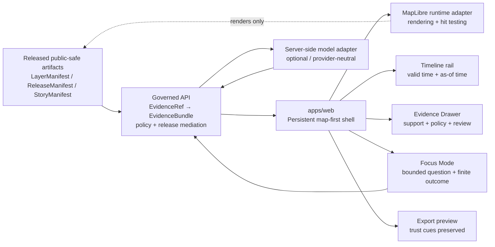

<!-- [KFM_META_BLOCK_V2]
doc_id: kfm://doc/TODO-VERIFY-UUID
title: apps/web — Governed Web Shell
type: standard
version: v1
status: draft
owners: TODO-VERIFY apps/web owner
created: 2026-04-22
updated: 2026-04-22
policy_label: TODO-VERIFY-public-or-restricted
related: [TODO-VERIFY ../../README.md, TODO-VERIFY ../governed-api/README.md, TODO-VERIFY ../../schemas/contracts/v1/, TODO-VERIFY ../../docs/architecture/]
tags: [kfm, apps-web, ui, maplibre, evidence-drawer, focus-mode]
notes: [Repo not mounted during authoring; owners package manager status links and policy label need verification.]
[/KFM_META_BLOCK_V2] -->

<a id="top"></a>

# apps/web — Governed Web Shell

Map-first browser application boundary for rendering released KFM artifacts without becoming the truth source.

## Impact block

| Field | Value |
| --- | --- |
| Status | **experimental** — NEEDS VERIFICATION against the mounted repository |
| Owners | **TODO-VERIFY:** apps/web owner, UI steward, API steward, QA/release reviewer |
| Path | `apps/web/README.md` |
| Primary role | Persistent, trust-visible web shell for map, time, evidence, Focus, review, compare, story, and export surfaces |
| Badges |     |
| Quick jumps | [Scope](#scope) · [Repo fit](#repo-fit) · [Inputs](#inputs) · [Exclusions](#exclusions) · [Directory tree](#directory-tree) · [Quickstart](#quickstart) · [Architecture](#architecture) · [Runtime boundaries](#contracts-and-runtime-boundaries) · [Quality gates](#quality-gates) · [FAQ](#faq) |

> [!IMPORTANT]
> CONFIRMED doctrine: the KFM web interface is part of the evidence chain, trust model, and governed publication path.  
> UNKNOWN implementation: the mounted repository, package manager, component tree, route implementation, test runner, and deployment settings were not available during authoring.

---

## Scope

`apps/web` is the browser-facing KFM product shell. Its job is to help users navigate **place**, **time**, **released layers**, **claims**, **EvidenceBundle-backed support**, and **policy/review state** through a disciplined map-first interface.

This directory may contain UI code and web-facing adapters for:

- the persistent shell frame: top command bar, left rail, map canvas, timeline rail, right inspection stack, and utility tray;
- the MapLibre runtime adapter used to render governed layers;
- trust-visible components such as evidence-state chips, freshness cues, policy chips, review chips, correction markers, and AI participation badges;
- Evidence Drawer, Focus Mode, Dossier, Story, Review, Compare, and Export surfaces;
- UI tests that prove the shell does not bypass the governed API or hide negative states.

This directory must remain a **consumer of governed outputs**, not an author of canonical truth.

> [!NOTE]
> PROPOSED realization: this README treats `apps/web` as the likely home for the web shell because the target path was requested directly. The actual repo topology still needs verification before code or links are changed.

<p align="right"><a href="#top">Back to top ↑</a></p>

---

## Repo fit

| Relationship | Link from `apps/web/README.md` | Status | What this link should prove |
| --- | --- | --- | --- |
| Target file | `apps/web/README.md` | CONFIRMED target path from task | This README’s intended location |
| Root orientation | [`../../README.md`](../../README.md) | NEEDS VERIFICATION | Repo-wide purpose, setup, and contribution flow |
| Governed API peer | [`../governed-api/README.md`](../governed-api/README.md) | PROPOSED / NEEDS VERIFICATION | Browser calls route through governed API, not raw stores |
| Shared contracts | [`../../schemas/contracts/v1/`](../../schemas/contracts/v1/) | PROPOSED / NEEDS VERIFICATION | `LayerManifest`, `EvidenceDrawerPayload`, `FocusModePayload`, `RuntimeResponseEnvelope` |
| Architecture docs | [`../../docs/architecture/`](../../docs/architecture/) | PROPOSED / NEEDS VERIFICATION | KFM architecture doctrine and ADRs |
| Policy docs | [`../../policy/`](../../policy/) | PROPOSED / NEEDS VERIFICATION | Source-role, rights, sensitivity, publication, and no-bypass policies |
| Test surfaces | [`../../tests/`](../../tests/) | PROPOSED / NEEDS VERIFICATION | UI trust-state, accessibility, API contract, and no-public-bypass tests |

### Upstream responsibilities

`apps/web` should depend on upstream governed artifacts and services:

- released `LayerManifest` entries;
- released or API-mediated style, sprite, glyph, icon, and font assets;
- `EvidenceDrawerPayload` objects;
- `FocusModePayload` requests and `RuntimeResponseEnvelope` responses;
- release-aware catalog, claim, evidence, correction, and export endpoints;
- policy-mediated generalized or redacted geometry where public precision is not allowed.

### Downstream responsibilities

`apps/web` produces user-visible state and interaction, not canonical records:

- selected geography and visible extent;
- active time scope and comparison anchors;
- visible layers and display preferences;
- opened drawer, dossier, story, Focus, review, compare, and export panels;
- user actions that request governed API resolution.

<p align="right"><a href="#top">Back to top ↑</a></p>

---

## Inputs

Accepted inputs are narrow by design.

| Input | Belongs here when… | Must carry |
| --- | --- | --- |
| `LayerManifest` | It describes a released, public-safe layer or steward-visible layer exposed through a governed route. | release id, evidence route, style/source ids, sensitivity posture, freshness, review state |
| Map style assets | They are versioned UI/rendering assets or local development fixtures, not canonical truth. | style version, source references, asset provenance |
| `EvidenceDrawerPayload` | It is returned by the governed API or loaded from a verified fixture. | claim, source role, EvidenceBundle ref, policy, review, release, correction state |
| `FocusModePayload` | It is assembled from the active shell scope and sent to the governed API. | place/time/layer scope, role context, release context, user question |
| `RuntimeResponseEnvelope` | It is returned by the governed API for Focus or bounded synthesis. | `ANSWER`, `ABSTAIN`, `DENY`, or `ERROR`, citations or denial reason, audit ref |
| UI fixtures | They test drawer, Focus, layer, review, stale, restricted, generalized, and error states without network access. | valid and invalid cases, expected visual state, expected policy outcome |
| Accessibility fixtures | They prove trust cues are usable without color-only meaning or pointer-only interaction. | keyboard path, accessible names, contrast expectations |

> [!TIP]
> Keep browser payloads deliberately small. Heavy normalization, topology repair, source-role resolution, generalization, redaction, catalog closure, and proof creation belong upstream.

<p align="right"><a href="#top">Back to top ↑</a></p>

---

## Exclusions

| Does not belong in `apps/web` | Why | Candidate home |
| --- | --- | --- |
| RAW, WORK, or QUARANTINE data | Public and normal UI surfaces must not bypass lifecycle gates. | `data/raw/`, `data/work/`, `data/quarantine/` — verify repo convention |
| Canonical/internal stores | Browser code must not become a truth source or privileged store client. | backend service, governed API, database adapter — verify repo convention |
| Live source connectors | Source activation requires rights, cadence, source role, policy, and review handling. | pipeline/source connector package — verify repo convention |
| Source authority decisions | Authority is policy/data governance, not UI styling. | `data/registry/`, `policy/`, `docs/registers/` |
| Policy-as-code | UI can display policy outcomes but must not be the only enforcement layer. | `policy/` |
| Schema authority | UI may import generated types, but canonical schemas must not live only here. | `schemas/contracts/v1/` or repo-native schema home |
| Model runtime clients | Focus must call the governed API, not Ollama/OpenAI-compatible endpoints directly. | governed API model adapter |
| Secrets, tokens, service keys | Browser bundles and public repos must not contain secrets. | secrets manager / local env excluded from git |
| Unreviewed public artifacts | Publication requires validation, policy, review, release manifest, and rollback path. | release pipeline and published artifact store |
| Decorative 3D experiments | 3D is conditional and burden-bearing, not the default shell. | controlled story/analysis surface after 2D gates pass |

> [!WARNING]
> A map can render a feature that is not publishable. Rendering success is not evidence closure.

<p align="right"><a href="#top">Back to top ↑</a></p>

---

## Directory tree

PROPOSED structure only. Do not create or rename folders until the mounted repo confirms framework, package manager, and local conventions.

```text
apps/web/
├── README.md
├── package.json                  # NEEDS VERIFICATION
├── src/
│   ├── shell/                    # ShellFrame, TopCommandBar, LeftRail, TimelineRail, RightStack
│   ├── map/                      # KFM-owned MapLibre runtime adapter and map overlays
│   ├── evidence/                 # EvidenceDrawer and trust cue components
│   ├── focus/                    # FocusPane and RuntimeResponseEnvelope renderer
│   ├── dossier/                  # Selection summary and dossier panels
│   ├── story/                    # Story panels and camera/story choreography
│   ├── review/                   # Role-gated steward surfaces
│   ├── compare/                  # Split/swipe compare UI
│   ├── export/                   # Trust-bearing export preview
│   ├── contracts/                # Generated or thin client types only; not schema authority
│   ├── state/                    # Shell state hydration, deep links, non-sensitive local prefs
│   └── styles/                   # UI styles; governed map styles may live elsewhere
├── public/                       # Static browser assets only; no secrets or unreleased data
└── tests/
    ├── fixtures/                 # No-network UI fixtures
    ├── trust-state/              # Evidence/policy/review/freshness visual states
    ├── accessibility/            # Keyboard, labels, contrast, no color-only status
    └── no-bypass/                # Raw-store/direct-model-client import guards
```

<p align="right"><a href="#top">Back to top ↑</a></p>

---

## Quickstart

> [!CAUTION]
> Package manager, framework, and scripts are UNKNOWN until the real repo is mounted. The commands below are placeholders for maintainers to adapt, not confirmed project commands.

```bash
# NEEDS VERIFICATION: replace pnpm with the repo-native package manager.
cd apps/web

pnpm install
pnpm dev
pnpm test
pnpm lint
```

Suggested first no-network smoke checks after package conventions are verified:

```bash
# NEEDS VERIFICATION: names are illustrative until repo test scripts are confirmed.
pnpm test -- --run trust-state
pnpm test -- --run accessibility
pnpm test -- --run no-bypass
```

No quickstart should require live source credentials, real sensitive data, direct model runtime access, or public publication.

<p align="right"><a href="#top">Back to top ↑</a></p>

---

## Architecture

The web app is the visible shell around governed evidence flow. It is not the pipeline, not the catalog, not the policy engine, and not the model runtime.



### Shell operating model

| Region | Primary responsibility | KFM consequence |
| --- | --- | --- |
| Top command bar | Global search, place jump, scope chips, release and role context, saved views. | Place, time, role, and release state stay visible before consequential interaction. |
| Left rail | Domain and layer tree, filters, compare setup, story chapters, role-gated review entry. | Controls remain subordinate to map-first operation. |
| Map canvas | Primary 2D operating field, MapLibre runtime, hit-testing, trust-visible overlays. | Selection and camera state are load-bearing shell state. |
| Bottom timeline rail | Valid-time and as-of controls, chronology markers, compare anchors. | Time is coequal with place, not a hidden filter. |
| Right inspection stack | Selection summary, dossier, story context, Focus, Evidence Drawer, steward controls. | Every consequential claim stays one interaction from inspectable support. |
| Utility tray | Legend, export/share, accessibility tools, coordinate notes, help. | Secondary tools stay available without fragmenting the product. |

### Surface contract

| Surface | Must do | Must never do |
| --- | --- | --- |
| Explore | Render released layers, scope chips, time state, and safe selection summaries. | Fetch RAW/WORK/QUARANTINE data or assemble authoritative claims in the browser. |
| Evidence Drawer | Show support, source role, EvidenceBundle ref, policy, freshness, review, release, and correction state. | Behave like an optional tooltip or developer-only appendix. |
| Focus Mode | Submit bounded questions through the governed API and render explicit outcomes. | Operate as a sovereign chatbot or direct model client. |
| Review | Expose role-gated queues, diffs, obligations, and decisions. | Become a hidden administrative truth system with different evidence law. |
| Compare | Preserve asymmetry between compared states, including time, support, and release context. | Flatten distinct states into a single simplified summary. |
| Export | Preview outward artifacts with trust cues, policy context, provenance, and correction state intact. | Strip trust cues or generalization context. |

<p align="right"><a href="#top">Back to top ↑</a></p>

---

## Contracts and runtime boundaries

### Browser-owned state

The browser may own:

- current viewport and camera state;
- selected feature id or selection token;
- open panel/mode;
- active layer toggles;
- compare view arrangement;
- non-sensitive local display preferences;
- unsent user question text.

The browser must rehydrate saved views through current policy and release mediation. A deep link that once opened precise or steward-only material may reopen as generalized, restricted, stale-visible, or denied.

### Governed API-owned decisions

The browser must not decide:

- source authority;
- EvidenceRef-to-EvidenceBundle resolution;
- rights or sensitivity status;
- publication or promotion state;
- whether exact geometry may be shown;
- whether a model may be called;
- whether a claim is supported enough to answer.

### Required payload families

| Payload | Web use | Failure behavior |
| --- | --- | --- |
| `LayerManifest` | Drives layer list, map source/style binding, trust cues, and evidence route. | Hide or mark unavailable; do not invent layer meaning from style JSON. |
| `EvidenceDrawerPayload` | Renders support, source role, policy, review, release, correction, caveats. | Show safe stub or `ABSTAIN`/`ERROR` state; do not imply absence. |
| `FocusModePayload` | Captures active scope and question for governed synthesis. | Deny direct model call if required scope/evidence is missing. |
| `RuntimeResponseEnvelope` | Renders `ANSWER`, `ABSTAIN`, `DENY`, or `ERROR`. | Keep shell context intact; make negative state visually explicit. |
| `ExportManifest` | Previews outward artifacts with trust cues. | Block export if release/provenance/policy state is unresolved. |

### Focus outcome grammar

| Outcome | Web behavior | User next step |
| --- | --- | --- |
| `ANSWER` | Show structured synthesis, citations, scope echo, AI badge when applicable, audit ref. | Open cited evidence, refine scope, export with trust cues. |
| `ABSTAIN` | Say support is insufficient inside the active scope. | Narrow or widen scope explicitly; inspect evidence pool. |
| `DENY` | State policy-safe denial category without leaking restricted detail. | Inspect allowed actions or steward path if authorized. |
| `ERROR` | State runtime/validation category while preserving place and time state. | Retry, refine, or inspect audit linkage. |

<p align="right"><a href="#top">Back to top ↑</a></p>

---

## MapLibre runtime rules

MapLibre belongs here as a disciplined renderer inside the governed shell.

1. Use a KFM-owned map runtime adapter instead of letting a framework wrapper define doctrine.
2. Treat style JSON, sprites, glyphs, icons, and fonts as versioned assets.
3. Preserve source/layer separation: business meaning belongs in contracts and metadata registries, not only in paint expressions.
4. Keep browser truth logic thin; render released artifacts and inspect governed payloads.
5. Use plugins, protocol adapters, and wrappers only through an explicit allow-list.
6. Treat 3D, terrain, and experimental visualization as conditional burden-bearing modes, not the default public truth surface.

> [!IMPORTANT]
> `apps/web` may render a `LayerManifest`. It must not turn a MapLibre source, style layer, popup, or filter into the only place where evidence, policy, review, or release meaning exists.

<p align="right"><a href="#top">Back to top ↑</a></p>

---

## Security and exposure posture

`apps/web` is a public-facing or semi-public-facing boundary in a locally hosted system that may later be exposed through a home firewall, reverse proxy, or VPN. Treat it accordingly.

Required posture:

- deny by default when evidence, release, rights, or sensitivity state is unknown;
- no secrets, source credentials, service keys, or private tokens in browser code;
- no direct browser traffic to model runtimes;
- no direct browser traffic to canonical/internal stores;
- no public route to RAW, WORK, or QUARANTINE material;
- public-safe geometry only, with explicit generalized/redacted state when precision changes;
- visible `ABSTAIN`, `DENY`, stale, restricted, generalized, superseded, and withdrawn states;
- audit-aware request ids and evidence/release refs in API-mediated flows.

Suggested no-bypass checks:

```text
NEEDS VERIFICATION:
- reject imports from raw/work/quarantine client paths;
- reject direct model-runtime clients in browser bundles;
- reject untyped claim rendering without EvidenceDrawerPayload or equivalent;
- reject hidden policy denial states;
- reject color-only trust status.
```

<p align="right"><a href="#top">Back to top ↑</a></p>

---

## Quality gates

The first useful `apps/web` change should prove trust continuity, not visual breadth.

### Definition of done

- [ ] Repo package manager and framework are verified.
- [ ] README links are checked from `apps/web/README.md`.
- [ ] Shell renders at least one no-network `LayerManifest` fixture.
- [ ] Evidence Drawer renders a valid payload and at least one safe-stub restricted case.
- [ ] Focus renders all finite outcomes: `ANSWER`, `ABSTAIN`, `DENY`, `ERROR`.
- [ ] Browser code calls only governed API fixtures or mocks for evidence and Focus.
- [ ] No direct model-runtime client exists in browser code.
- [ ] No RAW/WORK/QUARANTINE path is reachable through normal UI routes.
- [ ] Trust cues are keyboard-accessible, screen-reader-labeled, and not color-only.
- [ ] Stale, restricted, generalized, redacted, superseded, and withdrawn states are visually distinct.
- [ ] Export preview preserves policy, review, provenance, release, and correction context.
- [ ] Tests are no-network by default until source rights and repo conventions are verified.
- [ ] Rollback is simple: revert UI-only files without data migration or public release changes.

### Recommended first test families

| Test family | Purpose |
| --- | --- |
| UI trust-state tests | Prove chips, markers, drawer states, and negative outcomes render consistently. |
| Accessibility tests | Prove keyboard, labels, contrast, focus order, and reduced-motion behavior. |
| Contract fixture tests | Prove valid payloads render and invalid payloads fail safely. |
| No-bypass tests | Prove the browser does not import raw stores, direct model clients, or unpublished data paths. |
| API contract tests | Prove client adapters expect governed envelope shapes. |
| Smoke tests | Prove the shell boots with a no-network fixture. |

<p align="right"><a href="#top">Back to top ↑</a></p>

---

## FAQ

### Is `apps/web` the source of map truth?

No. `apps/web` renders released artifacts and governed payloads. Source authority, policy, evidence closure, promotion, and release state must be decided upstream.

### Can the web app call Ollama or another model runtime directly?

No. Focus Mode must call the governed API. The model adapter, if any, belongs behind evidence resolution, policy checks, citation validation, and finite response envelopes.

### Can a style expression encode policy?

Not as the only authority. Style expressions may visualize a policy-mediated result, but the decision to generalize, redact, restrict, or release belongs to governed backend and promotion paths.

### Can the app hide restricted objects?

It should not silently imply absence. Restricted or generalized objects should surface through safe stubs, restricted chips, or policy-safe denial states where appropriate.

<p align="right"><a href="#top">Back to top ↑</a></p>

---

## Appendix

<details>
<summary>Verification backlog</summary>

- Confirm whether `apps/web/` exists in the mounted repository.
- Confirm root README and adjacent app README paths.
- Confirm package manager and scripts.
- Confirm framework: React, Next.js, Vite, or other.
- Confirm whether generated TypeScript types already exist.
- Confirm governed API path and OpenAPI contract location.
- Confirm schema home: `schemas/contracts/v1/`, `contracts/`, or another repo convention.
- Confirm policy engine and policy test conventions.
- Confirm existing MapLibre integration, if any.
- Confirm Evidence Drawer and Focus Mode component names, if any.
- Confirm test runner and accessibility tooling.
- Confirm CI workflow names and required checks.
- Confirm CODEOWNERS or maintainers for `apps/web`.
- Confirm public/restricted policy label for this README.
- Replace `TODO-VERIFY-UUID` in the KFM meta block with a real doc id.

</details>

<details>
<summary>Status labels used in this README</summary>

| Label | Meaning |
| --- | --- |
| CONFIRMED | Verified from current task, visible workspace inspection, or governing KFM doctrine. |
| PROPOSED | Recommended design or path not verified as current implementation. |
| UNKNOWN | Not verifiable without mounted repo, tests, logs, workflows, or runtime evidence. |
| NEEDS VERIFICATION | Concrete item maintainers should check before treating as repo fact. |

</details>

<p align="right"><a href="#top">Back to top ↑</a></p>
