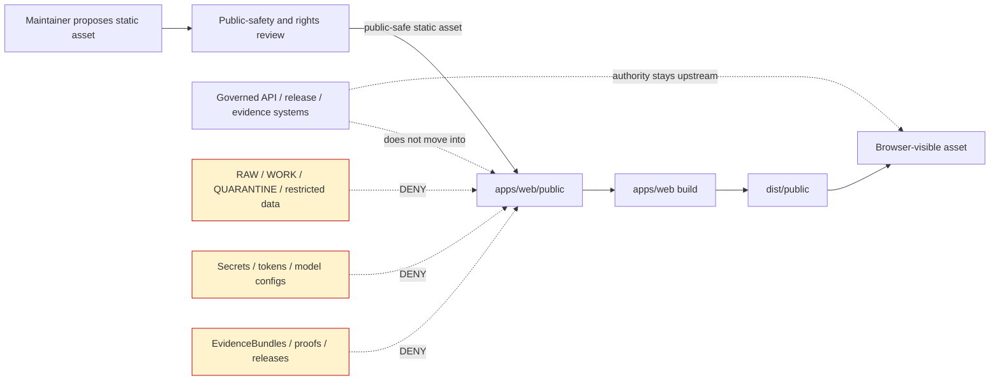

<!-- [KFM_META_BLOCK_V2]
doc_id: kfm://doc/TODO-VERIFY-apps-web-public-readme-uuid
title: apps/web/public — Static Browser Assets
type: standard
version: v1
status: draft
owners: TODO-VERIFY apps/web owner
created: TODO-VERIFY-existing-file-created-date
updated: 2026-05-07
policy_label: TODO-VERIFY-public
related: [../README.md, ../package.json, ../index.html, ../scripts_build.mjs, ../vite.config.js, ../src/README.md, ../../../README.md, ../../../docs/architecture/map-shell.md, ../../../docs/adr/ADR-0001-schema-home.md, ../../../docs/adr/ADR-0002-responsibility-root-monorepo.md]
tags: [kfm, apps-web, public-assets, static-assets, browser, vite, maplibre, governance]
notes: [Existing apps/web/public/README.md was minimal; doc_id, owner, original created date, and policy label need maintainer verification. Everything in this directory should be treated as browser-exposed.]
[/KFM_META_BLOCK_V2] -->

<a id="top"></a>

# `apps/web/public` — Static Browser Assets

Static browser-exposed assets for the KFM governed web shell; not a data, evidence, policy, release, or proof-object store.

> [!IMPORTANT]
> Assume anything placed here can be copied into the browser-visible build output. Do not place secrets, source data, unpublished candidates, evidence bundles, proof packs, restricted geometry, direct model prompts, or policy authority here.

## Impact block

| Field | Value |
| --- | --- |
| Status | **active** — path exists; asset policy and ownership still need maintainer verification |
| Owners | **TODO-VERIFY:** apps/web owner, UI steward, security reviewer |
| Path | `apps/web/public/README.md` |
| Repo role | Static browser asset directory for `apps/web` |
| Badges |     |
| Quick jumps | [Scope](#scope) · [Repo fit](#repo-fit) · [Inputs](#inputs) · [Exclusions](#exclusions) · [Directory tree](#directory-tree) · [Build behavior](#build-behavior) · [Diagram](#diagram) · [Asset intake checklist](#asset-intake-checklist) · [FAQ](#faq) |

---

## Scope

`apps/web/public` is a narrow browser-static asset boundary. It may hold small, public-safe files that support the web shell at runtime, such as icons, web manifests, harmless placeholder imagery, and other static assets intended to be served directly by the browser app.

This directory is **not** a KFM publication lane. It is downstream of the governed web app, downstream of release decisions, and downstream of the KFM trust membrane.

### What this directory protects

KFM’s public UI should remain downstream of:

```text
RAW -> WORK / QUARANTINE -> PROCESSED -> CATALOG / TRIPLET -> PUBLISHED
```

Static web assets may help the shell load, brand, or render the experience. They must not become a shortcut around source intake, evidence resolution, policy checks, review, release manifests, correction notices, rollback cards, or governed API mediation.

<p align="right"><a href="#top">Back to top ↑</a></p>

---

## Repo fit

| Relationship | Relative link | Status | Role |
| --- | --- | --- | --- |
| This directory README | `README.md` | **CONFIRMED path** | Documents the static browser asset boundary. |
| Parent web app README | [`../README.md`](../README.md) | **CONFIRMED path** | Defines the governed web shell boundary. |
| Web package manifest | [`../package.json`](../package.json) | **CONFIRMED path** | Declares `@kfm/web`, npm scripts, Vite, Vitest, MapLibre, and PMTiles dependencies. |
| App HTML entry | [`../index.html`](../index.html) | **CONFIRMED path** | Browser entry that mounts the shell. |
| Static build script | [`../scripts_build.mjs`](../scripts_build.mjs) | **CONFIRMED path** | Copies `public/` into `dist/public` when the directory exists. |
| Vite config | [`../vite.config.js`](../vite.config.js) | **CONFIRMED path** | Defines local dev/preview host, port, proxy, and build output behavior. |
| Web source README | [`../src/README.md`](../src/README.md) | **CONFIRMED path** | Documents source-tree trust boundaries. |
| Root README | [`../../../README.md`](../../../README.md) | **CONFIRMED path** | Defines KFM trust law and responsibility-root posture. |
| Map shell architecture | [`../../../docs/architecture/map-shell.md`](../../../docs/architecture/map-shell.md) | **CONFIRMED path** | Explains browser map shell trust boundaries. |
| Schema-home ADR | [`../../../docs/adr/ADR-0001-schema-home.md`](../../../docs/adr/ADR-0001-schema-home.md) | **CONFIRMED path** | Separates semantic contracts from machine schemas and policy decisions. |
| Responsibility-root ADR | [`../../../docs/adr/ADR-0002-responsibility-root-monorepo.md`](../../../docs/adr/ADR-0002-responsibility-root-monorepo.md) | **CONFIRMED path** | Governs root and responsibility placement. |

### Upstream

Static assets placed here should originate from reviewed UI, documentation, design, or release processes. If an asset carries map, evidence, source, policy, or release meaning, the meaning belongs upstream in governed contracts, manifests, registries, release records, or API payloads.

### Downstream

This directory can be copied into browser-visible output. Downstream consumers are the built web bundle, local preview server, and end-user browser.

<p align="right"><a href="#top">Back to top ↑</a></p>

---

## Inputs

Accepted inputs are intentionally limited.

| Input | Belongs here when… | Required posture |
| --- | --- | --- |
| `favicon.ico`, `icon.svg`, app icons | The file is harmless, public, and browser-facing. | Public-safe; no embedded secrets or restricted metadata. |
| `site.webmanifest` / app manifest | It describes browser install/display metadata only. | No private endpoints, tokens, sensitive paths, or false release claims. |
| Static logo or banner image | It is approved branding or documentation imagery. | Public-safe; license and source are known. |
| Placeholder imagery | It is synthetic or intentionally public-safe. | Must not resemble restricted exact locations or real sensitive records. |
| Browser-only helper assets | They support rendering, accessibility, or shell loading. | Must not encode policy, source authority, or canonical data. |
| Reviewed static map UI assets | They are sprites, glyphs, icons, or style support assets that do not stand alone as evidence. | Versioned where meaning matters; source and license review complete. |
| Tiny static examples | They are explicitly marked example/demo and not used as truth. | No production claims; no raw source material; no sensitive detail. |

> [!TIP]
> When an asset’s meaning affects trust, keep the **asset** here only if it must be browser-static. Keep the **authority** in the appropriate KFM responsibility root.

<p align="right"><a href="#top">Back to top ↑</a></p>

---

## Exclusions

| Do not place here | Why | Use instead |
| --- | --- | --- |
| RAW, WORK, or QUARANTINE data | Breaks lifecycle and public-client boundaries. | `data/raw/`, `data/work/`, `data/quarantine/` through governed pipelines. |
| Canonical records or source-native exports | Static web assets are not truth storage. | Canonical data stores or governed lifecycle roots. |
| `EvidenceBundle`, proof packs, receipts, release manifests, rollback cards | These are trust-bearing objects, not browser-static decorations. | `data/proofs/`, `data/receipts/`, `release/`, or governed API surfaces. |
| `SourceDescriptor` registries or source authority tables | Source authority belongs to governance and registry surfaces. | `data/registry/`, `control_plane/`, `contracts/`, `schemas/`, `policy/`. |
| `LayerManifest` as the only layer authority | A public file can be served, but authority must be governed and validated. | Layer registry, release manifest, governed API, or validated fixture path. |
| PMTiles, GeoParquet, COG, vector tiles, or large map artifacts by default | Public static serving can bypass release, cache, rollback, and policy review. | `data/published/`, tile service, release-controlled artifact store, or reviewed manifest path. |
| Secrets, API keys, source credentials, tokens | Browser bundles and public assets expose contents. | Secret manager or local environment outside git. |
| Direct model prompts or model runtime configs | Focus Mode must route through governed API and evidence mediation. | Governed API/runtime adapter surfaces. |
| Exact sensitive locations | Risks archaeology, rare species, infrastructure, cultural, land, living-person, or steward-controlled exposure. | Restricted review, generalized/redacted artifacts, or DENY. |
| Generated screenshots containing restricted state | Screenshots can leak exact locations or review-only context. | Public-safe reviewed screenshots only. |

> [!WARNING]
> “It is just a static file” is not a KFM exemption. If the browser can fetch it, it needs public-safe review.

<p align="right"><a href="#top">Back to top ↑</a></p>

---

## Directory tree

Current verified file inventory for this directory is intentionally narrow.

```text
apps/web/public/
└── README.md    # CONFIRMED: existing directory README
```

Suggested future shape, if maintainers add static assets:

```text
apps/web/public/
├── README.md
├── favicon.ico                 # PROPOSED: browser icon only
├── icon.svg                    # PROPOSED: public-safe app icon
├── site.webmanifest            # PROPOSED: browser install metadata
├── robots.txt                  # PROPOSED: crawl guidance, if needed
├── assets/
│   ├── README.md               # PROPOSED: required if asset collection grows
│   ├── icons/
│   └── imagery/
└── examples/
    └── README.md               # PROPOSED: only public-safe demo assets
```

### Growth rule

Create subdirectories only when they reduce review risk. If `assets/` or `examples/` grows beyond a few files, add a local README that states accepted inputs, exclusions, license/source expectations, and public-safety checks.

<p align="right"><a href="#top">Back to top ↑</a></p>

---

## Build behavior

`apps/web` is an npm package. The package manifest declares `npm@10`, Vite, Vitest, MapLibre GL JS, PMTiles, and scripts for development, preview, checking, testing, formatting, auditing, and building.

Use the repo-native commands only after dependency installation and current branch verification.

```bash
cd apps/web

npm run check
npm run build
npm run check:dist
```

The custom static build script copies this directory into `apps/web/dist/public` when `apps/web/public` exists.

```bash
cd apps/web

npm run build:static
npm run check:dist
```

> [!CAUTION]
> These commands are confirmed as declared scripts, not as passing results in this document. Record actual command output in the PR, validation report, or release note before claiming success.

<p align="right"><a href="#top">Back to top ↑</a></p>

---

## Diagram



<p align="right"><a href="#top">Back to top ↑</a></p>

---

## Asset intake checklist

Use this checklist before adding or replacing anything under `apps/web/public`.

- [ ] The asset is intended to be browser-visible.
- [ ] The asset does not contain secrets, tokens, private URLs, internal hostnames, or source credentials.
- [ ] The asset does not contain RAW, WORK, QUARANTINE, unpublished, or canonical internal data.
- [ ] The asset does not contain exact sensitive coordinates, rare-species locations, archaeology site locations, infrastructure vulnerabilities, living-person details, DNA/genomic data, private land records, or steward-only context.
- [ ] License, attribution, and source rights are known or the asset is synthetic/internal and approved for public use.
- [ ] The asset does not become the only source of layer, evidence, source, policy, or release meaning.
- [ ] If the asset changes map interpretation, an upstream manifest, contract, release note, or review record is updated.
- [ ] The asset can be removed or rolled back without deleting evidence, release, or correction lineage.
- [ ] `npm run check` and the applicable build command are run before merge.
- [ ] Documentation is updated if the directory contents or public-safety rules change.

### Suggested asset review card

```yaml
# Example only. Use repo-native review records if available.
asset_review:
  path: apps/web/public/TODO
  status: PROPOSED
  public_safe: NEEDS_VERIFICATION
  asset_kind: icon | manifest | image | example | other
  source_or_author: TODO
  license_or_rights: TODO
  contains_geodata: false
  contains_sensitive_location: false
  contains_secret_or_token: false
  carries_trust_meaning: false
  upstream_authority_if_any: TODO
  reviewer: TODO
  rollback: remove asset and rebuild apps/web
```

<p align="right"><a href="#top">Back to top ↑</a></p>

---

## FAQ

### Can public assets include map data?

Not by default. Static map artifacts can bypass KFM’s governed release, policy, rollback, and evidence-resolution paths. Use released artifact stores, governed API routes, layer registries, and manifest-backed delivery unless a maintainer records a public-safe exception.

### Can this directory include screenshots?

Yes, if screenshots are public-safe, rights-cleared, and do not reveal restricted geometry, steward-only review state, secrets, unpublished candidate data, or misleading evidence status.

### Can a static JSON file live here?

Only when it is harmless browser metadata, a clearly marked demo fixture, or a reviewed public-safe asset. Do not store authoritative evidence, source registries, layer authority, policy decisions, or release records here.

### Does putting a file here publish it?

It may make the file browser-visible after build or preview. It does **not** make the file a governed KFM publication. Publication still requires evidence, policy, review, release, correction, and rollback controls appropriate to the material.

### Why is this README more strict than a normal `public/` folder note?

KFM treats the UI as part of the trust system. Public browser assets can leak sensitive information or accidentally become ungoverned authority, so this directory needs a clear boundary.

<p align="right"><a href="#top">Back to top ↑</a></p>

---

## Appendix

<details>
<summary>Status labels used here</summary>

| Label | Meaning |
| --- | --- |
| CONFIRMED | Verified from current repository evidence or governing KFM doctrine. |
| PROPOSED | Recommended design, path, or practice not yet verified as implemented. |
| NEEDS VERIFICATION | Checkable item that should be verified before being treated as active fact. |
| UNKNOWN | Not verified strongly enough from the available repo or doctrine evidence. |
| DENY | Must not proceed on the public/static path under the stated condition. |

</details>

<details>
<summary>Open verification items</summary>

- Confirm `apps/web/public/` complete current file inventory in a mounted checkout.
- Confirm CODEOWNERS or maintainer owner routing for `apps/web/public`.
- Replace `doc_id` with a real KFM document UUID.
- Confirm original creation date for the existing README.
- Confirm final policy label for this README.
- Confirm whether `public/` contents are included in all production build paths, not only the custom static build path.
- Confirm whether any browser-public asset inventory or license registry already exists elsewhere.
- Confirm whether static asset review should emit a receipt, PR template entry, or release note.

</details>

<p align="right"><a href="#top">Back to top ↑</a></p>
