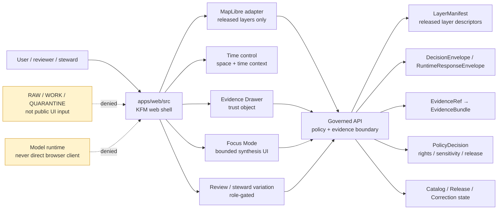

<!-- [KFM_META_BLOCK_V2]
doc_id: kfm://doc/TODO-VERIFY-apps-web-src-readme-uuid
title: apps/web/src
type: standard
version: v1
status: draft
owners: TODO-VERIFY(web-ui-owner, design-reviewer, security-steward)
created: TODO-VERIFY(YYYY-MM-DD)
updated: 2026-04-30
policy_label: TODO-VERIFY(public|restricted)
related: [TODO-VERIFY:../README.md, TODO-VERIFY:../../../README.md, TODO-VERIFY:../../../contracts/README.md, TODO-VERIFY:../../../schemas/README.md, TODO-VERIFY:../../../schemas/contracts/README.md, TODO-VERIFY:../../../policy/README.md, TODO-VERIFY:../../../tests/README.md, TODO-VERIFY:../../../docs/adr/]
tags: [kfm, web, ui, maplibre, evidence-drawer, focus-mode, governed-api, trust-state]
notes: [Prepared from attached KFM doctrine and current-session workspace inspection; mounted repo and exact target-file inventory were not available; keep implementation claims PROPOSED or NEEDS VERIFICATION until apps/web/src is inspected in the real checkout.]
[/KFM_META_BLOCK_V2] -->

<a id="top"></a>

# `apps/web/src`

Intended source home for the KFM web shell: a MapLibre-first, trust-visible UI that consumes governed API payloads and keeps evidence, policy, time, review, and correction state visible.


> [!IMPORTANT]
> **Impact block**
>
> | Field | Value |
> |---|---|
> | Status | `experimental` until the mounted repository confirms this tree, package manager, routes, tests, and ownership |
> | Owners | `TODO-VERIFY(web-ui-owner, design-reviewer, security-steward)` |
> | Target path | `apps/web/src/README.md` |
> | Boundary role | Web-source directory for the KFM map shell, Evidence Drawer, Focus Mode, trust-state UI, and released-layer interaction |
> | Truth posture | Doctrine-grounded, repo-inventory **NEEDS VERIFICATION** |
> | Quick jumps | [Scope](#scope) · [Repo fit](#repo-fit) · [Inputs](#inputs) · [Exclusions](#exclusions) · [Directory tree](#directory-tree) · [Quickstart](#quickstart) · [Usage](#usage) · [Diagram](#diagram) · [Operating tables](#operating-tables) · [Task list](#task-list--definition-of-done) · [FAQ](#faq) · [Appendix](#appendix) |

> [!NOTE]
> This README is written as a **repo-ready target draft**. It should be rechecked against the real branch before merge. Do not upgrade `PROPOSED`, `UNKNOWN`, or `NEEDS VERIFICATION` claims until source files, tests, workflows, package metadata, and adjacent docs are inspected.

---

## Scope

`apps/web/src` is the intended web-source boundary for KFM’s outward-facing map and evidence interaction shell.

Its job is not to create truth. Its job is to render and navigate **released, policy-shaped, evidence-resolvable** state from governed interfaces while making trust cues visible at the point of use.

### What this source tree should protect

The web shell should preserve these KFM invariants:

- `RAW → WORK / QUARANTINE → PROCESSED → CATALOG / TRIPLET → PUBLISHED`
- public and ordinary UI surfaces use governed interfaces, not raw or canonical stores
- `EvidenceRef → EvidenceBundle` resolution happens before consequential claims
- MapLibre renders released artifacts; it does not decide truth, source authority, policy, or release state
- Focus Mode is bounded synthesis, not a free-form browser chatbot
- Evidence Drawer is a mandatory trust object, not an optional tooltip
- sensitive or restricted detail is denied, redacted, generalized, or routed to steward-only review surfaces

### What this README must answer

A maintainer should be able to open this file and quickly understand:

1. what belongs in `apps/web/src`;
2. what must stay outside this source tree;
3. how the web shell fits upstream governed API, contracts, schemas, policy, tests, and release artifacts;
4. where MapLibre, Evidence Drawer, Focus Mode, trust-state UI, review surfaces, and story/export surfaces should connect;
5. which implementation claims still require branch-level verification.

<p align="right"><a href="#top">Back to top ↑</a></p>

---

## Repo fit

### Intended location

`apps/web/src/README.md`

### Boundary role

`apps/web/src` should be the UI implementation surface for rendering KFM’s governed product experience. It sits **downstream** of contracts, released layer manifests, policy decisions, evidence bundles, catalog/release state, and governed API response envelopes.

It should not reach sideways into hidden stores or upward into publication authority.

### Upstream and downstream references

> [!NOTE]
> The references below are intentionally marked `TODO-VERIFY`. Convert path text to hard relative links only after the real repo confirms those files exist from `apps/web/src/`.

| Relationship | Reference | Status | Why it matters |
|---|---|---:|---|
| Parent app README | `../README.md` | **NEEDS VERIFICATION** | Should explain app-level package, build, and deployment conventions. |
| Repo root | `../../../README.md` | **NEEDS VERIFICATION** | Should define project entry point and global repo expectations. |
| Governed API | `../../governed_api/README.md` or `../../governed-api/README.md` | **CONFLICTED / NEEDS VERIFICATION** | UI must consume governed responses; path naming must be resolved by repo evidence or ADR. |
| Contracts | `../../../contracts/README.md` | **NEEDS VERIFICATION** | UI payloads should be contract-led, not improvised inside components. |
| Machine schemas | `../../../schemas/README.md` and `../../../schemas/contracts/README.md` | **NEEDS VERIFICATION** | Evidence Drawer, Focus Mode, runtime envelope, and layer payloads need one canonical schema home. |
| Policy | `../../../policy/README.md` | **NEEDS VERIFICATION** | UI must display policy outcomes and must not make hidden policy decisions. |
| Tests | `../../../tests/README.md` | **NEEDS VERIFICATION** | Type, fixture, policy, accessibility, and no-bypass tests should anchor UI claims. |
| Decisions | `../../../docs/adr/` | **NEEDS VERIFICATION** | Path conflicts, schema-home choices, renderer role, and public/steward separation need ADR coverage. |
| Released artifacts | `../../../data/published/`, `../../../release/`, or repo-native equivalent | **NEEDS VERIFICATION** | UI should consume published/released artifacts or governed API summaries only. |
| Downstream users | browser shell, reviewers, stewards, exported stories, public map readers | **PROPOSED** | These users receive visible trust state, not raw or unpublished project state. |

### Local responsibility boundary

| This source tree should own | This source tree should not own |
|---|---|
| Map shell composition and interaction state | canonical evidence storage |
| MapLibre layer/source adapters for released layers | `RAW`, `WORK`, or `QUARANTINE` reads |
| Evidence Drawer payload rendering | evidence resolution logic that belongs server-side |
| Focus Mode UI and finite outcome rendering | direct model calls or prompt assembly from browser state |
| trust-state badges, negative states, freshness cues | policy engine or publication gate authority |
| selection, compare, story, export previews | signing, promotion, proof-pack generation, or source intake |
| accessibility, keyboard paths, drawer usability | private steward-only exact-location disclosure unless role-gated |

<p align="right"><a href="#top">Back to top ↑</a></p>

---

## Inputs

### Accepted inputs

`apps/web/src` may accept code, fixtures, and local docs that render already-governed UI state.

| Accepted input | Status | Belongs here when… |
|---|---:|---|
| Map shell components | **PROPOSED** | they render released layers and preserve time, trust, and selection state. |
| MapLibre adapters | **PROPOSED** | they consume `LayerManifest` or governed layer descriptors only. |
| Evidence Drawer components | **PROPOSED** | they render `EvidenceDrawerPayload` and never fetch raw stores directly. |
| Focus Mode panels | **PROPOSED** | they render `RuntimeResponseEnvelope` / `DecisionEnvelope` outcomes from governed API calls. |
| Trust-state badges and negative-state components | **PROPOSED** | they represent `ANSWER`, `ABSTAIN`, `DENY`, `ERROR`, stale, redacted, superseded, withdrawn, unresolved, or review-required states. |
| Time controls | **PROPOSED** | they distinguish event time, observation time, source vintage, processing time, release time, and selected view time. |
| Story/export preview components | **PROPOSED** | they preview outward artifacts with evidence, policy, correction, and release context intact. |
| Review/steward shell variation | **PROPOSED / ROLE-GATED** | it remains audited and does not become a separate truth system. |
| Accessibility and interaction tests | **PROPOSED** | they prove keyboard navigation, semantic state labels, drawer reachability, and no color-only trust cues. |
| Public-safe UI fixtures | **PROPOSED** | they are small, synthetic or released examples with no restricted geometry or private tokens. |

### Runtime payloads this tree may render

| Payload family | Expected UI behavior |
|---|---|
| `LayerManifest` | renders released layer source/style metadata and trust cues. |
| `EvidenceDrawerPayload` | opens claim/source/policy/review/release/correction context. |
| `RuntimeResponseEnvelope` | displays finite Focus Mode outcomes without smoothing over failure. |
| `DecisionEnvelope` | displays policy, evidence, and release decision state. |
| `TrustState` | drives badges, chips, warnings, and disabled states. |
| `StoryManifest` / export preview payloads | preserves citation, release, provenance, and correction context. |

<p align="right"><a href="#top">Back to top ↑</a></p>

---

## Exclusions

### What does not belong in `apps/web/src`

| Excluded item | Why it is excluded | Put it here instead |
|---|---|---|
| direct reads from `data/raw/`, `data/work/`, or `data/quarantine/` | breaks the public trust membrane | governed API or fixture-only tests |
| direct canonical-store queries | turns the UI into a hidden truth surface | governed API resolver |
| direct model runtime calls | bypasses policy, evidence resolution, and citation validation | governed API Focus endpoint / model adapter |
| source connectors or live harvesting | source intake requires rights, cadence, steward, and quarantine controls | `connectors/`, `pipelines/`, or repo-native source intake surface |
| policy-as-code definitions | browser UI may display policy decisions, not become the policy authority | `policy/` |
| promotion or publication gates | promotion is a governed state transition, not a UI action alone | `tools/validators/`, `release/`, `data/proofs/`, or CI |
| proof packs, signatures, or attestations | proof objects are release/control-plane artifacts | `data/proofs/`, `tools/attest/`, or repo-native proof lane |
| raw prompt files for production model behavior | prompt/runtime contracts require adapter, citation, and policy validation | `packages/ai/`, `prompts/`, or governed API runtime surface |
| sensitive exact-location public rendering | exact restricted detail must fail closed or be role-gated | steward/review surface with auth and audit |

> [!CAUTION]
> A browser component that can answer a consequential question without a governed response envelope is a trust-boundary defect.

<p align="right"><a href="#top">Back to top ↑</a></p>

---

## Directory tree

> [!IMPORTANT]
> This tree is **PROPOSED / NEEDS VERIFICATION**. It is a reviewable responsibility map, not a claim that these folders already exist. Preserve actual repo conventions if they differ.

```text
apps/web/src/
├── README.md                         # this file
├── app/                              # PROPOSED: app shell bootstrap, routes, providers
├── api/                              # PROPOSED: typed governed API client only
├── map/
│   ├── adapters/                     # PROPOSED: MapLibre adapter boundary
│   ├── layers/                       # PROPOSED: layer descriptor bindings from governed manifests
│   ├── styles/                       # PROPOSED: public-safe style fragments / metadata
│   └── time/                         # PROPOSED: time-aware map state helpers
├── components/
│   ├── evidence/                     # PROPOSED: Evidence Drawer and claim/source cards
│   ├── focus/                        # PROPOSED: Focus Mode panels and finite outcomes
│   ├── trust-state/                  # PROPOSED: chips, badges, stale/redacted/superseded states
│   ├── review/                       # PROPOSED: role-gated review/steward shell variation
│   ├── story/                        # PROPOSED: story/dossier/export preview components
│   └── accessibility/                # PROPOSED: helpers for labels, focus traps, keyboard paths
├── state/                            # PROPOSED: view/session state; never canonical state
├── fixtures/                         # PROPOSED: public-safe UI fixtures only
└── __tests__/                        # PROPOSED: component, contract-fixture, accessibility, no-bypass tests
```

### Directory-tree acceptance rule

Each new folder should answer at least one of these questions:

- Which governed payload does it render?
- Which trust cue does it make visible?
- Which public/steward boundary does it protect?
- Which test proves it does not bypass the governed API?
- Which rollback or disable path exists if the surface leaks or misrepresents trust state?

<p align="right"><a href="#top">Back to top ↑</a></p>

---

## Quickstart

### 1. Verify the branch before trusting this README

Run these from the repository root after the real checkout is mounted.

```sh
git status --short
git branch --show-current
find apps/web/src -maxdepth 2 -type f | sort | sed -n '1,160p'
find apps/web -maxdepth 3 \( -name package.json -o -name tsconfig.json -o -name vite.config.* -o -name next.config.* -o -name webpack.config.* \) -print
```

### 2. Verify package and test conventions

```sh
# TODO-VERIFY(package manager, workspace name, and script names)
<package-manager> --filter <web-workspace> typecheck
<package-manager> --filter <web-workspace> test
<package-manager> --filter <web-workspace> lint
```

### 3. Check for trust-boundary violations

```sh
# Read-only scan examples; adapt to repo-native tooling.
grep -RInE "data/(raw|work|quarantine)|localhost:11434|ollama|openai|canonical|vector_index|secret|token" apps/web/src || true
grep -RInE "EvidenceDrawer|Focus|RuntimeResponseEnvelope|DecisionEnvelope|LayerManifest|EvidenceBundle" apps/web/src || true
```

### 4. Verify README-specific structure

```sh
# TODO-VERIFY(repo doc tooling)
# Expected checks: KFM_META_BLOCK_V2, one H1, quick jumps, no broken relative links,
# placeholder review, and no unsupported implementation claims.
<repo-doc-check-command> apps/web/src/README.md
```

<p align="right"><a href="#top">Back to top ↑</a></p>

---

## Usage

### Add a map layer

A map layer is acceptable only when the browser receives a released or governed descriptor.

```ts
// pseudocode — adapt to repo-native types after schema verification
type GovernedLayerBinding = {
  layerId: string;
  layerManifestRef: string;
  sourceRole: "released_layer" | "published_summary";
  evidenceMode: "drawer_required" | "summary_only";
  timeSemantics: {
    observedAt?: string;
    validFrom?: string;
    validTo?: string;
    sourceVintage?: string;
    releaseDate?: string;
  };
  trustState: "current" | "stale" | "redacted" | "superseded" | "withdrawn";
};
```

Required behavior:

1. do not embed raw source URLs unless they are public released artifacts;
2. do not point to `RAW`, `WORK`, or `QUARANTINE`;
3. carry evidence, policy, freshness, sensitivity, and release metadata into the layer panel or drawer;
4. provide a disable or rollback feature flag for public surfaces.

### Add an Evidence Drawer component

Evidence Drawer components should render evidence and trust state; they should not decide support on their own.

```ts
// pseudocode — render only, do not resolve evidence here
type EvidenceDrawerViewModel = {
  claimTitle: string;
  evidenceBundleRefs: string[];
  sourceCards: Array<{
    sourceId: string;
    sourceRole: string;
    rightsState: "public" | "restricted" | "unknown";
    freshnessState: "current" | "stale" | "unknown";
  }>;
  policyState: "allowed" | "redacted" | "denied" | "review_required";
  correctionState?: "current" | "superseded" | "withdrawn";
};
```

Required behavior:

- show source role and evidence support near the claim;
- show rights, sensitivity, review, and freshness cues;
- make redaction/generalization visible;
- expose correction and rollback state when supplied;
- display `ABSTAIN`, `DENY`, or `ERROR` honestly instead of hiding the drawer.

### Add Focus Mode UI

Focus Mode components should render bounded outcomes from a governed API response.

```ts
// pseudocode — response shape belongs to schemas/contracts/v1 once verified
type FocusOutcome = "ANSWER" | "ABSTAIN" | "DENY" | "ERROR";

type FocusViewModel = {
  outcome: FocusOutcome;
  answerText?: string;
  reasonCodes: string[];
  citations: Array<{ evidenceRef: string; label: string }>;
  policyState: string;
  releaseState: string;
};
```

Required behavior:

- no browser-to-model runtime calls;
- no browser-composed prompt over raw state;
- no uncited generated language;
- `ABSTAIN` when evidence is insufficient;
- `DENY` when policy, rights, sensitivity, role, or release state blocks the answer;
- `ERROR` when the system fails without leaking internals.

<p align="right"><a href="#top">Back to top ↑</a></p>

---

## Diagram



<p align="right"><a href="#top">Back to top ↑</a></p>

---

## Operating tables

### UI surface rules

| Surface | Must do | Must never do |
|---|---|---|
| Map shell | render released layers and current scope/time context | become the canonical truth store |
| Layer panel | show source role, freshness, release, and sensitivity cues | flatten modeled, observed, documentary, and generalized layers into one kind of truth |
| Evidence Drawer | show claim, source, EvidenceBundle refs, policy, review, release, correction, and caveats | behave like an optional tooltip with missing trust state |
| Focus Mode | render `ANSWER / ABSTAIN / DENY / ERROR` from governed responses | act as a free-form chatbot or direct model client |
| Review surface | expose role-gated review state, obligations, diffs, and decisions | become an alternate hidden truth system |
| Compare mode | preserve asymmetry between compared states | merge separate times/releases into a false simplified summary |
| Story/export preview | preserve citations, trust cues, and correction state | strip provenance, generalization, or redaction context |

### State model

| State family | Examples | Persistence expectation | Authority level |
|---|---|---|---|
| View state | camera, zoom, selected tab, drawer open/closed | browser/session | presentation only |
| Interaction state | selected feature, hovered layer, compare target | browser/session or URL-safe state | presentation only |
| Released UI state | layer manifest, trust badges, public-safe payloads | governed API / released artifact | downstream of release |
| Evidence state | EvidenceBundle refs, source cards, claim support | governed API | trust-bearing |
| Policy state | allowed, denied, redacted, review-required | governed API / policy decision | trust-bearing |
| Canonical/internal state | raw source, work records, restricted exact geometry | not accessible from this tree | internal only |

### Negative states

| State | Display rule |
|---|---|
| `ABSTAIN` | Show why the system cannot support an answer from available evidence. |
| `DENY` | Show policy/sensitivity/release reason without leaking restricted detail. |
| `ERROR` | Show safe operational failure and request/correlation ID if available. |
| `stale` | Preserve the claim but mark freshness and source/release age visibly. |
| `redacted` | Show that precision or content changed because of policy. |
| `superseded` | Link to current replacement when the governed payload provides it. |
| `withdrawn` | Do not silently disappear; show correction/withdrawal state if public-safe. |

<p align="right"><a href="#top">Back to top ↑</a></p>

---

## Task list / definition of done

Before a change under `apps/web/src` is ready to merge, verify the applicable gates.

- [ ] **Repo evidence:** package manager, app framework, existing tree, and adjacent README conventions are inspected.
- [ ] **Contract fit:** UI payloads are backed by contracts or explicitly marked `PROPOSED`.
- [ ] **No raw path:** component code does not read `RAW`, `WORK`, `QUARANTINE`, canonical restricted stores, vector indexes, or private graph internals.
- [ ] **No direct model client:** Focus Mode does not call model runtimes from the browser.
- [ ] **Evidence closure:** consequential claims have `EvidenceRef` / `EvidenceBundle` references or render `ABSTAIN`.
- [ ] **Policy visibility:** denied, redacted, review-required, stale, superseded, or withdrawn states are visible.
- [ ] **Sensitive geometry:** exact restricted coordinates do not appear in public UI fixtures, screenshots, logs, bundles, or story output.
- [ ] **Accessibility:** trust cues have semantic labels and are not color-only.
- [ ] **Time semantics:** event, observation, source, processing, publication, and selected-view time are not collapsed.
- [ ] **Rollback:** public layers or surfaces can be disabled, withdrawn, or reverted without deleting audit context.
- [ ] **Tests:** typecheck, component tests, fixture tests, no-bypass scans, and accessibility checks are run with repo-native commands.
- [ ] **Docs:** adjacent README or ADR updates accompany material behavior changes.

<p align="right"><a href="#top">Back to top ↑</a></p>

---

## FAQ

### Is MapLibre the truth source?

No. MapLibre is the disciplined 2D renderer and interaction runtime for the web shell. Truth-bearing state comes through governed payloads, released artifacts, evidence bundles, policy decisions, and review/release records.

### Can this tree call the governed API directly?

Yes, that is the expected public path. The UI should call governed API endpoints or consume released artifacts. It should not call raw storage, unpublished candidate stores, direct model runtimes, or hidden canonical internals.

### Can the browser assemble Focus Mode prompts?

No. Browser state can describe selected scope and user intent, but evidence resolution, policy checks, context assembly, model-adapter calls, citation validation, and response envelopes belong behind the governed API boundary.

### Can a component hide `DENY` or `ABSTAIN` to make the UI smoother?

No. Negative states are part of KFM’s truth posture. The UI should make them understandable, not invisible.

### What happens if the real repo uses `apps/explorer-web` or `apps/governed-api` naming?

Keep this README aligned to the requested target path, but resolve naming conflicts with repo evidence and an ADR. Do not duplicate source authority across parallel app names.

<p align="right"><a href="#top">Back to top ↑</a></p>

---

## Appendix

<details>
<summary>What this README is not allowed to claim yet</summary>

The mounted repository was not available when this draft was prepared. Keep these claims downgraded until the real checkout proves them.

| Claim type | Current label | Required proof before upgrade |
|---|---:|---|
| `apps/web/src` exists with this tree shape | **NEEDS VERIFICATION** | mounted repo tree |
| `apps/web/src/README.md` already exists | **UNKNOWN** | target file inspection |
| owners for `apps/web/src` | **TODO-VERIFY** | `CODEOWNERS`, team docs, or maintainer record |
| package manager and workspace name | **UNKNOWN** | lockfile, package config, app README |
| framework: React/Vite/Next/Webpack/etc. | **UNKNOWN** | package/config source files |
| MapLibre shell implementation exists | **UNKNOWN** | source files + tests |
| Evidence Drawer implementation exists | **UNKNOWN** | source files + payload fixtures |
| Focus Mode implementation exists | **UNKNOWN** | source files + governed API contract/tests |
| governed API route names | **NEEDS VERIFICATION** | API source files + OpenAPI/contracts |
| policy gates are enforced at runtime | **NEEDS VERIFICATION** | policy files + invalid fixtures + runtime tests |
| release/proof/correction artifacts exist | **UNKNOWN** | catalog/proof/release directories and emitted objects |
| public deployment exposure is safe | **UNKNOWN** | deployment manifests, proxy/firewall/VPN posture, logs |

</details>

<details>
<summary>Glossary</summary>

| Term | Meaning in this README |
|---|---|
| Evidence Drawer | Trust-visible UI surface that renders evidence, source role, policy, review, release, freshness, correction, and caveat context. |
| Focus Mode | Bounded synthesis surface that answers, abstains, denies, or errors from governed responses only. |
| Governed API | Server-side trust boundary for policy checks, evidence resolution, release-aware responses, and finite runtime envelopes. |
| LayerManifest | Release-aware descriptor for map layers, sources, time semantics, trust state, and public-safe delivery. |
| Trust membrane | Boundary that prevents public/UI surfaces from reading raw, unpublished, restricted, or model-generated state as truth. |
| Public-safe geometry | Exact, generalized, aggregated, or redacted geometry selected by rights, sensitivity, evidence support, and release policy. |

</details>

<p align="right"><a href="#top">Back to top ↑</a></p>
