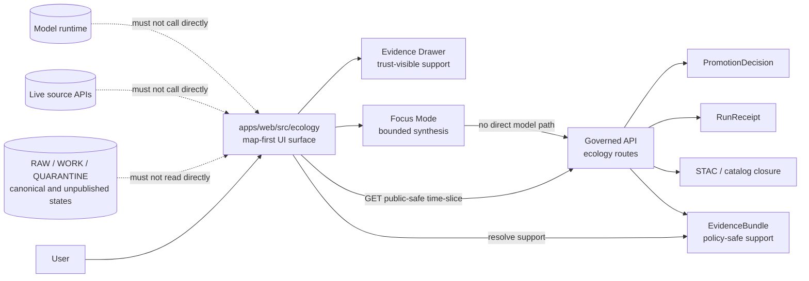

<!-- [KFM_META_BLOCK_V2]
doc_id: kfm://doc/NEEDS_VERIFICATION__apps_web_src_ecology_readme
title: Ecology Web Surface
type: standard
version: v1
status: draft
owners: TODO-VERIFY(web-ui-owner, ecology-steward)
created: NEEDS_VERIFICATION__YYYY-MM-DD
updated: 2026-04-30
policy_label: NEEDS_VERIFICATION__public_or_internal
related: [../../README.md, ../../../../README.md, ../../../../apps/governed_api/README.md, ../../../../schemas/contracts/v1/ecology/README.md, ../../../../policy/ecology/README.md, ../../../../tools/validators/ecology/README.md, ../../../../tests/fixtures/ecology/README.md]
tags: [kfm, ecology, web, map-first, evidence-drawer, focus-mode, governed-api]
notes: [doc_id owners created policy label path existence and adjacent README links require branch-level verification; this README is app-local UI guidance and must not imply active React implementation unless the branch proves it]
[/KFM_META_BLOCK_V2] -->

<a id="top"></a>

# Ecology Web Surface

App-local guidance for rendering governed ecology time-slices, catalog context, EvidenceBundle support, and trust-visible UI states inside `apps/web/src/ecology/`.

> [!IMPORTANT]
> This README is **README-like** and **implementation-facing**. It orients maintainers at the requested path without claiming that every downstream component, route, schema, workflow, or test is already wired on the active branch.

| Impact | Current draft value |
|---|---|
| **Status** | `experimental` |
| **Owners** | `TODO-VERIFY(web-ui-owner, ecology-steward)` |
| **Path** | `apps/web/src/ecology/README.md` |
| **Doc state** | `draft` |
| **Trust posture** | map-first · evidence-first · governed API only · cite-or-abstain |
| **Repo fit** | Child UI surface under `apps/web/src/`; parent web app: [`../../README.md`](../../README.md); root: [`../../../../README.md`](../../../../README.md); upstream governed API, schemas, policy, validators, and fixtures require branch-local link verification |
| **Quick jumps** | [Scope](#scope) · [Repo fit](#repo-fit) · [Inputs](#accepted-inputs) · [Exclusions](#exclusions) · [Evidence snapshot](#current-evidence-snapshot) · [Directory tree](#directory-tree) · [Quickstart](#quickstart) · [Usage](#usage) · [Diagram](#diagram) · [Reference tables](#reference-tables) · [Task list](#task-list--definition-of-done) · [FAQ](#faq) · [Appendix](#appendix) |


---

## Scope

`apps/web/src/ecology/` is the **web-app ecology presentation lane**.

It should help the web shell show ecology outputs that are already released, policy-shaped, and evidence-resolvable. It is not the ecology source system, not the promotion gate, not the catalog writer, and not the model authority.

### What this surface owns

This directory may own app-local UI code and notes for:

- ecology time-slice views and selected-layer presentation;
- public-safe ecology layer descriptors or layer adapters;
- Evidence Drawer mappings for ecology time-slice support;
- Focus Mode copy, outcome rendering, and negative-state presentation;
- UI fixtures that mirror governed API responses;
- web-app tests that prove the UI does not bypass the trust membrane.

### What this surface must preserve

The ecology web surface must keep these distinctions visible:

| Distinction | Why it matters |
|---|---|
| `observed` vs `derived` vs `modeled` | Ecology outputs can combine field evidence, imagery-derived surfaces, habitat joins, and analytical products. The UI must not flatten them into one trust class. |
| `public` vs `restricted` vs `generalized` | Species, habitat, and ecological context can carry sensitivity and precision limits. |
| `promoted` vs `held` vs `denied` | Promotion is a governed decision, not a display preference. |
| `EvidenceBundle` vs map tile | Tiles and rendered pixels are downstream artifacts. Evidence support is resolved through governed references. |
| Focus synthesis vs evidence | Focus Mode may explain released evidence; it must not invent unsupported ecological claims. |

[Back to top](#top)

---

## Repo fit

This README sits in the web app, but ecology truth is owned upstream.

| Direction | Surface | Relationship |
|---|---|---|
| Parent | [`../../README.md`](../../README.md) | Web-app boundary, build conventions, and source-tree posture. **NEEDS VERIFICATION**. |
| Root | [`../../../../README.md`](../../../../README.md) | Project-wide identity, governance, and repo navigation. **NEEDS VERIFICATION**. |
| Upstream API | `../../../../apps/governed_api/README.md` | Governs public-safe ecology responses, evidence bundle lookup, catalog access, and negative outcomes. Link target **NEEDS VERIFICATION**. |
| Upstream contracts | `../../../../schemas/contracts/v1/ecology/` | Expected machine contracts for ecology time-slice metadata, receipts, promotion, evidence, and STAC closure. Link target **NEEDS VERIFICATION**. |
| Upstream policy | `../../../../policy/ecology/` | Publication and deny/hold/allow decisions. Link target **NEEDS VERIFICATION**. |
| Upstream validators | `../../../../tools/validators/ecology/` | Time-slice QA, deterministic spec hash, EvidenceBundle, PromotionDecision, and catalog builders. Link target **NEEDS VERIFICATION**. |
| Upstream fixtures | `../../../../tests/fixtures/ecology/` | Public-safe pass/fail fixtures for UI and API compatibility. Link target **NEEDS VERIFICATION**. |
| Downstream local code | `./api/`, `./layers/`, `./components/`, `./types/`, `./__tests__/` | App-local ecology consumers and UI tests when the branch proves or creates them. |

> [!WARNING]
> Do not route around the governed API for convenience. The web shell must not read `RAW`, `WORK`, `QUARANTINE`, canonical stores, source APIs, vector indexes, or model runtimes directly.

[Back to top](#top)

---

## Accepted inputs

The following belong here when they are web-app-local and evidence-safe:

| Accepted input | Belongs here when… | Typical owner |
|---|---|---|
| UI adapters | They consume governed ecology responses and preserve evidence, policy, freshness, and review state. | Web UI |
| Layer descriptors | They point to released/public-safe artifacts or governed endpoints only. | Web UI + ecology steward |
| Evidence Drawer mappings | They render `EvidenceBundle` references, source-role summaries, rights/sensitivity posture, and public-safe limitations. | Web UI + evidence steward |
| Focus Mode message maps | They display `ANSWER`, `ABSTAIN`, `DENY`, and `ERROR` without hiding why the outcome happened. | Web UI + governed AI steward |
| Type guards / DTO mirrors | They mirror upstream contracts without becoming the contract authority. | Web UI |
| UI fixtures | They use redacted, public-safe, deterministic examples; they are not production evidence. | Web UI + test steward |
| Accessibility and rendering tests | They verify trust cues stay visible and usable. | Web UI + QA |

[Back to top](#top)

---

## Exclusions

These do **not** belong in `apps/web/src/ecology/`:

| Excluded item | Goes instead | Reason |
|---|---|---|
| Live source connectors | `connectors/pipelines/ecology/` or repo-equivalent pipeline lane | Source activation requires rights, cadence, endpoint, and steward verification. |
| Raw imagery, rasters, occurrence records, or habitat datasets | `data/raw/`, `data/work/`, `data/quarantine/`, `data/processed/` | The UI should never become a storage or custody lane. |
| Promotion policy | `policy/ecology/` | Policy must be backend-enforced and testable. |
| JSON Schemas / contract authority | `schemas/contracts/v1/ecology/` or repo-decided schema home | Avoid parallel schema universes. |
| EvidenceBundle builders and catalog writers | `tools/validators/ecology/`, `pipelines/`, or catalog tooling | The web surface renders evidence; it does not author proof. |
| Steward-only exact location logic | Role-gated review/steward surfaces | Public UI must not leak sensitive ecology detail. |
| AI adapters or direct model calls | governed API / governed AI runtime | Model output is interpretive and subordinate to evidence. |

[Back to top](#top)

---

## Current evidence snapshot

| Claim | Label | Basis for this README |
|---|---:|---|
| The target file path was requested as `apps/web/src/ecology/README.md`. | **CONFIRMED** | Current task. |
| A mounted repository was not available in this workspace scan. | **CONFIRMED** | Direct workspace inspection during this drafting pass. |
| Ecology dry-run evidence has surfaced around `EcologyTilesetMetadata`, `PromotionDecision`, `EvidenceBundle`, STAC catalog output, and `run_receipt`. | **CONFIRMED as surfaced snippets / NEEDS VERIFICATION as branch state** | Current-session snippets show a governed API and CI-shaped ecology dry-run lane. |
| The surfaced governed API ecology routes include time-slice, evidence bundle, and STAC catalog endpoints. | **CONFIRMED as surfaced snippets / NEEDS VERIFICATION as branch state** | Route snippets show `GET /ecology/timeslices/{id}`, `GET /ecology/evidence/{bundle_id}`, and `GET /ecology/catalog/stac`. |
| The web UI should expose trust cues, Evidence Drawer context, Focus outcomes, rights/sensitivity state, freshness, and review state. | **CONFIRMED doctrine / PROPOSED implementation** | KFM MapLibre/UI doctrine and ecology-lane reports. |
| Exact component names under this directory are not verified. | **UNKNOWN** | No active branch tree was mounted. |

[Back to top](#top)

---

## Directory tree

Target structure only. Create or update these paths only after the active branch proves conventions.

```text
apps/web/src/ecology/
├── README.md
├── api/
│   └── README.md                  # optional: governed API client wrappers only
├── layers/
│   └── README.md                  # optional: ecology layer descriptors/adapters
├── components/
│   ├── README.md                  # optional: local ecology presentation components
│   ├── evidence/
│   │   └── README.md              # optional: Evidence Drawer ecology renderers
│   └── focus/
│       └── README.md              # optional: Focus outcome renderers/copy maps
├── types/
│   └── README.md                  # optional: UI-local DTO mirrors/type guards
├── fixtures/
│   └── README.md                  # optional: public-safe UI fixtures
└── __tests__/
    └── README.md                  # optional: UI contract and no-bypass tests
```

> [!NOTE]
> The tree above is a **placement map**, not evidence that child folders already exist.

[Back to top](#top)

---

## Quickstart

Use a verification-first loop before editing or adding code.

```bash
# 1. Confirm you are in the repository checkout.
git rev-parse --show-toplevel
git status --short
git branch --show-current

# 2. Inspect this target surface and its nearest web neighbors.
find apps/web/src/ecology -maxdepth 3 -type f 2>/dev/null | sort
find apps/web/src -maxdepth 2 -type f -name 'README.md' 2>/dev/null | sort

# 3. Inspect upstream ecology trust surfaces before making UI claims.
find apps/governed_api schemas/contracts/v1/ecology policy/ecology tools/validators/ecology tests/fixtures/ecology \
  -maxdepth 3 -type f 2>/dev/null | sort

# 4. Pressure-test for direct bypass risks in the web app.
grep -RIn "data/raw\|data/work\|data/quarantine\|source API\|KFM_ECOLOGY_ARTIFACT_ROOT\|EvidenceBundle\|EcologyTimesliceResponse" \
  apps/web apps/governed_api schemas policy tests tools 2>/dev/null | sed -n '1,240p'
```

When package-manager evidence exists, run the repo-native UI checks. Until then, keep these as placeholders, not claims:

```bash
# NEEDS VERIFICATION: choose the repo-native command after package manager inspection.
npm test -- --runInBand
pnpm test
yarn test
npm run typecheck
pnpm typecheck
```

[Back to top](#top)

---

## Usage

### Consuming a promoted ecology time-slice

The web app should treat ecology time-slice responses as **release-aware summaries**, not as source truth.

Illustrative response shape from surfaced current-session snippets:

```json
{
  "schema_version": "v1",
  "object_type": "EcologyTimesliceResponse",
  "timeslice_id": "kfm://tileset/ecology/example-pass",
  "promotion": {
    "decision_ref": "kfm://promotion/ecology/example-pass",
    "decision": "PROMOTE",
    "requires_steward": false
  },
  "evidence_bundle_ref": "kfm://evidence/ecology/example-pass-timeslice",
  "run_receipt_ref": "kfm://receipt/run/ecology/dry-run",
  "policy": {
    "decision": "allow",
    "policy_ref": "policy/ecology/publication.rego"
  }
}
```

UI behavior:

1. Render the layer only when promotion and policy allow public display.
2. Show the time window, source role, release/freshness state, and public precision limits near the map.
3. Resolve `evidence_bundle_ref` through the governed API before showing claims in the Evidence Drawer.
4. Preserve `ABSTAIN`, `DENY`, and `ERROR` as visible outcomes; do not replace them with blank UI.
5. Keep map tiles, charts, and summaries subordinate to EvidenceBundle support.

### Evidence Drawer checklist

The ecology Evidence Drawer should show:

- `EvidenceBundle` reference and resolved state;
- source refs, dataset refs, and evidence refs when public-safe;
- rights and sensitivity posture;
- whether exact geometry is present or withheld;
- promotion decision and run receipt reference;
- catalog closure links such as STAC item/collection/catalog refs;
- limitations, stale-state warnings, and correction/rollback references when present.

### Focus Mode checklist

Focus Mode for ecology should:

- accept only released, policy-safe, evidence-resolved context;
- cite every consequential ecological claim;
- use finite outcomes: `ANSWER`, `ABSTAIN`, `DENY`, `ERROR`;
- deny or abstain when evidence is missing, rights are unclear, sensitivity blocks output, or citations fail;
- never reveal restricted species locations or infer species presence outside supplied support.

[Back to top](#top)

---

## Diagram



[Back to top](#top)

---

## Reference tables

### UI responsibility matrix

| UI surface | Must show | Must never do |
|---|---|---|
| Ecology map layer | layer name, time scope, freshness, public precision, promotion state, evidence lookup | imply the rendered tile is canonical truth |
| Selection summary | selected time-slice/object id, policy outcome, EvidenceBundle ref | expose unpublished IDs or restricted exact geometry |
| Evidence Drawer | source role, evidence refs, rights/sensitivity, run receipt, catalog refs, limitations | fetch RAW/WORK/QUARANTINE or source APIs |
| Focus Mode | scoped answer or visible negative outcome with citations | generate uncited species/habitat claims |
| Export/share preview | trust cues, provenance, correction state, generalization context | strip policy, evidence, or sensitivity context |

### Upstream object families

| Object family | UI use | Source of authority |
|---|---|---|
| `EcologyTilesetMetadata` | display layer bounds, zoom range, time window, allowed fields, and spec hash | `schemas/contracts/v1/ecology/` and validators |
| `PromotionDecision` | decide whether a time-slice is displayable and whether steward review is required | promotion gate / governed API |
| `EvidenceBundle` | populate Evidence Drawer and cite-or-abstain checks | evidence resolver / governed API |
| `RunReceipt` | show process memory, policy results, catalog output refs, and replay hooks | receipts lane |
| STAC catalog/item/collection | discovery and release metadata | catalog closure tooling |
| `RuntimeResponseEnvelope` / `DecisionEnvelope` | finite outcomes and negative-state rendering | runtime contract lane |

### Negative outcome display

| Outcome | Meaning | Required UI posture |
|---|---|---|
| `ANSWER` | The response is supported and allowed. | Show answer with evidence and policy cues. |
| `ABSTAIN` | Support is missing, stale, ambiguous, or insufficient. | Say what evidence is missing; offer inspection or narrower scope. |
| `DENY` | Policy, rights, sensitivity, or release state blocks the response. | Show safe reason and obligations; do not leak hidden details. |
| `ERROR` | System or payload failure. | Show non-leaking failure message and audit/debug reference when public-safe. |

[Back to top](#top)

---

## Task list — definition of done

Before this README or any child ecology UI work moves beyond draft:

- [ ] Confirm `apps/web/src/ecology/` exists on the active branch.
- [ ] Confirm parent `apps/web/README.md` and any `apps/web/src/README.md` conventions.
- [ ] Confirm owner coverage through `CODEOWNERS` or repo owner docs.
- [ ] Confirm whether ecology routes live under `apps/governed_api`, `apps/governed-api`, `apps/api/src/api`, or another route home.
- [ ] Confirm the canonical ecology schema home before mirroring DTOs.
- [ ] Add or update UI fixtures for `PROMOTE/allow`, `hold`, `deny`, missing bundle, and restricted-sensitivity cases.
- [ ] Prove the web code does not call `RAW`, `WORK`, `QUARANTINE`, source APIs, or model runtimes directly.
- [ ] Prove the Evidence Drawer can render `EvidenceBundle` support, rights/sensitivity, public precision, and catalog refs.
- [ ] Prove Focus Mode displays `ANSWER`, `ABSTAIN`, `DENY`, and `ERROR` distinctly.
- [ ] Run repo-native UI tests, type checks, accessibility checks, and no-bypass grep checks.
- [ ] Update this README when behavior, routes, DTOs, or policy expectations materially change.

[Back to top](#top)

---

## FAQ

### Is this the ecology source-of-truth lane?

No. This is a web-app surface. Ecology truth, policy, source custody, validation, catalog closure, and promotion live upstream.

### Can the ecology UI read source APIs directly for faster maps?

No. Public and ordinary clients must use governed APIs, released artifacts, and EvidenceBundle resolution.

### Can the UI hide denied or abstained ecology results?

No. Negative outcomes are part of KFM’s trust posture. The UI should show safe reasons and next inspection paths.

### Can this README define final component names?

Not yet. Component names remain **NEEDS VERIFICATION** until branch-local code and adjacent README conventions are inspected.

[Back to top](#top)

---

## Appendix

<details>
<summary>Branch verification notes</summary>

Use this checklist during review:

| Verification item | Expected evidence |
|---|---|
| Path exists | `find apps/web/src/ecology -maxdepth 3 -type f` |
| Parent README convention | `sed -n '1,220p' apps/web/README.md` |
| Upstream route behavior | governed API route files and tests, not only prose |
| Schema authority | `schemas/contracts/v1/ecology/` or documented ADR if another home wins |
| Policy enforcement | `policy/ecology/publication.rego` plus pass/fail fixtures |
| CI behavior | `.github/workflows/ecology-timeslice.yml` or repo-equivalent workflow |
| UI no-bypass | grep/test proof that web code does not read raw lifecycle states or source APIs |
| Accessibility | visible labels/chips for policy, evidence, freshness, sensitivity, and negative states |

</details>

<details>
<summary>Do-not-merge anti-patterns</summary>

- A map popup that states ecological truth without evidence refs.
- A layer descriptor that points to RAW, WORK, QUARANTINE, or an unpublished candidate.
- A Focus Mode response that cites no EvidenceBundle.
- A UI fixture that exposes exact protected species geometry.
- A component that treats `PROMOTE` and `hold` as equivalent.
- A direct browser call to source APIs, model runtimes, or canonical stores.
- A README claim that routes, tests, workflows, or policy are complete without branch-local evidence.

</details>

[Back to top](#top)
