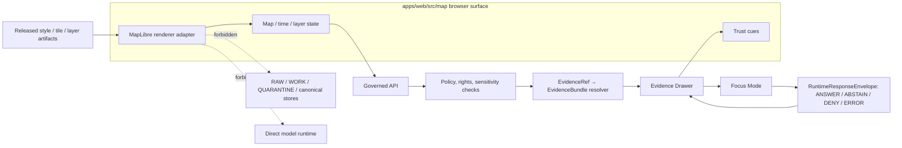

<!-- [KFM_META_BLOCK_V2]
doc_id: kfm://doc/TODO-VERIFY-UUID
title: apps/web/src/map README
type: standard
version: v1
status: draft
owners: TODO: verify apps/web map maintainers
created: 2026-05-01
updated: 2026-05-01
policy_label: TODO-VERIFY-POLICY-LABEL
related: [apps/web/src/map/README.md, TODO-VERIFY-ADJACENT-DOCS]
tags: [kfm, web, map, maplibre, governed-ui, evidence-drawer, focus-mode]
notes: [Generated from attached KFM corpus; mounted repo was not available in this session; verify owners, related paths, package manager, and local README conventions before commit.]
[/KFM_META_BLOCK_V2] -->

<a id="top"></a>

# apps/web/src/map

Purpose: define the governed web-map boundary where MapLibre rendering, map state, evidence inspection, and Focus handoff stay downstream of released KFM evidence.

## Impact block


| Field | Value |
|---|---|
| **Status** | `experimental` — **NEEDS VERIFICATION** against the mounted repository |
| **Owners** | `TODO: verify apps/web map maintainers` |
| **Path** | `apps/web/src/map` |
| **Audience** | Web UI maintainers, map/runtime contributors, evidence-surface reviewers, QA |
| **Primary role** | Governed 2D map runtime, map context capture, trust-visible interaction handoff |
| **Non-role** | Canonical truth store, publication authority, policy authority, citation authority, AI authority |

**Quick jumps:** [Scope](#scope) · [Repo fit](#repo-fit) · [Inputs](#accepted-inputs) · [Exclusions](#exclusions) · [Boundary diagram](#boundary-diagram) · [Runtime contract](#runtime-contract) · [Quickstart](#quickstart) · [Review gates](#review-gates) · [FAQ](#faq) · [Verification backlog](#verification-backlog)

> [!IMPORTANT]
> This README is a repo-ready draft grounded in the KFM document corpus. Current-session repo files, package manager, route names, component names, tests, and CI workflows were **not** directly inspectable. Keep every `NEEDS VERIFICATION` marker until a maintainer checks the real tree.

## Scope

This directory is for the **map-facing web runtime**: the code that renders released map artifacts, preserves map/time/layer state, turns user interactions into governed requests, and keeps trust cues visible.

In KFM terms, this directory should help the browser do four things well:

1. render released, public-safe map artifacts;
2. preserve coordinated **place + time + layer + release** context;
3. hand consequential interactions to governed APIs for evidence and policy resolution;
4. show the user when the answer is supported, stale, restricted, denied, abstained, or errored.

It should **not** assemble truth in the browser. Map code can help users see, select, filter, and inspect; it must not silently replace the governed evidence path.

[Back to top](#top)

## Repo fit

| Relationship | Link or reference | Role |
|---|---|---|
| This directory | [`apps/web/src/map`](.) | Map runtime boundary and local README scope |
| Parent source tree | [`apps/web/src`](..) | Web application source root — **NEEDS VERIFICATION** |
| Web app root | [`apps/web`](../..) | App package root — package manager and scripts **NEED VERIFICATION** |
| Repository root | [`../../../..`](../../../..) | Repo-level docs, contracts, policy, tests, and CI — **NEEDS VERIFICATION** |
| Upstream trust inputs | `LayerManifest`, `StyleManifest`, `TileArtifactManifest`, `MapReleaseManifest`, governed API responses | Released artifacts and runtime envelopes; exact homes **NEED VERIFICATION** |
| Downstream surfaces | Evidence Drawer, Focus Mode, Export/Share, Story/Compare, Review shell variations | Consumers of map context; exact component paths **NEED VERIFICATION** |

**Expected upstream chain:** `PUBLISHED` / released artifacts → governed API / manifests → map runtime → Evidence Drawer / Focus Mode / export surfaces.

**Expected downstream responsibility:** every consequential map interaction should either resolve to evidence, emit a finite negative state, or remain visibly non-authoritative.

[Back to top](#top)

## Accepted inputs

The following belong here only when they remain downstream of governed evidence and policy:

| Accepted input | Conditions for inclusion |
|---|---|
| MapLibre renderer adapter code | Renders released artifacts; does not decide publication, policy, or citation validity |
| Map state helpers | Preserve camera, bounds, active time, selected layer, selected feature, release ID, and role-safe context |
| Layer/style bindings | Bind visible map layers to released manifests and trust cues; do not embed hidden policy logic only in style JSON |
| Evidence Drawer triggers | Pass map context and selected feature identity to governed resolution; do not invent drawer content from feature properties |
| Focus Mode handoff helpers | Send released evidence context and map scope only; never call a model runtime directly |
| Trust-state UI helpers | Display freshness, sensitivity, review, correction, denied, abstained, and stale states at the point of use |
| Accessibility support | Keyboard navigation, non-color cues, focus order, reduced-motion behavior, alt/label text for map controls |
| Tests and fixtures | Public-safe fixtures for map interactions, runtime envelopes, negative states, and no-forbidden-path checks |

[Back to top](#top)

## Exclusions

These do **not** belong in `apps/web/src/map` as normal implementation responsibilities.

| Do not put here | Why not | Send instead to |
|---|---|---|
| RAW / WORK / QUARANTINE reads | Public and ordinary UI surfaces must not read internal lifecycle stores | Pipeline, source lifecycle, or governed backend service homes — **NEEDS VERIFICATION** |
| Canonical store access | Browser rendering must not become canonical truth assembly | Governed API / evidence resolver / canonical service boundary |
| Publication approval logic | Publication is a governed state transition, not a client action | Release / promotion / review control plane |
| Rights or sensitivity decisions | Browser-side hiding is not policy enforcement | Backend policy gate and transform receipts |
| Exact restricted geometry | Styling hidden geometry is not a safe release transform | Redaction/generalization pipeline before publication |
| Direct model runtime calls | Focus Mode must be behind governed API, evidence resolution, policy, citation validation, and receipts | Governed AI adapter boundary |
| Heavy normalization or topology repair | Browser logic should stay thin and inspectable | Upstream processing / validated derived artifacts |
| Source descriptors or schema authority | The map runtime consumes contracts; it should not be the schema registry | Contract/schema registry — exact path **NEEDS VERIFICATION** |
| Popup copy as evidence | Popups are not a substitute for Evidence Drawer payloads | Evidence Drawer contract and resolver |

[Back to top](#top)

## Boundary diagram



**Interpretation rule:** the map renders, selects, frames, and hands off. It does not publish, adjudicate, cite, or synthesize as root truth.

[Back to top](#top)

## Runtime contract

| Map action | Required inputs | Allowed output | Required failure behavior |
|---|---|---|---|
| Feature click | `layer_id`, `feature_id`, `release_id`, active time, user role, map context | Drawer payload, summary affordance, runtime receipt | `ABSTAIN` when no EvidenceBundle resolves; `DENY` when policy blocks; `ERROR` when resolver fails |
| Time brush | Time window, active layers, release manifests | Updated layer state, visible time badge, updated drawer/focus context | `ABSTAIN` when source does not support requested time; `DENY` when hidden time slice would leak restricted state |
| Layer toggle | `LayerManifest`, release state, rights/sensitivity state | Visible layer plus trust badge and runtime receipt | `DENY` when layer is unreleased or source rights are unknown; `ERROR` on manifest/hash mismatch |
| Compare mode | Left/right release, time, style, and layer sets | Explicit support context for each side | `ABSTAIN` when sides cannot resolve independent support |
| Focus question | `MapContextEnvelope`, EvidenceBundle IDs, policy context, user question | `ANSWER`, `ABSTAIN`, `DENY`, or `ERROR` with citations or reasons | No raw feature-property answer; no direct model call; no unclassified prose-only response |
| Export/share | Release ID, selected view state, citation set, correction state, output format | Export artifact with trust metadata and citation appendix | `DENY` when citations fail or release state is missing; `ERROR` when packaging fails |

[Back to top](#top)

## Directory tree

> [!NOTE]
> Current-session repository contents were not available. Replace this section with the real tree after inspecting the mounted branch.

```text
apps/web/src/map/
├── README.md                 # this document
├── adapters/                 # NEEDS VERIFICATION: MapLibre wrapper and event adapters
├── components/               # NEEDS VERIFICATION: map-facing UI components
├── fixtures/                 # NEEDS VERIFICATION: public-safe map/runtime fixtures
├── hooks/                    # NEEDS VERIFICATION: map, time, layer, and selection hooks
├── types/                    # NEEDS VERIFICATION: map context and runtime payload types
└── __tests__/                # NEEDS VERIFICATION: unit/integration tests
```

Suggested replacement command from the repository root:

```bash
find apps/web/src/map -maxdepth 3 -type f | sort
```

[Back to top](#top)

## Quickstart

Use this as the first pass before editing map code.

```bash
# 1. Confirm the repository state.
git status --short
git branch --show-current

# 2. Inventory the map directory.
find apps/web/src/map -maxdepth 3 -type f | sort

# 3. Locate map trust-boundary terms.
grep -RInE \
  'MapLibre|maplibre|EvidenceBundle|EvidenceRef|EvidenceDrawer|FocusMode|LayerManifest|MapReleaseManifest|RuntimeResponseEnvelope|DecisionEnvelope|RAW|WORK|QUARANTINE|canonical|model runtime' \
  apps/web/src/map apps/web/src 2>/dev/null

# 4. Verify no browser-facing map file imports forbidden stores or direct model clients.
grep -RInE \
  'raw|quarantine|work|canonical|ollama|openai|modelAdapter|directModel|secret|token' \
  apps/web/src/map 2>/dev/null
```

Review any positive match by context. A word match is not automatically a violation; undocumented access to forbidden stores, direct model calls, or publication mutation is.

[Back to top](#top)

## Review gates

A map PR is not ready until these checks are addressed or explicitly marked **NEEDS VERIFICATION**.

- [ ] Directory tree, owners, package manager, and adjacent component paths have been verified.
- [ ] Every consequential map interaction reaches a governed API or a finite visible negative state.
- [ ] Feature click does not substitute raw feature properties for an Evidence Drawer payload.
- [ ] Focus Mode handoff includes released evidence context and cannot call a model runtime directly.
- [ ] `ANSWER`, `ABSTAIN`, `DENY`, and `ERROR` are visible and test-covered where relevant.
- [ ] Browser code cannot reach RAW, WORK, QUARANTINE, canonical stores, or direct model endpoints.
- [ ] Sensitive geometry is redacted/generalized before publication, not merely hidden by style.
- [ ] Layer/style/tile artifacts are manifest-bound and rollback-aware.
- [ ] Trust cues include freshness, sensitivity, review state, release state, and correction lineage where meaning changes.
- [ ] Keyboard navigation, focus order, contrast, non-color trust cues, and reduced-motion behavior pass smoke review.
- [ ] Documentation, fixtures, and tests change with behavior.

[Back to top](#top)

## FAQ

### Can MapLibre decide what is true?

No. MapLibre is the disciplined 2D renderer and interaction runtime. It draws released artifacts and captures map context; it does not become the truth store, policy engine, citation authority, publication authority, or AI authority.

### Can a popup replace the Evidence Drawer?

No. A popup may provide a compact affordance, but consequential claims need a Drawer path that exposes evidence, scope, source role, review state, policy posture, release state, and correction lineage.

### What should happen when evidence resolution fails?

Show `ERROR` or `ABSTAIN` with safe reason text. Do not fall back to uncited feature properties, stale local cache, model-generated prose, or hidden developer-only diagnostics.

### Can the map hide restricted data with style rules?

No. Exact restricted geometry should not be shipped publicly and hidden visually. Redaction, generalization, aggregation, and transform receipts belong before public release.

### Can Focus Mode propose map actions?

Yes, as proposals only. Camera moves, layer toggles, time-window changes, review navigation, or export actions must show what will change and which release/manifest/policy context is involved. Consequential actions must not execute silently.

[Back to top](#top)

## Verification backlog

<details>
<summary>Open items to resolve before marking this README active</summary>

- [ ] Replace `TODO-VERIFY-UUID` with the project’s confirmed document identifier.
- [ ] Replace owner placeholder with the confirmed team or maintainer set.
- [ ] Confirm policy label and whether this README should be `public`, `restricted`, or another project label.
- [ ] Verify whether the repo already has a different README/meta-block convention.
- [ ] Replace the provisional directory tree with the real `apps/web/src/map` tree.
- [ ] Add links to adjacent Evidence Drawer, Focus Mode, shell, API, schema, policy, and test docs once confirmed.
- [ ] Confirm package manager and supported local dev/test commands.
- [ ] Confirm current MapLibre package target, lockfile status, browser support matrix, CSP/CORS posture, and plugin/wrapper policy.
- [ ] Confirm actual contract homes for `LayerManifest`, `StyleManifest`, `MapContextEnvelope`, `EvidenceDrawerPayload`, `FocusModeResponse`, and release manifests.
- [ ] Confirm CI gates for no-direct-raw-path, no-direct-model-client, citation validation, accessibility smoke tests, and release/rollback closure.
- [ ] Confirm whether hydrology or another lane supplies the first public-safe map fixture.

</details>

[Back to top](#top)
