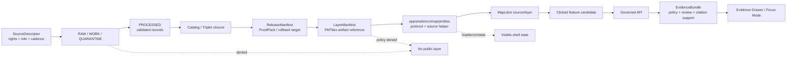

<!-- [KFM_META_BLOCK_V2]
doc_id: kfm://doc/TODO-uuid-apps-web-src-map-pmtiles-readme
title: PMTiles Map Runtime
type: standard
version: v1
status: draft
owners: TODO_NEEDS_VERIFICATION
created: TODO_NEEDS_VERIFICATION
updated: TODO_NEEDS_VERIFICATION
policy_label: TODO_NEEDS_VERIFICATION
related: [TODO_NEEDS_VERIFICATION]
tags: [kfm, maplibre, pmtiles, map-runtime]
notes: [Draft README for apps/web/src/map/pmtiles; mounted repository tree, owners, dates, package manager, schema home, and adjacent README conventions still need verification.]
[/KFM_META_BLOCK_V2] -->

# PMTiles Map Runtime

Purpose: define how `apps/web/src/map/pmtiles/` should connect released PMTiles artifacts to the governed MapLibre shell without turning map delivery into canonical truth.

<a id="top"></a>

> [!IMPORTANT]
> This directory is a **delivery/runtime boundary**. PMTiles may make KFM map layers fast and portable, but PMTiles are still rebuildable derivatives. They do not replace source records, EvidenceBundles, ReleaseManifests, policy decisions, review state, or catalog closure.

| Impact field | Value |
| --- | --- |
| Status | `experimental` until the real repository tree, package manager, tests, and adjacent map modules are verified |
| Owners | `TODO_NEEDS_VERIFICATION` |
| Badges |     |
| Quick jumps | [Scope](#scope) · [Repo fit](#repo-fit) · [Inputs](#inputs) · [Exclusions](#exclusions) · [Directory tree](#directory-tree) · [Usage](#usage) · [Validation gates](#validation-gates) · [FAQ](#faq) |

---

## Scope

This folder should hold the browser-side PMTiles integration for the KFM map shell.

It is responsible for:

- registering the `pmtiles://` protocol with MapLibre in a controlled, idempotent way;
- turning already-released layer metadata into MapLibre source definitions;
- keeping PMTiles URLs, source IDs, layer IDs, attribution, digest metadata, and release references attached to the map runtime;
- surfacing tile/load/integrity/freshness failures as visible runtime states instead of silent fallbacks;
- providing small, deterministic tests and fixtures for PMTiles source wiring.

It is **not** responsible for deciding whether a layer is true, safe, publishable, sensitive, current, authoritative, or fully cited.

[Back to top](#top)

---

## Repo fit

> [!NOTE]
> The exact neighboring modules and schema paths are **NEEDS VERIFICATION** because the mounted repository tree was not available when this README was drafted. Treat the paths below as expected fit, not confirmed implementation.

| Role | Path or surface | Status | Relationship |
| --- | --- | --- | --- |
| This directory | `apps/web/src/map/pmtiles/` | `PROPOSED / NEEDS VERIFICATION` | PMTiles protocol registration, source helpers, fixture-safe runtime adapters |
| Upstream release metadata | `ReleaseManifest`, `LayerManifest`, catalog records | `PROPOSED` | Supplies released artifact references, digests, policy labels, source roles, and rollback targets |
| Upstream evidence | `EvidenceRef` → `EvidenceBundle` | `CONFIRMED doctrine / UNKNOWN implementation` | Supports claims shown in Evidence Drawer or Focus Mode; PMTiles features are candidates until resolved |
| Upstream governance | policy, rights, sensitivity, promotion, review | `CONFIRMED doctrine / UNKNOWN implementation` | Must approve public use before a PMTiles layer is registered as available |
| Peer map runtime | `apps/web/src/map/` | `NEEDS VERIFICATION` | MapLibre shell, layer registry, interaction state, selected feature state |
| Downstream UI | Evidence Drawer, Focus Mode, map popups | `CONFIRMED doctrine / UNKNOWN implementation` | Consumes governed payloads; does not infer truth from tile presence |

### Boundary rule

```text
ReleaseManifest + LayerManifest
  -> PMTiles runtime adapter
  -> MapLibre source/layer
  -> feature candidate
  -> governed API
  -> EvidenceBundle + policy + review state
  -> Evidence Drawer / Focus Mode
```

A rendered feature is a **candidate visual object**, not a public claim by itself.

---

## Inputs

Only these inputs belong in this folder.

| Input | Required posture | Why it is allowed here |
| --- | --- | --- |
| Released PMTiles URL or artifact reference | `PUBLISHED` or release-candidate fixture only | The browser should load only released/public-safe artifacts or explicit test fixtures |
| Layer/source ID | Stable, manifest-backed, reviewable | Prevents anonymous tile sources and orphaned layers |
| Attribution text | Source-derived and release-approved | Keeps public map output honest about source obligations |
| Digest / size / media type metadata | Manifest-backed | Supports integrity display, audit, and cache invalidation reasoning |
| Evidence references | `EvidenceRef[]`, not raw evidence blobs | Enables downstream EvidenceBundle resolution without exposing internal stores |
| Policy/review/freshness labels | finite, visible, fail-closed | Lets the shell show trust state instead of hiding uncertainty |
| MapLibre runtime instance | already initialized by the governed shell | This folder wires sources; it should not own the whole map shell |

### Minimal accepted source shape

The exact schema home is **NEEDS VERIFICATION**, but source metadata should carry these concepts before it reaches this folder:

| Concept | Example value | Status |
| --- | --- | --- |
| `layer_id` | `kfm.hydrology.huc12.public` | illustrative |
| `artifact_role` | `map_delivery` | expected |
| `media_type` | `application/vnd.pmtiles` | expected |
| `href` | `https://example.invalid/releases/.../huc12.pmtiles` | illustrative |
| `sha256` | `sha256:...` | expected |
| `release_id` | `kfm-release-...` | expected |
| `policy_label` | `public` / `restricted` / `denied` | expected |
| `evidence_refs` | `["kfm://evidence/..."]` | expected |

---

## Exclusions

Do **not** put these responsibilities in `apps/web/src/map/pmtiles/`.

| Excluded item | Where it should live instead | Reason |
| --- | --- | --- |
| Raw, work, or quarantine data | governed data lifecycle storage | Public UI must not read unpublished material |
| PMTiles generation scripts | pipeline/build tooling | Tile creation is a governed build step, not a browser concern |
| Source harvesting or live connector calls | source pipeline / governed API | Rights, cadence, steward, and sensitivity checks happen upstream |
| Policy decisions | policy engine / governed backend | The browser can display policy state, not author it |
| EvidenceBundle assembly | governed API / evidence service | Evidence resolution must be auditable and policy-aware |
| Sensitive geometry generalization | processing pipeline | Redaction and generalization require transform receipts |
| Canonical records | canonical domain stores | PMTiles are derivative delivery artifacts |
| AI or Focus Mode answer generation | governed AI adapter behind API | AI remains downstream of evidence and policy |
| Emergency/life-safety instruction behavior | official alerting channels | KFM map delivery must not become an emergency alert system |

---

## Directory tree

Target shape — **PROPOSED / NEEDS VERIFICATION**.

```text
apps/web/src/map/pmtiles/
├── README.md
├── index.ts
├── pmtilesProtocol.ts
├── pmtilesSources.ts
├── pmtilesManifest.ts
├── pmtilesEvents.ts
├── fixtures/
│   ├── released-layer.manifest.json
│   └── denied-layer.manifest.json
└── __tests__/
    ├── pmtilesProtocol.test.ts
    ├── pmtilesSources.test.ts
    └── pmtilesManifest.test.ts
```

| File | Responsibility | Must not do |
| --- | --- | --- |
| `index.ts` | Export the stable PMTiles runtime API | Export raw fixtures as production defaults |
| `pmtilesProtocol.ts` | Register `pmtiles://` once and expose cleanup/test hooks if needed | Re-register protocol on every render |
| `pmtilesSources.ts` | Convert approved layer metadata into MapLibre source definitions | Hardcode unpublished PMTiles URLs |
| `pmtilesManifest.ts` | Normalize manifest metadata used by the shell | Decide policy, rights, or sensitivity |
| `pmtilesEvents.ts` | Translate load/error/stale states into shell-visible status | Hide failures behind silent fallback |
| `fixtures/` | Store tiny no-network test fixtures | Store real source data or production tiles |
| `__tests__/` | Validate idempotency, fail-closed behavior, and manifest wiring | Depend on live external services |

[Back to top](#top)

---

## Usage

### 1. Register the protocol once

Illustrative TypeScript only — adapt names and imports to the verified repo stack.

```ts
import maplibregl from "maplibre-gl";
import { PMTiles, Protocol } from "pmtiles";

let sharedProtocol: Protocol | undefined;

export function ensurePmtilesProtocol(): Protocol {
  if (sharedProtocol) return sharedProtocol;

  sharedProtocol = new Protocol();
  maplibregl.addProtocol("pmtiles", sharedProtocol.tile);

  return sharedProtocol;
}

export function addReleasedPmtilesArchive(href: string): PMTiles {
  const protocol = ensurePmtilesProtocol();
  const archive = new PMTiles(href);

  protocol.add(archive);
  return archive;
}
```

### 2. Create a MapLibre source from released metadata

```ts
type ReleasedPmtilesLayer = {
  layerId: string;
  sourceId: string;
  href: string;
  attribution: string;
  policyLabel: "public" | "restricted" | "denied" | "unknown";
  releaseId: string;
  sha256?: string;
  evidenceRefs: string[];
};

export function toMapLibreVectorSource(layer: ReleasedPmtilesLayer) {
  if (layer.policyLabel !== "public") {
    return {
      outcome: "DENY" as const,
      reason: "Layer is not public-release approved.",
      layerId: layer.layerId,
      releaseId: layer.releaseId,
    };
  }

  return {
    outcome: "ALLOW" as const,
    sourceId: layer.sourceId,
    source: {
      type: "vector" as const,
      url: `pmtiles://${layer.href}`,
      attribution: layer.attribution,
    },
    evidenceRefs: layer.evidenceRefs,
    releaseId: layer.releaseId,
    sha256: layer.sha256,
  };
}
```

### 3. Treat clicked features as candidates

```ts
type FeatureCandidate = {
  layerId: string;
  sourceId: string;
  featureId?: string | number;
  properties: Record<string, unknown>;
  evidenceRefs: string[];
  releaseId: string;
};

export function toFeatureCandidate(input: FeatureCandidate) {
  return {
    kind: "map_feature_candidate",
    ...input,
    next: "resolve EvidenceRef through governed API before emitting a claim",
  };
}
```

> [!WARNING]
> Do not build Evidence Drawer text from tile attributes alone. Tile properties may help select a feature, but consequential statements must come from governed evidence resolution.

---

## Diagram



---

## Validation gates

A PMTiles layer is ready for the governed shell only when these checks pass.

| Gate | Check | Expected result |
| --- | --- | --- |
| Manifest closure | PMTiles reference has `release_id`, media type, digest or integrity reference, attribution, and rollback target | `ALLOW` only when complete |
| Lifecycle | Artifact came from `PUBLISHED` or approved release-candidate fixture | no RAW/WORK/QUARANTINE source |
| Rights | Source terms and attribution are known | fail closed on unknown public rights |
| Sensitivity | Exact sensitive geometry is redacted, generalized, staged, or denied upstream | no sensitive exact-location leak |
| Evidence | Layer metadata carries EvidenceRefs for downstream resolution | map does not invent claims |
| Protocol | `pmtiles://` registration is idempotent | no duplicate registration in React rerenders |
| Hosting | Range/CORS/cache behavior is verified for the deployment target | no silent fallback |
| UI state | load, stale, denied, and error outcomes surface to the shell | no invisible trust break |
| Tests | no-network fixtures cover allow, deny, malformed manifest, duplicate registration, and missing evidence refs | deterministic test suite |

### Definition of done

- [ ] Owners are replaced in the meta block.
- [ ] `doc_id`, `created`, `updated`, `policy_label`, and `related` are verified.
- [ ] Adjacent map module paths are confirmed.
- [ ] Package manager and test runner are confirmed.
- [ ] The PMTiles protocol helper is tested for idempotency.
- [ ] Fixture manifests include at least one allowed and one denied layer.
- [ ] No production PMTiles URL is hardcoded outside a manifest-backed path.
- [ ] The shell shows denied/error/stale states.
- [ ] Evidence Drawer integration resolves EvidenceRefs through the governed API.
- [ ] Focus Mode cannot answer from tile properties alone.
- [ ] Review confirms that PMTiles remain derivative map-delivery artifacts.

[Back to top](#top)

---

## Review checklist for maintainers

Use this before approving changes under this directory.

| Question | Required answer |
| --- | --- |
| Does this change keep PMTiles downstream of ReleaseManifest / LayerManifest? | yes |
| Does the browser avoid reading canonical, RAW, WORK, or QUARANTINE stores? | yes |
| Are denied/restricted/unknown policy states fail-closed? | yes |
| Are tile attributes treated as feature-selection context rather than citation support? | yes |
| Are source IDs and layer IDs stable enough for Evidence Drawer references? | yes |
| Is cache invalidation tied to release identity or manifest hash? | yes |
| Can this layer be rolled back by release/manifest alias rather than code surgery? | yes |
| Are examples clearly fixtures or illustrative when not production-backed? | yes |

---

## FAQ

### Is a PMTiles layer authoritative?

No. A PMTiles layer is a delivery artifact. It may render authoritative material, but authority comes from the source role, evidence, validation, policy, review, catalog closure, and release state behind it.

### Can the UI filter PMTiles features client-side?

Yes, for exploration and display. No, for creating consequential claims. Consequential statements must resolve through governed evidence paths.

### Can a public PMTiles URL expose sensitive data?

Yes. A publicly readable PMTiles archive can expose the whole tileset, not only the currently visible map view. Sensitive or restricted layers need upstream redaction/generalization, staged access, or a server-mediated path.

### Should this folder generate PMTiles?

No. Generation belongs in governed pipeline/build tooling with receipts, proofs, and release manifests. This folder consumes released artifacts.

### What happens when a manifest is incomplete?

Fail closed. Show a visible denied/error/unknown state and avoid registering the layer as public-ready.

---

## Appendix

<details>
<summary>Illustrative layer manifest fragment</summary>

This fragment is not a confirmed schema. It shows the minimum concepts this directory expects to receive from upstream release metadata.

```json
{
  "release_id": "kfm-release-TODO",
  "layer_id": "kfm.example.public_layer",
  "source_id": "kfm-example-public-layer",
  "artifact_role": "map_delivery",
  "policy_label": "public",
  "review_state": "published",
  "freshness": {
    "status": "current",
    "as_of": "TODO_NEEDS_VERIFICATION"
  },
  "assets": {
    "pmtiles": {
      "href": "https://example.invalid/releases/kfm/example.pmtiles",
      "media_type": "application/vnd.pmtiles",
      "sha256": "sha256:TODO",
      "bytes": 0
    }
  },
  "attribution": "TODO_NEEDS_VERIFICATION",
  "evidence_refs": [
    "kfm://evidence/TODO"
  ],
  "rollback": {
    "previous_release_id": "kfm-release-TODO"
  }
}
```

</details>

<details>
<summary>Terminology</summary>

| Term | Meaning in this README |
| --- | --- |
| PMTiles | Single-file tile archive used here as a map-delivery artifact |
| MapLibre source | Runtime source definition consumed by MapLibre GL JS |
| LayerManifest | Expected release-side description of layer identity, source, artifact, policy, and evidence linkage |
| ReleaseManifest | Expected release-side object that records what was promoted, how, and how to roll it back |
| EvidenceRef | Pointer to evidence; not the evidence itself |
| EvidenceBundle | Resolved evidence, source role, scope, provenance, and citation support |
| Feature candidate | A clicked or selected map feature that still needs governed evidence resolution before it becomes a claim |
| Fail closed | Deny or abstain when rights, sensitivity, integrity, release state, or evidence support is missing |

</details>

[Back to top](#top)
