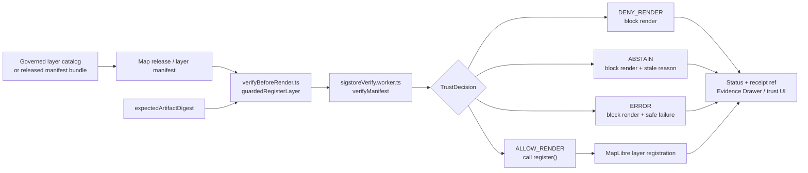

<!-- [KFM_META_BLOCK_V2]
doc_id: kfm://doc/TODO-VERIFY-apps-web-src-trust-readme-uuid
title: apps/web/src/trust — Browser Render Trust Gate
type: standard
version: v1
status: draft
owners: TODO-VERIFY(web-ui-owner, map-shell-steward, release-security-steward)
created: 2026-05-07
updated: 2026-05-07
policy_label: TODO-VERIFY(public|restricted)
related: [../../README.md, ../../package.json, ../README.md, ../map/README.md, ../../../../docs/adr/ADR-0003-maplibre-renderer-boundary.md, ../../../../docs/adr/ADR-0206-maplibre-layer-manifest.md, ../../../../docs/adr/ADR-0001-schema-home.md, ../../../../data/registry/layers/README.md]
tags: [kfm, web, trust, maplibre, render-gate, release-manifest, evidence, fail-closed]
notes: [doc_id owners and policy_label need verification, current checked file was placeholder content and should be replaced by this README, current worker performs manifest-field and policy-profile checks and must not be described as full production Sigstore cryptographic verification]
[/KFM_META_BLOCK_V2] -->

<a id="top"></a>

# apps/web/src/trust — Browser Render Trust Gate

Fail-closed browser-side trust checks for KFM map artifacts before MapLibre layer registration.

<p>
  
  
  
  
  
  
</p>

> [!IMPORTANT]
> **Impact block**
>
> | Field | Value |
> |---|---|
> | Status | `active` code path; README and production enforcement posture remain `draft / NEEDS VERIFICATION` |
> | Owners | `TODO-VERIFY(web-ui-owner, map-shell-steward, release-security-steward)` |
> | Target path | `apps/web/src/trust/README.md` |
> | Boundary role | Pre-render browser gate for released public-safe map manifests and layer registration |
> | Upstream | release manifests, layer registry records, expected artifact digests, governed API/catalog payloads, policy/release decisions |
> | Downstream | MapLibre layer registration, evidence receipt reference display, status messaging, no-bypass render behavior |
> | Quick jumps | [Scope](#scope) · [Repo fit](#repo-fit) · [Accepted inputs](#accepted-inputs) · [Exclusions](#exclusions) · [Directory tree](#directory-tree) · [Quickstart](#quickstart) · [Runtime flow](#runtime-flow) · [Usage](#usage) · [Decision matrix](#decision-matrix) · [Known limits](#known-limits) · [Task list](#task-list--definition-of-done) · [FAQ](#faq) · [Appendix](#appendix) |

> [!WARNING]
> This directory is a **browser render gate**, not the root trust authority. It must never replace server-side release validation, policy gates, EvidenceBundle resolution, promotion decisions, proof packs, receipts, correction notices, or rollback controls.

---

## Scope

`apps/web/src/trust` protects the KFM web shell from rendering a map artifact before the client has received an explicit trust decision.

The current trust slice is intentionally small:

- `verifyBeforeRender.ts` creates a module worker and asks it to verify a manifest against an expected artifact digest.
- `guardedRegisterLayer(...)` blocks the caller’s `register()` callback unless verification returns `ALLOW_RENDER`.
- `sigstoreVerify.worker.ts` maps manifest checks into finite render decisions.
- Local Vitest tests prove a valid fixture can allow rendering and invalid fixtures block layer registration.

In KFM terms, this folder should enforce the browser-side version of a simple rule:

> A map layer is not allowed to render merely because the browser can fetch bytes. Rendering must be bound to released state, public-safe policy, digest agreement, supported signer identity, non-stale trust root, and a visible receipt or reason code.

### What this gate protects

This directory helps preserve these KFM invariants inside the browser shell:

- MapLibre renders downstream artifacts; it does not decide truth.
- Public UI surfaces do not bypass release and policy gates.
- Layer loading has a finite outcome, not silent best-effort rendering.
- Negative states are visible and testable.
- A failed or stale trust check blocks layer registration instead of producing a pretty but unsupported map.
- Receipt references, when supplied, can be surfaced by Evidence Drawer or trust-state UI.

### What this gate does not prove by itself

This directory does **not** prove that a release is authoritative, that source rights are valid, that a signature was cryptographically verified against a production transparency log, that sensitive geometry is safe, or that the artifact should be published.

Those decisions belong upstream in KFM’s governed source, evidence, policy, release, receipt, proof, and review surfaces.

<p align="right"><a href="#top">Back to top ↑</a></p>

---

## Repo fit

### Intended location

`apps/web/src/trust/README.md`

### Confirmed local neighbors

| Path | Role | Status |
|---|---|---:|
| [`verifyBeforeRender.ts`](./verifyBeforeRender.ts) | Browser helper that starts the verification worker and gates layer registration. | **CONFIRMED** |
| [`sigstoreVerify.worker.ts`](./sigstoreVerify.worker.ts) | Worker module that evaluates manifest fields and returns finite render decisions. | **CONFIRMED** |
| [`__tests__/verifyBeforeRender.test.ts`](./__tests__/verifyBeforeRender.test.ts) | No-bypass test proving failed verification prevents `register()` execution. | **CONFIRMED** |
| [`__tests__/sigstoreVerify.worker.test.ts`](./__tests__/sigstoreVerify.worker.test.ts) | Worker decision tests for valid and missing-bundle fixtures. | **CONFIRMED** |

### Upstream and downstream references

| Relationship | Link from this README | Status | Why it matters |
|---|---|---:|---|
| Web app README | [`../../README.md`](../../README.md) | **CONFIRMED** | App-level governed web shell orientation. |
| Web package metadata | [`../../package.json`](../../package.json) | **CONFIRMED** | npm, Vite, Vitest, MapLibre, PMTiles, and script evidence. |
| Parent source README | [`../README.md`](../README.md) | **CONFIRMED** | Source-tree trust and UI boundary guidance. |
| Map runtime README | [`../map/README.md`](../map/README.md) | **CONFIRMED** | MapLibre renderer boundary inside the source tree. |
| Renderer ADR | [`../../../../docs/adr/ADR-0003-maplibre-renderer-boundary.md`](../../../../docs/adr/ADR-0003-maplibre-renderer-boundary.md) | **CONFIRMED** | MapLibre is renderer, not truth authority. |
| LayerManifest ADR | [`../../../../docs/adr/ADR-0206-maplibre-layer-manifest.md`](../../../../docs/adr/ADR-0206-maplibre-layer-manifest.md) | **CONFIRMED** | Public/semi-public layers should load from governed layer manifests. |
| Schema-home ADR | [`../../../../docs/adr/ADR-0001-schema-home.md`](../../../../docs/adr/ADR-0001-schema-home.md) | **CONFIRMED** | Machine schemas belong under the accepted schema home; this folder should consume types, not become schema authority. |
| Layer registry | [`../../../../data/registry/layers/README.md`](../../../../data/registry/layers/README.md) | **CONFIRMED** | Registry surface for layer manifests and release-aware map layer records. |
| Valid manifest fixture | [`../../../../tests/fixtures/maps/trust/valid/signed_manifest.valid.json`](../../../../tests/fixtures/maps/trust/valid/signed_manifest.valid.json) | **CONFIRMED** | Happy-path trust fixture used by worker tests. |
| Invalid digest fixture | [`../../../../tests/fixtures/maps/trust/invalid/hash_mismatch.json`](../../../../tests/fixtures/maps/trust/invalid/hash_mismatch.json) | **CONFIRMED** | Negative-path fixture proving digest mismatch blocks rendering. |

### Boundary sentence

`apps/web/src/trust` may decide whether the browser should proceed with a render attempt for a manifest-backed artifact. It must not decide source authority, evidence sufficiency, public release eligibility, sensitive geometry exposure, or model-answer validity.

<p align="right"><a href="#top">Back to top ↑</a></p>

---

## Accepted inputs

This directory accepts only small, browser-safe inputs needed to make a pre-render decision.

| Input | Required shape or behavior | Current handling |
|---|---|---|
| `manifest` | Release/map manifest-like object with signature, artifact digest, signer identity, trust-root expiry, release state, and policy label. | Passed to worker as `any`; schema validation remains **NEEDS VERIFICATION**. |
| `expectedArtifactDigest` | Digest expected by the caller before layer registration. | Compared against `manifest.artifacts[0].digest` and `manifest.signature.signed_digest`. |
| `policyProfile` | Browser request policy context. | Worker denies when profile is `"deny"`; current helper sends `"public-safe"`. |
| `nowIso` | Optional injected time for deterministic tests or runtime evaluation. | Worker defaults to a fixed fixture-time value when omitted. |
| `register()` callback | Function that performs MapLibre or layer registration. | Called only after `ALLOW_RENDER`. |
| `setStatus(...)` callback | UI status update hook. | Receives blocked or loaded status messages. |
| `setEvidenceReceiptRef(...)` callback | UI hook for receipt reference display. | Receives `result.receipt_ref` when provided. |
| Public-safe fixtures | Minimal valid and invalid manifests for no-network tests. | Used by Vitest tests under `__tests__/`. |

### Manifest fields currently exercised

The current worker expects or inspects these manifest fields:

```yaml
manifest_id: string
release_state: released
policy_label: public-safe
signer_identity: spiffe://kfm/signers/<name>
trust_root_expires_at: ISO-8601 timestamp
artifacts:
  - digest: sha256:<hex>
signature:
  bundle: object
  signature: string
  signed_digest: sha256:<hex>
```

> [!NOTE]
> The current worker checks manifest structure, digest agreement, signer identity prefix, trust-root staleness, release state, and policy label. It should not be described as full Sigstore/Rekor production verification until cryptographic verification, trust-root handling, workflow evidence, and production fixtures are implemented and reviewed.

<p align="right"><a href="#top">Back to top ↑</a></p>

---

## Exclusions

These do **not** belong in `apps/web/src/trust` as normal responsibilities.

| Excluded item | Why it is excluded | Candidate home or upstream surface |
|---|---|---|
| RAW, WORK, QUARANTINE, unpublished candidate, or canonical store reads | Browser render gates must not bypass lifecycle law. | governed API, release pipeline, or lifecycle stores |
| Source authority decisions | A signer prefix is not source authority. | `SourceDescriptor`, source registry, evidence resolver |
| Rights and sensitivity adjudication | Browser checks can display/deny, but policy authority is upstream. | `policy/`, release gate, steward review |
| Promotion decisions | Rendering is downstream of promotion; it is not promotion. | `release/`, promotion tools, review records |
| Proof-pack generation | The browser may consume proof references; it must not author proof packs. | `data/proofs/`, release tooling |
| Signature creation or key material | Public browser bundles must never contain signing secrets. | signing/attestation tooling, CI, secure release environment |
| Production transparency-log verification claims without implementation | The current worker does not prove full Sigstore/Rekor validation. | release verifier, audited worker implementation, CI evidence |
| Direct model runtime clients | Trust gating map artifacts is separate from governed AI. | governed API model adapter |
| Silent fallback rendering | If trust fails, layer registration must be blocked. | no fallback; show finite negative state |

> [!CAUTION]
> Hiding a layer after it renders is weaker than blocking the registration path. This directory’s default posture should be **verify before render**, not **render then hope**.

<p align="right"><a href="#top">Back to top ↑</a></p>

---

## Directory tree

Current target tree for this directory:

```text
apps/web/src/trust/
├── README.md
├── sigstoreVerify.worker.ts
├── verifyBeforeRender.ts
└── __tests__/
    ├── sigstoreVerify.worker.test.ts
    └── verifyBeforeRender.test.ts
```

### File responsibilities

| File | Owns | Must not own |
|---|---|---|
| `verifyBeforeRender.ts` | Worker startup and `guardedRegisterLayer(...)` render gate. | Policy engine, release creation, direct artifact publication, source/evidence authority. |
| `sigstoreVerify.worker.ts` | Finite manifest decision mapping in a module worker. | Signing keys, raw store access, production trust root management unless explicitly implemented. |
| `__tests__/sigstoreVerify.worker.test.ts` | Worker outcome mapping tests. | End-to-end release proof. |
| `__tests__/verifyBeforeRender.test.ts` | No-bypass registration test. | Full MapLibre runtime integration proof. |
| `README.md` | Human-facing local boundary documentation. | Machine schema authority or policy law. |

<p align="right"><a href="#top">Back to top ↑</a></p>

---

## Quickstart

Run from the web app root.

```bash
cd apps/web

# Confirm package metadata, syntax checks, and formatting.
npm run check

# Run the web test suite.
npm test

# Trust-focused test run; keep if supported by the current Vitest version.
npm test -- src/trust

# Build the web app.
npm run build
```

Full app-level doctor command:

```bash
cd apps/web
npm run doctor
```

> [!IMPORTANT]
> Do not report trust-gate behavior as enforced unless the relevant tests or workflow checks were actually run on the active checkout.

<p align="right"><a href="#top">Back to top ↑</a></p>

---

## Runtime flow



### Outcome grammar

| Outcome | Meaning in this directory | Render behavior |
|---|---|---|
| `ALLOW_RENDER` | Manifest checks passed for the expected artifact and current policy profile. | Call `register()` and surface receipt ref if available. |
| `DENY_RENDER` | Required manifest field, digest agreement, signer prefix, release state, or policy state failed. | Do **not** register the layer. |
| `ABSTAIN` | The worker cannot safely allow rendering, currently used for stale trust root. | Do **not** register the layer; show reason. |
| `ERROR` | Verification logic failed unexpectedly. | Do **not** register the layer; show safe error state. |

<p align="right"><a href="#top">Back to top ↑</a></p>

---

## Usage

### Guard a layer registration

```typescript
import { guardedRegisterLayer } from "./verifyBeforeRender";

await guardedRegisterLayer({
  manifest,
  expectedArtifactDigest: "sha256:1111111111111111111111111111111111111111111111111111111111111111",

  async register() {
    // Register the already-governed map source/layer here.
    // Do not fetch RAW/WORK/QUARANTINE data from this callback.
    map.addSource("layer-a", sourceDefinition);
    map.addLayer(layerDefinition);
  },

  setStatus(status) {
    updateTrustStatus(status);
  },

  setEvidenceReceiptRef(receiptRef) {
    updateEvidenceReceiptRef(receiptRef);
  },
});
```

### Add a new reason code

Reason codes should be stable enough for tests and UI copy. Add a code only when it improves diagnosis without leaking restricted detail.

```typescript
return {
  decision: "DENY_RENDER",
  reason_codes: ["UNSUPPORTED_SIGNER_IDENTITY"],
};
```

Recommended checklist for new reason codes:

- [ ] reason is policy-safe to show in public UI;
- [ ] reason maps to `ALLOW_RENDER`, `DENY_RENDER`, `ABSTAIN`, or `ERROR`;
- [ ] a valid or invalid fixture covers it;
- [ ] UI copy treats it as a finite trust state, not a generic exception;
- [ ] reason is documented in this README’s decision matrix.

<p align="right"><a href="#top">Back to top ↑</a></p>

---

## Decision matrix

Current worker mapping:

| Check | Failure reason code | Decision | Notes |
|---|---|---:|---|
| `manifest.signature.bundle` missing | `MISSING_BUNDLE` | `DENY_RENDER` | Fixture exists for this path. |
| `manifest.signature.signature` missing | `MISSING_SIGNATURE` | `DENY_RENDER` | Add/verify fixture coverage before relying on UI copy. |
| `manifest.artifacts[0].digest` missing | `MISSING_DIGEST` | `DENY_RENDER` | Current implementation checks only the first artifact. |
| `signature.signed_digest`, artifact digest, and expected digest differ | `ARTIFACT_DIGEST_MISMATCH` | `DENY_RENDER` | No-bypass test uses a hash mismatch fixture. |
| `signer_identity` does not start with `spiffe://kfm/signers/` | `UNSUPPORTED_SIGNER_IDENTITY` | `DENY_RENDER` | Actual signer identities remain operationally **NEEDS VERIFICATION**. |
| `trust_root_expires_at <= now` | `STALE_TRUST_ROOT` | `ABSTAIN` | Production clock behavior needs review. |
| `release_state !== "released"` | `POLICY_DENIED` | `DENY_RENDER` | Shared code path with policy label/profile denial. |
| `policy_label !== "public-safe"` | `POLICY_DENIED` | `DENY_RENDER` | Prevents non-public-safe render path. |
| `policyProfile === "deny"` | `POLICY_DENIED` | `DENY_RENDER` | Caller-controlled policy profile gate. |
| Unexpected exception | `VERIFICATION_ERROR` | `ERROR` | Safe failure path. |
| All checks pass | `VERIFIED` | `ALLOW_RENDER` | Emits `receipt:<manifest_id>`. |

<p align="right"><a href="#top">Back to top ↑</a></p>

---

## Known limits

These limits are intentional to keep the current documentation honest.

| Limit | Current label | Required improvement before stronger claims |
|---|---:|---|
| `manifest` is typed as `any`. | **CONFIRMED / NEEDS VERIFICATION** | Bind to canonical schema-generated types after schema home and object shape are accepted. |
| Worker name references Sigstore, but current logic performs fixture-level field checks. | **CONFIRMED** | Add audited cryptographic verification or rename/scope documentation to avoid overclaiming. |
| Only `artifacts[0]` is checked. | **CONFIRMED** | Define multi-artifact behavior and fixtures. |
| Default `nowIso` is a fixed fixture date. | **CONFIRMED / NEEDS VERIFICATION** | Use an injected clock or runtime clock policy in production. |
| Supported signer identity is hard-coded as `spiffe://kfm/signers/`. | **CONFIRMED / NEEDS VERIFICATION** | Verify signer identity registry, trust root, and rotation policy. |
| `receipt_ref` is synthetic: `receipt:<manifest_id>`. | **CONFIRMED / PROPOSED** | Resolve to real release/runtime receipt objects when available. |
| Browser gate is not release authority. | **CONFIRMED doctrine** | Keep upstream release, policy, proof, and EvidenceBundle closure as required gates. |
| Test execution was not run by this README. | **NEEDS VERIFICATION** | Capture current branch test output in PR notes or CI. |

<p align="right"><a href="#top">Back to top ↑</a></p>

---

## Security and fail-closed posture

### Rules for this directory

1. **Block before render.** `register()` must not run unless the decision is `ALLOW_RENDER`.
2. **Finite outcomes only.** Do not introduce ambiguous truthy/falsy return values.
3. **No secrets.** Browser code and fixtures must not contain private keys, source credentials, service tokens, or steward-only data.
4. **No direct raw paths.** Do not fetch from raw, work, quarantine, unpublished, canonical, proof-only, or steward-only stores.
5. **No direct model calls.** This trust gate is not a model runtime client.
6. **Visible negative states.** `DENY_RENDER`, `ABSTAIN`, and `ERROR` should drive user-visible trust UI.
7. **Policy-safe reason text.** Reason codes should diagnose without leaking restricted detail.
8. **Upstream authority preserved.** Server-side release/policy/evidence checks remain mandatory.

### Suggested static scans

```bash
cd apps/web

# Browser trust code should not contain direct source lifecycle or model-runtime paths.
grep -RInE "data/(raw|work|quarantine)|localhost:11434|/api/generate|/api/chat|openai|secret|token" src/trust || true

# Trust code should preserve finite outcome vocabulary.
grep -RInE "ALLOW_RENDER|DENY_RENDER|ABSTAIN|ERROR|reason_codes|receipt_ref" src/trust
```

<p align="right"><a href="#top">Back to top ↑</a></p>

---

## Task list / definition of done

Before a change under `apps/web/src/trust` is ready to merge:

- [ ] `register()` cannot run before `ALLOW_RENDER`.
- [ ] Every new failure path returns `DENY_RENDER`, `ABSTAIN`, or `ERROR`.
- [ ] New reason codes have tests and policy-safe copy.
- [ ] Valid and invalid fixtures are no-network and public-safe.
- [ ] Digest mismatch blocks render.
- [ ] Missing signature material blocks render.
- [ ] Stale trust root abstains or follows an ADR-backed policy.
- [ ] Unsupported signer identity blocks render.
- [ ] Non-`released` or non-`public-safe` manifests block render.
- [ ] Browser code contains no direct RAW, WORK, QUARANTINE, canonical-store, proof-store, steward-store, or direct-model-runtime access.
- [ ] Production cryptographic claims are not made unless implemented and tested.
- [ ] Documentation, tests, and fixtures change together when behavior changes.
- [ ] `npm test` or repo-native CI evidence is captured before claiming enforcement.
- [ ] Rollback is simple: revert trust helper, worker, fixtures, and tests without touching released data.

<p align="right"><a href="#top">Back to top ↑</a></p>

---

## FAQ

### Is this directory the source of truth for release decisions?

No. It is a browser-side pre-render gate. Release authority belongs to governed release, policy, proof, receipt, and review systems.

### Does `sigstoreVerify.worker.ts` currently perform full Sigstore verification?

No. The current worker checks manifest fields and maps them to render decisions. Do not describe it as production Sigstore cryptographic verification until that is implemented, tested, and reviewed.

### Why does `ABSTAIN` exist if rendering is allowed or denied?

`ABSTAIN` is useful when the system cannot safely render but the reason is not a direct policy denial. The current use is stale trust-root state.

### Can a failed manifest still render with a warning?

No. Failed or stale trust checks should block registration. Warning-only behavior would weaken the trust membrane.

### Why is the trust gate in the browser if upstream gates are required?

The browser gate prevents accidental UI bypass and makes local render decisions inspectable. It is an additional guard, not the authoritative guard.

### Should this directory import canonical schemas?

It may consume generated types or schema-derived types after schema home is accepted. It should not become the canonical schema home.

<p align="right"><a href="#top">Back to top ↑</a></p>

---

## Appendix

<details>
<summary>Verification backlog</summary>

- [ ] Replace `TODO-VERIFY-apps-web-src-trust-readme-uuid` with the project’s confirmed document identifier.
- [ ] Confirm owners and CODEOWNERS routing for trust gate changes.
- [ ] Confirm policy label for this README.
- [ ] Confirm whether `sigstoreVerify.worker.ts` should keep its name or be renamed/scoped until full Sigstore verification exists.
- [ ] Confirm canonical schema for the manifest shape consumed by this worker.
- [ ] Confirm whether `VerifyInput` and `VerifyResult` should move to generated shared types.
- [ ] Confirm production signer identity registry and allowed SPIFFE IDs.
- [ ] Confirm trust-root freshness policy and runtime clock source.
- [ ] Add fixtures for `MISSING_SIGNATURE`, `MISSING_DIGEST`, `UNSUPPORTED_SIGNER_IDENTITY`, `STALE_TRUST_ROOT`, and `POLICY_DENIED` if not already present elsewhere.
- [ ] Confirm multi-artifact manifest behavior.
- [ ] Confirm real receipt reference resolution path.
- [ ] Confirm CI workflow coverage for trust tests.
- [ ] Confirm no-bypass checks for browser code.
- [ ] Confirm integration with MapLibre layer registration code.
- [ ] Confirm Evidence Drawer display behavior for receipt refs and reason codes.

</details>

<details>
<summary>Status labels used in this README</summary>

| Label | Meaning |
|---|---|
| **CONFIRMED** | Verified from current repository connector evidence, adjacent files, tests, package metadata, or governing KFM doctrine. |
| **PROPOSED** | Recommended implementation or documentation behavior not yet proven as active enforcement. |
| **UNKNOWN** | Not verified strongly enough in this session. |
| **NEEDS VERIFICATION** | Concrete check required before maintainers treat the claim as repo fact or production behavior. |

</details>

<details>
<summary>Minimal fixture contract sketch</summary>

```yaml
valid_manifest:
  manifest_id: kfm-map-release-2026-05-02
  release_state: released
  policy_label: public-safe
  signer_identity: spiffe://kfm/signers/maps-prod
  trust_root_expires_at: 2026-12-31T00:00:00Z
  artifacts:
    - artifact_id: layer-a-pmtiles
      kind: pmtiles
      href: /public/maps/layer-a.pmtiles
      digest: sha256:<expected>
  signature:
    bundle:
      verificationMaterial: fixture
    signature: MEUCIQFIXTURE
    signed_digest: sha256:<expected>
```

</details>

<p align="right"><a href="#top">Back to top ↑</a></p>
