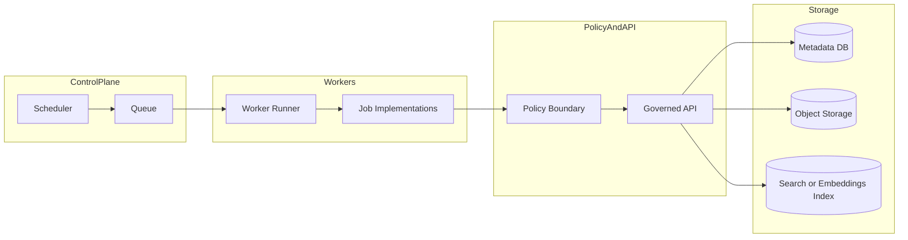

<!-- [KFM_META_BLOCK_V2]
doc_id: kfm://doc/8e74d0c0-5e9d-4d6e-8b05-18a1b8c35c17
title: KFM Workers
type: standard
version: v1
status: draft
owners: TODO
created: 2026-02-23
updated: 2026-02-23
policy_label: public
related:
  - TODO
tags: [kfm, workers]
notes:
  - Drafted without a confirmed repo tree; replace TODO placeholders after verifying actual implementation.
[/KFM_META_BLOCK_V2] -->

# KFM Workers

Background job runners for long-running, scheduled, and batch work (pipelines, indexing, validations, and maintenance) while preserving KFM’s **trust membrane**.


---

## Quick links

- [What this directory is](#what-this-directory-is)
- [Where it fits in the repo](#where-it-fits-in-the-repo)
- [Architecture](#architecture)
- [Execution modes](#execution-modes)
- [Job contract](#job-contract)
- [Promotion gates](#promotion-gates)
- [Observability](#observability)
- [Local development](#local-development)
- [Directory layout](#directory-layout)
- [Contributing](#contributing)

---

## What this directory is

This folder is the home for **worker services** that run work which is unsafe or impractical to perform inside interactive API requests, such as:

- **Re-indexing** search / embeddings stores
- **Scheduled ingest** (nightly pulls, periodic refreshes)
- **Data QA/validation** and promotion-gate checks
- **Batch transforms** (tiling, enrichment, denormalization)
- **Async side-effects** (notifications, cache warming)
- **Backfills** and “repair” jobs

> **Trust membrane rule:** Workers must produce outputs that are **traceable** (inputs → transforms → outputs) and respect **policy enforcement / sanitization** the same way the governed APIs do.

### What does *not* belong here

- UI code (React, Map components)
- Interactive API route handlers (belongs in the API app)
- One-off scripts with no tests, no audit output, and no provenance (use `scripts/` elsewhere, or promote them into a real job with a receipt)

[Back to top](#kfm-workers)

---

## Where it fits in the repo

- **Location:** `apps/workers/`
- **Role:** “offline compute” for the platform — runs outside request/response time limits.
- **Interfaces:** SHOULD call **governed APIs** (or approved internal service interfaces) rather than bypassing policy for any user-facing or Published outputs.
- **Data lifecycle:** Jobs often move data through **Raw → Work/Quarantine → Processed → Published** and must enforce promotion gates (see below).

> **TODO:** Replace this section with confirmed module boundaries once the repo tree is verified.

[Back to top](#kfm-workers)

---

## Architecture



**Design intent:**

- Workers are **durable** (retry-safe), **idempotent**, and **audited**.
- Policy checks happen **before** writing to any Published zone or returning any user-facing artifact.
- Every job run emits a **receipt** (machine-readable audit record) to support reproducibility and rollback.

[Back to top](#kfm-workers)

---

## Execution modes

KFM workers can be deployed in one (or both) of these patterns:

| Mode | When to use | Typical components | Notes |
|---|---|---|---|
| Queue workers | High volume async tasks; fan-out; variable workloads | Worker runner + broker/backend (e.g., Redis) | Requires idempotency and retry discipline |
| Scheduled jobs | Periodic refresh, maintenance, nightly ingest | Cron-like scheduler (e.g., Kubernetes CronJob) | Prefer for predictable, time-based tasks |

> **TODO:** Confirm which mode(s) are implemented in this repo and update this section accordingly.

[Back to top](#kfm-workers)

---

## Job contract

Every worker job SHOULD follow a consistent contract so that we can:

- trace claims to evidence
- enforce promotion gates
- rerun/rollback safely
- monitor + alert reliably

### Required properties

**Idempotency**
- A job MUST be safe to retry (“at least once” execution).
- Use deterministic `job_id`/`run_id` and write-once receipts.

**Inputs**
- Inputs must be referenced by stable identifiers (dataset ids, content hashes, URIs), not ad-hoc local paths.

**Outputs**
- Outputs must include checksums/hashes and their target lifecycle zone (Raw / Work / Processed / Published).

**Receipt**
- Every run must emit an audit record sufficient to reproduce the run and justify promotion.

### Example job envelope (suggested)

```json
{
  "job_id": "uuid",
  "job_type": "index.build_embeddings",
  "requested_by": "system|user:<id>",
  "requested_at": "2026-02-23T00:00:00Z",
  "inputs": [
    { "kind": "dataset", "id": "kfm://dataset/<id>", "checksum": "sha256:..." }
  ],
  "parameters": {
    "target_zone": "Processed",
    "policy_label": "public"
  },
  "trace": {
    "parent_run_id": "uuid-or-null",
    "correlation_id": "uuid"
  }
}
```

[Back to top](#kfm-workers)

---

## Promotion gates

Workers are the primary place we **enforce promotion** from:

**Raw → Work/Quarantine → Processed → Published**

A job that writes to a “higher” zone MUST fail closed unless the required artifacts exist.

### Minimum promotion checklist

- [ ] Metadata present (identity, schema, extents, license, sensitivity)
- [ ] Validation results attached (QA checks + thresholds)
- [ ] License checks recorded
- [ ] Provenance links recorded (inputs, transforms, tool versions)
- [ ] Checksums/content integrity recorded
- [ ] Audit receipt written (who/what/when/why + inputs/outputs + sensitivity + policy decisions)

> **NOTE:** This checklist is non-negotiable for anything that affects user-visible maps, stories, or AI responses.

[Back to top](#kfm-workers)

---

## Observability

Workers must be observable in the same way we expect from the API.

### Logging (minimum fields)

- `timestamp`
- `service` = `workers`
- `job_type`
- `job_id`
- `run_id`
- `correlation_id`
- `dataset_ids` (if applicable)
- `zone_in` / `zone_out`
- `policy_label`
- `status` = `started|succeeded|failed|skipped`
- `duration_ms`
- `error` (message + stack) on failure

### Metrics (minimum set)

- Jobs started/succeeded/failed by `job_type`
- Duration histogram by `job_type`
- Retry count by `job_type`
- Queue depth / lag (if using a queue)

### Tracing

- Propagate `correlation_id` into API calls so that a single run is traceable across workers + API.

[Back to top](#kfm-workers)

---

## Local development

> **TODO:** Replace the commands below with the repo’s real tooling once verified.

### Option A: Queue-based worker (example)

```bash
# 1) Start broker/backend (example: Redis)
docker compose up -d redis

# 2) Run workers
# (Replace with actual entrypoint/module)
python -m workers run --concurrency=4
```

### Option B: Scheduled job (example)

```bash
# Run a job once, locally
python -m workers run-job index.build_embeddings --dataset kfm://dataset/<id>
```

### Test

```bash
# Unit tests
pytest apps/workers
```

[Back to top](#kfm-workers)

---

## Directory layout

> **NOTE:** This layout is a **proposal** until verified against the actual repo tree.

```text
apps/workers/
  README.md              # This file
  src/                   # Worker implementation (jobs, runners, adapters)
  deploy/                # Deployment manifests (k8s, Helm, etc.)
  tests/                 # Unit/integration tests
  scripts/               # Dev helpers (must not be the only way to run jobs)
```

### Acceptable inputs

- Worker job code (idempotent, audited)
- Shared job utilities (receipts, hashing, provenance helpers)
- Deployment configuration for worker runtime (if applicable)
- Tests + fixtures for worker behavior

### Exclusions

- Production secrets
- Large datasets or derived artifacts (store in governed storage zones instead)
- UI assets
- Direct-to-database hacks that bypass the governed API / repositories

[Back to top](#kfm-workers)

---

## Contributing

### Adding a new job

1. Create a new job module under `src/` (or the repo’s equivalent).
2. Define:
   - inputs + parameters (typed)
   - idempotency strategy
   - validation rules + thresholds
   - receipt output (audit record)
3. Add tests:
   - happy path
   - retry path (simulate duplicate execution)
   - policy-deny path (fails closed)
4. Register the job in the job catalog/registry.
5. Document the job in this README’s **Job catalog** (below).

### Job catalog

| Job type | Purpose | Triggers | Inputs | Outputs | Notes |
|---|---|---|---|---|---|
| `ingest.pull_source` | Pull raw source data into Raw zone | schedule/manual | source config | raw artifacts + receipt | TODO |
| `validate.qa_dataset` | Run QA checks in Work/Quarantine | ingest completion | dataset id | validation report | TODO |
| `transform.build_tiles` | Build map tiles or derived products | promotion pipeline | processed dataset | tiles + metadata | TODO |
| `index.build_embeddings` | Update embeddings/full-text index | content changes | docs/features | index updates | TODO |

[Back to top](#kfm-workers)

---

## Appendix

<details>
<summary><strong>Receipt schema (suggested)</strong></summary>

A receipt is a machine-readable artifact written for every run.

- **Storage:** Object storage or an append-only log (preferred).
- **Naming:** `receipts/{job_type}/{yyyy}/{mm}/{dd}/{run_id}.json`

```json
{
  "run_id": "uuid",
  "job_id": "uuid",
  "job_type": "string",
  "started_at": "iso8601",
  "finished_at": "iso8601",
  "status": "succeeded|failed|skipped",
  "inputs": [{ "kind": "dataset|file|uri", "id": "string", "checksum": "sha256:..." }],
  "outputs": [{ "kind": "dataset|file|uri", "id": "string", "checksum": "sha256:...", "zone": "Raw|Work|Processed|Published" }],
  "provenance": {
    "tool_versions": { "python": "3.x", "worker_image": "sha256:..." },
    "transforms": ["string identifiers"],
    "policy_decisions": ["allow|deny|sanitize + reason refs"]
  },
  "errors": [{ "message": "string", "stack": "string" }]
}
```

</details>
