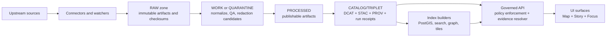
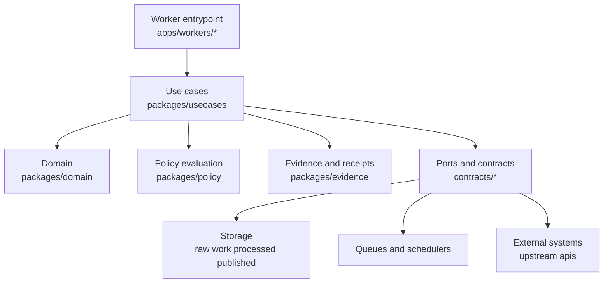

<!-- [KFM_META_BLOCK_V2]
doc_id: kfm://doc/9f05a9a1-9b2d-4df3-8a0b-6ed3d00a9e3c
title: apps/workers
type: standard
version: v2
status: draft
owners: KFM Platform (TBD)
created: 2026-02-22
updated: 2026-02-23
policy_label: internal
related:
  - apps/workers/
  - packages/domain/
  - packages/usecases/
  - packages/policy/
  - packages/evidence/
  - contracts/
  - policy/
tags:
  - kfm
  - workers
  - ingestion
  - provenance
  - governance
notes:
  - Update created/updated dates to match repo history if this file pre-existed.
  - Keep this README aligned with the actual repo layout and worker inventory.
  - Replace placeholder badges once CI/workflow names exist.
[/KFM_META_BLOCK_V2] -->

# apps/workers

Background and edge workers that run KFM ingestion, validation, indexing, and governance automation — **producing governed artifacts** (run receipts, catalogs, provenance) and **never bypassing policy**.

**Status:** draft • **Owners:** KFM Platform (TBD) • **Policy:** internal


> [!NOTE]
> **TODO:** Replace the placeholder badges above with real workflow badges (once this repo’s CI names/paths are known).

---

## Navigate

- [What belongs here](#what-belongs-here)
- [Repo context reference](#repo-context-reference)
- [How workers fit into KFM](#how-workers-fit-into-kfm)
- [Layering and policy boundary](#layering-and-policy-boundary)
- [Worker types](#worker-types)
- [Hard requirements](#hard-requirements)
- [Gates and evidence](#gates-and-evidence)
- [Contracts emitted by workers](#contracts-emitted-by-workers)
- [Worker registry](#worker-registry)
- [Local development](#local-development)
- [Deployment](#deployment)
- [Observability](#observability)
- [Security and governance](#security-and-governance)
- [Add a new worker](#add-a-new-worker)
- [Definition of done](#definition-of-done)

---

## What belongs here

This folder is for **non-interactive compute** that:

- **Acquires** upstream data (connectors, snapshotters).
- **Transforms** and validates data (normalization, QA, redaction candidates).
- **Builds projections** from promoted artifacts (PostGIS/search/graph/tiles indexes).
- **Automates governance workflows** (e.g., create a *draft PR* when a material change is detected).

### What must not go here

- Anything that serves end-user requests → belongs in the **governed API**.
- Anything that renders UI → belongs in the **frontend**.
- One-off scripts without receipts, tests, and docs → belongs in a sandbox until promoted.

> [!NOTE]
> Some KFM blueprints refer to this area as `apps/worker/` (singular). This repo uses `apps/workers/` (plural). Treat them as the same conceptual boundary.

[Back to top](#appsworkers)

---

## Repo context reference

The KFM blueprint recommends separating API/UI/worker apps from shared packages, and keeping governed artifacts (contracts, policy, data specs, stories) alongside code. This folder is the **worker** slice of that layout.

```text
repo/
├─ apps/                                      # Runnable application surfaces (deployable entrypoints)
│  ├─ api/                                    # API service (routes/controllers; wires packages/* into runtime)
│  ├─ ui/                                     # Web UI app (map/story/focus surfaces)
│  └─ workers/                                # Background/edge workers (ingest, validate, index, automation)
│
├─ packages/                                  # Shared libraries (clean architecture layers; reusable across apps)
│  ├─ domain/                                 # Pure domain model (entities/value objects; invariants; no I/O)
│  ├─ usecases/                               # Orchestration layer (ports in/out; policy/evidence via interfaces)
│  ├─ policy/                                 # Policy client + input builders + decision normalization (no OPA runtime here)
│  ├─ evidence/                               # Evidence primitives + resolvers/helpers (refs, bundles, citation shapes)
│  ├─ catalog/                                # Catalog builders/validators (STAC/DCAT/PROV helpers)
│  └─ shared/                                 # Cross-cutting utilities (ids/time/geo/errors/result/logging)
│
├─ data/                                      # Test/dev data inputs (small) + specs for governed artifacts
│  ├─ specs/                                  # Data/product specs (schemas, manifests, mapping profiles)
│  └─ fixtures/                               # Deterministic fixtures (synthetic; gold/snapshots as needed)
│
├─ policy/                                    # Policy-as-code (OPA/Rego) + fixtures + tests (default-deny)
│  ├─ rego/                                   # Source-of-truth policy modules
│  ├─ fixtures/                               # Policy input vectors (allow/deny/redaction; synthetic)
│  └─ tests/                                  # OPA unit/regression tests (opa test …)
│
├─ contracts/                                 # Machine-enforced contracts (CI gates + runtime boundaries)
│  ├─ schemas/                                # JSON Schemas (DTOs, receipts, manifests, policy inputs)
│  └─ openapi/                                # OpenAPI boundary (REST contract + snapshots/overlays)
│
└─ docs/                                      # Human-facing docs (governed)
   ├─ stories/                                # Story Nodes / narrative docs (templates, drafts, published)
   ├─ adr/                                    # Architecture Decision Records
   └─ standards/                              # Non-negotiable repo/pipeline/policy standards (CI-enforced if configured)
```

> [!NOTE]
> Treat this as a **reference layout**. If the repo differs, keep this README accurate to what exists.

[Back to top](#appsworkers)

---

## How workers fit into KFM

Workers operate on the **truth path** (RAW → WORK/QUARANTINE → PROCESSED → CATALOG/TRIPLET → PUBLISHED) and/or on **rebuildable projections** (PostGIS/search/graph/tiles). They should be designed so the system can always rebuild projections from canonical artifacts.



**Key idea:** workers are **producers** of governed evidence and rebuildable projections; they are **not** the policy boundary themselves.

[Back to top](#appsworkers)

---

## Layering and policy boundary

Workers are allowed to **apply** policy obligations (e.g., produce a generalized public artifact), but they must not become an alternate policy boundary.

Workers must reach storage, queues, and external systems via **ports/adapters** (or equivalent interface patterns) so that provenance and policy checks can’t be bypassed.



> [!WARNING]
> **Default deny:** if a worker cannot prove (via contracts + policy + receipts) that an action is allowed, it must not write or promote.

[Back to top](#appsworkers)

---

## Worker types

Use these buckets when naming workers and deciding runtime characteristics:

1. **Connectors / snapshotters**
   - Fetch upstream files/APIs, snapshot terms, write to RAW.
2. **Pipeline runners**
   - Normalize in WORK, produce QA + redaction candidates, write PROCESSED.
3. **Catalog builders**
   - Generate/validate DCAT + STAC + PROV; enforce cross-links; emit run receipts.
4. **Index builders**
   - Build projections (DB/search/graph/tiles) from promoted artifacts.
5. **Automation / governance bots**
   - Detect changes, create draft PRs, open review tickets, or re-run validations.

Each worker should be explicit about:

- **Trigger**: schedule, queue event, webhook, manual run.
- **Inputs/outputs**: zones touched and artifact types produced.
- **Policy posture**: labels/obligations it must apply or enforce.
- **Idempotency strategy**: retries safe, duplicates safe, deterministic identifiers.
- **Materiality rules** (when applicable): what counts as a “material change” that requires review.

> [!TIP]
> If you can’t describe a worker’s inputs/outputs and idempotency strategy in 5–10 lines, it’s probably too big. Split it.

[Back to top](#appsworkers)

---

## Hard requirements

### Trust membrane and layering

Workers must respect KFM’s clean layering:

- Domain logic remains pure and must not talk to infrastructure directly.
- Storage and external systems must be reached through **interfaces/contracts** so policy and provenance checks cannot be bypassed.

### Truth path discipline

- **RAW is append-only**: do not mutate; supersede with a new acquisition.
- **QUARANTINE means “do not promote”** until validation/rights/sensitivity issues are resolved.
- Promotion must be **fail-closed**: if required gates/receipts/catalogs don’t exist or don’t validate, nothing moves forward.

### Run receipts for everything that matters

Every worker that performs a governed action must emit a **run receipt** capturing (at minimum):

- `run_id`, `run_type`, dataset identifiers (if applicable)
- inputs and outputs with digests
- validation status and report references
- policy decision (label + obligations)
- environment (commit, container digest, runtime, parameters)
- timestamps

(See [Contracts emitted by workers](#contracts-emitted-by-workers).)

[Back to top](#appsworkers)

---

## Gates and evidence

Workers participate in promotion gates, but they do not “bless” promotion on their own. Promotion is **evidence-driven** and should be reviewable.

### Gate checklist

| Gate | Minimum expectation | Evidence produced/linked | Fail-closed |
|---|---|---|---|
| Identity and schema | Dataset/spec identity is known; schema validates | schema validation report + receipt links | ✅ |
| Integrity | Inputs/outputs are digest-addressed | checksums in receipt | ✅ |
| QA | Required QA rules executed | QA report + receipt links | ✅ |
| Policy | Policy label + obligations evaluated | policy decision record + receipt links | ✅ |
| License/rights | License checks passed (when required) | license report + receipt links | ✅ |
| Catalog/provenance | DCAT/STAC/PROV cross-links validate | catalog validation report | ✅ |

> [!NOTE]
> The exact report and schema locations are repo-specific. Prefer **adding** an index/registry file (and contract tests) rather than hardcoding paths in worker code.

[Back to top](#appsworkers)

---

## Contracts emitted by workers

Workers are required to emit (or update) governed artifacts. The exact schemas live in the repo’s `contracts/` area (or equivalent); the conceptual outputs are listed below.

### Run receipt

An immutable record of **what ran**, **with what inputs**, **producing which outputs**, **under which policy**.

Minimum conventions:

- **Digest-addressed artifacts** (`sha256:...`) for inputs/outputs.
- **Deterministic IDs** where possible (e.g., dataset_version derived from canonical spec hash).
- **Policy-safe logging**: do not leak restricted metadata in receipts or logs.

<details>
  <summary><strong>Suggested receipt fields (conceptual)</strong></summary>

```json
{
  "run_id": "uuid-or-deterministic-id",
  "run_type": "connector|pipeline|catalog|index|bot",
  "started_at": "ISO-8601",
  "finished_at": "ISO-8601",
  "actor": { "kind": "service", "name": "kfm-worker-xyz" },
  "environment": {
    "git_commit": "abcdef...",
    "container_image_digest": "sha256:...",
    "runtime": "k8s-job|edge-worker|ci",
    "parameters": { "dry_run": false }
  },
  "inputs": [{ "ref": "sha256:...", "media_type": "application/..." }],
  "outputs": [{ "ref": "sha256:...", "media_type": "application/..." }],
  "validations": [{ "name": "schema", "status": "pass|fail", "report_ref": "sha256:..." }],
  "policy": { "label": "internal|public|restricted", "obligations": ["..."] },
  "status": "success|failure|quarantine",
  "notes": "policy-safe free text"
}
```

</details>

### Discovery envelope

If you build a watcher/connector that detects new upstream material, emit a discovery envelope that includes:

- `source_id` and `observed_at`
- `kfm_idempotency_key` (for safe retries and dedupe)
- `spec_ref` (what onboarding spec this maps to)
- `artifact_ref` (what was observed/fetched)

### Promotion manifest

Workers should never silently promote data. A promotion manifest plus receipts and validations are the evidence needed for review and release gates.

> [!NOTE]
> “Promotion manifest” is a *governed proposal artifact* — it may be generated automatically, but it must be reviewable and traceable.

[Back to top](#appsworkers)

---

## Worker registry

Maintain an inventory of workers so that governance and ops can answer “what runs?” without grepping the repo.

> [!TIP]
> Keep this registry **small** and link out to per-worker READMEs for details.

| Worker | Type | Trigger | Reads | Writes | Primary outputs | Owner | Status |
|---|---|---|---|---|---|---|---|
| *(add me)* | connector\|pipeline\|catalog\|index\|bot | schedule\|queue\|manual | raw\|work\|processed | work\|processed\|published | receipts + reports | team | draft |

[Back to top](#appsworkers)

---

## Local development

This repo does not assume a single runtime for all workers (some may be containerized jobs, some may be edge workers, some may be queue consumers).

Minimum expectation for each worker subfolder:

- A **worker README** with:
  - prerequisites
  - local run command(s)
  - how to run tests
  - how to generate/validate receipts locally
- A **config reference**:
  - environment variables
  - required secrets (names only; no values)
  - safe defaults for dev

Suggested conventions (PROPOSED):

- Provide `make dev`, `make test`, and `make lint` (or `npm run ...` equivalents).
- Provide a **dry-run** mode that emits receipts without writing outputs.

```bash
# PROPOSED: consistent CLI contract across workers (adapt as needed)
./run --dry-run --input <artifact-ref> --out ./out/

# PROPOSED: validate produced artifacts locally
./validate --receipts ./out/ --contracts ../../contracts/
```

> [!TIP]
> A good dry-run still performs schema + policy checks and produces a receipt marked `"dry_run": true`.

[Back to top](#appsworkers)

---

## Deployment

Workers may deploy as one of:

- **Kubernetes Jobs / CronJobs** for scheduled pipeline runs.
- **Queue consumers** for event-driven ingestion or index rebuilds.
- **Edge workers** (e.g., Cloudflare Worker style) for lightweight discovery hooks.
- **CI-triggered automations** for draft PR creation and validation reporting.

Whatever the runtime:

- pin container images by **digest**
- record the digest in the run receipt
- keep an explicit rollback path (re-run previous promoted version; rebuild projections)

[Back to top](#appsworkers)

---

## Observability

Workers must be observable without leaking sensitive data.

Minimum signals:

- structured logs with `run_id` correlation
- metrics: success/fail counts, duration, input/output sizes, queue lag (if applicable)
- validation metrics: pass rate, failure categories, materiality decisions

Operational rules:

- QUARANTINE is a first-class outcome; do not treat it as “success”.
- retries must be bounded; DLQs must exist for queue-based workers.

[Back to top](#appsworkers)

---

## Security and governance

### Policy-as-code

- The **same policy semantics** must apply in CI and runtime (or policy guarantees are meaningless).
- UI may display policy badges/notices but **never makes policy decisions**.

### Sensitivity defaults

- Default deny for sensitive-location / restricted materials unless explicitly allowed.
- Prefer producing a separate `public_generalized` representation when public output is allowed but precise locations are not.
- Never embed precise coordinates in narratives or outputs unless policy allows and obligations are satisfied.

### Credentials and secrets

- Do not embed credentials in dataset specs or config committed to the repo.
- Prefer short-lived credentials and workload identity where possible.
- Make secrets discoverable by **name**, not value.

[Back to top](#appsworkers)

---

## Add a new worker

### 1) Define scope and contract surfaces

- What zone(s) does it touch?
- What artifacts does it read/write?
- What receipts/manifests does it emit?
- What policy labels and obligations can apply?

### 2) Implement idempotency and determinism

- stable IDs for datasets/artifacts
- dedupe keys for watcher events
- safe retries (no double-writes; append-only where required)

### 3) Wire policy and validation gates

- schema validation for inputs/outputs
- policy fixtures and contract tests
- fail-closed behavior

### 4) Ship with documentation

Each worker subfolder must include:

- `README.md` (run/test/deploy)
- a minimal architecture diagram
- example receipts (valid + invalid) for CI tests (redacted)
- an entry in the [Worker registry](#worker-registry)

### 5) Add operational safety

- bounded retries and DLQ
- kill switch support (repo flag and/or secret) for emergency stop
- runbook pointer (incident + rollback)

[Back to top](#appsworkers)

---

## Definition of done

A worker is “done” when all are true:

- [ ] Runs are deterministic enough to reproduce outputs from the same inputs.
- [ ] Emits run receipts for every governed run (and stores them in the expected ledger location).
- [ ] Produces or references validation reports; failures are actionable.
- [ ] Policy checks are enforced (CI + runtime); default deny is supported.
- [ ] No secrets are committed; logs/receipts are policy-safe.
- [ ] Idempotency is implemented; retries do not corrupt truth path zones.
- [ ] Has tests: unit + contract (schemas/policy) + at least one integration happy path.
- [ ] Has docs: per-worker README + config reference + operational notes.

<details>
  <summary><strong>Appendix: suggested per-worker folder template (PROPOSED)</strong></summary>

```text
apps/workers/<worker-name>/
  README.md                # run/test/deploy + I/O contract + idempotency notes
  src/                     # implementation
  tests/                   # unit + contract + integration (happy path)
  fixtures/                # redacted sample inputs/outputs for CI
  receipts/                # redacted example receipts (valid + invalid)
  config.example.env       # names only; no secrets
```

</details>

[Back to top](#appsworkers)
