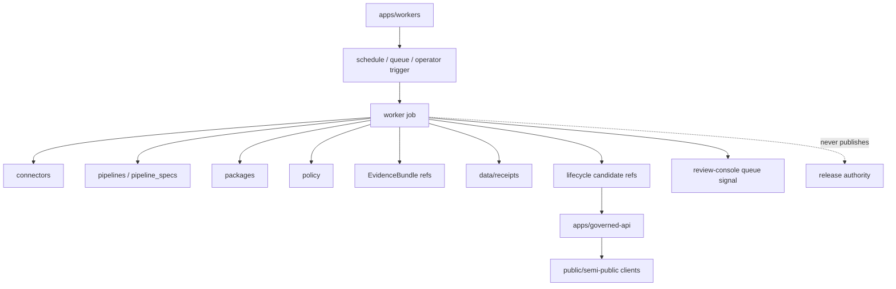

<!-- [KFM_META_BLOCK_V2]
doc_id: kfm://app/workers/readme
title: Workers App README
type: app-readme
version: v0.1
status: draft
owners: OWNER_TBD — Apps steward · Pipeline steward · Source steward · Evidence steward · Policy steward · Release steward · Docs steward
created: 2026-06-16
updated: 2026-06-16
policy_label: public
related:
  - ../README.md
  - ../governed-api/README.md
  - ../cli/README.md
  - ../review-console/README.md
  - ../../connectors/README.md
  - ../../pipelines/README.md
  - ../../pipeline_specs/README.md
  - ../../packages/README.md
  - ../../policy/README.md
  - ../../schemas/contracts/v1/
  - ../../contracts/
  - ../../data/README.md
  - ../../release/README.md
  - ../../runtime/README.md
  - ../../infra/README.md
tags: [kfm, apps, workers, background-jobs, ingestion, validation, cataloging, tiling, receipts, watcher-non-publisher, lifecycle]
notes:
  - "Replaces the short apps/workers stub with a governed deployable-app boundary contract."
  - "Workers may emit receipts, derived candidates, validation outputs, queue signals, and build artifacts, but they must not publish, rewrite canonical records, or become the public trust path."
  - "Worker source files, job definitions, schedules, queues, route hooks, tests, fixtures, deployment state, logs, dashboards, and CI pass state remain NEEDS VERIFICATION."
[/KFM_META_BLOCK_V2] -->

<a id="top"></a>

<div align="center">

# Workers App

`apps/workers/`

**Deployable background-worker boundary for KFM ingestion-adjacent jobs, validation jobs, catalog/graph/tile build support, receipt emission, candidate routing, cache/build maintenance, and non-publishing watcher behavior.**


[Purpose](#1-purpose) · [Repo fit](#2-repo-fit) · [Boundary](#3-authority-boundary) · [Inputs](#5-inputs) · [Exclusions](#6-exclusions) · [Worker map](#7-worker-family-map) · [Definition of done](#14-definition-of-done)

</div>

---

> [!IMPORTANT]
> **Status:** draft / `NEEDS VERIFICATION`  
> **Owners:** `OWNER_TBD` — Apps steward · Pipeline steward · Source steward · Evidence steward · Policy steward · Release steward · Docs steward  
> **Path:** `apps/workers/README.md`  
> **Responsibility root:** `apps/` — deployable application surfaces  
> **Truth posture:** CONFIRMED README path / CONFIRMED apps-root role for workers / PROPOSED worker app contract / UNKNOWN worker source files, job definitions, schedulers, queues, tests, fixtures, deployment, logs, dashboards, and CI pass state

> [!CAUTION]
> Workers are non-publishing background executors. They may emit receipts, candidates, validation outputs, and build artifacts, but they must not publish, rewrite catalog/canonical records, mutate release authority, bypass governed API/policy gates, or become a public trust path.

---

## 1. Purpose

`apps/workers/` is the proposed deployable boundary for long-running, scheduled, or batch worker processes in KFM.

It may eventually contain worker entry points, job runners, queue consumers, schedules, app-local tests, and operator documentation for:

- source-refresh and ingest-adjacent background work;
- validation, normalization support, and receipt emission;
- catalog/triplet build support after upstream gates close;
- tile, index, search, report, and derivative build support;
- watcher preflight checks and drift detection;
- cache refresh and stale-state signals;
- review-console queue routing signals;
- governed audit/provenance and job-run references.

This README does not prove any worker source file, job, queue, scheduler, receipt writer, validator, tile builder, catalog builder, deployment, log, dashboard, or CI pass state exists.

[Back to top](#top)

---

## 2. Repo fit

| Concern | Owning root | Expected relationship |
|---|---|---|
| Worker deployable | `apps/workers/` | Background app boundary for workers, daemons, or batch jobs |
| Apps root | `apps/` | Deployable application boundary |
| Governed API | `apps/governed-api/` | Public trust membrane and elevated audited API path |
| CLI | `apps/cli/` | Operator-triggered commands, dry runs, reports |
| Review Console | `apps/review-console/` | Human review queue and decision surface |
| Connectors | `connectors/` | Source-specific fetching/admission connectors |
| Pipelines | `pipelines/`, `pipeline_specs/` | Pipeline logic and declarative pipeline definitions |
| Shared packages | `packages/` | Reusable implementation libraries |
| Policy | `policy/` | Admissibility, sensitivity, rights, review, release, and decision rules |
| Lifecycle artifacts | `data/` | Lifecycle states, receipts, proofs, registries, catalog, triplets, published outputs |
| Release authority | `release/` | Publication, correction, rollback, release manifest authority |
| Schemas/contracts | `schemas/contracts/v1/`, `contracts/` | Machine shape and object meaning |
| Runtime adapters | `runtime/` | Model/runtime adapters behind governed API, not worker-public paths |
| Infra | `infra/` | Deployment, least privilege, audit, scheduling, process isolation |

## 3. Authority boundary

Workers may execute background work and emit governed outputs to the correct lifecycle or receipt/proof locations. They do not own source authority, schemas, contracts, policy, release decisions, publication, rollback approval, correction approval, EvidenceBundle truth, public UI behavior, governed API authority, canonical store mutation outside approved flows, or runtime/model authority.

```text
apps/workers/          = deployable background-worker boundary
apps/governed-api/     = public trust membrane and governed API path
apps/review-console/   = human review and decision surface
apps/cli/              = operator command surface
connectors/            = source-specific fetch/admit code
pipelines/             = executable pipeline logic
pipeline_specs/        = declarative pipeline definitions
packages/              = reusable libraries
policy/                = admissibility and decision policy
data/                  = lifecycle artifacts, receipts, proofs, registries
release/               = publication, correction, rollback authority
runtime/               = adapters behind governed API
infra/                 = deployment and process controls
```

## 4. Default posture

Workers should fail closed. A worker job should not emit candidate records, receipts, derived artifacts, routing signals, or cache/build outputs when any of these are unresolved:

- source identity, source role, rights, cadence, and integrity hash;
- input lifecycle phase and job eligibility;
- schema, contract, and validator availability;
- policy decision, sensitivity, redaction/generalization, and rights posture;
- EvidenceRef and EvidenceBundle support where claims depend on evidence;
- deterministic identity and transform receipt requirements;
- output lifecycle home and owner;
- review state, release state, correction state, rollback state, and stale-state impacts;
- idempotency, retry, resume, and rollback behavior;
- audit/provenance and job-run receipt write target;
- safe error behavior and no raw/internal detail leakage.

## 5. Inputs

| Input family | Examples | Required posture |
|---|---|---|
| Job trigger | schedule, queue message, operator request, source-change signal | Audited and idempotent |
| Source descriptor | source id, source role, rights, cadence, hash, policy label | Cataloged and validated before material use |
| Lifecycle item | RAW/WORK/QUARANTINE/PROCESSED/CATALOG candidate refs | Correct phase and eligibility required |
| Pipeline spec | transform name, validator name, output target, receipt target | Versioned and reviewable |
| Policy state | PolicyDecision, sensitivity label, redaction profile, release constraints | Policy-runtime derived |
| Evidence state | EvidenceRef, EvidenceBundle refs, proof context | Resolver-backed where material |
| Output refs | receipt path, candidate path, tile/index/report path, queue signal | Correct lifecycle root required |
| Runtime state | retry count, idempotency key, job id, run id, timestamp | Durable and auditable |

## 6. Exclusions

| Does not belong here | Correct home |
|---|---|
| Source-specific connector code | `connectors/` |
| Pipeline logic that is reusable outside worker app | `pipelines/` or `packages/` |
| Declarative pipeline definitions | `pipeline_specs/` |
| Shared libraries and reusable helpers | `packages/` |
| Schemas and contracts | `schemas/contracts/v1/`, `contracts/` |
| Policy rules and access decisions | `policy/` |
| Lifecycle data and canonical stores | `data/` |
| Release manifests, correction notices, rollback cards | `release/` |
| Public or semi-public API surface | `apps/governed-api/` |
| Public UI or map rendering | `apps/explorer-web/` |
| Review decisions and manual adjudication | `apps/review-console/` |
| One-off scripts | `scripts/` unless promoted through governance |
| Repo-wide validators/generators/builders | `tools/` |
| Direct model/runtime public access | `runtime/` behind governed API only |
| Deployment-only values | Deployment environment/config channels |

## 7. Worker family map

Exact implementation files remain `NEEDS VERIFICATION`.

| Candidate worker family | Purpose | Required safeguard | Status |
|---|---|---|---|
| `source_refresh` | Watch/source refresh and source-change detection | Connector boundaries respected | PROPOSED |
| `admission_support` | Admission preflight and candidate staging | No silent admission | PROPOSED |
| `validation` | Run deterministic validators and emit reports | Fixture-bound, fail-closed | PROPOSED |
| `normalization` | Run governed transforms and emit TransformReceipt refs | Deterministic identity and receipts | PROPOSED |
| `catalog_support` | Build catalog/triplet candidates after upstream gates | No direct publish | PROPOSED |
| `tile_build` | Build review/release-safe tile candidates | Policy and redaction checks | PROPOSED |
| `receipt_emit` | Emit job, validation, transform, cache, and build receipts | Durable and auditable | PROPOSED |
| `review_queue_signal` | Signal review-console queue candidates | Governed projection only | PROPOSED |
| `cache_refresh` | Refresh derived caches/indexes | Derived stays derived | PROPOSED |
| `safe_errors` | Job failure and retry handling | No raw/internal detail leakage | PROPOSED |

> [!WARNING]
> Candidate worker-family names are not implementation proof. Do not claim a worker is live until files, schedules, queues, tests, fixtures, policy gates, receipt outputs, and deployment evidence confirm it.

## 8. Diagram


```mermaid
flowchart TD
    workers["apps/workers"] --> trigger["schedule / queue / operator trigger"]
    trigger --> job["worker job"]
    job --> connectors["connectors"]
    job --> pipelines["pipelines / pipeline_specs"]
    job --> packages["packages"]
    job --> policy["policy"]
    job --> evidence["EvidenceBundle refs"]
    job --> receipts["data/receipts"]
    job --> candidates["lifecycle candidate refs"]
    job --> review["review-console queue signal"]
    candidates --> governed["apps/governed-api"]
    governed --> public["public/semi-public clients"]
    job -. "never publishes" .-> release["release authority"]
```

## 9. Worker obligations

| Obligation | Example effect |
|---|---|
| `watcher_non_publisher` | Workers emit receipts and candidates, not published releases |
| `idempotent_jobs` | Re-running a job should not duplicate authoritative records |
| `least_privilege_runtime` | Worker can access only required inputs and output targets |
| `source_role_preserved` | Source role is carried forward and not upcast by worker convenience |
| `policy_required` | Policy and sensitivity gates run before material output |
| `evidence_required` | Claim-bearing outputs carry EvidenceRef/EvidenceBundle support |
| `receipt_required` | Material transforms, validations, and emissions produce receipts |
| `derived_stays_derived` | Tiles, caches, indexes, and reports do not replace canonical truth |
| `safe_error_only` | Failures reveal no protected data, raw payloads, internal paths, or validator internals |
| `review_not_release` | Review queue signals do not equal release approval or publication |

## 10. Job contract

Each worker job README or module note should state:

- job purpose and owner;
- trigger type and schedule/queue ownership;
- accepted input refs and lifecycle phase;
- denied inputs and correct homes;
- schemas/contracts and validators used;
- policy and sensitivity dependencies;
- EvidenceBundle dependency where material;
- output refs and receipt types emitted;
- idempotency key, retry posture, and safe-disable path;
- tests and fixtures required;
- open verification items.

## 11. Inspection path

Worker source files, job definitions, schedulers, queues, schemas, tests, fixtures, policy integration, receipt outputs, deployment state, logs, dashboards, and emitted artifacts remain `NEEDS VERIFICATION`.

```bash
find apps/workers -maxdepth 7 -type f | sort
find apps/workers connectors pipelines pipeline_specs packages policy schemas contracts data release infra tests fixtures -maxdepth 7 -type f 2>/dev/null | grep -Ei 'worker|job|queue|schedule|receipt|ValidationReport|TransformReceipt|PolicyDecision|EvidenceRef|EvidenceBundle|ReleaseManifest|CorrectionNotice|RollbackCard|catalog|tile|ingest|normalize|validate|publish|stale|test|fixture' | sort
```

## 12. Validation expectations

Useful validation for workers should cover:

- jobs are idempotent and safe to retry;
- jobs fail closed on missing schema, policy, evidence, source role, rights, validator, or output target;
- material transforms and validations emit receipts;
- workers do not write directly to `data/published/`, issue ReleaseManifest records, mutate release records, or rewrite canonical/catalog records outside approved flows;
- candidate records and review queue signals remain candidates, not decisions;
- derived tiles/caches/indexes/reports remain derived and policy-bounded;
- failures and logs do not expose raw payloads, protected detail, internal paths, or deployment-only values;
- deployment runs with least privilege and audit-friendly run ids.

## 13. Safe change pattern

For worker changes:

1. Add or update worker/job inventory.
2. Link worker inputs/outputs to schemas/contracts before changing shapes.
3. Add fixtures for valid run, missing schema, missing policy, missing evidence, rights denial, sensitivity hold, stale source, retry, duplicate idempotency key, safe error, and output receipt cases.
4. Add no-publish, no-direct-canonical-rewrite, idempotency, retry, policy, evidence, receipt, and safe-error tests before enabling jobs.
5. Preserve EvidenceRef/EvidenceBundle refs, PolicyDecision refs, source role, lifecycle state, receipt refs, release/correction/rollback refs, job ids, reason codes, timestamps, and limitations through every material output.
6. Update this README, app docs, worker docs, pipeline docs, governed API/review-console docs, policy docs, schemas/contracts, and tests when behavior materially changes.

## 14. Definition of done

- [ ] Owners are confirmed and `OWNER_TBD` is replaced.
- [ ] Worker/job inventory and ownership are documented.
- [ ] Job input/output DTOs and schemas are verified.
- [ ] Schedulers, queues, triggers, retries, and idempotency keys are documented and tested.
- [ ] Policy runtime, evidence resolver, source-role handling, receipt emission, and safe-error behavior are documented and tested.
- [ ] Workers cannot publish, issue release decisions, rewrite canonical/catalog records, or mutate release records outside approved flows.
- [ ] Receipts are emitted for material transforms and validations.
- [ ] Review queue signals are candidates only and require human/governed decision paths.
- [ ] Sensitive-domain and rights-denial tests are present and passing.
- [ ] Deployment, logs, dashboards, and runbooks are documented with current evidence.

## 15. Open verification items

| Item | Why it matters |
|---|---|
| Confirm worker source files beyond README | Prevents overclaiming implementation maturity |
| Confirm job/schedule/queue inventory | Required before operational claims |
| Confirm connector/pipeline/package dependencies | Required before boundary claims |
| Confirm schemas, contracts, and validators | Required before shape and validation claims |
| Confirm policy and evidence integration | Required before governed-output claims |
| Confirm receipt paths and output targets | Required before lifecycle claims |
| Confirm no-publish and no-canonical-rewrite tests | Required before trust claims |
| Confirm deployment, least privilege, logs, and dashboards | Required before operational maturity claims |
| Confirm review-console and governed-api handoffs | Required before queue/routing claims |
| Confirm retry/idempotency behavior | Required before safe automation claims |

<details>
<summary>Appendix A — no-loss preservation note</summary>

The previous README was a short stub: "Background jobs: ingestion, validation, cataloging, tiling, receipts." This replacement preserves that scope while adding the KFM worker invariant: workers emit receipts and candidates only; they do not publish or rewrite canonical/release authority.

</details>

## Status summary

`apps/workers/` should contain deployable background-worker code only after source inventory, job inventory, schedule/queue definitions, schemas, authorization or service identity, policy runtime integration, evidence resolver integration, receipt emission, review/governed-API handoffs, tests, and operational evidence are verified.

It must preserve the worker boundary: workers may execute background jobs, emit receipts, and create candidate signals, but they must not publish artifacts, bypass review/release gates, rewrite canonical records, become the public trust path, or substitute automation for governed promotion, correction, rollback, and review decisions.

<p align="right"><a href="#top">Back to top</a></p>
