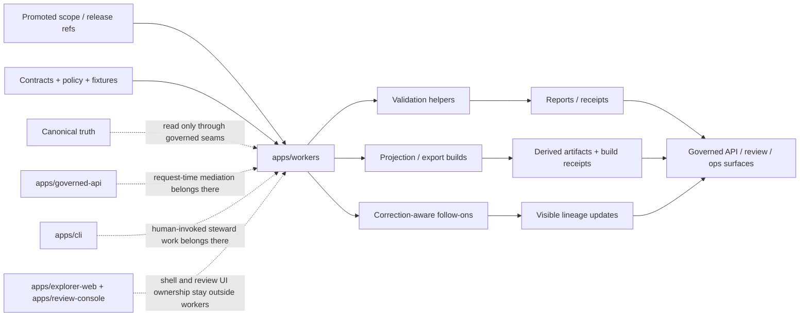

<!-- [KFM_META_BLOCK_V2]
doc_id: kfm://doc/<NEEDS_VERIFICATION_UUID>
title: Workers Runtime Boundary
type: standard
version: v1
status: draft
owners: @bartytime4life
created: <NEEDS_VERIFICATION>
updated: <NEEDS_VERIFICATION>
policy_label: <NEEDS_VERIFICATION>
related: [../../README.md, ../README.md, ../../packages/README.md, ../../.github/CODEOWNERS]
tags: [kfm, workers]
notes: [doc_id placeholder until registry-backed assignment exists, created/updated dates need git-history verification, current public main confirms sibling app surfaces while worker-local tree remains README-only]
[/KFM_META_BLOCK_V2] -->

# Workers Runtime Boundary
Governed background-job boundary for KFM release-backed builds, validation helpers, exports, and correction-aware runtime support under `apps/workers/`.

**Status:** experimental  
**Owners:** `@bartytime4life`  
**Badges:**        
**Quick jump:** [Scope](#scope) · [Repo fit](#repo-fit) · [Inputs](#inputs) · [Exclusions](#exclusions) · [Directory tree](#directory-tree) · [Quickstart](#quickstart) · [Usage](#usage) · [Diagram](#diagram) · [Reference tables](#reference-tables) · [Task list](#task-list) · [FAQ](#faq) · [Appendix](#appendix)

| Field | Value |
|---|---|
| Path | `apps/workers/README.md` |
| Repo fit | Child boundary README for `apps/` |
| Upstream | [`../README.md`](../README.md), [`../../README.md`](../../README.md) |
| Worker-local downstream | **NEEDS VERIFICATION** — no confirmed child worker lanes are present here yet |
| Accepted inputs | Release-backed work orders, validation-safe helper tasks, projection/export requests, correction-aware follow-on jobs |
| Exclusions | Browser UI ownership, direct client exposure, canonical truth rewrites, hidden policy bypasses, ad hoc business law in scripts |
| Current public-main signal | `apps/` currently exposes `cli/`, `explorer-web/`, `governed-api/`, `review-console/`, and `workers/`; inside `apps/workers/`, this README is the only confirmed file |
| Adjacent authority / control roots | [`../../packages/README.md`](../../packages/README.md), [`../../contracts/README.md`](../../contracts/README.md), [`../../policy/README.md`](../../policy/README.md), [`../../tests/README.md`](../../tests/README.md), [`../../.github/workflows/README.md`](../../.github/workflows/README.md) |
| Evidence boundary | Current public `main` tree plus March 2026 KFM doctrine; deeper worker-local topology remains source-bounded |

> [!IMPORTANT]
> Treat this file as a **boundary contract first** and an **implementation index second**.

> [!NOTE]
> The worker subtree itself is still README-only in current public view. That stronger app-family visibility does **not** turn worker-local schedulers, manifests, queue backends, tests, or concrete job lanes into proven implementation.

## Scope

This README defines what `apps/workers/` is for, what it must not become, and how future worker code should fit the repo without collapsing KFM’s trust boundaries.

At this path, “workers” means **app-adjacent background execution**: jobs that help move already-governed material forward through release-backed or policy-safe steps such as validation support, projection/export builds, correction propagation, and other bounded follow-on work.

This file does **not** claim that those job lanes are already implemented here. It states the boundary they must respect if and when they land here.

[Back to top](#workers-runtime-boundary)

## Repo fit

`apps/workers/` sits under the runtime-facing `apps/` family, so it should behave like an app boundary, not like a miscellaneous dumping ground.

| Relationship | What it means here |
|---|---|
| Parent boundary | [`../README.md`](../README.md) defines `apps/` as a runtime surface family and reserves room for a worker / workflow lane. |
| Root posture | [`../../README.md`](../../README.md) keeps the repo verification-first and source-bounded. |
| Shared law | Reusable domain, validation, policy, evidence, and catalog logic belongs in [`../../packages/README.md`](../../packages/README.md) and related package directories, not duplicated here. |
| Shared contracts | Trust-bearing payloads, examples, enums, and schemas belong in [`../../contracts/README.md`](../../contracts/README.md) and adjacent schema surfaces, not as undocumented worker-local ad hoc blobs. |
| Policy boundary | Worker behavior must consume policy/runtime decisions from [`../../policy/README.md`](../../policy/README.md) or equivalent governed surfaces; it must not invent its own publication law. |
| Test burden | Worker lanes should be paired with contract, policy, e2e, regression, or fixture coverage in [`../../tests/README.md`](../../tests/README.md). |
| Workflow / CI doc lane | [`../../.github/workflows/README.md`](../../.github/workflows/README.md) is the current public workflow-doc surface; it should be treated as context, not as proof of active worker automation YAMLs on `main`. |
| Infra boundary | Queue wiring, service managers, schedules, secrets, and deployment mechanics belong in `../../infra/` and config surfaces, not hidden inside worker code. |

### Current sibling runtime surfaces

| Sibling surface | Why it matters to `apps/workers/` |
|---|---|
| [`../cli/README.md`](../cli/README.md) | Human-invoked promotion, migration, validation, and receipt inspection belong in CLI lanes before they become unattended worker execution. |
| [`../explorer-web/README.md`](../explorer-web/README.md) | Browser shell ownership stays outside workers. |
| [`../governed-api/README.md`](../governed-api/README.md) | Request-time policy mediation, evidence resolution, and trust-bearing API behavior stay outside workers. |
| [`../review-console/README.md`](../review-console/README.md) | Review UX, approval / denial state, and correction UI must remain trust-visible rather than buried in job side effects. |

### What belongs here

Use `apps/workers/` for code and docs that answer questions like these:

- What background jobs run after a request, release, or review event?
- What release-backed artifacts get rebuilt here?
- What helper jobs validate, export, generalize, or propagate corrections?
- What receipts, logs, or proofs should each worker emit?

### What does not belong here

Do **not** use this directory for:

- generic reusable libraries;
- browser-facing UI components;
- request-time API mediation;
- human-invoked steward commands that already fit the CLI surface;
- direct canonical write logic hidden in scripts;
- private admin shortcuts that bypass review or policy;
- undocumented cron jobs with no receipts, fixtures, or failure posture.

[Back to top](#workers-runtime-boundary)

## Inputs

The following inputs are appropriate for worker lanes **if they exist here**.

| Input type | Status | Why it belongs |
|---|---|---|
| Release-backed identifiers (`release_id`, dataset version refs, bundle refs) | **CONFIRMED doctrine / local placement PROPOSED** | Workers should build from promoted scope, not invent fresh authority. |
| Validation-safe task specs | **PROPOSED** | Validation helpers are a documented worker responsibility candidate. |
| Projection/export requests | **CONFIRMED doctrine / local placement PROPOSED** | Projection and packaging workers are a repeated KFM pattern. |
| Correction/supersession follow-ons | **CONFIRMED doctrine / local placement PROPOSED** | Correction must stay visible and move forward through the same object graph. |
| Fixture-backed job examples | **PROPOSED** | Worker boundaries are easier to review when task inputs are reproducible. |
| Environment wiring and secrets references | **INFERRED** | Workers need config, but config must stay declarative and externalized. |

### Accepted inputs checklist

A worker-bound task spec should usually answer:

1. What release-backed or review-backed object triggered it?
2. What contract version defines its payload?
3. What artifacts may it read?
4. What artifacts may it emit?
5. What is its fail-closed behavior?
6. What correction path applies if it misfires?

## Exclusions

The fastest way to weaken this directory is to let it absorb responsibilities that belong elsewhere.

| Exclusion | Why it is out of scope | Where it goes instead |
|---|---|---|
| Direct browser traffic | Workers are not the public trust surface. | Governed API and web/review apps |
| Request-time API mediation | Request-time trust, policy, and evidence shaping should stay synchronous and inspectable at the API boundary. | [`../governed-api/README.md`](../governed-api/README.md) |
| Human-invoked steward commands | Interactive operator flows should stay explicit and receipted, not drift into unattended worker glue. | [`../cli/README.md`](../cli/README.md) |
| Canonical truth rewrites from ad hoc jobs | Canonical writes must stay explicit and reviewable. | Canonical model + governed workers/packages |
| Policy authorship by convenience | Workers consume policy; they do not redefine it. | `../../policy/` and governed review flows |
| Hidden release promotion | Publication is a governance event, not a side effect. | Release/policy/review lanes |
| Reusable domain law | Reuse belongs in packages, not app-local drift. | `../../packages/` |
| Undocumented one-off scripts | KFM needs inspectable, repeatable behavior. | `../../scripts/` only if truly non-authoritative and documented |

> [!WARNING]
> A worker that can silently publish, silently “heal” missing proof, or silently bypass review is not a worker convenience. It is a trust-boundary bug.

[Back to top](#workers-runtime-boundary)

## Directory tree

### Current public `main` app-family snapshot

```text
apps/
├─ README.md
├─ cli/
├─ explorer-web/
├─ governed-api/
├─ review-console/
└─ workers/
   └─ README.md
```

> [!NOTE]
> The snapshot above confirms the current public app family and the worker-local README. It does **not** claim deeper sibling inventories beyond the README surfaces already visible on public `main`.

### Worker-local tree

```text
apps/workers/
└─ README.md
```

### Documented expansion slots

The slots below are **not** confirmed live subdirectories. They are the most likely future fits if worker code stays under `apps/workers/`.

| Candidate path | Status | Intended role |
|---|---|---|
| `apps/workers/validation/` | **PROPOSED** | Background validation helpers, replay-safe checks, fixture-driven job lanes |
| `apps/workers/projections/` | **PROPOSED** | Projection and packaging builds that emit derived artifacts and receipts |
| `apps/workers/exports/` | **PROPOSED** | Export-oriented jobs for release-backed deliverables |
| `apps/workers/corrections/` | **PROPOSED** | Correction, supersession, withdrawal, or visible lineage propagation helpers |
| `apps/workers/intake/` | **PROPOSED / NEEDS VERIFICATION** | App-adjacent intake orchestration only if the mounted repo keeps intake under `apps/` rather than a service or package lane |
| `apps/workers/fixtures/` | **PROPOSED** | Worker-specific task samples and golden outputs |
| `apps/workers/README.md` child links | **NEEDS VERIFICATION** | Add only after real child directories land |

## Quickstart

These commands are intentionally **read-only**. They help reviewers verify what exists before anyone documents more than the tree supports.

```bash
# from repo root
git rev-parse --short HEAD

printf '\n== app surface directories ==\n'
find apps -maxdepth 1 -mindepth 1 -type d | sort

printf '\n== app surface READMEs ==\n'
find apps -maxdepth 2 -type f -name README.md | sort

printf '\n== worker boundary ==\n'
sed -n '1,240p' apps/workers/README.md

printf '\n== parent apps boundary ==\n'
sed -n '1,240p' apps/README.md

printf '\n== package boundary ==\n'
sed -n '1,240p' packages/README.md

printf '\n== workflow doc lane ==\n'
sed -n '1,220p' .github/workflows/README.md

printf '\n== worker mentions across repo ==\n'
grep -RIn "workers" README.md apps packages docs contracts policy tests infra .github 2>/dev/null || true
```

### Sanity check before expanding this README

```bash
# confirm whether real worker lanes exist before linking to them
find apps/workers -maxdepth 2 -mindepth 1 | sort
```

If that command returns only `apps/workers/README.md`, keep this README focused on the boundary and avoid pretending deeper structure is already mounted.

[Back to top](#workers-runtime-boundary)

## Usage

Use this file in three modes.

### 1. As a boundary guide

Before adding code under `apps/workers/`, check that the job really belongs in an app runtime surface and not in a reusable package, contract family, policy bundle, CLI lane, review surface, or infra schedule.

### 2. As an onboarding map

When a contributor asks “where should this background job live?”, this README should steer them toward the right seam:

- **package** if the logic is reusable law;
- **worker app lane** if it is unattended runtime execution around that law;
- **CLI** if it is human-invoked steward/operator command work;
- **governed API** if it is request-time trust mediation;
- **infra/config** if it is scheduling, secrets, or deployment wiring;
- **tests/fixtures** if it is proof of behavior.

### 3. As a review checklist

Every new worker lane added here should document:

- trigger source;
- accepted payload contract;
- upstream dependencies;
- emitted artifacts or receipts;
- failure posture;
- rollback/correction behavior;
- neighboring tests and fixtures;
- why it is a worker lane rather than a CLI or request-time API concern.

## Diagram


```mermaid
flowchart LR
    A[Promoted scope / release refs] --> B[apps/workers]
    C[Contracts + policy + fixtures] --> B
    B --> D[Validation helpers]
    B --> E[Projection / export builds]
    B --> F[Correction-aware follow-ons]
    D --> G[Reports / receipts]
    E --> H[Derived artifacts + build receipts]
    F --> I[Visible lineage updates]
    G --> J[Governed API / review / ops surfaces]
    H --> J
    I --> J

    K[Canonical truth] -. read only through governed seams .-> B
    L[apps/governed-api] -. request-time mediation belongs there .-> B
    M[apps/cli] -. human-invoked steward work belongs there .-> B
    N[apps/explorer-web + apps/review-console] -. shell and review UI ownership stay outside workers .-> B
```

### Reading rule for the diagram

`apps/workers/` may participate in governed flow, but it must stay **downstream of release/policy-safe scope** and **upstream of derived outputs, receipts, and visible correction propagation**. It is not the sovereign truth layer.

## Reference tables

### Worker lane matrix

| Lane | What belongs | Must never do | Status |
|---|---|---|---|
| Validation helpers | Replay-safe checks, QA follow-ons, fixture-backed reports | Quietly promote failed material | **PROPOSED** |
| Projection / packaging | Tiles, exports, portrayals, search/vector/scene builds, build receipts | Back-write authority or infer missing release state | **PROPOSED** |
| Export jobs | Release-backed outward deliverables and their proof objects | Invent policy or bypass restrictions | **PROPOSED** |
| Correction propagation | Supersession, withdrawal, and lineage-visible follow-ons | Silently overwrite history | **PROPOSED** |
| Intake orchestration | App-adjacent intake only if the mounted topology keeps it here | Replace canonical intake law with app-local shortcuts | **PROPOSED / NEEDS VERIFICATION** |
| Interactive operator work | Prefer `apps/cli/` when the action is human-invoked and review-facing | Become the hidden system of record by masquerading as a worker | **CONFIRMED sibling / PROPOSED local split** |

### Artifact expectations

| Artifact | Worker stance |
|---|---|
| `SourceDescriptor` | **Read/consume only** |
| `IngestReceipt` | **Consume or reference if the lane depends on intake history** |
| `ValidationReport` | **May emit or extend in validation-oriented lanes** |
| `DatasetVersion` | **Consume as release-backed input, not author in secret** |
| `CatalogClosure` | **Consume when downstream jobs need outward context** |
| `ReleaseManifest` / proof-pack refs | **Consume only; do not quietly self-promote** |
| `ProjectionBuildReceipt` | **Expected output for projection/package work** |
| `RuntimeResponseEnvelope` | **Usually downstream of workers; not a primary worker-owned contract** |
| `CorrectionNotice` | **Propagate visible lineage; do not hide it** |

### “What lives where” summary

| Concern | Should live in | Should not live in |
|---|---|---|
| Reusable domain/job law | packages | app-local worker glue |
| Task contracts and examples | contracts / schemas / fixtures | inline undocumented JSON blobs |
| Scheduling and secrets | infra / configs / service manager surfaces | hard-coded worker modules |
| Human-invoked operator commands | `apps/cli/` | background workers |
| Request-time trust mediation | `apps/governed-api/` | worker side effects |
| Browser shell / review UI | `apps/explorer-web/`, `apps/review-console/` | worker lanes |
| Public trust cues | governed API + UI surfaces | background workers alone |
| Derived rebuild logic | worker lanes | browser code |
| Canonical write authority | explicit governed components | hidden helper scripts |

[Back to top](#workers-runtime-boundary)

## Task list

### Definition of done for the first real worker lane

- [ ] The lane has a real directory under `apps/workers/`.
- [ ] This README’s tree has been updated to match the live repo.
- [ ] The new lane has its own child `README.md`.
- [ ] Inputs, outputs, and fail-closed behavior are documented.
- [ ] Contracts, fixtures, and neighboring tests are linked.
- [ ] The lane states what it must never touch directly.
- [ ] The lane states why it is a worker lane rather than `apps/cli/` or `apps/governed-api/`.
- [ ] Scheduling/deployment wiring is documented outside the worker code itself.
- [ ] Any release-backed assumptions are explicit.
- [ ] Correction and rollback posture are visible.
- [ ] Parent links in [`../README.md`](../README.md) are updated if needed.

### Review gates

- [ ] No undocumented child links.
- [ ] No business law stranded in shell scripts.
- [ ] No browser-only code imported into worker logic.
- [ ] No request-time API mediation drifting into workers.
- [ ] No interactive steward flow misfiled here if it belongs in `apps/cli/`.
- [ ] No worker path implies publication authority by accident.
- [ ] No status text claims implementation that the live tree does not show.

## FAQ

### Is `apps/workers/` confirmed to host runnable worker code today?

No. The directory is real, but the currently visible worker-local tree confirms only this README here. Treat deeper worker lanes as unverified until they exist in the tree.

### Why document a nearly empty directory?

Because the current public `apps/` family is real and already contains distinct sibling runtime surfaces. Documenting the worker seam early reduces drift between background execution, CLI work, request-time API mediation, and review/UI responsibilities.

### Should KFM keep workers under `apps/workers/` forever?

Not necessarily. Some March 2026 doctrine also models a split where `workers/` can stand beside `services/` rather than under `apps/`. The mounted repo should decide. If a root-level `workers/` family becomes authoritative later, this file should become a concise pointer instead of competing doctrine.

### Can workers write canonical truth directly?

They should not do so implicitly or opportunistically. Any truth-changing behavior must stay explicit, governed, and reviewable.

### What is the fastest way to make this README stale?

Adding child directories or job lanes without updating the current tree, sibling-boundary cues, inputs/exclusions, and the “must never” rules.

[Back to top](#workers-runtime-boundary)

## Appendix

<details>
<summary><strong>Status legend, sibling-boundary cues, and maintenance notes</strong></summary>

### Status legend

| Label | Meaning here |
|---|---|
| **CONFIRMED** | Directly visible in the current public repo tree or directly anchored by repeated KFM doctrine |
| **INFERRED** | Strong fit with adjacent repo docs, but still not a mounted implementation fact |
| **PROPOSED** | Recommended future placement or role consistent with doctrine |
| **UNKNOWN** | Not verified from the live tree or current bounded evidence |
| **NEEDS VERIFICATION** | Reviewer should inspect the mounted repo, manifests, tests, or schedules before treating the item as settled |

### Current sibling-boundary reminders

| Sibling | Default burden |
|---|---|
| `apps/cli/` | Human-invoked steward/operator commands |
| `apps/governed-api/` | Request-time policy, trust, and evidence mediation |
| `apps/explorer-web/` | Browser shell and public exploration surface |
| `apps/review-console/` | Review-visible approval, denial, QA, and correction UI |
| `apps/workers/` | Unattended, bounded, background execution only |

### Maintenance rules for this README

1. Prefer **tree truth** over ambition.
2. Add a child link only after the child path exists.
3. Keep worker law small here and move reusable logic into packages.
4. If the app-family topology changes, update **Repo fit**, **Directory tree**, and sibling-boundary references together.
5. If this directory becomes implementation-heavy, keep the top block concise and push long operational detail into child READMEs or runbooks.

### Good future neighbor docs

When the directory grows, these are the most natural child docs to add:

- `apps/workers/validation/README.md`
- `apps/workers/projections/README.md`
- `apps/workers/exports/README.md`
- `apps/workers/corrections/README.md`
- `apps/workers/fixtures/README.md`

Only add the links above after those paths are real.

</details>
