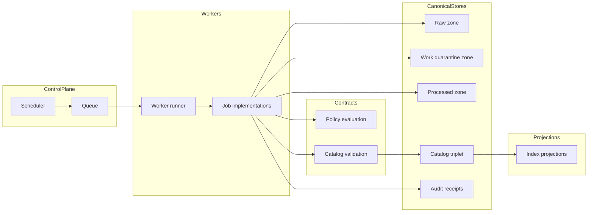

<!-- [KFM_META_BLOCK_V2]
doc_id: kfm://doc/a026ecbf-b923-42ab-b94d-2e6eed0d7201
title: KFM Workers
type: standard
version: v1
status: draft
owners: TBD
created: 2026-03-03
updated: 2026-03-03
policy_label: public
related:
  - ../README.md
  - ../../packages/ingest/README.md
  - ../../packages/catalog/README.md
  - ../../packages/indexers/README.md
  - ../../packages/policy/README.md
tags: [kfm, workers, pipelines, promotion-contract]
notes:
  - Fail-closed template: replace UNKNOWN sections with confirmed repo paths in PRs.
[/KFM_META_BLOCK_V2] -->

# KFM Workers

`apps/workers/` — Background job runners for long-running, scheduled, and batch work (pipelines, indexing, validations, maintenance) while preserving KFM’s **trust membrane**.

**Owners:** TBD (resolve via `CODEOWNERS`) • **Status:** draft (fail-closed) • **Policy label:** public (doc-only)


> [!WARNING]
> This README is **fail-closed**. Anything repo-specific (actual worker runtime, queue tech, entrypoints, deployment manifests, receipt locations) is **UNKNOWN** until verified in-repo.
> Do not “fill in the blanks” from memory.

## Navigation

- [Truth status legend](#truth-status-legend)
- [First follow-up checklist](#first-follow-up-checklist)
- [Where this fits](#where-this-fits)
- [What belongs here](#what-belongs-here)
- [What must not go here](#what-must-not-go-here)
- [Non-negotiable invariants](#non-negotiable-invariants)
- [Architecture sketch](#architecture-sketch)
- [Execution modes](#execution-modes)
- [Job contract](#job-contract)
- [Promotion gates](#promotion-gates)
- [Observability](#observability)
- [Local development](#local-development)
- [Directory layout](#directory-layout)
- [Worker registry](#worker-registry)
- [Contributing](#contributing)
- [Appendix](#appendix)

---

## Truth status legend

This README uses explicit claim labels so it stays evidence-first:

- **CONFIRMED (design)**: KFM invariants / contract posture (treat as required)
- **UNKNOWN (repo)**: not yet verified in this repo (treat as TODO; do not assume)
- **PROPOSED**: a pattern you may adopt (validate before standardizing)

> [!NOTE]
> Repo-specific facts should graduate from **UNKNOWN → CONFIRMED (repo)** by attaching paths/snippets in PR descriptions.

[Back to top](#kfm-workers)

---

## First follow-up checklist

These steps convert this README from UNKNOWN-heavy to repo-confirmed without guessing:

### Repo facts to confirm

- [ ] Capture a tree for this directory:
  - `tree -L 3 apps/workers/` (or `find apps/workers -maxdepth 3 -type d`)
- [ ] Identify the runtime/tooling boundary:
  - Look for `package.json`, `pnpm-workspace.yaml`, `pyproject.toml`, `requirements.txt`, `Cargo.toml`, `go.mod`, etc.
- [ ] Find the worker entrypoints:
  - Search for `main`, `__main__`, `cli`, `worker`, `runner`, `schedule`, `cron`
- [ ] Confirm scheduling/queue mechanism (if any):
  - `CronJob` YAML, Redis/Rabbit, Temporal, Prefect, Argo, etc.
- [ ] Confirm where run receipts and manifests live:
  - `data/audit/`, `data/catalog/prov/`, object-store paths, DB tables, etc.
- [ ] Confirm how policy is invoked:
  - Conftest/OPA in CI vs policy SDK in-process vs sidecar

### Minimum updates after verification

- [ ] Replace “UNKNOWN (repo)” notes with actual:
  - entrypoint commands
  - job registry path
  - receipt storage path
  - CI workflow file names

[Back to top](#kfm-workers)

---

## Where this fits

**CONFIRMED (design):** `apps/workers/` is the “offline compute” surface for KFM. It runs outside request/response time limits and is responsible for building, validating, and maintaining governed artifacts.

**Interfaces (expected posture):**

- Workers **SHOULD** use shared libraries in `packages/` (domain/use-cases/contracts), rather than re-implementing core logic.
- Workers **MUST NOT** create a bypass around the trust membrane:
  - for anything user-facing or publishable, policy must be evaluated and promotion gates must be enforced.

**Related contracts and shared modules (links are repo-relative):**

- `../README.md` — what “apps/” means overall
- `../../packages/ingest/README.md` — ingestion + receipts posture
- `../../packages/catalog/README.md` — DCAT/STAC/PROV validation posture
- `../../packages/indexers/README.md` — rebuildable projections + index receipts
- `../../packages/policy/README.md` — policy bundle + Conftest/OPA posture

[Back to top](#kfm-workers)

---

## What belongs here

✅ Acceptable contents:

- Worker runner/orchestrator code (queue consumers, schedulers, job dispatch)
- Job implementations that:
  - are idempotent/retry-safe
  - are auditable (emit run receipts)
  - respect lifecycle zones (RAW → WORK/QUARANTINE → PROCESSED → CATALOG/TRIPLET → PUBLISHED)
- Deployment manifests/config for worker runtime (k8s Jobs/CronJobs, Helm values, etc.)
- Tests + fixtures for job behavior, including deny/abstain paths

[Back to top](#kfm-workers)

---

## What must not go here

❌ Exclusions:

- UI code (React, Map components)
- API route handlers (belongs in the governed API app)
- One-off scripts with no tests, no audit output, and no provenance
- Long-lived secrets (keys/tokens) or “shared admin token” patterns
- Direct-to-database hacks that bypass the governed API / policy boundary
- Large datasets or derived artifacts (those belong in governed storage zones)

[Back to top](#kfm-workers)

---

## Non-negotiable invariants

These are system-level constraints. Breaking them breaks trust.

### Truth path lifecycle

- Jobs that move data “up” the lifecycle **MUST** fail closed unless required artifacts exist.
- Jobs **MUST** treat canonical truth as:
  - object storage zones (raw/work/processed)
  - catalogs (DCAT/STAC/PROV)
  - audit ledger / run receipts
- Jobs **MUST** treat DB/search/tiles/graph as rebuildable projections.

### Trust membrane

- Workers **MUST NOT** create a “shadow admin path” that can publish/serve/cite without policy + gates.
- Workers **MUST** record policy decisions/obligations used for any publishable output.
- Workers **SHOULD** call the governed API or shared policy interfaces when producing user-facing artifacts.

### Auditability and determinism

- Every job run **MUST** emit a machine-readable run receipt.
- Receipts/manifests **MUST** include enough to reproduce or justify promotion (inputs, transforms, outputs, versions, decisions).
- Jobs **MUST** be retry-safe (at-least-once execution posture).

### Policy-safe failures

- Errors and logs **MUST** be “policy-safe”:
  - do not leak restricted existence via error details
  - redact sensitive fields per policy obligations

[Back to top](#kfm-workers)

---

## Architecture sketch


```mermaid
flowchart LR
  subgraph ControlPlane
    S[Scheduler]
    Q[Queue]
  end

  subgraph Workers
    R[Worker runner]
    J[Job implementations]
  end

  subgraph Contracts
    PDP[Policy evaluation]
    CAT[Catalog validation]
  end

  subgraph CanonicalStores
    RAW[Raw zone]
    WQ[Work quarantine zone]
    PR[Processed zone]
    TRIP[Catalog triplet]
    AUD[Audit receipts]
  end

  subgraph Projections
    IDX[Index projections]
  end

  S --> Q
  Q --> R
  R --> J

  J --> PDP
  J --> RAW
  J --> WQ
  J --> PR
  J --> CAT
  CAT --> TRIP
  J --> AUD
  TRIP --> IDX
```

**Design intent:**

- Jobs are durable and restartable.
- Policy is evaluated before any publishable write.
- Catalog validation + cross-linking is a hard gate before promotion.
- Receipts are written for every run (success, failure, skip) so the system is auditable.

[Back to top](#kfm-workers)

---

## Execution modes

> [!IMPORTANT]
> The table below is **PROPOSED** until confirmed in this repo.

| Mode | When to use | Typical components | Notes |
|---|---|---|---|
| Queue workers | High volume async tasks; fan-out; variable workloads | Runner + broker/backend | Requires strict idempotency + retry discipline |
| Scheduled jobs | Periodic refresh, maintenance, nightly ingest | Cron-like scheduler | Prefer for predictable time-based tasks |
| Manual “one-shot” | Backfills, repair runs, incident response | CLI entrypoint | Must still emit receipts and respect gates |

[Back to top](#kfm-workers)

---

## Job contract

A consistent contract is how we keep workers governed, testable, and reversible.

### Required properties

**Idempotency**

- A job **MUST** be safe to retry (“at least once” execution).
- Use deterministic IDs where possible and write-once receipts.

**Inputs**

- Inputs **MUST** be referenced by stable identifiers (dataset IDs, version IDs, content hashes, URIs).
- Avoid ad-hoc local paths as the primary reference.

**Outputs**

- Outputs **MUST** declare:
  - lifecycle zone
  - checksums/digests
  - stable IDs (dataset_version_id, artifact ids)

**Receipts and manifests**

- Every run **MUST** emit a run receipt.
- Runs that promote or publish **SHOULD** also emit:
  - a run manifest (inputs + params)
  - provenance bundle (PROV or equivalent)
  - promotion manifest (what passed gates and is being shipped)

### Example job envelope

```json
{
  "job_id": "uuid",
  "job_type": "index.build_embeddings",
  "requested_by": "system|user:<id>",
  "requested_at": "2026-03-03T00:00:00Z",
  "inputs": [
    {
      "kind": "dataset_version",
      "id": "kfm://dataset_version/2026-02.abcd1234",
      "digest": "sha256:..."
    }
  ],
  "parameters": {
    "target_zone": "processed",
    "policy_label": "public",
    "dry_run": false
  },
  "trace": {
    "parent_run_id": null,
    "correlation_id": "uuid"
  }
}
```

[Back to top](#kfm-workers)

---

## Promotion gates

Workers are a primary enforcement point for promotion from:

**RAW → WORK/QUARANTINE → PROCESSED → CATALOG/TRIPLET → PUBLISHED**

A job that writes to a “higher” zone **MUST** fail closed unless the required artifacts exist.

### Minimum promotion checklist

- [ ] Identity present (dataset + dataset_version_id)
- [ ] License and rights metadata present (or quarantined)
- [ ] Sensitivity/policy label assigned; obligations recorded
- [ ] Validation results present (QA checks + thresholds)
- [ ] Catalog triplet present and validated (DCAT/STAC/PROV)
- [ ] Provenance links recorded (inputs, transforms, tool versions)
- [ ] Checksums/content integrity recorded
- [ ] Run receipt written (who/what/when/why + inputs/outputs + policy decisions)

> [!NOTE]
> This checklist is non-negotiable for anything that affects user-visible maps, stories, or AI responses.

[Back to top](#kfm-workers)

---

## Observability

Workers must be observable in the same way we expect from the API.

### Logging

Minimum fields:

- `timestamp`
- `service` = `workers`
- `job_type`
- `job_id`
- `run_id`
- `correlation_id`
- `dataset_version_ids` (if applicable)
- `zone_in` / `zone_out`
- `policy_label`
- `status` = `started|succeeded|failed|skipped`
- `duration_ms`
- `error` (message + stack) on failure (policy-safe)

### Metrics

Minimum set:

- Jobs started/succeeded/failed by `job_type`
- Duration histogram by `job_type`
- Retry count by `job_type`
- Queue depth/lag (if using a queue)
- Gate failures by category (license, schema, policy, QA, catalog)

### Tracing

- Propagate `correlation_id` into any API calls so a single run is traceable across workers + API.

[Back to top](#kfm-workers)

---

## Local development

> [!IMPORTANT]
> Commands below are **templates** until this repo’s worker runtime is confirmed.

### Discover the runtime

```bash
ls -la apps/workers
# Look for: package.json, pyproject.toml, Dockerfile, compose.yaml, helm/, kustomize/, etc.
```

### Run a job locally

```bash
# Example shape — replace with real CLI/entrypoint
# ./apps/workers/bin/workers run-job <job_type> --dataset-version <id>

echo "TODO: document actual command"
```

### Test

```bash
# Replace with the repo’s real test runner
echo "TODO: add test command (pytest/jest/vitest/go test/etc)"
```

[Back to top](#kfm-workers)

---

## Directory layout

> [!NOTE]
> Layout below is **PROPOSED** until verified against the actual repo tree.

```text
apps/workers/                                          # Worker runtime: background jobs for ingest/index/catalog/publish with receipts + policy-aware execution
├─ README.md                                            # Worker intent, supported job classes, invariants (deterministic receipts, default-deny, safe logging), and how to run locally/CI
├─ src/                                                 # Worker implementation (job definitions, runner, adapters, receipt emitters)
│  ├─ runner/                                           # Queue/scheduler integration + job dispatch (retries/backoff, concurrency, timeouts, cancellation)
│  ├─ jobs/                                             # Job implementations grouped by domain (ingest, validate, catalog, index, export, story publish, focus eval)
│  ├─ receipts/                                         # Receipt + manifest writers (schema-validated; digests/spec_hash; links to evidence/catalogs where relevant)
│  └─ policy/                                           # Policy client helpers (PDP calls, decision caching, obligation application hooks; NO policy logic here)
├─ deploy/                                              # Optional deployment manifests (k8s/helm): resources, secrets references, scaling, probes, and policy wiring
├─ tests/                                               # Worker tests (unit + integration): job logic, runner behavior, receipt validity, policy-safe failure shaping
└─ scripts/                                             # Dev helpers (local run wrappers, seed/cleanup); must not be the only way to run jobs (CI uses runner directly)
```

### Acceptable inputs

- Worker job code (idempotent, audited)
- Shared job utilities (hashing, provenance helpers, receipt builders)
- Deployment configuration for worker runtime
- Tests + fixtures for worker behavior (including deny paths)

### Exclusions

- Production secrets
- Large datasets or derived artifacts
- UI assets
- Direct store access that bypasses governed interfaces

[Back to top](#kfm-workers)

---

## Worker registry

> [!IMPORTANT]
> This table is a **starter template**. Replace with confirmed job types in this repo.

| Job type | Purpose | Trigger | Inputs | Outputs | Receipt required |
|---|---|---|---|---|---|
| `ingest.pull_source` | Pull upstream into RAW | schedule/manual | source config | raw artifacts | yes |
| `validate.qa_dataset` | QA checks in WORK/QUARANTINE | pipeline step | dataset_version_id | validation report | yes |
| `catalog.build_triplet` | Build DCAT/STAC/PROV | pipeline step | processed artifacts | triplet artifacts | yes |
| `index.rebuild` | Rebuild projections | on publish/change | triplet + processed | indexes/tiles/graph | yes |
| `maintenance.repair` | Repair/backfill | manual | run manifest | repaired artifacts | yes |

[Back to top](#kfm-workers)

---

## Contributing

### Add a new job

1. Create a new job module under `src/jobs/` (or repo equivalent).
2. Define:
   - typed inputs + parameters
   - idempotency strategy
   - validation rules + thresholds
   - policy checks required
   - receipt output (run_receipt + optional run_manifest)
3. Add tests:
   - happy path
   - retry path (duplicate execution)
   - policy-deny path (fail closed)
4. Register the job in the worker registry (table above or repo-standard registry file).
5. Ensure the job emits receipts and that receipt shape is schema-validated.

### Definition of done

- [ ] Job has a stable `job_type` identifier
- [ ] Job is retry-safe (idempotent or explicitly guarded)
- [ ] Job emits receipts for success/failure/skip
- [ ] Promotion gates are enforced for any zone uplift
- [ ] Tests cover deny/abstain and gate failure modes
- [ ] Logs and receipts are policy-safe (no sensitive leakage)

[Back to top](#kfm-workers)

---

## Appendix

<details>
<summary><strong>Template: run_manifest.json</strong></summary>

```json
{
  "kfm_run_manifest_version": "v1",
  "run_id": "kfm://run/<iso8601>.<job_type>.<suffix>",
  "job_type": "catalog.build_triplet",
  "inputs": [
    {
      "artifact_id": "kfm://artifact/sha256:...",
      "zone": "processed",
      "uri": "s3://.../events.parquet",
      "digest": "sha256:..."
    }
  ],
  "parameters": {
    "dataset_version_id": "2026-02.abcd1234",
    "policy_label": "public"
  },
  "environment": {
    "git_commit": "UNKNOWN",
    "container_image": "sha256:UNKNOWN"
  }
}
```

</details>

<details>
<summary><strong>Template: run_receipt.json</strong></summary>

```json
{
  "kfm_run_receipt_version": "v1",
  "run_id": "kfm://run/<iso8601>.<job_type>.<suffix>",
  "job_type": "catalog.build_triplet",
  "status": "succeeded",
  "inputs": [
    { "kind": "dataset_version", "id": "kfm://dataset_version/2026-02.abcd1234", "digest": "sha256:..." }
  ],
  "outputs": [
    { "kind": "catalog", "id": "kfm://catalog/triplet/2026-02.abcd1234", "digest": "sha256:...", "zone": "catalog" }
  ],
  "policy": {
    "policy_label": "public",
    "decision_id": "kfm://policy_decision/UNKNOWN",
    "obligations": []
  },
  "timestamps": {
    "started_at": "2026-03-03T00:00:00Z",
    "ended_at": "2026-03-03T00:00:10Z"
  },
  "errors": []
}
```

</details>

<details>
<summary><strong>Template: local policy gate (Conftest)</strong></summary>

```bash
# Example only — update policy path and inputs for this repo.
conftest test ./path/to/artifacts-or-contracts --policy ../../packages/policy/rego
```

</details>

---

**Back to top:** [↑](#kfm-workers)
