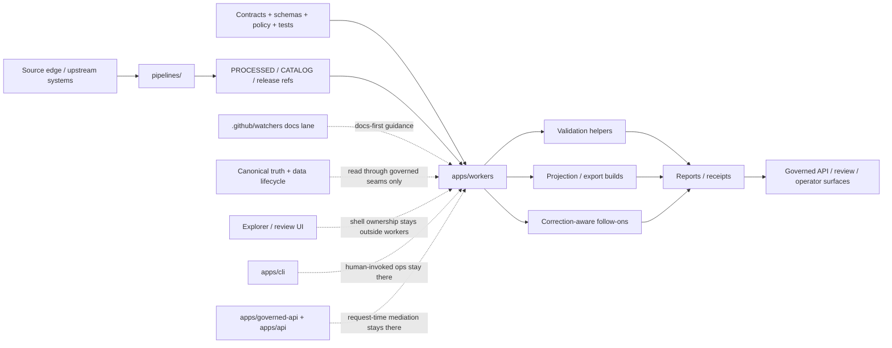

<!-- [KFM_META_BLOCK_V2]
doc_id: kfm://doc/<NEEDS_VERIFICATION_UUID>
title: Workers Runtime Boundary
type: standard
version: v1
status: draft
owners: @bartytime4life
created: <NEEDS_VERIFICATION_YYYY-MM-DD>
updated: <NEEDS_VERIFICATION_YYYY-MM-DD>
policy_label: public
related: [../../README.md, ../README.md, ../governed-api/README.md, ../api/README.md, ../../packages/README.md, ../../contracts/README.md, ../../schemas/README.md, ../../policy/README.md, ../../tests/README.md, ../../data/README.md, ../../infra/README.md, ../../pipelines/README.md, ../../.github/CODEOWNERS, ../../.github/workflows/README.md, ../../.github/watchers/README.md]
tags: [kfm, workers]
notes: [doc_id placeholder until registry-backed assignment exists, created/updated dates need git-history verification, path and tree claims below are intentionally source-bounded to currently surfaced documentation and should be rechecked against the mounted repo before publication]
[/KFM_META_BLOCK_V2] -->

# Workers Runtime Boundary

Governed app-adjacent background execution boundary for release-backed rebuilds, validation helpers, exports, and correction-aware follow-ons under `apps/workers/`.

**Status:** experimental  
**Owners:** `@bartytime4life`  
**Badges:**         
**Quick jump:** [Scope](#scope) · [Repo fit](#repo-fit) · [Inputs](#inputs) · [Exclusions](#exclusions) · [Directory tree](#directory-tree) · [Quickstart](#quickstart) · [Usage](#usage) · [Diagram](#diagram) · [Reference tables](#reference-tables) · [Task list](#task-list) · [FAQ](#faq) · [Appendix](#appendix)

| Field | Value |
|---|---|
| Path | `apps/workers/README.md` |
| Repo fit | Child boundary README for `apps/` |
| Upstream | [`../README.md`](../README.md), [`../../README.md`](../../README.md) |
| Worker-local downstream | **NEEDS VERIFICATION** — no directly surfaced child worker lanes were available in the current evidence bundle |
| Accepted inputs | Release-backed work orders, validation-safe task specs, projection/export requests, correction-aware follow-ons, fixture-backed job examples |
| Exclusions | Source-edge intake ETL, gatehouse watcher doctrine, browser UI ownership, request-time API mediation, canonical truth rewrites, hidden policy bypasses |
| Current surfaced signal | The currently surfaced documentation treats `apps/workers/` as a boundary-first lane and keeps it distinct from source-edge `pipelines/`, docs-only `.github/watchers/`, CLI-operated flows, and request-time governed API surfaces |
| Execution split | `apps/workers/` should stay separate from source-edge `../../pipelines/` work and from docs-only, emit-oriented watcher material in `../../.github/watchers/` |
| Adjacent authority / control roots | [`../../packages/README.md`](../../packages/README.md), [`../../contracts/README.md`](../../contracts/README.md), [`../../schemas/README.md`](../../schemas/README.md), [`../../policy/README.md`](../../policy/README.md), [`../../tests/README.md`](../../tests/README.md), [`../../data/README.md`](../../data/README.md), [`../../infra/README.md`](../../infra/README.md), [`../../pipelines/README.md`](../../pipelines/README.md), [`../../.github/workflows/README.md`](../../.github/workflows/README.md), [`../../.github/watchers/README.md`](../../.github/watchers/README.md) |
| Evidence boundary | Attached KFM doctrine plus source-bounded documentation only; deeper worker-local topology, code, schedules, manifests, and runtime behavior remain **UNKNOWN** unless rechecked against the mounted repo |

> [!IMPORTANT]
> Treat this file as a **boundary contract first** and an **implementation index second**.

> [!NOTE]
> The strongest currently surfaced evidence supports the role of workers as app-adjacent asynchronous execution downstream of governed scope. It does **not** prove a mounted worker runtime inventory, scheduler stack, or deployed lane set at this path.

## Scope

This README defines what `apps/workers/` is for, what it must not become, and how future worker code should fit the repo without collapsing KFM’s trust boundaries.

At this path, “workers” means **app-adjacent background execution**: jobs that move already-governed material forward through release-backed or policy-safe steps such as validation support, projection/export builds, correction propagation, and other bounded follow-on work.

This file does **not** claim that those lanes are already implemented here. It states the boundary they must respect if and when they land here.

A practical reading rule is:

- `pipelines/` = source-edge and lane-specific execution
- `.github/watchers/` = repo-side, docs-first watcher doctrine and handoff guidance
- `apps/workers/` = app-adjacent asynchronous follow-on work that starts from governed scope instead of raw intake

[Back to top](#workers-runtime-boundary)

## Repo fit

`apps/workers/` sits under the runtime-facing `apps/` family, so it should behave like an app boundary, not like a miscellaneous dumping ground.

| Relationship | What it means here |
|---|---|
| Parent boundary | [`../README.md`](../README.md) should keep `apps/` as the runtime-facing surface family and place workers downstream of trust-bearing shell law. |
| Root posture | [`../../README.md`](../../README.md) keeps the repo verification-first, evidence-first, map-first, and time-aware. |
| Shared law | Reusable domain, validation, policy-support, evidence, and catalog logic belongs in [`../../packages/README.md`](../../packages/README.md) and package directories, not duplicated here. |
| Shared contracts | Trust-bearing payloads, examples, and contract law belong in [`../../contracts/README.md`](../../contracts/README.md). |
| Shared schemas | Worker lanes should consume machine-readable schema scaffolding from [`../../schemas/README.md`](../../schemas/README.md) where applicable rather than inventing undocumented local blobs. |
| Data lifecycle boundary | Workers should normally start from governed lifecycle objects and release-safe refs described under [`../../data/README.md`](../../data/README.md), not from silent raw-state shortcuts. |
| Pipeline boundary | Source-edge fetch, normalize, validate, package, and lane-specific watcher execution belong in [`../../pipelines/README.md`](../../pipelines/README.md), not by default under `apps/workers/`. |
| Gatehouse watcher boundary | Repo-side watcher doctrine and watcher inventory belong in [`../../.github/watchers/README.md`](../../.github/watchers/README.md), not in this app lane. |
| Policy boundary | Worker behavior consumes policy/runtime decisions from [`../../policy/README.md`](../../policy/README.md) or equivalent governed surfaces; it must not invent publication law locally. |
| Test burden | Worker lanes should be paired with contract, policy, E2E, regression, or fixture coverage in [`../../tests/README.md`](../../tests/README.md). |
| Workflow / CI doc lane | [`../../.github/workflows/README.md`](../../.github/workflows/README.md) is contextual workflow documentation, not proof of active worker automation on its own. |
| Infra boundary | Queue wiring, service managers, schedules, secrets, deployment mechanics, rollback, and exposure control belong in [`../../infra/README.md`](../../infra/README.md) and config surfaces, not hidden inside worker code. |

### Current sibling runtime surfaces

| Sibling surface | Why it matters to `apps/workers/` |
|---|---|
| [`../cli/README.md`](../cli/README.md) | Human-invoked promotion, migration, validation, diagnostics, and receipt inspection belong in CLI lanes before they become unattended worker execution. |
| [`../explorer-web/README.md`](../explorer-web/README.md) | Browser shell ownership stays outside workers. |
| [`../governed-api/README.md`](../governed-api/README.md) | Request-time policy mediation, evidence resolution, and trust-bearing API behavior stay outside workers. |
| [`../api/README.md`](../api/README.md) | A parallel `apps/api/` doc surface is already part of the surfaced documentation set; this README should not collapse that split by assumption. |
| [`../api/src/api/README.md`](../api/src/api/README.md) | Deeper synchronous API enforcement is already documented elsewhere; worker code must not absorb request-time duties. |
| [`../api/tests/README.md`](../api/tests/README.md) | App-local API test coverage belongs beside synchronous enforcement, not inside worker glue. |
| [`../review-console/README.md`](../review-console/README.md) | Review UX, approval/denial state, QA inspection, rollback visibility, and correction UI must remain trust-visible rather than buried in job side effects. |

### Adjacent execution surfaces outside `apps/`

| Surface | Why it should stay separate from `apps/workers/` |
|---|---|
| [`../../pipelines/README.md`](../../pipelines/README.md) | Source intake, normalization, validation, and lane-shaped execution already belong there. |
| [`../../.github/watchers/README.md`](../../.github/watchers/README.md) | Watcher doctrine is gatehouse-scoped and docs-first, not app-runtime worker code. |

### What belongs here

Use `apps/workers/` for code and docs that answer questions like these:

- What background jobs run **after** a request, release, review action, or explicit runtime trigger?
- What release-backed artifacts get rebuilt here?
- What helper jobs validate, export, generalize, or propagate corrections?
- What receipts, logs, or proofs should each worker emit?
- What app-adjacent asynchronous steps are safer outside request-time paths, yet still clearly downstream of governed scope?

### What does not belong here

Do **not** use `apps/workers/` for:

- source-edge intake ETL or lane-specific upstream watchers
- gatehouse watcher doctrine or repo-monitoring scaffolding
- generic reusable libraries
- browser-facing UI components
- request-time API mediation
- human-invoked steward commands that already fit the CLI surface
- direct canonical write logic hidden in scripts
- private admin shortcuts that bypass review or policy
- undocumented cron jobs with no receipts, fixtures, or failure posture

[Back to top](#workers-runtime-boundary)

## Inputs

The following inputs are appropriate for worker lanes **if they exist here**.

| Input type | Status | Why it belongs |
|---|---|---|
| Release-backed identifiers (`release_id`, dataset version refs, bundle refs) | **CONFIRMED doctrine / local placement PROPOSED** | Workers should build from promoted scope, not invent fresh authority. |
| Lifecycle-zone handles rooted in governed state (`PROCESSED`, `CATALOG`, `PUBLISHED`, proof-pack refs) | **INFERRED** | App-adjacent follow-on work should usually start from governed lifecycle edges rather than silent raw intake. |
| Validation-safe task specs | **PROPOSED** | Validation helpers are a natural worker responsibility candidate. |
| Projection/export requests | **CONFIRMED doctrine / local placement PROPOSED** | Projection and packaging workers recur throughout KFM realization material. |
| Correction/supersession follow-ons | **CONFIRMED doctrine / local placement PROPOSED** | Correction must remain visible and move forward through the same object graph. |
| Fixture-backed job examples | **PROPOSED** | Worker boundaries are easier to review when task inputs are reproducible. |
| Environment wiring and secrets references | **INFERRED** | Workers need config, but config must stay declarative, externalized, and infra-owned. |

### Accepted inputs checklist

A worker-bound task spec should usually answer:

1. What release-backed, review-backed, or runtime-safe object triggered it?
2. What contract version defines its payload?
3. Which lifecycle zone or release object is it allowed to read from?
4. What artifacts may it emit?
5. What is its fail-closed behavior?
6. What correction path applies if it misfires?
7. Why is this a worker lane instead of `../../pipelines/`, `../cli/`, or a request-time API path?

[Back to top](#workers-runtime-boundary)

## Exclusions

The fastest way to weaken this directory is to let it absorb responsibilities that belong elsewhere.

| Exclusion | Why it is out of scope | Where it goes instead |
|---|---|---|
| Source-edge intake, authoritative dataset normalization, or upstream watcher logic | KFM already reserves a lane-specific execution family for that work. | [`../../pipelines/README.md`](../../pipelines/README.md) |
| Repo-side watcher doctrine, watcher inventory, or gatehouse handoff rules | That is gatehouse-scoped, docs-first material, not app runtime code. | [`../../.github/watchers/README.md`](../../.github/watchers/README.md) |
| Direct browser traffic | Workers are not the public trust surface. | Governed API and web/review apps |
| Request-time API mediation | Request-time trust, policy, and evidence shaping should stay synchronous and inspectable at the API boundary. | [`../governed-api/README.md`](../governed-api/README.md) and deeper API docs |
| Human-invoked steward commands | Interactive operator flows should stay explicit and receipted, not drift into unattended worker glue. | [`../cli/README.md`](../cli/README.md) |
| Canonical truth rewrites from ad hoc jobs | Canonical writes must stay explicit, governed, and reviewable. | Governed data / contract / release paths |
| Policy authorship by convenience | Workers consume policy; they do not redefine it. | [`../../policy/README.md`](../../policy/README.md) and governed review flows |
| Hidden release promotion | Publication is a governance event, not a side effect. | Release / policy / review lanes |
| Reusable domain law | Reuse belongs in packages, not app-local drift. | [`../../packages/README.md`](../../packages/README.md) |
| Undocumented one-off scripts | KFM needs inspectable, repeatable behavior. | [`../../scripts/`](../../scripts/) only if truly non-authoritative and documented |

> [!WARNING]
> A worker that can silently publish, silently “heal” missing proof, or silently bypass review is not a convenience. It is a trust-boundary bug.

[Back to top](#workers-runtime-boundary)

## Directory tree

### Current surfaced app-family snapshot

```text
apps/
├─ README.md
├─ api/
│  ├─ README.md
│  ├─ src/
│  │  └─ api/
│  │     └─ README.md
│  └─ tests/
│     └─ README.md
├─ cli/
│  └─ README.md
├─ explorer-web/
│  └─ README.md
├─ governed-api/
│  └─ README.md
├─ review-console/
│  └─ README.md
└─ workers/
   └─ README.md   # child worker lanes NEEDS VERIFICATION in the current evidence bundle
```

> [!NOTE]
> The surfaced documentation keeps both `apps/governed-api/` and `apps/api/` visible. This file preserves that split instead of guessing which label becomes final.

### Worker-local tree

```text
apps/workers/
└─ README.md
```

### Adjacent execution-neighbor snapshot

```text
pipelines/
├─ README.md
├─ soils/
│  └─ gssurgo-ks/
│     └─ README.md
└─ wbd-huc12-watcher/
   └─ README.md

.github/watchers/
└─ README.md
```

### Documented expansion slots

The slots below are **not** confirmed live subdirectories. They are the most likely future fits if worker code stays under `apps/workers/`.

| Candidate path | Status | Intended role |
|---|---|---|
| `apps/workers/validation/` | **PROPOSED** | Background validation helpers, replay-safe checks, fixture-driven job lanes |
| `apps/workers/projections/` | **PROPOSED** | Projection and packaging builds that emit derived artifacts and receipts |
| `apps/workers/exports/` | **PROPOSED** | Export-oriented jobs for release-backed deliverables |
| `apps/workers/corrections/` | **PROPOSED** | Correction, supersession, withdrawal, or visible lineage propagation helpers |
| `apps/workers/intake/` | **PROPOSED / NEEDS VERIFICATION** | App-adjacent intake orchestration only if the repo later relocates that concern out of `pipelines/` |
| `apps/workers/fixtures/` | **PROPOSED** | Worker-specific task samples and golden outputs |
| `apps/workers/README.md` child links | **NEEDS VERIFICATION** | Add only after real child directories land |

[Back to top](#workers-runtime-boundary)

## Quickstart

These commands are intentionally **read-only**. They help reviewers verify what exists before the doc claims more than the tree supports.

```bash
# from repo root
git rev-parse --short HEAD

printf '\n== app surface READMEs ==\n'
find apps -maxdepth 4 -type f -name README.md | sort

printf '\n== worker boundary ==\n'
sed -n '1,260p' apps/workers/README.md

printf '\n== parent apps boundary ==\n'
sed -n '1,260p' apps/README.md

printf '\n== sibling API surfaces ==\n'
sed -n '1,220p' apps/governed-api/README.md
sed -n '1,120p' apps/api/README.md
sed -n '1,260p' apps/api/src/api/README.md
sed -n '1,120p' apps/api/tests/README.md

printf '\n== adjacent execution lanes ==\n'
sed -n '1,260p' pipelines/README.md
sed -n '1,220p' .github/watchers/README.md
sed -n '1,220p' .github/workflows/README.md

printf '\n== shared contract / schema / policy / test roots ==\n'
sed -n '1,220p' contracts/README.md
sed -n '1,240p' schemas/README.md
sed -n '1,220p' policy/README.md
sed -n '1,220p' tests/README.md
sed -n '1,220p' data/README.md
sed -n '1,220p' infra/README.md

printf '\n== worker mentions across repo ==\n'
grep -RIn "workers" README.md apps packages docs contracts schemas policy tests data infra pipelines .github 2>/dev/null || true
```

### Sanity check before expanding this README

```bash
# confirm whether real worker lanes exist before linking to them
find apps/workers -maxdepth 2 -mindepth 1 | sort
```

If that command returns only `apps/workers/README.md`, keep this file boundary-first and avoid pretending deeper structure is already mounted.

[Back to top](#workers-runtime-boundary)

## Usage

Use this file in three modes.

### 1. Boundary guide

Before adding code under `apps/workers/`, check that the job really belongs in an app runtime surface and not in a reusable package, contract family, policy bundle, pipeline lane, gatehouse watcher lane, CLI lane, review surface, or infra schedule.

### 2. Path-decision guide

| If the work is primarily... | Put it here | Why |
|---|---|---|
| Source fetch, normalize, diff, package, or watcher logic against upstream authoritative data | [`../../pipelines/`](../../pipelines/README.md) | That is the visible lane-specific execution family. |
| Repo-side emit-only watcher doctrine or gatehouse watcher control | [`../../.github/watchers/`](../../.github/watchers/README.md) | That lane is docs-first and gatehouse-scoped, not app runtime code. |
| Release-backed async rebuild, validation follow-on, export packaging, or correction propagation after governed scope already exists | `apps/workers/` | This is the narrow app-adjacent async seam this README defines. |
| Human-invoked steward or operator command | [`../cli/`](../cli/README.md) | Human-invoked work should stay explicit and receipted. |
| Synchronous request-time policy/evidence mediation | [`../governed-api/`](../governed-api/README.md) or [`../api/src/api/`](../api/src/api/README.md) | Request-time trust-bearing behavior belongs in API lanes, not background jobs. |
| Shared reusable law, adapters, or helpers | [`../../packages/`](../../packages/README.md) | Reuse should not drift into app-local worker glue. |

### 3. Review checklist

Every new worker lane added here should document:

- trigger source
- accepted payload contract
- lifecycle zone or release object it reads from
- upstream dependencies
- emitted artifacts or receipts
- failure posture
- rollback / correction behavior
- neighboring tests and fixtures
- why it is a worker lane rather than a pipeline, CLI, or request-time API concern

[Back to top](#workers-runtime-boundary)

## Diagram


```mermaid
flowchart LR
    A[Source edge / upstream systems] --> P[pipelines/]
    P --> R[PROCESSED / CATALOG / release refs]

    C[Contracts + schemas + policy + tests] --> W[apps/workers]
    R --> W

    G[.github/watchers docs lane] -. docs-first guidance .-> W
    T[Canonical truth + data lifecycle] -. read through governed seams only .-> W

    W --> D[Validation helpers]
    W --> E[Projection / export builds]
    W --> F[Correction-aware follow-ons]

    D --> O[Reports / receipts]
    E --> O
    F --> O

    O --> Z[Governed API / review / operator surfaces]

    UI[Explorer / review UI] -. shell ownership stays outside workers .-> W
    CLI[apps/cli] -. human-invoked ops stay there .-> W
    API[apps/governed-api + apps/api] -. request-time mediation stays there .-> W
```

### Reading rule for the diagram

`apps/workers/` may participate in governed flow, but it must stay **downstream of release-safe scope** and **upstream of derived outputs, receipts, and visible correction propagation**. It is not the sovereign truth layer, the source-edge intake lane, or the gatehouse watcher lane.

[Back to top](#workers-runtime-boundary)

## Reference tables

### Execution surface decision matrix

| Surface | Default burden | Current surfaced posture |
|---|---|---|
| `apps/workers/` | App-adjacent asynchronous follow-ons after governed scope exists | **CONFIRMED boundary role / worker-local implementation depth UNKNOWN** |
| `pipelines/` | Lane-specific source execution, normalization, validation, packaging, and watcher-style runtime | **CONFIRMED path family / deeper lane inventory source-bounded here** |
| `.github/watchers/` | Gatehouse watcher doctrine, emit-only posture, and runtime handoff guidance | **CONFIRMED path family / docs-first posture in surfaced materials** |
| `apps/cli/` | Human-invoked steward/operator commands | **CONFIRMED sibling** |
| `apps/governed-api/` + `apps/api/` | Request-time trust mediation and deeper API documentation | **CONFIRMED split doc surface / final authority naming unresolved** |

### Worker lane matrix

| Lane | What belongs | Must never do | Status |
|---|---|---|---|
| Validation helpers | Replay-safe checks, QA follow-ons, fixture-backed reports | Quietly promote failed material | **PROPOSED** |
| Projection / packaging | Tiles, exports, portrayals, search/vector/scene builds, build receipts | Back-write authority or infer missing release state | **PROPOSED** |
| Export jobs | Release-backed outward deliverables and their proof objects | Invent policy or bypass restrictions | **PROPOSED** |
| Correction propagation | Supersession, withdrawal, and lineage-visible follow-ons | Silently overwrite history | **PROPOSED** |
| Intake orchestration | App-adjacent intake only if the repo later relocates that concern out of `pipelines/` | Replace canonical intake law with app-local shortcuts | **PROPOSED / NEEDS VERIFICATION** |
| Interactive operator work | Prefer `apps/cli/` when the action is human-invoked and review-facing | Masquerade as the hidden system of record | **CONFIRMED sibling / PROPOSED local split** |

### Artifact expectations

| Artifact | Worker stance |
|---|---|
| `SourceDescriptor` | **Read / consume only** |
| `IngestReceipt` | **Consume or reference if the lane depends on intake history** |
| `ValidationReport` | **May emit or extend in validation-oriented lanes** |
| `DatasetVersion` | **Consume as release-backed input, not author in secret** |
| `CatalogClosure` | **Consume when downstream jobs need outward context** |
| `DecisionEnvelope` | **Consume or emit only through governed policy-shaped flow, not ad hoc prose** |
| `ReleaseManifest` / proof-pack refs | **Consume only; do not quietly self-promote** |
| `ProjectionBuildReceipt` | **Expected output for projection/package work** |
| `EvidenceBundle` | **Usually downstream support object; workers may help materialize prerequisites but should not fake closure** |
| `RuntimeResponseEnvelope` | **Usually downstream of workers; not a primary worker-owned contract** |
| `CorrectionNotice` | **Propagate visible lineage; do not hide it** |

### “What lives where” summary

| Concern | Should live in | Should not live in |
|---|---|---|
| Reusable domain/job law | packages | app-local worker glue |
| Task contracts and examples | contracts / schemas / fixtures | inline undocumented JSON blobs |
| Source-edge ETL and upstream watcher logic | pipelines | app-local async worker directories |
| Gatehouse watcher doctrine and repo-side emit-only monitoring | `.github/watchers/` | app-local runtime worker directories |
| Scheduling and secrets | infra / configs / service-manager surfaces | hard-coded worker modules |
| Human-invoked operator commands | `apps/cli/` | background workers |
| Request-time trust mediation | `apps/governed-api/` and deeper API docs | worker side effects |
| Browser shell / review UI | `apps/explorer-web/`, `apps/review-console/` | worker lanes |
| Public trust cues | governed API + UI surfaces | background workers alone |
| Derived rebuild logic after governed scope exists | worker lanes | browser code |
| Canonical write authority | explicit governed components | hidden helper scripts |

[Back to top](#workers-runtime-boundary)

## Task list

### Definition of done for the first real worker lane

- [ ] A real directory exists under `apps/workers/`.
- [ ] This README’s tree has been updated to match the live repo.
- [ ] The new lane has its own child `README.md`.
- [ ] Inputs, outputs, lifecycle-zone reads, and fail-closed behavior are documented.
- [ ] Contracts, fixtures, and neighboring tests are linked.
- [ ] The lane states what it must never touch directly.
- [ ] The lane states why it is a worker lane rather than `../../pipelines/`, `../cli/`, or a request-time API concern.
- [ ] Scheduling/deployment wiring is documented outside the worker code itself.
- [ ] Any release-backed assumptions are explicit.
- [ ] Correction and rollback posture are visible.
- [ ] Parent links in [`../README.md`](../README.md) are updated if needed.

### Review gates

- [ ] No undocumented child links.
- [ ] No source-edge ETL misfiled here if it belongs in `../../pipelines/`.
- [ ] No gatehouse watcher doctrine silently redefined here if it belongs in `../../.github/watchers/`.
- [ ] No business law stranded in shell scripts.
- [ ] No browser-only code imported into worker logic.
- [ ] No request-time API mediation drifting into workers.
- [ ] No interactive steward flow misfiled here if it belongs in `apps/cli/`.
- [ ] No worker path implies publication authority by accident.
- [ ] No status text claims implementation that the live tree does not show.

[Back to top](#workers-runtime-boundary)

## FAQ

### Is `apps/workers/` confirmed to host runnable worker code today?

Not from the current session. The strongest surfaced evidence proves the boundary concept and the surrounding surface split. Deeper worker-local code, schedules, or runtime behavior still need mounted repo verification.

### Why not just use `pipelines/` instead?

Because `pipelines/` is already the lane for source-edge execution, normalization, validation, packaging, and watcher-shaped work. `apps/workers/` should stay narrower: release-backed, app-adjacent asynchronous follow-ons.

### Why not put watcher work in `.github/watchers/`?

Because `.github/watchers/` is a gatehouse watcher lane. It is the place to document emit-only watcher posture and handoff boundaries, not to smuggle app runtime code into the gatehouse.

### Should KFM keep workers under `apps/workers/` forever?

Current surfaced materials prove that `apps/workers/` exists as a boundary concept today. They do **not** prove that a future top-level worker family will never emerge. If repo topology changes later, this file should become a truthful pointer instead of competing doctrine.

### Can workers write canonical truth directly?

They should not do so implicitly or opportunistically. Any truth-changing behavior must stay explicit, governed, reviewable, and receipted.

### What is the fastest way to make this README stale?

Adding child directories or job lanes without updating the tree, execution-surface split, sibling-boundary cues, inputs/exclusions, and the “must never” rules together.

[Back to top](#workers-runtime-boundary)

## Appendix

<details>
<summary><strong>Status legend, sibling-boundary cues, and maintenance notes</strong></summary>

### Status legend

| Label | Meaning here |
|---|---|
| **CONFIRMED** | Directly supported by the surfaced KFM doctrine or by directly visible directory-level documentation |
| **INFERRED** | Strong fit with adjacent repo docs and doctrine, but not a mounted implementation fact |
| **PROPOSED** | Recommended future placement or role consistent with doctrine |
| **UNKNOWN** | Not verified from the current session’s mounted repo evidence |
| **NEEDS VERIFICATION** | Reviewer should inspect the mounted repo, manifests, tests, or schedules before treating the item as settled |

### Current sibling-boundary reminders

| Sibling | Default burden |
|---|---|
| `apps/cli/` | Human-invoked steward / operator commands |
| `apps/governed-api/` | Boundary-level request-time policy, trust, and evidence mediation |
| `apps/api/` | Parallel API doc family currently visible in surfaced materials |
| `apps/explorer-web/` | Browser shell and public exploration surface |
| `apps/review-console/` | Review-visible approval, denial, QA, rollback, and correction UI |
| `apps/workers/` | Unattended, bounded, app-adjacent background execution only |

### Current adjacent execution reminders

| Path | Treat it as |
|---|---|
| `pipelines/` | Source-edge and lane-specific execution family |
| `.github/watchers/` | Docs-first gatehouse watcher lane |
| `.github/workflows/` | Workflow documentation surface unless runtime YAML is directly reverified |

### Maintenance rules for this README

1. Prefer **tree truth** over ambition.
2. Add a child link only after the child path exists.
3. Keep worker law small here and move reusable logic into packages.
4. If the app-family topology changes, update **Repo fit**, **Directory tree**, **execution split**, and sibling-boundary references together.
5. If a worker lane starts duplicating pipeline or gatehouse watcher responsibilities, fix the boundary instead of writing around it.
6. If this directory becomes implementation-heavy, keep the top block concise and push long operational detail into child READMEs or runbooks.

### Good future neighbor docs

When the directory grows, these are the most natural child docs to add:

- `apps/workers/validation/README.md`
- `apps/workers/projections/README.md`
- `apps/workers/exports/README.md`
- `apps/workers/corrections/README.md`
- `apps/workers/fixtures/README.md`

Only add the links above after those paths are real.

</details>
