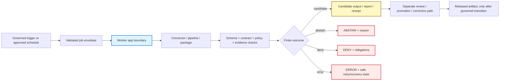

<!-- [KFM_META_BLOCK_V2]
doc_id: kfm://app/workers/readme
title: Workers App README
type: app-readme
subtype: deployable-boundary-readme
version: v0.2
prior_version: v0.1
status: draft
owners: NEEDS VERIFICATION — default CODEOWNERS route is @bartytime4life; no accepted Workers steward, operations owner, independent reviewer, or release authority was verified
created: 2026-06-16
updated: 2026-08-12
policy_label: public
current_path: apps/workers/README.md
owning_root: apps/
responsibility: Define the repository-grounded boundary, scaffold maturity, trust constraints, worker-lane inventory, validation burden, and reversible graduation path for KFM background workers
truth_posture: cite-or-abstain
truth_labels: [CONFIRMED, PROPOSED, UNKNOWN, NEEDS VERIFICATION]
authority_class: deployable application boundary; non-sovereign; non-publishing
canonical_relationship: same-path modernization; no sibling authority created
repository: bartytime4life/Kansas-Frontier-Matrix
evidence_base: main@97c33418735146c2a0495783996809ef8cb28d1a
workers_tree: e46345c92af8400a76b03149dbf9338a53b1fb7d
source_tree: 746351de055f859e607d22e267201e46ecb69e94
target_prior_blob: 5b73c596786e5f5231579264ee5f31ee77427c75
source_readme_blob: 420eed44aef61a4d7b9f9d89c057a3df84ba0a0e
directory_rules_blob: fd49a0b83e55cef52c1124281f093e263526898d
directory_rules_adoption: ADR-0029 accepted
directory_rules_adr_blob: b01322ef64f8c2b1ecb41de7ef4685b97cfa2a62
apps_readme_blob: 6cd825905976b2b662e43497203206305cb78827
codeowners_blob: dd2a84aa514d8ecd9208bc347f90f9a2ed37dd61
related:
  - ../README.md
  - src/README.md
  - ../../docs/doctrine/directory-rules.md
  - ../../docs/adr/ADR-0029-adopt-directory-governance-standard-v2.md
  - ../../connectors/README.md
  - ../../pipelines/README.md
  - ../../packages/README.md
  - ../../policy/README.md
  - ../../schemas/README.md
  - ../../contracts/README.md
  - ../../data/README.md
  - ../../release/README.md
  - ../../runtime/README.md
  - ../../infra/README.md
  - ../../tests/README.md
  - ../../fixtures/README.md
tags: [kfm, apps, workers, background-jobs, scaffold, candidates, receipts, non-publisher, lifecycle, evidence, policy, idempotency, least-privilege]
notes:
  - "v0.2 replaces generalized implementation uncertainty with a pinned repository inventory: eight documented worker lanes, eight one-line placeholder main.py files, and no runnable worker package, queue, scheduler, app-local test, fixture, or deployment configuration inside apps/workers/."
  - "This README records requirements and boundaries; it does not create a job schema, grant write capability, admit a source, approve policy, prove execution, release an artifact, or publish a claim."
  - "Workers remain downstream executors. Connectors acquire, pipelines transform, packages supply reusable behavior, policy decides admissibility, data stores lifecycle and accountability instances, and release owns promotion, correction, withdrawal, and rollback decisions."
[/KFM_META_BLOCK_V2] -->

<a id="top"></a>

<div align="center">

# Workers App

`apps/workers/`

**Governed background execution boundary for KFM jobs that coordinate approved connectors, pipelines, packages, policy checks, evidence resolution, candidate outputs, and receipts—without becoming source authority, canonical truth, release authority, or a public path.**


**Quick navigation:** [Profile](#current-profile) · [Purpose](#1-purpose-and-scope) · [Placement](#2-placement-and-repository-fit) · [Boundary](#3-authority-and-trust-boundary) · [Inventory](#4-current-scaffold-inventory) · [Lanes](#5-worker-family-map) · [Flow](#6-governed-execution-flow) · [Job contract](#7-job-contract) · [Inputs and outputs](#8-inputs-outputs-and-exclusions) · [Implementation](#9-inspection-and-safe-implementation) · [Validation](#10-validation-and-definition-of-done) · [Operations](#11-security-operations-and-recovery) · [Evidence](#12-evidence-and-open-verification) · [Rollback](#13-maintenance-review-and-rollback)

</div>

> [!IMPORTANT]
> **Current implementation state: scaffold only.** At the pinned evidence snapshot, `apps/workers/` contains 18 tracked files: this README, one source-boundary README, eight worker-lane READMEs, and eight one-line `main.py` placeholders. No runnable package manifest, dependency definition, queue or scheduler configuration, app-local test or fixture, container definition, service unit, emitted receipt, or operational artifact exists inside this app tree.

> [!CAUTION]
> **Workers are non-publishers.** A worker may coordinate bounded work and emit declared candidates, reports, receipts, or derived build outputs through governed interfaces. It must not write a release decision, publish a carrier, approve review, upcast source authority, rewrite canonical history, expose sensitive detail, or become the normal public trust path.

> [!NOTE]
> Badge text summarizes repository evidence and doctrine. Badges are not proof of execution, security, compliance, deployment, release, or publication. The plain-text status and evidence tables below carry the same meaning without color or imagery.

---

## Current profile

| Field | Evidence-backed value |
|---|---|
| Repository path | `apps/workers/README.md` |
| Responsibility root | `apps/` — deployable processes and user/service boundaries |
| Placement outcome | `PLACE` — same-path modernization of an existing boundary README |
| Governing placement authority | [Accepted ADR-0029](../../docs/adr/ADR-0029-adopt-directory-governance-standard-v2.md) adopting [Directory Rules v2](../../docs/doctrine/directory-rules.md) |
| Evidence base | `main@97c33418735146c2a0495783996809ef8cb28d1a` |
| App/source trees | `e46345c92af8400a76b03149dbf9338a53b1fb7d` / `746351de055f859e607d22e267201e46ecb69e94` |
| Tracked app files | **CONFIRMED:** 18 |
| Documented worker lanes | **CONFIRMED:** eight |
| Executable bytes | **CONFIRMED:** eight one-line placeholder `main.py` files |
| Runnable application | **CONFIRMED absent within this tree** |
| Queue/scheduler wiring | **CONFIRMED absent within this tree**; repository-wide wiring remains **NEEDS VERIFICATION** |
| App-local tests/fixtures | **CONFIRMED absent within this tree** |
| Deployment/service units | **CONFIRMED absent within this tree**; deployed state remains **UNKNOWN** |
| Current review route | Default [CODEOWNERS](../../.github/CODEOWNERS) route to `@bartytime4life`; routing is not stewardship, independent approval, policy, or release authority |
| Public exposure | None established; workers must not be public-facing |
| Release/publication role | None |
| Last evidence review | 2026-08-12 |

**Truth-label legend:** `CONFIRMED` means verified from the pinned repository evidence. `PROPOSED` is designed but not verified as current implementation. `UNKNOWN` means evidence is insufficient. `NEEDS VERIFICATION` names a concrete remaining check.

[Back to top](#top)

---

## 1. Purpose and scope

`apps/workers/` is the deployable application boundary reserved for long-running, queued, scheduled, or batch background processes that need app-local composition. It connects governed trigger handling to reusable implementation without absorbing the authority of the systems it calls.

The lane may eventually coordinate work such as:

- source-refresh execution through connector-owned interfaces;
- validation runs and validation-report candidates;
- catalog and triplet projection candidates after upstream eligibility closes;
- public-safe tile and other derived-build candidates;
- receipt validation, integrity checks, and receipt-emission coordination;
- quarantine/work review-routing candidates;
- correction, stale-state, and derivative-invalidation candidates;
- asynchronous Focus Mode work behind governed API, evidence, policy, citation, and runtime boundaries.

These are **documented intentions**, not current executable capability. The pinned source tree contains placeholders only.

### Audience

This README is for maintainers, implementers, connector/pipeline/package owners, policy/evidence reviewers, security and sensitivity reviewers, operators, and pull-request reviewers deciding whether a change belongs in the Workers app and whether it is still a scaffold or ready for a bounded graduation step.

### Non-goals

This document does not:

- define a canonical job-envelope schema;
- grant read or write permission to any store;
- select a queue, scheduler, service manager, deployment platform, or package manager;
- prove that any worker runs;
- activate live sources or network access;
- create source, evidence, policy, review, release, correction, rollback, or publication authority;
- replace child-lane READMEs, contracts, schemas, policy, tests, runbooks, or release records.

[Back to top](#top)

---

## 2. Placement and repository fit

Directory Rules treat root folders as authority boundaries. `apps/` owns deployable processes; it does not own reusable libraries, source adapters, transformation semantics, canonical records, policy rules, schemas, proofs, or release decisions.

### Responsibility split

| Responsibility | Owning surface | Workers relationship |
|---|---|---|
| Deployable process composition | `apps/workers/` | Owns bootstrap, dependency wiring, lifecycle hooks, health surface, and app-local orchestration |
| Source acquisition/adaptation | [`connectors/`](../../connectors/README.md) | Worker calls admitted connector interfaces; it does not duplicate connector logic |
| Lifecycle transformation | [`pipelines/`](../../pipelines/README.md) | Worker invokes pipeline behavior; it does not invent a parallel lifecycle engine |
| Reusable domain/runtime behavior | [`packages/`](../../packages/README.md) | Worker stays thin and delegates reusable logic |
| Semantic meaning | [`contracts/`](../../contracts/README.md) | Worker consumes contracts; it does not redefine them locally |
| Machine shape | [`schemas/`](../../schemas/README.md) | Worker validates against schemas; it does not create an app-local schema authority |
| Admissibility and obligations | [`policy/`](../../policy/README.md) | Worker enforces returned decisions; it does not author policy outcomes |
| Lifecycle/accountability instances | [`data/`](../../data/README.md) | Worker uses governed interfaces; directory presence alone grants no access |
| Promotion, correction, rollback | [`release/`](../../release/README.md) | Worker may emit candidates; release authority remains separate |
| Provider/model adapters | [`runtime/`](../../runtime/README.md) | AI worker calls governed adapters; no direct public model path |
| Deployment, identity, network, secrets | [`infra/`](../../infra/README.md) | Infrastructure grants least-privilege runtime capability |
| Conformance evidence | [`tests/`](../../tests/README.md), [`fixtures/`](../../fixtures/README.md) | Worker behavior requires positive and negative evidence outside this app tree |

### Placement result

`apps/workers/README.md` already exists under the correct deployable-process root. This change is a same-path `PLACE` modernization. It creates no new root, authority family, lifecycle store, schema home, policy home, source registry, proof home, release surface, or publication path.

[Back to top](#top)

---

## 3. Authority and trust boundary

### This lane may own

- process startup, shutdown, health, and graceful-drain behavior;
- app-local composition of admitted connectors, pipelines, packages, policy clients, evidence resolvers, and receipt emitters;
- bounded job dispatch and retry coordination;
- deterministic run/job identity plumbing;
- app-local observability and safe error envelopes;
- candidate/report/receipt emission through governed interfaces;
- denied-write tests and operational controls for its own process boundary.

### This lane must not own

- source authority or source admission decisions;
- canonical domain truth or evidence bytes;
- policy rules or unilateral `ALLOW` decisions;
- reviewer, steward, or release approval;
- direct writes to `PUBLISHED`;
- proof, catalog, receipt, and release objects as interchangeable families;
- public API or browser trust decisions;
- direct public model access;
- silent mutation, destructive cleanup, or correction-history erasure.

### Write-capability rule

A path in a repository tree does not grant runtime access. Every worker read or write requires an independently governed runtime capability with:

1. a declared resource and operation;
2. least-privilege identity;
3. policy and sensitivity checks;
4. validation and evidence closure appropriate to consequence;
5. a receipt or audit record;
6. failure and retry semantics;
7. correction or rollback handling;
8. tests proving denied operations remain denied.

> [!WARNING]
> A worker must not convert a successful fetch, validation, build, receipt, pull request, review comment, or CI check into stronger authority. In particular, success does not equal admission, approval, release, or publication.

[Back to top](#top)

---

## 4. Current scaffold inventory

### Direct-child map

```text
apps/workers/
├── README.md
└── src/
    ├── README.md
    ├── ingest_worker/
    ├── validate_worker/
    ├── catalog_worker/
    ├── tile_worker/
    ├── receipt_worker/
    ├── correction_worker/
    ├── quarantine_review_worker/
    └── ai_focus_worker/
```

Each worker-lane directory contains exactly two tracked files at the pinned snapshot: a lane README and a one-line `main.py` placeholder.

### Confirmed absence within this app tree

No current file establishes:

- a Python, Node, Rust, Go, or other package/build profile;
- dependency or lockfile state;
- a runnable command or bootstrap;
- queue, scheduler, topic, subscription, cron, or trigger configuration;
- worker configuration schema or environment contract;
- app-local tests or fixtures;
- container image, Compose service, Kubernetes resource, systemd unit, or deployment manifest;
- runtime logs, metrics, traces, dashboards, receipts, proof packs, or release artifacts.

This is a boundary README plus lane scaffolding. It must not be described as an implemented worker platform.

[Back to top](#top)

---

## 5. Worker family map

| Lane | Intended bounded role | Candidate outputs | Non-authority boundary | Current state |
|---|---|---|---|---|
| [Ingest](src/ingest_worker/README.md) | Coordinate an admitted connector/retrieval episode | Retrieval/admission candidates and receipts | Cannot admit a source or promote RAW | [Placeholder](src/ingest_worker/main.py) |
| [Validate](src/validate_worker/README.md) | Run declared schema/contract/policy/quality checks | Validation reports and finite outcomes | Cannot reinterpret failed validation as allow | [Placeholder](src/validate_worker/main.py) |
| [Catalog](src/catalog_worker/README.md) | Coordinate derived catalog/triplet projections | Catalog/projection candidates and integrity reports | Cannot make catalog discoverability equal publication | [Placeholder](src/catalog_worker/main.py) |
| [Tile](src/tile_worker/README.md) | Coordinate public-safe derived map builds | Tile/build candidates, manifests, build receipts | Cannot expose unreleased or sensitive geometry | [Placeholder](src/tile_worker/main.py) |
| [Receipt](src/receipt_worker/README.md) | Validate and coordinate receipt/integrity records | Receipt validation and binding reports | A receipt is not proof, review, or release | [Placeholder](src/receipt_worker/main.py) |
| [Correction](src/correction_worker/README.md) | Coordinate correction, supersession, stale-state, and invalidation work | Correction/invalidation candidates and receipts | Cannot erase history or authorize withdrawal alone | [Placeholder](src/correction_worker/main.py) |
| [Quarantine Review](src/quarantine_review_worker/README.md) | Route held material to governed human review | Review-task candidates and reasoned hold state | Cannot self-approve, declassify, or release | [Placeholder](src/quarantine_review_worker/main.py) |
| [AI Focus](src/ai_focus_worker/README.md) | Coordinate asynchronous, evidence-bounded Focus Mode work | Finite answer/abstain/deny/error candidates and AI receipts | EvidenceBundle and policy outrank model language | [Placeholder](src/ai_focus_worker/main.py) |

The lane names and child READMEs are current repository facts. Their intended roles remain documentation contracts until code, tests, runtime configuration, and execution evidence support stronger claims.

[Back to top](#top)

---

## 6. Governed execution flow


```mermaid
flowchart LR
    T["Governed trigger or approved schedule"] --> J["Validated job envelope"]
    J --> W["Worker app boundary"]
    W --> C["Connector / pipeline / package"]
    C --> V["Schema + contract + policy + evidence checks"]
    V --> O{"Finite outcome"}
    O -->|candidate| Q["Candidate output / report / receipt"]
    O -->|abstain| A["ABSTAIN + reason"]
    O -->|deny| D["DENY + obligations"]
    O -->|error| E["ERROR + safe retry/recovery state"]
    Q --> R["Separate review / promotion / correction path"]
    R --> P["Released artifact, only after governed transition"]

    classDef boundary fill:#ddf4ff,stroke:#0969da,stroke-width:2px;
    classDef blocked fill:#ffebe9,stroke:#cf222e,stroke-width:2px;
    classDef candidate fill:#fff8c5,stroke:#9a6700,stroke-width:2px;
    class W boundary;
    class A,D,E blocked;
    class Q candidate;
```

Plain-text equivalent:

```text
approved trigger
  -> validated job envelope
  -> thin worker composition
  -> connector / pipeline / package
  -> schema + contract + policy + evidence checks
  -> candidate | ABSTAIN | DENY | ERROR
  -> separate review / release / correction transition
```

The worker stops at declared candidate, report, or receipt boundaries. Publication remains a separate governed transition.

[Back to top](#top)

---

## 7. Job contract

No canonical job-envelope schema is verified for this app. Any implementation must first locate or introduce the governing semantic contract, machine schema, policy profile, fixtures, validator, and compatibility tests in their correct responsibility roots.

### Minimum documented fields

A worker job should not become executable until its governing contract documents at least:

- stable job type and contract/schema version;
- deterministic job, run, attempt, and idempotency identities;
- trigger type, actor class, and authorization reference;
- input references and immutable digests;
- source role, evidence references, spatial/temporal scope, and sensitivity labels where applicable;
- policy decision reference and obligations;
- allowed resources, operations, network targets, and write zones;
- timeout, retry, backoff, cancellation, deduplication, and replay behavior;
- finite outcomes and stable reason codes;
- candidate/report/receipt output locations and schemas;
- correction, supersession, rollback, and stale-state handling;
- safe logs, metrics, traces, redaction, and retention;
- owner, reviewer, operator, and escalation roles;
- dry-run and no-network fixture behavior.

<details>
<summary>Illustrative documentation record — non-normative</summary>

```yaml
job_type: kfm.worker.example.v1
job_id: sha256:<deterministic-job-id>
run_id: sha256:<deterministic-run-id>
attempt: 1
trigger:
  kind: approved-schedule
  authorization_ref: kfm://authorization/example
inputs:
  - ref: kfm://candidate/example
    digest: sha256:<input-digest>
policy_decision_ref: kfm://policy-decision/example
allowed_operations:
  - read:processed-candidate
  - write:validation-report-candidate
network_mode: denied
outcomes:
  - CANDIDATE
  - ABSTAIN
  - DENY
  - ERROR
receipt_ref: kfm://receipt/example
rollback_ref: kfm://rollback/example
```

This example is authoring guidance only. It does not create a schema, vocabulary, permission, or runtime object.

</details>

[Back to top](#top)

---

## 8. Inputs, outputs, and exclusions

### Inputs must be references, not hidden authority

Expected input classes may include validated job envelopes, admitted source references, processed/candidate artifact references, EvidenceRefs, policy-decision references, release/correction references, and approved configuration. A worker must not silently reinterpret a prompt, issue body, map click, filename, queue message, or model output as authoritative evidence.

### Allowed output classes

Subject to a verified contract and runtime capability, a worker may emit:

- candidate lifecycle artifacts;
- validation or integrity reports;
- finite decision envelopes received from policy/evidence systems;
- run, transform, build, retrieval, validation, or AI receipts;
- review-task candidates;
- correction, supersession, withdrawal, or invalidation candidates;
- metrics, traces, and safe operational logs;
- deterministic derived-build candidates.

### Explicit exclusions

A worker must not emit or mutate as its own authority:

- source-admission approval;
- canonical evidence or domain truth outside an owning interface;
- policy rules or reviewer approval;
- `PromotionDecision`, `ReleaseManifest`, publication state, or public cache state without the release owner;
- irreversible deletion or silent history rewrite;
- unredacted sensitive payloads in logs or errors;
- public model responses bypassing governed API, evidence, policy, and citation checks.

[Back to top](#top)

---

## 9. Inspection and safe implementation

### Read-only inspection

From the repository root, maintainers can inspect the current scaffold without executing code:

```bash
find apps/workers -maxdepth 3 -type f -print | sort
find apps/workers/src -mindepth 1 -maxdepth 1 -type d -print | sort
sed -n '1,220p' apps/workers/README.md
sed -n '1,220p' apps/workers/src/README.md
find apps/workers/src -name main.py -type f -exec sh -c 'printf "\n== %s ==\n" "$1"; cat "$1"' _ {} \;
```

### No quickstart yet

There is intentionally no install, run, queue, schedule, service, or deployment command in this README. Inventing one would overstate the current repository state. Add operational commands only with the implementation, locked dependencies, configuration contract, fixtures, tests, security review, and rollback path that make them true.

### Smallest safe graduation pattern

1. Reinspect current `main`, path-scoped instructions, accepted ADRs, and Directory Rules.
2. Select one worker lane and one observable acceptance boundary.
3. Identify the exact connector, pipeline, package, contract, schema, policy, fixture, test, data, receipt, and infrastructure dependencies.
4. Implement the thinnest app wrapper; keep reusable behavior outside `apps/`.
5. Start fixture-only and no-network unless live access is explicitly admitted.
6. Add positive, negative, denied-write, retry, idempotency, correction, and safe-logging tests.
7. Add a dry-run path and deterministic output/receipt verification.
8. Update this README and the child lane README with only verified commands and behavior.
9. Deliver through a reviewable feature branch and draft pull request.
10. Keep activation, deployment, release, and publication as separate decisions.

[Back to top](#top)

---

## 10. Validation and definition of done

### Documentation validation

For a README-only change, validate:

- UTF-8 and final newline;
- exactly one H1 and ordered heading levels;
- GFM/CommonMark-oriented parsing;
- balanced fenced code blocks with language tags;
- table separator parity;
- local anchors and repository-relative links;
- metadata-block shape and required owner field;
- no trailing whitespace or tabs;
- bounded secret/private-key pattern scan;
- no unsupported runtime, security, rights, release, or deployment claims;
- semantic preservation of prior boundary content.

### Executable worker graduation

A worker lane is not complete until evidence supports all applicable items:

- [ ] runnable package/build and locked dependency profile;
- [ ] verified startup, shutdown, health, and graceful-drain behavior;
- [ ] adopted or reviewable job contract, schema, and policy profile;
- [ ] deterministic identity, idempotency, deduplication, and replay;
- [ ] bounded timeouts, retries, backoff, cancellation, and poison-job handling;
- [ ] least-privilege identity, network, filesystem, secret, and write capabilities;
- [ ] public-safe fixtures plus positive, negative, and malformed cases;
- [ ] denied-write and non-publisher tests;
- [ ] safe logs, metrics, traces, redaction, and retention;
- [ ] candidate/report/receipt validation and integrity binding;
- [ ] correction, supersession, rollback, and stale-state tests;
- [ ] dry-run/no-network mode;
- [ ] operations runbook and disable/drain/recovery procedure;
- [ ] exact-head validation and review evidence;
- [ ] documentation updated to match verified behavior.

### What passing tests do not prove

Tests, badges, CI, receipts, and commits do not independently prove source rights, policy approval, independent review, production security, deployment, release, publication, or public truth.

[Back to top](#top)

---

## 11. Security, operations, and recovery

### Default security posture

Workers should be deny-by-default and least-privilege:

- no public listener unless a separate governed design requires one;
- no direct public model endpoint;
- no unrestricted egress;
- no plaintext secrets in source, config, logs, errors, fixtures, or receipts;
- no public RAW, WORK, QUARANTINE, canonical, steward-only, or sensitive path;
- no client-only redaction for consequential data;
- no logging of private locators, protected precision, living-person data, DNA/genomic data, credentials, tokens, or full sensitive payloads;
- fail closed when rights, sovereignty, cultural sensitivity, rare-species location, archaeology, infrastructure, private land, or harmful precision is unresolved.

### Idempotency and retries

- Stable identity should derive from governed job type, versioned inputs, scope, and approved configuration—not wall-clock time alone.
- Retries must preserve logical job identity and increment attempt identity.
- Duplicate delivery must not duplicate side effects.
- Retryable and terminal failures need explicit reason codes.
- Poison jobs require bounded attempts and a governed dead-letter/quarantine path.
- Cancellation and shutdown must preserve auditable state.

### Correction and rollback

A worker may coordinate correction or invalidation work, but it must preserve lineage and separate candidate generation from approval. Recovery must define how to:

- pause or drain new work;
- identify in-flight and completed attempts;
- invalidate or supersede derived candidates safely;
- preserve prior receipts and correction history;
- rerun deterministically from pinned inputs;
- restore service without silently reprocessing or publishing.

### Observability

A credible operational record should include worker/job/run/attempt identity, contract/schema/policy versions, input/output digests, finite outcome and reason code, timings, retry state, resource use, safe dependency references, receipt links, correction lineage, and redaction-safe errors. Metrics and logs observe operations; they do not approve policy, review, release, or publication.

[Back to top](#top)

---

## 12. Evidence and open verification

### Evidence ledger

| Evidence | Identity | Supports | Does not prove |
|---|---|---|---|
| Current base | `97c33418735146c2a0495783996809ef8cb28d1a` | Repository state used for this review | Deployment or runtime health |
| Workers tree | `e46345c92af8400a76b03149dbf9338a53b1fb7d` | Direct-child and total-file inventory | Behavior outside the tree |
| Source tree | `746351de055f859e607d22e267201e46ecb69e94` | Eight lanes, child docs, placeholder entrypoints | Runnable workers |
| Prior target | blob `5b73c596786e5f5231579264ee5f31ee77427c75` | Baseline identity and semantic no-loss review | Correctness of future implementation |
| Source README | blob `420eed44aef61a4d7b9f9d89c057a3df84ba0a0e` | Child source-boundary contract | Implemented modules |
| Directory Rules | blob `fd49a0b83e55cef52c1124281f093e263526898d` | Placement, dependency, README, and write-capability law | Implementation by documentation |
| ADR-0029 | blob `b01322ef64f8c2b1ecb41de7ef4685b97cfa2a62` | Accepted adoption of exact Directory Rules bytes | Approval of worker behavior |
| Apps README | blob `6cd825905976b2b662e43497203206305cb78827` | Parent boundary and mixed-maturity context | Worker runtime |
| CODEOWNERS | blob `dd2a84aa514d8ecd9208bc347f90f9a2ed37dd61` | Default executable review routing | Stewardship or release authority |

### Open verification backlog

- **NEEDS VERIFICATION:** authoritative worker/job contract, schema, policy, and reason-code vocabulary.
- **NEEDS VERIFICATION:** repository-wide queue, scheduler, trigger, deployment, and service wiring.
- **NEEDS VERIFICATION:** supported language/runtime/package manager and locked dependency profile.
- **NEEDS VERIFICATION:** runtime identity, network, filesystem, secret, and data-write capability model.
- **NEEDS VERIFICATION:** receipt, evidence, correction, and release interfaces workers should call.
- **NEEDS VERIFICATION:** app-level test and fixture placement for each lane.
- **NEEDS VERIFICATION:** operations owner, application steward, security reviewer, policy/evidence reviewers, and escalation route.
- **UNKNOWN:** whether any external deployment exists outside the inspected repository tree.
- **UNKNOWN:** current production logs, dashboards, alerts, queue state, and service health.

Repository bytes prove presence and absence within the inspected tree. They do not prove external services, runtime authorization, rights posture, branch-protection behavior, deployment, or operational health.

[Back to top](#top)

---

## 13. Maintenance, review, and rollback

### Review burden

The default GitHub review route is `@bartytime4life`. A material worker change should also obtain the review classes appropriate to its impact once verified identities exist: worker/application owner, affected connector/pipeline/package owner, contract/schema owner, policy/rights/sensitivity reviewer, evidence/receipt owner, infrastructure/security/operations owner, release/correction owner, and documentation owner. Role names are requirements, not GitHub identities; do not invent teams in CODEOWNERS.

### Re-review triggers

Re-review this boundary when a placeholder becomes executable; a package/build profile, queue, scheduler, trigger, service, or deployment is added; read/write capability changes; governing contracts, schemas, policy, evidence, receipts, review, or release behavior changes; a lane is added/renamed/retired; public exposure or sensitive handling changes; or an incident, correction, rollback, or material validation failure occurs.

### Rollback

For this documentation-only change:

- **Before merge:** close the draft pull request and abandon the feature branch.
- **After an authorized merge:** revert the exact documentation commit or apply a reviewed forward fix.
- Preserve later implementation history and correction notes; do not delete them to restore an older README.
- No data, schema, policy, queue, runtime, deployment, release, cache, or published-artifact migration is required.

For behavior changes, rollback must be defined before activation by the job, data, release, and infrastructure owners. A code revert alone may not reverse external side effects.

[Back to top](#top)

---

## Related surfaces

| Surface | Why it matters |
|---|---|
| [Apps root](../README.md) | Parent deployable-application contract |
| [Workers source boundary](src/README.md) | Child source-tree contract |
| [Governed API](../governed-api/README.md) | Public trust membrane; workers are not a substitute |
| [Explorer Web](../explorer-web/README.md) | Public map/UI consumes governed outputs only |
| [CLI](../cli/README.md) | Operator request and dry-run/report surface |
| [Review Console](../review-console/README.md) | Human review/adjudication surface |
| [Directory Rules](../../docs/doctrine/directory-rules.md) | Accepted placement and dependency law |
| [ADR-0029](../../docs/adr/ADR-0029-adopt-directory-governance-standard-v2.md) | Adoption decision for Directory Rules v2 |
| [Connectors](../../connectors/README.md) | Source acquisition/adaptation |
| [Pipelines](../../pipelines/README.md) | Lifecycle transformation |
| [Packages](../../packages/README.md) | Reusable implementation |
| [Policy](../../policy/README.md) | Normative decisions and obligations |
| [Contracts](../../contracts/README.md) | Semantic meaning |
| [Schemas](../../schemas/README.md) | Machine shape |
| [Data](../../data/README.md) | Lifecycle/accountability instances |
| [Release](../../release/README.md) | Promotion, correction, withdrawal, rollback |
| [Runtime](../../runtime/README.md) | Governed provider/model adapters |
| [Infrastructure](../../infra/README.md) | Deployment, identity, network, and secrets |
| [Tests](../../tests/README.md) | Executable conformance evidence |
| [Fixtures](../../fixtures/README.md) | Reusable public-safe/synthetic test inputs |

<details>
<summary>Appendix A — semantic no-loss ledger</summary>

| Prior material | v0.2 disposition |
|---|---|
| Background-job scope for ingestion, validation, cataloging, tiling, and receipts | **KEEP / ENRICH** through the verified eight-lane map |
| Workers emit candidates and receipts but do not publish | **KEEP / STRENGTHEN** in header, boundary, flow, tests, and definition of done |
| Repo-fit ownership matrix | **KEEP / CLARIFY** against accepted Directory Rules and the Apps parent contract |
| Fail-closed prerequisites | **KEEP / REORGANIZE** into authority, security, and validation gates |
| Proposed worker family map | **REPAIR** with the current eight-lane inventory and exact placeholder state |
| Job contract checklist | **KEEP / ENRICH** with identity, permissions, recovery, operations, and a non-normative example |
| Inspection commands | **KEEP / CLARIFY** so read-only facts stay separate from repository-wide unknowns |
| Validation and definition of done | **KEEP / ENRICH** with documentation checks and executable graduation evidence |
| Ownership placeholder | **CLARIFY**: default CODEOWNERS route is confirmed; stewardship and independent review remain unresolved |
| Generalized source uncertainty | **REPAIR**: eight placeholder files are confirmed; runnable behavior remains unverified |
| Original v0.1 identity and created date | **KEEP** in metadata and evidence ledger |

No authority, lifecycle, release, correction, or publication boundary was weakened. No child lane, stable document identity, repository term, or open implementation gap was silently removed.

</details>

<details>
<summary>Appendix B — pinned placeholder entrypoints</summary>

| Lane | `main.py` Git blob | Verified class |
|---|---|---|
| Ingest | `c13ad0e8911241da3ea18f8da0f869eea27db58b` | One-line greenfield placeholder |
| Validate | `d42e8a837b61ba42038d7a4fbc260072e53feea8` | One-line greenfield placeholder |
| Catalog | `be727f309790b3510560fa09ebf7c661141f0189` | One-line greenfield placeholder |
| Tile | `28f3fd3b3327b6398cd514e371f485ed33817001` | One-line greenfield placeholder |
| Receipt | `0a80db14c4eecb130ad5a5f427742a7d793323d1` | One-line greenfield placeholder |
| Correction | `229bf39b7adc0b6be18e24273c84057b1c601b29` | One-line greenfield placeholder |
| Quarantine Review | `eaef2862a7c1038590e5afba8224b52de54c5c96` | One-line greenfield placeholder |
| AI Focus | `7715d01fc585b03dedae7bb535591064bd6d055c` | One-line greenfield placeholder |

The comments in those files identify them as placeholders. This is scaffold-maturity evidence only.

</details>

## Status summary

`apps/workers/` is a **CONFIRMED documentation-led scaffold**, not a runnable or deployed worker system. Its eight lane contracts provide a useful bounded-context map, and its eight placeholder entrypoints reserve no authority beyond the existing `apps/` boundary.

The next credible transition is one fixture-only, no-network, dependency-closed worker slice with explicit contracts, schemas, policy/evidence gates, deterministic identity, receipts, denied-write tests, least privilege, safe errors, correction/rollback behavior, and a separate human review path. Until that evidence exists, workers remain non-publishing placeholders.

<p align="right"><a href="#top">Back to top</a></p>
