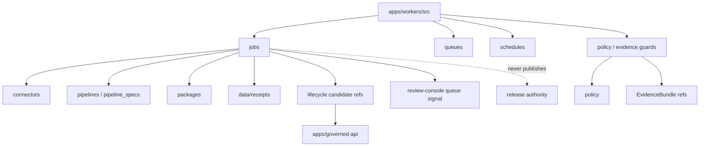

<!-- [KFM_META_BLOCK_V2]
doc_id: kfm://app/workers/src/readme
title: Workers Source README
type: app-readme
version: v0.1
status: draft
owners: OWNER_TBD — Worker steward · Pipeline steward · Source steward · Evidence steward · Policy steward · Release steward · Docs steward
created: 2026-06-16
updated: 2026-06-16
policy_label: public
related:
  - ../README.md
  - ../../README.md
  - ../../governed-api/README.md
  - ../../cli/README.md
  - ../../review-console/README.md
  - ../../../connectors/README.md
  - ../../../pipelines/README.md
  - ../../../pipeline_specs/README.md
  - ../../../packages/README.md
  - ../../../policy/README.md
  - ../../../schemas/contracts/v1/
  - ../../../contracts/
  - ../../../data/README.md
  - ../../../release/README.md
  - ../../../runtime/README.md
  - ../../../infra/README.md
tags: [kfm, apps, workers, src, worker-source, background-jobs, receipts, candidates, lifecycle, watcher-non-publisher]
notes:
  - "Replaces an empty workers source README with a bounded app-local source-tree contract."
  - "This source tree may hold worker implementation source, but it must not become connector authority, pipeline authority, schema authority, policy authority, lifecycle storage, release authority, proof storage, public API authority, or runtime adapter authority."
  - "Source files, job definitions, schedules, queues, tests, fixtures, receipt outputs, deployment state, logs, dashboards, and CI pass state remain NEEDS VERIFICATION."
[/KFM_META_BLOCK_V2] -->

<a id="top"></a>

<div align="center">

# Workers Source

`apps/workers/src/`

**App-local implementation source boundary for KFM background workers: job runners, queue consumers, schedules, idempotency guards, governed pipeline/package composition, receipt emission, candidate signal generation, safe retry behavior, and non-publishing worker enforcement.**


[Purpose](#1-purpose) · [Repo fit](#2-repo-fit) · [Boundary](#3-authority-boundary) · [Inputs](#5-inputs) · [Exclusions](#6-exclusions) · [Source map](#7-source-family-map) · [Definition of done](#14-definition-of-done)

</div>

---

> [!IMPORTANT]
> **Status:** draft / `NEEDS VERIFICATION`  
> **Owners:** `OWNER_TBD` — Worker steward · Pipeline steward · Source steward · Evidence steward · Policy steward · Release steward · Docs steward  
> **Path:** `apps/workers/src/README.md`  
> **Responsibility root:** `apps/` — deployable application surfaces  
> **Truth posture:** CONFIRMED README path / CONFIRMED Workers app boundary / PROPOSED worker source-tree contract / UNKNOWN source files, job definitions, schedulers, queues, tests, fixtures, receipt outputs, runtime behavior, deployment state, and CI pass state

> [!CAUTION]
> Worker source is not a connector root, pipeline root, schema/contract/policy root, lifecycle store, release authority, proof store, public API, public UI, or runtime adapter home. It may compose those systems through governed boundaries, but it must not publish, rewrite canonical records, or bypass review/release gates.

---

## 1. Purpose

`apps/workers/src/` is the proposed source boundary for the Workers deployable.

It may eventually contain app-local implementation source for:

- worker entry points and job runners;
- queue consumers and schedule handlers;
- idempotency, retry, backoff, and safe-disable logic;
- source-refresh orchestration that calls connector-owned code;
- pipeline/package composition for validation, normalization support, catalog support, tile/index build support, and receipt emission;
- policy and evidence prechecks before material outputs;
- lifecycle-candidate and review-queue signal emission;
- job-run receipt and audit/provenance reference capture;
- app-local tests and fixtures where appropriate;
- safe error rendering and no-internal-detail behavior.

This README does not prove any source file, worker job, queue, scheduler, API client, receipt writer, validator, builder, fixture, test, deployment, log, dashboard, or CI pass state exists.

[Back to top](#top)

---

## 2. Repo fit

| Concern | Owning root | Expected relationship |
|---|---|---|
| Workers source | `apps/workers/src/` | App-local implementation source, if implemented |
| Workers app | `apps/workers/` | Background deployable boundary |
| Apps root | `apps/` | Deployable application boundary |
| Governed API | `apps/governed-api/` | Public trust membrane and elevated audited API path |
| CLI | `apps/cli/` | Operator-triggered validation, dry runs, reports |
| Review Console | `apps/review-console/` | Human review queue and decision surface |
| Connectors | `connectors/` | Source-specific fetching/admission connectors |
| Pipelines | `pipelines/`, `pipeline_specs/` | Pipeline logic and declarative pipeline definitions |
| Shared packages | `packages/` | Reusable implementation libraries |
| Policy | `policy/` | Admissibility, sensitivity, rights, review, release, and decision policy |
| Lifecycle artifacts | `data/` | Lifecycle states, receipts, proofs, registries, catalog, triplets, published outputs |
| Release authority | `release/` | Publication, correction, rollback, release manifest authority |
| Runtime adapters | `runtime/` | Runtime/model adapters behind governed API |
| Infra | `infra/` | Deployment, least privilege, audit, scheduling, process isolation |

## 3. Authority boundary

This source tree may implement worker jobs. It does not own source connectors, pipeline specs, reusable pipeline libraries, schemas, contracts, policy, lifecycle storage, release decisions, publication, rollback approval, correction approval, EvidenceBundle truth, public API behavior, public UI behavior, canonical store mutation outside approved flows, runtime/model adapters, deployment configuration, logs, or dashboards.

```text
apps/workers/src/      = app-local worker implementation source
apps/workers/          = deployable background-worker boundary
apps/governed-api/     = public trust membrane and governed API path
apps/review-console/   = human review and decision surface
apps/cli/              = operator command surface
connectors/            = source-specific fetch/admit code
pipelines/             = executable pipeline logic
pipeline_specs/        = declarative pipeline definitions
packages/              = reusable libraries
policy/                = admissibility and decision policy
data/                  = lifecycle artifacts, receipts, proofs, registries
release/               = publication, correction, rollback authority
runtime/               = adapters behind governed API
infra/                 = deployment and process controls
```

## 4. Default posture

Worker source should fail closed. A source module should not emit candidate records, receipts, derived artifacts, routing signals, cache outputs, or build outputs when any of these are unresolved:

- source identity, source role, rights, cadence, and integrity hash;
- job trigger authenticity, schedule/queue ownership, and idempotency key;
- input lifecycle phase and job eligibility;
- schema, contract, validator, and fixture availability;
- policy decision, sensitivity, redaction/generalization, and rights posture;
- EvidenceRef and EvidenceBundle support where claims depend on evidence;
- deterministic identity and transform receipt requirements;
- output lifecycle home, receipt home, and owning steward;
- review state, release state, correction state, rollback state, and stale-state impacts;
- retry, resume, safe-disable, and rollback behavior;
- audit/provenance and job-run receipt write target;
- safe error behavior and no raw/internal detail leakage.

## 5. Inputs

| Input family | Examples | Required posture |
|---|---|---|
| Job trigger | schedule, queue message, operator request, source-change signal | Audited and idempotent |
| Job context | job id, run id, idempotency key, retry count, worker identity | Durable and traceable |
| Source descriptor | source id, source role, rights, cadence, hash, policy label | Cataloged and validated before material use |
| Lifecycle item | RAW/WORK/QUARANTINE/PROCESSED/CATALOG candidate refs | Correct phase and eligibility required |
| Pipeline spec | transform name, validator name, output target, receipt target | Versioned and reviewable |
| Policy state | PolicyDecision, sensitivity label, redaction profile, release constraints | Policy-runtime derived |
| Evidence state | EvidenceRef, EvidenceBundle refs, proof context | Resolver-backed where material |
| Output refs | receipt path, candidate path, tile/index/report path, queue signal | Correct lifecycle root required |

## 6. Exclusions

| Does not belong here | Correct home |
|---|---|
| Source-specific connector implementation | `connectors/` |
| Reusable pipeline logic | `pipelines/` or `packages/` |
| Declarative pipeline definitions | `pipeline_specs/` |
| Shared libraries and reusable helpers | `packages/` |
| Schemas and contracts | `schemas/contracts/v1/`, `contracts/` |
| Policy rules and access decisions | `policy/` |
| Lifecycle data and canonical stores | `data/` |
| Receipts, proofs, registry, catalog, triplets, published outputs | `data/` |
| Release manifests, correction notices, rollback cards | `release/` |
| Public or semi-public API surface | `apps/governed-api/` |
| Public UI or map rendering | `apps/explorer-web/` |
| Review decisions and manual adjudication | `apps/review-console/` |
| One-off scripts | `scripts/` unless promoted through governance |
| Repo-wide validators/generators/builders | `tools/` |
| Direct model/runtime public access | `runtime/` behind governed API only |
| Deployment-only values | Deployment environment/config channels |

## 7. Source family map

Exact implementation files remain `NEEDS VERIFICATION`.

| Candidate source family | Purpose | Required safeguard | Status |
|---|---|---|---|
| `worker_app` | Worker boot, lifecycle, dependency wiring | App-local source only | PROPOSED |
| `jobs/` | Worker job implementations | Job contract and tests required | PROPOSED |
| `queues/` | Queue consumers and message handlers | Idempotency and safe retry | PROPOSED |
| `schedules/` | Scheduled job registration | Audited trigger ownership | PROPOSED |
| `receipt_emitters/` | Receipt-writing helpers | Correct data root and durable refs | PROPOSED |
| `candidate_emitters/` | Candidate/routing-signal writers | No publication authority | PROPOSED |
| `policy_guards/` | Worker-side precheck wrappers | Policy-derived and fail-closed | PROPOSED |
| `idempotency/` | Run keys, dedupe, resume support | No duplicate authoritative output | PROPOSED |
| `safe_errors/` | Failure, retry, and safe log shaping | No internal detail leakage | PROPOSED |
| `test_fixtures/` | App-local fixture support | No real sensitive payloads | PROPOSED |

> [!WARNING]
> Candidate source-family names are not implementation proof. Do not claim a worker source module is live until files, schedules, queues, tests, fixtures, policy gates, receipt outputs, and deployment evidence confirm it.

## 8. Diagram



## 9. Source obligations

| Obligation | Example effect |
|---|---|
| `watcher_non_publisher` | Source code emits receipts and candidates, not published releases |
| `governed_composition_only` | Worker code composes connectors/pipelines/packages without becoming their authority root |
| `idempotent_jobs` | Re-running a job should not duplicate authoritative records |
| `least_privilege_runtime` | Worker can access only required inputs and output targets |
| `source_role_preserved` | Source role is carried forward and not upcast by worker convenience |
| `policy_required` | Policy and sensitivity gates run before material output |
| `evidence_required` | Claim-bearing outputs carry EvidenceRef/EvidenceBundle support |
| `receipt_required` | Material transforms, validations, and emissions produce receipts |
| `derived_stays_derived` | Tiles, caches, indexes, and reports do not replace canonical truth |
| `safe_error_only` | Failures reveal no protected data, raw payloads, internal paths, or validator internals |

## 10. Child README contract

Each child source directory or durable job module should state:

- source purpose and owner;
- trigger type and schedule/queue ownership;
- accepted input refs and lifecycle phase;
- denied inputs and correct homes;
- schemas/contracts and validators used;
- policy and sensitivity dependencies;
- EvidenceBundle dependency where material;
- output refs and receipt types emitted;
- idempotency key, retry posture, and safe-disable path;
- tests and fixtures required;
- open verification items.

## 11. Inspection path

Worker source files, job definitions, schedulers, queues, schemas, tests, fixtures, policy integration, receipt outputs, deployment state, logs, dashboards, and emitted artifacts remain `NEEDS VERIFICATION`.

```bash
find apps/workers/src -maxdepth 7 -type f | sort
find apps/workers connectors pipelines pipeline_specs packages policy schemas contracts data release infra tests fixtures -maxdepth 7 -type f 2>/dev/null | grep -Ei 'worker|job|queue|schedule|receipt|ValidationReport|TransformReceipt|PolicyDecision|EvidenceRef|EvidenceBundle|ReleaseManifest|CorrectionNotice|RollbackCard|catalog|tile|ingest|normalize|validate|publish|stale|idempot|retry|test|fixture' | sort
```

## 12. Validation expectations

Useful validation for this source tree should cover:

- worker jobs are idempotent and safe to retry;
- workers fail closed on missing schema, policy, evidence, source role, rights, validator, output target, or receipt target;
- material transforms and validations emit receipts;
- source code does not write directly to `data/published/`, issue ReleaseManifest records, mutate release records, or rewrite canonical/catalog records outside approved flows;
- candidate records and review queue signals remain candidates, not decisions;
- derived tiles/caches/indexes/reports remain derived and policy-bounded;
- failures and logs do not expose raw payloads, protected detail, internal paths, or deployment-only values;
- deployment runs with least privilege and audit-friendly run ids.

## 13. Safe change pattern

For Workers source changes:

1. Add or update source/job inventory.
2. Link worker inputs/outputs to schemas/contracts before changing shapes.
3. Add fixtures for valid run, missing schema, missing policy, missing evidence, rights denial, sensitivity hold, stale source, retry, duplicate idempotency key, safe error, and output receipt cases.
4. Add no-publish, no-direct-canonical-rewrite, idempotency, retry, policy, evidence, receipt, and safe-error tests before enabling jobs.
5. Preserve EvidenceRef/EvidenceBundle refs, PolicyDecision refs, source role, lifecycle state, receipt refs, release/correction/rollback refs, job ids, reason codes, timestamps, and limitations through every material output.
6. Update this README, parent Workers README, worker job docs, pipeline docs, governed API/review-console docs, policy docs, schemas/contracts, and tests when behavior materially changes.

## 14. Definition of done

- [ ] Owners are confirmed and `OWNER_TBD` is replaced.
- [ ] Worker source/job inventory and ownership are documented.
- [ ] Job input/output DTOs and schemas are verified.
- [ ] Schedulers, queues, triggers, retries, and idempotency keys are documented and tested.
- [ ] Policy runtime, evidence resolver, source-role handling, receipt emission, and safe-error behavior are documented and tested.
- [ ] Worker source cannot publish, issue release decisions, rewrite canonical/catalog records, or mutate release records outside approved flows.
- [ ] Receipts are emitted for material transforms and validations.
- [ ] Review queue signals are candidates only and require human/governed decision paths.
- [ ] Sensitive-domain and rights-denial tests are present and passing.
- [ ] Deployment, logs, dashboards, and runbooks are documented with current evidence.

## 15. Open verification items

| Item | Why it matters |
|---|---|
| Confirm source files beyond README | Prevents overclaiming implementation maturity |
| Confirm job/schedule/queue inventory | Required before operational claims |
| Confirm connector/pipeline/package dependencies | Required before boundary claims |
| Confirm schemas, contracts, and validators | Required before shape and validation claims |
| Confirm policy and evidence integration | Required before governed-output claims |
| Confirm receipt paths and output targets | Required before lifecycle claims |
| Confirm no-publish and no-canonical-rewrite tests | Required before trust claims |
| Confirm deployment, least privilege, logs, and dashboards | Required before operational maturity claims |
| Confirm review-console and governed-api handoffs | Required before queue/routing claims |
| Confirm retry/idempotency behavior | Required before safe automation claims |

<details>
<summary>Appendix A — no-loss preservation note</summary>

The previous README was empty. This replacement adds a bounded worker source-tree contract without claiming source files, jobs, schedules, queues, schemas, tests, fixtures, receipt outputs, deployment, logs, dashboards, or CI pass state are implemented.

</details>

## Status summary

`apps/workers/src/` should contain Workers implementation source only after source inventory, job inventory, schedule/queue definitions, schemas, policy runtime integration, evidence resolver integration, receipt emission, review/governed-API handoffs, tests, and operational evidence are verified.

It must preserve the source boundary: worker source may implement background jobs, emit receipts, and create candidate signals, but it must not publish artifacts, bypass review/release gates, rewrite canonical records, become the public trust path, or substitute automation for governed promotion, correction, rollback, and review decisions.

<p align="right"><a href="#top">Back to top</a></p>
