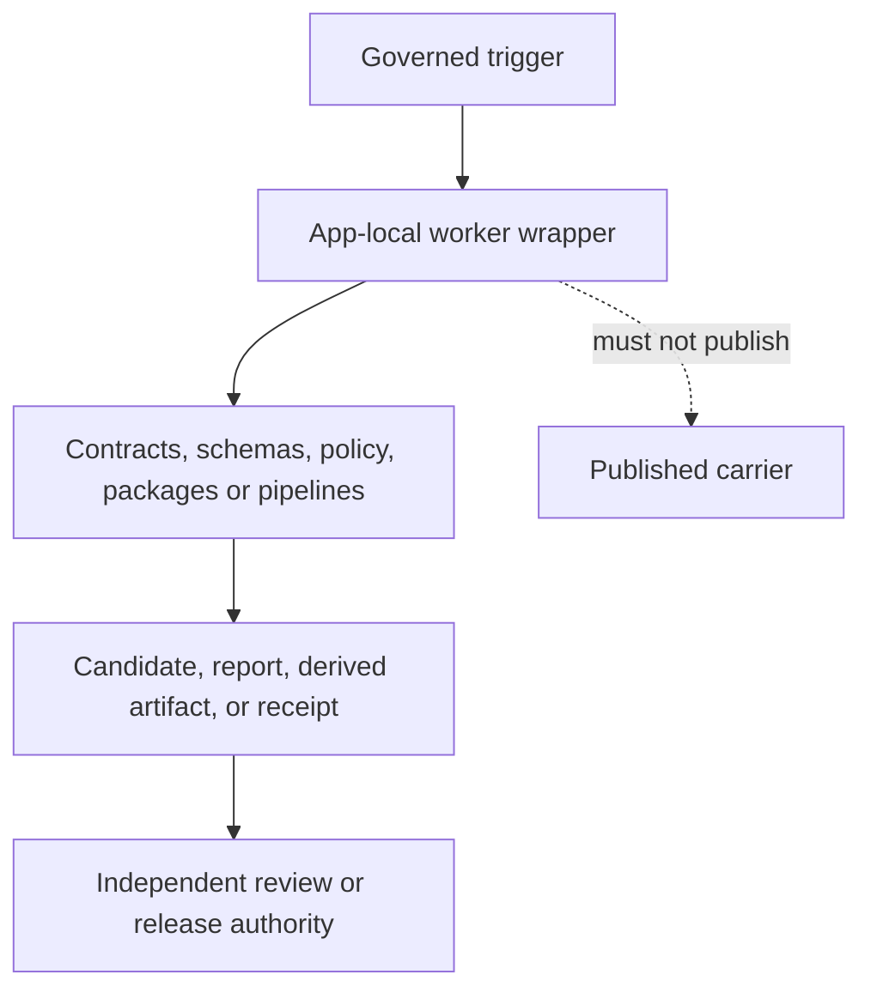

<!-- [KFM_META_BLOCK_V2]
doc_id: kfm://app/workers/src/readme
title: Workers Source README
type: app-readme
subtype: source-boundary-readme
version: v0.2
prior_version: v0.1
status: draft; repository-grounded; placeholder-only
owner: "NEEDS VERIFICATION — CODEOWNERS routes default repository review to @bartytime4life; no accepted worker-steward assignment, required independent-review rule, or release authority was verified"
created: 2026-06-16
updated: 2026-08-12
policy_label: public
current_path: apps/workers/src/README.md
owning_root: apps/
responsibility: orient contributors to the app-local worker source boundary, its eight placeholder lanes, non-publisher invariant, implementation admission requirements, validation, correction, and rollback
truth_posture: cite-or-abstain
truth_labels: [CONFIRMED, PROPOSED, UNKNOWN, NEEDS VERIFICATION]
authority_class: inherited app-local source boundary
authority_rank: implementation orientation subordinate to adopted doctrine, accepted ADRs, contracts, schemas, policy, evidence, lifecycle records, and release records
canonical_relationship: same-path update; no generated or sibling authority created
evidence_repository: bartytime4life/Kansas-Frontier-Matrix
evidence_base_ref: main
evidence_base_commit: d8906887f626614d16ec7b39d8c422c13a0c21f9
evidence_source_tree: 746351de055f859e607d22e267201e46ecb69e94
evidence_workers_tree: e46345c92af8400a76b03149dbf9338a53b1fb7d
evidence_target_prior_blob: 420eed44aef61a4d7b9f9d89c057a3df84ba0a0e
evidence_parent_readme_blob: 5b73c596786e5f5231579264ee5f31ee77427c75
evidence_apps_readme_blob: 6cd825905976b2b662e43497203206305cb78827
evidence_directory_rules_blob: fd49a0b83e55cef52c1124281f093e263526898d
evidence_directory_rules_adoption: ADR-0029; accepted
evidence_root_registry_blob: 024f668b5f0a9239bafa4f8b09e2afd86300ff8c
evidence_codeowners_blob: dd2a84aa514d8ecd9208bc347f90f9a2ed37dd61
evidence_direct_worker_lanes: 8
evidence_tracked_source_files: 17
evidence_executable_python_lines: 0
related:
  - ../README.md
  - ../../README.md
  - ../../governed-api/README.md
  - ../../review-console/README.md
  - ./ai_focus_worker/README.md
  - ./catalog_worker/README.md
  - ./correction_worker/README.md
  - ./ingest_worker/README.md
  - ./quarantine_review_worker/README.md
  - ./receipt_worker/README.md
  - ./tile_worker/README.md
  - ./validate_worker/README.md
  - ../../../docs/doctrine/directory-rules.md
  - ../../../docs/adr/ADR-0029-adopt-directory-governance-standard-v2.md
  - ../../../control_plane/root_registry.yaml
  - ../../../connectors/README.md
  - ../../../pipelines/README.md
  - ../../../pipeline_specs/README.md
  - ../../../packages/README.md
  - ../../../contracts/README.md
  - ../../../schemas/README.md
  - ../../../policy/README.md
  - ../../../data/README.md
  - ../../../release/README.md
  - ../../../runtime/README.md
  - ../../../infra/README.md
  - ../../../tests/README.md
tags: [kfm, apps, workers, worker-source, placeholder, background-jobs, non-publisher, receipts, candidates, lifecycle]
notes:
  - "v0.2 replaces the speculative empty-tree posture with a current repository inventory: eight documented worker lanes, each with one comment-only Python placeholder."
  - "This boundary may eventually hold app-local worker entry points and deployable composition, but it does not own connectors, pipelines, shared libraries, contracts, schemas, policy, lifecycle data, receipts, proofs, release decisions, publication, runtime adapters, or infrastructure."
  - "No worker implementation, trigger, queue, schedule, package manifest, test suite, deployment binding, runtime behavior, or receipt emission is claimed by this documentation-only update."
[/KFM_META_BLOCK_V2] -->

<a id="top"></a>

<div align="center">

# Workers Source

`apps/workers/src/`

**Repository-grounded boundary for KFM worker entry points and deployable composition. The current tree contains eight documented worker lanes whose Python entrypoints are comment-only placeholders; no worker executes from this source at the pinned evidence base.**

[](#2-repo-fit)
[](#3-authority-boundary)
[](#9-source-obligations)
[](../../../docs/adr/ADR-0029-adopt-directory-governance-standard-v2.md)
[](#11-inspection-path)
[](#15-open-verification-items)

**Quick navigation:** [Purpose](#1-purpose) · [Repo fit](#2-repo-fit) · [Authority](#3-authority-boundary) · [Posture](#4-default-posture) · [Inputs](#5-inputs) · [Exclusions](#6-exclusions) · [Source map](#7-source-family-map) · [Flow](#8-required-implementation-flow) · [Obligations](#9-source-obligations) · [Child contract](#10-child-readme-contract) · [Evidence](#11-inspection-path) · [Validation](#12-validation-expectations) · [Change pattern](#13-safe-change-pattern) · [Done](#14-definition-of-done) · [Gaps](#15-open-verification-items) · [Rollback](#17-correction-and-rollback)

</div>

> [!IMPORTANT]
> **Current state:** `CONFIRMED / PLACEHOLDER-ONLY`. At `main@d8906887f626614d16ec7b39d8c422c13a0c21f9`, this source tree has 17 tracked files: this README plus eight child READMEs and eight one-line `main.py` files. Every `main.py` contains only a greenfield-placeholder comment, for zero non-comment executable Python lines.

> [!CAUTION]
> A worker is a non-publisher. Worker code may eventually emit governed candidates, process-memory records, and receipts through declared interfaces, but it must not approve review, promotion, release, correction, withdrawal, rollback, or publication; write a public or canonical carrier as authority; or become an alternate public API.

> [!NOTE]
> The child READMEs describe draft boundaries and future admission requirements. Their presence does not make their proposed jobs, modules, queues, schedules, schemas, tests, outputs, or deployment behavior current implementation.

---

## 1. Purpose

`apps/workers/src/` inherits the [`apps/workers/`](../README.md) deployable boundary. When an implementation is admitted, this directory may own only the app-local worker entry point, dependency wiring, process lifecycle, and narrow translation between a governed trigger and reusable implementation owned elsewhere.

The current source boundary is intentionally inert. It contains named placeholders for AI Focus, catalog, correction, ingest, quarantine review, receipt, tile, and validation workers. It contains no executable job body, Python package marker, package manifest, queue consumer, schedule registration, command-line entry point, network client, schema binding, policy client, receipt writer, worker test, or deploy configuration.

This README therefore serves three purposes:

1. record the exact repository state without promoting scaffolding into implementation;
2. preserve the `apps/` responsibility and non-publisher boundary for future work; and
3. define the minimum evidence, validation, review, correction, and rollback required before any child lane can claim executable maturity.

[Back to top](#top)

---

## 2. Repo fit

Accepted Directory Rules classifies `apps/` as the canonical home for deployable processes and user-facing service boundaries. It also requires an app wrapper to delegate shared logic, source acquisition, lifecycle transformation, declarative run graphs, runtime adapters, and deployment controls to their owning roots.

### Current evidence boundary

| Claim | Truth | Repository evidence | Limitation |
|---|---|---|---|
| `apps/workers/src/` has eight direct worker lanes plus this README. | CONFIRMED | Source tree `746351de055f859e607d22e267201e46ecb69e94` | Directory presence does not prove runnable behavior. |
| Each worker lane contains a draft README and one `main.py`. | CONFIRMED | Current child trees and 17-file inventory | Documentation is not executable evidence. |
| All eight `main.py` files are one-line comments labeled greenfield placeholders. | CONFIRMED | Current blobs listed in the [evidence ledger](#evidence-ledger) | A placeholder filename is not a Python entry point. |
| The eight entrypoints contain no imports, functions, classes, statements, or side effects. | CONFIRMED | Zero non-comment executable Python lines | Future branches or external systems are outside this snapshot. |
| No package manifest, queue, schedule, trigger binding, worker-local test suite, or deploy binding exists under `apps/workers/`. | CONFIRMED | Complete tracked `apps/workers/` inventory at the pinned base | External infrastructure not represented in the repository remains UNKNOWN. |
| The worker source is deployed, scheduled, monitored, or operational. | UNKNOWN | No admissible runtime, infrastructure, log, dashboard, or observed-run evidence was verified | Requires operational evidence at an exact deployed revision. |
| `@bartytime4life` is the GitHub review route for this path. | CONFIRMED | Default rule in `.github/CODEOWNERS` | CODEOWNERS is not stewardship, approval, separation of duties, or release authority. |

### Responsibility relationships

| Concern | Owning root | Relationship to worker source |
|---|---|---|
| Deployable worker wrapper | `apps/workers/src/` | App-local entry point and process composition only |
| Shared worker logic | `packages/` | Reusable, independently testable implementation |
| Source fetch and admission | `connectors/` | Source-specific acquisition; never reimplemented here |
| Lifecycle transformation | `pipelines/` | Executable transform and orchestration authority |
| Run graph and schedule declaration | `pipeline_specs/` | Declarative inputs, outputs, schedules, and resource envelopes |
| Meaning and machine shape | `contracts/`, `schemas/` | Consumed by workers; not authored here |
| Allow, deny, hold, restrict, abstain | `policy/` | Evaluated through governed interfaces; not invented locally |
| Lifecycle and accountability instances | `data/` | Candidate, receipt, proof, registry, catalog, triplet, and carrier homes |
| Release and correction decisions | `release/` | Independent decision plane; workers provide inputs only |
| Provider and model composition | `runtime/` | Bounded adapters; no direct public worker path |
| Deployment and exposure | `infra/` | Service identity, scheduling infrastructure, network, secrets, and hardening |
| Human adjudication | `apps/review-console/` | Review surface; a worker may route a candidate but cannot decide it |
| Public response surface | `apps/governed-api/` | Normal public trust membrane; workers do not speak to ordinary clients |

## 3. Authority boundary

This source tree may eventually own the deployable wrapper for a background process. It does not gain the authority of any dependency it calls or any record it helps produce.

### Belongs here

- a narrow worker process entry point;
- app-local dependency composition and lifecycle hooks;
- queue or schedule adapters after their external contracts are accepted and bound;
- app-local configuration parsing for non-secret references;
- graceful startup, shutdown, health, retry, and safe-disable wiring;
- app-local tests that prove the wrapper delegates correctly and fails closed;
- bounded error-to-terminal-state translation without protected-detail reflection.

### Does not become worker authority

- source identity, capture, or admission;
- reusable domain or pipeline behavior;
- contract meaning, schema shape, or policy rules;
- EvidenceBundle truth, citation truth, or source-role elevation;
- lifecycle data ownership or canonical-store mutation by convention;
- human review, promotion, release, correction, withdrawal, rollback, or publication decisions;
- public API, browser UI, direct model access, or a public data path;
- deployment topology, credentials, private endpoints, or secret material;
- proof that a job ran merely because a workflow, test, log line, badge, commit, or pull request exists.

Directory placement controls ownership; it does not grant runtime capability. Any durable write requires an explicit contract, policy decision, authenticated service identity, allowed target, receipt behavior, negative tests, and rollback path.

## 4. Default posture

The current placeholders are inert by construction. A future implementation must remain fail-closed and must not start material work until all applicable prerequisites are resolved:

- authenticated producer, trigger type, queue or schedule owner, and activation state;
- stable job, run, attempt, and idempotency identities;
- accepted input contract and schema, bounded payload, content identity, and lifecycle eligibility;
- source identity, source role, provenance, rights, cadence, freshness, and integrity where applicable;
- policy, sensitivity, consent, redaction, generalization, access, and harmful-precision posture;
- EvidenceRef resolution to admissible EvidenceBundle support where a result depends on evidence;
- declared dependency versions, deterministic transform behavior, and no hidden network or time reliance;
- permitted output family, owning root, writer capability, retention, and receipt target;
- finite terminal states, retry budget, dead-letter or hold behavior, safe-disable path, and operator escalation;
- correction, supersession, stale-state, cache-invalidation, and rollback consequences;
- logs and metrics that exclude secrets, raw payloads, protected geometry, prompts, evidence bodies, internal paths, and private endpoints.

Missing or contradictory prerequisites must end in a declared hold, abstention, denial, no-op, or safe error appropriate to the governing contract. They must not be converted into guessed data, silent success, partial publication, or an unreceipted side effect.

## 5. Inputs

### Current inputs and outputs

| Surface | Current state | Truth |
|---|---|---|
| CLI arguments | None implemented | CONFIRMED |
| Imported Python APIs | None implemented | CONFIRMED |
| Queue messages | No consumer or message binding present | CONFIRMED |
| Schedules or event triggers | No registration present under `apps/workers/` | CONFIRMED |
| Environment variables or secret references | None read by the placeholders | CONFIRMED |
| Filesystem, database, object-store, API, or model inputs | No code path present | CONFIRMED |
| Candidate, report, tile, catalog, correction, or review outputs | None emitted | CONFIRMED |
| Receipts, proofs, logs, metrics, or release records | None emitted by this source | CONFIRMED |

### Required input declaration for a future worker

| Input family | Required declaration |
|---|---|
| Trigger | Authorized producer, message/event contract, activation state, replay posture |
| Job context | Stable job/run/attempt IDs, idempotency key, retry count, deadline |
| Data or evidence reference | Owning root, lifecycle state, digest, source role, rights, sensitivity, freshness |
| Contract and schema | Exact IDs and versions; closed validation behavior |
| Policy state | Decision reference, obligations, redaction/generalization profile, reason codes |
| Configuration | Non-secret profile plus external secret references; no committed values |
| Output capability | Exact object family, target interface, permitted writer, receipt and rollback behavior |

An implementation must consume references or bounded payloads through declared interfaces. It must not infer authority from a path string or read internal stores merely because the process runs under `apps/`.

## 6. Exclusions

| Does not belong here | Canonical home | Boundary reason |
|---|---|---|
| Source-specific fetch, capture, or admission | `connectors/` | Acquisition is source-owned, not app-owned. |
| Reusable lifecycle or domain logic | `pipelines/` or `packages/` | Deployable wrappers must stay thin. |
| Declarative schedules and run graphs | `pipeline_specs/` | A specification must remain distinct from execution. |
| Shared library code | `packages/` | Reuse must not be hidden inside one deployable. |
| Semantic contracts and JSON Schemas | `contracts/`, `schemas/` | Meaning and shape are separate authorities. |
| Normative policy or access rules | `policy/` | Workers apply decisions; they do not define them. |
| RAW, WORK, QUARANTINE, PROCESSED, catalog, triplet, or published objects | `data/` | Lifecycle instances never live in app source. |
| Receipts, proofs, registries, and release-approved carriers | Governed `data/` lanes | Accountability and delivery objects require their own homes. |
| Release manifests, decisions, corrections, withdrawals, and rollback cards | `release/` | Worker output cannot self-authorize publication or correction. |
| Public or semi-public API handlers | `apps/governed-api/` | The Governed API remains the normal public trust membrane. |
| Human review and adjudication | `apps/review-console/` | Routing a candidate is not deciding it. |
| Runtime/model adapter implementation | `runtime/` | Provider details remain behind bounded adapters. |
| Deployment, network, host, schedule infrastructure, and actual secrets | `infra/` and external secret stores | Source code is not an infrastructure or secret authority. |
| Repository-wide validators, generators, builders, or operators | `tools/` | Repo-wide tooling is not a deployable worker. |
| Test fixtures used by multiple lanes | `fixtures/` | Reusable fixtures remain synthetic and public-safe. |

## 7. Source family map

The tree below is a **CONFIRMED current direct-child map**. It is not a proposed module tree.

```text
apps/workers/src/
├── README.md                    # this repository-grounded boundary
├── ai_focus_worker/             # draft contract; comment-only entrypoint
├── catalog_worker/              # draft contract; comment-only entrypoint
├── correction_worker/           # draft contract; comment-only entrypoint
├── ingest_worker/               # draft contract; comment-only entrypoint
├── quarantine_review_worker/    # draft contract; comment-only entrypoint
├── receipt_worker/              # draft contract; comment-only entrypoint
├── tile_worker/                 # draft contract; comment-only entrypoint
└── validate_worker/             # draft contract; comment-only entrypoint
```

| Lane | Documented intent | Current executable state | Required authority guard |
|---|---|---|---|
| [`ai_focus_worker/`](./ai_focus_worker/README.md) | Asynchronous governed Focus support | [`main.py`](./ai_focus_worker/main.py) is a one-line placeholder | No browser-to-model route, unsupported answer, or EvidenceBundle substitution |
| [`catalog_worker/`](./catalog_worker/README.md) | Catalog and triplet candidate support | [`main.py`](./catalog_worker/main.py) is a one-line placeholder | Derived candidates never become canonical truth or publication |
| [`correction_worker/`](./correction_worker/README.md) | Correction-processing support | [`main.py`](./correction_worker/main.py) is a one-line placeholder | No correction, withdrawal, rollback, or release decision authority |
| [`ingest_worker/`](./ingest_worker/README.md) | Ingest-adjacent job support | [`main.py`](./ingest_worker/main.py) is a one-line placeholder | No source admission, rights bypass, or silent lifecycle promotion |
| [`quarantine_review_worker/`](./quarantine_review_worker/README.md) | Quarantine review-candidate routing | [`main.py`](./quarantine_review_worker/main.py) is a one-line placeholder | No human-review substitution, quarantine exit decision, or promotion |
| [`receipt_worker/`](./receipt_worker/README.md) | Receipt-emission support | [`main.py`](./receipt_worker/main.py) is a one-line placeholder | No receipt-schema authority, fabricated execution evidence, or release inference |
| [`tile_worker/`](./tile_worker/README.md) | Derived tile candidate build support | [`main.py`](./tile_worker/main.py) is a one-line placeholder | No harmful precision, direct publish, or derived-as-truth collapse |
| [`validate_worker/`](./validate_worker/README.md) | Validation-job support | [`main.py`](./validate_worker/main.py) is a one-line placeholder | Passing validation never equals review, release, or publication approval |

The documented intents come from the child READMEs and remain `PROPOSED`. The placeholder state comes from current source bytes and is `CONFIRMED`.

<a id="8-diagram"></a>

## 8. Required implementation flow

The following is the required responsibility flow for a future worker slice. It is not a claim that a current worker runs.


```mermaid
flowchart TD
    trigger["Governed trigger"] --> wrapper["App-local worker wrapper"]
    wrapper --> dependencies["Contracts, schemas, policy, packages or pipelines"]
    dependencies --> output["Candidate, report, derived artifact, or receipt"]
    output --> decision["Independent review or release authority"]
    wrapper -. "must not publish" .-> published["Published carrier"]
```

The wrapper may coordinate work only through approved dependencies and capabilities. A trigger, successful job, candidate, receipt, or passing validation does not itself authorize the independent decision or published carrier.

## 9. Source obligations

| Obligation | Required effect |
|---|---|
| `placeholder_honesty` | Comments, filenames, READMEs, diagrams, and tests are not described as deployed behavior. |
| `watcher_non_publisher` | Workers emit bounded candidates or receipts only; they never approve or publish. |
| `governed_composition_only` | App source composes owned dependencies without copying their authority into the app. |
| `source_role_preserved` | A worker cannot upcast a source from context, corroboration, or lead to authority. |
| `policy_and_evidence_required` | Consequential outputs require applicable policy and resolvable evidence support. |
| `deterministic_identity` | Job, attempt, input, output, and receipt identities are stable and replay-aware where practical. |
| `idempotent_side_effects` | Retries do not duplicate or silently overwrite authoritative objects. |
| `least_privilege` | Runtime identity can read and write only declared interfaces and targets. |
| `receipt_not_proof_by_assertion` | Receipts record process memory; they do not prove source truth, review, release, or publication alone. |
| `derived_stays_derived` | Tiles, caches, indexes, reports, catalogs, and generated language remain subordinate carriers. |
| `safe_failure` | Errors expose no secret, raw payload, protected location, prompt, evidence body, internal path, or private endpoint. |
| `correction_and_rollback` | Stale, superseded, corrected, withdrawn, and failed outputs retain traceable disposition and recovery. |

## 10. Child README contract

Each durable child worker boundary must record, from current evidence:

- purpose, inherited parent, current maturity, local review route, and any unresolved steward assignment;
- exact entry point and package/deployment identity;
- authorized trigger producer, queue or schedule owner, activation and deactivation state;
- accepted input references, lifecycle phases, denied inputs, and correct homes;
- contract, schema, policy, evidence, source-role, rights, sensitivity, and configuration dependencies;
- exact output object families, target interfaces, permitted writer, retention, and receipt behavior;
- deterministic job/run/attempt/idempotency identities;
- retry, timeout, dead-letter or hold, resume, safe-disable, and escalation behavior;
- positive, negative, replay, duplicate, stale, correction, no-publish, no-leak, and rollback tests;
- network classification and synthetic fixture posture;
- observability fields and prohibited log content;
- deployment and operational evidence, clearly separated from repository evidence;
- known limitations and the next concrete verification step.

The existing child READMEs are draft design contracts. They must be reconciled with actual code and tests in the same implementation slice that replaces a placeholder; documentation alone must not upgrade their status.

<a id="evidence-ledger"></a>

## 11. Inspection path

### Reproduce the current inventory

```bash
git ls-tree -r --name-only HEAD apps/workers/src
find apps/workers/src -mindepth 1 -maxdepth 2 -type f -print | sort
awk 'NF && $1 !~ /^#/ { count++ } END { print count + 0 }' apps/workers/src/*/main.py
rg -n 'apps/workers/src|ai_focus_worker|catalog_worker|correction_worker|ingest_worker|quarantine_review_worker|receipt_worker|tile_worker|validate_worker' \
  --glob '!apps/workers/src/**' .
```

At the pinned base, the first two commands expose the 17-file source inventory, the `awk` command prints `0`, and repository search finds documentation references but no import, schedule, queue, package, or deployment binding to these placeholder entrypoint paths.

### Evidence ledger

| Evidence | Identifier | Supports | Does not support |
|---|---|---|---|
| Current base | `main@d8906887f626614d16ec7b39d8c422c13a0c21f9` | Repository snapshot used for this edition | Future main, deployed state, or external systems |
| Workers source tree | `746351de055f859e607d22e267201e46ecb69e94` | Direct lanes and complete tracked source inventory | Runtime reachability |
| Prior README | blob `420eed44aef61a4d7b9f9d89c057a3df84ba0a0e` | Same-path baseline and no-loss review | Current worker behavior |
| Parent Workers README | blob `5b73c596786e5f5231579264ee5f31ee77427c75` | Inherited deployable and non-publisher boundary | Executable worker maturity |
| Apps root README | blob `6cd825905976b2b662e43497203206305cb78827` | Current root maturity map and governed app boundary | Worker deployment |
| Accepted Directory Rules | blob `fd49a0b83e55cef52c1124281f093e263526898d`; ADR-0029 | `apps/` placement, dependency direction, README profile | Worker correctness or activation |
| Root Registry | blob `024f668b5f0a9239bafa4f8b09e2afd86300ff8c` | Machine projection of `apps/` as a canonical deployable root | New authority or runtime permission |
| CODEOWNERS | blob `dd2a84aa514d8ecd9208bc347f90f9a2ed37dd61` | Default GitHub review route | Stewardship, approval, or separation of duties |
| AI Focus placeholder | blob `7715d01fc585b03dedae7bb535591064bd6d055c` | Comment-only `main.py` | Focus execution or model access |
| Catalog placeholder | blob `be727f309790b3510560fa09ebf7c661141f0189` | Comment-only `main.py` | Catalog or triplet generation |
| Correction placeholder | blob `229bf39b7adc0b6be18e24273c84057b1c601b29` | Comment-only `main.py` | Correction or withdrawal processing |
| Ingest placeholder | blob `c13ad0e8911241da3ea18f8da0f869eea27db58b` | Comment-only `main.py` | Source access or RAW admission |
| Quarantine-review placeholder | blob `eaef2862a7c1038590e5afba8224b52de54c5c96` | Comment-only `main.py` | Review or quarantine exit |
| Receipt placeholder | blob `0a80db14c4eecb130ad5a5f427742a7d793323d1` | Comment-only `main.py` | Receipt emission or validation |
| Tile placeholder | blob `28f3fd3b3327b6398cd514e371f485ed33817001` | Comment-only `main.py` | Tile generation or serving |
| Validate placeholder | blob `d42e8a837b61ba42038d7a4fbc260072e53feea8` | Comment-only `main.py` | Validator execution or report generation |

## 12. Validation expectations

### Documentation-only changes

Run the repository-owned, no-network documentation checks against the changed file and exact feature head:

```bash
git diff --check
python tools/validators/docs/meta-block/check_meta_blocks.py \
  --repo-root . --profile present \
  --registry control_plane/document_registry.yaml \
  --format text apps/workers/src/README.md
python tools/validators/docs/link-check/check_links.py \
  --repo-root . --format text apps/workers/src/README.md
python tools/validators/docs/document-graph/check_document_graph.py \
  --repo-root . --entrypoint apps/workers/src/README.md \
  --registry control_plane/document_registry.yaml \
  --format text apps/workers/src/README.md
python tools/validators/docs/stale-scan/check_stale_docs.py \
  --repo-root . --as-of 2026-08-12 --profile advisory \
  --review-window-days 365 --placeholder-grace-days 90 \
  --format text apps/workers/src/README.md
```

Also run the focused metadata, link-check, document-graph, and stale-scan unit suites when their validator behavior or exact-head workflow parity is material. A green documentation result proves only bounded structure, links, metadata, freshness signals, and diff hygiene. It does not prove a worker is implemented, secure, deployed, activated, observable, policy-complete, release-approved, or public-safe.

### First executable worker slice

A placeholder replacement requires, at minimum:

- a deterministic, no-network unit path with synthetic public-safe fixtures;
- positive behavior plus malformed input, missing contract/schema, policy deny or hold, missing evidence, rights/sensitivity restriction, stale input, duplicate idempotency key, retry exhaustion, safe-disable, no-leak, and no-publish cases as applicable;
- contract/schema/validator agreement and exact output-family checks;
- bounded integration tests for the declared package or pipeline seam;
- static checks preventing direct public, published, release-decision, canonical-store, secret, or model-provider shortcuts;
- replay, receipt, correction, supersession, and rollback evidence proportional to side effects;
- workflow preflight proving the feature branch cannot deploy, release, promote, publish, mutate settings, or expose secrets.

No worker-specific executable test target is currently verified under `apps/workers/`; adding one belongs to the implementation slice that replaces a placeholder.

## 13. Safe change pattern

1. Pin current `main`, the selected child tree, its README, its placeholder blob, and all relevant contracts, schemas, policy, tests, workflows, and open work.
2. Select one worker lane and one observable outcome; do not activate all eight placeholders as a batch.
3. Define the authorized trigger, stable identities, exact inputs, output family, finite failures, side effects, receipt, correction, and rollback before writing job code.
4. Keep the wrapper thin: reusable code in `packages/`, acquisition in `connectors/`, transformations in `pipelines/`, run declarations in `pipeline_specs/`, adapters in `runtime/`, and deployment controls in `infra/`.
5. Add synthetic positive and negative fixtures and tests before claiming executable maturity.
6. Prove the worker cannot publish, self-review, self-release, silently promote, rewrite canonical state, expose protected detail, or treat derived output as truth.
7. Reconcile the child README, this README, parent Workers README, and any directly affected contracts, schemas, policy, pipeline, test, workflow, and runbook in the same dependency-closed slice.
8. Run changed-area and safety validation, inspect the complete diff, and deliver through a feature branch and draft pull request.
9. Keep activation, deployment, source access, release, promotion, publication, and repository settings as separate authorized transitions.

## 14. Definition of done

This directory is not implementation-complete merely because its inventory is documented. A declared worker lane is complete only when all applicable items are evidenced at the proposed head:

- [ ] a verified owner/review route and explicit non-publisher scope;
- [ ] an executable entry point and reproducible package/deployment identity;
- [ ] an authorized, inactive-by-default trigger or an explicitly reviewed activation posture;
- [ ] versioned input/output contracts and schemas with bounded validation;
- [ ] policy, evidence, source-role, rights, sensitivity, and precision handling where applicable;
- [ ] stable job/run/attempt/idempotency identities and safe retry behavior;
- [ ] exact permitted read/write interfaces, receipt outputs, retention, and least privilege;
- [ ] finite success, no-op, hold/abstain/deny, and error behavior defined by the governing contract;
- [ ] positive, negative, replay, no-publish, no-leak, correction, and rollback tests passing;
- [ ] safe logs, metrics, health, alert, operator, disable, and recovery paths;
- [ ] documentation reconciled with the exact code, tests, workflow, and operational evidence;
- [ ] no deployment, release, promotion, publication, or settings effect inferred from merge or CI.

## 15. Open verification items

| Item | Current truth | Required evidence or decision |
|---|---|---|
| Worker stewardship and independent review | NEEDS VERIFICATION | Accepted responsibility assignment and executable reviewer identities |
| First worker implementation slice | UNKNOWN | User/maintainer priority plus dependency-ready acceptance criteria |
| Python packaging and entrypoint model | CONFIRMED absent locally | Reviewed manifest, lock discipline, entrypoint, build, and smoke test |
| Queue, schedule, or event transport | CONFIRMED absent locally | Contract, authenticated producer, delivery semantics, replay, dead-letter/hold behavior |
| Per-lane contract/schema bindings | NEEDS VERIFICATION | Exact accepted IDs, versions, validators, and fixtures |
| Permitted read/write targets | NEEDS VERIFICATION | Policy-bound capability map and negative boundary tests |
| Idempotency, retry, and recovery | CONFIRMED unimplemented | Deterministic implementation plus duplicate/replay/failure fixtures |
| Receipt and process-memory emission | CONFIRMED unimplemented | Correct object family, schema, writer, durable target, and integrity tests |
| Worker-local tests | CONFIRMED absent | App-local wrapper tests plus cross-root boundary coverage |
| Runtime identity and least privilege | UNKNOWN | Infrastructure, service identity, network, secret-reference, and access evidence |
| Deployment, health, logs, metrics, and alerts | UNKNOWN | Exact deployed revision, observed run, public-safe telemetry, and operator runbook |
| Activation, release, and publication state | CONFIRMED not established by this source | Separate reviewed decisions; never inferred from code or documentation |

Re-review this README after a child placeholder changes, a new worker lane is proposed, a trigger or write target is introduced, the parent Workers contract changes, ADR-0029 is superseded, CODEOWNERS routing changes, or worker deployment/operational evidence becomes available.

## 16. Documentation change history

| Version | Date | Change | Runtime effect |
|---|---|---|---|
| `v0.1` | 2026-06-16 | Replaced an empty source README with a broad proposed worker-source contract. | None; documentation only. |
| `v0.2` | 2026-08-12 | Pinned current repository evidence, recorded the eight comment-only placeholders, applied accepted ADR-0029 and the Boundary Compact README profile, replaced speculative module inventory with the verified direct-child map, and clarified implementation admission and rollback. | None; documentation only. |

## 17. Correction and rollback

Before merge, abandon or close the feature branch and draft pull request. After an independently authorized merge, use a transparent revert or forward-fix pull request restoring prior blob `420eed44aef61a4d7b9f9d89c057a3df84ba0a0e`, then rerun the same documentation checks.

A README rollback changes no worker code, package, trigger, queue, schedule, schema, policy, data, receipt, proof, deployment, release, promotion, publication, or repository setting. If a later implementation changes those surfaces, its own migration, correction, cache, data, and rollback obligations control; restoring prose alone is not an operational rollback.

---

## Status summary

`apps/workers/src/` is correctly placed as an inherited app-local source boundary, but it is not an implemented worker system. The current repository contains eight named, documented lanes and eight comment-only Python placeholders, with no executable job, trigger, package, test, deployment binding, or emitted artifact under this boundary.

Future worker work must remain thin, fixture-first, least-privileged, receipt-aware, policy- and evidence-bounded, correction-capable, and non-publishing. It must preserve the separation between implementation, validation, review, release, deployment, promotion, and publication.

<p align="right"><a href="#top">Back to top</a></p>
